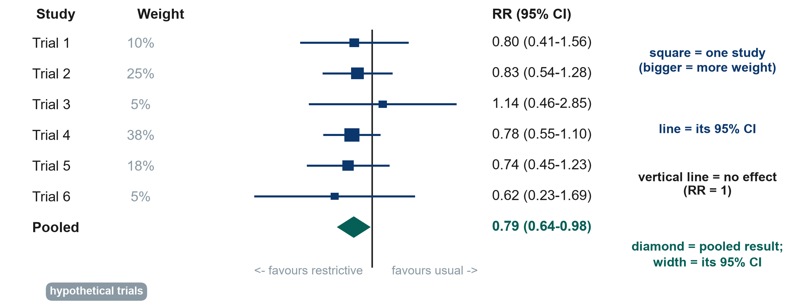

[Download the PDF](files/sessions/s4_exercises.pdf) · [Back to Session 4](session4.qmd)

**Foundations of Clinical Research** · Week 4 · Saturday · Neudata · #ClearDataClearImpact

This handout has six parts. You will not need a computer. For the calculations, simple division is enough. The instructor checks every answer with the 2×2 calculator.

| Part | Activity | When | How |
|---|---|---|---|
| A | Spot the bias (4 scenarios) | End of section 4.1 (4 min) | Whole room / alone |
| B | Confounding or effect modification? (3 scenarios) | Homework, or if 4.1 runs early | Alone or pairs |
| C | Two 2×2 calculations | After the break (20 min) | Alone, then check with a neighbour |
| D | PPV in two settings | Homework, or if 4.3 runs early | Alone |
| E | Read a forest plot and choose the risk-of-bias tool | Pair task in 4.3 (6 min) | Pairs |
| F | Proposal builder 4: exposure, outcomes and biases | End of the session (30 min) | Your group |

**Key words of the day:** bias · confounding · effect modification (interaction) · reverse causation · risk · risk ratio (RR) · risk difference (RD) · number needed to treat (NNT) · odds ratio (OR) · sensitivity · specificity · PPV / NPV · ROC curve · forest plot · I² · risk-of-bias tool.

* * *

## Part A: Spot the bias

**Instructions.** For each scenario, choose the **main** problem: **selection bias**, **recall bias**, **observer bias** or **confounding**. Then write **one practical way** to reduce it.

| # | Scenario | Main bias | One way to reduce it |
|---|---|---|---|
| 1 | In a case-control study, mothers of babies born with a birth defect remember the medicines they took during pregnancy in more detail than mothers of healthy babies. | | |
| 2 | In an unblinded trial of an early-mobilisation programme, the trial nurse who knows each patient's group decides whether the patient is "ready for discharge". | | |
| 3 | A study of quality of life after ICU recruits only the survivors who come back to the follow-up clinic. | | |
| 4 | In a registry, patients with higher lactate received more fluid and also died more often. The authors conclude that fluid increases mortality. | | |

* * *

## Part B: Confounding or effect modification?

**Instructions.** Each study splits its result by a third factor. Compare the strata **with each other** and **with the overall (crude) result**. Decide: **confounding**, **effect modification (interaction)** or **neither**. Then say what the authors should report.

> Rule of thumb: strata similar to each other but different from the crude result mean confounding. Strata different from each other mean effect modification.

| # | Study (hypothetical) | Overall RR | Stratum 1 | Stratum 2 | Your answer | What to report |
|---|---|---|---|---|---|---|
| 1 | Vasopressor X vs Y and death by day 28. Clinicians chose X mainly for patients with high lactate. | 1.80 | lactate < 4: RR 1.00 | lactate ≥ 4: RR 1.00 | | |
| 2 | Early mobilisation and ICU delirium | 0.70 | age < 65: RR 0.50 | age ≥ 65: RR 0.95 | | |
| 3 | Hand-hygiene programme and hospital infection | 0.80 | day shift: RR 0.80 | night shift: RR 0.79 | | |

* * *

## Part C: Two 2×2 calculations

**Instructions**

1. **Draw the 2×2 table first.** Exposure (or treatment) in **rows**, with the exposed/treated group on top. Outcome in **columns**, with "outcome yes" on the left.
2. Calculate only what is asked. Round to two decimals.
3. Write **one sentence** a colleague without research training would understand.

**Reminder**

| Measure | Formula (from the table a, b, c, d) |
|---|---|
| Risk in exposed / treated | a / (a + b) |
| Risk in unexposed / control | c / (c + d) |
| Risk ratio (RR) | risk exposed ÷ risk control |
| Risk difference (RD) | risk exposed − risk control |
| Number needed to treat (NNT) | 1 ÷ \|RD\| (RD written as a proportion, e.g. 0.05) |
| Odds ratio (OR) | (a × d) ÷ (b × c) |

### Calculation 1: a randomised trial

A trial randomised 400 adults on a medical ward to a new pressure-relieving mattress (200 patients) or a standard mattress (200 patients). A new pressure injury developed in **10** patients on the new mattress and in **20** patients on the standard mattress.

|  | Pressure injury: YES | Pressure injury: NO | Total |
|---|---|---|---|
| New mattress | a = | b = | |
| Standard mattress | c = | d = | |

1. Risk with the new mattress = ______  Risk with the standard mattress = ______
2. RR = ______  3. RD = ______  4. NNT = ______  5. OR = ______
6. Is the OR close to the RR here? Why?  ______________________________________
7. One sentence for a colleague: ____________________________________________

### Calculation 2: a case-control study

Investigators selected **40** ICU patients with candidaemia (cases) and **80** ICU patients without candidaemia (controls). They looked back for parenteral nutrition. Among the cases, **24** had received parenteral nutrition and 16 had not. Among the controls, **16** had received it and 64 had not.

|  | Cases (candidaemia) | Controls (no candidaemia) |
|---|---|---|
| Parenteral nutrition: YES | a = | b = |
| Parenteral nutrition: NO | c = | d = |

1. OR = ______
2. Why can you **not** calculate the risk of candidaemia, the RR or the NNT from this study?  ______________________________
3. One sentence for a colleague: ____________________________________________

*Note: in a case-control study the columns are the case and control groups. The OR formula (a × d) ÷ (b × c) stays the same.*

* * *

## Part D: PPV in two settings

**Instructions.** The same test has **sensitivity 90%** and **specificity 80%**. Complete each table for 500 people, then calculate PPV and NPV.

> Disease present = prevalence × 500. True positives = sensitivity × disease present. True negatives = specificity × disease absent.

**Setting 1: ICU, prevalence 20%**

|  | Disease present | Disease absent | Total |
|---|---|---|---|
| Test positive | TP = | FP = | |
| Test negative | FN = | TN = | |
| Total | | | 500 |

PPV = TP / (TP + FP) = ______  NPV = TN / (TN + FN) = ______

**Setting 2: screening, prevalence 2%**

|  | Disease present | Disease absent | Total |
|---|---|---|---|
| Test positive | TP = | FP = | |
| Test negative | FN = | TN = | |
| Total | | | 500 |

PPV = ______  NPV = ______

1. Why is the PPV so different when the test is the same? ________________________________
2. Calculate LR+ = sensitivity / (1 − specificity) = ______. Does it change between the settings? ______
3. Optional: repeat for a prevalence of 50%.

* * *

## Part E: Read a forest plot and choose the risk-of-bias tool (pair task)

The forest plot below is the one shown in section 4.3 (six hypothetical trials of restrictive vs usual fluids; outcome death; fixed-effect pooling).

| Trial | Restrictive: died / total | Usual care: died / total |
|---|---|---|
| Trial 1 | 12 / 60 | 15 / 60 |
| Trial 2 | 30 / 150 | 36 / 150 |
| Trial 3 | 8 / 40 | 7 / 40 |
| Trial 4 | 45 / 250 | 58 / 250 |
| Trial 5 | 20 / 100 | 27 / 100 |
| Trial 6 | 5 / 30 | 8 / 30 |

**Reading the plot**

1. Which trial carries the most weight? Why?  ______________________
2. Does any single trial show a clear effect (a 95% CI that does not cross 1)?  ______________________
3. Does the pooled diamond cross RR = 1? Write the pooled result in one plain sentence.  ______________________
4. Trial 3 points the other way (RR 1.14). Should it worry you? Why or why not?  ______________________

**Choosing the tool.** For each study, choose the risk-of-bias tool: **RoB 2**, **ROBINS-I**, **Newcastle–Ottawa (or ROBINS-E)**, **QUADAS-2** or **AMSTAR 2**.

| # | Study | Tool |
|---|---|---|
| a | Boulet 2024: randomised trial of restrictive vs usual fluids | |
| b | Hyun 2023: registry cohort, positive vs negative fluid balance | |
| c | Before–after study of a central-line bundle on one unit | |
| d | Point-of-care lactate compared with the laboratory reference test for detecting hyperlactataemia | |
| e | Systematic review and meta-analysis of fluid-restriction trials | |
| f | Cluster-randomised trial of a hand-hygiene programme (12 wards) | |

* * *

## Part F: Proposal builder 4 (exposure, outcomes and biases)

**Instructions.** Complete the rest of Part 2 of your proposal (rows 1–3 were written in Session 3), then copy it into the template. For every outcome write **what**, **how** and **when**.

**Our research question:** _______________________________________________

| # | Section | What to write | Our answer |
|---|---|---|---|
| 4 | **Exposure / intervention** and **comparator** | What exactly is the exposure or intervention, and how is it defined or measured? Who is the comparison group? | |
| 5 | **Outcomes** | **ONE primary outcome**: what it is, how and when it is measured. **2–3 secondary outcomes.** | |
| 6 | **Main biases and how we reduce them** | Name at least **two** threats (selection, information, confounding) and the step in your design that reduces each. | |

**Our claim at the end will be:** ☐ "caused" (randomised design) ☐ "associated with" (observational design), because ____________________

**Group self-check before you finish**

- [ ] There is a comparison group, or we explain why our study is descriptive.
- [ ] There is only ONE primary outcome, with a method and a time point.
- [ ] If our design is observational, we have named the main confounders (think: confounding by indication).
- [ ] Each bias has a concrete mitigation step ("we will be careful" is not a mitigation).
- [ ] Part 2 is complete: design, setting, population (Session 3) + exposure, comparator, outcomes, biases (today).
