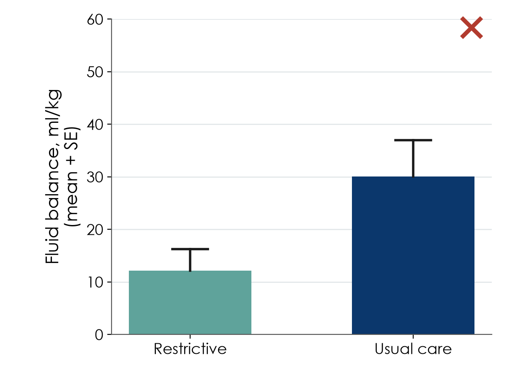

📥 [PDF](files/sessions/s5_exercises.pdf) · [Session page](session5.qmd)

**Foundations of Clinical Research** · Weekend 3, Saturday · Neudata · #ClearDataClearImpact

Work with your neighbour or group as indicated. No calculator is needed: every exercise is about *choosing* and *interpreting*. Exercises marked **[DS]** use the course dataset FLUID-ICU (simulated) and your group's results pack in `Course/Data/results_packs/`. Exercise 8 becomes part of your proposal (Part 3).

| # | Exercise | When | Time |
|---|---|---|---|
| 1 | Classify the variables | 5.1 pair task | 3 min |
| 2 | Fix the bad CRF items | 5.1 pair task | 3 min |
| 3 | Choose the right summary | 5.3 check / homework | 3 min |
| 4 | Judge a bad figure | homework | 5 min |
| 5 | [DS] Spot the problems in the raw FLUID-ICU data | homework (after the 5.2 demo) | 5 min |
| 6 | [DS] Read your group's Table 1 | 5.4 group worksheet | 10 min |
| 7 | [DS] Your group's question | 5.2 group task | 4 min |
| 8 | Proposal builder 5 worksheet | proposal builder | 30 min |

* * *

## Exercise 1 — Classify the variables

For each variable, tick **one** type.

| # | Variable (ICU study of septic shock) | Continuous | Count | Binary | Nominal | Ordinal | Time-to-event |
|---|---|:-:|:-:|:-:|:-:|:-:|:-:|
| a | Age at ICU admission (years) | ☐ | ☐ | ☐ | ☐ | ☐ | ☐ |
| b | Sex (male / female) | ☐ | ☐ | ☐ | ☐ | ☐ | ☐ |
| c | Glasgow Coma Scale on admission (3–15) | ☐ | ☐ | ☐ | ☐ | ☐ | ☐ |
| d | Main source of sepsis (lung / urine / abdomen / skin / other) | ☐ | ☐ | ☐ | ☐ | ☐ | ☐ |
| e | Number of vasopressors running at 24 h (0, 1, 2, 3) | ☐ | ☐ | ☐ | ☐ | ☐ | ☐ |
| f | Cumulative fluid balance at day 5 (ml/kg) | ☐ | ☐ | ☐ | ☐ | ☐ | ☐ |
| g | Alive at day 28 (yes / no) | ☐ | ☐ | ☐ | ☐ | ☐ | ☐ |
| h | Time from ICU admission to death (patients alive at day 28 are censored) | ☐ | ☐ | ☐ | ☐ | ☐ | ☐ |
| i | Pain: none / mild / moderate / severe | ☐ | ☐ | ☐ | ☐ | ☐ | ☐ |
| j | Blood group (A, B, AB, O) | ☐ | ☐ | ☐ | ☐ | ☐ | ☐ |

**Bonus:** which ONE of these would you most like to collect as an exact number rather than in groups, and why?

* * *

## Exercise 2 — Fix the bad CRF items

Each item below can be filled in two different ways by two different nurses. Rewrite it so that it has **only one possible reading**. Check yourself: unit? time point? one answer only? an "unknown / not done" option?

| # | Bad item | What is wrong? | Your rewritten item |
|---|---|---|---|
| a | Fluid given: ________ | | |
| b | Weight: ______ | | |
| c | Comorbidities: ______________________ | | |
| d | Lactate high?   Y / N | | |

* * *

## Exercise 3 — Choose the right summary

For each variable, choose the summary you would report in Table 1 and the best graph.

| # | Variable (200 ICU patients) | Shape / type | Summary | Graph |
|---|---|---|---|---|
| a | Age (years), bell-shaped | | | |
| b | ICU length of stay (days): most 1–5 days, a few > 30 days | | | |
| c | Died in hospital (yes / no) | | | |
| d | C-reactive protein (mg/L): long right tail | | | |
| e | Source of sepsis (5 categories) | | | |
| f | Systolic blood pressure, compared between two treatment groups | | | |

* * *

## Exercise 4 — Judge a bad figure

A poster in the hospital corridor shows this figure (fluid balance at day 5, 24 patients per group):

1. What does each bar show, and what does the error bar show? What is missing?
2. Name **two things the reader cannot see** in this figure.
3. Redraw it (sketch) the way you would show it in a paper. What do you gain?

A second poster shows ward mortality as bars of 31% (Ward A) and 29% (Ward B), with the y-axis running from 28% to 32%.

4. What impression does it give, and how would you fix it?
5. A third poster puts hand-hygiene compliance (%) and infection rate on one graph with two different y-axes and writes "hygiene works!". Give two reasons to be careful.

* * *

## Exercise 5 — [DS] Spot the problems in the raw FLUID-ICU data

Below are six cells copied from the raw file `Course/Data/fluid_icu_raw.csv` (as the four ICUs sent it). For each, say what is wrong and what the cleaning script should do.

| # | Column | Value in the raw file | What is wrong? | What should the script do? |
|---|---|---|---|---|
| a | sex | `m`, `male`, ` Female` | | |
| b | admission date | `14/03/2023` in one row, `14-Mar-2023` in another | | |
| c | lactate (ICU C) | `23.4` | | |
| d | lactate | `999` | | |
| e | age | `210` | | |
| f | patient ID | `FLU-139` appears in two identical rows | | |

Bonus: why must the raw file never be edited by hand? Name two things the cleaning log records for every change.

* * *

## Exercise 6 — [DS] Read your group's Table 1 (results pack)

Open your group's results pack (`Course/Data/results_packs/Results_Pack_Qn.docx`, Table 1: baseline characteristics by fluid-balance group).

1. How many patients are in each column? Why is the overall number 618 and not 620?
2. For **three** variables, write the summary used (mean (SD), median (IQR) or n (%)) and why.

| Variable | Summary used | Why this summary? |
|---|---|---|
| | | |
| | | |
| | | |

3. Were the two groups alike at the start? Name the **biggest** difference between the negative- and positive-balance groups.
4. Which variable has the most missing values, and how many?
5. Write **two sentences** describing the patients, as they would appear at the start of your Results section (numbers in brackets, no p-values).

> ______________________________________________________________________________

6. Looking at this table, would you expect the crude association between positive fluid balance and death to be larger or smaller than the adjusted one? Why?

* * *

## Exercise 7 — [DS] Your group's question (5.2)

| | Your answer |
|---|---|
| Group question (Q1–Q5), copied from page 1 of your results pack | |
| **P** — population | |
| **E** — exposure (variable name in the data dictionary) and its type | |
| **C** — comparator | |
| **O** — outcome (variable name) and its type | |
| One-sentence research question | |
| Which test will compare the groups? Which model will adjust? (guess now, check in Session 6) | |

* * *

## Exercise 8 — Proposal builder 5 worksheet (group, 30 minutes)

Write your answers here first, then copy them into Part 3 of the group proposal template. (Your **own** question, not the course dataset.)

### 8.1 Variables table (8 min)

| Role | Variable | How measured (unit, time point) | Type |
|---|---|---|---|
| Primary outcome | | | |
| Secondary outcome (optional) | | | |
| Exposure / intervention | | | |
| Confounder 1 | | | |
| Confounder 2 | | | |
| Confounder 3 | | | |
| Descriptive (e.g. age, sex) | | | |

*Tip: if your design is an RCT, confounders are less of a problem (randomisation), but list the key baseline variables you will show in Table 1.*
### 8.2 Mini-CRF: 6–10 items (10 min)

| # | Question exactly as the data collector will read it | Answer format (boxes / ticks / unit) | "Unknown / not done" option? |
|---|---|---|:-:|
| 1 | | | ☐ |
| 2 | | | ☐ |
| 3 | | | ☐ |
| 4 | | | ☐ |
| 5 | | | ☐ |
| 6 | | | ☐ |
| 7 | | | ☐ |
| 8 | | | ☐ |
### 8.3 Data dictionary: 3–5 rows + one data-quality rule (6 min)

| Variable name | Label (meaning) | Type | Unit / codes | Allowed values |
|---|---|---|---|---|
| | | | | |
| | | | | |
| | | | | |

**Data-quality plan (one or two sentences):** who checks the forms, how often, and what range/consistency check you will run.

> ______________________________________________________________________________

### 8.4 Data-management plan (6 min)

| Question | Our answer |
|---|---|
| Paper CRF with double data entry, or electronic data capture (e.g. REDCap / KoBoToolbox)? | |
| Coded study IDs? Where is the linking log kept, and who can open it? | |
| Validation rules at entry (two examples from your data dictionary) | |
| Audit trail / cleaning log: who records changes? | |
| Backups (3-2-1) and data-sharing statement in the consent form | |
