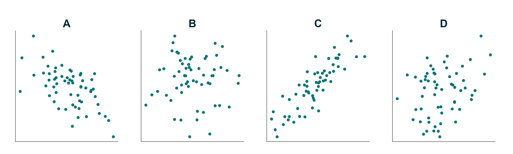
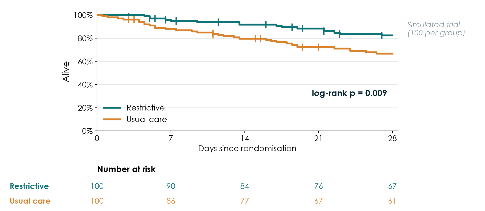

📥 [PDF](files/sessions/s6_exercises.pdf) · [Session page](session6.qmd)

**Foundations of Clinical Research** · Week 6, Saturday · Neudata · #ClearDataClearImpact

No calculator is needed. Exercises marked **[DS]** use the course dataset FLUID-ICU (simulated) and your group's results pack; your answers to Exercises 4 and 8 become the core of your manuscript's Results (Session 7). Exercise 9 completes Part 3 of your proposal.

| # | Exercise | When | Time |
|---|---|---|---|
| 1 | True or false: CIs, p-values and multiple tests | 6.1 / homework | 5 min |
| 2 | Choose the test | 6.1 check / homework | 5 min |
| 3 | Match r to the scatter plots | homework | 3 min |
| 4 | [DS] Interpret your group's comparison | 6.2 group worksheet | 7 min |
| 5 | Read a regression table | 6.3 check (pairs) | 5 min |
| 6 | Read a Kaplan–Meier curve | homework | 5 min |
| 7 | Why is it missing? MCAR, MAR or MNAR | homework | 5 min |
| 8 | [DS] Interpret your group's model | 6.4 group worksheet | 7 min |
| 9 | Proposal builder 6 worksheet | proposal builder | 30 min |

Figures for Exercises 3 and 6 are in `Resources/figures/en/sat3/` (Vietnamese versions in `.../vi/sat3/`).

* * *

## Exercise 1 — True or false: confidence intervals, p-values and multiple tests

Circle **T** (true) or **F** (false). Be ready to explain each "false" in one sentence.

| # | Statement | |
|---|---|:-:|
| 1 | Paper 2 reports HR 2.13 (95% CI 1.48 to 3.06). The data are compatible with a true hazard ratio anywhere from about 1.5 to about 3.1. | T / F |
| 2 | Paper 1 found p = 0.42 for fluid balance, so the restrictive strategy has no effect on fluid balance. | T / F |
| 3 | p = 0.03 means there is a 3% probability that the null hypothesis (no difference) is true. | T / F |
| 4 | If the 95% CI for a difference between two means includes 0, the p-value is greater than 0.05. | T / F |
| 5 | Other things being equal, a larger study gives a narrower confidence interval. | T / F |
| 6 | p < 0.001 proves that the effect is large and clinically important. | T / F |
| 7 | If we repeated the same study many times, about 95% of the 95% CIs would contain the true value. | T / F |
| 8 | A "negative" result (p > 0.05) in a small pilot trial could be a type II error. | T / F |
| 9 | Alpha (usually 5%) is the risk we accept of concluding there is an effect when there really is none. | T / F |
| 10 | p = 0.06 shows "a trend towards significance". | T / F |
| 11 | If you test 20 different outcomes and none has a real effect, you will usually still find at least one with p < 0.05. | T / F |
| 12 | Lactate measured in the same 40 patients at admission and 6 hours later should be compared with an unpaired t-test. | T / F |

* * *

## Exercise 2 — Choose the test

Use the decision chart from the slides (outcome type → shape or counts → paired or not). Write the test and one reason.

| # | Scenario | Test | Why? |
|---|---|---|---|
| a | Mean systolic blood pressure (roughly bell-shaped) in 60 patients on drug A vs 60 on drug B. | | |
| b | ICU length of stay (skewed) in the restrictive-fluid group vs the usual-care group, 24 patients each. | | |
| c | 28-day mortality (yes/no) in 200 patients with a positive fluid balance vs 200 with a negative balance. | | |
| d | Acute kidney injury needing dialysis: 2 of 24 patients in one group vs 5 of 24 in the other. | | |
| e | Serum lactate at ICU admission and 6 hours later in the same 40 patients (the changes are roughly symmetric). | | |
| f | Pressure injury (yes/no) in the same 80 patients assessed before and after a new turning protocol. | | |

* * *

## Exercise 3 — Match r to the scatter plots

Match each plot (A–D) to one correlation coefficient: **r = 0.86**, **r = 0.30**, **r = 0.01**, **r = −0.58**.

| Plot | r |
|---|---|
| A | |
| B | |
| C | |
| D | |

Bonus: a bedside glucose meter and the laboratory have r = 0.97 in 50 patients. Can the meter replace the laboratory? What would you look at instead?

* * *

## Exercise 4 — [DS] Interpret your group's comparison (6.2)

Use the comparison table in your results pack.

| | Your answer |
|---|---|
| Outcome and its type | |
| Test used, and why this test | |
| Result in the negative-balance group (n (%) or median (IQR)) | |
| Result in the positive-balance group | |
| Effect with 95% CI (difference, risk difference, ratio or Hodges–Lehmann difference) | |
| p-value | |
| One reason this unadjusted comparison could be biased | |

**Your Results sentence** (no "significant" on its own, no causal words):

> ______________________________________________________________________________

* * *

## Exercise 5 — Read a regression table

A (mock) cohort study of 600 adults admitted to a medical ICU asked which factors are associated with **hospital-acquired delirium** (yes/no) during the ICU stay.

**Table 3. Multivariable logistic regression: factors associated with delirium**

| Variable | Adjusted OR | 95% CI | p-value |
|---|:-:|:-:|:-:|
| Benzodiazepine infusion (yes vs no) | 2.10 | 1.40 – 3.20 | < 0.001 |
| Age (per 10 years) | 1.30 | 1.12 – 1.51 | < 0.001 |
| Mechanical ventilation (yes vs no) | 1.60 | 0.95 – 2.70 | 0.08 |
| Female sex (vs male) | 0.85 | 0.60 – 1.20 | 0.36 |
| Pre-existing dementia (yes vs no) | 3.40 | 1.90 – 6.10 | < 0.001 |
| Sleep protocol: eye masks + earplugs (yes vs no) | 0.62 | 0.41 – 0.94 | 0.02 |

*Adjusted for all variables in the table and for APACHE II score.*

**Authors' conclusion:** *"Benzodiazepines cause delirium in ICU patients. Mechanical ventilation showed a trend towards more delirium (p = 0.08). Our sleep protocol reduces delirium by 38%."*

Questions:

1. What type of outcome is this, and why was logistic regression used?
2. What is the "no effect" value for the numbers in this table?
3. For each row, does the 95% CI include the no-effect value? Mark ✔ (excludes) or ✖ (includes).
4. Write **one plain-language sentence** for the benzodiazepine row.
5. Interpret the age row: what does "1.30 per 10 years" mean for a patient 20 years older?
6. Which rows are compatible with no association?
7. Find **three** problems in the authors' conclusion.

* * *

## Exercise 6 — Read a Kaplan–Meier curve

A (simulated) trial randomised 200 adults with septic shock to a restrictive fluid strategy or usual care and followed them for 28 days.

1. Approximately what proportion of patients in each group were alive at day 28?
2. What do the small vertical ticks on the curves mean?
3. How many patients in the usual-care group were still being followed (at risk) at day 21? Why does the number fall even in a group where few patients die?
4. What does "log-rank p = 0.009" tell you? What does it **not** tell you?
5. Which model would give a hazard ratio with a 95% CI, and what assumption would you check by looking at the curves?
6. Would you be happy if the authors had shown this figure **without** the numbers at risk? Why?

* * *

## Exercise 7 — Why is it missing? MCAR, MAR or MNAR

For each scenario, choose the most likely mechanism (**MCAR**, **MAR** or **MNAR**) and say what it means for a complete-case analysis.

| # | Scenario | Mechanism | Consequence for complete-case analysis |
|---|---|---|---|
| a | 12 blood samples for lactate were lost when a courier box was dropped. | | |
| b | Weight is missing more often in patients admitted at night; admission time is recorded for everyone. | | |
| c | Pain scores are missing for the patients in most pain, who could not complete the questionnaire. | | |
| d | Day-28 status is missing for patients transferred to another hospital, often because they were deteriorating. | | |
| e | A form version used in the first month did not include the "smoking" question. | | |
| f | Older patients are less likely to return a quality-of-life questionnaire at 3 months; age is recorded for all. | | |

*(How to test whether missing data change the answer — sensitivity analyses — is covered hands-on in Level 2.)*

* * *

## Exercise 8 — [DS] Interpret your group's model: crude vs adjusted, complete case vs imputation (6.4)

Use the regression table and the missing-data table in your results pack.

**Part A — crude vs adjusted**

| | Estimate | 95% CI | n |
|---|---|---|---|
| Crude | | | |
| Adjusted | | | |

1. Which confounders were in the adjusted model? Were they chosen before the analysis (look at the SAP)?
2. How much did the estimate move after adjustment, and in which direction? What does that tell you about confounding by indication?
3. Does the adjusted 95% CI include the "no effect" value (1 for a ratio, 0 for a difference)?

**Part B — complete case vs multiple imputation** *(read the result from your pack; it was produced by the example script `Course/Data/R/05_missing.R`. How imputation works is covered in Level 2.)*

4. How many patients were in the complete-case model, and how many in the multiple-imputation model? Who was left out of the complete-case analysis?
5. Is the multiple-imputation estimate close to the complete-case estimate?

**Part C — (Q1 only) Kaplan–Meier and Cox**

6. Survival at day 28 in each group; the log-rank p; the adjusted Cox HR with its 95% CI. Why do the logistic (p = 0.044) and Cox (p = 0.053) results tell the same story?

**Your two Results sentences** (crude, then adjusted, with CIs; "associated with", not "caused"):

> ______________________________________________________________________________

* * *

## Exercise 9 — Proposal builder 6 worksheet (group, 30 minutes)

Your **own** question again. Copy the answers into Part 3 of the proposal template.

### 9.1 Sample-size statement (8 min)

| Input | Your value | Source (paper, audit, pilot, clinical judgement) |
|---|---|---|
| Expected value in the comparison group (proportion or mean) | | |
| Smallest difference worth detecting | | |
| SD (only for a numerical outcome) | | |
| Alpha (two-sided) | 5% | convention |
| Power | 80% / 90% | |
| Expected drop-out | | |

**Sentence** (use the spreadsheet `Resources/tools/sample_size_calculator.xlsx` or ask the facilitator):

> Assuming ______ in the control group and ______ in the intervention group, ______ patients per group give ____% power at a two-sided alpha of 5%; allowing ____% loss, we will recruit ______ patients in total.
### 9.2 Plain-language analysis plan (10 min)

| Step | What we will do |
|---|---|
| Describe the patients (Table 1) | Numerical symmetric variables as ______; skewed as ______; categories as ______ |
| Compare the primary outcome | Test: ______ because the outcome is ______ |
| Report the effect | Effect measure (difference / RR / OR / HR) with 95% CI: ______ |
| Deal with confounding (observational designs only) | We will adjust for: ______ using ______ (e.g. logistic regression) |
| Missing data | We will report how many values are missing for each variable and prevent it by: ______ |

### 9.3 Confounders (5 min)

| Confounder | Why it is a confounder (linked to exposure AND outcome, not caused by the exposure) |
|---|---|
| | |
| | |
| | |

Expected number of events: ____ → maximum number of model terms (about 1 per 10 events): ____

### 9.4 Missing-data plan (7 min)

| Question | Our answer |
|---|---|
| Which variables are most likely to be missing, and why? (MCAR / MAR / MNAR thinking) | |
| How will we prevent it? (form design, training, weekly checks, chasing outcome status) | |
| Which variables may be missing, and why? | |
| How missing data will be reported (how many, in whom) | |
| How will we report missingness? (n missing per variable, flow diagram) | |
