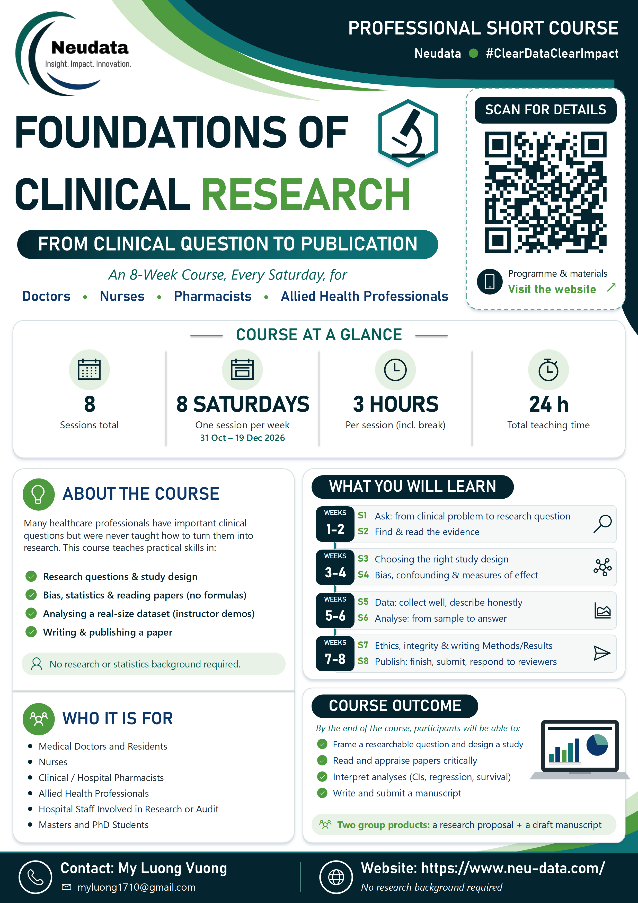

::: {.course-hero}
# Foundations of Clinical Research · Level 1
From Clinical Question to Publication

::: {.badges}
[Level 1]{} [8 sessions]{} [4 weekends (Sat + Sun)]{} [24 contact hours]{} [No software needed]{} [EN + VN]{}
:::

[Schedule](schedule.qmd){.btn .btn-light role="button"} [Get your free access code](access.qmd){.btn .btn-light role="button"}
:::

{.float-end width="34%" style="margin:0 0 1rem 1.5rem" fig-alt="Course poster"}

```{=html}
<div class="facts"><div><strong>Format</strong><span>8 sessions × 3 hours</span></div><div><strong>When</strong><span>4 weekends, Saturday + Sunday</span></div><div><strong>For</strong><span>Doctors, nurses, pharmacists</span></div><div><strong>Software</strong><span>None — trainers run the analyses</span></div></div>
```

## About this course

Clinical staff make decisions every day that research could improve — but few have been taught how to turn a bedside uncertainty into a published study. Over **four weekends (eight 3-hour sessions)** this course walks the **whole road of research**: asking a good question, finding and reading the evidence, choosing a design, recognising bias, collecting and analysing data, protecting participants, writing the paper and getting it published.

- **Slow and visual.** Built for participants with no research background: pictures first, a "check your understanding" every 20 minutes, no formulas beyond a 2×2 table, and extra slides at the end of each session for anyone who wants to read further at home.
- **The whole road in one course.** Weekends 1–2 build understanding and design skills; Weekends 3–4 analyse a realistic **simulated dataset (FLUID-ICU, 620 ICU patients)** through live instructor demos in R, and write it up as a manuscript.
- **Level 1 of three.** This course is **Level 1**. **Level 2** is a separate hands-on course in R for those who want to run analyses themselves (in preparation); **Level 3** covers advanced, specialised methods on request. See [Course levels](levels.qmd).
- **One running example:** fluids in septic shock — asked and searched, designed, analysed, written up and published, and appraised through two real papers.

## Four weekends, eight sessions

| Weekend | Session |
|:--:|:--|
| 1 | [Session 1 · Ask: from clinical problem to research question](session1.qmd) |
| 1 | [Session 2 · Find & read: the evidence](session2.qmd) |
| 2 | [Session 3 · Design: choosing the right study](session3.qmd) |
| 2 | [Session 4 · Bias & effect: can we trust it, how big is it?](session4.qmd) |
| 3 | [Session 5 · Data: collect it well, describe it honestly](session5.qmd) |
| 3 | [Session 6 · Analyse: from sample to answer](session6.qmd) |
| 4 | [Session 7 · Protect & write: ethics, integrity, Methods and Results](session7.qmd) |
| 4 | [Session 8 · Publish: finish the paper, get it out, present](session8.qmd) |

[Schedule →](schedule.qmd)

## Two group products

```{=html}
<div class="cards2"><div><h4>1 · A research proposal</h4><p>On your group's <strong>own clinical question</strong>, built one part per weekend with the proposal template and <strong>presented in Session 8</strong> (6 minutes + 2 minutes feedback), with a publication plan.</p></div><div><h4>2 · A draft manuscript</h4><p>From the course dataset <strong>FLUID-ICU</strong>: each group answers a different question with its results pack, drafts Methods and Results in Session 7 and the rest in Session 8. After the course, groups <strong>peer review</strong> each other's drafts and reply like real authors.</p></div></div>
```

## Who it is for

A whole hospital department (about 30 staff): **doctors, residents, nurses and pharmacists**, working in **5 groups of about 6** that stay together for all eight sessions. No research or statistics background is assumed, and no software is needed: the trainers run the analyses and you learn to read, interpret and write them up. The course is generic and can be delivered to any hospital department.

## How to start

1. Request your free [access code](access.qmd) (once per browser).
2. Read the [participant handbook](handbook.qmd) and look at the [schedule](schedule.qmd).
3. Each [session page](session1.qmd) has the agenda, the slides, the exercise sheet and what to prepare.

## Trainers

```{=html}
<div class="cards2"><div><h4>Vương Mỹ Lượng</h4><p>Senior Biostatistician, Neudata</p></div><div><h4>Bernard Osang'ir</h4><p>Senior Biostatistician, Neudata</p></div></div>
```

## Contact

Questions about the course: **Vương Mỹ Lượng** — [myluong1710@gmail.com](mailto:myluong1710@gmail.com).

Neudata Consulting Ltd · [www.neu-data.com](https://www.neu-data.com)
