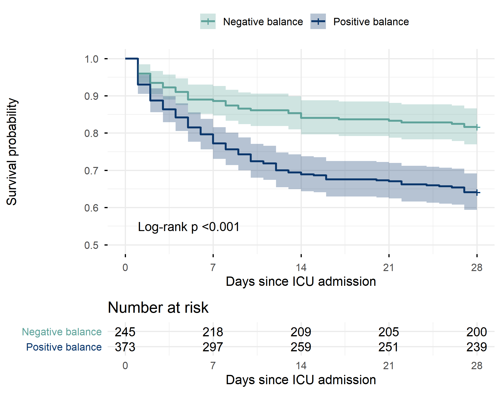
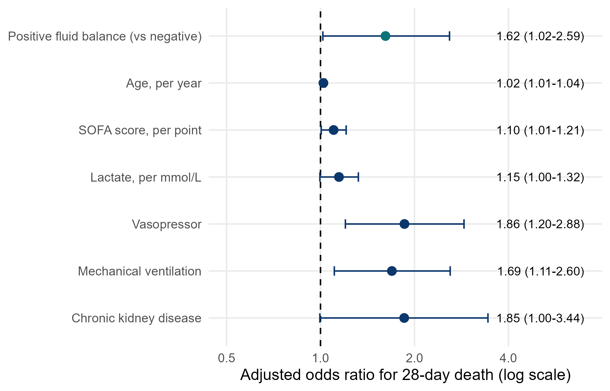
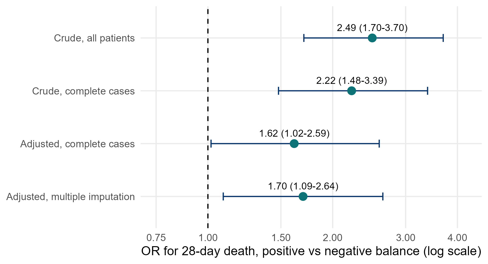
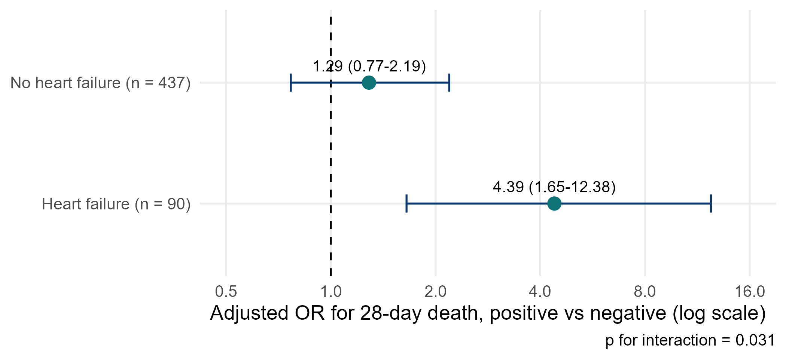

::: {.simulated}
**Simulated data, not real patients.** FLUID-ICU is an invented study: every value was produced by a computer program with a fixed random seed. It does not describe any real patient, hospital or ICU. Any manuscript written from it must say that the data are simulated and must never be submitted as real research.
:::

Download: [Word](files/data/results_packs/Results_Pack_Q1.docx) · [PDF](files/data/results_packs/Results_Pack_Q1.pdf) · [zip (Markdown, tables, figures)](files/data/results_packs/Results_Pack_Q1.zip) · [Back to the course dataset](dataset.qmd)

> **SIMULATED DATA: NOT REAL PATIENTS.** FLUID-ICU was generated by computer for this course. Write your manuscript as a training exercise and state clearly that the data are simulated.

## 1. The question

**In adults with sepsis in the ICU, is a positive cumulative fluid balance by day 3 associated with higher 28-day mortality?**

## 2. Design and data

- Design: multicentre prospective cohort study (observational).
- Setting: 4 ICUs (ICU A-D), consecutive adults with sepsis, enrolment January 2023 to December 2024.
- Exposure: positive cumulative fluid balance at day 3 (fluid in minus fluid out over ICU days 1-3 > 0 ml/kg) vs negative or zero balance.
- Outcome: death from any cause within 28 days of ICU admission (died_28d); time to death for survival analysis (time_to_event_28d, censored at day 28).
- Analysis sample: 618 of 620 patients (2 without a day-3 balance). Adjusted models: 527 complete cases.
- Pre-specified confounders (SAP): age, SOFA score, lactate, vasopressor, mechanical ventilation, chronic kidney disease.
- Software: R 4.6 (packages gtsummary, survival, mice). Scripts: Course/Data/R/.

Participant flow: 620 patients enrolled -> 2 without a day-3 fluid balance (weight or output missing after cleaning) -> 618 in the exposure analysis -> 91 without lactate (or age) -> 527 in the complete-case adjusted model.

## 3. Table 1: who was studied

**Table 1. Baseline characteristics by fluid-balance group**

|Characteristic               |Overall   N = 618 |Negative balance   N = 245 |Positive balance   N = 373 |
|:----------------------------|:-----------------|:--------------------------|:--------------------------|
|Age, years                   |62.6 (15.2)       |64.6 (15.0)                |61.4 (15.2)                |
|&emsp;Missing                |1                 |1                          |0                          |
|Sex                          |                  |                           |                           |
|&emsp;Female                 |243 (39%)         |102 (42%)                  |141 (38%)                  |
|&emsp;Male                   |375 (61%)         |143 (58%)                  |232 (62%)                  |
|Weight, kg                   |64.7 (11.9)       |65.1 (12.4)                |64.4 (11.6)                |
|Diabetes                     |158 (26%)         |70 (29%)                   |88 (24%)                   |
|Chronic kidney disease       |64 (10%)          |28 (11%)                   |36 (9.7%)                  |
|Heart failure                |97 (16%)          |54 (22%)                   |43 (12%)                   |
|Hypertension                 |282 (46%)         |124 (51%)                  |158 (42%)                  |
|Source of infection          |                  |                           |                           |
|&emsp;Respiratory            |267 (43%)         |101 (41%)                  |166 (45%)                  |
|&emsp;Urinary                |126 (20%)         |54 (22%)                   |72 (19%)                   |
|&emsp;Abdominal              |106 (17%)         |46 (19%)                   |60 (16%)                   |
|&emsp;Skin/soft tissue       |57 (9.2%)         |18 (7.3%)                  |39 (10%)                   |
|&emsp;Other                  |62 (10%)          |26 (11%)                   |36 (9.7%)                  |
|SOFA score                   |7 (5, 9)          |6 (4, 8)                   |8 (6, 10)                  |
|APACHE II score              |19 (15, 24)       |17 (12, 21)                |20 (17, 25)                |
|&emsp;Missing                |6                 |3                          |3                          |
|Lactate, mmol/L              |2.6 (1.7, 3.7)    |2.2 (1.4, 3.0)             |2.9 (1.9, 4.0)             |
|&emsp;Missing                |91                |50                         |41                         |
|Mean arterial pressure, mmHg |73 (66, 80)       |76 (70, 84)                |71 (65, 78)                |
|&emsp;Missing                |4                 |1                          |3                          |
|Vasopressor on admission     |266 (43%)         |61 (25%)                   |205 (55%)                  |
|Mechanical ventilation       |313 (51%)         |97 (40%)                   |216 (58%)                  |

*Mean (SD); n (%); median (Q1, Q3). Missing = number of patients without that value.*

Files: `tables/table1_by_balance.csv` and `tables/table1_by_balance.docx`

Read Table 1 first: the positive-balance group was **sicker** at baseline: median SOFA 8 (6 to 10) vs 6 (4 to 8), vasopressor 205/373 (55.0%) vs 61/245 (24.9%). This is confounding by indication: sicker patients receive more fluid AND die more.

## 4. Main results

**Table 2. 28-day mortality by fluid-balance group (unadjusted)**

|Outcome                              |Negative balance |Positive balance |Effect (95% CI)                                     |
|:------------------------------------|:----------------|:----------------|:---------------------------------------------------|
|Died by day 28, n/N (%)              |45/245 (18.4%)   |134/373 (35.9%)  |Risk difference 17.6 (95% CI 10.7 to 24.4); RR 1.96 |
|Survival at day 28 (Kaplan-Meier), % |81.6             |64.1             |Log-rank p <0.001                                   |

Files: `tables/table2_outcome.csv` and `tables/table2_outcome.docx`

**Table 3. Logistic regression for 28-day death: crude and adjusted odds ratios (adjusted model n = 527)**

|Variable                             |Crude OR (95% CI)   |Crude p |Adjusted OR (95% CI) |Adjusted p |
|:------------------------------------|:-------------------|:-------|:--------------------|:----------|
|Positive fluid balance (vs negative) |2.49 (1.70 to 3.70) |<0.001  |1.62 (1.02 to 2.59)  |0.044      |
|Age, per year                        |1.02 (1.01 to 1.03) |<0.001  |1.02 (1.01 to 1.04)  |0.002      |
|SOFA score, per point                |1.26 (1.18 to 1.35) |<0.001  |1.10 (1.01 to 1.21)  |0.039      |
|Lactate, per mmol/L                  |1.38 (1.23 to 1.55) |<0.001  |1.15 (1.00 to 1.32)  |0.059      |
|Vasopressor                          |3.31 (2.31 to 4.78) |<0.001  |1.86 (1.20 to 2.88)  |0.005      |
|Mechanical ventilation               |2.98 (2.07 to 4.34) |<0.001  |1.69 (1.11 to 2.60)  |0.016      |
|Chronic kidney disease               |2.58 (1.52 to 4.36) |<0.001  |1.85 (1.00 to 3.44)  |0.050      |

Files: `tables/table3_logistic.csv` and `tables/table3_logistic.docx`

- Crude OR (all 618 patients): **2.49 (95% CI 1.70 to 3.70)**, p <0.001.
- Crude OR in the same 527 complete cases: 2.22 (95% CI 1.48 to 3.39).
- Adjusted OR (age, SOFA, lactate, vasopressor, ventilation, CKD): **1.62 (95% CI 1.02 to 2.59)**, p 0.044.
- Kaplan-Meier survival at day 28: 81.6% (negative) vs 64.1% (positive); log-rank p <0.001.
- Cox hazard ratio: crude 2.17 (95% CI 1.55 to 3.05); adjusted **1.46 (95% CI 1.00 to 2.13)**, p 0.053 (proportional-hazards test, global p = 0.10).

**Table 4. Cox regression for time to death within 28 days**

|Model                                |n   |Events |HR (95% CI)         |p      |
|:------------------------------------|:---|:------|:-------------------|:------|
|Crude                                |618 |179    |2.17 (1.55 to 3.05) |<0.001 |
|Adjusted (pre-specified confounders) |527 |161    |1.46 (1.00 to 2.13) |0.053  |

Files: `tables/table4_cox.csv` and `tables/table4_cox.docx`

*Figure 1. Kaplan-Meier survival to day 28 by fluid-balance group, with numbers at risk* (`figures/fig1_km_balance.png`)

*Figure 2. Adjusted odds ratios for 28-day death (forest plot)* (`figures/fig2_forest_adjusted.png`)

*Figure 3. The odds ratio for positive balance before and after adjustment* (`figures/fig3_crude_vs_adjusted.png`)

## 5. Other analyses

**Table 5. Pre-specified effect modification by heart failure**

|Subgroup         |Deaths, negative balance |Deaths, positive balance |Adjusted OR (95% CI) |p for interaction |
|:----------------|:------------------------|:------------------------|:--------------------|:-----------------|
|No heart failure |34/191 (18%)             |108/330 (33%)            |1.29 (0.77 to 2.19)  |0.031             |
|Heart failure    |11/54 (20%)              |26/43 (60%)              |4.39 (1.65 to 12.38) |0.031             |

Files: `tables/table5_interaction_hf.csv` and `tables/table5_interaction_hf.docx`

*Figure 4. Odds ratio for positive balance in patients with and without heart failure* (`figures/fig4_interaction_hf.png`)

**Table 6. Sensitivity analyses for the primary association**

|Analysis                               |n   |OR (95% CI)         |p      |
|:--------------------------------------|:---|:-------------------|:------|
|Crude, all patients                    |618 |2.49 (1.70 to 3.70) |<0.001 |
|Crude, complete cases                  |527 |2.22 (1.48 to 3.39) |<0.001 |
|Adjusted, complete cases (main)        |527 |1.62 (1.02 to 2.59) |0.044  |
|Adjusted, multiple imputation (m = 20) |620 |1.70 (1.09 to 2.64) |0.020  |

Files: `tables/table6_sensitivity.csv` and `tables/table6_sensitivity.docx`

## 6. What this means (plain language)

- Patients with a positive fluid balance died more often (36% vs 18%). But they were also sicker.
- After taking severity into account, the association became much smaller (OR fell from 2.49 to 1.62). Much of the crude difference was confounding by indication.
- A modest association remained: the 95% CI only just excludes 1, and the Cox model gives a similar HR whose CI just touches 1. The evidence is weak-to-moderate, not strong.
- The association looked stronger in patients with heart failure (p for interaction 0.031). This was pre-specified but is based on only 90 patients with heart failure, so treat it as a hypothesis.

## 7. What this does NOT mean

- It does NOT show that fluid CAUSES death. This is an observational study: write 'associated with', not 'caused' or 'increased'.
- It does NOT tell clinicians to restrict fluid. Only a randomised trial (like Paper 1) can test a fluid strategy.
- A p-value of 0.044 is not 'proof'; a CI from 1.02 to 2.59 is compatible with a tiny or a large effect.

## 8. Limitations to discuss (hints)

- Residual confounding: SOFA and lactate measure severity imperfectly; unmeasured severity may explain the remaining association.
- Reverse causation: patients who do badly (shock, oliguria) accumulate fluid because they are dying, not the other way round.
- Fluid balance is measured over days 1-3; patients who died before day 3 had less time to accumulate fluid (immortal-time issue).
- Missing lactate (15%): the complete-case model lost 91 patients; multiple imputation gave a similar answer (Table 6).
- Insensible losses are not recorded; the dichotomy positive/negative throws away information (see group 2 for the continuous version).

## Which STROBE items this pack helps you write

- Item 4-5: design and setting (section 2)
- Item 6: participants and eligibility
- Item 7: variables (exposure, outcome, confounders and the effect modifier, heart failure)
- Item 12a-e: statistical methods incl. confounding, interaction, missing data, sensitivity analyses
- Item 13: participant numbers (flow sentence)
- Item 14: descriptive data (Table 1, missing data)
- Item 15: outcome data (Table 2)
- Item 16: unadjusted and adjusted estimates with 95% CI (Tables 3-4)
- Item 17: other analyses (subgroup/interaction and sensitivity, Tables 5-6)

