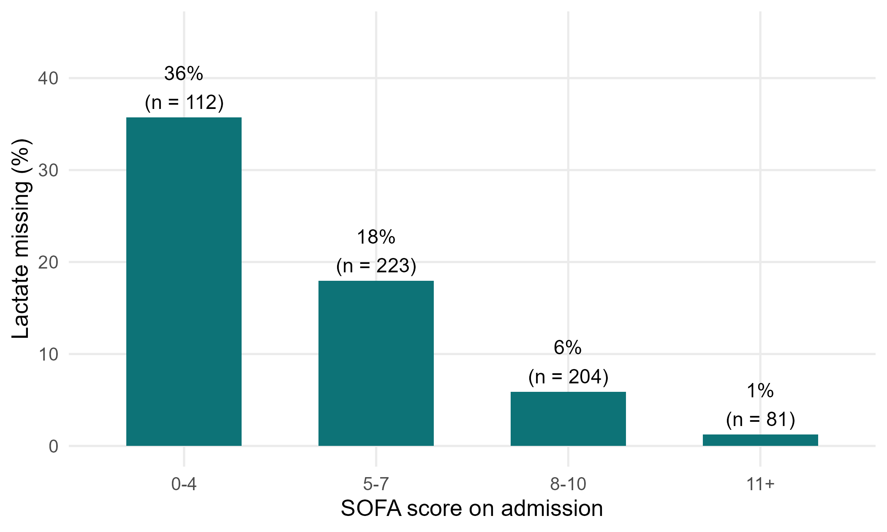
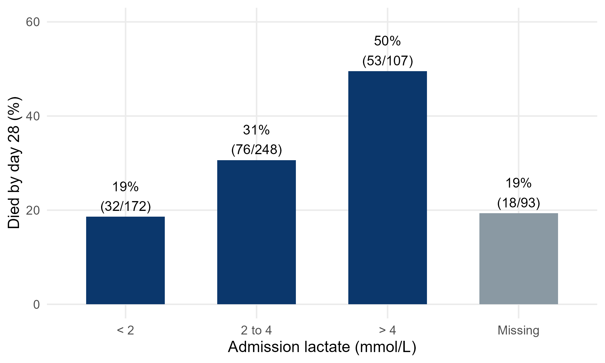
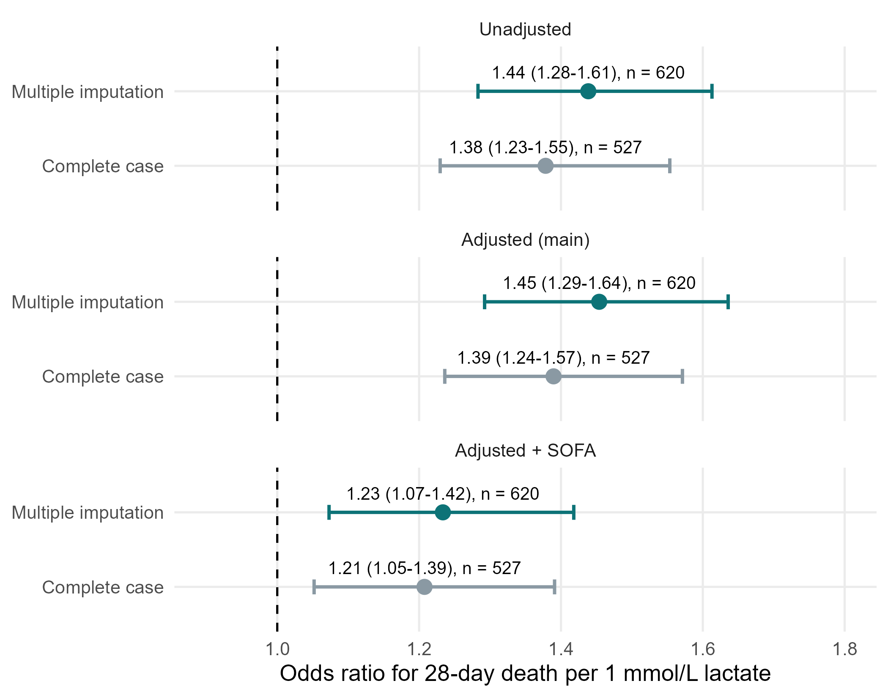

::: {.simulated}
**Simulated data, not real patients.** FLUID-ICU is an invented study: every value was produced by a computer program with a fixed random seed. It does not describe any real patient, hospital or ICU. Any manuscript written from it must say that the data are simulated and must never be submitted as real research.
:::

Download: [Word](files/data/results_packs/Results_Pack_Q4.docx) · [PDF](files/data/results_packs/Results_Pack_Q4.pdf) · [zip (Markdown, tables, figures)](files/data/results_packs/Results_Pack_Q4.zip) · [Back to the course dataset](dataset.qmd)

> **SIMULATED DATA: NOT REAL PATIENTS.** FLUID-ICU was generated by computer for this course. Write your manuscript as a training exercise and state clearly that the data are simulated.

## 1. The question

**In adults with sepsis in the ICU, is admission lactate associated with 28-day mortality, and does the answer change when missing lactate values are handled with multiple imputation?**

## 2. Design and data

- Design: multicentre prospective cohort study (observational); prognostic-factor question.
- Setting: 4 ICUs (ICU A-D), consecutive adults with sepsis, enrolment January 2023 to December 2024.
- Exposure: admission lactate in mmol/L, per 1 mmol/L (continuous); also in categories < 2, 2 to 4, > 4 mmol/L.
- Outcome: death from any cause within 28 days (died_28d).
- Analysis sample: all 620 patients; lactate missing in 93/620 (15.0%); complete-case models 527 patients; multiple imputation 620.
- Pre-specified confounders (SAP): age, SOFA score, lactate, vasopressor, mechanical ventilation, chronic kidney disease.
- Software: R 4.6 (packages gtsummary, survival, mice). Scripts: Course/Data/R/.

## 3. Table 1: who was studied

**Table 1. Baseline characteristics of survivors and non-survivors**

|Characteristic                        |Overall   N = 620 |Survived to day 28   N = 441 |Died by day 28   N = 179 |
|:-------------------------------------|:-----------------|:----------------------------|:------------------------|
|Age, years                            |62.6 (15.2)       |61.2 (14.8)                  |66.0 (15.7)              |
|&emsp;Missing                         |1                 |1                            |0                        |
|Sex                                   |                  |                             |                         |
|&emsp;Female                          |244 (39%)         |179 (41%)                    |65 (36%)                 |
|&emsp;Male                            |376 (61%)         |262 (59%)                    |114 (64%)                |
|Weight, kg                            |64.7 (11.9)       |64.5 (11.8)                  |65.2 (12.1)              |
|&emsp;Missing                         |1                 |1                            |0                        |
|Diabetes                              |158 (25%)         |108 (24%)                    |50 (28%)                 |
|Chronic kidney disease                |64 (10%)          |33 (7.5%)                    |31 (17%)                 |
|Heart failure                         |97 (16%)          |60 (14%)                     |37 (21%)                 |
|Hypertension                          |282 (45%)         |196 (44%)                    |86 (48%)                 |
|Source of infection                   |                  |                             |                         |
|&emsp;Respiratory                     |268 (43%)         |192 (44%)                    |76 (42%)                 |
|&emsp;Urinary                         |126 (20%)         |99 (22%)                     |27 (15%)                 |
|&emsp;Abdominal                       |107 (17%)         |72 (16%)                     |35 (20%)                 |
|&emsp;Skin/soft tissue                |57 (9.2%)         |36 (8.2%)                    |21 (12%)                 |
|&emsp;Other                           |62 (10%)          |42 (9.5%)                    |20 (11%)                 |
|SOFA score                            |7 (5, 9)          |7 (5, 9)                     |8 (7, 10)                |
|APACHE II score                       |19 (15, 23)       |18 (13, 22)                  |23 (19, 27)              |
|&emsp;Missing                         |6                 |5                            |1                        |
|Lactate, mmol/L                       |2.6 (1.7, 3.7)    |2.3 (1.6, 3.4)               |3.1 (2.2, 4.5)           |
|&emsp;Missing                         |93                |75                           |18                       |
|Mean arterial pressure, mmHg          |73 (66, 80)       |75 (68, 82)                  |70 (63, 76)              |
|&emsp;Missing                         |4                 |3                            |1                        |
|Vasopressor on admission              |267 (43%)         |153 (35%)                    |114 (64%)                |
|Mechanical ventilation                |314 (51%)         |190 (43%)                    |124 (69%)                |
|Cumulative fluid balance day 3, ml/kg |8.8 (-10.3, 26.2) |4.0 (-12.6, 22.7)            |18.4 (-0.3, 35.9)        |
|&emsp;Missing                         |2                 |2                            |0                        |

*Mean (SD); n (%); median (Q1, Q3). Missing = number of patients without that value.*

Files: `tables/table1_by_survival.csv` and `tables/table1_by_survival.docx`

## 4. Who is missing lactate?

**Table 2. Patients with and without an admission lactate**

|Characteristic        |Lactate measured |Lactate missing |
|:---------------------|:----------------|:---------------|
|n                     |527              |93              |
|SOFA, median (IQR)    |8 (6 to 10)      |5 (4 to 6)      |
|MAP, median (IQR)     |72 (65 to 78)    |80 (75 to 86)   |
|Vasopressor, n (%)    |253 (48%)        |14 (15%)        |
|ICU D, n (%)          |89 (17%)         |29 (31%)        |
|Died by day 28, n (%) |161 (31%)        |18 (19%)        |

Files: `tables/table2_missing_lactate_comparison.csv` and `tables/table2_missing_lactate_comparison.docx`

Patients without a lactate were **less sick** (SOFA 5 (4 to 6) vs 8 (6 to 10)) and died less often (18/93 (19.4%) vs 161/527 (30.6%)). Lactate is therefore NOT missing completely at random; the missingness is explained by observed variables (SOFA, MAP, vasopressor, ICU), which makes 'missing at random' plausible.

*Figure 1. Percentage of patients with missing lactate by SOFA score* (`figures/fig1_missing_lactate_by_sofa.png`)

## 5. Main results

- Median lactate: non-survivors 3.1 (2.2 to 4.5) vs survivors 2.3 (1.6 to 3.4) mmol/L.
- Mortality by lactate category: < 2: 19%; 2 to 4: 31%; > 4: 50%; Missing: 19%.
- Unadjusted OR per 1 mmol/L: complete case 1.38 (1.23 to 1.55); multiple imputation 1.44 (1.28 to 1.61).
- Adjusted (age, sex, comorbidities): complete case 1.39 (1.24 to 1.57) vs **multiple imputation 1.45 (1.29 to 1.64)** (main analysis).
- Adding SOFA: complete case 1.21 (1.05 to 1.39) vs multiple imputation 1.23 (1.07 to 1.42).
- Median lactate in the complete cases 2.6 mmol/L vs 2.4 mmol/L after imputation: the complete cases over-represent sicker patients.

**Table 3. 28-day mortality by admission lactate category**

|Admission lactate, mmol/L |n   |Died by day 28, n (%) |
|:-------------------------|:---|:---------------------|
|< 2                       |172 |32 (19%)              |
|2 to 4                    |248 |76 (31%)              |
|> 4                       |107 |53 (50%)              |
|Missing                   |93  |18 (19%)              |

Files: `tables/table3_mortality_by_lactate.csv` and `tables/table3_mortality_by_lactate.docx`

**Table 4. Lactate and 28-day death: complete case vs multiple imputation**

|Model                                                   |Method                       |n   |OR per 1 mmol/L (95% CI) |p      |
|:-------------------------------------------------------|:----------------------------|:---|:------------------------|:------|
|Unadjusted                                              |Complete case                |527 |1.38 (1.23 to 1.55)      |<0.001 |
|Unadjusted                                              |Multiple imputation (m = 20) |620 |1.44 (1.28 to 1.61)      |<0.001 |
|Adjusted: age, sex, diabetes, CKD, heart failure (main) |Complete case                |527 |1.39 (1.24 to 1.57)      |<0.001 |
|Adjusted: age, sex, diabetes, CKD, heart failure (main) |Multiple imputation (m = 20) |620 |1.45 (1.29 to 1.64)      |<0.001 |
|Main + SOFA score                                       |Complete case                |527 |1.21 (1.05 to 1.39)      |0.008  |
|Main + SOFA score                                       |Multiple imputation (m = 20) |620 |1.23 (1.07 to 1.42)      |0.003  |

Files: `tables/table4_cc_vs_mi.csv` and `tables/table4_cc_vs_mi.docx`

*Figure 2. 28-day mortality by admission lactate category (grey = lactate not measured)* (`figures/fig2_mortality_by_lactate.png`)

*Figure 3. Odds ratio per 1 mmol/L lactate: complete case vs multiple imputation* (`figures/fig3_cc_vs_mi.png`)

## 6. What this means (plain language)

- Higher admission lactate went with higher 28-day mortality: each extra 1 mmol/L raised the odds of death by about 40-45% (adjusted for age, sex and comorbidities).
- Much of this overlaps with overall severity: after adding SOFA, the OR fell to about 1.2. Lactate is partly a marker of how sick the patient is.
- Dropping the 93 patients without lactate (complete case) gave a slightly smaller OR than multiple imputation (which uses all 620 patients). The conclusion is the same; the size is modestly different, because the complete cases are a sicker, selected group.

## 7. What this does NOT mean

- It does NOT mean that lowering lactate saves lives. Lactate is a marker, not necessarily a cause.
- Multiple imputation does NOT invent data or 'fix' everything: it is valid only if missingness depends on things we measured (MAR). If lactate was missing for reasons related to the unseen value itself (MNAR), no method fully corrects it.

## 8. Limitations to discuss (hints)

- 15% missing lactate, not at random: report n missing, who they were, and both analyses.
- Single admission value: lactate clearance over time was not recorded.
- Units problem in one ICU (mg/dL) found during cleaning: describe the data checks.
- OR per 1 mmol/L assumes a straight-line (log-odds) relationship; the categories in Table 3 let readers check it.

## Which STROBE items this pack helps you write

- Item 12c: how missing data were addressed (MI, m = 20, variables in the imputation model)
- Item 14b: number of participants with missing data for each variable (Table 1, Table 2)
- Item 16: unadjusted and adjusted estimates with 95% CI; category boundaries (Table 3)
- Item 17: sensitivity analysis (complete case vs MI, Table 4)
- Item 19: limitations (missing data mechanism)

