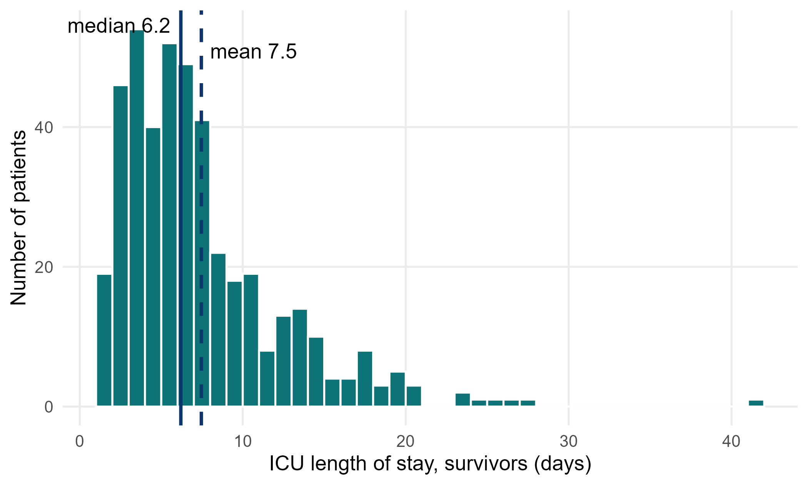
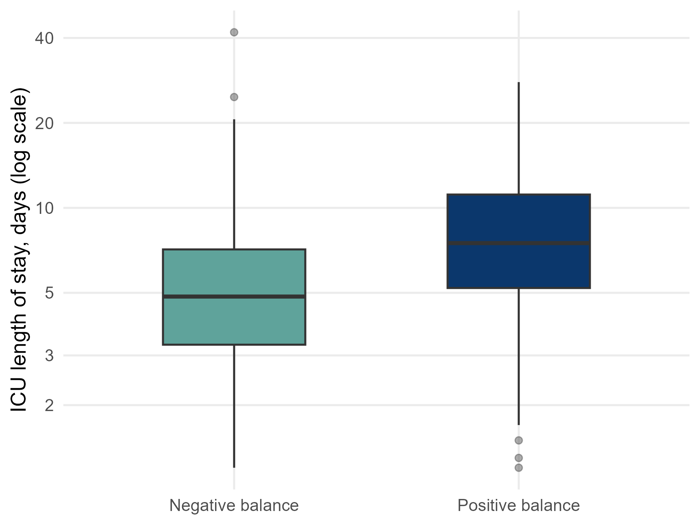

::: {.simulated}
**Simulated data, not real patients.** FLUID-ICU is an invented study: every value was produced by a computer program with a fixed random seed. It does not describe any real patient, hospital or ICU. Any manuscript written from it must say that the data are simulated and must never be submitted as real research.
:::

Download: [Word](files/data/results_packs/Results_Pack_Q5.docx) · [PDF](files/data/results_packs/Results_Pack_Q5.pdf) · [zip (Markdown, tables, figures)](files/data/results_packs/Results_Pack_Q5.zip) · [Back to the course dataset](dataset.qmd)

> **SIMULATED DATA: NOT REAL PATIENTS.** FLUID-ICU was generated by computer for this course. Write your manuscript as a training exercise and state clearly that the data are simulated.

## 1. The question

**Among adults with sepsis who survived to day 28, is a positive cumulative fluid balance by day 3 associated with a longer ICU stay?**

## 2. Design and data

- Design: multicentre prospective cohort study (observational); analysis restricted to 28-day survivors.
- Setting: 4 ICUs (ICU A-D), consecutive adults with sepsis, enrolment January 2023 to December 2024.
- Exposure: positive vs negative cumulative fluid balance at day 3; secondary: per 10 ml/kg.
- Outcome: ICU length of stay in days (icu_los_days), right-skewed.
- Analysis sample: 439 survivors with a day-3 balance (239 positive, 200 negative); adjusted model 366 complete cases.
- Pre-specified confounders (SAP): age, SOFA score, lactate, vasopressor, mechanical ventilation, chronic kidney disease.
- Software: R 4.6 (packages gtsummary, survival, mice). Scripts: Course/Data/R/.

## 3. Table 1: who was studied

**Table 1. Baseline characteristics of 28-day survivors by fluid-balance group**

|Characteristic               |Overall   N = 439 |Negative balance   N = 200 |Positive balance   N = 239 |
|:----------------------------|:-----------------|:--------------------------|:--------------------------|
|Age, years                   |61.3 (14.7)       |63.8 (14.6)                |59.1 (14.6)                |
|&emsp;Missing                |1                 |1                          |0                          |
|Sex                          |                  |                           |                           |
|&emsp;Female                 |178 (41%)         |85 (43%)                   |93 (39%)                   |
|&emsp;Male                   |261 (59%)         |115 (58%)                  |146 (61%)                  |
|Weight, kg                   |64.5 (11.8)       |64.7 (12.5)                |64.2 (11.3)                |
|Diabetes                     |108 (25%)         |54 (27%)                   |54 (23%)                   |
|Chronic kidney disease       |33 (7.5%)         |16 (8.0%)                  |17 (7.1%)                  |
|Heart failure                |60 (14%)          |43 (22%)                   |17 (7.1%)                  |
|Hypertension                 |196 (45%)         |102 (51%)                  |94 (39%)                   |
|Source of infection          |                  |                           |                           |
|&emsp;Respiratory            |191 (44%)         |84 (42%)                   |107 (45%)                  |
|&emsp;Urinary                |99 (23%)          |45 (23%)                   |54 (23%)                   |
|&emsp;Abdominal              |71 (16%)          |37 (19%)                   |34 (14%)                   |
|&emsp;Skin/soft tissue       |36 (8.2%)         |15 (7.5%)                  |21 (8.8%)                  |
|&emsp;Other                  |42 (9.6%)         |19 (9.5%)                  |23 (9.6%)                  |
|SOFA score                   |7 (5, 9)          |6 (4, 7)                   |8 (5, 10)                  |
|APACHE II score              |18 (13, 22)       |16 (12, 20)                |19 (15, 23)                |
|&emsp;Missing                |5                 |3                          |2                          |
|Lactate, mmol/L              |2.3 (1.6, 3.4)    |2.1 (1.4, 2.9)             |2.6 (1.8, 3.6)             |
|&emsp;Missing                |73                |45                         |28                         |
|Mean arterial pressure, mmHg |75 (68, 82)       |78 (71, 85)                |73 (67, 79)                |
|&emsp;Missing                |3                 |1                          |2                          |
|Vasopressor on admission     |152 (35%)         |39 (20%)                   |113 (47%)                  |
|Mechanical ventilation       |189 (43%)         |67 (34%)                   |122 (51%)                  |

*Mean (SD); n (%); median (Q1, Q3). Missing = number of patients without that value.*

Files: `tables/table1_survivors_by_balance.csv` and `tables/table1_survivors_by_balance.docx`

## 4. Main results

- ICU stay is right-skewed: in survivors mean 7.5 vs median 6.2 days.
- Median (IQR) ICU stay: positive balance 7.5 (5.2 to 11.2) vs negative 4.8 (3.3 to 7.1) days; Mann-Whitney p <0.001.
- Hodges-Lehmann difference: 2.5 (95% CI 1.8 to 3.2) days.
- Log-linear regression: crude ratio of geometric means 1.50 (95% CI 1.34 to 1.68); adjusted **1.24 (95% CI 1.10 to 1.39)**, p <0.001 (i.e. about 24% longer stay).
- Per 10 ml/kg more balance: ratio 1.06 (95% CI 1.03 to 1.08).

**Table 2. ICU length of stay in survivors by fluid-balance group**

|Summary              |Negative balance |Positive balance  |
|:--------------------|:----------------|:-----------------|
|n                    |200              |239               |
|Median (IQR), days   |4.8 (3.3 to 7.1) |7.5 (5.2 to 11.2) |
|Mean (SD), days      |6.0 (4.6)        |8.7 (5.0)         |
|Range, days          |1.2 to 41.9      |1.2 to 27.9       |
|Geometric mean, days |4.9              |7.4               |

Files: `tables/table2_los_summary.csv` and `tables/table2_los_summary.docx`

**Table 3. Association between fluid balance and ICU length of stay (survivors)**

|Analysis                                        |n   |Estimate (95% CI)   |p      |
|:-----------------------------------------------|:---|:-------------------|:------|
|Mann-Whitney (Hodges-Lehmann difference, days)  |439 |2.5 (1.8 to 3.2)    |<0.001 |
|Log-linear, crude (ratio of geometric means)    |439 |1.50 (1.34 to 1.68) |<0.001 |
|Log-linear, adjusted (ratio of geometric means) |366 |1.24 (1.10 to 1.39) |<0.001 |
|Log-linear, adjusted, per 10 ml/kg (ratio)      |366 |1.06 (1.03 to 1.08) |<0.001 |

*Ratio of geometric means: 1.24 = 24% longer typical stay. Adjusted for age, SOFA, lactate, vasopressor, ventilation, CKD.*

Files: `tables/table3_los_models.csv` and `tables/table3_los_models.docx`

*Figure 1. ICU length of stay in survivors: a long right tail pulls the mean above the median* (`figures/fig1_los_histogram.png`)

*Figure 2. ICU length of stay by fluid-balance group (log scale)* (`figures/fig2_los_by_group_log.png`)

## 5. What this means (plain language)

- Among survivors, those with a positive balance stayed longer in the ICU, by about 2-3 days in the median.
- After adjustment, the typical (geometric mean) stay was about 24% longer.
- For a skewed outcome, report the median (IQR), use a rank test or analyse the log of the stay, and present a ratio.

## 6. What this does NOT mean

- It does NOT show that fluid prolongs ICU stay; patients who stay longer have more time and reasons to receive fluid (reverse causation).
- It does NOT describe all patients: deaths were excluded, and death shortens the stay.

## 7. Limitations to discuss (hints)

- Selection: restricting to survivors conditions on an outcome that is itself related to fluid (survivor bias). An alternative is 'ICU-free days', which counts death as 0.
- ICU discharge depends on bed pressure and local practice, not only on the patient.
- Residual confounding by severity; complete-case adjusted model.

## Which STROBE items this pack helps you write

- Item 6: participants (why survivors only)
- Item 12: methods for a skewed outcome (log transformation / non-parametric)
- Item 14: descriptive data (Table 1)
- Item 15-16: medians (IQR) and ratios with 95% CI
- Item 19: limitations (survivor selection)

