---

:::: {.neu-statement}
::: {.neu-big}
Every day you make decisions that research could improve.
:::

::: {.neu-sub}
This course helps you ask those questions properly, answer them and publish the answer.
:::
::::

::: {.notes}
Open with a question to the room: 'Think of one thing in your unit where colleagues do it differently and nobody knows which way is best.'

Take 2-3 answers. Expected: fluids, sedation, mobilisation, wound dressings, line care.

Key teaching point: research starts from clinical uncertainty, not from statistics.

Write the examples on the flip chart. They are candidate topics for the group proposals.
:::

## Eight Saturdays, eight sessions

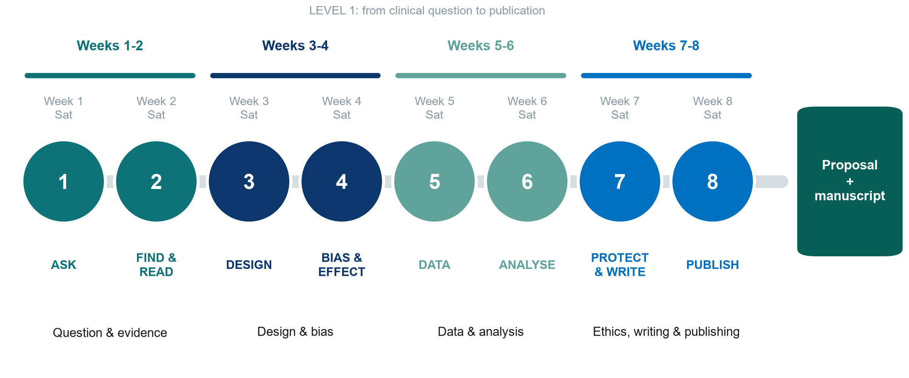{.neu-fig}

::: {.notes}
Walk along the road: Weeks 1-2 the question and the evidence; Weeks 3-4 design and bias; Weeks 5-6 data and analysis; Weeks 7-8 ethics, writing and publishing. One session every Saturday, with a full week between sessions for the homework.

This whole course is Level 1: it covers every step from question to publication. Weeks 1-4 build understanding and design skills. Weeks 5-8 apply them to data, writing and publishing.

One running example travels with us: fluids in septic shock. Non-ICU colleagues: every concept is also shown with ward examples (pressure injuries, hand hygiene, medication errors, delirium).
:::

## This course is Level 1 of three

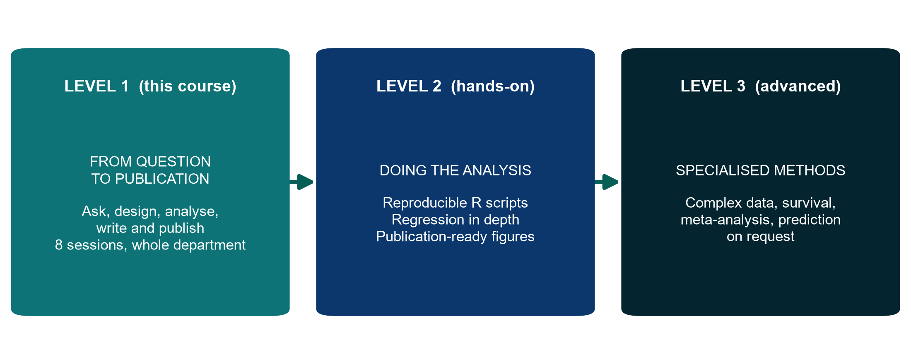{.neu-fig}

::: {.neu-takeaway}
**KEY MESSAGE** Level 1 is this course, Level 2 is hands-on analysis in R, Level 3 is advanced methods.
:::

::: {.notes}
This course (Level 1) takes you from a clinical question to a published paper. Level 2 is a hands-on course in R for those who want to run analyses themselves. Level 3 covers advanced, specialised methods.

Within Level 1 we use a realistic dataset of 620 ICU patients: we describe it, analyse it and write it up. The trainers run the software. You read and interpret the results.

Misconception to defuse: 'research is only for statisticians or professors'. Most good clinical questions come from nurses and doctors at the bedside.
:::

## Two things your group will produce

{.neu-fig}

::: {.notes}
Product 1: a research proposal on the group's own question, built one part every two weeks and presented in Session 8.

Product 2: a draft manuscript written from the course dataset (FLUID-ICU). Each group answers a different question on the same data. We analyse in Weeks 5-6, write in Weeks 7-8, and after the course groups review each other's drafts and reply like real authors.

Point to Assignment/proposal\_brief and Assignment/manuscript\_brief.
:::

## By the end of the course you will be able to

:::: {.neu-cards style="--n:4"}
::: {.neu-card .plain style="--c:#0D7377"}
[ASK & FIND]{.neu-card-title}

- Turn a problem into a PICO question
- Search PubMed, manage references
- Read a paper in 15 minutes
:::
::: {.neu-card .plain style="--c:#0B376C"}
[DESIGN]{.neu-card-title}

- Pick the right study design
- Recognise bias and confounding
- Read RR, OR, NNT and forest plots
:::
::: {.neu-card .plain style="--c:#5FA39B"}
[ANALYSE]{.neu-card-title}

- Plan good data and a CRF
- Read CIs, p-values, regression
- Interpret a real dataset's results
:::
::: {.neu-card .plain style="--c:#0070C0"}
[WRITE & PUBLISH]{.neu-card-title}

- Plan ethics and registration
- Write each section of a paper
- Submit and answer reviewers
:::
::::

::: {.neu-takeaway}
**KEY MESSAGE** Understand and interpret: you will not be asked to calculate.
:::

::: {.notes}
Walk across the four cards, one per two-week block.

Key teaching point: the aim is understanding and interpretation, not computation. The trainers run the analyses. You learn to read them and write them up.

Audience question: which card worries you most? Expected: ANALYSE. Reassure: we go slowly, with pictures, and check understanding every 20 minutes.

Return to this slide in Session 8 to show progress.
:::

## How each session runs

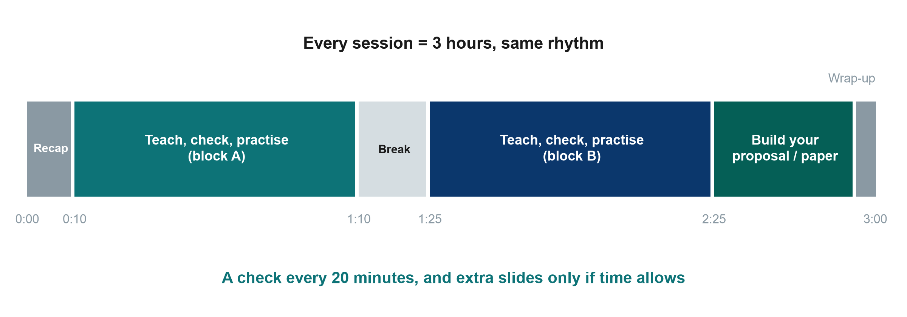{.neu-fig}

::: {.notes}
Same rhythm every session: recap, two teaching blocks with checks and activities, a 15-minute break, and time to build the proposal or the paper.

Every 20 minutes we stop for a quick check of understanding. If the room is not with us, we slow down. Each session ends with 'extra slides' that we only use if there is time. You can read them at home.

Keep the break to 15 minutes and start again on time.
:::

## Build the proposal one part at a time

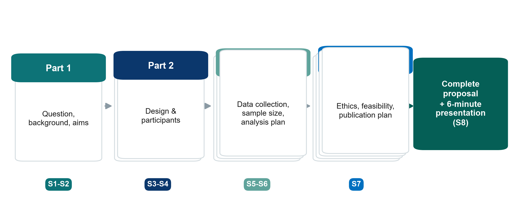{.neu-fig}

::: {.neu-takeaway}
**KEY MESSAGE** Same group, same template, one part every two weeks, presented in Session 8.
:::

::: {.notes}
Part 1 (Weeks 1-2): the question and the background. Part 2 (Weeks 3-4): the design. Part 3 (Weeks 5-6): the data and the analysis plan. Part 4 (Session 7): ethics, feasibility and a publication plan.

Each group presents its proposal in Session 8 (6 minutes + 2 minutes feedback).

Template: Templates/Research\_Proposal\_Template.docx.
:::

## Meet your group

::: {.neu-banner style="--c:#0D7377"}
GROUP WORK · 10 min
:::

:::: {.columns}
::: {.column width="60%"}
::: {.neu-activity-steps style="--c:#0D7377"}
- Sit with your group (5 groups of about 6, mixed professions)
- Introduce yourselves: name, unit, one question you wish research could answer
- Agree the roles below (they can rotate each week)
- Choose a group name
:::
:::
::: {.column width="40%"}
::: {.neu-side .plain style="--c:#0D7377"}
Group roles

- Facilitator: keeps everyone talking
- Scribe: fills in the template
- Timekeeper
- Literature lead
- Methods & data lead
- Presenter
:::
:::
::::

::: {.neu-output style="--c:#0D7377"}
**OUTPUT** Group name + roles written on the group sheet
:::

::: {.notes}
Groups should mix doctors, nurses and pharmacists. Different perspectives make better proposals.

Roles keep quieter members involved. Suggest rotating the scribe.

Trainers: walk round, note each group's candidate topics.
:::

## How we learn together

:::: {.neu-cards style="--n:4"}
::: {.neu-card .plain style="--c:#0D7377"}
[Ask anything]{.neu-card-title}

- There are no silly questions
- If you are lost, others are too
:::
::: {.neu-card .plain style="--c:#0B376C"}
[Go slow]{.neu-card-title}

- We check understanding often
- Extra slides only if time allows
:::
::: {.neu-card .plain style="--c:#5FA39B"}
[Bring your ward]{.neu-card-title}

- Use examples from your own practice
- Your experience is the raw material
:::
::: {.neu-card .plain style="--c:#0070C0"}
[Respect time]{.neu-card-title}

- Start and finish on time
- Phones silent, break at the break
:::
::::

::: {.notes}
Set the climate: this is a safe place to say 'I do not understand'.

Language: discussions can be in Vietnamese or English, whatever helps the group think.

Patient confidentiality applies to examples: no names or identifiable details.
:::

## Pre-course quiz

::: {.neu-banner style="--c:#6C3483"}
QUICK QUIZ · 15 min
:::

:::: {.columns}
::: {.column width="60%"}
::: {.neu-activity-steps style="--c:#6C3483"}
- Individual, no discussion, no phones (except for the online form)
- 24 multiple-choice questions, one answer each
- Guess if you are not sure: this is not an exam
- Write only your participant number, not your name
:::
:::
::: {.column width="40%"}
::: {.neu-side style="--c:#6C3483"}
Why a quiz now?

- Shows where the room starts
- Same quiz in Session 8
- We measure the course, not you
:::
:::
::::

::: {.neu-output style="--c:#6C3483"}
**OUTPUT** Quiz handed in (participant number only)
:::

::: {.notes}
Use the online form (recommended) or paper copies of Assessment/pre\_post\_quiz.

Reassure: results are anonymous and used only to measure what the COURSE achieved.

Collect after 15 minutes. Do not give answers today. The same quiz is repeated at the end of Session 8.
:::

# Session 1 · Ask: from clinical problem to research question

## Week 1 · Saturday

- 1.1  Why research? Evidence, types of research, research vs audit, the road to publication
- Break
- 1.2  From problem to question: PICO(T) with worked examples, FINER (pair task)
- 1.3  Aims, objectives and hypotheses (quick exercise)
- Proposal builder 1: topic, PICO, question, FINER, aim and objectives
- Wrap-up: key words, recap, homework for next Saturday

::: {.notes}
SESSION 1 OPENING (0:35). The front matter (welcome, course map, groups, pre-course quiz) has just finished.

Teaching point: today has one job: every group leaves with ONE clear, answerable research question and an aim with objectives. Next Saturday (Session 2) we search and read the literature for it.

Pace: this audience has little or no research background. Go slowly, use the worked examples, and stop at every 'Check your understanding' slide. They are short on purpose.

Show the shape of the session: three short teaching blocks, a break, a pair task, a quick exercise, then 30 minutes of group work on the proposal.

Ask the room: 'Who has ever taken part in a research study, as a researcher, data collector or participant?' Count hands; it tells you where to pitch the session.

Timing: 1 minute. Do not read the agenda aloud; point at it.
:::

## 1.1  Why research?

:::: {.neu-statement}
::: {.neu-big}
Why do we need research when we already have experience?
:::

::: {.neu-sub}
35 minutes: evidence, the pyramid, types of research, research vs audit, and the road to publication
:::
::::

::: {.notes}
SEGMENT 1.1 (0:35-1:10).

Pause on the question and let the room answer before you click on. Take 2-3 answers.

Expected answers: experience is biased towards memorable cases; colleagues disagree; practice changes; we need to know whether what we do actually helps.

Teaching point: experience is valuable for generating questions, but it is a weak way of answering them.

Timing: 1 minute.
:::

## Anecdote vs evidence

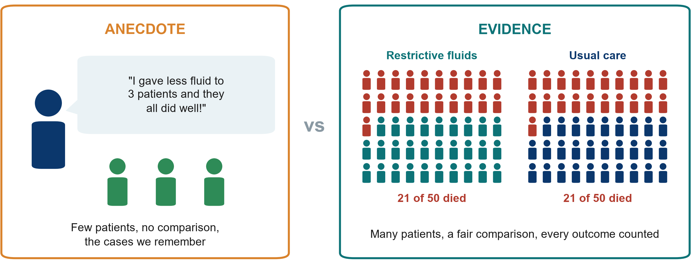{.neu-fig}

::: {.neu-takeaway}
**KEY MESSAGE** Experience suggests questions. Fair comparisons in many patients answer them.
:::

::: {.notes}
Left: one clinician, three patients, a vivid memory, no comparison group.

Right: 50 patients per group, every death counted, the same outcome measured in both arms.

The numbers are illustrative, but the pattern is real: the large CLASSIC trial (Meyhoff, NEJM 2022, 1,554 septic shock patients) found 90-day mortality of 42.3% with restrictive fluids vs 42.1% with standard care. The three 'success' patients would have done well either way.

Misconception: 'if it worked in my patients it works'. Without a comparison we cannot tell what would have happened anyway (natural recovery, regression to the mean, selective memory).

Ask the room: 'Why do we remember the three good outcomes?' Expected answer: recall bias. Dramatic and recent cases stick, and we forget the failures.

Timing: 4 minutes. Go slowly: this is the idea the whole course rests on.
:::

## Why one ward's experience is not enough

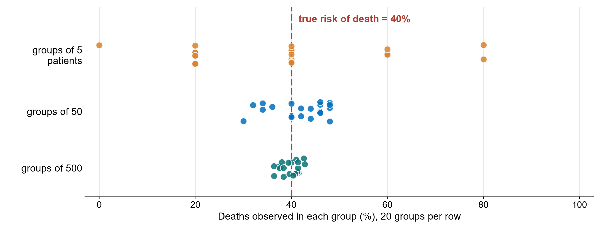{.neu-fig}

::: {.neu-takeaway}
**KEY MESSAGE** Small numbers jump around by chance. Large, fair comparisons settle down.
:::

::: {.notes}
This picture is a simulation (fixed seed): imagine a disease where the TRUE risk of death is 40%.

Top row: 20 wards each see only 5 patients. By pure chance some see 0% deaths, others 80%. Each ward would 'learn' something different from its own experience.

Middle row: groups of 50, closer to the truth but still scattered. Bottom row: groups of 500 cluster tightly around 40%.

Teaching point: chance alone produces impressive-looking differences in small numbers. This is why research needs enough patients and a comparison group, and why 'my last three patients' can mislead.

Misconception: 'a big difference in a small group must be real'. A big difference in a small group is exactly what chance produces.

Ask the room: 'One ward lost 0 of 5 patients after a new protocol. Does the protocol work?' Expected answer: we cannot tell, because 0 of 5 happens often by chance even when the true risk is 40%.

Timing: 4 minutes. Sample size returns in Session 6.
:::

## The evidence pyramid

:::: {.columns}
::: {.column width="38%"}
::: {.neu-side-notes}
### How to read it

- Higher = less risk of bias for questions about treatment effects
- Paper 1 (Boulet) is an RCT; Paper 2 (Hyun) is a cohort
- A well-done cohort can beat a poorly done RCT
- Descriptive questions do not need an RCT
:::
:::
::: {.column width="62%"}
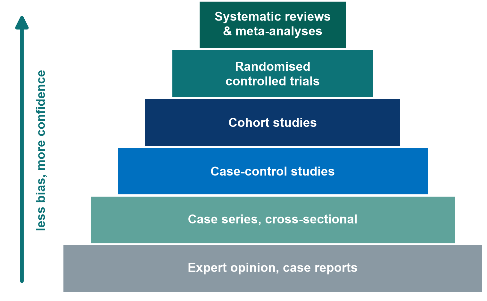{.neu-fig-side}
:::
::::

::: {.neu-takeaway}
**KEY MESSAGE** The pyramid ranks designs, not individual papers: quality still has to be checked.
:::

::: {.notes}
Build from the bottom: expert opinion and case reports, then case series and cross-sectional studies, case-control, cohort, randomised trials, and at the top systematic reviews and meta-analyses that combine several studies.

Teaching point: moving up, the design does more to protect against bias. That is why higher levels give more confidence for 'does treatment X work?' questions.

Misconception 1: 'an RCT is always right'. A small or badly run trial can mislead. Frameworks such as GRADE rate the certainty of a whole body of evidence, not the design label alone.

Misconception 2: 'only RCTs count'. For prevalence, harm and prognosis, observational designs are often the right (or only ethical) choice. Qualitative research sits outside this pyramid because it answers different questions.

Ask the room: 'Where would a systematic review of 10 poor-quality trials sit?' Expected answer: at the top by label, but its conclusions are only as strong as the trials inside it.

Timing: 4 minutes. Session 3 covers each design in detail, so do not teach designs here.
:::

## Quick quiz: rank the evidence

::: {.neu-banner style="--c:#6C3483"}
QUICK QUIZ · 3 min
:::

:::: {.columns}
::: {.column width="60%"}
::: {.neu-activity-steps style="--c:#6C3483"}
- Four sources answer: 'Do restrictive fluids reduce deaths in septic shock?'
- A: a senior colleague: 'In 20 years, my dry patients did better'
- B: a registry cohort of thousands of ICU patients with sepsis
- C: a trial that randomised 1,554 patients with septic shock
- D: a review that pools every trial of fluid restriction
- Rank them from weakest to strongest, then show fingers on the count of 3
:::
:::
::: {.column width="40%"}
::: {.neu-side .plain style="--c:#6C3483"}
Then discuss

- Which one would change your practice?
- What could make C weaker than B?
:::
:::
::::

::: {.neu-output style="--c:#6C3483"}
**OUTPUT** One agreed ranking per table
:::

::: {.notes}
Answer: A (expert opinion) \< B (cohort) \< C (RCT) \< D (systematic review / meta-analysis).

C is the real CLASSIC trial (NEJM 2022), which found no difference in 90-day mortality. B resembles Paper 2 (Hyun 2023): a positive fluid balance on days 2-3 was associated with higher 28-day mortality.

Why might a cohort find harm when a trial finds none? Expected answer: in a cohort, sicker patients get more fluid, so fluid looks harmful (confounding by indication). This is a preview of Session 4.

Facilitation: count down '1-2-3' so tables show fingers at the same time.

Timing: 3 minutes, strictly.
:::

## The research cycle

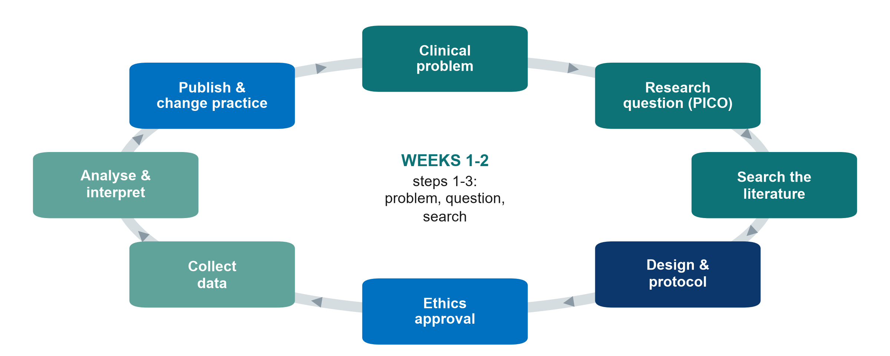{.neu-fig}

::: {.neu-takeaway}
**KEY MESSAGE** Research is a cycle: published results change practice and raise new questions.
:::

::: {.notes}
Walk round the cycle quickly, one sentence per box.

Weeks 1-2 = clinical problem and research question (today), literature search (next Saturday). These are the three teal boxes top right.

Teaching point: published results change practice, which creates new uncertainties and new questions.

Misconception: 'research = collecting data'. Data collection comes AFTER the question, design, protocol and ethics approval.

Timing: 2 minutes. The next slide zooms into the same journey in detail.
:::

## The question decides the type of research

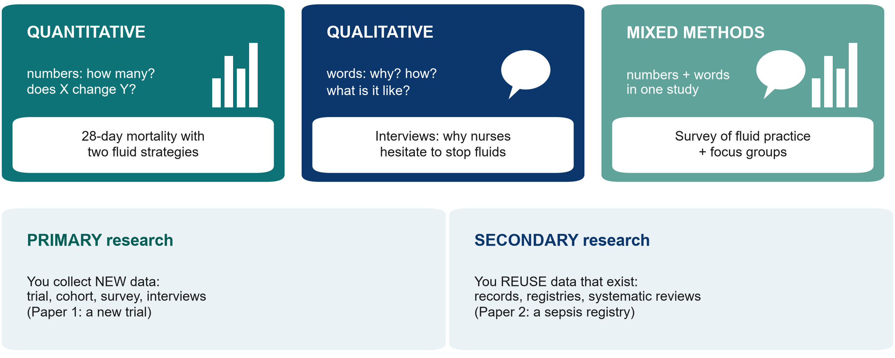{.neu-fig}

::: {.neu-takeaway}
**KEY MESSAGE** Numbers answer how many and how much; words answer why and how.
:::

::: {.notes}
Top row: what kind of data. Quantitative research counts and measures (mortality, fluid balance). Qualitative research collects words (interviews, focus groups, observation) to understand experiences, reasons and barriers. Mixed methods combine both in one study.

Bottom row: where the data come from. Primary research collects new data for this study (Paper 1, a new trial). Secondary research reuses data that already exist: medical records, registries (Paper 2 used a sepsis registry) or published studies (a systematic review).

Teaching point: the question decides the type. 'Does restriction reduce deaths?' is quantitative; 'why do nurses hesitate to stop fluids?' is qualitative.

Misconception: 'qualitative research is just opinion'. It has its own rigorous methods and reporting guideline (COREQ for interviews and focus groups); it is the right tool when numbers cannot explain behaviour.

Ask the room: 'Which type would show why a new fluid protocol is not being followed?' Expected answer: qualitative, or mixed methods with an audit.

Timing: 3 minutes. Qualitative designs return in Session 3.
:::

## Check your understanding: which type of research?

::: {.neu-banner style="--c:#6C3483"}
QUICK QUIZ · 2 min
:::

::: {.neu-activity-steps style="--c:#6C3483"}
- A: counting how many ICU patients develop pressure injuries this year
- B: interviewing families about visiting rules in the ICU
- C: re-analysing 3 years of discharge records for readmissions
- D: a survey of hand-hygiene practice plus focus groups with nurses
- For each: quantitative, qualitative or mixed? Primary or secondary?
:::

::: {.neu-output style="--c:#6C3483"}
**OUTPUT** Shout out the answers. The next slide shows them
:::

::: {.notes}
Quick check, not a test. Read each item and let the room shout the answer.

Answers (next slide): A quantitative, primary. B qualitative, primary. C quantitative, secondary (records already exist). D mixed methods, primary.

If people hesitate on C: the data were collected for care, not for this study, so reusing them is secondary research. It still needs ethics review.

Timing: 2 minutes.
:::

## Answers: which type of research?

:::: {.neu-cards style="--n:4"}
::: {.neu-card .plain style="--c:#0D7377"}
[A  Counting]{.neu-card-title}

- Quantitative
- Primary
- (new counts)
:::
::: {.neu-card .plain style="--c:#0B376C"}
[B  Interviews]{.neu-card-title}

- Qualitative
- Primary
- (words, why)
:::
::: {.neu-card .plain style="--c:#5FA39B"}
[C  Old records]{.neu-card-title}

- Quantitative
- Secondary
- (data exist)
:::
::: {.neu-card .plain style="--c:#0070C0"}
[D  Survey + groups]{.neu-card-title}

- Mixed methods
- Primary
- (numbers + words)
:::
::::

::: {.neu-takeaway}
**KEY MESSAGE** Ask two things: numbers or words? New data or existing data?
:::

::: {.notes}
Go through the four cards quickly.

Teaching point: two simple questions classify almost any study: what kind of data (numbers or words) and where they come from (new or existing).

Secondary research is often the most feasible for a busy department, but data quality depends on how well the records were kept (Session 5).

Timing: 2 minutes.
:::

## Research, audit or quality improvement?

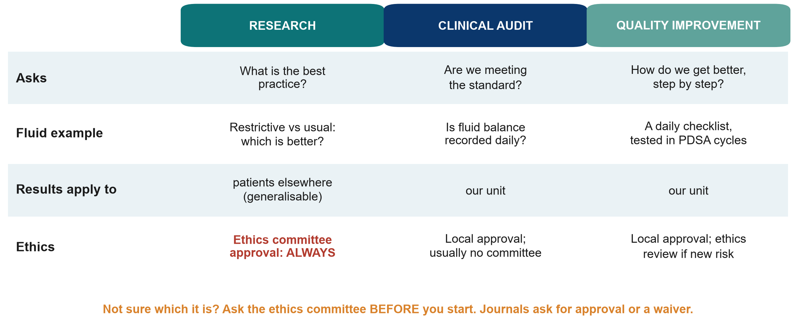{.neu-fig}

::: {.neu-takeaway}
**KEY MESSAGE** Research asks what is best; audit asks if we do it; QI makes it better.
:::

::: {.notes}
Research generates new, generalisable knowledge: which option is best? Audit compares our practice with an agreed standard. Quality improvement (QI) changes a local process step by step, usually in Plan-Do-Study-Act (PDSA) cycles.

Why it matters: research always needs ethics committee approval before it starts. Audit and QI usually need local approval only. But if a project randomises patients, adds a new intervention or risk, or collects data beyond routine care, it is research and needs ethics review.

Publishing does not change what a project was. Journals ask for ethics approval or a formal waiver, so decide (and ask) at the start, not after the data are collected.

Misconception: 'audit and QI are lesser research'. They answer different questions and are essential; many good research questions start from an audit result.

Ask the room: 'Checking whether fluid balance is recorded daily as our protocol says: research, audit or QI?' Expected answer: audit.

Note: rules differ between institutions. Tell participants to check the local policy and, if in doubt, ask the ethics committee.

Timing: 3 minutes.
:::

## Check your understanding: research, audit or QI?

::: {.neu-banner style="--c:#6C3483"}
QUICK QUIZ · 2 min
:::

::: {.neu-activity-steps style="--c:#6C3483"}
- A: checking whether fluid balance is charted daily, as our protocol says
- B: randomising patients to restrictive or usual fluids
- C: testing a new handover checklist in small PDSA cycles
- D: interviewing nurses about why they hesitate to stop fluids
- For each: research, audit or QI? Who must approve it?
:::

::: {.neu-output style="--c:#6C3483"}
**OUTPUT** Show 1 finger for research, 2 for audit, 3 for QI
:::

::: {.notes}
Read each item; the room shows 1, 2 or 3 fingers.

Answers (next slide): A audit; B research (ethics committee + registration); C quality improvement; D research (qualitative, ethics committee).

Teaching point: the ethics route depends on WHAT you do, not on whether you plan to publish.

Timing: 2 minutes.
:::

## Answers: research, audit or QI?

| Project | Type | Approval before you start |
|:---|:---|:---|
| A  Fluid balance charted daily? | Audit | Local / clinical governance |
| B  Randomise restrictive vs usual fluids | Research | Ethics committee + trial registration |
| C  Handover checklist in PDSA cycles | Quality improvement | Local; ethics review if new risk |
| D  Interview nurses about stopping fluids | Research (qualitative) | Ethics committee |

::: {.neu-table-caption}
Rules differ between institutions: check your local policy, and ask the ethics committee when in doubt.
:::

::: {.notes}
Walk through the four rows.

Common confusion: D feels like 'just talking to colleagues', but systematic interviews with recordings and analysis are research and need consent and ethics approval.

Misconception: 'if we only publish it later, we can get approval later'. Journals ask for approval or a formal waiver, and retrospective approval is often refused.

Timing: 2 minutes.
:::

## The whole road: from idea to publication

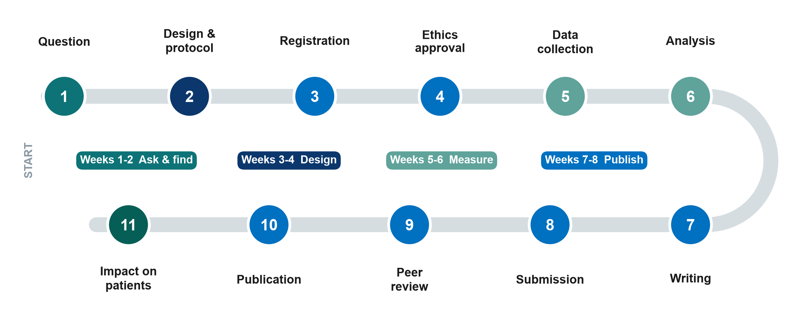{.neu-fig}

::: {.neu-takeaway}
**KEY MESSAGE** This course walks the whole road. Your group proposal covers stops 1 to 6.
:::

::: {.notes}
Eleven stops from question to impact. The colours show which weeks of the course teach each stop.

Stops 1-6 are planning and doing: question, design and protocol, registration (trials must be registered BEFORE the first patient: Paper 1 was registered in July 2021 and recruitment began in September 2021), ethics approval, data collection, analysis.

Stops 7-11 are publishing: writing, submission, peer review, publication and impact on patients. The road usually takes one to three years; many good studies stall at stop 7.

Teaching point: every stop depends on stop 1. A vague question produces a weak protocol, an unanswerable analysis and a paper that is hard to publish.

Misconception: 'publication is the end'. The point is impact: a changed guideline, protocol or practice.

Ask the room: 'At which stop do you think most hospital studies get stuck?' Expected answers: ethics paperwork, data collection, or writing (stop 7). We will tackle each one.

Timing: 3 minutes. Segment 1.1 ends at 1:10, then the break.
:::

## Break

::: {.neu-banner style="--c:#8A99A3"}
BREAK · 15 min
:::

::: {.neu-activity-steps style="--c:#8A99A3"}
- Stretch, coffee, talk to someone from another profession
- Think: which problem from your ward could your group work on today?
:::

::: {.notes}
BREAK (1:10-1:25).

During the break: put the Session 1 exercise sheets on the tables and write the pair-task scenarios on the flip chart.

Restart on time and say clearly what time you will begin again.
:::

## 1.2  From problem to question

:::: {.neu-statement}
::: {.neu-big}
A good question is half of the answer.
:::

::: {.neu-sub}
40 minutes: where questions come from, PICO(T) with worked examples, question types and FINER, then a pair task
:::
::::

::: {.notes}
SEGMENT 1.2 (1:25-2:05).

Teaching point: a vague clinical worry ('are fluids bad?') must be turned into a precise, answerable question before anything else can happen.

We will build PICO slowly with several examples (ICU and ward) before you practise in pairs.

Timing: 30 seconds.
:::

## Where do research questions come from?

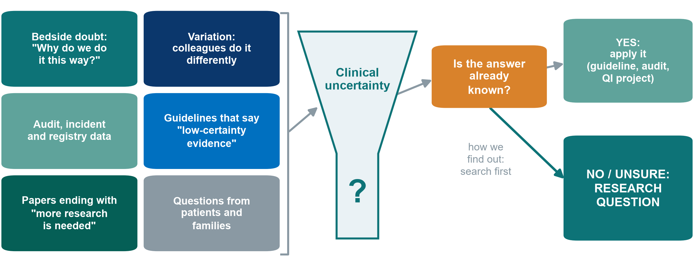{.neu-fig}

::: {.neu-takeaway}
**KEY MESSAGE** If the answer is known, apply it. If it is not, you have a research question.
:::

::: {.notes}
Six common sources of good questions, all from daily work.

The orange box is the key decision: before calling something research, check whether the answer already exists. If it does, the job is implementation: a guideline, an audit or a QI project (segment 1.1).

Teaching point: 'how we find out' is the literature search, covered next Saturday in Session 2.

Ask the room: 'Name one thing in your unit that colleagues do differently.' Expected: sedation targets, fluid volumes, dressing changes, mobilisation timing. Write them on the flip chart. They are candidate topics for the proposals.

Timing: 3 minutes.
:::

## PICO(T): our running example

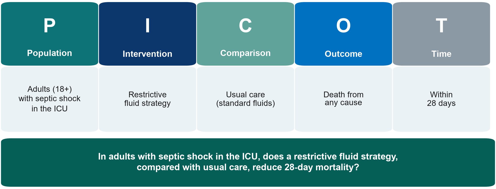{.neu-fig}

::: {.neu-takeaway}
**KEY MESSAGE** Every session we come back to this one question.
:::

::: {.notes}
PICO = Population, Intervention, Comparison, Outcome. The T (Time) states when the outcome is measured.

Read the five boxes, then the full sentence at the bottom. This is the running example for the whole course.

Teaching point: each letter forces a decision. Which patients exactly? Restrictive how? Compared with what? Which outcome, measured when?

Variants: for observational questions I becomes E (exposure), e.g. 'a positive fluid balance' (PECO). Descriptive questions may only need P and O.

Misconception: 'the comparison is obvious'. Usual care varies between hospitals and over time, so it must be described.

Ask the room: 'Is 28-day mortality the only sensible outcome?' Expected: 90-day mortality, days alive without life support, kidney injury needing dialysis, fluid balance. The large trials used 90-day mortality.

Timing: 4 minutes.
:::

## PICO(T) on the ward: three worked examples

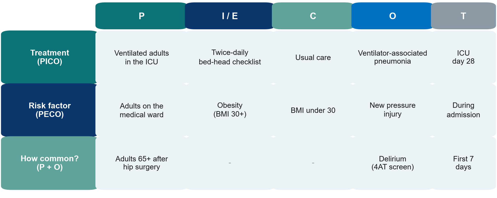{.neu-fig}

::: {.neu-takeaway}
**KEY MESSAGE** Treatment questions use PICO, risk questions PECO, 'how many?' questions only P and O.
:::

::: {.notes}
Three examples that are NOT about fluids, so every profession sees itself.

Row 1, treatment (PICO): ventilated adults; a twice-daily bed-head checklist vs usual care; ventilator-associated pneumonia by ICU day 28.

Row 2, risk factor (PECO): we cannot assign obesity, so I becomes E (exposure). Adults on the medical ward; obese vs not; new pressure injury during admission.

Row 3, how common? Only P and O (and T): adults 65 and over after hip-fracture surgery; delirium screened with the 4AT in the first 7 days.

Teaching point: the boxes you fill already tell you the type of question, and later the design.

Ask the room: 'Give me a PECO question from pharmacy.' Expected example: in ICU adults, is polypharmacy (10+ drugs) vs fewer associated with delirium?

Timing: 4 minutes.
:::

## Check your understanding: spot the PICO

::: {.neu-banner style="--c:#6C3483"}
QUICK QUIZ · 3 min
:::

::: {.neu-activity-steps style="--c:#6C3483"}
- Read the question: 'In adults aged 65+ after hip-fracture surgery, does a daily non-drug bundle, compared with usual care, reduce delirium in the first 7 days?'
- Which words are P? Which are I? C? O? T?
- Write the five letters on your sheet (Exercise 1, warm-up)
- Compare with your neighbour
:::

::: {.neu-output style="--c:#6C3483"}
**OUTPUT** Five labelled pieces. The answer is on the next slide
:::

::: {.notes}
Give the room 2 minutes in silence, then 1 minute to compare.

Answer (next slide): P adults 65+ after hip-fracture surgery; I daily non-drug delirium bundle; C usual care; O delirium; T first 7 postoperative days.

Watch for people labelling 'hip fracture' as the outcome. It is part of the population.

Timing: 3 minutes.
:::

## Answer: spot the PICO

:::: {.neu-cards style="--n:5"}
::: {.neu-card .plain style="--c:#0D7377"}
[P]{.neu-card-title}

- Adults 65+
- after hip-fracture
- surgery
:::
::: {.neu-card .plain style="--c:#0B376C"}
[I]{.neu-card-title}

- Daily non-drug
- delirium bundle
:::
::: {.neu-card .plain style="--c:#5FA39B"}
[C]{.neu-card-title}

- Usual care
:::
::: {.neu-card .plain style="--c:#0070C0"}
[O]{.neu-card-title}

- Delirium
- (screened daily)
:::
::: {.neu-card .plain style="--c:#055F56"}
[T]{.neu-card-title}

- First 7 days
- after surgery
:::
::::

::: {.neu-takeaway}
**KEY MESSAGE** The diagnosis that brings patients in is part of P, not O.
:::

::: {.notes}
Reveal and ask how many got all five.

Teaching point: the outcome must be something that can happen AFTER the intervention starts. Hip fracture has already happened: it defines who is eligible.

Extra question for fast rooms: 'How would you measure delirium?' Expected: a validated screening tool (e.g. 4AT or CAM) at the same time each day.

Timing: 2 minutes.
:::

## Two families of questions

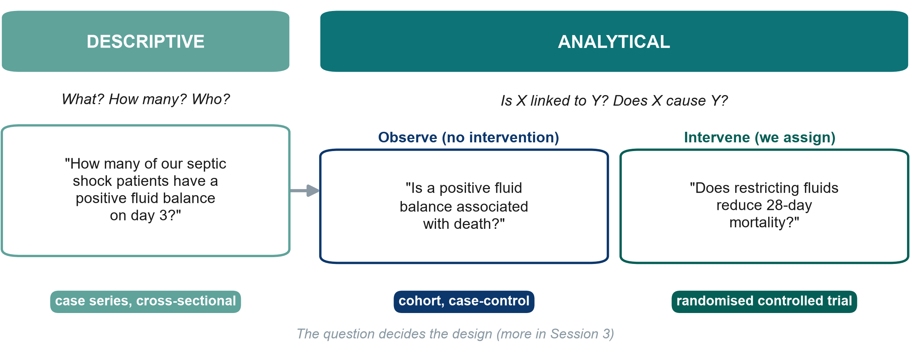{.neu-fig}

::: {.neu-takeaway}
**KEY MESSAGE** Descriptive questions describe. Analytical questions compare or test a cause.
:::

::: {.notes}
Descriptive: what, how many, who. No comparison group is needed.

Analytical: is X linked to Y (observational: we watch), or does X cause Y (experimental: we assign X).

Teaching point: the verbs give it away. 'How many' is descriptive; 'is associated with' is observational; 'does it reduce' implies an experiment.

Misconception: 'descriptive studies are not real research'. They often come first and show that the problem exists.

Ask the room: 'Paper 2 (Hyun): which box?' Expected: analytical, observational (cohort).

Timing: 3 minutes. The full design menu is Session 3.
:::

## From a vague worry to an answerable question

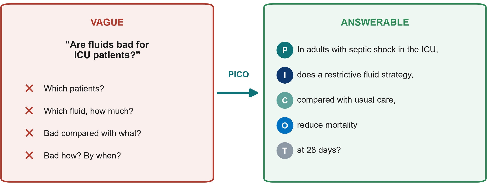{.neu-fig}

::: {.neu-takeaway}
**KEY MESSAGE** If you cannot fill all four PICO boxes, the question is not ready yet.
:::

::: {.notes}
Left: the question we ask in the corridor: every word is undefined. Right: the same worry written with PICO(T).

Teaching point: a researchable question is specific, has one primary outcome, and implies the design.

Misconception: 'a broad question is more important'. Broad questions produce vague answers.

Ask the room: 'Make this answerable: Is hand hygiene good?' Expected direction: in ICU staff (P), does a feedback programme (I) vs no feedback (C) increase hand-hygiene compliance at 3 months (O, T)?

Timing: 3 minutes.
:::

## FINER: is the question worth asking?

::: {.neu-intro}
Check every question against five tests before you invest time in it.
:::

:::: {.neu-cards style="--n:5"}
::: {.neu-card .plain style="--c:#0D7377"}
[Feasible]{.neu-card-title}

- Enough patients
- Time, money, skills
- Data available
:::
::: {.neu-card .plain style="--c:#0B376C"}
[Interesting]{.neu-card-title}

- To you, your team
- and to readers
:::
::: {.neu-card .plain style="--c:#5FA39B"}
[Novel]{.neu-card-title}

- Confirms, refutes
- or extends what
- is known
:::
::: {.neu-card .plain style="--c:#0070C0"}
[Ethical]{.neu-card-title}

- Approvable by the
- ethics committee
:::
::: {.neu-card .plain style="--c:#055F56"}
[Relevant]{.neu-card-title}

- Could change
- practice, policy
- or research
:::
::::

::: {.neu-takeaway}
**KEY MESSAGE** If the question fails one letter, rewrite it before going further.
:::

::: {.notes}
FINER comes from Hulley and colleagues, Designing Clinical Research.

Feasible fails most often in hospital research: not enough eligible patients, or an outcome that is too rare.

Novel does not mean 'never studied'. Repeating a study in a new setting, or with a better design, can be novel. That is why the literature search matters.

Ethical: is there genuine uncertainty (equipoise) about which option is better?

Ask the room: 'Which letter does our running example fail?' Let them guess. The next slide answers.

Timing: 3 minutes.
:::

## FINER check of our running example

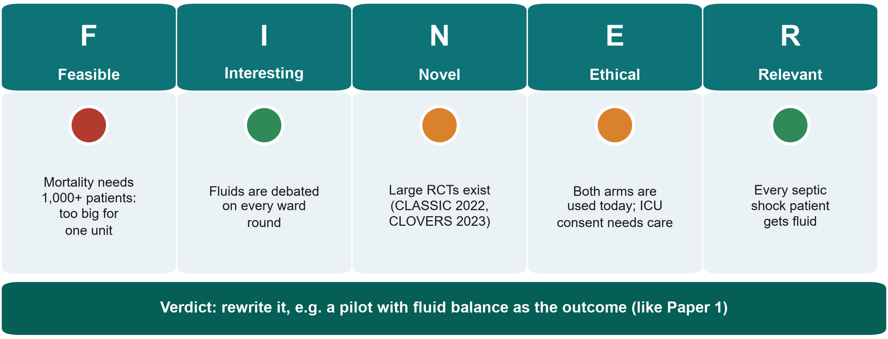{.neu-fig}

::: {.neu-takeaway}
**KEY MESSAGE** Our question is important but not feasible for one unit: rewrite it.
:::

::: {.notes}
F is red: to show a few percentage points difference in mortality you need well over a thousand patients. CLASSIC randomised 1,554; CLOVERS (NEJM 2023) 1,563. One ICU cannot do this.

N is amber: large trials already exist and neither found a mortality difference.

E is amber: both strategies are used in practice so equipoise exists, but consent in septic shock is difficult (Session 7).

How to rescue it: change the outcome (fluid balance at day 5, as Paper 1 did), make it a feasibility pilot, or ask a descriptive question about our own practice.

Misconception: 'a failed FINER check means a bad idea'. It means the idea needs reshaping, which is normal and expected.

Ask the room: 'Suggest a feasible version for our unit.' Expected: a descriptive audit-style question, or a pilot like Paper 1.

Timing: 3 minutes.
:::

## Pair task: from scenario to question

::: {.neu-banner style="--c:#0D7377"}
GROUP WORK · 11 min
:::

:::: {.columns}
::: {.column width="60%"}
::: {.neu-activity-steps style="--c:#0D7377"}
- Pick ONE scenario from Exercise 1 on your sheet
- Fill the PICO(T) boxes
- Write the question as one sentence
- Give it a quick FINER traffic light (green / amber / red)
- Write H0 and H1 (or say why none is needed)
:::
:::
::: {.column width="40%"}
::: {.neu-side .plain style="--c:#0D7377"}
Scenarios

- Ventilator pneumonia
- Pressure injuries
- Delirium
- Stroke door-to-needle
- Medication errors
:::
:::
::::

::: {.neu-output style="--c:#0D7377"}
**OUTPUT** One PICO question + FINER light + hypothesis, ready to read aloud
:::

::: {.notes}
Pairs: one person from each profession where possible.

Facilitation: circulate with the 'what good looks like' box from Course/Solutions/s1\_solutions.md. Commonest problems: a missing comparison, an outcome without a time point, two outcomes squeezed into one question.

At 8 minutes call time. Take three pairs to read their question aloud; ask the room to name each PICO letter and 'which FINER letter worries you?'.

Pressure-injury pairs often discover their first question should be descriptive. Praise this explicitly.

Timing: 8 minutes work + 3 minutes debrief. Segment 1.3 starts at 2:05.
:::

## 1.3  Aims, objectives, hypotheses

:::: {.neu-statement}
::: {.neu-big}
A question tells us what we want to know. Aims and objectives tell us what we will do.
:::

::: {.neu-sub}
20 minutes: aim, objectives, null and alternative hypotheses, and a quick exercise
:::
::::

::: {.notes}
SEGMENT 1.3 (2:05-2:25).

Teaching point: the aim, objectives and hypothesis are the question written as a plan. Ethics committees and grant reviewers read them first.

Keep it concrete: every example uses the running example or the pair-task scenarios.

Timing: 30 seconds.
:::

## Aim, objectives, hypothesis

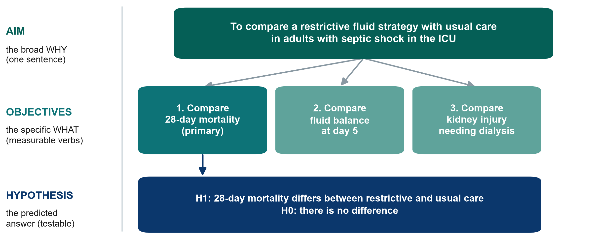{.neu-fig}

::: {.neu-takeaway}
**KEY MESSAGE** One aim, 2-3 measurable objectives, one testable hypothesis per main objective.
:::

::: {.notes}
Aim = the broad purpose in one sentence ('To compare...', 'To describe...').

Objectives = specific, measurable steps. Use measurable verbs: compare, estimate, describe, determine. Avoid 'understand', 'explore', 'study'.

Mark the primary objective: it drives the sample size (Session 6).

Hypothesis = the predicted answer to the main analytical objective, stated so data can reject it.

Misconception: 'every study needs a hypothesis'. Purely descriptive studies estimate; they do not test a hypothesis.

Timing: 3 minutes.
:::

## Objectives start with a measurable verb

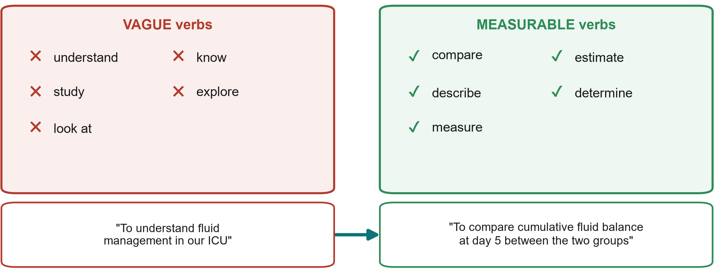{.neu-fig}

::: {.neu-takeaway}
**KEY MESSAGE** If you cannot say how you will measure it, it is not yet an objective.
:::

::: {.notes}
Left: verbs that describe a wish, not an action you can check. Right: verbs that point to something you can count or measure.

Bottom: the same idea rewritten. 'To understand fluid management' cannot be finished or checked; 'to compare cumulative fluid balance at day 5 between groups' tells us the outcome, the time and the comparison.

Teaching point: each objective should match one outcome and, later, one analysis (Session 6).

Misconception: 'more objectives make a stronger proposal'. Two or three focused objectives are better than eight vague ones.

Ask the room: 'Rewrite: to study delirium in our ward.' Expected: to estimate the proportion of patients aged 65+ who develop delirium in the first 7 days after hip-fracture surgery.

Timing: 3 minutes.
:::

## Null and alternative hypotheses

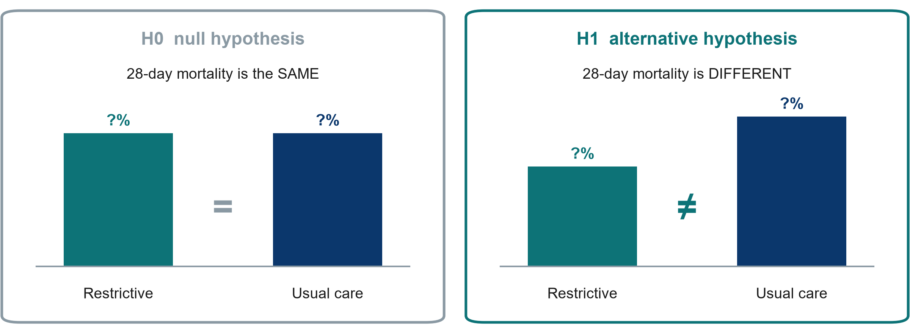{.neu-fig}

::: {.neu-takeaway}
**KEY MESSAGE** We test H0. Data can reject it or fail to reject it, but never prove it.
:::

::: {.notes}
H0, the null hypothesis: no difference. H1, the alternative: a difference.

Analogy: a court assumes 'not guilty' (H0) until the evidence is strong enough. 'Not guilty' is not 'innocent', and 'no significant difference' is not 'no difference'.

H1 is usually two-sided, even when we expect benefit, because restriction could also harm.

Misconception: 'p \> 0.05 proves the treatments are equal'. Small studies like Paper 1 (48 patients) often cannot detect real differences. P-values are Session 6.

Timing: 3 minutes.
:::

## Quick exercise: aim, objectives, hypothesis

::: {.neu-banner style="--c:#0B376C"}
INDIVIDUAL TASK · 7 min
:::

:::: {.columns}
::: {.column width="60%"}
::: {.neu-activity-steps style="--c:#0B376C"}
- Use the question from your pair task (or the delirium example)
- Write ONE aim: 'To compare...' or 'To describe...'
- Write TWO objectives with measurable verbs; mark the primary one
- Write H0 and H1 for the primary objective (or 'descriptive: no hypothesis')
- Swap with your neighbour: is every verb measurable?
:::
:::
::: {.column width="40%"}
::: {.neu-side .plain style="--c:#0B376C"}
Verbs that work

- compare
- estimate
- describe
- determine
- measure
:::
:::
::::

::: {.neu-output style="--c:#0B376C"}
**OUTPUT** Exercise 3 on the sheet. Model answers on the next slide
:::

::: {.notes}
Individual, 5 minutes writing + 2 minutes swapping.

Circulate and look for 'understand/know/study', objectives with no time point, and hypotheses about an outcome that is not in the objectives.

Model answers for the delirium example are on the next slide and in Course/Solutions/s1\_solutions.md.

Timing: 7 minutes.
:::

## Model answer: the delirium example

:::: {.neu-cards style="--n:3"}
::: {.neu-card .plain style="--c:#0D7377"}
[Aim]{.neu-card-title}

- To compare a daily
- non-drug bundle with
- usual care after
- hip-fracture surgery
:::
::: {.neu-card .plain style="--c:#0B376C"}
[Objectives]{.neu-card-title}

- (Primary) Compare
- delirium in 7 days
- Compare length
- of stay
:::
::: {.neu-card .plain style="--c:#5FA39B"}
[Hypothesis]{.neu-card-title}

- H0: delirium is the
- same in both groups
- H1: it differs
:::
::::

::: {.neu-takeaway}
**KEY MESSAGE** Aim, primary objective and hypothesis all name the same outcome.
:::

::: {.notes}
Read the three cards.

Check the chain: the question's O (delirium in 7 days) = the primary objective = the outcome in H0/H1. If any of these differ, the proposal is inconsistent, and reviewers spot this immediately.

A descriptive version needs no hypothesis: 'To estimate the proportion of patients aged 65+ who develop delirium in the first 7 days after hip-fracture surgery.'

Timing: 3 minutes. Segment 1.3 ends at 2:25.
:::

## Proposal builder 1

:::: {.neu-statement}
::: {.neu-big}
Now it is your group's turn: one topic, one question, one aim.
:::

::: {.neu-sub}
30 minutes of group work: the start of your research proposal
:::
::::

::: {.notes}
PROPOSAL BUILDER 1 (2:25-2:55).

Teaching point: everything taught today is now applied to the group's own topic. By 2:55 each group has a PICO question that passes FINER, an aim and 2-3 objectives in the proposal template.

Groups choose ONE problem. If a group cannot agree in 5 minutes, give them the running example or a secondary example (VAP, pressure injuries, hand hygiene, door-to-needle time, delirium, medication errors).

The search, the 5 references, the problem statement and the working title are next Saturday (Proposal builder 2).

Timing: 1 minute.
:::

## Proposal builder 1: your group's question

::: {.neu-banner style="--c:#055F56"}
PROPOSAL BUILDER · 28 min
:::

:::: {.columns}
::: {.column width="60%"}
::: {.neu-activity-steps style="--c:#055F56"}
- Choose ONE problem from your unit (list 3 ideas, vote, pick one)
- Fill the PICO(T) table and write the question in one sentence
- FINER traffic light for each letter; rewrite if anything is red
- Research, audit or QI? Note the approval route
- Aim + 2-3 objectives (mark the primary) + H0/H1
- One group reads its question aloud
:::
:::
::: {.column width="40%"}
::: {.neu-side .plain style="--c:#055F56"}
Timing

- 0-7 min: choose the topic
- 7-14: PICO + question
- 14-19: FINER + rewrite
- 19-25: aim, objectives, H0/H1
- 25-28: 1 group reads aloud
:::
:::
::::

::: {.neu-output style="--c:#055F56"}
**OUTPUT** Proposal Part 1 started: PICO, question, FINER, aim, objectives
:::

::: {.notes}
Groups of about 6, mixed professions. Suggested roles: chair, scribe (types into the template), timekeeper, and a 'devil's advocate' who checks FINER.

Trainers circulate. Spend the first 7 minutes making sure every group has ONE focused problem. This is where groups get stuck.

Check each group's question against PICO and FINER before they write objectives. A red F is the commonest problem. Help them shrink the outcome, shorten the time frame or turn it into a descriptive question or pilot.

Second visit: does the primary objective name the same outcome as the question? Is the approval route (research / audit / QI) written down?

At 2:50 (minute 25), stop the work; one group reads its question and aim aloud; invite one improvement from the room.

What good looks like: Course/Solutions/s1\_solutions.md (Exercise 4).

Timing: 28 minutes. Wrap-up starts at 2:55.
:::

## Key words of the day

| Key word | In one line |
|:---|:---|
| Evidence pyramid | Ranks designs by how well they protect against bias |
| Research / audit / QI | What is best? / Do we do it? / How do we improve it? |
| PICO(T) / PECO | Population, Intervention (or Exposure), Comparison, Outcome, Time |
| FINER | Feasible, Interesting, Novel, Ethical, Relevant |
| Aim / objective | The broad why / the specific, measurable what |
| H0 / H1 | No difference / a difference (we test H0) |

::: {.notes}
WRAP-UP (2:55-3:00).

Read the six key words quickly; these are also in the course glossary (EN-VN).

Ask one participant to explain PICO in their own words.

Timing: 1 minute.
:::

## Session 1 recap

:::: {.neu-cards style="--n:3"}
::: {.neu-card .plain style="--c:#0D7377"}
[Why research]{.neu-card-title}

- Experience asks;
- fair comparisons
- in enough patients answer
:::
::: {.neu-card .plain style="--c:#0B376C"}
[Ask precisely]{.neu-card-title}

- PICO(T) question,
- one primary outcome,
- FINER before you start
:::
::: {.neu-card .plain style="--c:#5FA39B"}
[Plan it]{.neu-card-title}

- One aim, 2-3
- measurable objectives,
- a testable H0/H1
:::
::::

::: {.neu-takeaway}
**KEY MESSAGE** Next Saturday: find and read what is already known about your question.
:::

::: {.notes}
Read the three messages.

Link forward: next Saturday (Session 2) we search PubMed for each group's question, manage references, and learn to read a paper in 15 minutes.

Timing: 1.5 minutes.
:::

## Exit question

::: {.neu-banner style="--c:#6C3483"}
QUICK QUIZ · 2 min
:::

::: {.neu-activity-steps style="--c:#6C3483"}
- Which FINER letter did our running example fail, and why?
- Rewrite as an objective: 'To understand pressure injuries on our ward'
- Write both answers on a sticky note (no names) and stick it on the door as you leave
:::

::: {.neu-output style="--c:#6C3483"}
**OUTPUT** One sticky note per person (we read them before next Saturday)
:::

::: {.notes}
Answers: 1. Feasible: a mortality outcome needs well over a thousand patients. 2. For example, 'To estimate the incidence of new stage 2+ pressure injuries among adults on our ward over 6 months'.

Read the notes during the week. If many still use vague verbs, open Session 2 with one extra minute on objectives.

Timing: 1.5 minutes.
:::

## Homework for next Saturday (Session 2)

::: {.neu-banner style="--c:#0B376C"}
INDIVIDUAL TASK
:::

:::: {.columns}
::: {.column width="60%"}
::: {.neu-activity-steps style="--c:#0B376C"}
- Group: finish the PICO, question, aim and objectives if not done
- Everyone: for each PICO word, write 2-3 English synonyms (Exercise 5)
- Everyone: think of one local number that shows the problem (an audit, a count)
- Optional: install Zotero (free, zotero.org) on your laptop
:::
:::
::: {.column width="40%"}
::: {.neu-side .plain style="--c:#0B376C"}
Bring next Saturday

- Your group's PICO question
- Your synonym list
- A laptop or phone per group
:::
:::
::::

::: {.neu-output style="--c:#0B376C"}
**OUTPUT** PICO question ready for next Saturday's search
:::

::: {.notes}
Keep it light: about 30 minutes during the week.

The synonym list makes next Saturday's PubMed search much faster, because PubMed searches in English.

The 'local number' becomes paragraph 3 of the problem statement next Saturday.

Close on time. Thank the room.

Timing: 1 minute.
:::

---

:::: {.neu-statement}
::: {.neu-big}
Extra slides: Session 1
:::

::: {.neu-sub}
Use if time allows, or for self-study
:::
::::

::: {.notes}
EXTRA SLIDES (Session 1).

Everything after this slide is optional. Use it if the room is fast, if a group asks, or point participants to it for self-study.

The core session is complete without these slides.
:::

## PICO for other kinds of question

:::: {.neu-cards style="--n:3"}
::: {.neu-card .plain style="--c:#0D7377"}
[Diagnosis]{.neu-card-title}

- P: patients tested
- I: new test
- C: reference standard
- O: accuracy
:::
::: {.neu-card .plain style="--c:#0B376C"}
[Prognosis]{.neu-card-title}

- P: patients with X
- E: a risk factor
- O: what happens
- T: by when
:::
::: {.neu-card .plain style="--c:#5FA39B"}
[Qualitative (SPIDER)]{.neu-card-title}

- Sample, Phenomenon
- of interest, Design,
- Evaluation,
- Research type
:::
::::

::: {.neu-takeaway}
**KEY MESSAGE** The letters change, but the idea stays the same: be explicit.
:::

::: {.notes}
EXTRA: diagnosis, prognosis and qualitative question frameworks.

Diagnostic questions: the index test is I, the reference standard is C, the outcome is accuracy (sensitivity and specificity, Session 4).

Prognosis: often PECO plus a time frame.

Qualitative questions often use SPIDER (Cooke and colleagues, 2012): Sample, Phenomenon of Interest, Design, Evaluation, Research type.

Timing: 2 minutes if used.
:::

## One-sided or two-sided H1?

:::: {.neu-cards style="--n:3"}
::: {.neu-card .plain style="--c:#0D7377"}
[Two-sided (usual)]{.neu-card-title}

- 'Mortality differs'
- Allows benefit
- OR harm
:::
::: {.neu-card .plain style="--c:#0B376C"}
[One-sided (rare)]{.neu-card-title}

- 'Mortality is lower'
- Ignores possible harm
- Needs strong reason
:::
::: {.neu-card .plain style="--c:#5FA39B"}
[Non-inferiority]{.neu-card-title}

- 'Not worse by more
- than a set margin'
- (Session 3)
:::
::::

::: {.neu-takeaway}
**KEY MESSAGE** When in doubt, write a two-sided H1.
:::

::: {.notes}
EXTRA: one- vs two-sided hypotheses.

Two-sided hypotheses are the default in clinical research because a new intervention can harm as well as help.

One-sided tests must be pre-specified and justified; reviewers are suspicious of them.

Non-inferiority questions (is a cheaper or simpler option not much worse?) have their own design (Session 3).

Timing: 2 minutes if used.
:::

## More practice: which FINER letter fails?

::: {.neu-banner style="--c:#6C3483"}
QUICK QUIZ · 4 min
:::

::: {.neu-activity-steps style="--c:#6C3483"}
- All hospitalised adults in the country: does vitamin D reduce mortality over 10 years?
- Septic shock: does withholding antibiotics for 24 h reduce resistance?
- Do our ICU nurses wash their hands? (already audited monthly for 5 years)
- Pneumonia: does the colour of the drug chart affect 28-day mortality?
:::

::: {.neu-output style="--c:#6C3483"}
**OUTPUT** One letter per question
:::

::: {.notes}
EXTRA: extra FINER practice.

Answers: 1 Feasible (huge, long, expensive; large vitamin D trials also exist, so Novel too). 2 Ethical (withholding antibiotics in septic shock causes harm, so there is no equipoise). 3 Novel (the answer is already measured: an audit question). 4 Relevant (no plausible mechanism, no impact on practice).

Also in Exercise 2 Part B of the participant sheet.

Timing: 4 minutes if used.
:::

## Vague vs answerable: a ward example

{.neu-fig}

::: {.neu-takeaway}
**KEY MESSAGE** Practise on your own ward: take a corridor question and fill the PICO boxes.
:::

::: {.notes}
EXTRA: more vague-to-answerable practice with a ward example.

Use this slide again with a ward example if the room needs more practice.

Ask: 'Make this answerable: Do night shifts cause medication errors?' Expected direction: in ward nurses (P), are night shifts (E) compared with day shifts (C) associated with more medication administration errors per 1,000 doses (O) over 6 months (T)?

Point out that this becomes a PECO (observational) question because we cannot randomise nurses to night shifts easily.

Timing: 3 minutes if used.
:::
