# Session 2 · Find & read: the evidence

## Week 2 · Saturday

- Recap quiz on Session 1
- 2.1  Finding the evidence: PICO to search, Boolean, MeSH, live PubMed demo
- 2.2  Managing and citing: Zotero demo, citation styles, paraphrasing, grey literature
- Break
- 2.3  Reading a paper in 15 minutes and 2.4 from literature to introduction
- Proposal builder 2: search string, 5 references, problem statement, working title

::: {.notes}
SESSION 2 OPENING (0:00).

Teaching point: last Saturday each group wrote a question; today we find out what is already known about it, keep the references safely, and read papers efficiently.

Pace: slower than it looks. Every block has a demo or a task. Use the 'Check your understanding' slides: they show you who is lost.

Practical check before starting: each group has its PICO question, its synonym list (homework), and at least one laptop or phone.

Timing: 1 minute, then the recap quiz.
:::

## Recap quiz: Session 1

::: {.neu-banner style="--c:#6C3483"}
QUICK QUIZ · 8 min
:::

::: {.neu-activity-steps style="--c:#6C3483"}
- Checking whether fluid balance is charted daily as the protocol says: research, audit or QI?
- 'In ICU staff, does hand-hygiene feedback vs none increase compliance at 3 months?' Name P, I, C, O, T
- Which FINER letter did our running example fail?
- Which is an objective: 'to understand delirium' or 'to estimate the proportion with delirium'?
- Write H0 for: does early mobilisation shorten ICU stay?
:::

::: {.neu-output style="--c:#6C3483"}
**OUTPUT** Answers on paper, checked against the next slide
:::

::: {.notes}
RECAP QUIZ (0:00-0:10). Individual, on paper, 6 minutes; then 2 minutes comparing with a neighbour. Answers on the next slide.

This also re-activates last Saturday's vocabulary for today's search.

Latecomers: let them join at question 2.

Timing: 8 minutes.
:::

## Recap quiz: answers

:::: {.neu-cards style="--n:5"}
::: {.neu-card .plain style="--c:#0D7377"}
[Audit]{.neu-card-title}

- Checking practice
- against a standard
:::
::: {.neu-card .plain style="--c:#0B376C"}
[PICO(T)]{.neu-card-title}

- P ICU staff
- I feedback  C none
- O compliance
- T 3 months
:::
::: {.neu-card .plain style="--c:#5FA39B"}
[Feasible]{.neu-card-title}

- Mortality needs
- 1,000+ patients
:::
::: {.neu-card .plain style="--c:#0070C0"}
[Estimate]{.neu-card-title}

- A measurable verb;
- 'understand' is not
:::
::: {.neu-card .plain style="--c:#055F56"}
[H0]{.neu-card-title}

- ICU stay is the
- same with early
- mobilisation and
- usual care
:::
::::

::: {.neu-takeaway}
**KEY MESSAGE** If you got 4 or 5 right, you are ready for today.
:::

::: {.notes}
Go through the five answers in 2 minutes. Ask for a show of hands: who got 4 or 5?

If many missed question 4 or 5, spend one extra minute: objectives use measurable verbs; H0 always says 'no difference'.

Timing: 2 minutes. Segment 2.1 starts at 0:10.
:::

## 2.1  Finding the evidence

:::: {.neu-statement}
::: {.neu-big}
Before you study it, find out what is already known.
:::

::: {.neu-sub}
40 minutes: the search funnel, PICO to search blocks, Boolean, MeSH, search tools and a live PubMed demo
:::
::::

::: {.notes}
SEGMENT 2.1 (0:10-0:50).

Teaching point: the literature search decides whether the question is novel, gives the background for the problem statement, and shows how others measured the outcome.

Ask the room: 'What do you usually do when you need evidence quickly?' Honest answers: Google, a colleague, UpToDate, a guideline. All fine for care, but a proposal needs a documented search.

Timing: 1 minute.
:::

## The search funnel

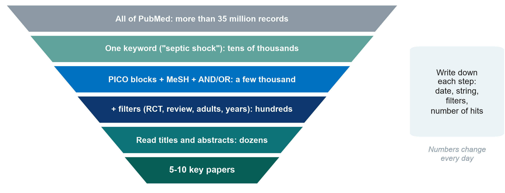{.neu-fig}

::: {.neu-takeaway}
**KEY MESSAGE** A good search starts wide, narrows step by step, and is written down.
:::

::: {.notes}
Walk down the funnel: all of PubMed, one keyword, structured PICO blocks, filters, human screening, a handful of key papers.

The numbers are orders of magnitude only. They change every day.

Teaching point: the last two steps are done by reading, not by the computer.

Ask the room: 'Why write down the date and the search string?' Expected: so it can be repeated. Journals and reviewers ask for it.

Timing: 3 minutes.
:::

## From PICO to search blocks

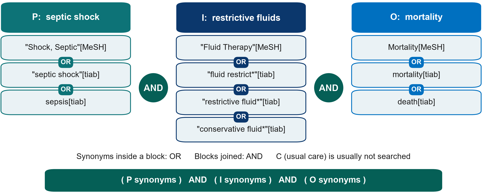{.neu-fig}

::: {.neu-takeaway}
**KEY MESSAGE** One block per PICO concept: OR inside a block, AND between blocks.
:::

::: {.notes}
Turn each PICO element into a concept block: the MeSH term plus free-text words.

\[tiab\] = title and abstract. The asterisk (\*) is truncation: restrictive fluid\* also finds 'restrictive fluids'.

The comparison (usual care) is normally left out because the words vary too much.

Misconception: 'just type the whole question into PubMed'. You lose control of synonyms and logic.

Ask the room: 'Which other words would authors use for restrictive?' Expected: conservative, limited, de-resuscitation, fluid removal, negative fluid balance.

Timing: 4 minutes.
:::

## Worked example 2: a ward question

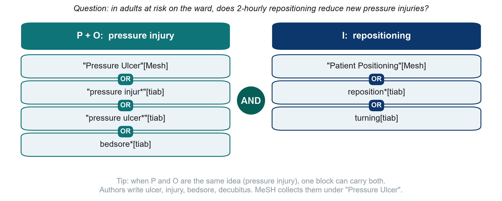{.neu-fig}

::: {.neu-takeaway}
**KEY MESSAGE** Same method for any topic: concepts in blocks, synonyms with OR, blocks with AND.
:::

::: {.notes}
A second worked example, from the ward, so nurses and pharmacists see the method works beyond the ICU.

Question: in adults at risk on the ward, does 2-hourly repositioning reduce new pressure injuries?

Here P and O share the same idea (pressure injury), so one block carries both. The second block is the intervention.

MeSH: authors write pressure ulcer, pressure injury, bedsore, decubitus. The MeSH heading 'Pressure Ulcer' collects them.

Ask the room: 'Which other words would authors use for repositioning?' Expected: turning, position change, mobilisation, offloading.

Timing: 4 minutes.
:::

## Boolean logic in pictures

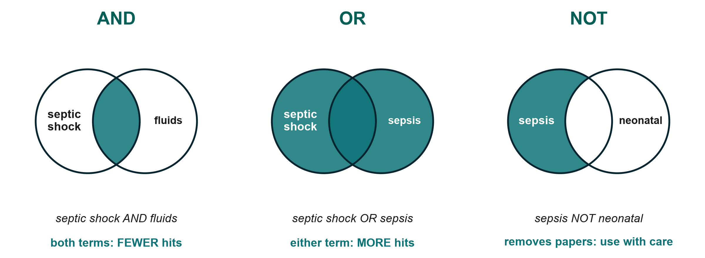{.neu-fig}

::: {.neu-takeaway}
**KEY MESSAGE** AND narrows, OR widens, NOT removes. Use NOT sparingly.
:::

::: {.notes}
AND: only papers with both concepts, so fewer hits. OR: either word, so more hits. Use OR for synonyms.

NOT removes every paper that mentions the second term, even good papers that mention neonates once. That is why NOT is risky.

Tip: operators in CAPITALS; brackets control the order.

Ask the room: 'septic shock AND fluids vs septic shock OR fluids: which gives more hits?' Expected: OR.

Timing: 3 minutes.
:::

## Check your understanding: AND, OR or NOT?

::: {.neu-banner style="--c:#6C3483"}
QUICK QUIZ · 2 min
:::

::: {.neu-activity-steps style="--c:#6C3483"}
- You want papers that mention BOTH delirium AND hip fracture: which operator?
- You want papers using EITHER 'pressure ulcer' OR 'bedsore': which operator?
- Your search found 40,000 hits. Will adding a third AND block give more or fewer?
- Why is 'sepsis NOT children' risky?
:::

::: {.neu-output style="--c:#6C3483"}
**OUTPUT** Answers out loud
:::

::: {.notes}
Answers: 1 AND. 2 OR. 3 Fewer (AND narrows). 4 It removes every paper that mentions children anywhere, including good adult studies that mention children once.

Timing: 2 minutes.
:::

## MeSH: the shared label behind many words

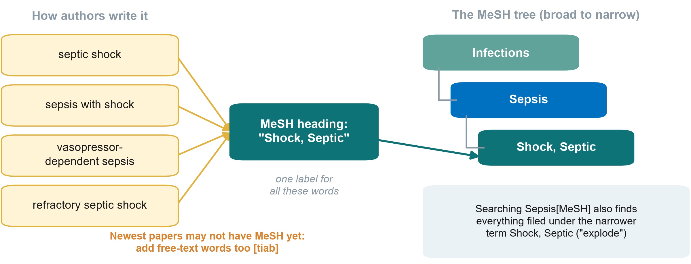{.neu-fig}

::: {.neu-takeaway}
**KEY MESSAGE** Search the MeSH term AND the free-text words, joined with OR.
:::

::: {.notes}
MeSH (Medical Subject Headings) is the controlled vocabulary of the US National Library of Medicine. Each MEDLINE record is tagged with MeSH terms, whatever words the authors used.

Searching a MeSH term includes the narrower terms below it ('explode'). For example, Sepsis\[MeSH\] includes Shock, Septic.

The newest records may not be indexed yet, so always add free-text \[tiab\] words.

Ask the room: 'Why does MeSH help a nurse searching for pressure injury?' Expected: authors write pressure ulcer, bedsore, decubitus ulcer, and MeSH collects them under one heading.

Timing: 3 minutes.
:::

## Four tools that sharpen a search

:::: {.neu-cards style="--n:4"}
::: {.neu-card .plain style="--c:#0D7377"}
["Quotes"]{.neu-card-title}

- "septic shock"
- = exact phrase
- not two loose words
:::
::: {.neu-card .plain style="--c:#0B376C"}
[Truncation \*]{.neu-card-title}

- restrict\*
- = restrict, restricted,
- restriction, restrictive
:::
::: {.neu-card .plain style="--c:#5FA39B"}
[Field tags]{.neu-card-title}

- \[tiab\] title/abstract
- \[mh\] MeSH term
- \[pt\] article type
:::
::: {.neu-card .plain style="--c:#0070C0"}
[Filters]{.neu-card-title}

- Article type (RCT,
- systematic review)
- Date, age, humans
:::
::::

::: {.neu-takeaway}
**KEY MESSAGE** Check 'Search details' to see exactly what PubMed searched.
:::

::: {.notes}
Quotes keep a phrase together. Truncation finds all endings, but too short a stem (flu\*) finds influenza and fluoride too.

Field tags restrict where PubMed looks; filters (left of the results) narrow by article type, date, age. Each filter needs a reason you can write down.

Misconception: 'filter to free full text'. That throws away key papers.

Timing: 3 minutes.
:::

## PubMed vs Google Scholar

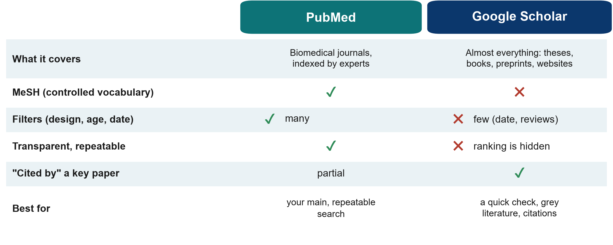{.neu-fig}

::: {.neu-takeaway}
**KEY MESSAGE** PubMed for the main search; Google Scholar to check and to follow citations.
:::

::: {.notes}
PubMed: free, run by the US National Library of Medicine, biomedical journals, MeSH, many filters, a transparent search you can repeat.

Google Scholar: very broad (theses, books, preprints), good for grey literature and 'Cited by'; but hidden ranking, few filters, hard to repeat.

Other databases exist (Embase, CINAHL for nursing, Cochrane Library), but they are not needed for Level 1.

Ask the room: 'A colleague found a perfect paper in Google Scholar. What should you check?' Expected: peer-reviewed or preprint? Legitimate journal? (Predatory journals: Session 8.)

Timing: 3 minutes.
:::

## Live demo: searching PubMed for our question

::: {.neu-banner style="--c:#B5651D"}
LIVE DEMO · 10 min
:::

:::: {.columns}
::: {.column width="60%"}
::: {.neu-activity-steps style="--c:#B5651D"}
- Search one keyword, septic shock, and note the number of hits
- Paste the full PICO string: P, I and O blocks joined with AND
- Look at 'Search details': what did PubMed really search?
- Add filters: RCT and systematic review, adults, last 10 years
- Open one result: abstract, MeSH terms, 'Similar articles', 'Cited by'
- Send to: Citation manager (we import it in 2.2)
:::
:::
::: {.column width="40%"}
::: {.neu-side .plain style="--c:#B5651D"}
Watch for

- How the hits fall at each step
- Which papers keep appearing
- Can you find Paper 1 and CLASSIC?
:::
:::
::::

::: {.neu-output style="--c:#B5651D"}
**OUTPUT** A search string we can all copy (Exercise 1 on the sheet)
:::

::: {.notes}
Follow Course/Demos/s2\_demo.md, Part A (PubMed): exact strings, where to click, and the offline fallback.

Do not promise hit counts. Expect tens of thousands for 'septic shock' and a few thousand for the full PICO string; numbers change every day.

Narrate slowly and pause after each step so participants can write the number of hits on their sheet.

If the internet fails, switch to the screenshots. Do not troubleshoot in front of the room.

Timing: 10 minutes.
:::

## Your turn: build a Boolean search

::: {.neu-banner style="--c:#0B376C"}
INDIVIDUAL TASK · 5 min
:::

::: {.neu-activity-steps style="--c:#0B376C"}
- Take your group's PICO question and your synonym list
- Exercise 1: write 2-4 synonyms for P, for I (or E) and for O
- Join synonyms with OR in brackets, and the blocks with AND
- Mark which words could be MeSH terms
- Swap with your neighbour: spot one missing synonym
:::

::: {.neu-output style="--c:#0B376C"}
**OUTPUT** One search string on paper, for your group to run in Proposal builder 2
:::

::: {.notes}
No computers needed: it is a paper exercise with the Boolean search builder.

Circulate and look for: missing brackets, AND and OR mixed inside one block, the comparison included as a block, NOT used without a reason.

Fast finishers: add one filter and write why.

Timing: 5 minutes. Segment 2.1 ends at 0:50.
:::

## 2.2  Managing and citing

:::: {.neu-statement}
::: {.neu-big}
Keep every reference you find, and use other people's work honestly.
:::

::: {.neu-sub}
20 minutes: reference managers (Zotero demo), citation styles, paraphrasing safely, grey literature
:::
::::

::: {.notes}
SEGMENT 2.2 (0:50-1:10).

Teaching point: two habits protect every proposal and paper: save references in a reference manager from day one, and never copy wording from a source.

Timing: 30 seconds.
:::

## Reference managers: save as you go

:::: {.neu-steps}
::: {.neu-step style="--c:#0D7377"}
[Collect]{.neu-step-label}

- Tick papers in PubMed
- Clipboard or
- Collections (My NCBI)
:::
::: {.neu-step style="--c:#0B376C"}
[Export]{.neu-step-label}

- Send to:
- Citation manager
- (.nbib file)
:::
::: {.neu-step style="--c:#5FA39B"}
[Import]{.neu-step-label}

- Zotero or Mendeley
- (free), EndNote
- (paid)
:::
::: {.neu-step style="--c:#0070C0"}
[Cite]{.neu-step-label}

- Insert citations
- in Word with
- the plug-in
:::
::: {.neu-step style="--c:#055F56"}
[List]{.neu-step-label}

- Reference list
- built for you
- in any style
:::
::::

::: {.neu-takeaway}
**KEY MESSAGE** A reference manager prevents the commonest error in proposals: wrong references.
:::

::: {.notes}
Teaching point: never type references by hand. A reference manager stores each paper once and formats it in any journal style.

Zotero (free, open source) and Mendeley (free) work with Word; EndNote is common in universities but paid. The best one is the one the whole group uses.

Browser connectors (e.g. Zotero Connector) save a paper from the journal page in one click, often with the PDF.

Misconception: 'I will sort the references at the end'. Saving as you go takes seconds; rebuilding a list takes hours and causes errors.

Timing: 2 minutes.
:::

## Live demo: from PubMed to Zotero to Word

::: {.neu-banner style="--c:#B5651D"}
LIVE DEMO · 5 min
:::

:::: {.columns}
::: {.column width="60%"}
::: {.neu-activity-steps style="--c:#B5651D"}
- Import the .nbib file from the PubMed demo into Zotero
- Look: authors, title, journal, year, DOI, with nothing typed by hand
- In Word: Zotero tab, Add/Edit Citation, type 'Meyhoff'
- Add/Edit Bibliography: the reference list appears
- Document Preferences: switch Vancouver to APA and back
:::
:::
::: {.column width="40%"}
::: {.neu-side .plain style="--c:#B5651D"}
Watch for

- \[1\] becomes (Meyhoff et al., 2022)
- The list reformats itself
:::
:::
::::

::: {.neu-output style="--c:#B5651D"}
**OUTPUT** Everyone has seen the full collect → cite → list cycle
:::

::: {.notes}
Follow Course/Demos/s2\_demo.md, Part B (Zotero).

Preparation: Zotero desktop and its Word plug-in installed, an empty test library, a blank Word document.

Participants do not install anything during the session; those who installed Zotero at home can follow along.

If Zotero fails, show the screenshots and say 'the same file works in Mendeley and EndNote'.

Timing: 5 minutes.
:::

## Citation styles: same paper, two looks

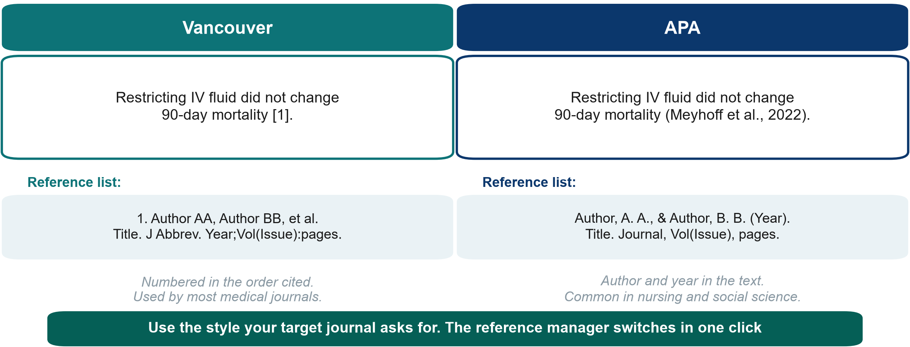{.neu-fig}

::: {.neu-takeaway}
**KEY MESSAGE** Pick the style your target journal uses; let the software do the formatting.
:::

::: {.notes}
Vancouver (numbered, in the order cited) is used by most medical journals and follows the ICMJE recommendations. APA (author and year) is common in nursing, psychology and social science.

Every journal states its style in the 'Guide for authors'. A reference manager switches between thousands of styles in one click.

Teaching point: a citation lets the reader check your claim. Cite the original study for facts and numbers, not a review that quotes it, wherever you can.

Ask the room: 'Which style uses \[1\]?' Expected: Vancouver.

Timing: 2 minutes.
:::

## Citing vs copying: paraphrase safely

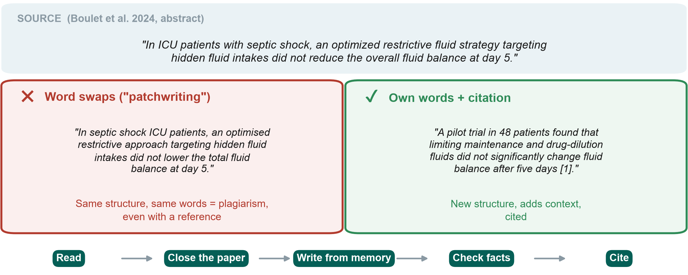{.neu-fig}

::: {.neu-takeaway}
**KEY MESSAGE** Change the structure as well as the words, and always cite the source.
:::

::: {.notes}
Top: one sentence from the conclusion of Paper 1's abstract (quoted with attribution).

Left: 'patchwriting', the same sentence with a few words swapped. Even with a reference this is plagiarism, because the structure and most of the wording are copied. Similarity checkers used by journals detect it easily.

Right: a real paraphrase, with a new structure, extra context from the paper (pilot, 48 patients, which fluids), and a citation.

Method: read, close the paper, write from memory, check the facts, cite. If you need the exact words, use quotation marks and a citation. Quotes are rare in medical writing.

Misconception: 'if I cite it, I can copy it'. Citation credits the idea; it does not license copying the wording. AI rewording tools do not solve this either. You remain responsible (Session 7).

Ask the room: 'Is copying the Methods wording from your own earlier paper allowed?' Expected: it is text recycling. Check the journal policy, and usually rewrite or cite.

Timing: 3 minutes. Exercise 2 on the sheet practises this at home.
:::

## Four rules for citing safely

:::: {.neu-cards style="--n:4"}
::: {.neu-card .plain style="--c:#0D7377"}
[Cite facts]{.neu-card-title}

- Numbers, findings
- and others' ideas
- need a citation
:::
::: {.neu-card .plain style="--c:#0B376C"}
[Cite sources]{.neu-card-title}

- Read and cite the
- original paper,
- not a summary
:::
::: {.neu-card .plain style="--c:#5FA39B"}
[Own words]{.neu-card-title}

- New structure;
- quotes only with
- quotation marks
:::
::: {.neu-card .plain style="--c:#0070C0"}
[Check]{.neu-card-title}

- Every reference
- says what you
- claim it says
:::
::::

::: {.neu-takeaway}
**KEY MESSAGE** Never cite a paper you have not read.
:::

::: {.notes}
Common knowledge ('sepsis is an infection-related emergency') does not need a citation; specific facts and numbers do.

Citing a paper you have only seen quoted elsewhere spreads errors. Check the original.

AI chat tools may invent references that look real. Every reference must be found in PubMed or on the journal site.

Timing: 1 minute.
:::

## Check your understanding: OK or not OK?

::: {.neu-banner style="--c:#6C3483"}
QUICK QUIZ · 2 min
:::

::: {.neu-activity-steps style="--c:#6C3483"}
- You copy a sentence from an abstract, change two words and add \[3\]
- You quote one sentence word for word, in quotation marks, with \[3\]
- You write a finding in your own words but forget the citation
- You cite a paper you found quoted in a review, without reading it
:::

::: {.neu-output style="--c:#6C3483"}
**OUTPUT** Thumbs up (OK) or down (not OK) for each
:::

::: {.notes}
Answers: 1 Not OK: patchwriting is plagiarism even with a citation. 2 OK (but rare in medical writing). 3 Not OK: someone else's finding needs a citation. 4 Not OK: you may repeat an error, so read and cite the original.

Timing: 2 minutes.
:::

## Grey literature and trial registries

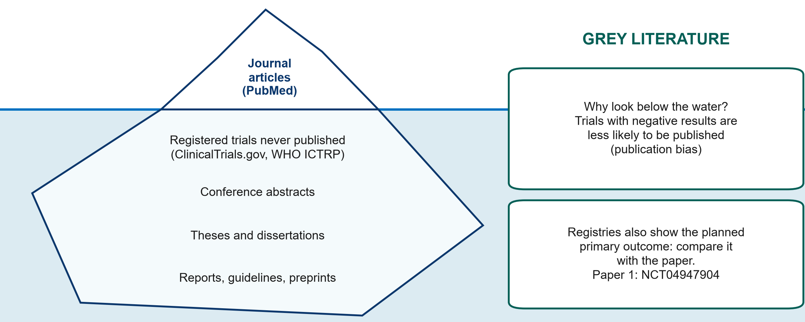{.neu-fig}

::: {.neu-takeaway}
**KEY MESSAGE** Look below the waterline: registries and grey literature reduce publication bias.
:::

::: {.notes}
Journal articles in PubMed are only the tip of the iceberg. Below the waterline: registered trials whose results were never published, conference abstracts, theses, reports, guidelines and preprints.

Why it matters: studies with negative or disappointing results are less likely to be published (publication bias), so the published literature can look more positive than the truth.

Trial registries (ClinicalTrials.gov and the WHO International Clinical Trials Registry Platform, ICTRP) list ongoing and completed trials with their PLANNED primary outcome. Compare it with the published paper: a switched outcome is a warning sign.

Paper 1 is registered as NCT04947904, registered before the first patient was enrolled. A good homework habit: open the registry record and compare its planned primary outcome with the paper.

Preprints (e.g. medRxiv) are not peer reviewed. Read them with extra care.

Ask the room: 'Why check a registry before starting your own trial?' Expected: someone may already be running the same study.

Timing: 3 minutes. Segment 2.2 ends at 1:10, then the break.
:::

## Break

::: {.neu-banner style="--c:#8A99A3"}
BREAK · 15 min
:::

::: {.neu-activity-steps style="--c:#8A99A3"}
- Stretch, coffee, talk to someone from another profession
- Think: which problem from your ward could your group work on today?
:::

::: {.notes}
BREAK (1:10-1:25).

During the break: put a printed copy of Paper 1's abstract (clean, un-annotated) on every seat for the reading task.

Restart on time. Say clearly what time you will begin again.
:::

## 2.3  Reading a paper in 15 minutes

:::: {.neu-statement}
::: {.neu-big}
You do not have to read every word. Read the right words in the right order.
:::

::: {.neu-sub}
40 minutes: anatomy of a paper, reading order, the abstract, spin, and a reading task on Paper 1
:::
::::

::: {.notes}
SEGMENT 2.3 (1:25-2:05).

Teaching point: busy clinicians need a reading routine. In 15 minutes you can decide whether a paper is relevant, what it found and whether to trust it.

Check that every participant has the printed abstract of Paper 1 before the task.

Timing: 30 seconds.
:::

## Anatomy of a paper: IMRaD

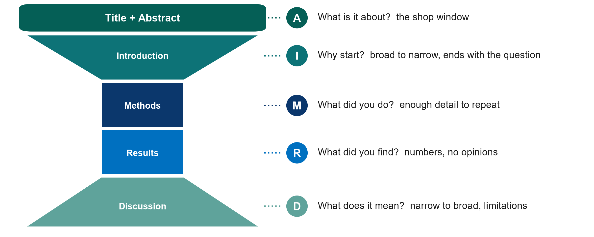{.neu-fig}

::: {.neu-takeaway}
**KEY MESSAGE** Every original paper has the same shape: why, how, what, so what.
:::

::: {.notes}
IMRaD = Introduction, Methods, Results and Discussion: the standard structure of an original research paper, with a title and an abstract on top.

The hourglass: the Introduction narrows from the broad problem to the specific question; Methods and Results are narrow and factual; the Discussion widens again to what it means for practice.

Teaching point: knowing the shape tells you where to look. The question is at the END of the Introduction; the primary outcome is in the Methods; the main number is in the Results (and the abstract).

Misconception: 'the Discussion tells me what was found'. The Discussion is the authors' interpretation; the Results are the evidence.

Ask the room: 'Where do you find who was included?' Expected: Methods (eligibility) and Results (flow chart, Table 1).

Timing: 4 minutes. Sessions 7 and 8 teach how to WRITE each section.
:::

## The 15-minute reading order

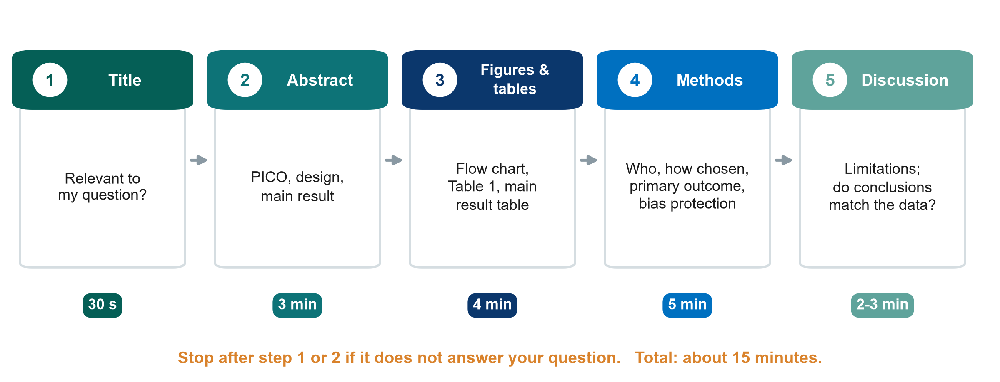{.neu-fig}

::: {.neu-takeaway}
**KEY MESSAGE** Title, abstract, figures and tables, methods. Stop early if it is not relevant.
:::

::: {.notes}
Do not read front to back. Step 1, title (30 seconds): is it about my question? Step 2, abstract (3 minutes): PICO, design, main result. Most papers are rejected here.

Step 3, figures and tables (4 minutes): the flow chart (who was lost), Table 1 (were groups similar), the main results table.

Step 4, methods (5 minutes): who, how chosen, the primary outcome, how bias was reduced. Step 5, discussion (2-3 minutes): limitations, and do the conclusions match the data?

Teaching point: you read the Introduction and full Discussion only for papers you will cite or appraise in depth.

Misconception: 'reading only the abstract is enough'. Abstracts omit limitations and can contain spin (next slides).

Timing: 3 minutes.
:::

## What an abstract must contain

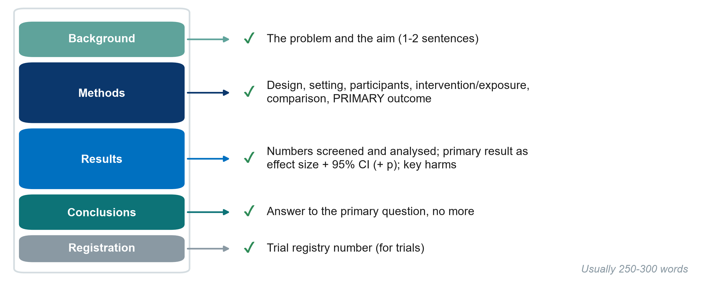{.neu-fig}

::: {.neu-takeaway}
**KEY MESSAGE** A good abstract lets you write the PICO and the main result without opening the paper.
:::

::: {.notes}
Most clinical journals require a structured abstract: Background, Methods, Results, Conclusions (plus the trial registration number for trials).

Methods must name the design, setting, participants, intervention or exposure, comparison and the PRIMARY outcome.

Results must give the numbers screened and analysed and the primary result as an effect size with its 95% confidence interval, not only a p-value or 'significant'.

Conclusions answer the primary question, no more and no less. Reporting guidelines have abstract checklists (CONSORT for Abstracts, STROBE), covered in Session 8.

Ask the room: 'An abstract says only: mortality was significantly lower (p \< 0.05). What is missing?' Expected: the actual rates, the effect size and the confidence interval.

Timing: 3 minutes.
:::

## A results sentence: poor vs good

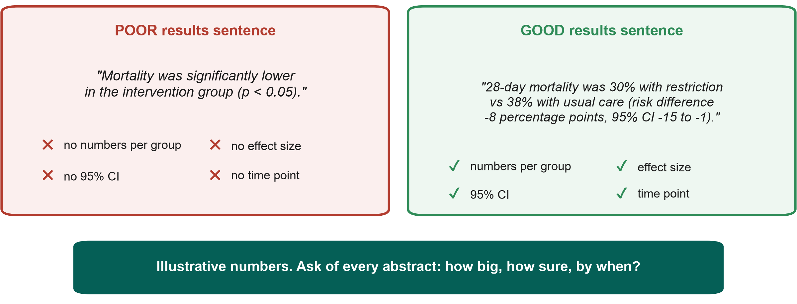{.neu-fig}

::: {.neu-takeaway}
**KEY MESSAGE** Every main result needs: numbers per group, an effect size, a 95% CI and a time point.
:::

::: {.notes}
Worked example (illustrative numbers, not from a real trial).

Left: 'significantly lower (p \< 0.05)' tells us nothing about how big the difference is, how sure we are, or when it was measured.

Right: rates in each group, the size of the difference (8 percentage points), the 95% confidence interval and the time point (28 days). A reader can judge whether the difference matters clinically.

Teaching point: ask 'how big, how sure, by when?' of every result you read. Confidence intervals are explained properly in Session 6.

Ask the room: 'Which sentence would you trust to change practice?' Expected: the right one, because you can see the size and the uncertainty.

Timing: 3 minutes.
:::

## Spin: when words go beyond the data

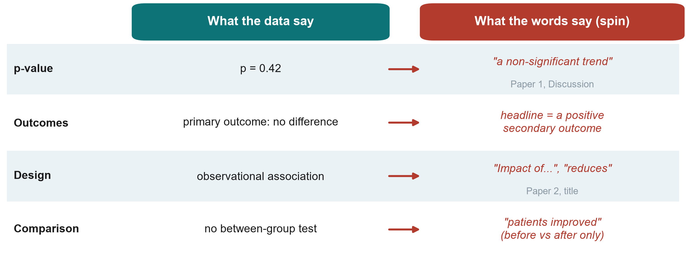{.neu-fig}

::: {.neu-takeaway}
**KEY MESSAGE** Read the numbers first, then check whether the words match them.
:::

::: {.notes}
Spin = reporting that makes results look more favourable than the data justify. It is common in abstracts of trials with non-significant primary outcomes.

Row 1: Paper 1's Discussion calls p = 0.42 for the primary outcome a 'non-significant trend'. A p of 0.42 is no evidence of a difference; the correct phrase is 'no significant difference; the confidence interval was wide'. To its credit, Paper 1's ABSTRACT conclusion has no spin.

Row 2: highlighting a positive secondary outcome when the primary outcome showed nothing.

Row 3: causal words for observational data. Paper 2's title says 'Impact of...' although a cohort can only show association (its abstract conclusion correctly says 'associated').

Row 4: claiming improvement from before-after change within one group, with no comparison between groups.

Misconception: 'peer review removes spin'. It reduces it, but spin is frequent in published papers.

Timing: 4 minutes.
:::

## Check your understanding: spot the spin

::: {.neu-banner style="--c:#6C3483"}
QUICK QUIZ · 3 min
:::

::: {.neu-activity-steps style="--c:#6C3483"}
- A cohort study: 'Early feeding REDUCES pneumonia in stroke patients'
- Primary outcome p = 0.31: 'a promising trend towards benefit'
- Primary outcome no difference; abstract headline: 'improved patient satisfaction'
- 'Mortality fell from 30% to 22% after the new protocol' (no control group)
:::

::: {.neu-output style="--c:#6C3483"}
**OUTPUT** For each: what is the spin, and how would you rewrite it?
:::

::: {.notes}
Answers: 1 Causal word for an observational design: write 'was associated with lower pneumonia'. 2 p = 0.31 is no evidence of a difference: write 'no significant difference; the CI was wide'. 3 The headline is a secondary outcome: lead with the primary result. 4 Before-after change without a comparison, and other things may have changed: write 'mortality was lower after implementation; without a control group we cannot attribute this to the protocol'.

Timing: 3 minutes.
:::

## Your turn: read Paper 1's abstract

::: {.neu-banner style="--c:#0B376C"}
INDIVIDUAL TASK · 12 min
:::

:::: {.columns}
::: {.column width="60%"}
::: {.neu-activity-steps style="--c:#0B376C"}
- Take the abstract of Paper 1 (Boulet 2024, Crit Care)
- Fill the reading grid (Exercise 3): design, P, I vs C
- Primary outcome, numbers screened and analysed
- Main result with its 95% CI and p-value
- Does the conclusion match the result? Any spin?
- Compare your grid with your neighbour
:::
:::
::: {.column width="40%"}
::: {.neu-side .plain style="--c:#0B376C"}
Clock

- 8 minutes reading
- 4 minutes comparing
:::
:::
::::

::: {.neu-output style="--c:#0B376C"}
**OUTPUT** A completed abstract reading grid
:::

::: {.notes}
Individual work, silently for 8 minutes, then 4 minutes comparing with a neighbour. Beginners need the extra time. Do not rush it.

Participants read the real abstract from the handout (Course/Papers has annotated versions in English and Vietnamese, but use the clean abstract for this task).

Circulate. The hardest cells: the primary outcome (many write 'mortality', but it is cumulative fluid balance at day 5) and the main result (they should copy the difference with its 95% CI, -15.2 to 41.6, which crosses zero).

Fast finishers: read Paper 2's abstract and spot the word in its title that overstates the design ('Impact').

Timing: 12 minutes. The answers are on the next slide.
:::

## Paper 1's abstract: the answers

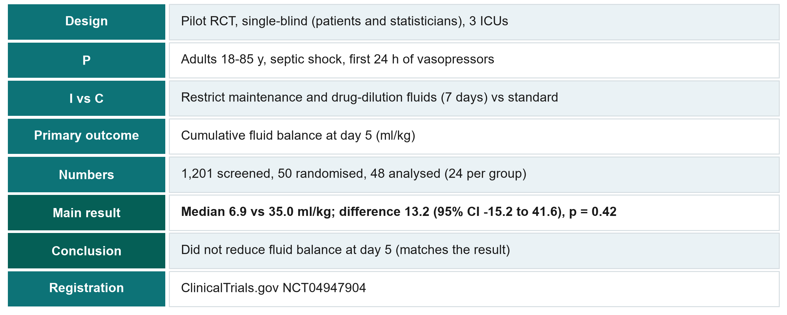{.neu-fig}

::: {.neu-takeaway}
**KEY MESSAGE** Primary outcome: fluid balance, not mortality. Read what the study actually measured.
:::

::: {.notes}
Go through the grid quickly; ask a different table for each row.

Key points: (1) a PILOT trial with 48 analysed patients; (2) the primary outcome is cumulative fluid balance at day 5, not mortality; (3) the confidence interval for the difference (-15.2 to 41.6 ml/kg) includes zero, so no evidence of a difference; (4) the abstract conclusion matches the result (good practice); (5) the trial was registered.

If a sharp participant asks: the medians (6.9 vs 35.0 ml/kg) differ by more than the reported difference of 13.2 because the 13.2 is a difference in means (the Methods report the mean difference with its 95% CI), not a difference in medians. The course annotations flag this mismatch. Park it for Sessions 6-8.

Link to our question: this trial does NOT answer the 28-day mortality question. It answers a feasibility-type question about fluid balance. That is exactly the 'feasible rewrite' from the FINER slide.

Timing: 5 minutes, row by row. Segment 2.3 ends at 2:05.
:::

## 2.4  From literature to introduction

:::: {.neu-statement}
::: {.neu-big}
The papers you read become the first page of your proposal.
:::

::: {.neu-sub}
15 minutes: the literature matrix, the problem-statement funnel, a model problem statement, working title and keywords
:::
::::

::: {.notes}
SEGMENT 2.4 (2:05-2:20).

Teaching point: reading is not the end. A literature matrix turns papers into a gap, the gap into a problem statement, and the PICO into a working title.

Timing: 30 seconds.
:::

## The literature review worksheet

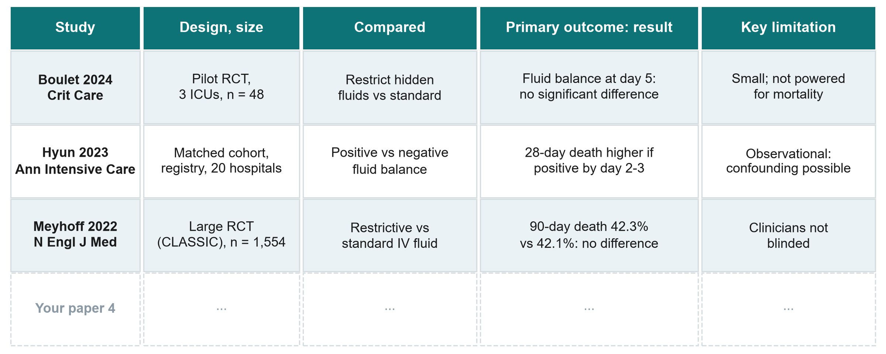{.neu-fig}

::: {.neu-takeaway}
**KEY MESSAGE** One row per paper: 5 rows today, the same columns for every paper.
:::

::: {.notes}
The worksheet is in Course/Templates (literature review worksheet). One row per paper, the same columns each time.

Rows 1-3 show the course papers: Paper 1 (Boulet 2024, pilot RCT: fluid balance, no significant difference), Paper 2 (Hyun 2023, matched cohort: positive balance on days 2-3 associated with higher 28-day mortality), and CLASSIC (Meyhoff 2022: no difference in 90-day mortality).

Notice: the three papers measure different outcomes at different times. A matrix makes that visible at once.

Teaching point: the 'key limitation' column is where the gap, and your study's justification, comes from.

Timing: 3 minutes.
:::

## From literature to your Introduction

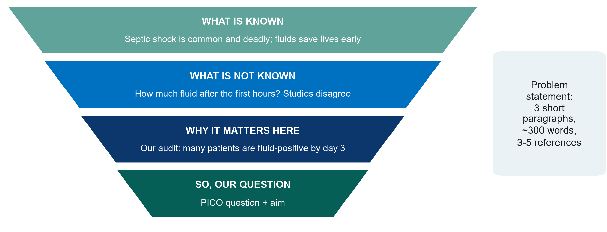{.neu-fig}

::: {.neu-takeaway}
**KEY MESSAGE** Known, not known, why here: the question then follows naturally.
:::

::: {.notes}
The papers you read become the Introduction of your proposal. It is the same funnel as the top of the IMRaD hourglass.

Paragraph 1, what is known: the size of the problem and current practice, with references.

Paragraph 2, what is not known: the gap (conflicting studies, no studies in patients like ours, outcomes not measured). Your literature matrix's 'limitation' column feeds this paragraph.

Paragraph 3, why it matters here: local data (an audit, an incident review, a number from your unit). Then state the question and aim.

Misconception: 'the background must review everything ever written'. Paper 1's introduction does the whole funnel in under 500 words.

Timing: 3 minutes.
:::

## A model problem statement

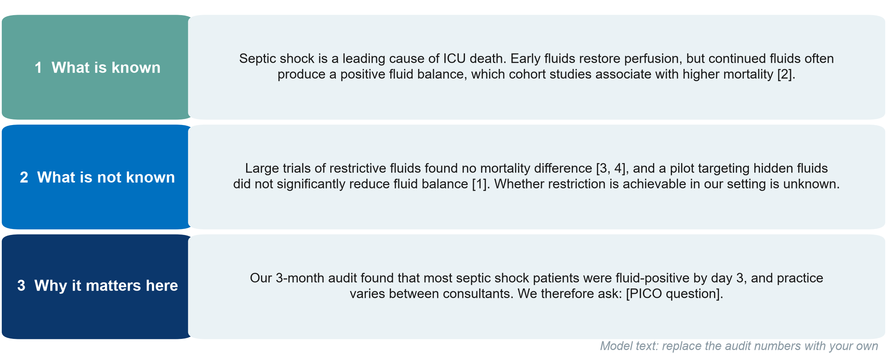{.neu-fig}

::: {.neu-takeaway}
**KEY MESSAGE** Three short paragraphs, each with its own job, and references in brackets.
:::

::: {.notes}
This is what the funnel looks like as real text, for the feasible rewrite of the running example.

Paragraph 1 (known) cites Paper 2. Paragraph 2 (not known) cites CLASSIC, CLOVERS and Paper 1 and ends with the gap. Paragraph 3 (why here) uses LOCAL data (replace the audit statement with your own numbers) and ends with the question.

Teaching point: every factual sentence carries a citation number; the last sentence leads straight into the PICO question.

Misconception: 'the problem statement should be long and impressive'. About 300 words is enough for a proposal.

Model text in English; groups may write in Vietnamese for their proposal, but search and cite in English.

Timing: 4 minutes.
:::

## Working title and keywords from PICO

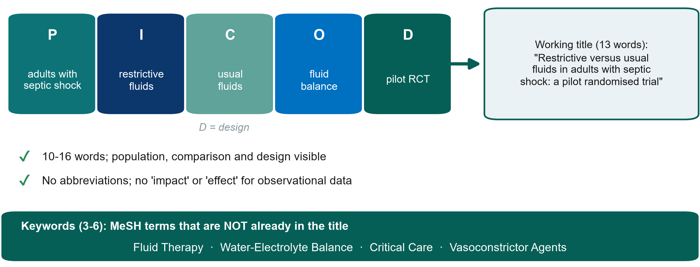{.neu-fig}

::: {.neu-takeaway}
**KEY MESSAGE** Your PICO already contains your title: add the design and keep it short.
:::

::: {.notes}
A good title names the population, the intervention and comparison (or exposure), and the design, in about 10 to 16 words.

Example from the feasible rewrite: 'Restrictive versus usual fluids in adults with septic shock: a pilot randomised trial' (13 words).

Avoid abbreviations and promotional or causal words ('impact', 'novel', 'effect of'), especially for observational designs (compare Paper 2's title).

Keywords: 3 to 6, ideally MeSH terms NOT already in the title, so the paper is found by more searches (the Paper 1 annotations make the same point).

Ask the room: 'Is Fluids in the ICU a good title?' Expected: no. It has no population, no comparison and no design.

Timing: 4 minutes. Segment 2.4 ends at 2:20.
:::

## Proposal builder 2

:::: {.neu-statement}
::: {.neu-big}
Now find your group's evidence: one search, five papers, one problem statement, one title.
:::

::: {.neu-sub}
35 minutes of group work to complete Part 1 of your research proposal
:::
::::

::: {.notes}
PROPOSAL BUILDER 2 (2:20-2:55).

Teaching point: everything taught today is applied to the group's own question from last Saturday. By 2:55 each group has a documented search, at least 3-5 references in the matrix, a draft problem statement and a working title.

Make sure each group has a laptop or phone for the searcher.

Timing: 1 minute.
:::

## Proposal builder 2: your group's evidence

::: {.neu-banner style="--c:#055F56"}
PROPOSAL BUILDER · 33 min
:::

:::: {.columns}
::: {.column width="60%"}
::: {.neu-activity-steps style="--c:#055F56"}
- Run your search string in PubMed; write the date and number of hits
- Screen titles and abstracts; pick 5 key papers; export them to Zotero
- Fill one row per paper in the literature matrix
- Draft the problem statement: known, not known, why here
- Working title (10-16 words) + 3-6 keywords
- One group reads its title and gap aloud
:::
:::
::: {.column width="40%"}
::: {.neu-side .plain style="--c:#055F56"}
Timing

- 0-8 min: run the search
- 8-16: screen + pick 5 papers
- 16-22: matrix rows
- 22-28: problem statement
- 28-31: title + keywords
- 31-33: 1 group reads aloud
:::
:::
::::

::: {.neu-output style="--c:#055F56"}
**OUTPUT** Proposal Part 1 complete: search, 5 references, problem statement, title
:::

::: {.notes}
Roles: the searcher runs PubMed and exports; the scribe fills the matrix and template; the others read abstracts in parallel (split the 5 papers).

Trainers circulate. First visit: is the string sensible (brackets, OR inside, AND between, no comparison block)? Too many hits: add a block or a filter. Too few: add synonyms.

Second visit: does the problem statement end with the group's question, and does paragraph 2 actually state a gap?

If a group cannot finish the 5 references, they record the string, database and date; the remaining references become homework.

At 2:51 (minute 31), stop; one group reads its title and its gap sentence aloud; invite one improvement.

What good looks like: Course/Solutions/s2\_solutions.md (Exercise 4).

Timing: 33 minutes. Wrap-up starts at 2:55.
:::

## Key words of the day

| Key word | In one line |
|:---|:---|
| MeSH | The shared label PubMed gives to many ways of writing one idea |
| AND / OR / NOT | Narrows / widens / removes. OR inside a block, AND between blocks |
| Reference manager | Stores each paper once and formats citations in any style |
| Patchwriting | Copying with a few words swapped: plagiarism even if cited |
| IMRaD | Introduction, Methods, Results and Discussion |
| Spin | Words that claim more than the numbers show |

::: {.notes}
WRAP-UP (2:55-3:00).

Read the six key words quickly; they are also in the course glossary (EN-VN).

Timing: 1 minute.
:::

## Session 2 recap

:::: {.neu-cards style="--n:3"}
::: {.neu-card .plain style="--c:#0D7377"}
[Search]{.neu-card-title}

- PICO blocks, MeSH +
- free text; OR inside,
- AND between; write it down
:::
::: {.neu-card .plain style="--c:#0B376C"}
[Cite honestly]{.neu-card-title}

- Reference manager
- from day one; own
- words; read what you cite
:::
::: {.neu-card .plain style="--c:#5FA39B"}
[Read smart]{.neu-card-title}

- Title, abstract,
- figures, methods;
- numbers before words
:::
::::

::: {.neu-takeaway}
**KEY MESSAGE** Weeks 1-2 are done: your group has a question, five papers and a title.
:::

::: {.notes}
Read the three messages, then ask one participant: 'What is the first thing you look for in an abstract?' Expected: the primary outcome and its result with a CI.

Link forward: over the next two Saturdays (Sessions 3 and 4) we choose the right DESIGN to answer each group's question, and meet bias, confounding and measures of effect using the two fluid papers.

Timing: 1.5 minutes.
:::

## Exit question

::: {.neu-banner style="--c:#6C3483"}
QUICK QUIZ · 2 min
:::

::: {.neu-activity-steps style="--c:#6C3483"}
- Which gives MORE hits: septic shock AND fluids, or septic shock OR fluids?
- What was the primary outcome of Paper 1?
- Write both answers on a sticky note (no names) and stick it on the door as you leave
:::

::: {.neu-output style="--c:#6C3483"}
**OUTPUT** One sticky note per person (we read them before Session 3)
:::

::: {.notes}
Answers: (1) OR (either term). (2) Cumulative fluid balance at day 5 (ml/kg), not mortality.

Read the notes after the session. If more than a quarter get either wrong, revisit it in the Session 3 recap quiz.

Timing: 1.5 minutes.
:::

## Homework before Session 3 (next Saturday)

::: {.neu-banner style="--c:#0B376C"}
INDIVIDUAL TASK
:::

:::: {.columns}
::: {.column width="60%"}
::: {.neu-activity-steps style="--c:#0B376C"}
- Group: finish the 5 key references and the problem statement
- Each member: read one paper with the 15-minute routine and fill its row
- Everyone: read the abstract of Paper 2 (Hyun) with the reading grid
- Exercise 2 (paraphrasing) if not done in class
- Optional: look up Paper 1 (NCT04947904) on ClinicalTrials.gov
:::
:::
::: {.column width="40%"}
::: {.neu-side .plain style="--c:#0B376C"}
Bring next Saturday

- Proposal Part 1 (printed or on a laptop)
- Your completed literature matrix
:::
:::
::::

::: {.neu-output style="--c:#0B376C"}
**OUTPUT** Proposal Part 1 complete before Session 3
:::

::: {.notes}
Be specific: about 60-90 minutes per person over the week, shared within the group.

The two papers are in Course/Papers (annotated versions in English and Vietnamese). Session 3 uses both abstracts to compare an RCT with a cohort.

Remind groups to send their Part 1 to the trainers if you offer written feedback between sessions.

Close on time. Thank the room.

Timing: 1 minute.
:::

---

:::: {.neu-statement}
::: {.neu-big}
Extra slides: Session 2
:::

::: {.neu-sub}
Use if time allows, or for self-study
:::
::::

::: {.notes}
EXTRA SLIDES (Session 2).

Everything after this slide is optional. Use it if the room is fast, if a group asks, or point participants to it for self-study.

The core session is complete without these slides.
:::

## Beyond PubMed: other places to search

:::: {.neu-cards style="--n:4"}
::: {.neu-card .plain style="--c:#0D7377"}
[Cochrane Library]{.neu-card-title}

- Systematic reviews
- and a register
- of trials
:::
::: {.neu-card .plain style="--c:#0B376C"}
[Embase]{.neu-card-title}

- Large biomedical
- database; strong on
- drugs (subscription)
:::
::: {.neu-card .plain style="--c:#5FA39B"}
[CINAHL]{.neu-card-title}

- Nursing and allied
- health literature
- (subscription)
:::
::: {.neu-card .plain style="--c:#0070C0"}
[Trial registries]{.neu-card-title}

- ClinicalTrials.gov,
- WHO ICTRP: ongoing
- and unpublished trials
:::
::::

::: {.neu-takeaway}
**KEY MESSAGE** For a proposal, PubMed + a registry is enough; systematic reviews search several databases.
:::

::: {.notes}
EXTRA: other databases.

Cochrane Library: start here for treatment questions. A good systematic review may already answer yours.

Embase and CINAHL usually need an institutional subscription; ask your library.

National and regional databases can matter for local-language journals.

Timing: 2 minutes if used.
:::

## PubMed Clinical Queries: a ready-made filter

:::: {.neu-steps}
::: {.neu-step style="--c:#0D7377"}
[Open]{.neu-step-label}

- PubMed home page:
- Clinical Queries
- (under Find)
:::
::: {.neu-step style="--c:#0B376C"}
[Type]{.neu-step-label}

- Your topic words,
- e.g. septic shock
- fluid restriction
:::
::: {.neu-step style="--c:#5FA39B"}
[Choose]{.neu-step-label}

- Category: therapy,
- diagnosis, etiology,
- prognosis...
:::
::: {.neu-step style="--c:#0070C0"}
[Scope]{.neu-step-label}

- Broad (finds more)
- or narrow (more
- precise)
:::
::::

::: {.neu-takeaway}
**KEY MESSAGE** A quick shortcut for 'is there good evidence?', not a replacement for your own search.
:::

::: {.notes}
EXTRA: PubMed Clinical Queries.

Clinical Queries applies validated search filters for study types that answer clinical questions.

Good for a quick look before a ward round or to check your own search did not miss an obvious trial.

The interface changes from time to time. Check it before showing it live.

Timing: 2 minutes if used.
:::

## Optional demo: Google Scholar and 'Cited by'

::: {.neu-banner style="--c:#B5651D"}
LIVE DEMO · 3 min
:::

::: {.neu-activity-steps style="--c:#B5651D"}
- Search: restrictive fluid septic shock mortality
- Look: journals, theses, preprints, ranked by a hidden algorithm
- Under a key trial, click 'Cited by', then search within citing articles
- Click the quote icon to see export formats
:::

::: {.neu-output style="--c:#B5651D"}
**OUTPUT** Participants see what Scholar adds and what it lacks
:::

::: {.notes}
EXTRA: Google Scholar demo.

Course/Demos/s2\_demo.md, Part C.

Say: 'Scholar is excellent for following citations forward and for grey literature, but there is no MeSH, few filters, and the same search may give different results next month.'

If Scholar shows a CAPTCHA, do not try to solve it on a shared machine; skip to the screenshots.

Timing: 3 minutes if used.
:::

## Text recycling, AI tools and similarity checks

:::: {.neu-cards style="--n:4"}
::: {.neu-card .plain style="--c:#0D7377"}
[Text recycling]{.neu-card-title}

- Reusing your own
- published wording:
- check journal policy
:::
::: {.neu-card .plain style="--c:#0B376C"}
[AI rewording]{.neu-card-title}

- Does not remove
- plagiarism; you stay
- responsible
:::
::: {.neu-card .plain style="--c:#5FA39B"}
[AI references]{.neu-card-title}

- May be invented;
- find every one
- in PubMed
:::
::: {.neu-card .plain style="--c:#0070C0"}
[Similarity checks]{.neu-card-title}

- Journals screen
- submissions for
- copied text
:::
::::

::: {.neu-takeaway}
**KEY MESSAGE** Write from understanding, cite what you use, and check every reference yourself.
:::

::: {.notes}
EXTRA: text recycling, AI and similarity checks.

Text recycling ('self-plagiarism'): some reuse of standard Methods wording may be accepted if cited and allowed by the journal; never reuse Results or Discussion text.

AI tools: journals require disclosure of AI use (Session 7 covers integrity and AI in detail).

Timing: 2 minutes if used.
:::
