# Session 3 · Design: choosing the right study

## Week 3 · Saturday

- Recap quiz on Session 2 (10 min)
- 3.1  Study designs in pictures (45 min) + exercise "Name that design" (15 min)
- Break (15 min)
- 3.2  More designs: trial variants, pilots, quality improvement, qualitative (35 min)
- Exercise: choose the design for 5 questions (20 min)
- Proposal builder 3: design, setting and population (35 min), then wrap-up

::: {.notes}
SESSION 3 OPENING (0:00). Welcome to Week 3. In Sessions 1 and 2 we asked a question and found the evidence. Today we choose HOW a study answers a question; next Saturday (Session 4) we judge whether we can trust the answer and how big the effect is.

Teaching point: the design decides what you are allowed to claim at the end. A good question with the wrong design produces a weak study.

Pace: this is a slow session on purpose. Every design is shown as a picture on a timeline, then as a worked example, then checked with a quick quiz.

Running example: the fluid question answered twice: by a small randomised trial (Boulet 2024) and by a large cohort (Hyun 2023).

Ask the room: who has ever taken part in a study as a data collector? Expected: a few hands. Use them as examples later.

Timing: 1 minute. The day: recap 10, 3.1 45, exercise 15, break 15, 3.2 35, exercise 20, proposal builder 35, wrap-up 5.
:::

## Recap quiz: three questions on Session 2

::: {.neu-banner style="--c:#6C3483"}
QUICK QUIZ · 10 min
:::

:::: {.columns}
::: {.column width="60%"}
::: {.neu-activity-steps style="--c:#6C3483"}
1. Q1. Your PubMed search finds 3,000 papers. Add a concept with AND, or a synonym with OR?
2. Q2. After the title and abstract, what do you read next in a paper?
3. Q3. An abstract says 'a trend towards lower mortality (p = 0.42)'. What is this called?
4. Groups: re-read your research question and problem statement (2 min)
:::
:::
::: {.column width="40%"}
::: {.neu-side .plain style="--c:#6C3483"}
How we run it

- Answer alone first (30 s each)
- Show of hands, then reveal
- No marks, just a warm-up
:::
:::
::::

::: {.neu-output style="--c:#6C3483"}
**OUTPUT** Each group's question, re-read and confirmed
:::

::: {.notes}
Purpose: wake up Session 2 and put each group's own question back on the table. Today's proposal builder chooses a design for it.

Answers. Q1: AND with another concept narrows the search; OR widens it. Q2: the figures and tables (reading order: title, abstract, figures and tables, then methods). Q3: spin (describing a non-significant result as if it were a benefit).

Misconception to catch: 'p = 0.42 is nearly significant'. It is not; the honest phrase is 'no clear difference'.

Ask the room after Q3: how should the sentence be rewritten? Expected answer: 'mortality did not differ clearly between groups (p = 0.42)'.

Timing: about 6 minutes for the questions, 3 minutes for groups to re-read their question. Note any group that changed its question.
:::

## Key words of the day

::: {.neu-intro}
Ten words you will use all day (no need to memorise definitions)
:::

:::: {.neu-cards style="--n:4"}
::: {.neu-card .plain style="--c:#0D7377"}
[The pieces]{.neu-card-title}

- Exposure: what comes first
- Outcome: what we count later
- Comparison group
:::
::: {.neu-card .plain style="--c:#0B376C"}
[Who decides?]{.neu-card-title}

- Observational: we watch
- Experimental: we assign
- Randomised: chance assigns
:::
::: {.neu-card .plain style="--c:#0070C0"}
[Which way in time?]{.neu-card-title}

- Cross-sectional: snapshot
- Case-control: look back
- Cohort: follow forward
:::
::: {.neu-card .plain style="--c:#055F56"}
[After the break]{.neu-card-title}

- Cluster, crossover trials
- Non-inferiority, pilot
- Time series, qualitative
:::
::::

::: {.neu-takeaway}
**KEY MESSAGE** Two questions name most designs: who decided the exposure, and which way does time run?
:::

::: {.notes}
Read the four headings only; the details come slide by slide. Tell the room this slide is printed in the handout as a glossary.

Teaching point: almost every design question becomes easy once people can name the EXPOSURE and the OUTCOME. We practise that first.

Misconception: 'design names must be memorised'. No. They can be worked out from the two questions on the takeaway.

Ask the room: in our fluid question, what is the exposure and what is the outcome? Expected answer: exposure = restrictive fluid strategy (vs usual care); outcome = death by day 28.

Timing: 1 minute.
:::

## One question, two designs

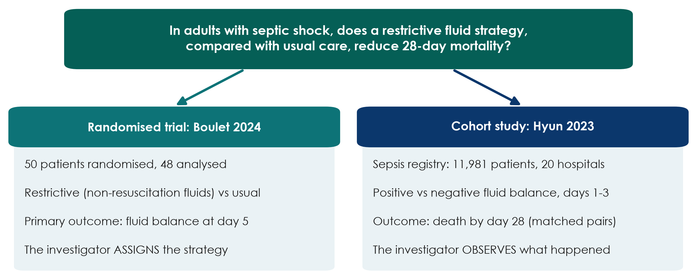{.neu-fig}

::: {.neu-takeaway}
**KEY MESSAGE** Same question, two designs: the design decides what you may claim.
:::

::: {.notes}
This is the thread for the whole day. Read the question aloud: it is the PICO the room built in Session 1.

Teaching point: Boulet ASSIGNED the fluid strategy by chance (an experiment). Hyun only OBSERVED what clinicians did and what happened afterwards (an observational cohort).

Point out a detail people miss: Boulet's primary outcome was fluid balance at day 5, not mortality. It was a pilot trial. Hyun looked at 28-day mortality, which is our question, but could not assign anything.

Misconception: 'the bigger study is always the better study'. Size reduces random error; it does not remove bias. We come back to this in Session 4.

Ask the room: which study would you trust more to tell you whether restriction SAVES lives? Expected answer: mixed, and that is the point. Neither answers it fully. Keep the tension; we resolve it by the end of 3.1.

Timing: 2 minutes.
:::

## 3.1  Study designs in pictures

:::: {.neu-statement}
::: {.neu-big}
Did the investigator assign the exposure, or just watch?
:::

::: {.neu-sub}
That one question sorts almost every study design. (45 minutes)
:::
::::

::: {.notes}
Section marker for 3.1 (45 minutes, including two short checks).

Teaching point: we learn designs as pictures on a timeline, not as definitions. For each design we ask: who decided the exposure, and in which direction does time run? Each picture is followed by a worked example in steps.

Tell the room they do not need to memorise names. By the end they will draw them.

Timing: 30 seconds.
:::

## The family tree of study designs

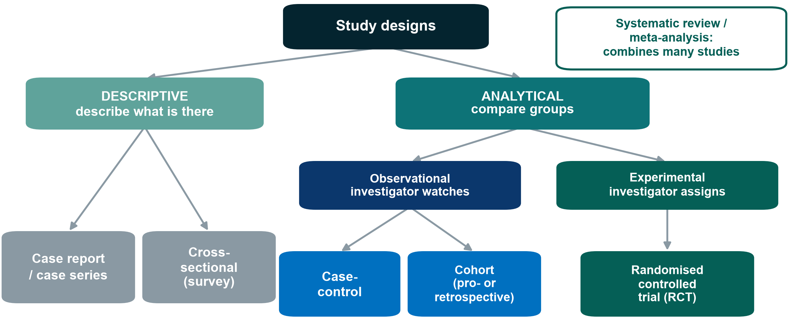{.neu-fig}

::: {.neu-takeaway}
**KEY MESSAGE** Descriptive designs describe; analytical designs compare groups.
:::

::: {.notes}
Walk the tree from the top. Descriptive studies describe what is there, with no comparison. Analytical studies compare groups to test an association.

Analytical splits again: observational (the investigator watches what happens in normal care) versus experimental (the investigator decides who gets what).

Systematic reviews sit outside the tree: they are studies of studies, combining many of the designs below.

Misconception: 'observational means bad'. No. Many key questions (harm, prognosis, rare diseases) can only be answered observationally. It is about fit, not rank.

Ask the room: where does Boulet sit? Hyun? Expected answer: Boulet = experimental, RCT; Hyun = observational, cohort.

Timing: 2 minutes.
:::

## Exposure and outcome: the two words you need

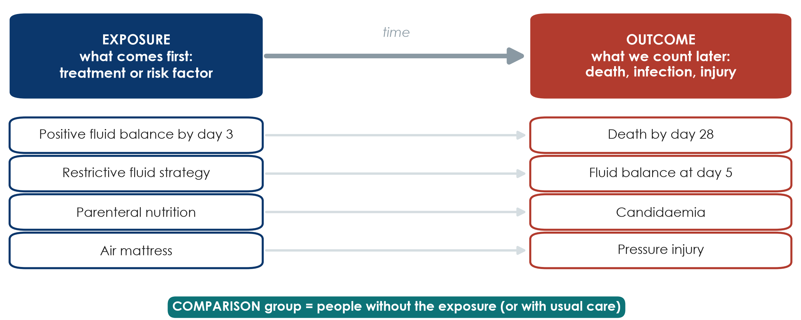{.neu-fig}

::: {.neu-takeaway}
**KEY MESSAGE** Name the exposure and the outcome first, and the design follows.
:::

::: {.notes}
Before any design, everyone must be able to name the two pieces of a question.

Exposure: what comes first (a treatment, a strategy, a risk factor, a behaviour). Outcome: what we count later (death, infection, injury, a lab value). The comparison group is people without the exposure, or with usual care.

Walk down the four examples. The same variable can play different roles: fluid balance is the OUTCOME in Boulet (day-5 balance) but the EXPOSURE in Hyun (balance by day 3, outcome death).

Misconception: 'the exposure must be harmful'. No. A treatment is an exposure too.

Ask the room: in 'Does early mobilisation reduce ICU delirium?', name the exposure, outcome and comparison. Expected: early mobilisation; delirium; usual (later) mobilisation.

Timing: 2.5 minutes.
:::

## Descriptive designs: describe, do not compare

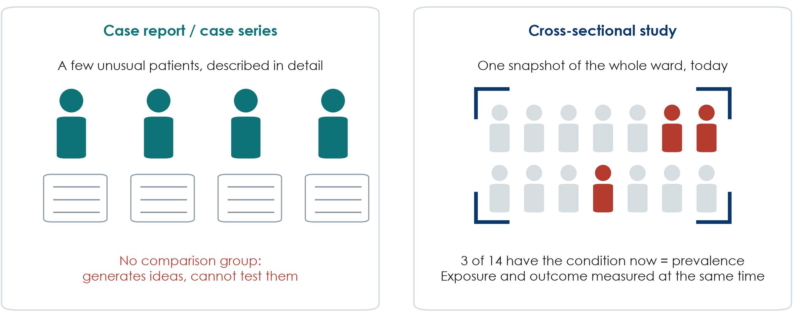{.neu-fig}

::: {.neu-takeaway}
**KEY MESSAGE** Descriptive studies raise questions; they cannot answer 'does X cause Y?'
:::

::: {.notes}
Case report or series: a few unusual patients written up in detail. Historically important (first reports of AIDS, thalidomide harms) because they raise alarms and hypotheses.

Cross-sectional study: one snapshot of a population at one moment, for example a one-day survey of pressure injuries on every ward. It measures prevalence (how many have it NOW).

Teaching point: in a cross-sectional study exposure and outcome are measured at the same moment, so you usually cannot tell which came first.

Misconception: 'a cross-sectional study can show cause because it has two groups'. It can compare groups (analytical cross-sectional), but time order is missing.

Ask the room: give an example of a cross-sectional study you could run in your unit next week. Expected answer: a point-prevalence audit (catheter use, delirium screening, hand-hygiene compliance).

Timing: 2 minutes.
:::

## Worked example: a one-day point-prevalence survey

::: {.neu-intro}
A cross-sectional study you could run next week
:::

:::: {.neu-steps}
::: {.neu-step style="--c:#0D7377"}
[1]{.neu-step-num}[1. Choose a day]{.neu-step-label}

- All inpatients on all wards, one weekday
:::
::: {.neu-step style="--c:#0B376C"}
[2]{.neu-step-num}[2. Examine everyone]{.neu-step-label}

- Two trained nurses, one standard form
:::
::: {.neu-step style="--c:#5FA39B"}
[3]{.neu-step-num}[3. Record both]{.neu-step-label}

- Pressure injury (yes/no) AND mattress type, at the same visit
:::
::: {.neu-step style="--c:#0070C0"}
[4]{.neu-step-num}[4. Count]{.neu-step-label}

- e.g. 37 of 412 = 9% prevalence today
:::
::::

::: {.neu-takeaway}
**KEY MESSAGE** A snapshot gives prevalence; it cannot show which came first.
:::

::: {.notes}
A worked example to make 'cross-sectional' concrete. Hypothetical numbers.

Step 1-2: everyone present on one day, examined the same way (this protects against information bias, which we meet in Session 4). Step 3: exposure (mattress) and outcome (pressure injury) are recorded at the same moment. Step 4: the result is a prevalence: 37 of 412 patients, 9%.

Teaching point: you can compare groups (injury on standard vs air mattress), but you cannot tell whether the mattress came first or whether patients with injuries were moved onto air mattresses.

Misconception: 'cross-sectional = low quality'. For 'how common is it now?' it is exactly the right design, and it is cheap and fast.

Ask the room: which other ward problem could you measure in one day? Expected: urinary catheters in place, delirium screening done, hand-hygiene compliance.

Timing: 2 minutes.
:::

## Case-control: start from the outcome, look back

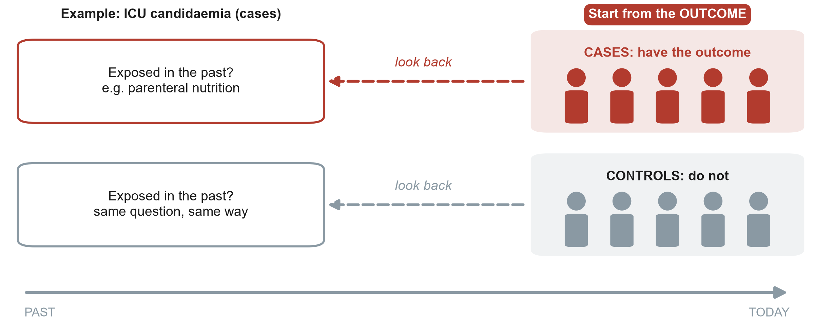{.neu-fig}

::: {.neu-takeaway}
**KEY MESSAGE** Case-control: pick people BY outcome, then compare their past exposures.
:::

::: {.notes}
Draw the arrow with your hand from right to left. We start TODAY with people who already have the outcome (cases) and similar people who do not (controls). Then we look back for the exposure.

Example: ICU patients who developed candidaemia (cases) versus ICU patients who did not (controls); look back in the records for parenteral nutrition.

Strengths: efficient for RARE outcomes or long latency, because you do not need to follow thousands of people. Weaknesses: recall bias, choosing good controls is hard, and you can only calculate an odds ratio, not risks.

Misconception: 'case-control is the same as a retrospective cohort because both use old records'. The difference is how people are selected: by OUTCOME in case-control, by EXPOSURE in a cohort.

Ask the room: why can you not calculate the risk of candidaemia from a case-control study? Expected answer: the investigator chose how many cases and controls to include, so the proportion with the outcome is set by design, not by nature.

Timing: 2.5 minutes.
:::

## Worked example: a case-control study in the ICU

::: {.neu-intro}
Question: is parenteral nutrition a risk factor for ICU candidaemia?
:::

:::: {.neu-steps}
::: {.neu-step style="--c:#0D7377"}
[1]{.neu-step-num}[1. Find cases]{.neu-step-label}

- 40 ICU patients with candidaemia (lab records)
:::
::: {.neu-step style="--c:#0B376C"}
[2]{.neu-step-num}[2. Find controls]{.neu-step-label}

- 80 ICU patients without it, same units and months
:::
::: {.neu-step style="--c:#5FA39B"}
[3]{.neu-step-num}[3. Look back]{.neu-step-label}

- Parenteral nutrition in the 14 days before?
:::
::: {.neu-step style="--c:#0070C0"}
[4]{.neu-step-num}[4. Compare]{.neu-step-label}

- Exposed: 24 of 40 cases vs 16 of 80 controls
:::
::: {.neu-step style="--c:#055F56"}
[5]{.neu-step-num}[5. Report]{.neu-step-label}

- Odds ratio (calculated in Session 4)
:::
::::

::: {.neu-takeaway}
**KEY MESSAGE** Cases and controls are chosen by OUTCOME; exposure is measured looking back.
:::

::: {.notes}
The same example appears in the Session 4 calculation exercise, so take your time.

Step 1: cases are people WITH the outcome. Step 2: controls are similar people WITHOUT it, from the same source (same ICUs, same period). Choosing controls well is the hardest part. Step 3: look back for the exposure, the same way for both groups. Step 4: 60% of cases vs 20% of controls were exposed. Step 5: the result is an odds ratio (OR = 6.0, which we calculate next Saturday).

Misconception: 'controls should be healthy volunteers'. No. Controls must come from the population that produced the cases, otherwise the comparison is unfair.

Ask the room: why can we not report the risk of candidaemia from this study? Expected answer: we chose how many cases and controls to include (1:2), so the proportion with candidaemia is set by us.

Timing: 2.5 minutes.
:::

## Cohort: start from the exposure, follow forward

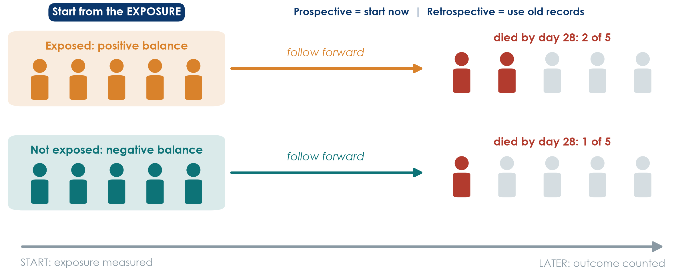{.neu-fig}

::: {.neu-takeaway}
**KEY MESSAGE** Cohort: exposure first, outcome later, so time runs the right way.
:::

::: {.notes}
Arrow left to right. Group people by EXPOSURE (here: positive versus negative fluid balance in the first ICU days) and count who develops the outcome (death by day 28). This is Hyun 2023.

Prospective cohort: you start now and follow into the future. Retrospective cohort: you start in old records, but the logic is still exposure then outcome. Hyun analysed a registry whose data were collected prospectively.

Strengths: clear time order, can study several outcomes, gives risks and incidence. Weaknesses: slow and costly if prospective, poor for rare outcomes, and confounding, because the investigator did not choose who got more fluid.

Misconception: 'retrospective means poor quality'. Not necessarily. The quality depends on how well the data were recorded.

Ask the room: in Hyun, who decided which patients received more fluid? Expected answer: the treating clinicians, according to how sick the patient looked. Hold that thought for confounding in Session 4.

Timing: 2 minutes.
:::

## Worked example: the Hyun cohort, step by step

::: {.neu-intro}
Question: is a positive fluid balance associated with death by day 28?
:::

:::: {.neu-steps}
::: {.neu-step style="--c:#0D7377"}
[1]{.neu-step-num}[1. Define the cohort]{.neu-step-label}

- Adults with sepsis in 20 hospitals, ICU stay of 3+ days
:::
::: {.neu-step style="--c:#0B376C"}
[2]{.neu-step-num}[2. Measure exposure]{.neu-step-label}

- Cumulative fluid balance, ICU days 1-3: positive or negative
:::
::: {.neu-step style="--c:#5FA39B"}
[3]{.neu-step-num}[3. Follow forward]{.neu-step-label}

- Record who dies by day 28
:::
::: {.neu-step style="--c:#0070C0"}
[4]{.neu-step-num}[4. Compare]{.neu-step-label}

- Matched pairs; HR 2.13 for day 2
:::
::::

::: {.neu-takeaway}
**KEY MESSAGE** A cohort groups people by EXPOSURE and follows them to the OUTCOME.
:::

::: {.notes}
This is how Paper 2 (Hyun 2023) works. It is a good example of a cohort built from a registry whose data were collected prospectively.

Step 1: the cohort: who is followed (and who is left out: patients who left the ICU before day 3). Step 2: exposure measured BEFORE the outcome. Step 3: outcome counted later. Step 4: compare the groups; Hyun used propensity-score matching to make them similar (483, 373 and 392 matched pairs for days 1, 2 and 3). Day 2 result: HR 2.13 (95% CI 1.48-3.06); day 1 showed no clear difference.

Misconception: 'a cohort needs to start today'. A retrospective cohort uses old records but still goes exposure then outcome.

Ask the room: who decided which patients received more fluid? Expected: the treating clinicians, often because the patient was sicker. We come back to this in Session 4 (confounding).

Timing: 2.5 minutes.
:::

## RCT: randomise, then follow forward

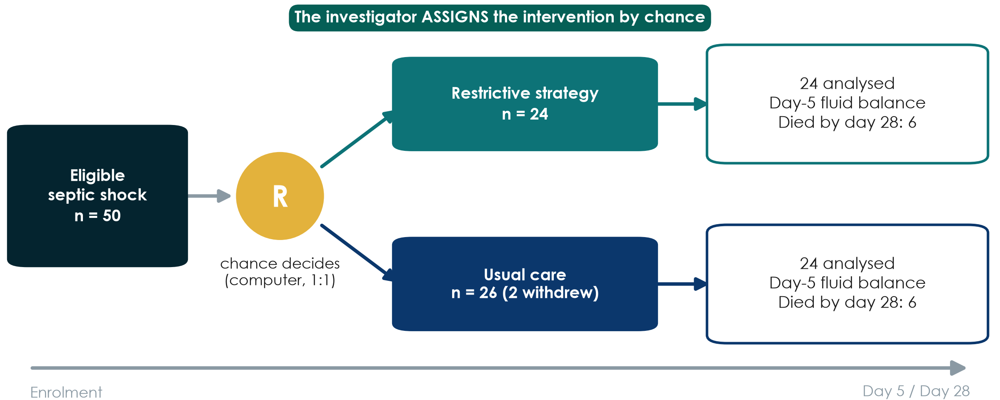{.neu-fig}

::: {.neu-takeaway}
**KEY MESSAGE** In an RCT chance, not the clinician, decides who gets what.
:::

::: {.notes}
Boulet 2024: 50 adults with septic shock randomised by a central computer, 1:1, to a restrictive strategy for non-resuscitation fluids or usual care. Two patients in the usual-care group withdrew consent, so 24 + 24 were analysed.

Teaching point: an RCT is a cohort in which the investigator assigns the exposure by chance. That is why groups are alike at the start, for factors we measured AND factors we did not.

Note the honest result: 6 deaths in each group by day 28. With 24 patients per arm this tells us almost nothing about mortality. The trial was a pilot powered for fluid balance.

Misconception: 'RCT = truth'. A small, unblinded or badly run RCT can still mislead. Design is necessary, not sufficient.

Ask the room: why not randomise everything? Expected answer: some exposures cannot ethically be assigned (smoking, harm), some outcomes are rare or take years, and trials are expensive.

Timing: 2 minutes. After the break, 3.2 shows the other ways a trial can be laid out.
:::

## Worked example: the Boulet trial, step by step

::: {.neu-intro}
Question: does restricting non-resuscitation fluids reduce the day-5 fluid balance?
:::

:::: {.neu-steps}
::: {.neu-step style="--c:#0D7377"}
[1]{.neu-step-num}[1. Eligibility]{.neu-step-label}

- Septic shock, age 18-85, vasopressor \< 24 h
:::
::: {.neu-step style="--c:#0B376C"}
[2]{.neu-step-num}[2. Consent]{.neu-step-label}

- Patient or legal surrogate
:::
::: {.neu-step style="--c:#5FA39B"}
[3]{.neu-step-num}[3. Randomise]{.neu-step-label}

- Central computer, 1:1, so nobody can predict
:::
::: {.neu-step style="--c:#0070C0"}
[4]{.neu-step-num}[4. Treat]{.neu-step-label}

- Restrictive vs usual care for 7 days
:::
::: {.neu-step style="--c:#055F56"}
[5]{.neu-step-num}[5. Measure]{.neu-step-label}

- Fluid balance at day 5; death by day 28
:::
::::

::: {.neu-takeaway}
**KEY MESSAGE** In a trial the investigator assigns the exposure by chance.
:::

::: {.notes}
This is Paper 1 (Boulet 2024), a pilot randomised trial in 3 ICUs.

Step 1: strict eligibility criteria (we return to these in the proposal builder). Step 2: consent (in the ICU often from a surrogate), before or soon after randomisation. Step 3: randomisation by a central computer keeps the next allocation hidden (allocation concealment, Session 4). Step 4: the two strategies are delivered. Step 5: the primary outcome is the day-5 fluid balance; death by day 28 was 6 of 24 in each group.

Misconception: 'randomised = blinded'. Not here. Clinicians knew the group; only patients and statisticians were blinded.

Ask the room: which step makes this an EXPERIMENT rather than a cohort? Expected: step 3, where the investigator assigns the exposure.

Timing: 2 minutes.
:::

## Check your understanding: name the design

::: {.neu-banner style="--c:#6C3483"}
QUICK QUIZ · 3 min
:::

:::: {.columns}
::: {.column width="60%"}
::: {.neu-activity-steps style="--c:#6C3483"}
1. A. All 300 inpatients are checked today for a urinary catheter and for urinary infection
2. B. Patients with ventilator pneumonia are compared with patients without it for earlier sedation use
3. C. Patients who received early mobilisation (physiotherapist's decision) and those who did not are followed to discharge
:::
:::
::: {.column width="40%"}
::: {.neu-side .plain style="--c:#6C3483"}
Choose

- Cross-sectional
- Case-control
- Cohort
- RCT
:::
:::
::::

::: {.neu-output style="--c:#6C3483"}
**OUTPUT** One design named for each scenario (answers on the next slide)
:::

::: {.notes}
Give 1 minute alone, then show of hands for each scenario. Do not explain yet; the next slide shows the answers.

Watch for scenario C: some will say RCT because there are two groups. Ask: who decided who got mobilised? (The physiotherapist, not chance.)

Timing: 3 minutes including the answer slide.
:::

## Answers: name the design

:::: {.neu-cards style="--n:3"}
::: {.neu-card .plain style="--c:#5FA39B"}
[A. Cross-sectional]{.neu-card-title}

- One day, everyone
- Exposure and outcome measured together
- Gives prevalence
:::
::: {.neu-card .plain style="--c:#0070C0"}
[B. Case-control]{.neu-card-title}

- Chosen by OUTCOME (pneumonia)
- Look back for exposure (sedation)
- Gives an odds ratio
:::
::: {.neu-card .plain style="--c:#0B376C"}
[C. Cohort]{.neu-card-title}

- Grouped by EXPOSURE (mobilisation)
- Followed forward to discharge
- Not an RCT: nobody randomised
:::
::::

::: {.neu-takeaway}
**KEY MESSAGE** Ask: chosen by exposure or by outcome? Assigned by chance or not?
:::

::: {.notes}
Go card by card and ask one person to explain each answer in their own words.

Teaching point for C: two groups do not make a trial. If chance did not decide, it is observational.

Misconception: 'looking at old records makes it case-control'. Selection decides: by outcome = case-control; by exposure = cohort.

If most people got all three, move faster through the next slides; if not, redraw the three timelines on the whiteboard.

Timing: included in the 3-minute check.
:::

## Systematic reviews and meta-analysis: studies of studies

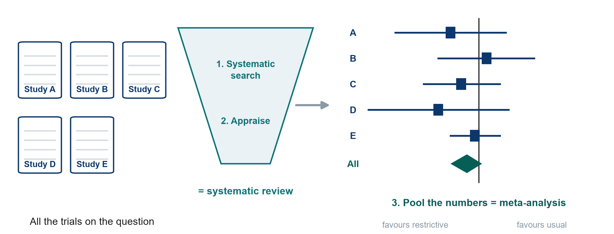{.neu-fig}

::: {.neu-takeaway}
**KEY MESSAGE** A systematic review searches and appraises; a meta-analysis pools the numbers.
:::

::: {.notes}
A systematic review uses a pre-specified, reproducible search (remember PubMed and Boolean from Session 2) and appraises every study found. A meta-analysis then pools the results into one estimate: the diamond at the bottom of a forest plot.

The forest plot here is illustrative: each square is one trial, the line its 95% confidence interval, the vertical line 'no difference'. Session 4 reads a PRISMA flow and a forest plot step by step.

Misconception: 'a meta-analysis is always the best evidence'. It is only as good as the studies it pools: garbage in, garbage out. A review of small biased trials gives a precise wrong answer.

Ask the room: what is the difference between a narrative review and a systematic review? Expected answer: the systematic review has a stated, reproducible method for search and selection; a narrative review is the author's choice.

Timing: 2 minutes.
:::

## Where the two papers sit on the evidence pyramid

:::: {.columns}
::: {.column width="38%"}
::: {.neu-side-notes}
### Read it with care

- Higher = less prone to bias, on average
- A rule of thumb, not a law
- A good cohort can beat a poor RCT
- The best design is the one that fits the question
:::
:::
::: {.column width="62%"}
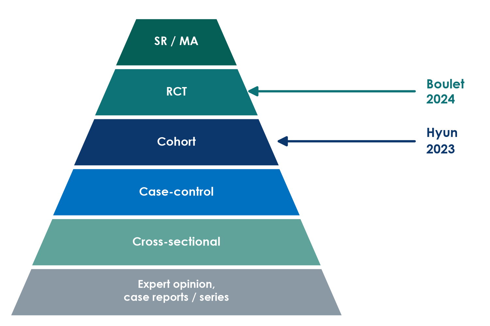{.neu-fig-side}
:::
::::

::: {.notes}
Recap from Session 1, now with the two papers placed on it. Boulet is an RCT, Hyun a cohort.

Teaching point: the pyramid ranks designs by their typical protection against bias for questions about treatment effects. It does not rank questions about prevalence, prognosis or rare harms, where other designs are the right tool.

Misconception: 'anything on a higher level beats anything lower down'. A 48-patient pilot RCT does not overrule a careful multicentre cohort on mortality. They answer different parts of the question.

Ask the room: which paper is higher, and does that make it more useful for our mortality question? Expected answer: Boulet is higher, but it was not designed or powered for mortality, so for mortality it adds little.

Timing: 1.5 minutes.
:::

## Name the design in three questions

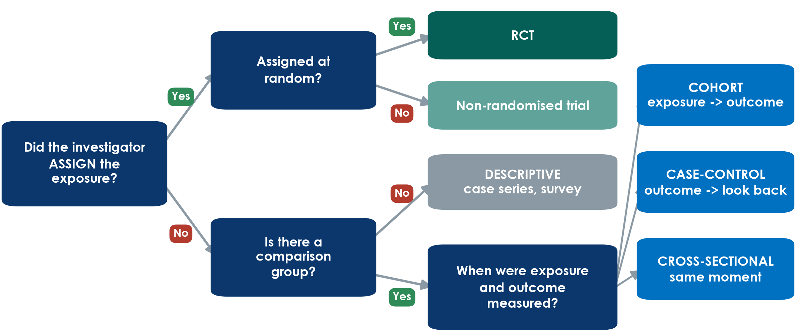{.neu-fig}

::: {.neu-takeaway}
**KEY MESSAGE** Assigned? Random? Which way does time run? Three questions name the design.
:::

::: {.notes}
This is the tool they will use in the exercise at the end of 3.1. Walk it once slowly with Boulet, then with Hyun.

Boulet: did the investigator assign the strategy? Yes. At random? Yes. RCT.

Hyun: assigned? No. Comparison group? Yes (positive vs negative balance). Exposure measured first and outcome followed afterwards? Yes. Cohort.

Misconception: people name the design from words in the title ('prospective', 'registry', 'retrospective'). Titles can mislead, so use the three questions instead.

Ask the room: a study compares nurses' hand-hygiene scores and infection rates on all wards on one day. What design? Expected answer: no assignment, comparison yes, same moment = cross-sectional. And a bundle introduced on one date, compared before and after? Assigned but not random: a non-randomised (quasi-experimental) study.

Timing: 3 minutes. Leave this slide up during the exercise if you can (or print it on the handout).
:::

## Every design trades something away

::: {.neu-intro}
Strengths and weaknesses at a glance
:::

:::: {.neu-cards style="--n:4"}
::: {.neu-card .plain style="--c:#5FA39B"}
[Cross-sectional]{.neu-card-title}

- [+ quick and cheap]{style="color:#2E8B57"}
- [+ gives prevalence]{style="color:#2E8B57"}
- [- which came first?]{style="color:#B23B2E"}
:::
::: {.neu-card .plain style="--c:#0070C0"}
[Case-control]{.neu-card-title}

- [+ rare outcomes]{style="color:#2E8B57"}
- [+ few patients, fast]{style="color:#2E8B57"}
- [- recall bias]{style="color:#B23B2E"}
- [- odds ratio only]{style="color:#B23B2E"}
:::
::: {.neu-card .plain style="--c:#0B376C"}
[Cohort]{.neu-card-title}

- [+ clear time order]{style="color:#2E8B57"}
- [+ risks, many outcomes]{style="color:#2E8B57"}
- [- slow if prospective]{style="color:#B23B2E"}
- [- confounding]{style="color:#B23B2E"}
:::
::: {.neu-card .plain style="--c:#0D7377"}
[RCT]{.neu-card-title}

- [+ balances the unknown]{style="color:#2E8B57"}
- [+ strongest for cause]{style="color:#2E8B57"}
- [- costly, ethical limits]{style="color:#B23B2E"}
- [- selected patients]{style="color:#B23B2E"}
:::
::::

::: {.neu-takeaway}
**KEY MESSAGE** No design is perfect: choose the one whose weakness hurts your question least.
:::

::: {.notes}
Do not read every line. Pick one strength and one weakness per card and link it to a picture they have just seen.

Teaching point: the RCT's unique strength is balancing UNKNOWN confounders. Its weakness is often generalisability: trial patients are selected (Boulet excluded patients over 85, those needing dialysis and the severely malnourished).

Misconception: 'case-control studies are weak'. For a rare outcome they are often the only feasible design, and they first linked smoking with lung cancer.

Ask the room: which design would you choose to find risk factors for a rare drug reaction? Expected answer: case-control.

Timing: 2 minutes. The handout repeats this table.
:::

## What can each design claim?

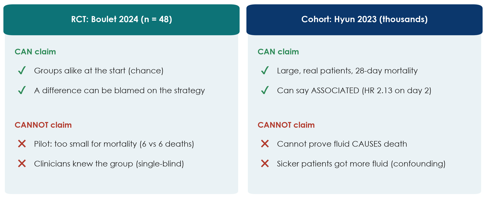{.neu-fig}

::: {.neu-takeaway}
**KEY MESSAGE** RCTs can say 'caused'; cohorts should say 'associated'.
:::

::: {.notes}
Back to the running example to close 3.1.

Boulet (RCT): because chance made the groups comparable, any difference in fluid balance can be attributed to the strategy. But with 48 patients and 6 deaths in each arm, it cannot tell us anything firm about mortality. Clinicians knew the allocation, which could influence how much fluid they gave.

Hyun (cohort): thousands of patients and the outcome we care about. A positive balance on days 2-3 was associated with higher 28-day mortality (HR 2.13 for day 2, 1.56 for day 3; no clear difference on day 1). But it cannot prove that the fluid caused the deaths, because sicker patients receive more fluid.

Misconception: 'adjusted' or 'propensity-matched' turns an association into a cause. It reduces measured confounding only.

Ask the room: write one honest sentence for each paper's conclusion. Expected answer: for Boulet, 'the strategy did not clearly reduce day-5 fluid balance'; for Hyun, 'a positive balance on days 2-3 was associated with higher mortality'.

Timing: 3 minutes. Then a 2-minute check, then the exercise.
:::

## Check your understanding: caused or associated?

::: {.neu-banner style="--c:#6C3483"}
QUICK QUIZ · 2 min
:::

:::: {.columns}
::: {.column width="60%"}
::: {.neu-activity-steps style="--c:#6C3483"}
1. A. Boulet (RCT): 'The restrictive strategy did not reduce the day-5 fluid balance'
2. B. Hyun (cohort): 'A positive fluid balance CAUSES higher 28-day mortality'
3. C. A one-day survey: 'Urinary catheters are associated with urinary infection'
:::
:::
::: {.column width="40%"}
::: {.neu-side .plain style="--c:#6C3483"}
For each

- Is the wording right for the design?
- Thumbs up or thumbs down
:::
:::
::::

::: {.neu-output style="--c:#6C3483"}
**OUTPUT** Thumbs up / down for each sentence
:::

::: {.notes}
Read each sentence; the room shows thumbs up (wording fits the design) or down.

Answers. A: up. A randomised trial may make causal statements, and this one honestly reports a null result. B: DOWN. A cohort can say 'associated with', not 'causes' (Hyun's own abstract correctly says 'associated'). C: up. 'Associated' is the right word for a cross-sectional survey; it cannot show which came first.

Teaching point: this is question 8 of the appraisal checklist used in Session 8: do the words match the design?

Timing: 2 minutes.
:::

## Exercise: Name that design

::: {.neu-banner style="--c:#0D7377"}
GROUP WORK · 15 min
:::

:::: {.columns}
::: {.column width="60%"}
::: {.neu-activity-steps style="--c:#0D7377"}
1. Work in pairs with the handout: 8 short clinical abstracts
2. For each, ask the three questions: assigned? random? which way does time run?
3. Write the design and one word of evidence from the abstract
4. Star the one you found hardest: we discuss it together
:::
:::
::: {.column width="40%"}
::: {.neu-side .plain style="--c:#0D7377"}
Use the tree

- Assigned + random = RCT
- Outcome first, look back = case-control
- Exposure first, follow = cohort
- Same moment = cross-sectional
:::
:::
::::

::: {.neu-output style="--c:#0D7377"}
**OUTPUT** 8 designs named, each with one piece of evidence
:::

::: {.notes}
Handout: Practicals/s3\_exercises.md, Part A. Answer key: Solutions/s3\_solutions.md.

Run it: 9 minutes in pairs, 6 minutes plenary. In plenary, do not go through all eight. Ask which one pairs starred and discuss those. Abstracts 5 (retrospective cohort that sounds like a case-control), 7 (non-randomised before-after study) and 9 (cluster trial, optional; we meet cluster trials after the break) are usually the hardest.

Teaching point: the evidence word matters more than the label: 'randomly allocated', 'selected patients who developed', 'followed for 12 months', 'on a single day'.

Misconception to listen for: 'it used old records so it is case-control'. Ask: were people selected by outcome or by exposure?

Timing: if pairs finish early, ask them to name one strength and one weakness for each design. Announce the break at the end of this slide.
:::

## Break

::: {.neu-banner style="--c:#8A99A3"}
BREAK · 15 min
:::

::: {.neu-activity-steps style="--c:#8A99A3"}
1. Stretch, coffee, fresh air
2. Optional: which design best fits your group's question?
3. We restart with more study designs
:::

::: {.notes}
15-minute break. Put a visible countdown on the screen.

During the break, walk past the groups and ask informally which design they are thinking of for their own question. It gives you a feel for who will need help in the proposal builder.

Restart on time: start the next slide even if a few people are still coming back.
:::

## 3.2  More designs

:::: {.neu-statement}
::: {.neu-big}
Real projects bend the basic designs.
:::

::: {.neu-sub}
Trial variants, non-inferiority, pilots, quality-improvement designs and qualitative research. (35 minutes)
:::
::::

::: {.notes}
Section marker for 3.2 (35 minutes, including a 3-minute check).

Why this matters: most projects in a hospital department are not classic two-arm trials. They are ward-level changes, quality-improvement projects, pilots or interviews. Knowing these designs lets groups choose something feasible.

Timing: 30 seconds.
:::

## Not every trial is parallel: four layouts

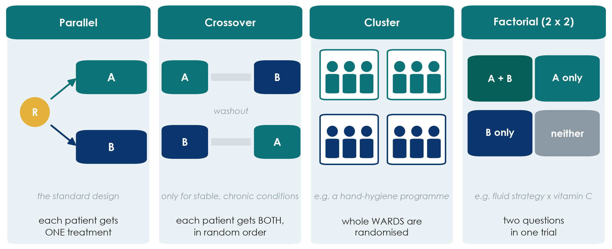{.neu-fig}

::: {.neu-takeaway}
**KEY MESSAGE** Choose the trial layout that fits the treatment and the unit of care.
:::

::: {.notes}
Most trials are parallel: each patient gets one treatment (Boulet). Three variants solve particular problems.

Crossover: each patient receives both treatments in random order, with a washout in between, and acts as their own control, so fewer patients are needed. Only for stable, chronic conditions where the effect wears off (e.g. inhalers in COPD). Useless in septic shock: the patient is not the same on day 7.

Cluster: whole wards, ICUs or hospitals are randomised, not individual patients. Use it when the intervention works at unit level (a hand-hygiene programme, a sepsis bundle) or when patients in the same ward would 'contaminate' each other. Needs more patients, because patients in one cluster resemble each other.

Factorial: two questions in one trial. Patients are randomised twice (e.g. fluid strategy AND vitamin C), giving four groups. Efficient if the two treatments do not interact.

Misconception: 'a cluster trial is a weaker trial'. It is a proper RCT; the analysis must account for clustering.

Ask the room: you want to test a new handover checklist for nurses. Which layout? Expected answer: cluster. Randomise wards or shifts, not patients.

Timing: 6 minutes.
:::

## Superiority or non-inferiority? The margin picture

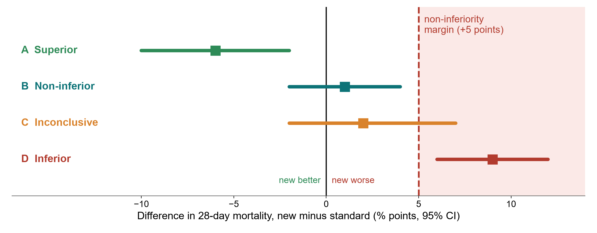{.neu-fig}

::: {.neu-takeaway}
**KEY MESSAGE** Non-inferiority: the whole CI must stay below a margin fixed in advance.
:::

::: {.notes}
A superiority trial asks: is the new treatment BETTER? A non-inferiority trial asks: is it NOT UNACCEPTABLY WORSE (usually because it is cheaper, safer, simpler or uses less fluid).

The margin (here +5 percentage points of mortality, hypothetical) is the largest loss we would accept. It is fixed in the protocol, before the data, with clinical reasoning.

Read the bars (difference and 95% CI). A: the whole CI is below 0, so superior. B: the CI crosses 0 but stays below the margin, so non-inferior. C: the CI crosses the margin, so inconclusive. D: the whole CI is above the margin, so inferior.

Misconception: 'p \> 0.05 in a superiority trial shows the treatments are equivalent'. No. Absence of evidence is not evidence of absence. Boulet's p = 0.42 does not show that restriction is as good as usual care.

Ask the room: who should decide the margin: the statistician or the clinicians? Expected answer: clinicians (and patients), with the statistician; it is a clinical judgement.

Timing: 5 minutes.
:::

## Pilot and feasibility studies: the rehearsal

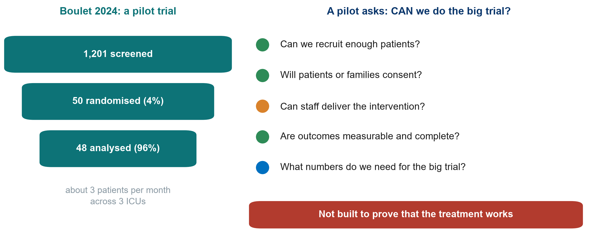{.neu-fig}

::: {.neu-takeaway}
**KEY MESSAGE** A pilot asks 'can we do it?', not 'does it work?'
:::

::: {.notes}
Boulet 2024 calls itself a pilot. Its real value is in the numbers on the left: 1,201 patients screened for 50 randomised (about 4%), roughly 3 patients per month across 3 ICUs, 48 of 50 analysed.

A pilot or feasibility study tests the machinery of the big trial: recruitment, consent, whether staff can deliver the intervention, whether outcomes can be measured completely, and the numbers needed to calculate the sample size.

Teaching point: a pilot should not be used to claim effectiveness. Its success criteria are about feasibility (e.g. 'recruit 2 patients per site per month', 'over 90% data completeness').

Misconception: 'our small study did not find an effect, so we call it a pilot'. A pilot is planned as a pilot from the start, with feasibility objectives.

Ask the room: from these numbers, would you launch a 1,000-patient trial in the same 3 ICUs? Expected answer: not as designed. At 3 patients per month it would take decades; you need many more sites or broader eligibility.

Timing: 4.5 minutes.
:::

## Quasi-experimental designs: before-after and interrupted time series

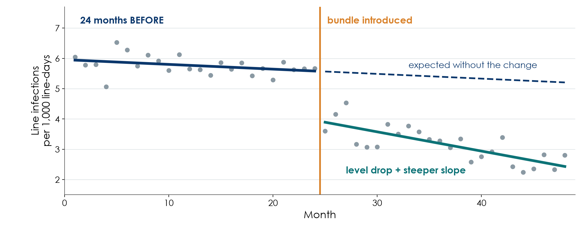{.neu-fig}

::: {.neu-caption}
Simulated data for teaching
:::

::: {.neu-takeaway}
**KEY MESSAGE** Compare against the trend you expected, not against one 'before' average.
:::

::: {.notes}
Most quality-improvement projects introduce a change for everyone at once, with no randomisation and no parallel control. These are quasi-experimental designs.

The simple before-after study compares the average before with the average after. Weak: rates often fall anyway (seasons, new staff, other projects, regression to the mean after a bad month).

The interrupted time series (ITS) is much stronger: many measurements before and after (here 24 monthly points each). We compare what happened with what the pre-change trend predicted (dashed line). We look for a change in LEVEL (the drop) and in SLOPE (steeper fall).

Teaching point: ITS is the standard design for evaluating a bundle, a protocol or a policy in one hospital. Add a control series (a ward that did not change) to make it stronger.

Misconception: 'the infection rate fell after our bundle, so the bundle worked'. Only if the fall is bigger than the existing trend.

Ask the room: what else changed in your hospital in the same month as your last QI project? Expected answer: usually something (staff rotation, a new policy, an audit), which is exactly why a trend matters.

Timing: 5 minutes.
:::

## Qualitative designs: when numbers cannot answer

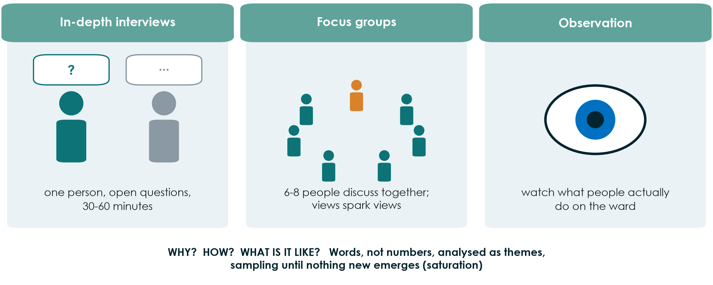{.neu-fig}

::: {.neu-takeaway}
**KEY MESSAGE** Qualitative research explains WHY and HOW; it complements numbers.
:::

::: {.notes}
Some questions are not about how many or how much but about why, how and what it is like. Why do nurses not chart urine output at night? How do families experience surrogate consent in the ICU? Numbers cannot answer these.

Three main methods: in-depth interviews (one person, open questions), focus groups (6-8 people; discussion reveals shared views and disagreements), and observation (what people actually do, which may differ from what they say).

Sampling is purposive (choose people who know the topic) and continues until no new themes emerge (saturation). Analysis looks for themes in transcripts. Reporting guideline: COREQ or SRQR.

Mixed methods combine both: a trial plus interviews to understand why an intervention was or was not delivered.

Misconception: 'qualitative means anecdotal'. Done properly it is systematic, transparent and peer-reviewed.

Ask the room: one question from your ward that only interviews could answer. Expected answer: barriers to early mobilisation, why handovers fail, patients' experience of delirium.

Timing: 4.5 minutes.
:::

## Match the design to the question

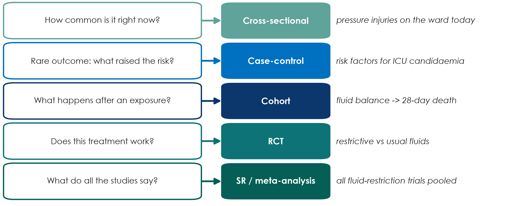{.neu-fig}

::: {.neu-takeaway}
**KEY MESSAGE** Start from the question, and the design follows from it.
:::

::: {.notes}
This is the practical summary of both sections of today. Read each row as: if your question sounds like this, start with this design.

Teaching point: groups will justify their own design later today in the proposal builder with exactly this logic: 'our question is about X, so the best feasible design is Y'.

Note the word FEASIBLE: the ideal design for 'does restriction save lives?' is a large RCT, but a group with one ICU and no funding may honestly choose a retrospective cohort and state its limits.

Misconception: 'we must do an RCT to be taken seriously'. A well-done, honestly reported cohort is publishable and useful.

Ask the room: a group wants to know how many ICU patients have delirium today. Which design? Expected answer: cross-sectional (point prevalence).

Timing: 5 minutes.
:::

## Check your understanding: which design?

::: {.neu-banner style="--c:#6C3483"}
QUICK QUIZ · 3 min
:::

:::: {.columns}
::: {.column width="60%"}
::: {.neu-activity-steps style="--c:#6C3483"}
1. A. A cheaper antibiotic schedule; we only need to show it is not worse
2. B. A hand-hygiene programme delivered to whole wards
3. C. A sepsis bundle started in 2023; we have 3 years of monthly mortality data
4. D. Why do families refuse research consent in the ICU?
:::
:::
::: {.column width="40%"}
::: {.neu-side .plain style="--c:#6C3483"}
Choose

- Cluster trial
- Non-inferiority trial
- Interrupted time series
- Qualitative interviews
:::
:::
::::

::: {.neu-output style="--c:#6C3483"}
**OUTPUT** One design for each (answers in the notes)
:::

::: {.notes}
1 minute alone, then hands up.

Answers. A: non-inferiority trial. Define the margin in advance. B: cluster randomised trial. Randomise wards, not patients. C: interrupted time series. Compare the post-bundle months with the trend before the bundle. D: qualitative design using in-depth interviews (or focus groups) with families.

If the room struggles with C, go back to the ITS picture for 30 seconds.

Timing: 3 minutes.
:::

## Exercise: choose the design for 5 questions

::: {.neu-banner style="--c:#0D7377"}
GROUP WORK · 20 min
:::

:::: {.columns}
::: {.column width="60%"}
::: {.neu-activity-steps style="--c:#0D7377"}
1. Handout Part B: four clinical questions + your group's own question
2. For each: name the best FEASIBLE design (use the decision tree)
3. Write one reason and the design's main weakness
4. Your own question: may you say 'caused' or only 'associated'?
5. Two groups share their own question and design (1 minute each)
:::
:::
::: {.column width="40%"}
::: {.neu-side .plain style="--c:#0D7377"}
Remember

- How common now? Cross-sectional
- Rare outcome? Case-control
- What happens after? Cohort
- Does it work? RCT / cluster
- Already changed? Time series
- Why / how? Qualitative
:::
:::
::::

::: {.neu-output style="--c:#0D7377"}
**OUTPUT** 5 designs with a reason and a weakness, including your own question
:::

::: {.notes}
Groups of 6 (the proposal groups). 12 minutes working, 8 minutes sharing.

Answers for the four given questions (handout Part B; key in Solutions/s3\_solutions.md): 1 point-prevalence of pressure injuries (cross-sectional); 2 chlorhexidine bathing introduced unit by unit (cluster randomised trial); 3 sepsis bundle already in place, monthly data (interrupted time series); 4 why nurses do not report near misses (qualitative interviews or focus groups). Two optional bonus questions: case-control and non-inferiority.

The own-question item is the bridge to the proposal builder: the design they choose here is the one they justify after this exercise.

Common problem: groups choose an RCT for a harm or prognosis question. Ask: could you ethically assign this exposure?

Timing: give a 5-minute warning before sharing.
:::

## Who is in your study? Inclusion and exclusion criteria

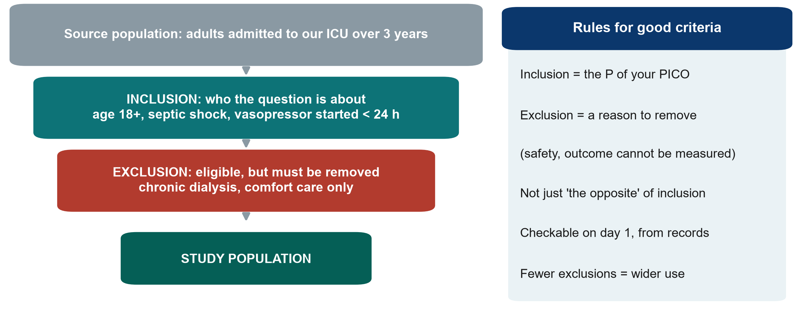{.neu-fig}

::: {.neu-takeaway}
**KEY MESSAGE** Inclusion describes your P; exclusion removes eligible people for a stated reason.
:::

::: {.notes}
This slide prepares the proposal builder: groups must write their study population today.

Walk down the funnel with the ICU example (an observational version of our fluid question). Source population: everyone who could be studied. Inclusion criteria: the P of the PICO, made measurable (age 18+, septic shock, vasopressor started within 24 h). Exclusion criteria: people who meet the inclusion criteria but must be removed for a reason, such as safety or an outcome that cannot be measured (chronic dialysis, comfort care only).

Compare with Boulet: included septic shock, age 18-85, within 24 h of vasopressor start; excluded acute kidney injury needing RRT within 24 h, end-stage kidney disease, severe malnutrition (BMI \< 18).

Misconception: writing exclusions as the opposite of inclusions ('age under 18' is not an exclusion; it is simply not included).

Teaching point: every extra exclusion makes the study cleaner but the result applies to fewer patients (external validity, Session 4).

Ask the room: give one good exclusion criterion for a study of early mobilisation. Expected: unstable spine fracture, or comfort care only.

Timing: 3 minutes.
:::

## Proposal builder 3: design, setting and population

::: {.neu-banner style="--c:#055F56"}
PROPOSAL BUILDER · 35 min
:::

:::: {.columns}
::: {.column width="60%"}
::: {.neu-activity-steps style="--c:#055F56"}
1. Re-read your research question from Part 1
2. Choose the design with the decision tree; justify it in 3-5 sentences
3. Setting: where, when, which units, which data source
4. Population: 3-5 inclusion and 3-5 exclusion criteria (with reasons)
5. Draw your study on a timeline: exposure, then outcome
6. Ask the facilitator to check before you finish
:::
:::
::: {.column width="40%"}
::: {.neu-side .plain style="--c:#055F56"}
Facilitator check

- Design matches the question?
- Feasible in your unit?
- Inclusion = your P?
- Each exclusion has a reason?
- Caused or associated?
:::
:::
::::

::: {.neu-output style="--c:#055F56"}
**OUTPUT** Proposal Part 2a written: design + justification, setting, population
:::

::: {.notes}
Worksheet: Practicals/s3\_exercises.md, Part C, and the proposal template (Part 2). 35 minutes.

Suggested rhythm (the criteria slide before this takes 3 minutes): 4 minutes to agree the design (most groups already chose it in the last exercise); 19 minutes writing, split between members (one writes the justification, one the setting, two the criteria, one draws the timeline); 9 minutes for the facilitator check and one group reading its justification aloud.

Model answer for the running example (observational version): retrospective cohort of adults with septic shock in our ICU over 3 years; justification: an RCT is ideal but not feasible for one ICU without funding; existing charts record fluid in/out and outcomes; we will say 'associated with'. Inclusion and exclusion as on the funnel slide.

Common problems: an RCT chosen for an exposure that cannot be assigned; a setting that is far too large; exclusions that repeat the inclusions in the negative.

The rest of Part 2 (exposure, comparator, outcomes, biases) is built in Session 4.

Timing: give a 10-minute and a 2-minute warning.
:::

## Session 3 in one slide

:::: {.neu-cards style="--n:3"}
::: {.neu-card .plain style="--c:#0D7377"}
[3.1 Basic designs]{.neu-card-title}

- Snapshot, look back, follow forward
- RCT = chance assigns the exposure
- RCT may say 'caused'; cohort says 'associated'
:::
::: {.neu-card .plain style="--c:#0B376C"}
[3.2 More designs]{.neu-card-title}

- Cluster, crossover, factorial
- Non-inferiority needs a margin
- Pilot, time series, qualitative
:::
::: {.neu-card .plain style="--c:#055F56"}
[Your proposal]{.neu-card-title}

- Design + justification
- Setting
- Inclusion and exclusion criteria
:::
::::

::: {.neu-takeaway}
**KEY MESSAGE** The question picks the design; the design decides what you may claim.
:::

::: {.notes}
Session recap. Ask three different people to explain one card each in their own words.

If time is short, read the takeaway only.

Timing: 2 minutes (part of the 5-minute wrap-up).
:::

## Wrap-up and homework

::: {.neu-banner style="--c:#1F5C7A"}
DISCUSSION · 5 min
:::

::: {.neu-activity-steps style="--c:#1F5C7A"}
1. Exit question: a study compares patients who chose to get a flu vaccine with those who did not. Design? Caused or associated?
2. Homework: finish Proposal Part 2a (design, setting, population)
3. Homework: read the 'Patients' paragraph of Boulet and the 'Data source' paragraph of Hyun
4. Next Saturday (Session 4): can we trust the result, and how big is the effect?
:::

::: {.neu-output style="--c:#1F5C7A"}
**OUTPUT** Exit answer on a sticky note
:::

::: {.notes}
Exit question answer: a cohort (grouped by the exposure they chose, followed forward); it may only say 'associated', because people who choose vaccination differ in many ways (healthy-user effect). This previews confounding next Saturday.

Collect the sticky notes; read three aloud at the start of Session 4.

Timing: 3 minutes after the recap slide. Finish on time.
:::

## Extra slides: Session 3

:::: {.neu-statement}
::: {.neu-big}
Extra slides: Session 3
:::

::: {.neu-sub}
Use if time allows, or for self-study
:::
::::

::: {.notes}
EXTRA: the slides after this point are optional. Use them if the room is quick, for questions, or point participants to them for self-study.

Timing: skip in the live session unless time allows.
:::

## The decision tree in action: Boulet and Hyun

:::: {.neu-steps}
::: {.neu-step style="--c:#0D7377"}
[1]{.neu-step-num}[Assigned?]{.neu-step-label}

- Boulet: yes, the trial assigned the strategy
- Hyun: no, clinicians decided
:::
::: {.neu-step style="--c:#0B376C"}
[2]{.neu-step-num}[Random?]{.neu-step-label}

- Boulet: yes, central computer
:::
::: {.neu-step style="--c:#5FA39B"}
[3]{.neu-step-num}[Comparison?]{.neu-step-label}

- Hyun: yes, positive vs negative balance
:::
::: {.neu-step style="--c:#0070C0"}
[4]{.neu-step-num}[Time order?]{.neu-step-label}

- Hyun: exposure days 1-3, then death by day 28
:::
::: {.neu-step style="--c:#055F56"}
[5]{.neu-step-num}[Design]{.neu-step-label}

- Boulet: RCT
- Hyun: cohort
:::
::::

::: {.neu-takeaway}
**KEY MESSAGE** Walk every paper through the same questions before reading its results.
:::

::: {.notes}
EXTRA: a slow walk-through of the decision tree with the two running-example papers. Useful if the 'Name that design' exercise showed confusion.

Boulet: assigned? Yes. Random? Yes. So RCT. Hyun: assigned? No. Comparison group? Yes. Exposure measured before outcome? Yes. So cohort.

Ask the room to do the same for any paper they brought.

Timing: 2 minutes if used.
:::

## Choosing good controls in a case-control study

:::: {.neu-cards style="--n:3"}
::: {.neu-card .plain style="--c:#0D7377"}
[Same source]{.neu-card-title}

- Same hospital, units and period as the cases
- Would have become a case if they had the outcome
:::
::: {.neu-card .plain style="--c:#0B376C"}
[Same measurement]{.neu-card-title}

- Same records, same questions
- Ideally assessor blind to case status
:::
::: {.neu-card .plain style="--c:#0070C0"}
[Matching (optional)]{.neu-card-title}

- e.g. age, month of admission
- Do not match on the exposure itself
:::
::::

::: {.neu-takeaway}
**KEY MESSAGE** Bad controls make any case-control study meaningless.
:::

::: {.notes}
EXTRA: for groups planning a case-control study.

Controls must come from the population that produced the cases: in our candidaemia example, other ICU patients in the same units and months, not healthy volunteers.

Exposure must be measured the same way in cases and controls, ideally by someone who does not know which is which.

Matching on a few factors can improve efficiency, but over-matching (on things linked to the exposure) hides the effect.

Timing: 2 minutes if used.
:::

## Superiority, equivalence and non-inferiority

:::: {.neu-cards style="--n:3"}
::: {.neu-card .plain style="--c:#2E8B57"}
[Superiority]{.neu-card-title}

- Is the new treatment BETTER?
- Whole CI on the 'better' side of 0
:::
::: {.neu-card .plain style="--c:#0B376C"}
[Equivalence]{.neu-card-title}

- Is it about the SAME?
- Whole CI inside -margin to +margin
:::
::: {.neu-card .plain style="--c:#0D7377"}
[Non-inferiority]{.neu-card-title}

- Is it NOT unacceptably worse?
- Whole CI below +margin
:::
::::

::: {.neu-takeaway}
**KEY MESSAGE** The question (better, same, not worse) is fixed in the protocol, before the data.
:::

::: {.notes}
EXTRA: completes the margin picture from 3.2.

Superiority trials are the usual type. Equivalence trials (common for generic drugs) need the CI inside a margin on both sides. Non-inferiority trials need only the upper side.

Misconception: 'a failed superiority trial shows equivalence'. No. It was not designed with a margin.

Timing: 2 minutes if used.
:::

## Making a quality-improvement evaluation stronger

:::: {.neu-cards style="--n:3"}
::: {.neu-card .plain style="--c:#0D7377"}
[More time points]{.neu-card-title}

- At least 8-12 points before and after
- Same definition every month
:::
::: {.neu-card .plain style="--c:#0B376C"}
[A control series]{.neu-card-title}

- A ward or hospital without the change
- Same months, same measure
:::
::: {.neu-card .plain style="--c:#B23B2E"}
[Record co-interventions]{.neu-card-title}

- Staff changes, new policies, audits
- Write them down as they happen
:::
::::

::: {.neu-takeaway}
**KEY MESSAGE** A before-after average is weak; a long, controlled time series is much stronger.
:::

::: {.notes}
EXTRA: for groups whose project evaluates a change already made on their ward.

The interrupted time series compares the post-change data with the trend before the change. More data points, a control series and a diary of other changes make it much more convincing.

Reporting guideline for QI projects: SQUIRE 2.0.

Timing: 2 minutes if used.
:::
