# Session 4 · Bias & effect: can we trust it, how big is it?

## Weekend 2 · Sunday

- Recap quiz on Session 3 (10 min)
- 4.1  Bias, confounding and causation (40 min)
- 4.2  Measuring disease and association + live 2x2 demo (30 min)
- Break (15 min) - then two 2x2 calculations (20 min)
- 4.3  Beyond single studies: tests, meta-analysis, appraisal (30 min)
- Proposal builder 4: exposure, outcomes, biases (30 min) - wrap-up

::: {.notes}
SESSION 4 OPENING (0:00). Yesterday we chose HOW to answer a question. Today two questions about any result: can we TRUST it (bias, confounding, causation) and how BIG is it (risk, RR, OR, RD, NNT)? Then we look beyond single studies: diagnostic tests, meta-analysis and appraisal tools.

Read three exit-question sticky notes from Session 3 first (the flu-vaccine cohort) - it leads straight into confounding.

Pace: the only arithmetic is division in a 2x2 table, and the spreadsheet checks every answer.

Timing: 1 minute. The day: recap 10, 4.1 40, 4.2 30, break 15, calculations 20, 4.3 30, proposal builder 30, wrap-up 5.
:::

## Recap quiz: three questions on Session 3

::: {.neu-banner style="--c:#6C3483"}
QUICK QUIZ · 10 min
:::

:::: {.columns}
::: {.column width="60%"}
::: {.neu-activity-steps style="--c:#6C3483"}
1. Q1. ICU patients with delirium are compared with patients without delirium for earlier benzodiazepine use. Design?
2. Q2. Which design randomises whole wards instead of patients?
3. Q3. New vs old strategy, mortality difference 95% CI -1 to +3 points; margin +4 points. Result?
4. Groups: re-read your Proposal Part 2a (design, setting, population) - 2 min
:::
:::
::: {.column width="40%"}
::: {.neu-side .plain style="--c:#6C3483"}
How we run it

- Answer alone first
- Show of hands, then reveal
- Ask one person to explain
:::
:::
::::

::: {.neu-output style="--c:#6C3483"}
**OUTPUT** Each group's Part 2a re-read and ready to extend
:::

::: {.notes}
Answers. Q1: case-control (chosen by outcome, look back for exposure). Q2: a cluster randomised trial. Q3: non-inferior - the whole CI stays below the +4 margin (it crosses 0, so it is not superior).

Misconception to catch in Q1: 'it uses records, so it is a cohort'. Ask: were people chosen by what happened to them (delirium) or by what they received?

Timing: about 6 minutes for the questions, 3 minutes for groups to re-read Part 2a. Today's proposal builder completes Part 2.
:::

## Key words of the day

::: {.neu-intro}
Today's vocabulary - definitions come with a picture
:::

:::: {.neu-cards style="--n:4"}
::: {.neu-card .plain style="--c:#B23B2E"}
[Can we trust it?]{.neu-card-title}

- Bias, confounding
- Effect modification
- Reverse causation
:::
::: {.neu-card .plain style="--c:#0D7377"}
[How big is it?]{.neu-card-title}

- Risk, risk ratio (RR)
- Risk difference, NNT
- Odds ratio (OR)
:::
::: {.neu-card .plain style="--c:#0B376C"}
[Tests]{.neu-card-title}

- Sensitivity, specificity
- PPV, NPV, ROC curve
:::
::: {.neu-card .plain style="--c:#055F56"}
[Many studies]{.neu-card-title}

- Forest plot, I-squared
- Risk-of-bias tool
:::
::::

::: {.neu-takeaway}
**KEY MESSAGE** Trust first, then size: a precise answer can still be a biased one.
:::

::: {.notes}
Read the four headings; tell the room the glossary is in the handout.

Teaching point: the order matters. We judge whether a result can be trusted before we care how big it is.

Ask the room: which of these words have you seen in a paper this month? Expected: OR, RR, 95% CI, forest plot.

Timing: 1 minute.
:::

## 4.1  Bias, confounding and causation

:::: {.neu-statement}
::: {.neu-big}
Bias is systematic error. Size does not fix it.
:::

::: {.neu-sub}
Selection, information, confounding, effect modification - and from association to causation. (40 minutes)
:::
::::

::: {.notes}
Section marker for 4.1 (40 minutes, including a 2-minute check and the 4-minute 'Spot the bias' quiz).

Three families of bias: who got INTO the study (selection), how things were MEASURED (information), and MIXING of effects (confounding). Then how designs fight bias, and four ideas for judging a result: effect modification, internal vs external validity, reverse causation and the Bradford Hill viewpoints.

Timing: 30 seconds.
:::

## Random error versus bias

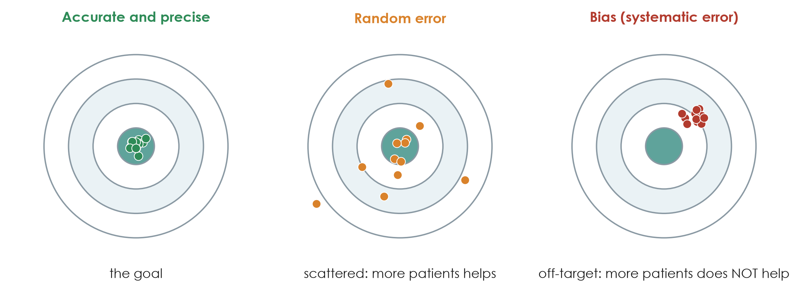{.neu-fig}

::: {.neu-takeaway}
**KEY MESSAGE** A bigger sample shrinks random error but leaves bias untouched.
:::

::: {.notes}
Use the dartboard. Left: what we want - close to the truth and tightly grouped. Middle: random error - centred on the truth but scattered; a larger sample pulls the darts together. Right: bias - tightly grouped but in the wrong place; a larger sample just makes us more confident in the wrong answer.

Teaching point: confidence intervals (Session 6) describe random error only. A narrow CI says nothing about bias.

Misconception: 'a study of 10,000 patients cannot be biased'. Large registry studies can be very precise and still biased.

Ask the room: which of the two papers is more at risk of random error, and which of bias? Expected answer: Boulet (48 patients) - random error; Hyun (observational) - bias, especially confounding.

Timing: 2 minutes.
:::

## Selection bias: who got into the study?

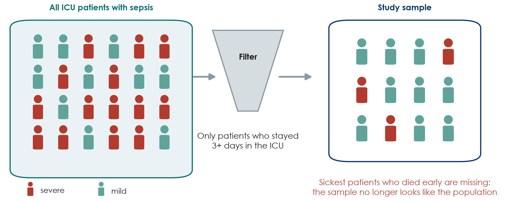{.neu-fig}

::: {.neu-takeaway}
**KEY MESSAGE** If the sample differs from the target population, results may not transfer.
:::

::: {.notes}
Selection bias happens when the people who enter (or stay in) a study differ systematically from the people we want to learn about.

Example from Hyun: only patients who stayed at least three days in the ICU with fluid data were included (2,516 of 11,981 registry patients). The sickest patients who died early, and the mildest who left early, were left out. The result applies to 'patients still in the ICU on day 3', not to all sepsis patients.

Other common sources: volunteers, patients who refuse consent, loss to follow-up, single referral centres.

Misconception: 'selection bias only matters in surveys'. It affects every design, including RCTs (strict exclusion criteria limit who the result applies to).

Ask the room: in Boulet, 1,201 patients were screened and 50 included. What does that tell you? Expected answer: trial patients were highly selected - check whether they look like your patients before applying the result.

Timing: 2.5 minutes.
:::

## Information bias: how things were measured

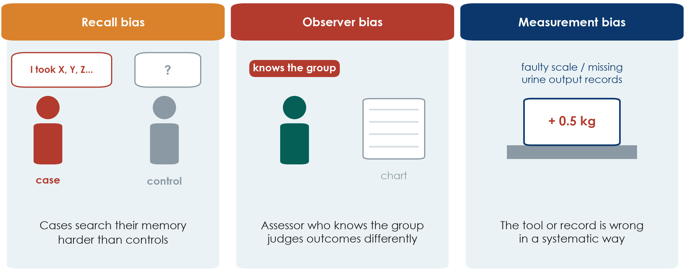{.neu-fig}

::: {.neu-takeaway}
**KEY MESSAGE** Measure exposure and outcome the same way in every group.
:::

::: {.notes}
Information (measurement) bias: the data are wrong in a systematic way.

Recall bias: in a case-control study, cases (or their families) search their memory harder than controls, so exposures look more common in cases.

Observer bias: an assessor who knows the group may judge a soft outcome differently - for example 'ready for discharge' or 'delirium present'. In Boulet clinicians knew the allocation.

Measurement bias: a scale that always reads 0.5 kg high, or urine output that is under-recorded on night shifts. If it differs between groups, it distorts the comparison.

Misconception: 'hard outcomes like death are immune'. Death is robust, but the timing and cause of death can still be misclassified.

Ask the room: how would you reduce observer bias in an unblinded ICU trial? Expected answer: an objective outcome, a blinded outcome assessor, standard definitions and training.

Timing: 2.5 minutes.
:::

## Check your understanding: which bias?

::: {.neu-banner style="--c:#6C3483"}
QUICK QUIZ · 2 min
:::

:::: {.columns}
::: {.column width="60%"}
::: {.neu-activity-steps style="--c:#6C3483"}
1. A. Only patients who survived to hospital discharge are interviewed about their ICU care
2. B. The nurse who knows each patient's group scores their pain
3. C. A scale that always reads 0.5 kg too high is used on one ward only
:::
:::
::: {.column width="40%"}
::: {.neu-side .plain style="--c:#6C3483"}
Choose

- Selection bias
- Observer bias
- Measurement bias
:::
:::
::::

::: {.neu-output style="--c:#6C3483"}
**OUTPUT** One bias for each - answers in the notes
:::

::: {.notes}
Hands up for each option.

Answers. A: selection bias - the sickest patients (who died) are missing, so the sample is not the population. B: observer bias (information bias) - a subjective score assessed by someone who knows the group. C: measurement bias (information bias) - and because it affects one ward only, it distorts the comparison between wards.

Timing: 2 minutes.
:::

## Confounding by indication: the ICU fluid example

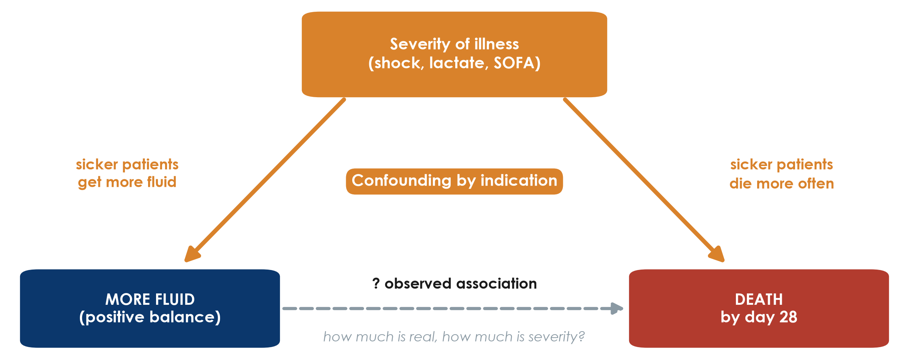{.neu-fig}

::: {.neu-takeaway}
**KEY MESSAGE** A confounder is linked to the exposure AND causes the outcome.
:::

::: {.notes}
This is the most important slide of 4.1. Point to each arrow.

Severity of illness pushes clinicians to give more fluid (left arrow). Severity also causes death (right arrow). So patients who got more fluid die more often - even if the fluid itself did nothing.

This special case is called confounding by indication: the reason for giving a treatment is itself linked to the outcome.

Three conditions for a confounder: associated with the exposure, a cause of the outcome, and not on the causal pathway between them.

Misconception: 'a confounder is any variable that differs between groups'. It must also affect the outcome.

Ask the room: name another example of confounding by indication on your ward. Expected answer: patients on more antibiotics die more; patients who see the dietitian lose more weight; patients on vasopressors have more arrhythmias.

Timing: 3 minutes.
:::

## Confounding in numbers: the association disappears

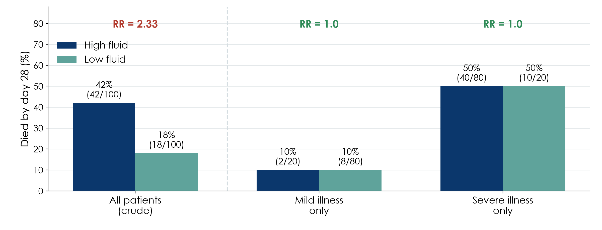{.neu-fig}

::: {.neu-caption}
Hypothetical data for teaching
:::

::: {.neu-takeaway}
**KEY MESSAGE** Compare like with like: within each severity level, fluid makes no difference.
:::

::: {.notes}
Hypothetical numbers, chosen to make the point. All patients together: 42% of high-fluid patients die versus 18% of low-fluid patients - a crude RR of 2.33. It looks as if fluid kills.

Now split by severity. Mild illness: 10% versus 10%. Severe illness: 50% versus 50%. Within each level the RR is 1.0.

Why? 80 of the 100 high-fluid patients were severely ill, but only 20 of the 100 low-fluid patients. Severity, not fluid, explained the crude difference.

Teaching point: this is what 'adjusting for severity' does - it compares like with like. Session 6 shows how papers and models report it. Next slide: what it means when the strata do NOT agree.

Misconception: 'after adjustment the remaining association is causal'. Only if every important confounder was measured well - which is never guaranteed in observational data.

Ask the room: what would you need to measure at baseline in your own observational study to do this? Expected answer: the main severity markers - for sepsis SOFA, lactate, vasopressor dose, age, comorbidity.

Timing: 2.5 minutes. Check arithmetic aloud: 2 + 40 = 42 deaths of 100; 8 + 10 = 18 of 100.
:::

## Worked examples: find the confounder

::: {.neu-intro}
In each, a third factor drives both the exposure and the outcome
:::

:::: {.neu-cards style="--n:3"}
::: {.neu-card .plain style="--c:#0D7377"}
[Antibiotics and death]{.neu-card-title}

- More antibiotics -\> more deaths?
- **Confounder: severity of infection**
- Sicker patients get more drugs
:::
::: {.neu-card .plain style="--c:#0B376C"}
[Dietitian and weight loss]{.neu-card-title}

- Seen by dietitian -\> more weight loss?
- **Confounder: malnutrition at admission**
- The reason for referral
:::
::: {.neu-card .plain style="--c:#B23B2E"}
[Vasopressors and arrhythmia]{.neu-card-title}

- Vasopressors -\> more arrhythmia?
- **Confounder: depth of shock**
- Partly a drug effect too
:::
::::

::: {.neu-takeaway}
**KEY MESSAGE** Ask: why did these patients receive the exposure? That reason may be the confounder.
:::

::: {.notes}
Three more examples of confounding by indication, to make the idea stick for beginners.

For each card, read the apparent association, then ask the room for the third factor before revealing it.

Card 3 is deliberately mixed: vasopressors can cause arrhythmia, AND shock severity drives both. Real associations are often a mixture of a true effect and confounding - which is why adjustment, or randomisation, is needed to separate them.

Misconception: 'a confounder is any difference between groups'. It must be linked to the exposure AND cause the outcome.

Timing: 2 minutes.
:::

## Confounding or effect modification?

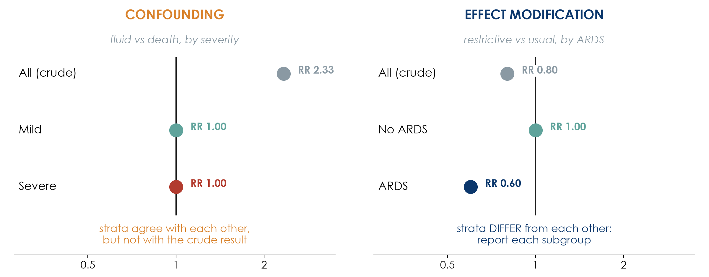{.neu-fig}

::: {.neu-caption}
Hypothetical data for teaching
:::

::: {.neu-takeaway}
**KEY MESSAGE** Confounding is a bias to remove; effect modification is a finding to report.
:::

::: {.notes}
Both appear when we split the data into strata, but they mean opposite things.

Left - confounding (our fluid example): the strata agree with EACH OTHER (RR 1.0 and 1.0) but differ from the crude result (2.33). The third factor (severity) created a false association. Fix: adjust, and report the adjusted estimate.

Right - effect modification, also called interaction (hypothetical): a restrictive strategy might help patients with ARDS (RR 0.60) but make no difference without ARDS (RR 1.00). The strata differ from EACH OTHER. This is real biology, not bias: report each subgroup; do not average it away.

Rule of thumb: strata similar to each other but different from the crude = confounding. Strata different from each other = effect modification.

Misconception: 'every subgroup difference is real'. Subgroups must be pre-specified and few; with many subgroups, some differ by chance. Session 6 shows interaction in a model.

Ask the room: give a clinical example where a treatment works differently in two groups. Expected answer: thrombolysis by time since stroke onset; drug effects by kidney function; steroids by severity of COVID-19.

Timing: 3 minutes.
:::

## How designs fight bias

::: {.neu-intro}
Build the protection into the design; repair what is left in the analysis.
:::

:::: {.neu-cards style="--n:3"}
::: {.neu-card .plain style="--c:#0D7377"}
[Randomise + conceal]{.neu-card-title}

- Chance decides the group
- Balances known AND unknown confounders
- Nobody can predict the next allocation
:::
::: {.neu-card .plain style="--c:#0B376C"}
[Blind]{.neu-card-title}

- Patients, clinicians, assessors, analysts
- Protects how outcomes are measured
- If impossible: blind the assessor
:::
::: {.neu-card .plain style="--c:#0070C0"}
[Restrict, match, adjust]{.neu-card-title}

- Restrict: narrow eligibility
- Match: pair similar patients
- Adjust: statistics in the analysis
- **[Measured confounders only]{style="color:#B23B2E"}**
:::
::::

::: {.neu-takeaway}
**KEY MESSAGE** Only randomisation protects against confounders you never measured.
:::

::: {.notes}
This slide is the toolbox; the next three slides show each tool in pictures.

Design stage (prevention): randomisation, allocation concealment, blinding, restriction, matching. Analysis stage (repair): stratification, regression adjustment, propensity scores.

Teaching point: the bold red line is the key message. Every observational tool works only on what you measured. Randomisation is the only tool that also balances what you did not measure.

Misconception: 'propensity score matching is as good as randomisation'. It is matching on measured factors - clever, but still limited to the measured ones.

Ask the room: which tools did Hyun use? Expected answer: restriction (adults with sepsis, ICU stay of 3 days or more) and 1:1 propensity score matching.

Timing: 1.5 minutes.
:::

## Randomisation balances what we know and what we do not

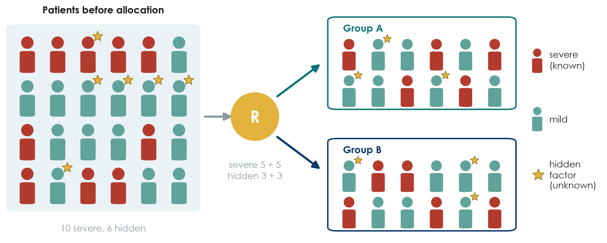{.neu-fig}

::: {.neu-takeaway}
**KEY MESSAGE** By chance, both groups get a similar mix - even of factors nobody measured.
:::

::: {.notes}
The red figures are severely ill patients (a known confounder). The gold stars are a hidden factor nobody measured - a genetic trait, frailty, a clinician's gut feeling.

Randomisation sends patients to group A or B by chance, so on average both groups receive the same mix of severe patients AND of stars. Here each group gets 5 severe and 3 starred patients.

Teaching point: balance is on average; with very small trials chance imbalances happen. Boulet found baseline creatinine higher in the intervention group - with 24 per arm that is not surprising.

Misconception: 'randomised means the groups are identical'. They are similar on average; Table 1 lets you check.

Ask the room: why does this work better with 500 patients than with 50? Expected answer: with larger numbers, chance imbalances average out.

Timing: 1.5 minutes.
:::

## Concealment before, blinding after

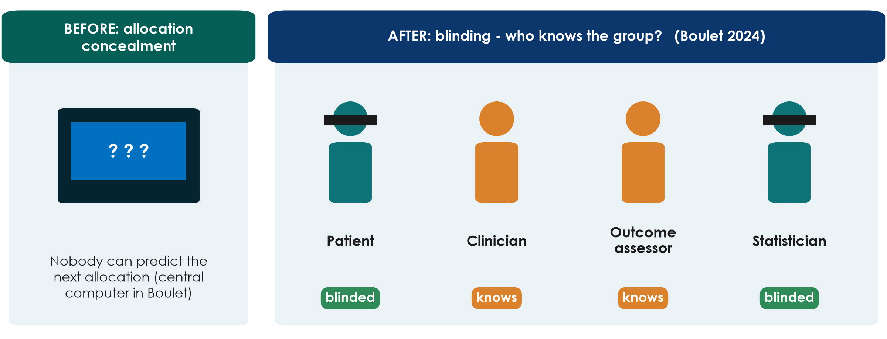{.neu-fig}

::: {.neu-takeaway}
**KEY MESSAGE** Concealment protects WHO gets in; blinding protects HOW outcomes are measured.
:::

::: {.notes}
Allocation concealment happens BEFORE randomisation: the person recruiting cannot know or predict the next allocation (central computer, not envelopes on the desk). Without it, a clinician could steer sicker patients away from the new treatment - selection bias inside a trial.

Blinding happens AFTER: who knows the group? In Boulet the patients and the statisticians were blinded, the clinicians and investigators were not - hence 'single-blind'.

Teaching point: in fluid and many ICU trials, blinding the clinician is often impossible. Then blind the outcome assessor and choose an objective outcome.

Misconception: 'single, double, triple blind' have fixed meanings. They do not - papers should state exactly WHO was blinded.

Ask the room: is concealment possible when blinding is not? Expected answer: yes - concealment is always possible and always required.

Timing: 1.5 minutes.
:::

## Matching helps - but only for what was measured

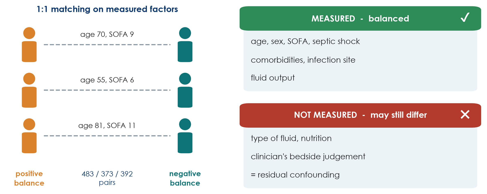{.neu-fig}

::: {.neu-takeaway}
**KEY MESSAGE** Matching and adjustment cannot balance what nobody recorded.
:::

::: {.notes}
Hyun matched each positive-balance patient to a negative-balance patient with a similar propensity score, built from measured factors: age, sex, SOFA, septic shock, comorbidities, infection site, fluid output and others. This gave 483, 373 and 392 matched pairs for the day-1, day-2 and day-3 analyses.

The authors themselves list what was NOT measured: type of fluid and nutritional support. The clinician's bedside judgement of how sick a patient looks is never fully captured. Whatever is left is called residual confounding.

Teaching point: this is why a cohort, however well matched, says 'associated with', and why the question 'does restriction save lives?' still needs a large RCT.

Misconception: 'matched groups are as good as randomised groups'. Check Table 1 - and then ask what is not in Table 1.

Ask the room: name one unmeasured factor that might push clinicians to give more fluid AND predict death. Expected answer: clinical impression of shock, mottled skin, a failing heart, a goals-of-care discussion.

Timing: 1.5 minutes.
:::

## Internal and external validity

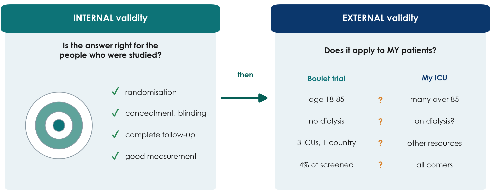{.neu-fig}

::: {.neu-takeaway}
**KEY MESSAGE** First: is it right for the people studied? Then: does it apply to mine?
:::

::: {.notes}
Internal validity: is the answer correct for the people who were in the study? This is what randomisation, concealment, blinding, complete follow-up and good measurement protect.

External validity (generalisability): does the answer apply to MY patients in MY setting? Compare the trial population with yours. Boulet included adults aged 18-85 without dialysis or severe malnutrition, in 3 ICUs of one country, and only about 4% of screened patients.

Teaching point: internal validity comes first. A biased result generalises nowhere. But a perfectly valid trial in highly selected patients may not help your unit.

Misconception: 'an RCT applies to everyone'. It applies most clearly to patients like those enrolled.

Ask the room: name one patient group in your ICU who would not have entered Boulet's trial. Expected answer: patients over 85, patients on chronic dialysis, those admitted more than 24 h after starting vasopressors.

Timing: 2 minutes.
:::

## Reverse causation: which came first?

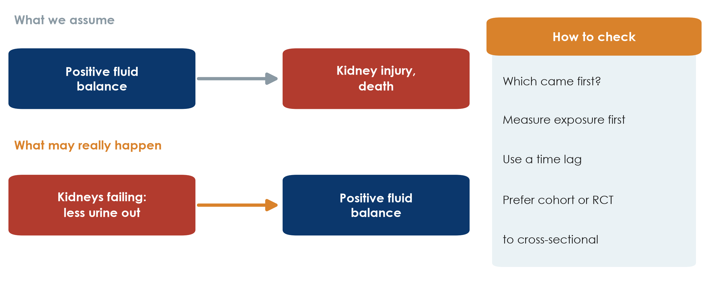{.neu-fig}

::: {.neu-takeaway}
**KEY MESSAGE** Before claiming X causes Y, make sure Y did not cause X.
:::

::: {.notes}
Reverse causation: the 'outcome' actually causes the 'exposure'.

ICU example: we assume a positive fluid balance causes kidney injury and death. But failing kidneys produce less urine, and less urine out means a more positive balance. The arrow may run the other way. This is why Hyun matched patients on fluid OUTPUT as well as input.

Other examples: people with early, undiagnosed illness stop exercising (so inactivity looks harmful); patients who are deteriorating get more tests and more drugs.

How to check: make sure the exposure was measured BEFORE the outcome began, use a time lag, prefer cohort or trial designs over cross-sectional ones.

Misconception: 'reverse causation only matters in cross-sectional studies'. It can affect cohorts too when the exposure is measured while the outcome is already developing.

Ask the room: delirious patients receive more antipsychotics. Which way could the arrow run? Expected answer: both ways - the drugs might cause harm, but delirium is the reason they are prescribed.

Timing: 2 minutes.
:::

## From association to causation: Bradford Hill in pictures

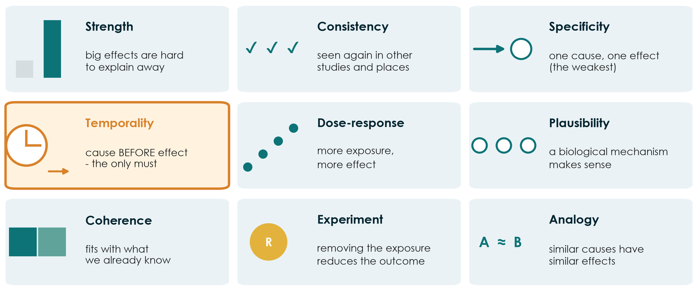{.neu-fig}

::: {.neu-takeaway}
**KEY MESSAGE** Causation is a judgement built from many clues; temporality is the only must.
:::

::: {.notes}
In 1965 Austin Bradford Hill listed nine viewpoints to judge whether an association is likely to be causal. They are not a checklist to score; they are clues.

Strength (a big RR is harder to explain by confounding), consistency (seen in other studies and settings), specificity (the weakest), temporality (the cause must come first - the only essential one), dose-response (more exposure, more effect), plausibility (a mechanism), coherence (fits with what is known), experiment (removing the exposure reduces the outcome - an RCT is the strongest form), analogy.

Apply to Hyun: strength moderate (HR about 1.6-2.1); consistency with other cohorts yes; temporality - balance measured before death, but reverse causation is possible; dose-response not shown; experiment - trials such as Boulet have not shown a mortality effect. Conclusion: possible, not proven.

Misconception: 'if most criteria are met, causation is proven'. They raise or lower our confidence; they never prove.

Ask the room: which criterion does the RCT provide that no cohort can? Expected answer: experiment.

Timing: 3 minutes.
:::

## Quick quiz: Spot the bias

::: {.neu-banner style="--c:#6C3483"}
QUICK QUIZ · 4 min
:::

:::: {.columns}
::: {.column width="60%"}
::: {.neu-activity-steps style="--c:#6C3483"}
1. Mothers of babies with a birth defect recall medicines in pregnancy better than other mothers
2. A trial nurse who knows the group scores 'ready for discharge'
3. A survey of ICU survivors' quality of life recruits only those who attend clinic
4. Patients with higher lactate get more fluid and die more often
:::
:::
::: {.column width="40%"}
::: {.neu-side .plain style="--c:#6C3483"}
Choose one

- Selection bias
- Recall bias
- Observer bias
- Confounding
:::
:::
::::

::: {.neu-output style="--c:#6C3483"}
**OUTPUT** One bias named for each scenario, with one fix
:::

::: {.notes}
Read each scenario; the room answers by show of hands or calling out. Ask for one fix each time.

Answers. 1: recall bias - fix: record exposure before the outcome is known (prescription records), ask cases and controls in the same structured way. 2: observer bias - fix: blinded assessor, objective discharge criteria. 3: selection bias (and loss to follow-up) - fix: contact all survivors, report non-responders. 4: confounding by indication - fix: randomise, or measure lactate and other severity markers and adjust/match.

The handout (Part A) has these four scenarios with space to write; use it if the room is quiet.

Timing: 4 minutes. Keep it fast - this is a check, not a lecture.
:::

## 4.2  Measuring disease and association

:::: {.neu-statement}
::: {.neu-big}
How common? How much more likely?
:::

::: {.neu-sub}
Prevalence, incidence, risk, and the 2x2 table behind RR, OR, RD and NNT. (30 minutes)
:::
::::

::: {.notes}
Section marker for 4.2 (30 minutes: about 20 minutes of pictures and a 3-minute check, then an 8-minute live demo; the calculations come after the break).

Reassure the room: the only arithmetic today is division with a 2x2 table, and the spreadsheet will check every answer.

Timing: 30 seconds.
:::

## Prevalence and incidence: the bathtub

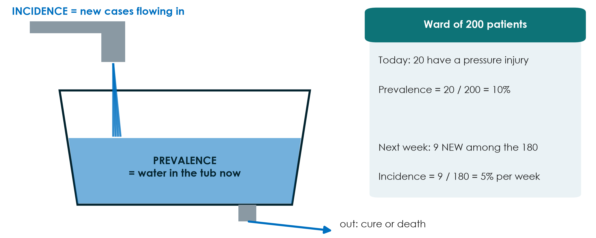{.neu-fig}

::: {.neu-takeaway}
**KEY MESSAGE** Prevalence = how many have it now; incidence = how many new cases over time.
:::

::: {.notes}
Water flowing in from the tap = new cases = incidence. Water in the tub at this moment = existing cases = prevalence. Water leaving through the drain = patients who recover or die.

Worked example on the right: 20 of 200 ward patients have a pressure injury today, prevalence 10%. Of the 180 without one, 9 develop a new injury over the next week, incidence 5% per week. Note the denominator for incidence: only people AT RISK (those without the condition at the start).

Teaching point: a long-lasting condition can have a high prevalence with a low incidence (diabetes); a short one can have a high incidence but low prevalence (common cold, short delirium episodes).

Misconception: using prevalence and incidence interchangeably. Incidence always has a time period attached.

Ask the room: if we get better at keeping patients alive with a chronic disease but no better at preventing it, what happens to prevalence? Expected answer: it rises - the drain slows down.

Timing: 3 minutes.
:::

## Risk in two groups, as pictures

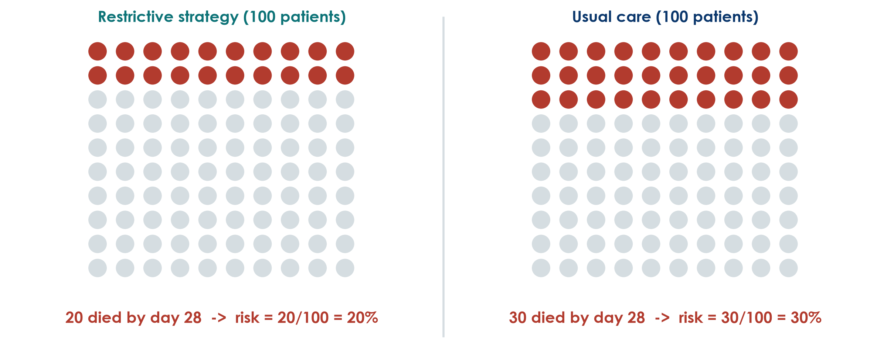{.neu-fig}

::: {.neu-caption}
Hypothetical trial for teaching: 100 patients per group
:::

::: {.neu-takeaway}
**KEY MESSAGE** Risk = people with the outcome / people in the group.
:::

::: {.notes}
A hypothetical, larger trial of our running question - not Boulet's data. 100 patients per arm. Restrictive: 20 die by day 28. Usual care: 30 die.

Risk is the simplest measure: 20/100 = 20% and 30/100 = 30%. Pictures like this (icon arrays) are also the best way to explain risk to patients and families.

Teaching point: always ask 'out of how many?' A headline of '10 more deaths' means nothing without the denominator.

Misconception: risk versus odds. Risk is out of everyone in the group (20 of 100). Odds compare those with the outcome to those without (20 to 80). We need both in a moment.

Ask the room: what are the odds of dying in the restrictive group? Expected answer: 20 to 80, i.e. 0.25.

Timing: 2.5 minutes.
:::

## The 2x2 table: one tool for every measure

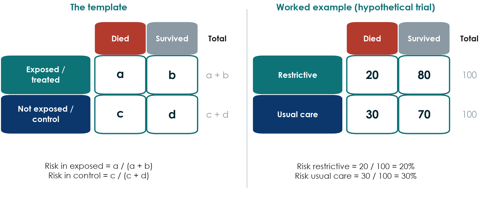{.neu-fig}

::: {.neu-takeaway}
**KEY MESSAGE** Exposure in rows, outcome in columns: a, b, c, d.
:::

::: {.notes}
Insist on one layout and keep it forever: exposure (or treatment) in rows, with exposed on top; outcome in columns, with 'outcome yes' on the left. Then a, b, c, d always mean the same thing.

Worked example: a = 20, b = 80, c = 30, d = 70. Row totals 100 and 100.

Teaching point: almost every measure of association for a yes/no outcome comes from these four numbers. The spreadsheet in the demo uses the same layout.

Misconception: swapping rows and columns. Many errors in student work come from a table drawn the other way round - check the layout before calculating.

Ask the room: in the Boulet table for death by day 28, what are a, b, c and d? Expected answer: a = 6, b = 18, c = 6, d = 18 (6 of 24 died in each arm).

Timing: 2.5 minutes.
:::

## Four measures from one 2x2 table

::: {.neu-intro}
Worked example: restrictive 20/100 died, usual care 30/100 died
:::

:::: {.neu-cards style="--n:4"}
::: {.neu-card .plain style="--c:#0D7377"}
[Risk ratio (RR)]{.neu-card-title}

- \[a/(a+b)\] / \[c/(c+d)\]
- **20% / 30% = 0.67**
- risk is one third lower
:::
::: {.neu-card .plain style="--c:#0B376C"}
[Risk difference]{.neu-card-title}

- a/(a+b) - c/(c+d)
- **20% - 30% = -10 points**
- 10 fewer deaths per 100
:::
::: {.neu-card .plain style="--c:#2E8B57"}
[NNT]{.neu-card-title}

- 1 / \|risk difference\|
- **1 / 0.10 = 10**
- treat 10 to prevent 1 death
:::
::: {.neu-card .plain style="--c:#0070C0"}
[Odds ratio (OR)]{.neu-card-title}

- (a x d) / (b x c)
- **(20x70)/(80x30) = 0.58**
- odds, not risk
:::
::::

::: {.neu-takeaway}
**KEY MESSAGE** Ratios tell you how strong; differences tell you how many patients.
:::

::: {.notes}
Go card by card, always back to the 2x2 table.

RR = 0.20 / 0.30 = 0.67: the risk of death is one third lower with restriction. RR = 1 means no difference; below 1 protective; above 1 harmful.

RD = 0.20 - 0.30 = -0.10: 10 fewer deaths per 100 patients treated. Also called absolute risk reduction (ARR = 10%).

NNT = 1 / 0.10 = 10: treat 10 patients to prevent one death. If the exposure is harmful the same calculation gives the number needed to harm (NNH).

OR = (20 x 70) / (80 x 30) = 1400 / 2400 = 0.58. Further from 1 than the RR - next slides explain why.

Misconception: a relative effect sounds bigger. 'One third lower' and '10 fewer per 100' are the same result; patients and policymakers need the absolute version.

Ask the room: if the baseline risk were 3% instead of 30%, with the same RR of 0.67, what would the NNT be? Expected answer: risk 2% vs 3%, difference 1%, NNT = 100.

Timing: 5 minutes.
:::

## NNT in pictures

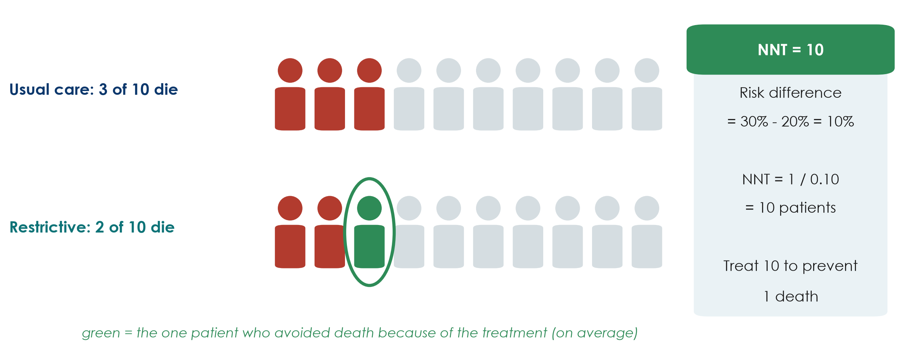{.neu-fig}

::: {.neu-takeaway}
**KEY MESSAGE** NNT = 1 / risk difference: how many to treat for one to benefit.
:::

::: {.notes}
Scale the 100 patients down to 10. Under usual care 3 of 10 die. With the restrictive strategy 2 of 10 die. The one green person is the patient who, on average, avoided death because of the treatment. So we treat 10 patients for one to benefit: NNT = 10.

Teaching point: the other 9 either survived anyway or died anyway - they bore the burden of the treatment without benefit. That is why NNT is a powerful conversation tool with patients, managers and pharmacy.

Misconception: 'NNT of 10 means 1 in 10 patients respond'. It is an average across the group, not a prediction for one patient.

Ask the room: which is better, an NNT of 5 or of 50? Expected answer: 5 - fewer patients need treating for one to benefit (but always weigh against harms and cost).

Timing: 2.5 minutes.
:::

## When is the odds ratio close to the risk ratio?

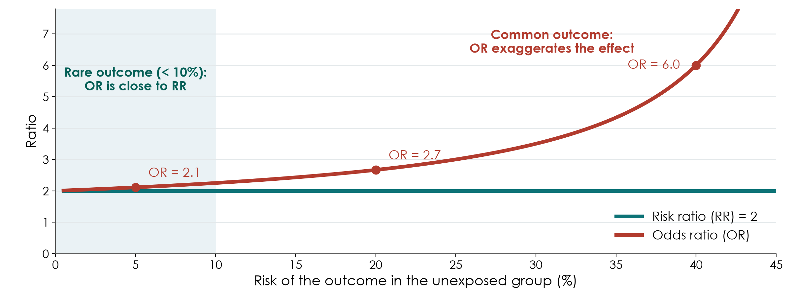{.neu-fig}

::: {.neu-takeaway}
**KEY MESSAGE** OR is close to RR only when the outcome is rare (under about 10%).
:::

::: {.notes}
Here the exposure truly doubles the risk (RR = 2, green line). The red line is the OR for the same data as the outcome becomes more common.

When the outcome is rare (left, shaded), OR is about 2.1 - practically the same as RR. At a baseline risk of 20%, OR = 2.7. At 40%, OR = 6. The OR always lies further from 1 than the RR.

Teaching point: case-control studies and logistic regression give ORs. When a paper reports an OR for a common outcome, such as ICU mortality of 20-40%, do not read it as 'X times the risk'.

Misconception: 'OR 2 means twice the risk'. Only for rare outcomes.

Ask the room: in our worked example (deaths of 20% and 30%), OR was 0.58 and RR 0.67. Why do they differ? Expected answer: death is common in this population, so the OR exaggerates the effect.

Timing: 2.5 minutes.
:::

## Check your understanding: one more 2x2

::: {.neu-banner style="--c:#6C3483"}
QUICK QUIZ · 3 min
:::

:::: {.columns}
::: {.column width="60%"}
::: {.neu-activity-steps style="--c:#6C3483"}
1. 200 patients per group: 20 die with the new treatment, 30 with usual care
2. Risk in each group?
3. RR? Risk difference? NNT?
4. Bonus: OR = (a x d) / (b x c)?
:::
:::
::: {.column width="40%"}
::: {.neu-side .plain style="--c:#6C3483"}
Table

- a = 20, b = 180
- c = 30, d = 170
:::
:::
::::

::: {.neu-output style="--c:#6C3483"}
**OUTPUT** Risks, RR, RD and NNT - answers in the notes
:::

::: {.notes}
1.5 minutes alone, then reveal. Draw the 2x2 table on the whiteboard as people work.

Answers. Risks: 20/200 = 10% and 30/200 = 15%. RR = 0.10 / 0.15 = 0.67. RD = 10% - 15% = -5 percentage points. NNT = 1 / 0.05 = 20. Bonus OR = (20 x 170) / (180 x 30) = 3400 / 5400 = 0.63.

Teaching point: the same RR (0.67) as the worked example, but the baseline risk is lower (15% instead of 30%), so the NNT doubles from 10 to 20.

Timing: 3 minutes.
:::

## Live demo: the 2x2 calculator

::: {.neu-banner style="--c:#B5651D"}
LIVE DEMO · 8 min
:::

:::: {.columns}
::: {.column width="60%"}
::: {.neu-activity-steps style="--c:#B5651D"}
1. Open 2x2\_calculator.xlsx - sheet Association
2. Enter a, b, c, d from the worked example: 20, 80, 30, 70
3. Read risks, RR, RD, NNT and OR - and the plain-language lines
4. Change the deaths to 2 and 3 of 100: watch OR approach RR
5. Point at the red line: case-control data give an OR only
:::
:::
::: {.column width="40%"}
::: {.neu-side .plain style="--c:#B5651D"}
Watch for

- Same layout as the slide
- Relative vs absolute effect
- Rare outcome: OR close to RR
:::
:::
::::

::: {.neu-output style="--c:#B5651D"}
**OUTPUT** Everyone has seen every measure computed from one table
:::

::: {.notes}
Script: Course/Demos/s4\_demo.md. File: Course/Resources/tools/2x2\_calculator.xlsx (pre-filled with the worked example).

Teaching point: the spreadsheet does the arithmetic; the human does the interpretation. Read the plain-language cells aloud.

Key moment: change a to 2 and c to 3 (b = 98, d = 97). RR stays 0.67 but OR is now 0.66 - almost identical. The NNT jumps to 100. Same relative effect, very different absolute effect.

Fallback if the laptop fails: draw the 2x2 table on the whiteboard and calculate RR and NNT by hand with the room - the numbers are chosen to be easy.

Misconception to raise: the calculator will happily give a 'risk' for case-control data. It is meaningless there - only the OR is valid.

Timing: 8 minutes. The Diagnostic sheet is shown briefly in 4.3. Then the break.
:::

## Break

::: {.neu-banner style="--c:#8A99A3"}
BREAK · 15 min
:::

::: {.neu-activity-steps style="--c:#8A99A3"}
1. Stretch, coffee, fresh air
2. After the break: two 2x2 calculations - have a pen ready
3. Then 4.3: beyond single studies
:::

::: {.notes}
15-minute break. Put a visible countdown on the screen.

During the break, walk past the groups and check that each has its Part 2a from yesterday - they will need it in the proposal builder.

Restart on time.
:::

## Your turn: two 2x2 calculations

::: {.neu-banner style="--c:#0B376C"}
INDIVIDUAL TASK · 20 min
:::

:::: {.columns}
::: {.column width="60%"}
::: {.neu-activity-steps style="--c:#0B376C"}
1. Handout Part C: draw each 2x2 table first, exposure in rows
2. Calculation 1 (trial): risks, RR, RD, NNT, OR - and one sentence
3. Calculation 2 (case-control): OR only - and say why not RR
4. Check with your neighbour, then with the calculator
:::
:::
::: {.column width="40%"}
::: {.neu-side .plain style="--c:#0B376C"}
Remember

- Risk = a / (a + b)
- RR = risk / risk
- NNT = 1 / risk difference
- OR = (a x d) / (b x c)
:::
:::
::::

::: {.neu-output style="--c:#0B376C"}
**OUTPUT** Two completed 2x2 tables with interpreted results
:::

::: {.notes}
Calculation 1 (new pressure-relieving mattress trial): 10/200 vs 20/200 pressure injuries. Risks 5% and 10%; RR = 0.50; RD = -5 percentage points; NNT = 20; OR = (10 x 180) / (190 x 20) = 0.47 (close to RR because the outcome is uncommon).

Calculation 2 (case-control, ICU candidaemia and parenteral nutrition): cases 24 exposed / 16 not; controls 16 exposed / 64 not. OR = (24 x 64) / (16 x 16) = 6.0. RR cannot be calculated because the investigators chose the number of cases and controls.

Circulate and check the tables are drawn the right way round - most mistakes are layout, not arithmetic.

Timing: 12 minutes working (check with a neighbour after each calculation), 8 minutes to reveal and discuss the answers with the calculator. Full key in Solutions/s4\_solutions.md.
:::

## 4.3  Beyond single studies

:::: {.neu-statement}
::: {.neu-big}
One study is rarely the answer.
:::

::: {.neu-sub}
Diagnostic tests, systematic reviews and meta-analysis, and how to appraise them. (30 minutes)
:::
::::

::: {.notes}
Section marker for 4.3 (30 minutes, including a 6-minute pair task).

Three blocks: diagnostic accuracy (sensitivity, specificity, predictive values, ROC curve), systematic reviews and meta-analysis (PRISMA flow, forest plots, heterogeneity), and risk-of-bias tools (which tool for which design).

Teaching point: everything here is about judging evidence - the skills participants will use in Session 8 in 'Be the reviewer'.

Timing: 30 seconds. Keep a brisk pace: about 1.5-2 minutes per slide.
:::

## Diagnostic accuracy: sensitivity and specificity revisited

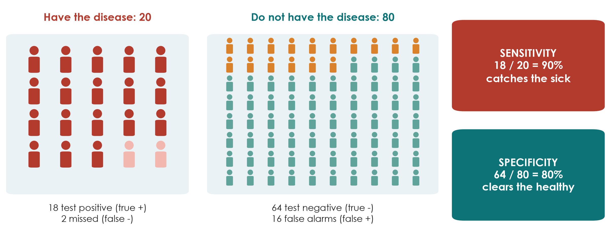{.neu-fig}

::: {.neu-takeaway}
**KEY MESSAGE** Sensitivity catches the sick; specificity clears the healthy.
:::

::: {.notes}
Back to the 2x2 table, now for a test. 100 patients, 20 truly have the disease.

Sensitivity: of the 20 who HAVE the disease, the test finds 18 = 90%. A highly sensitive test rarely misses disease, so a NEGATIVE result helps rule it out.

Specificity: of the 80 who do NOT have it, 64 test negative = 80%. A highly specific test rarely raises false alarms, so a POSITIVE result helps rule it in.

Preview of the next slide: of the 34 positive tests, only 18 truly have the disease - a positive predictive value of 53%. PPV depends on how common the disease is.

Misconception: 'a 90% sensitive test means a positive patient has a 90% chance of disease'. No - that is PPV, which here is only 53%.

Ask the room: for a screening test you do not want to miss sepsis - sensitivity or specificity first? Expected answer: sensitivity.

Timing: 2.5 minutes.
:::

## Same test, different setting: PPV depends on prevalence

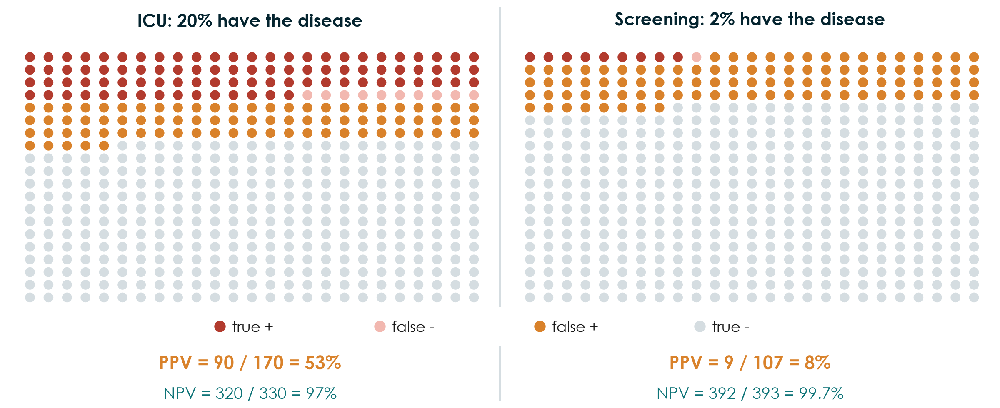{.neu-fig}

::: {.neu-takeaway}
**KEY MESSAGE** A positive result means much less when the disease is rare.
:::

::: {.notes}
The same test (sensitivity 90%, specificity 80%) used on 500 people in two settings.

ICU, where 20% have the disease: 90 true positives, 80 false positives - a positive result is right 90 / 170 = 53% of the time.

Screening, where 2% have it: 9 true positives but 98 false positives - PPV 9 / 107 = 8%. More than 9 in 10 positives are false alarms. Meanwhile the NPV rises to 99.7%.

Teaching point: sensitivity and specificity belong to the test; PPV and NPV belong to the test IN A POPULATION. Never borrow a PPV from a study done in a different setting.

Misconception: 'a good test is good everywhere'. Screening healthy populations with a moderately specific test creates many false positives - and many unnecessary investigations.

Ask the room: why do screening programmes use a second, more specific test before acting? Expected answer: to remove the false positives created by low prevalence.

Optional (1 minute): show the 'PPV at another prevalence' box on the Diagnostic sheet of the 2x2 calculator - type 2% and 20%.

Timing: 3 minutes.
:::

## The ROC curve and the AUC

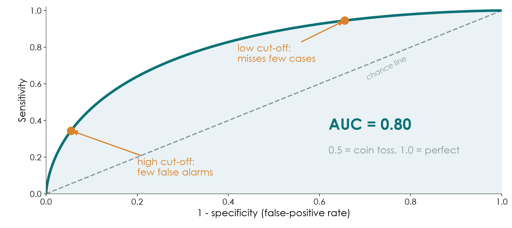{.neu-fig}

::: {.neu-takeaway}
**KEY MESSAGE** Each cut-off trades sensitivity for specificity; AUC sums up the whole curve.
:::

::: {.notes}
Many tests give a number (lactate, procalcitonin, a risk score). Every cut-off gives one pair of sensitivity and specificity. The ROC curve plots all of them: sensitivity up, false-positive rate (1 - specificity) across.

A low cut-off catches almost every case but raises many false alarms (top right). A high cut-off gives few false alarms but misses cases (bottom left). The best cut-off depends on the cost of missing a case versus the cost of a false alarm.

The area under the curve (AUC, also called the c-statistic) summarises discrimination: 0.5 = coin toss (the dashed line), 1.0 = perfect. This simulated test has AUC 0.80.

Misconception: 'AUC tells you which cut-off to use'. It does not; it describes the whole curve. The same AUC appears again in Session 6 for prediction models.

Ask the room: for ruling out sepsis at triage, would you choose a low or high cut-off? Expected answer: low - high sensitivity, accepting more false alarms.

Timing: 3 minutes.
:::

## The PRISMA flow: from 1,300 records to 9 studies

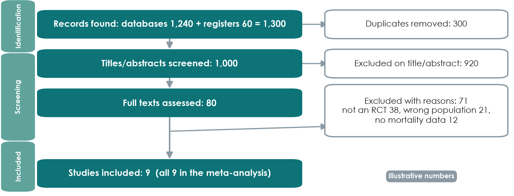{.neu-fig}

::: {.neu-takeaway}
**KEY MESSAGE** A PRISMA flow shows how studies were found, screened and excluded - with reasons.
:::

::: {.notes}
Illustrative numbers. Every systematic review should show this diagram (PRISMA 2020).

Identification: 1,240 database records plus 60 from trial registers = 1,300; 300 duplicates removed.

Screening: 1,000 titles and abstracts screened, 920 excluded; 80 full texts read, 71 excluded with reasons (38 not RCTs, 21 wrong population, 12 no mortality data - which add up to 71).

Included: 9 studies, all in the meta-analysis.

Teaching point: two reviewers screen independently, and the protocol is registered beforehand (PROSPERO). The diagram lets a reader judge whether relevant studies were lost.

Misconception: 'more included studies = a better review'. Strict, explicit inclusion criteria matter more than numbers.

Ask the room: why search trial registers and not only PubMed? Expected answer: to find unpublished or negative trials - publication bias (Session 2, grey literature).

Timing: 2.5 minutes.
:::

## Reading a forest plot in four steps

{.neu-fig}

::: {.neu-takeaway}
**KEY MESSAGE** Squares = studies, lines = CIs, diamond = pooled result, vertical line = no effect.
:::

::: {.notes}
Hypothetical trials, fixed-effect (inverse-variance) pooling. Read it in four steps. (1) Find the vertical line of no effect: RR = 1. Left of it favours restrictive fluids; right favours usual care. (2) Each square is one study's RR; its size shows its weight (Trial 4 is largest, 38%). (3) Each horizontal line is that study's 95% CI - if it crosses 1, that study alone is inconclusive. Here every single trial crosses 1. (4) The diamond is the pooled estimate: RR 0.79 (95% CI 0.64-0.98). Its width is the CI; it does not cross 1.

Teaching point: pooling several inconclusive trials can give a precise answer - that is the power of meta-analysis. In words: about 21% lower relative risk of death, though the upper limit (0.98) is close to no effect.

Misconception: 'a trial whose CI crosses 1 shows no effect'. It shows uncertainty, not absence of an effect.

Ask the room: which trial contributes most, and why? Expected answer: Trial 4 - the largest, with the most events, so the narrowest CI.

Timing: 3.5 minutes. The handout uses this plot for the pair task.
:::

## Heterogeneity: do the studies agree?

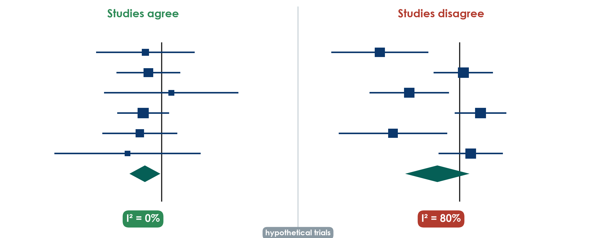{.neu-fig}

::: {.neu-takeaway}
**KEY MESSAGE** High I-squared means the studies disagree: find out why before trusting the diamond.
:::

::: {.notes}
Left: the six trials from the previous slide point the same way; their CIs overlap; I-squared = 0%. Pooling is sensible.

Right: six other hypothetical trials disagree - some clearly favour restriction, others point the other way. I-squared = 80%: about 80% of the variation between studies reflects real differences rather than chance. The random-effects diamond is wide and crosses 1 (RR 0.74, 95% CI 0.47-1.15).

Rough guide (Cochrane): I-squared around 0-40% might not be important, 30-60% moderate, 50-90% substantial, 75-100% considerable. The ranges overlap on purpose: judge it with the plot.

Teaching point: with high heterogeneity the most useful question is WHY - different patients, doses, timing, outcome definitions or risk of bias? A single pooled number may hide this.

Misconception: 'a random-effects model fixes heterogeneity'. It only widens the CI; it does not explain anything.

Ask the room: give one reason fluid-restriction trials might disagree. Expected answer: different populations (sepsis vs surgery), different restriction protocols, different timing.

Timing: 3 minutes.
:::

## Which risk-of-bias tool for which design?

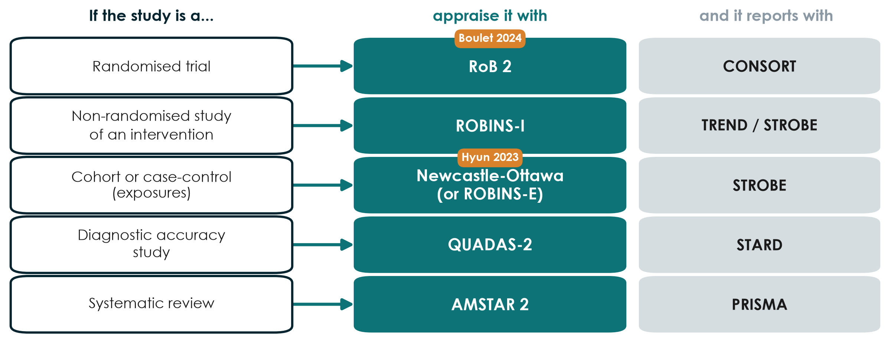{.neu-fig}

::: {.neu-takeaway}
**KEY MESSAGE** Match the appraisal tool to the design - and the reporting guideline too.
:::

::: {.notes}
Risk-of-bias tools are structured ways to ask 'could the design or conduct have distorted this result?'. Each design has its own tool.

Randomised trials: RoB 2 (Cochrane) - Boulet. Non-randomised studies of interventions (before-after, cohorts comparing treatments): ROBINS-I. Cohort and case-control studies of exposures: the Newcastle-Ottawa Scale is still widely used; ROBINS-E is its newer, more rigorous alternative - Hyun. Diagnostic accuracy studies: QUADAS-2. Systematic reviews themselves: AMSTAR 2.

The right-hand column links back: each design also has a reporting guideline (CONSORT, TREND/STROBE, STROBE, STARD, PRISMA) - covered in Session 8.

Teaching point: reporting guidelines check what was REPORTED; risk-of-bias tools judge how TRUSTWORTHY the result is. A well-reported study can still be at high risk of bias.

Misconception: 'add up the stars and you get quality'. Scores hide which domain failed; judgements by domain are more useful.

Ask the room: you are appraising a before-after QI study of a sepsis bundle. Which tool? Expected answer: ROBINS-I.

Timing: 2.5 minutes.
:::

## The last question: are the conclusions supported by the data?

::: {.neu-intro}
Questions 7-9 of our 10-question appraisal checklist (Session 8)
:::

:::: {.neu-cards style="--n:3"}
::: {.neu-card .plain style="--c:#0D7377"}
[Words match the design]{.neu-card-title}

- 'Caused' needs randomisation
- Observational: 'associated with'
- Pilot: feasibility, not effect
:::
::: {.neu-card .plain style="--c:#0B376C"}
[Numbers match the words]{.neu-card-title}

- Effect size with 95% CI
- Relative AND absolute
- No 'trend' for p = 0.42
:::
::: {.neu-card .plain style="--c:#B23B2E"}
[Honest limits, no spin]{.neu-card-title}

- Primary outcome reported first
- Main limitations stated
- Conclusion = the primary result
:::
::::

::: {.neu-takeaway}
**KEY MESSAGE** Read the conclusion last - and check it against the design and the numbers.
:::

::: {.notes}
This closes the appraisal block and links to the 10-question checklist used in Session 8 ('Be the reviewer').

Words vs design: Boulet's conclusion ('did not reduce the overall fluid balance at day 5') matches its pilot RCT design. Hyun's abstract says 'associated', but its title says 'Impact' - a stronger word than a cohort supports.

Numbers vs words: is the main result given as an effect size with a 95% CI? Is a non-significant result (p = 0.42) described honestly, without 'a trend towards'?

Spin: is the primary outcome reported first and the conclusion based on it, rather than on a favourable secondary outcome or subgroup?

Ask the room: find one word in a title or abstract that overclaims. Expected answer: 'impact', 'effect', 'reduces' or 'prevents' in an observational study.

Timing: 2.5 minutes.
:::

## Pair task: read the forest plot, pick the tool

::: {.neu-banner style="--c:#1F5C7A"}
DISCUSSION · 6 min
:::

:::: {.columns}
::: {.column width="60%"}
::: {.neu-activity-steps style="--c:#1F5C7A"}
1. Handout Part E: the forest plot of six fluid trials
2. Which trial carries the most weight? Does any single trial show a clear effect?
3. Does the diamond cross RR = 1? Say the result in one sentence
4. Pick the risk-of-bias tool for Boulet, for Hyun and for a review of fluid trials
:::
:::
::: {.column width="40%"}
::: {.neu-side .plain style="--c:#1F5C7A"}
Reminder

- Square = one study
- Line = 95% CI
- Diamond = pooled result
- RoB 2, ROBINS-I, NOS, QUADAS-2, AMSTAR 2
:::
:::
::::

::: {.neu-output style="--c:#1F5C7A"}
**OUTPUT** One sentence on the pooled result + three tools named
:::

::: {.notes}
4 minutes in pairs, 2 minutes to collect answers.

Answers: Trial 4 has the most weight (38%). No single trial excludes RR = 1 - all CIs cross it. The diamond (RR 0.79, 95% CI 0.64-0.98) does not cross 1: pooled, restriction was associated with about 21% lower relative risk of death in these (hypothetical) trials, with the upper limit close to no effect. Tools: Boulet - RoB 2; Hyun - Newcastle-Ottawa (or ROBINS-E); a review - AMSTAR 2.

If time is short, do questions 3 and 4 only.

Common error: reading the diamond's centre without its width - always say the CI.

Timing: 6 minutes, then move to the proposal builder.
:::

## Outcomes: one primary, defined by what, how and when

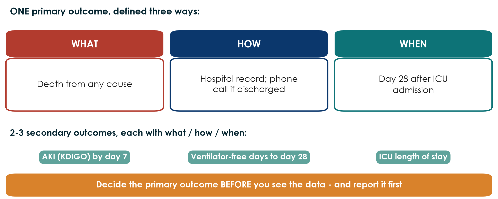{.neu-fig}

::: {.neu-takeaway}
**KEY MESSAGE** A primary outcome is not a word; it is a measurement with a method and a time point.
:::

::: {.notes}
This slide prepares the second half of Proposal Part 2.

The primary outcome is the ONE result the study is designed and sized for. Define it three ways: WHAT (death from any cause - not 'mortality improved'), HOW (hospital record; a phone call if discharged), WHEN (day 28 after ICU admission). Secondary outcomes get the same three parts.

Boulet's primary outcome: cumulative fluid balance (ml/kg) at day 5 - clear what, how and when. Hyun's: mortality at day 28.

Misconception: 'more primary outcomes = more chances of a result'. That is exactly the problem - multiple primaries invite cherry-picking (spin, Session 2).

Ask the room: rewrite 'improve patient outcomes' as a primary outcome. Expected: e.g. 'new pressure injury (stage 2+) by day 14 of admission, from the skin-check chart'.

Timing: 2 minutes.
:::

## Proposal builder 4: exposure, outcomes and biases

::: {.neu-banner style="--c:#055F56"}
PROPOSAL BUILDER · 30 min
:::

:::: {.columns}
::: {.column width="60%"}
::: {.neu-activity-steps style="--c:#055F56"}
1. Exposure or intervention: exactly what, how much, when
2. Comparator: who or what you compare against
3. ONE primary outcome: what, how, when
4. 2-3 secondary outcomes, each with what, how, when
5. Two main biases and the design step that reduces each
6. Write one sentence: will you claim 'caused' or 'associated'?
:::
:::
::: {.column width="40%"}
::: {.neu-side .plain style="--c:#055F56"}
Facilitator check

- Comparator stated?
- Only ONE primary outcome?
- Outcome has a time point?
- Confounding by indication?
- Bias -\> concrete mitigation?
:::
:::
::::

::: {.neu-output style="--c:#055F56"}
**OUTPUT** Proposal Part 2 complete (2a from Session 3 + 2b today)
:::

::: {.notes}
Worksheet: Practicals/s4\_exercises.md, Part F, and the proposal template (Part 2). 30 minutes.

Suggested rhythm (the outcomes slide before this takes 2 minutes): 4 minutes to define exposure and comparator together; 14 minutes writing (split: outcomes, biases, the claim sentence); 10 minutes for the facilitator check and one group reading its biases and mitigations aloud.

Model answer for the running example (observational version): exposure - positive cumulative fluid balance (ml/kg) at 72 h after ICU admission; comparator - zero or negative balance; primary outcome - death from any cause by day 28 (hospital record); secondary - AKI (KDIGO) by day 7, ventilator-free days to day 28, ICU length of stay; biases - confounding by severity (record SOFA, lactate, vasopressor dose and adjust or match), selection (consecutive patients, report exclusions), information (pre-defined fluid definitions, double-check 10% of charts); claim - 'associated with'.

Common problems: no comparator; three primary outcomes; a bias named without a concrete mitigation ('we will be careful' is not a mitigation).

Timing: give a 10-minute and a 2-minute warning.
:::

## Session 4 in one slide

:::: {.neu-cards style="--n:4"}
::: {.neu-card .plain style="--c:#B23B2E"}
[4.1 Trust]{.neu-card-title}

- Bias: size does not fix it
- Confounding: remove it
- Effect modification: report it
:::
::: {.neu-card .plain style="--c:#0D7377"}
[4.2 Size]{.neu-card-title}

- Relative: RR, OR
- Absolute: RD, NNT
- OR = RR only if rare
:::
::: {.neu-card .plain style="--c:#0B376C"}
[4.3 Many studies]{.neu-card-title}

- PPV depends on prevalence
- Forest plot: read the diamond
- Right tool for the design
:::
::: {.neu-card .plain style="--c:#055F56"}
[Your proposal]{.neu-card-title}

- Part 2 complete
- Caused or associated?
:::
::::

::: {.neu-takeaway}
**KEY MESSAGE** Trust first, then size - and check that the words match the design.
:::

::: {.notes}
Session recap. Ask four people to explain one card each.

This also closes Weekend 2: the proposal now has its question (Part 1) and its design (Part 2).

Timing: 2 minutes (part of the 5-minute wrap-up).
:::

## Wrap-up and homework

::: {.neu-banner style="--c:#1F5C7A"}
DISCUSSION · 5 min
:::

::: {.neu-activity-steps style="--c:#1F5C7A"}
1. Exit question: ICU patients who received more fluid died more often. Give one reason other than the fluid
2. Homework: finish Proposal Part 2 (exposure, comparator, outcomes, biases)
3. Optional: handout Parts B and D (effect modification, PPV in two settings)
4. Next weekend (Sessions 5-6): data - the FLUID-ICU course dataset
:::

::: {.neu-output style="--c:#1F5C7A"}
**OUTPUT** Exit answer on a sticky note
:::

::: {.notes}
Exit question answers: confounding by indication (sicker patients receive more fluid and die more), or reverse causation (failing kidneys make less urine, so the balance becomes positive).

Preview: in Weekend 3 we turn the design into data - variables, data collection forms - and the course dataset FLUID-ICU, a simulated cohort that answers the observational version of our fluid question.

Timing: 3 minutes after the recap slide. Finish on time.
:::

## Extra slides - Session 4

:::: {.neu-statement}
::: {.neu-big}
Extra slides - Session 4
:::

::: {.neu-sub}
Use if time allows, or for self-study
:::
::::

::: {.notes}
EXTRA: the slides after this point are optional. Use them if the room is quick, for questions, or for self-study.

Timing: skip in the live session unless time allows.
:::

## Likelihood ratios and reporting diagnostic studies

::: {.neu-intro}
Same test: sensitivity 90%, specificity 80%
:::

:::: {.neu-cards style="--n:3"}
::: {.neu-card .plain style="--c:#B23B2E"}
[LR+ (positive test)]{.neu-card-title}

- sensitivity / (1 - specificity)
- **0.90 / 0.20 = 4.5**
- a positive result is 4.5 times as likely in the sick
:::
::: {.neu-card .plain style="--c:#0D7377"}
[LR- (negative test)]{.neu-card-title}

- (1 - sensitivity) / specificity
- **0.10 / 0.80 = 0.13**
- LR above 10 or below 0.1 changes decisions most
:::
::: {.neu-card .plain style="--c:#0B376C"}
[Report and appraise]{.neu-card-title}

- STARD: 30-item checklist + flow diagram
- QUADAS-2: risk of bias
- Test it on the patients who will use it
:::
::::

::: {.neu-takeaway}
**KEY MESSAGE** Likelihood ratios do not change with prevalence; predictive values do.
:::

::: {.notes}
EXTRA: Concept only. Likelihood ratios combine sensitivity and specificity into one number that tells you how much a result should change your suspicion.

LR+ = 0.90 / 0.20 = 4.5: a positive result is 4.5 times as likely in someone with the disease as in someone without. LR- = 0.10 / 0.80 = 0.13: a negative result is about 8 times less likely in the sick. Rough rule: LR+ above 10 or LR- below 0.1 changes decisions a lot; values near 1 change little.

Unlike PPV, likelihood ratios do not depend on prevalence, so they travel between settings better.

Reporting: STARD (30 items and a participant flow diagram). Appraisal: QUADAS-2. Watch for spectrum bias - a test evaluated in very sick patients versus healthy volunteers looks better than it will in real, mixed patients.

Misconception: 'diagnostic accuracy studies are just a 2x2 table'. The design questions (who was tested, was the reference standard applied to everyone, was it read blind) matter as much as the numbers.

Timing: 1.5 minutes. The Advanced Modules offer diagnostic-accuracy analysis hands-on.
:::

## The RoB 2 traffic-light plot

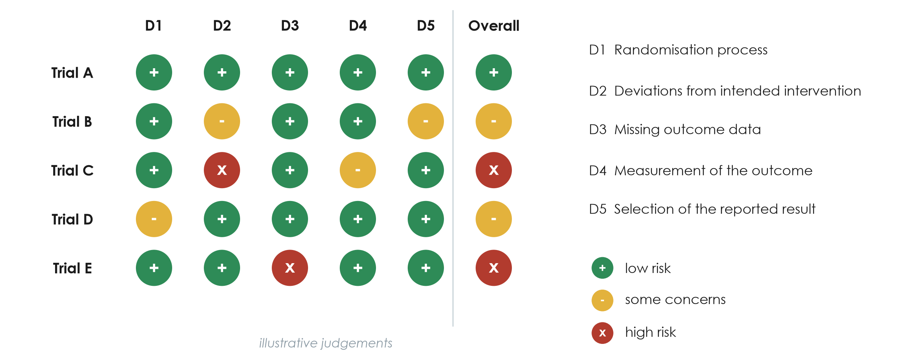{.neu-fig}

::: {.neu-takeaway}
**KEY MESSAGE** Judge each domain; the overall risk is set by the worst domain.
:::

::: {.notes}
EXTRA: Illustrative judgements. RoB 2 asks signalling questions in five domains: D1 randomisation process (sequence and concealment), D2 deviations from intended interventions (blinding, adherence), D3 missing outcome data, D4 measurement of the outcome, D5 selection of the reported result.

Each domain is judged low risk (green +), some concerns (yellow -) or high risk (red x). The overall judgement is driven by the worst domain - Trial C is high risk because of D2.

Reviews show this plot so readers can see which trials drive the pooled result and whether excluding high-risk trials changes it (a sensitivity analysis).

Apply to Boulet (discuss, do not score formally): D1 likely low (central computer); D2 some concerns, as clinicians knew the group; D4 low for an objective outcome such as fluid balance.

Misconception: 'unblinded = high risk'. Not if the outcome is objective and the deviations are small; it depends on the domain questions.

Timing: 1.5 minutes. Session 8 uses our simplified 10-question checklist; the Advanced Modules practise the full tools.
:::

## Worked example: prevalence or incidence?

:::: {.neu-steps}
::: {.neu-step style="--c:#0D7377"}
[1]{.neu-step-num}[1. Today]{.neu-step-label}

- 200 ward patients; 20 have a pressure injury
- Prevalence 10%
:::
::: {.neu-step style="--c:#0B376C"}
[2]{.neu-step-num}[2. At risk]{.neu-step-label}

- 180 patients without an injury
:::
::: {.neu-step style="--c:#5FA39B"}
[3]{.neu-step-num}[3. One week]{.neu-step-label}

- 9 develop a new injury
:::
::: {.neu-step style="--c:#0070C0"}
[4]{.neu-step-num}[4. Incidence]{.neu-step-label}

- 9 / 180 = 5% per week
- (denominator = at risk)
:::
::::

::: {.neu-takeaway}
**KEY MESSAGE** Incidence always has a time period and only counts people at risk.
:::

::: {.notes}
EXTRA: the bathtub numbers again, as steps, for participants who found the picture too fast.

The key difference is the denominator: prevalence uses everyone today (200); incidence uses only those who could become new cases (180) and needs a time period.

Timing: 1.5 minutes if used.
:::
