# Session 5 · Data: collect it well, describe it honestly

## Week 5 · Saturday

- Recap quiz on Sessions 3-4 (10 min)
- 5.1 Good data by design: variables, CRF, data dictionary, checks, data management
- 5.2 Meet the course dataset FLUID-ICU (live R cleaning demo)
- 5.3 Describing and showing data: summaries, figures, tables
- 5.4 Describe the course dataset: Table 1 and figures
- Proposal builder 5: variables, mini-CRF, data dictionary, data management

::: {.notes}
Welcome to Week 5. Sessions 1-4 asked a question, found the evidence and chose a design. Over these two Saturdays we MEASURE and ANALYSE: today (Session 5) the data, next Saturday (Session 6) the analysis.

Key promise: no formulas. Every idea comes as a picture, then a worked example, then a one-minute check. Your job is to interpret, not to calculate.

New in Weeks 5-6: the course dataset FLUID-ICU, a realistic (simulated) cohort of about 600 adults with sepsis. You will see it cleaned and described live in R, and each group gets one research question and a results pack that becomes its manuscript in Weeks 7-8.

Running example: fluids in septic shock. The variable 'cumulative fluid balance (ml/kg)' follows us all day: on the form, in the data dictionary, in the cleaned dataset, in Table 1.

Ask the room: who has ever filled in a data collection form and thought 'what does this box actually want?' Expected: many hands. That is section 5.1.

Timing: recap 0:00, 5.1 at 0:10, 5.2 at 0:45, break at 1:10, 5.3 at 1:25, 5.4 at 2:00, proposal builder at 2:25, wrap-up at 2:55.

Pace: slow. If the room needs time, skip the extra slides at the end; never skip the checks.
:::

## Recap quiz: Sessions 3-4 in three questions

::: {.neu-banner style="--c:#6C3483"}
QUICK QUIZ · 10 min
:::

:::: {.columns}
::: {.column width="60%"}
::: {.neu-activity-steps style="--c:#6C3483"}
1. Q1. Patients who smoke are followed for 10 years to see who develops a stroke. Which design?
2. Q2. In a cohort, sicker septic patients receive more fluid AND die more often. What is this called?
3. Q3. Mortality is 30% with usual care and 20% with a new strategy. What are the RR and the NNT?
4. Answer alone (2 min), then compare with your neighbour (2 min)
:::
:::
::: {.column width="40%"}
::: {.neu-side .plain style="--c:#6C3483"}
Answers (reveal after)

- Q1: prospective cohort
- Q2: confounding by indication
- Q3: RR = 20/30 = 0.67; RD = 10%; NNT = 1/0.10 = 10
:::
:::
::::

::: {.neu-output style="--c:#6C3483"}
**OUTPUT** Everyone back on track with designs, confounding and the 2x2 measures
:::

::: {.notes}
Purpose: wake up Session 4 memory and catch anyone who missed it. Keep it light: no marks.

Run it: read each question aloud, 2 minutes alone, 2 minutes with a neighbour, then reveal. Hide the side panel until the reveal if you can (or cover it and read answers from these notes).

Q1 answer: prospective cohort. Exposure (smoking) is measured first, then we wait for the outcome. Common wrong answer: case-control. Point out that case-control starts from the outcome and looks back.

Q2 answer: confounding by indication. Severity causes both more fluid and more death. This is exactly why Paper 2 used propensity-score matching, and why Session 6 (6.3 and 6.4) is about 'adjusted' results.

Q3 answer: RR = 0.20 / 0.30 = 0.67 (a one-third relative reduction); risk difference = 10 percentage points; NNT = 1 / 0.10 = 10 patients treated to prevent one death.

If more than a third of the room gets Q3 wrong, spend 2 extra minutes on the 2x2 table on the flip chart before moving on.

Timing: 10 minutes including the reveal.
:::

## 5.1 Good data by design

:::: {.neu-statement}
::: {.neu-big}
Bad data cannot be rescued by good statistics.
:::

::: {.neu-sub}
5.1 Good data by design  \|  35 minutes
:::
::::

::: {.notes}
Section 5.1 opener (35 minutes: variable types with a check, CRF design with a worked example, data dictionary, validation, data management, missing data, then a 7-minute pair task).

Key message: most problems in clinical research lie in the data rather than in the analysis. A statistician cannot fix a blank box, a missing unit or an impossible value six months later.

Garbage in, garbage out: the quality of your answer is capped by the quality of your form.

Ask the room: has anyone been asked to 'help with the data' after a study finished, and found half the forms incomplete? Let one or two people tell their story in one sentence.

Transition: we start with the most basic decision of all: what TYPE of variable are you collecting? It decides how you write the CRF item, how you summarise it and which test you use.
:::

## What type of variable is it?

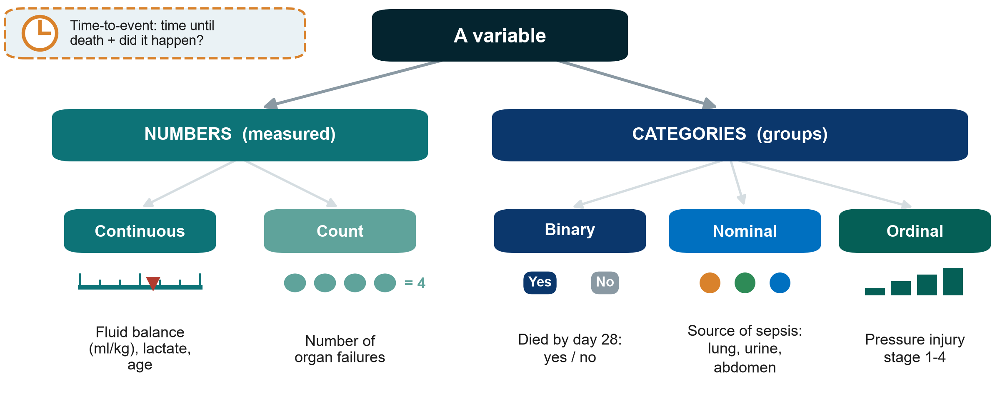{.neu-fig}

::: {.neu-takeaway}
**KEY MESSAGE** The variable type decides the CRF box, the summary and the test.
:::

::: {.notes}
Teaching point: every variable is either a NUMBER you measure or a CATEGORY you assign. Then split once more.

Numbers: continuous (any value on a scale: fluid balance in ml/kg, lactate, age) or counts (whole numbers: number of organ failures).

Categories: binary (two options: died yes/no), nominal (several groups with no order: source of sepsis) and ordinal (ordered groups: pressure-injury stage 1 to 4, pain mild/moderate/severe).

Time-to-event (top left) is special: it combines HOW LONG (time to death) and WHETHER it happened (died or censored at day 28). Just mention it; we meet it again with Cox models in 6.3.

Common misconception: 'coded as numbers means numerical'. Sex coded 1/2 is still a category; the average of 1.4 means nothing.

Quick sorting game: call out variables and let the room shout the type: Glasgow Coma Scale (ordinal, though often treated as a number), heart rate (continuous), ventilated yes/no (binary), blood group (nominal), days on ventilator (count), time to extubation (time-to-event).

Tip: collect continuous variables as numbers whenever possible. You can always group age into bands later, but you can never get the exact age back from '60-69'.
:::

## Check your understanding: what type of variable?

::: {.neu-banner style="--c:#6C3483"}
QUICK QUIZ · 3 min
:::

:::: {.columns}
::: {.column width="60%"}
::: {.neu-activity-steps style="--c:#6C3483"}
1. Heart rate (beats per minute)
2. Glasgow Coma Scale (3-15)
3. Blood group (A, B, AB, O)
4. Ventilated on day 1 (yes / no)
5. Time from ICU admission to extubation
:::
:::
::: {.column width="40%"}
::: {.neu-side .plain style="--c:#6C3483"}
Answers

- Continuous
- Ordinal (often analysed as a number)
- Nominal
- Binary
- Time-to-event (some never extubated)
:::
:::
::::

::: {.neu-output style="--c:#6C3483"}
**OUTPUT** Everyone can name the five variable types
:::

::: {.notes}
Check your understanding (3 minutes). Read each variable; the room shows fingers: 1 continuous, 2 count, 3 binary, 4 nominal, 5 ordinal, or says 'time-to-event'. Reveal the side panel only after each vote.

Heart rate: continuous.

GCS: ordinal; ordered scores with unequal steps, often analysed like a number, which is acceptable if stated.

Blood group: nominal; no order.

Ventilated yes/no: binary.

Time to extubation: time-to-event, because some patients are never extubated (they die or are transferred) and must be censored.

If more than a third get GCS or time-to-extubation wrong, go back to the tree for one minute.

Why this matters: the type decides the CRF box, the summary (5.3) and the test (Session 6).
:::

## Good vs bad CRF items

::: {.neu-intro}
A case report form (CRF) question must have only one possible reading.
:::

:::: {.columns}
::: {.column width="50%"}
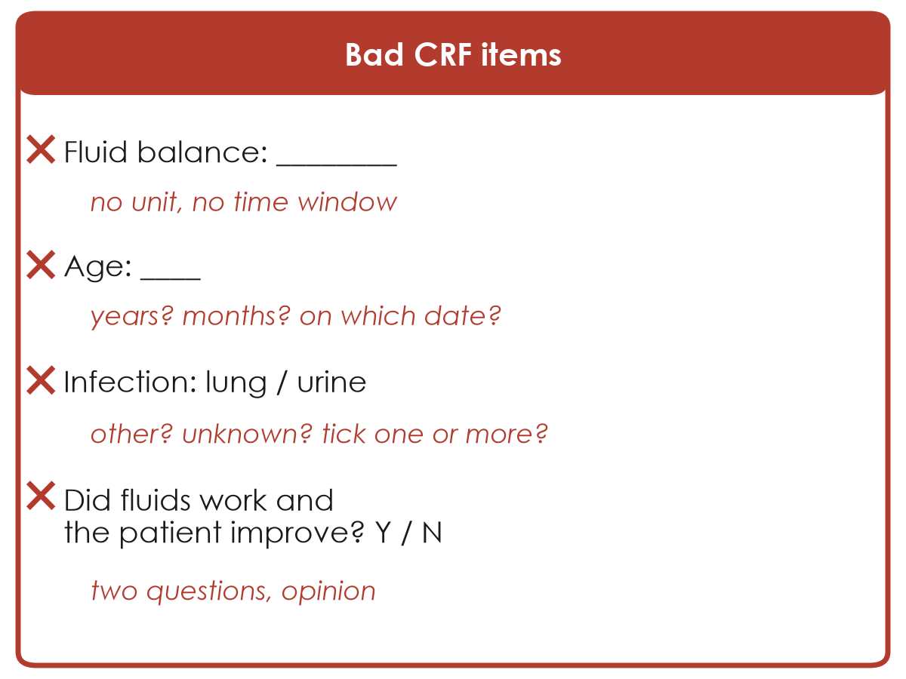{.neu-fig-half}

::: {.neu-caption}
Ambiguous: two nurses will write two different things
:::
:::
::: {.column width="50%"}
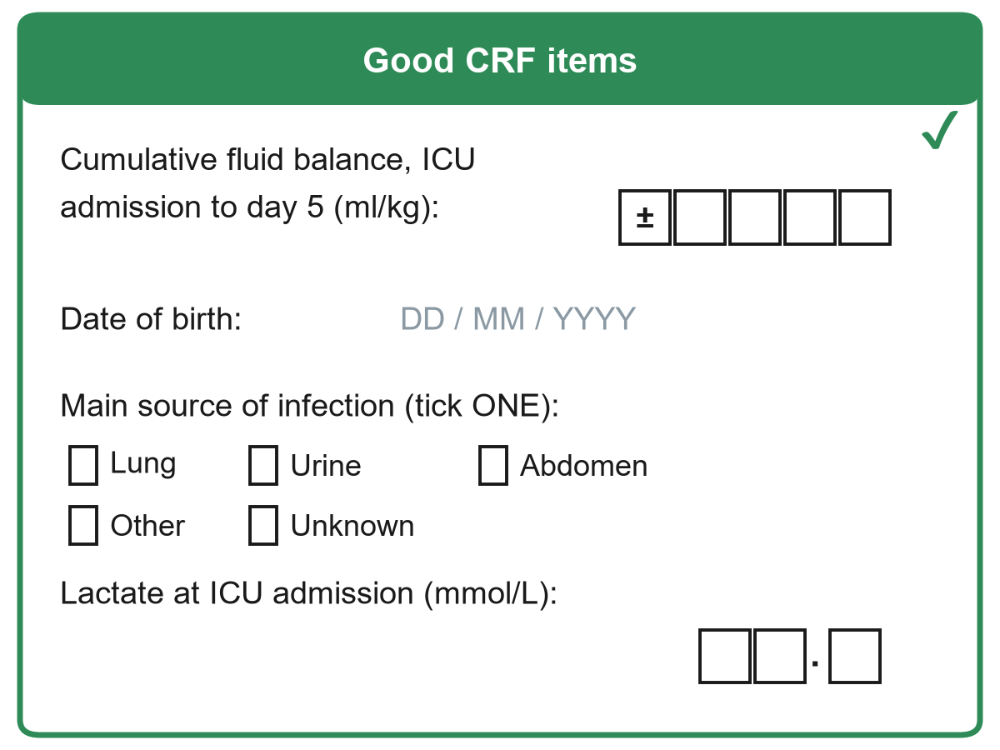{.neu-fig-half}

::: {.neu-caption}
Clear: unit, time window, one answer, 'unknown'
:::
:::
::::

::: {.notes}
Teaching point: a CRF item is good when two different people, filling it for the same patient, would write the same answer.

Go through the left side and ask the room to diagnose each problem before you reveal the red text:

Fluid balance: no unit (ml? litres? ml/kg?), no time window (today? cumulative?). For our running example this single box decides the primary outcome of the whole study.

Age: years or months, on which date? Better: collect date of birth and date of admission and let the computer calculate age.

Infection source: options are incomplete (no 'other', no 'unknown') and it is unclear whether you can tick more than one.

Did fluids work AND did the patient improve: two questions in one (double-barrelled), and both are opinions. Replace with objective measures (lactate, MAP, vasopressor dose).

Right side: unit and time window inside the question, boxes for digits including a +/- sign (fluid balance can be negative), fixed date format, tick ONE, 'other' and 'unknown' options, decimal place shown for lactate.

Ask: what is wrong with leaving a box blank? Expected: we cannot tell 'not done' from 'forgot' from 'zero'. That is why we add 'unknown / not done'.
:::

## Worked example: from a question to one CRF item

::: {.neu-intro}
The outcome 'cumulative fluid balance' in five decisions.
:::

:::: {.neu-steps}
::: {.neu-step style="--c:#0D7377"}
[1]{.neu-step-num}[What?]{.neu-step-label}

- Fluid IN minus fluid OUT
- all routes, incl. drugs
:::
::: {.neu-step style="--c:#0B376C"}
[2]{.neu-step-num}[When?]{.neu-step-label}

- From ICU admission
- to the end of day 3
:::
::: {.neu-step style="--c:#5FA39B"}
[3]{.neu-step-num}[Unit?]{.neu-step-label}

- ml per kg of
- admission weight
:::
::: {.neu-step style="--c:#0070C0"}
[4]{.neu-step-num}[Format?]{.neu-step-label}

- Number with +/- sign
- boxes for digits
:::
::: {.neu-step style="--c:#055F56"}
[5]{.neu-step-num}[Missing?]{.neu-step-label}

- 'Not recorded' box
- + reason
:::
::::

::: {.neu-takeaway}
**KEY MESSAGE** Answer what, when, unit, format and missing before the first patient.
:::

::: {.notes}
Worked example (3 minutes): build one CRF item together, the primary exposure of the course dataset.

What: cumulative fluid balance = total fluid in (crystalloids, colloids, blood, drug diluents, enteral) minus total fluid out (urine, drains, losses). Decide whether insensible losses count; write it in the data dictionary.

When: from ICU admission to the end of day 3 (the FLUID-ICU definition). A different window gives a different variable.

Unit: ml/kg of admission weight, so patients of different sizes can be compared. That means weight must also be on the CRF.

Format: a signed number with digit boxes; fluid balance can be negative.

Missing: a 'not recorded' box and a reason, so a blank always means 'forgotten'.

Ask: what other item must the CRF now contain because of the unit? Expected: body weight at admission (and how it was obtained).

This is exactly what groups do for their own variables in the proposal builder today.
:::

## Five rules for a good CRF

::: {.neu-intro}
Write the form before the first patient, then test it on five patients.
:::

:::: {.neu-cards style="--n:5"}
::: {.neu-card .plain style="--c:#0D7377"}
[Only what you need]{.neu-card-title}

- Every item links to an objective
- Short forms get completed
:::
::: {.neu-card .plain style="--c:#0B376C"}
[One question, one answer]{.neu-card-title}

- No double questions
- Objective, not opinion
:::
::: {.neu-card .plain style="--c:#5FA39B"}
[Units and timing]{.neu-card-title}

- ml/kg, mmol/L
- 'at ICU admission', 'day 5'
:::
::: {.neu-card .plain style="--c:#0070C0"}
[Closed answers]{.neu-card-title}

- Tick boxes
- Include 'other' and 'unknown'
:::
::: {.neu-card .plain style="--c:#055F56"}
[Pilot it]{.neu-card-title}

- Two people, same patient
- Do they agree?
:::
::::

::: {.neu-takeaway}
**KEY MESSAGE** If two colleagues can fill an item differently, rewrite it.
:::

::: {.notes}
Teaching point: five rules cover most CRF problems. Read the card titles, give one example each.

Only what you need: every item must answer an objective, describe the population, or adjust for a confounder. 'Nice to know' items make forms long and incomplete.

One question, one answer: avoid double-barrelled questions; prefer measured values over opinions.

Units and timing: write the unit and the time point INTO the question.

Closed answers: tick boxes with codes are faster to fill and to analyse than free text. Always include 'other (specify)' and 'unknown / not done'.

Pilot it: give the form to two colleagues for the same five patients and compare. Disagreement shows you which item to rewrite.

Common mistake: designing the form after data collection has started. Changing a form mid-study creates two different datasets.

Ask: which rule is most often broken on forms in your unit? Expected answers: too long, no units, free text everywhere.
:::

## The data dictionary: one row per variable

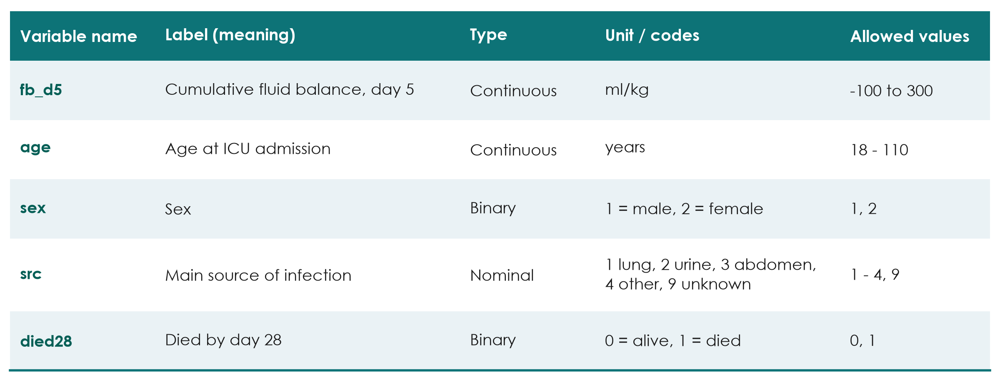{.neu-fig}

::: {.neu-caption}
Example rows for the fluids-in-septic-shock study
:::

::: {.neu-takeaway}
**KEY MESSAGE** The data dictionary is the instruction manual for your dataset.
:::

::: {.notes}
Teaching point: the data dictionary (also called a codebook) explains every column of your dataset: short name, meaning, type, unit or codes, and allowed values.

Why it matters: in six months nobody will remember whether sex 1 meant male or female, or whether fb\_d5 was ml or ml/kg. A statistician, a co-author or a reviewer must be able to understand your data without phoning you.

Read one row aloud: fb\_d5 is cumulative fluid balance at day 5, continuous, in ml/kg, allowed from -100 to 300. That allowed range becomes an automatic check on the next slide.

Note the 'unknown' code (9) for source of infection. Missing and unknown are written down, not left blank.

Tip: short variable names with no spaces (fb\_d5, not 'Fluid balance day 5') work in every software.

The proposal builder today asks you to write 3 to 5 rows like these for your own study.

Ask: who here has a data dictionary for an audit they ran? Usually very few. That is normal and easy to fix.
:::

## Data validation: let the rules catch the errors

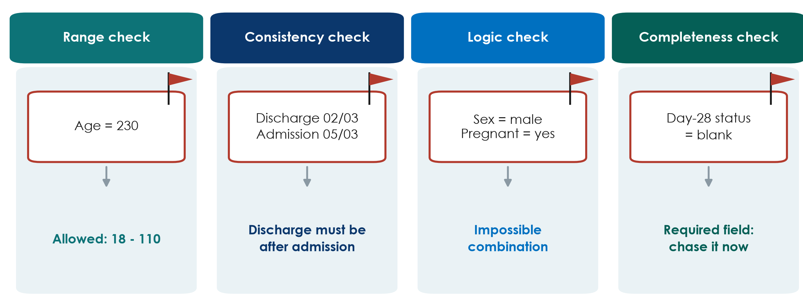{.neu-fig}

::: {.neu-takeaway}
**KEY MESSAGE** Check data while the patient is still in the unit, not a year later.
:::

::: {.notes}
Teaching point: four simple types of check catch most data-entry errors.

Range check: a value outside the allowed range (age 230 was probably 23 or 30). The range comes straight from the data dictionary.

Consistency check: two values that cannot both be true (discharge before admission).

Logic check: an impossible combination of answers (male and pregnant).

Completeness check: a required field is empty; chase it now while the chart is still available.

How to do it in practice: electronic forms can block impossible values at entry (next slides); on paper, a weekly check by the study coordinator does the same job.

Clinical point: the earlier you find the error, the easier it is to fix. Next week the patient's chart is still on the ward; next year it is archived.

Ask: what impossible values have you seen in hospital data? Expected: weights of 700 kg, dates in the future, a heart rate of 0 in a living patient.

Timing: 2 minutes. Then data management in practice, then the two missing-data slides.
:::

## Data management in practice: from bedside to database

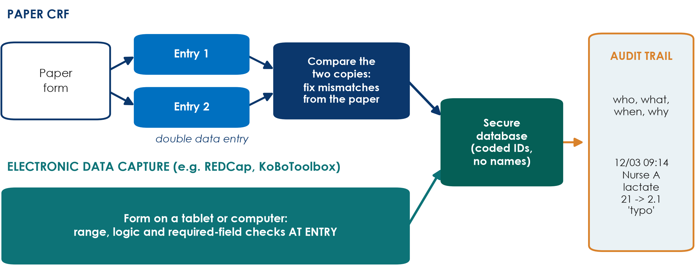{.neu-fig}

::: {.neu-takeaway}
**KEY MESSAGE** Check at entry, enter twice if on paper, and log every change.
:::

::: {.notes}
Teaching point: good data need a safe route from the patient to the analysis file. Two routes are shown.

Paper route: the CRF is typed into the computer TWICE by two different people (double data entry). A simple comparison shows every mismatch, and each one is corrected by looking at the paper form. This catches most typing errors (lactate 21 instead of 2.1).

Electronic data capture (EDC): the form is filled directly on a tablet or computer. Free, widely used examples are REDCap and KoBoToolbox. The range, logic and required-field checks from the data dictionary run AT ENTRY, so impossible values are blocked before they are saved.

Audit trail (right): a good system records who changed what, when and why. Never overwrite silently; ethics committees, monitors and journals may ask for this.

The database holds coded study IDs, not names. The key linking IDs to names is kept separately and locked.

Ask: who here has seen an Excel sheet with names, phone numbers and results in the same file, emailed around? Expected: many. That is exactly what we want to avoid.

Timing: 2 minutes.
:::

## Missing data: why it matters

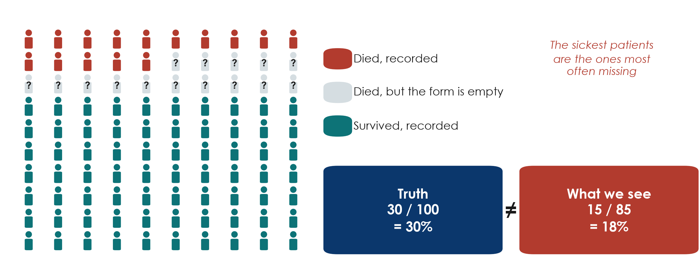{.neu-fig}

::: {.neu-takeaway}
**KEY MESSAGE** Missing data are rarely random: the sickest patients go missing first.
:::

::: {.notes}
Missing data, part 1: why it matters (prevention is next; the mechanisms and statistical handling come in 6.4).

Teaching point: missing data reduce the number of patients, and they can also give the WRONG answer.

Walk through the picture: 100 patients, 30 truly died. But 15 of the deaths have an empty outcome box (transferred out, died at night, form never completed). Among the 85 recorded patients we see 15 deaths: 18%. The truth was 30%.

Why? Because missing is linked to the outcome itself. The sickest, most chaotic patients are the ones whose forms stay empty.

Common misconception: 'we lost only 15%, that is fine'. The amount matters less than WHO is missing.

Next Saturday (Session 6, 6.4) we name the mechanisms (MCAR, MAR, MNAR) and see the idea of multiple imputation. But statistical fixes are always second best to prevention.

Ask: in your unit, which patients are most likely to have incomplete records? Expected: transfers, deaths, night admissions, very short stays.
:::

## Missing data: how to prevent it

::: {.neu-intro}
Prevention is the only reliable cure.
:::

:::: {.neu-steps}
::: {.neu-step style="--c:#0D7377"}
[1]{.neu-step-num}[Fewer items]{.neu-step-label}

- Collect only what you need
- Short forms get finished
:::
::: {.neu-step style="--c:#0B376C"}
[2]{.neu-step-num}[Clear form]{.neu-step-label}

- Required fields marked
- 'Not done' and 'unknown' options
:::
::: {.neu-step style="--c:#5FA39B"}
[3]{.neu-step-num}[Train]{.neu-step-label}

- Train every data collector
- Same rules, same definitions
:::
::: {.neu-step style="--c:#0070C0"}
[4]{.neu-step-num}[Check weekly]{.neu-step-label}

- Completeness report
- Who and what is missing?
:::
::: {.neu-step style="--c:#055F56"}
[5]{.neu-step-num}[Chase early]{.neu-step-label}

- Fix while the chart is on the ward
- Plan follow-up for transfers
:::
::::

::: {.neu-takeaway}
**KEY MESSAGE** Plan who completes, checks and chases each form before you start.
:::

::: {.notes}
Missing data, part 2: prevention.

Teaching point: five habits prevent most missing data.

Fewer items: every extra item increases the chance that something is left blank.

Clear form: mark required fields; give 'not done' and 'unknown' options so a blank always means 'forgotten'.

Train: a 30-minute session for every nurse or resident who will collect data, with the data dictionary in hand.

Check weekly: a simple count of empty boxes per variable and per patient. If one item is always empty, the item is the problem.

Chase early: the day-28 outcome is the most often missing variable in ICU studies; plan who will check it (phone call, records) for patients transferred out.

Mention: write these steps into your proposal as the 'data quality plan' (Part 3).

Transition: now practise with a partner.
:::

## Pair task: sort the variables, fix the CRF

::: {.neu-banner style="--c:#0D7377"}
GROUP WORK · 7 min
:::

:::: {.columns}
::: {.column width="60%"}
::: {.neu-activity-steps style="--c:#0D7377"}
1. Work with your neighbour, worksheet 'Session 5, exercises 1 and 2'
2. Exercise 1: classify 10 ICU variables (continuous, count, binary, nominal, ordinal, time-to-event)
3. Exercise 2: rewrite 4 bad CRF items so they have only one reading
4. Be ready to read out one rewritten item
:::
:::
::: {.column width="40%"}
::: {.neu-side .plain style="--c:#0D7377"}
Check yourself

- Unit in the question?
- Time point in the question?
- One answer only?
- 'Unknown' option?
:::
:::
::::

::: {.neu-output style="--c:#0D7377"}
**OUTPUT** 10 classified variables and 4 rewritten CRF items
:::

::: {.notes}
Pair task closing 5.1. Exercises 1 and 2 are in Course/Practicals/s5\_exercises.md; answers in Course/Solutions/s5\_solutions.md.

Run it: 5 minutes in pairs, 2 minutes feedback; it closes 5.1 at 0:45. Walk around and listen for the classic errors.

Common errors to watch: GCS called continuous (it is ordinal, although often analysed as a number); 'number of days on ventilator' called continuous (it is a count; fine either way, but the distinction matters for how you summarise); 'time to extubation' called continuous (it is time-to-event because some patients are never extubated).

For the CRF rewrites, ask one pair to read their version of 'Fluid given: \_\_\_\_' and let the room apply the four checks on the side panel.

Timing: if the room is fast, ask them to add one row to a data dictionary for their rewritten item.
:::

## 5.2 Meet the course dataset

:::: {.neu-statement}
::: {.neu-big}
One realistic dataset, five research questions, five manuscripts.
:::

::: {.neu-sub}
5.2 Meet the course dataset FLUID-ICU  \|  25 minutes
:::
::::

::: {.notes}
Section 5.2 opener (25 minutes: the study, the flow of patients, raw vs clean data, an 8-minute live R cleaning demo, the cleaning log, then each group receives its question).

Key message: from now on your group will analyse and write up a realistic study, as well as reading other people's. FLUID-ICU is SIMULATED: invented by computer, no real patient, hospital or country. But it behaves like real ICU data, including its problems.

Nobody needs to run R. The instructor runs it live; you read and interpret. Participants who took the Neudata course 'Clinical Data Analysis in R' can reproduce everything with the scripts in Course/Data/R.

Link to the running example: Sessions 1-4 asked an interventional question (restrictive fluids: an RCT, Paper 1). FLUID-ICU asks the observational form: is a positive fluid balance associated with death? That is a cohort question (Paper 2). Ask: what can a cohort claim that an RCT cannot, and vice versa? Expected: association, not causation; but real-world patients and more of them.
:::

## FLUID-ICU at a glance (simulated cohort)

::: {.neu-intro}
A multicentre prospective cohort: 4 ICUs, January 2023 to December 2024.
:::

:::: {.neu-cards style="--n:4"}
::: {.neu-card .plain style="--c:#0D7377"}
[Who]{.neu-card-title}

- 620 adults with sepsis
- ICU A 191, B 164,
- C 147, D 118
:::
::: {.neu-card .plain style="--c:#0B376C"}
[Exposure]{.neu-card-title}

- Cumulative fluid balance
- by day 3 (ml/kg)
- Positive: 373/618 (60.4%)
:::
::: {.neu-card .plain style="--c:#5FA39B"}
[Primary outcome]{.neu-card-title}

- Death by day 28
- 179/620 (28.9%)
- + time to death
:::
::: {.neu-card .plain style="--c:#0070C0"}
[Also recorded]{.neu-card-title}

- SOFA, APACHE II, lactate
- AKI, ventilator-free days
- ICU length of stay
:::
::::

::: {.neu-takeaway}
**KEY MESSAGE** Question: is a positive fluid balance by day 3 associated with 28-day death?
:::

::: {.notes}
Teaching point: before any analysis, know the study: who, exposure, outcome, what else was measured.

Who: 620 adults with sepsis in 4 ICUs (ICU A 191, ICU B 164, ICU C 147, ICU D 118), enrolled January 2023 to December 2024. Simulated data.

Exposure: cumulative fluid balance by day 3, (all fluid in minus all fluid out over days 1-3) divided by admission weight, in ml/kg. Positive balance in 373 of 618 patients with a computable balance (60.4%); median 8.8 ml/kg (IQR -10.3 to 26.2).

Primary outcome: death by day 28: 179 of 620 (28.9%); time to death is also recorded (survivors censored at day 28).

Other variables: demographics, comorbidities, infection source, severity scores, lactate, vasopressors, ventilation, AKI, renal replacement, ventilator-free days, ICU stay.

The full data dictionary is Course/Data/data\_dictionary.md: the same structure as the one you saw in 5.1.

Ask: from what you know of Sessions 3-4 and Paper 2, which patients do you expect to have a positive balance? Expected: the sickest ones. Keep that in mind for Table 1 and Session 6.
:::

## From 623 rows to 527 complete cases

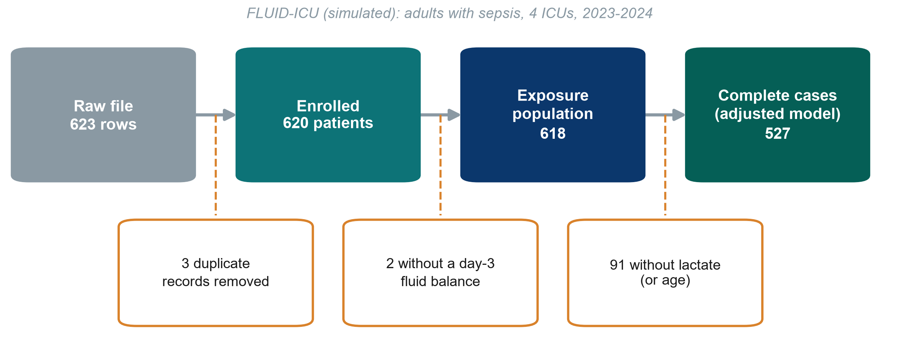{.neu-fig}

::: {.neu-takeaway}
**KEY MESSAGE** Every paper reports this flow: who was included at each step, and why not.
:::

::: {.notes}
Teaching point: the flow of patients (the STROBE flow diagram in the manuscript).

Raw file: 623 rows. Three patients were entered twice: after removing duplicates, 620 enrolled patients.

Two patients have no day-3 fluid balance (their weight or one fluid output was impossible and set to missing during cleaning): 618 in the exposure population, used for Table 1 and the comparisons.

91 more have no lactate (or age): 527 complete cases for the adjusted model in Session 6.

Why it matters: 527 of 620 is 85%. Are the 91 patients without lactate different? Session 6 (6.4) answers this: they were less sick.

Ask: in which section of your manuscript will this picture go? Expected: the first paragraph of the Results (participants), as Figure 1.
:::

## Raw vs clean: what the four ICUs actually sent

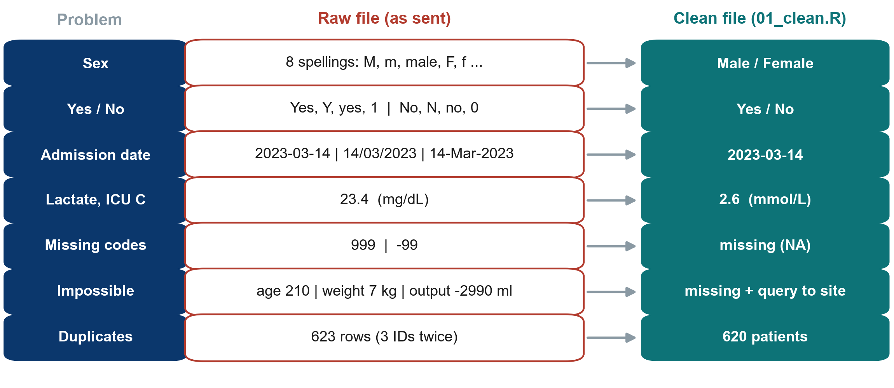{.neu-fig}

::: {.neu-takeaway}
**KEY MESSAGE** Real data arrive messy: clean them with a script, never by hand.
:::

::: {.notes}
Teaching point: these are the data-quality problems found in the raw file, and how each was fixed. Ask the room to guess the problem for each row before revealing the clean column.

Sex and yes/no variables spelled in many ways; three date formats (is 03/04 March or April?); ICU C sent lactate in mg/dL instead of mmol/L (found by comparing medians by ICU); 999 and -99 used as missing codes; impossible values (an age of 210, a weight of 7 kg, a negative fluid output); duplicate records (623 rows for 620 patients).

Each problem breaks the analysis silently: a lactate of 999 inflates the mean; 'Y' and 'Yes' become two categories; mg/dL values make ICU C look like a lactate catastrophe.

Impossible values are set to missing and a query is sent to the site; the patient stays in the study. We never guess.

Link to 5.1: every one of these would have been prevented by an electronic CRF with validation rules and a data dictionary.

Ask: which problem would you never have spotted without a graph or a summary by ICU? Expected: the lactate unit.
:::

## Live demo: cleaning FLUID-ICU in R

::: {.neu-banner style="--c:#B5651D"}
LIVE DEMO · 8 min
:::

:::: {.columns}
::: {.column width="60%"}
::: {.neu-activity-steps style="--c:#B5651D"}
1. Open FLUID-ICU.Rproj and the script 01\_clean.R
2. Read the raw file as text and look at it
3. Run one block per problem: names, duplicates, sites, dates, codes
4. Find the lactate unit problem with a summary by ICU
5. Last block: the cleaned file is identical to the reference file
:::
:::
::: {.column width="40%"}
::: {.neu-side .plain style="--c:#B5651D"}
Watch for

- One problem, one block
- The raw file is never changed
- Every step goes in the log
- Re-run = same result
:::
:::
::::

::: {.neu-output style="--c:#B5651D"}
**OUTPUT** Everyone has seen raw data become clean, reproducibly
:::

::: {.notes}
Live demo, 8 minutes. Full script with expected outputs and fallback screenshots: Course/Demos/s5\_demo.md (Part A).

You run R; participants watch. Run blocks one at a time with Ctrl+Enter and say aloud what each block fixes.

Show: the raw data read as text; 623 rows reduced to 620 by removing the 3 duplicates; the table of sex spellings before and after; the three date formats; the lactate medians by ICU (ICU C about 9 times higher) and the conversion; impossible values set to missing; the final check that the cleaned file is identical to the reference clean file.

Teaching points: (1) the raw file is never edited; (2) one problem, one block, one log entry; (3) because it is a script, anyone can re-run it and get exactly the same clean data: reproducibility.

If R fails: show the raw-vs-clean slide again and the screenshots in the demo script; the teaching points are the same.

Do not let the demo run over: stop after 8 minutes, even if you skip a block.
:::

## The cleaning log: the audit trail of the data

::: {.neu-intro}
Course/Data/cleaning\_log.md: one row for every change made to the raw data.
:::

:::: {.neu-cards style="--n:4"}
::: {.neu-card .plain style="--c:#0D7377"}
[The rule]{.neu-card-title}

- Raw file never edited
- Changes made by script
- and written down
:::
::: {.neu-card .plain style="--c:#0B376C"}
[Each row says]{.neu-card-title}

- Problem found
- How many
- What we did and why
:::
::: {.neu-card .plain style="--c:#5FA39B"}
[Queries]{.neu-card-title}

- Impossible values →
- missing + query to site
- Patient stays in
:::
::: {.neu-card .plain style="--c:#0070C0"}
[What is left]{.neu-card-title}

- Real missing values
- Lactate: 93/620 (15.0%)
- Others 1% or less
:::
::::

::: {.neu-takeaway}
**KEY MESSAGE** A reviewer must be able to trace every number back to the raw data.
:::

::: {.notes}
Teaching point: the cleaning log is the audit trail of the dataset. Show the real file on screen if you can (Course/Data/cleaning\_log.md).

The rule: the raw file is never edited; every change is made by the script and written down.

Each row: the problem found, how many records, what was done and why (for example: lactate at ICU C in mg/dL, divided by 9.01 to obtain mmol/L, confirmed with the site laboratory).

Queries: impossible values are set to missing and a query is sent to the site; the patient is not deleted (deleting would bias the sample).

What is left after cleaning is REAL missing data: lactate 93 of 620 (15.0%), every other variable 1% or less. These gaps are the subject of 6.4 next Saturday.

Ask: why not just delete the patient with an age of 210? Expected: the rest of the record is valid; deleting patients for typing errors can bias the sample.

Your manuscript's Methods will say: 'Data were cleaned with a script; all changes are documented in a cleaning log.'
:::

## Five groups, five questions, one dataset

::: {.neu-intro}
Each group answers one question and writes it up as a manuscript in Weeks 7-8.
:::

:::: {.neu-cards style="--n:5"}
::: {.neu-card .plain style="--c:#0D7377"}
[Q1 Mortality]{.neu-card-title}

- Positive balance and
- 28-day death
- Logistic + KM/Cox
:::
::: {.neu-card .plain style="--c:#0B376C"}
[Q2 AKI]{.neu-card-title}

- Fluid balance and
- acute kidney injury
- Logistic
:::
::: {.neu-card .plain style="--c:#5FA39B"}
[Q3 Ventilation]{.neu-card-title}

- Fluid balance and
- ventilator-free days
- Non-parametric / linear
:::
::: {.neu-card .plain style="--c:#0070C0"}
[Q4 Lactate]{.neu-card-title}

- Lactate and death;
- missing lactate
- CC vs imputation
:::
::: {.neu-card .plain style="--c:#055F56"}
[Q5 ICU stay]{.neu-card-title}

- Balance and ICU stay
- in survivors
- Skewed outcome
:::
::::

::: {.neu-takeaway}
**KEY MESSAGE** Your group question is your manuscript: own it from today.
:::

::: {.notes}
Teaching point: one dataset, five different research questions, matching the secondary objectives of the FLUID-ICU SAP.

Q1 (group 1): positive fluid balance by day 3 and 28-day mortality: logistic regression plus Kaplan-Meier and Cox. The primary question.

Q2 (group 2): cumulative fluid balance and acute kidney injury: logistic regression.

Q3 (group 3): cumulative fluid balance and ventilator-free days: a count from 0 to 28, piled up at both ends: Mann-Whitney and linear regression.

Q4 (group 4): initial lactate and 28-day mortality, and what missing lactate does: complete-case vs multiple imputation.

Q5 (group 5): fluid balance and ICU length of stay among survivors: a skewed outcome (median, IQR; log scale).

Each group has a results pack in Course/Data/results\_packs (Table 1, figures, regression tables, plain-language notes). It is the raw material of the manuscript drafted in Sessions 7-8.

Assign the questions now (or confirm the assignment made before the session).
:::

## Your group's question

::: {.neu-banner style="--c:#0D7377"}
GROUP WORK · 4 min
:::

:::: {.columns}
::: {.column width="60%"}
::: {.neu-activity-steps style="--c:#0D7377"}
1. Read your question in your results pack (page 1)
2. Name the outcome and its type; the exposure and its type
3. Find both in the FLUID-ICU data dictionary
4. Write the question as one sentence (PECO)
:::
:::
::: {.column width="40%"}
::: {.neu-side .plain style="--c:#0D7377"}
Example (Q1)

- P: adults with sepsis in ICU
- E: positive balance by day 3
- C: negative balance
- O: death by day 28 (binary)
:::
:::
::::

::: {.neu-output style="--c:#0D7377"}
**OUTPUT** One-sentence question with outcome and exposure types (exercise 7)
:::

::: {.notes}
Group task, 4 minutes. Worksheet: Session 5 exercises, exercise 7.

Each group writes its question as a PECO sentence (P population, E exposure, C comparator, O outcome) and labels the type of the outcome and exposure, using the variable-type tree from 5.1.

Expected types: Q1 outcome binary (plus time-to-event), exposure binary; Q2 binary outcome, continuous exposure; Q3 count outcome (0-28, skewed), continuous exposure; Q4 binary outcome, continuous exposure (lactate) with missing values; Q5 continuous skewed outcome (survivors only), binary exposure.

Check one or two groups aloud. Then break.
:::

## Break

::: {.neu-banner style="--c:#8A99A3"}
BREAK · 15 min
:::

:::: {.columns}
::: {.column width="60%"}
::: {.neu-activity-steps style="--c:#8A99A3"}
1. Stretch, coffee, fresh air
2. Groups: glance at your group question and results pack
3. We restart with 5.3: describing and showing data
:::
:::
::: {.column width="40%"}
::: {.neu-side .plain style="--c:#8A99A3"}
After the break

- Mean or median?
- SD or IQR?
- Which graph?
- Good and bad figures
- Table 1
:::
:::
::::

::: {.notes}
Break: 15 minutes. Start again on time (1:25).

During the break: check that the R project for 02\_describe.R opens and runs on the projector laptop, and that the fallback figures for 5.4 are ready.

Walk around and ask two or three people what was hardest so far (often the course-dataset cleaning); adjust the pace of 5.3.
:::

## 5.3 Describing and showing data

:::: {.neu-statement}
::: {.neu-big}
Before comparing groups, describe them.
:::

::: {.neu-sub}
5.3 Describing and showing data  \|  35 minutes
:::
::::

::: {.notes}
Section 5.3 opener (35 minutes: a worked example by hand, mean vs median, spread, shapes, a check, which graph, honest figures, Table 1 and publication-quality tables).

Key message: every paper begins its results by describing the patients: who they were, how sick, how old. You need two numbers for any numerical variable: a CENTRE (where is the typical patient?) and a SPREAD (how different are patients from each other?).

The choice between the two families (mean and SD, or median and IQR) depends on one thing: the SHAPE of the data.

Transition: let us look at the most famous skewed variable in hospital medicine: length of stay.
:::

## Worked example: mean and median by hand

::: {.neu-intro}
ICU stay of 7 patients (days): 1, 2, 2, 3, 4, 6, 24
:::

:::: {.neu-steps}
::: {.neu-step style="--c:#0D7377"}
[1]{.neu-step-num}[Line up]{.neu-step-label}

- Sort from short
- to long stays
:::
::: {.neu-step style="--c:#0B376C"}
[2]{.neu-step-num}[Median]{.neu-step-label}

- The 4th of 7 patients:
- 3 days
:::
::: {.neu-step style="--c:#5FA39B"}
[3]{.neu-step-num}[Mean]{.neu-step-label}

- 42 days / 7 patients
- = 6 days
:::
::: {.neu-step style="--c:#0070C0"}
[4]{.neu-step-num}[Compare]{.neu-step-label}

- One 24-day stay
- doubles the mean
:::
::::

::: {.neu-takeaway}
**KEY MESSAGE** One very long stay moves the mean a lot and the median not at all.
:::

::: {.notes}
Worked example (3 minutes). Write the seven numbers on the flip chart.

Line up: they are already sorted: 1, 2, 2, 3, 4, 6, 24.

Median: the middle patient of seven is the 4th: 3 days. Half stayed less, half more.

Mean: add them up: 1 + 2 + 2 + 3 + 4 + 6 + 24 = 42; divide by 7 = 6 days.

Compare: six of the seven patients stayed 6 days or less; the mean of 6 is pulled up by the single 24-day stay. The median describes the typical patient.

Now ask: if the long-stay patient had stayed 60 days instead of 24, what happens? Expected: the median stays 3, the mean jumps to about 11 (78 / 7 = 11.1).

This is the only hand calculation today; afterwards the computer does it and you interpret.
:::

## Mean or median? Look at the shape first

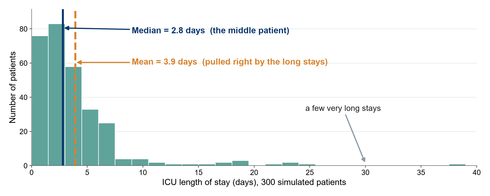{.neu-fig}

::: {.neu-takeaway}
**KEY MESSAGE** For skewed data like length of stay, the median describes the typical patient.
:::

::: {.notes}
Teaching point: the MEDIAN is the middle patient when you line everyone up; the MEAN is the arithmetic average.

In this simulated ICU, most patients stay 1 to 5 days, but a few stay 3 to 6 weeks. Those few long stays pull the mean to the right (3.9 days) while the median stays with the typical patient (2.8 days).

Clinical translation: if a manager says 'the average ICU stay is 3.9 days', most of your patients actually leave earlier than that.

Common misconception: 'the mean is always the correct average'. For skewed data it describes no real patient.

Rule of thumb: if the mean and median are far apart, the data are skewed: report the median.

Ask: name other skewed variables in your work. Expected: hospital costs, CRP, troponin, time to antibiotics, days on ventilator.

Running example: Paper 1 reported cumulative fluid balance as MEDIANS (6.9 vs 35.0 ml/kg) for exactly this reason.
:::

## Spread: SD for symmetric, IQR for skewed

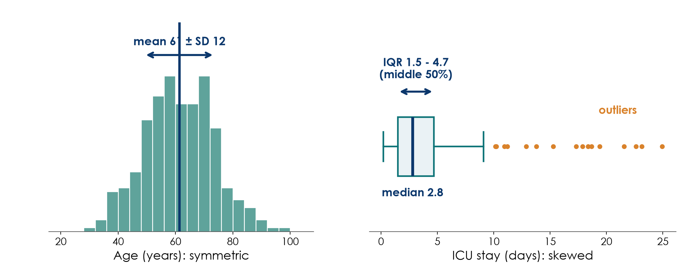{.neu-fig}

::: {.neu-takeaway}
**KEY MESSAGE** Report mean (SD) or median (IQR): never mix the pairs.
:::

::: {.notes}
Teaching point: the spread tells you how different patients are from each other.

Left: age is roughly symmetric. The standard deviation (SD) is the typical distance of a patient from the mean. In bell-shaped data, about two thirds of patients lie within one SD of the mean.

Right: length of stay is skewed. The boxplot shows the median (thick line), the box from the 25th to the 75th percentile (the interquartile range, IQR: the middle 50% of patients), whiskers, and outliers as dots.

How to read 'median 2.8 (IQR 1.5-4.7)': half the patients stayed less than 2.8 days; the middle half stayed between 1.5 and 4.7 days.

Common mistakes: reporting mean with IQR, or median with SD. And confusing SD (spread of patients) with the standard error or CI (precision of the estimate), which comes in 6.1.

Paper 1 example: control-group fluid balance 'median 35.0 (IQR -7.9; 40.2)'. Point out the negative lower quartile: a quarter of patients had a negative balance.
:::

## Why these two shapes? They cover most clinical data

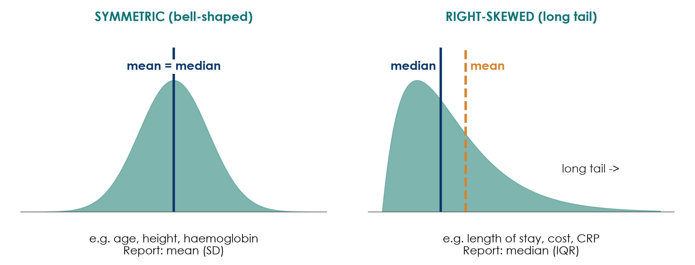{.neu-fig}

::: {.neu-takeaway}
**KEY MESSAGE** Most clinical data cluster around a typical value or have a long tail. Check which.
:::

::: {.notes}
Teaching point: two shapes cover most clinical data.

WHY THESE TWO (reviewer question): most clinical measurements either cluster around a typical value (body size, physiology tightly regulated by the body: symmetric) or cannot go below zero but can go very high (times, counts, costs, inflammatory markers: right-skewed). Together they cover the large majority of variables in a clinical dataset, and they lead to the two ways of summarising data.

Other shapes exist but are rarer: left-skewed (a ceiling, e.g. gestational age at birth, oxygen saturation), bimodal (two groups mixed, e.g. age on a ward that admits both children and adults). For any shape that is not clearly symmetric, show the histogram and report median (IQR).

Symmetric, bell-shaped (often called 'normal'): mean and median are in the same place. Examples: age in adults, height, haemoglobin, systolic blood pressure. Report mean (SD).

Right-skewed: a long tail of high values pulls the mean to the right of the median. Examples: length of stay, cost, CRP, many lab values that cannot go below zero. Report median (IQR).

Quick check without software: if the SD is larger than half the mean for a variable that cannot be negative, it is probably skewed.

Why this matters later: the shape also decides the test (t-test for symmetric, Mann-Whitney for skewed). That is the decision chart in 6.1.

Ask: is 'number of days on vasopressors' symmetric or skewed? Expected: skewed (most patients 1-3 days, a few for weeks).
:::

## Check your understanding: which summary?

::: {.neu-banner style="--c:#6C3483"}
QUICK QUIZ · 3 min
:::

:::: {.columns}
::: {.column width="60%"}
::: {.neu-activity-steps style="--c:#6C3483"}
1. ICU length of stay in 200 patients: mean (SD) or median (IQR)?
2. Age of 200 adult ICU patients, bell-shaped: mean (SD) or median (IQR)?
3. Ventilated on admission (yes/no): which summary?
4. Pressure-injury stage 1 to 4: which summary and which graph?
:::
:::
::: {.column width="40%"}
::: {.neu-side .plain style="--c:#6C3483"}
Answers

- LOS: median (IQR)
- Age: mean (SD)
- Ventilated: n (%)
- Stage: n (%) per stage, bar chart
:::
:::
::::

::: {.neu-output style="--c:#6C3483"}
**OUTPUT** Every participant can pick the right summary for a variable type
:::

::: {.notes}
Check your understanding (3 minutes), half-way through 5.3. Hands up or coloured cards.

Q1: median (IQR): length of stay is right-skewed.

Q2: mean (SD): bell-shaped data.

Q3: n (%): a binary variable has no mean or SD; report the number and percentage.

Q4: n (%) for each stage, shown with a bar chart; the median stage is also acceptable for an ordinal variable. Do not report a 'mean stage of 2.3'.

If many get Q1 wrong, return to the histogram slide for one minute.

Transition: now, how to SHOW these summaries: graphs, figures and tables.
:::

## Which graph for which data?

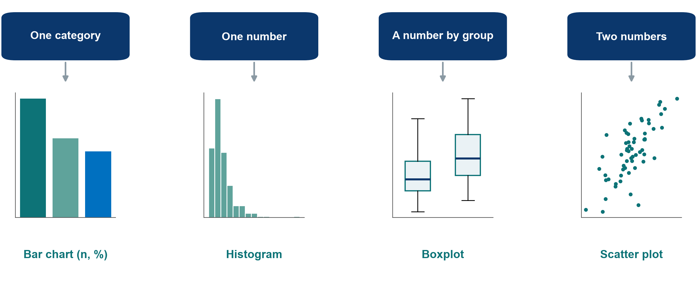{.neu-fig}

::: {.neu-takeaway}
**KEY MESSAGE** Choose the graph from the variable type, not from the software menu.
:::

::: {.notes}
Teaching point: four graphs cover most of what you need to describe data. Survival curves (Kaplan-Meier) come in Session 6, when we analyse time-to-event outcomes.

One categorical variable: bar chart with counts or percentages (source of sepsis). Avoid 3-D pie charts.

One numerical variable: histogram to see the shape (length of stay).

A number compared between groups: side-by-side boxplots (fluid balance in restrictive vs usual care).

Two numerical variables: scatter plot (fluid balance against lactate).

Common mistake: a bar chart of means with a small error bar for skewed data; it hides the shape and the outliers. A boxplot shows much more.

Ask: which graph would you use to compare ICU length of stay between the two fluid groups? Expected: side-by-side boxplots (skewed numbers by group).
:::

## Show the data: dynamite plot vs dots + box

::: {.neu-intro}
Same 48 patients, two pictures.
:::

:::: {.columns}
::: {.column width="50%"}
{.neu-fig-half}

::: {.neu-caption}
Dynamite plot: a mean and an error bar hide everything
:::
:::
::: {.column width="50%"}
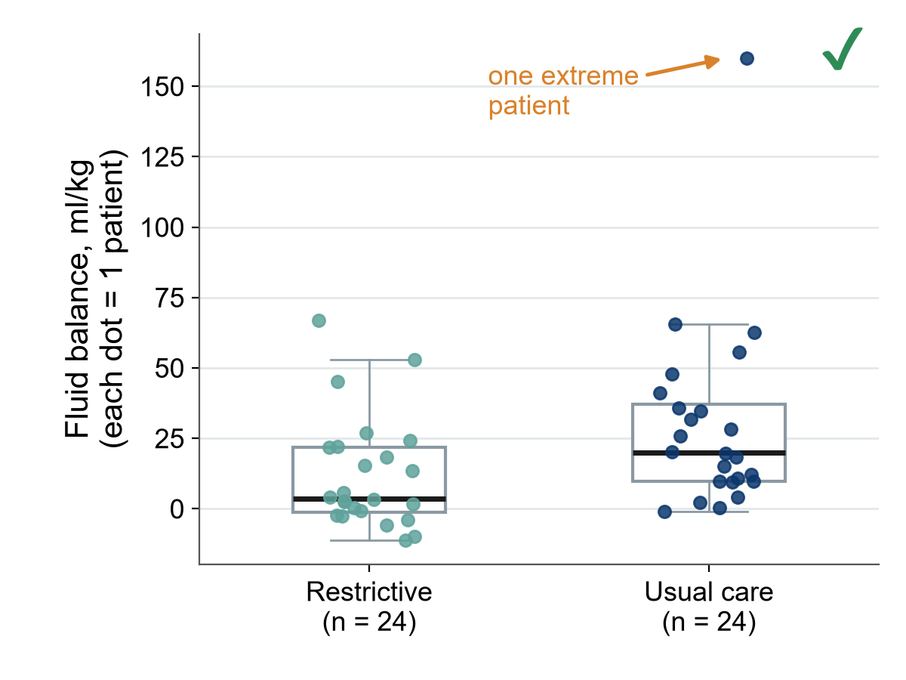{.neu-fig-half}

::: {.neu-caption}
Every patient visible: shape, spread and the outlier
:::
:::
::::

::: {.notes}
Teaching point: the 'dynamite plot' (bar of the mean plus an error bar) is the most common bad figure in clinical journals. It shows two numbers per group and hides the rest.

Left: the bars suggest the usual-care group has much higher fluid balance. Right: the same simulated data as dots plus a boxplot. Now you see that one extreme patient (160 ml/kg) drags the usual-care mean up, that the data are skewed, and that the groups overlap a lot.

Also note: the left plot shows the standard error (SE), not the SD, which makes the spread look small. Always say whether bars are SD, SE or 95% CI.

Rule: with fewer than about 100 patients per group, show the individual points.

Many journals now explicitly discourage bar charts for continuous data.

Ask: what would you have concluded from the left picture alone? Expected: 'the usual-care group is clearly higher'. That is the danger.

Timing: 2 minutes.
:::

## What a 'Table 1' shows

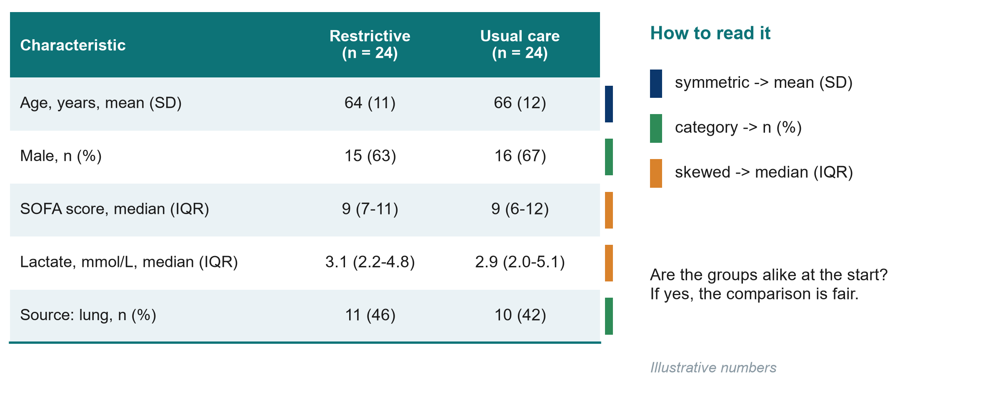{.neu-fig}

::: {.neu-takeaway}
**KEY MESSAGE** Table 1 answers: who were the patients, and were the groups alike?
:::

::: {.notes}
Teaching point: Table 1 in almost every clinical paper describes the patients at baseline, by group.

Read it row by row using the colour key: symmetric variables as mean (SD), skewed ones as median (IQR), categories as n (%).

Two questions to ask of every Table 1: (1) Do these patients look like mine? (generalisability) (2) Are the groups similar at the start? (fair comparison).

In an RCT, groups should be similar by chance thanks to randomisation; small differences are expected. Many guidelines (CONSORT) advise against p-values in an RCT's Table 1, because any difference is due to chance by definition.

In a cohort (Paper 2), large baseline differences are a warning sign of confounding; that is why Paper 2 matched patients on a propensity score before comparing them.

Numbers on the slide are illustrative, not from Paper 1. Paper 1's real Table 1 has 24 patients per group; ask participants to open it on Sessions 7-8.

Ask: what would worry you if the restrictive group had a median SOFA of 6 and usual care 11? Expected: the groups are not comparable; sicker patients in one arm.

Timing: 2 minutes. Next: the same Table 1 written badly and well, after two slides on figures.
:::

## Publication-quality tables: bad vs good

::: {.neu-intro}
Rules: units and summary in the row label, n per column, consistent decimals, footnotes.
:::

:::: {.columns}
::: {.column width="50%"}
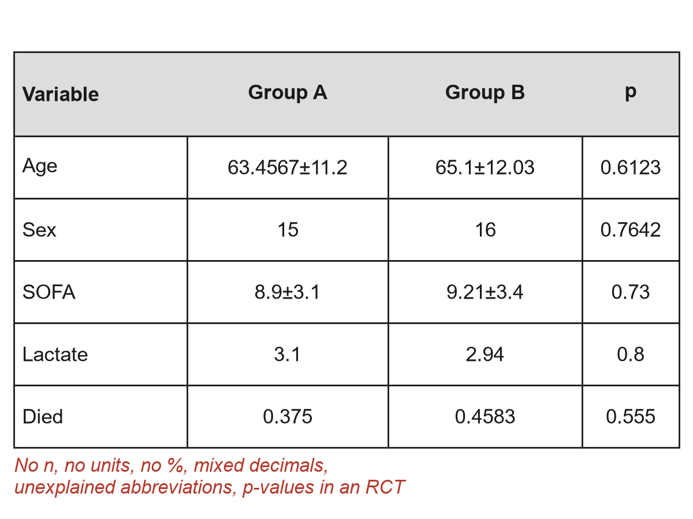{.neu-fig-half}

::: {.neu-caption}
Grid lines, no n, no units, 4 decimals
:::
:::
::: {.column width="50%"}
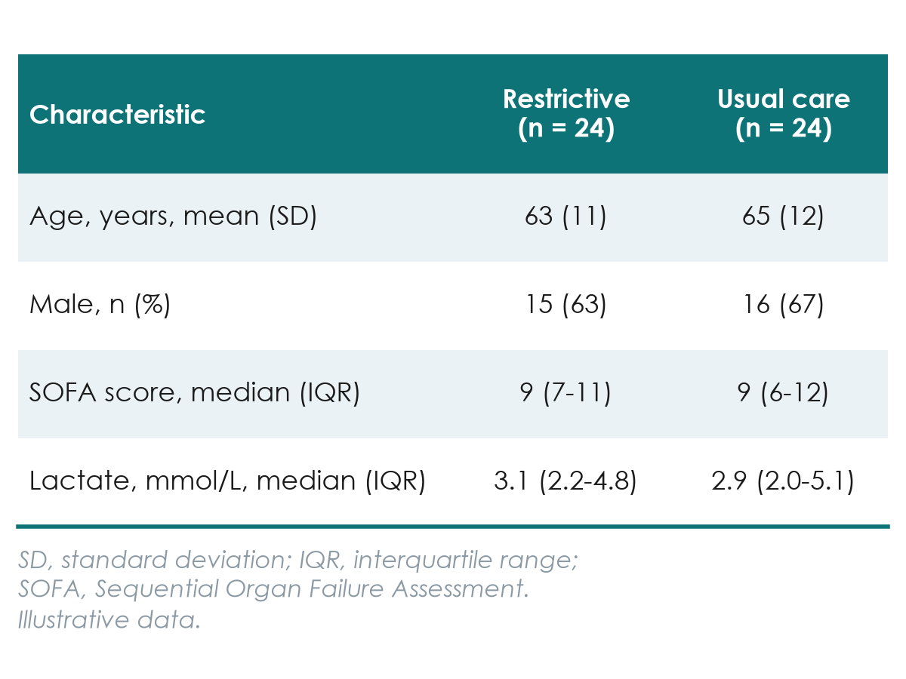{.neu-fig-half}

::: {.neu-caption}
Clean, self-explanatory, ready for a journal
:::
:::
::::

::: {.notes}
Teaching point: a table in a paper must stand alone. Compare the two versions row by row.

Column headers: 'Group A / Group B' tells the reader nothing; write the group names and the number of patients in each column (n = 24).

Row labels: say the unit and the summary used: 'Age, years, mean (SD)', 'Lactate, mmol/L, median (IQR)'.

Numbers: sensible, consistent decimals: age as whole years, percentages without decimals for small samples, lactate with one decimal. 63.4567 suggests a precision that does not exist.

Categories as n (%), never as a proportion like 0.375.

Footnotes explain every abbreviation (SOFA, IQR) and, if p-values are shown, which test was used. In an RCT Table 1, leave p-values out (CONSORT).

No vertical lines, few horizontal ones; journals will re-typeset anyway, but reviewers notice messy tables.

The proposal template and Sessions 7-8 (writing the paper) use these same rules.

Ask: find four problems in the left table in 30 seconds. Expected: no n, no units, no %, too many decimals, unexplained SOFA, p-values in an RCT.

Timing: 2 minutes.
:::

## 5.4 Describe the course dataset

:::: {.neu-statement}
::: {.neu-big}
Before comparing groups, describe them: now with real numbers.
:::

::: {.neu-sub}
5.4 Describe the course dataset  \|  25 minutes
:::
::::

::: {.notes}
Section 5.4 opener (25 minutes: a 6-minute live demo of Table 1 and figures, four slides of FLUID-ICU results, then a 10-minute group worksheet on your own results pack).

Key message: everything from 5.3 (shape, mean or median, which graph, Table 1) now applied to FLUID-ICU. Same rules, real (simulated) numbers.
:::

## Live demo: Table 1 and figures in R

::: {.neu-banner style="--c:#B5651D"}
LIVE DEMO · 6 min
:::

:::: {.columns}
::: {.column width="60%"}
::: {.neu-activity-steps style="--c:#B5651D"}
1. Open 02\_describe.R and load the clean data
2. Look at the shape first: histograms of age, lactate, ICU stay
3. Build Table 1 by fluid-balance group (no p-values)
4. Draw the figures: histogram, boxplot, bar chart
5. Save tables and figures for the results packs
:::
:::
::: {.column width="40%"}
::: {.neu-side .plain style="--c:#B5651D"}
Same rules as 5.3

- Shape decides the summary
- n per column
- Units in the row label
- Missing reported
:::
:::
::::

::: {.neu-output style="--c:#B5651D"}
**OUTPUT** Everyone has seen a Table 1 built from data, reproducibly
:::

::: {.notes}
Live demo, 6 minutes. Full script: Course/Demos/s5\_demo.md (Part B), using Course/Data/R/02\_describe.R.

Show: the shape of age (roughly symmetric, so mean and SD) vs lactate and ICU stay (right-skewed, so median and IQR); the Table 1 by fluid-balance group with overall, negative (n = 245) and positive (n = 373) columns and the number missing per variable; the histogram of fluid balance, the SOFA boxplot by group, the sorted bar chart of infection source.

Point out: no p-values in Table 1 (it describes, it does not test), as written in the FLUID-ICU SAP.

If R fails: go straight to the next slides; they show the same outputs.
:::

## FLUID-ICU Table 1: were the groups alike at the start?

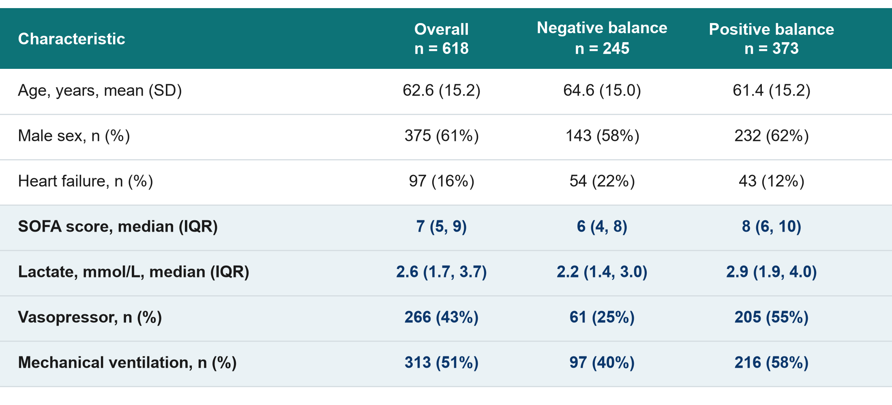{.neu-fig}

::: {.neu-takeaway}
**KEY MESSAGE** The positive-balance group was sicker at baseline: a warning for Session 6.
:::

::: {.notes}
Teaching point: read Table 1 with the two questions from 5.3: do these patients look like mine, and were the groups alike at the start?

Age: mean 64.6 vs 61.4 years (negative vs positive): similar.

Severity is NOT similar: SOFA median 6 (4 to 8) vs 8 (6 to 10); vasopressor 61/245 (24.9%) vs 205/373 (55.0%); mechanical ventilation 97/245 (39.6%) vs 216/373 (57.9%); lactate median 2.2 vs 2.9 mmol/L.

Heart failure: 54/245 (22.0%) vs 43/373 (11.5%): clinicians give less fluid to patients with heart failure.

Interpretation: patients with a positive balance were sicker before the fluid was given. Sicker patients receive more fluid AND die more often: confounding by indication (Session 4). Any crude comparison of mortality will be biased; Session 6 adjusts for it.

Ask: from this table alone, would you expect the crude odds ratio for death to be larger or smaller than the adjusted one? Expected: larger (the sickness inflates it).
:::

## The exposure: cumulative fluid balance at day 3

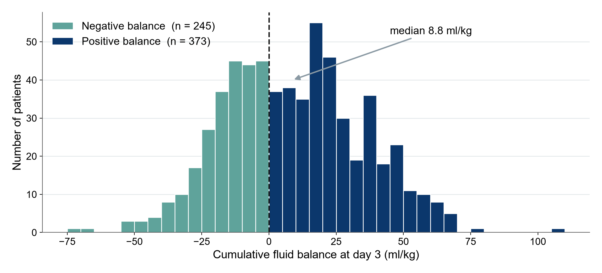{.neu-fig}

::: {.neu-takeaway}
**KEY MESSAGE** A continuous exposure, cut at 0 ml/kg into negative and positive balance.
:::

::: {.notes}
Teaching point: always look at the exposure before using it.

The cumulative fluid balance at day 3 ranges widely; median 8.8 ml/kg (IQR -10.3 to 26.2). 373 of 618 patients (60.4%) had a positive balance.

The primary analysis (Q1) cuts the continuous variable at 0 ml/kg into two groups; Q2 and Q3 keep it continuous (per 10 ml/kg). Cutting loses information but is easier to explain; the SAP fixed this choice in advance.

Ask: which summary would you report for this variable in Table 1? Expected: median (IQR), as here, because of the tails; roughly symmetric in the middle, so mean (SD) would also be acceptable if stated.
:::

## Severity by group: show every patient

:::: {.columns}
::: {.column width="38%"}
::: {.neu-side-notes}
### How to read it

- Each dot is one patient
- Box = middle 50%
- Median 6 vs 8
- Sicker patients got more fluid
:::
:::
::: {.column width="62%"}
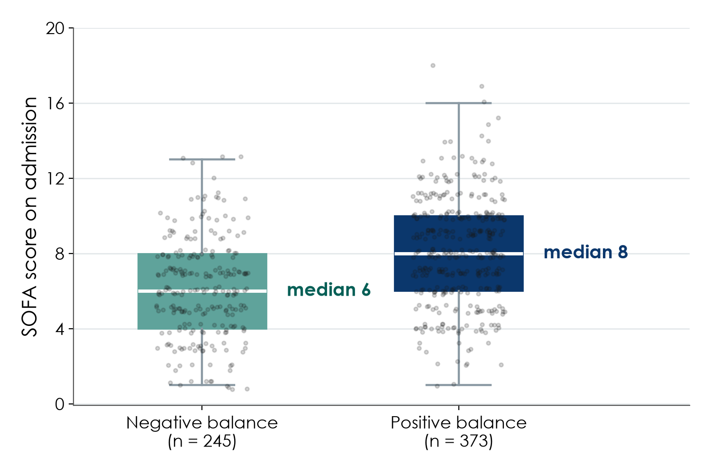{.neu-fig-side}
:::
::::

::: {.neu-takeaway}
**KEY MESSAGE** Dots plus box show the overlap and the shift: confounding you can see.
:::

::: {.notes}
Teaching point: the 'dots plus box' figure from 5.3, applied to FLUID-ICU.

SOFA score on admission: median 6 (IQR 4 to 8) in the negative-balance group vs 8 (6 to 10) in the positive-balance group. Every dot is a patient, so the reader sees the overlap AND the shift.

This single picture is the visual proof of confounding by indication in this dataset.

Ask: why a boxplot and not a bar of the mean SOFA? Expected: SOFA is a score with a skewed distribution; the bar would hide the spread and the overlap.
:::

## The skewed outcome: ICU stay in survivors (Q5)

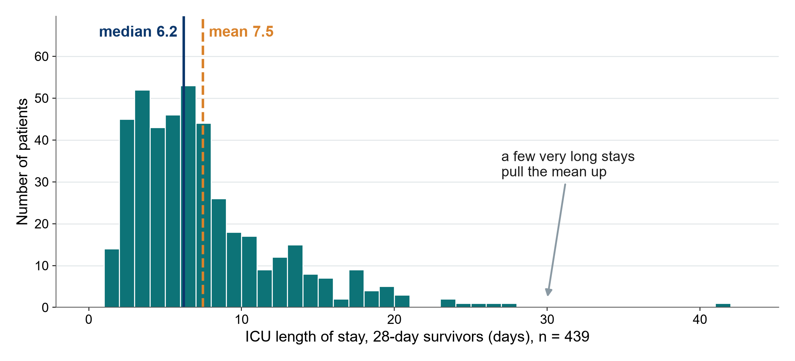{.neu-fig}

::: {.neu-takeaway}
**KEY MESSAGE** Mean 7.5 vs median 6.2 days: report the median and IQR.
:::

::: {.notes}
Teaching point: the length-of-stay picture from 5.3 is true in FLUID-ICU too.

ICU stay among the 439 survivors is right-skewed: a few very long stays pull the mean (7.5 days) above the median (6.2 days). Across all patients: mean 7.3, median 6.0.

Group 5's question (Q5) is about this outcome; they will report medians (IQR), compare groups with the Mann-Whitney test, and use a log scale in the model (Session 6).

Ask: which group most needs this slide? Expected: group 5, but every group reports at least one skewed variable in Table 1.
:::

## Read your group's Table 1 (worksheet)

::: {.neu-banner style="--c:#0D7377"}
GROUP WORK · 10 min
:::

:::: {.columns}
::: {.column width="60%"}
::: {.neu-activity-steps style="--c:#0D7377"}
1. Open your results pack: Table 1 and the figures
2. For three variables: which summary is used, and why?
3. Were the groups alike at the start? Name the biggest difference
4. Write two sentences describing the patients, as in a Results section
5. One group reads its sentences aloud
:::
:::
::: {.column width="40%"}
::: {.neu-side .plain style="--c:#0D7377"}
Check

- n per column?
- Units in labels?
- Median for skewed?
- Missing reported?
:::
:::
::::

::: {.neu-output style="--c:#0D7377"}
**OUTPUT** Two Results sentences describing your group's patients (exercise 6)
:::

::: {.notes}
Group worksheet, 10 minutes (7 work, 3 feedback). Session 5 exercises, exercise 6; model answers in s5\_solutions.md.

All five results packs contain the same Table 1 by fluid-balance group (Q5's also has the survivors). Groups practise reading it.

Model description sentences: 'Of 620 enrolled patients, 618 had a computable day-3 fluid balance; 373 (60.4%) had a positive balance. Patients with a positive balance were more severely ill at admission (median SOFA 8 vs 6; vasopressor 55.0% vs 24.9%; mechanical ventilation 57.9% vs 39.6%).'

Listen for: correct summaries (mean vs median), no interpretation of 'significance' in Table 1, and the realisation that severity differs between groups.

These sentences go straight into the manuscript's Results (Session 7).
:::

## Proposal builder 5: what a good one contains

::: {.neu-intro}
Example from the running example (restrictive fluids trial).
:::

:::: {.neu-cards style="--n:4"}
::: {.neu-card .plain style="--c:#0D7377"}
[Variables table]{.neu-card-title}

- Outcome: 28-day death (binary)
- Exposure: restrictive vs usual
- Confounders: age, SOFA, lactate
:::
::: {.neu-card .plain style="--c:#0B376C"}
[Mini-CRF]{.neu-card-title}

- 6-10 items
- units and time points
- 'unknown' options
:::
::: {.neu-card .plain style="--c:#5FA39B"}
[Data dictionary]{.neu-card-title}

- 3-5 rows: name, label,
- type, unit/codes,
- allowed values
:::
::: {.neu-card .plain style="--c:#0070C0"}
[Data management]{.neu-card-title}

- EDC or double entry
- coded IDs, audit trail
- backups, sharing statement
:::
::::

::: {.neu-takeaway}
**KEY MESSAGE** Today: what you will collect and how you will keep it safe.
:::

::: {.notes}
Show for 1 minute before groups start, so they see the expected level.

Variables table: primary outcome, exposure (or intervention), 3-5 confounders, each with its type. This table drives everything else.

Mini-CRF: 6 to 10 items that collect exactly those variables, with units, time points and 'unknown' options (the worked example).

Data dictionary: 3 to 5 rows with short variable names, labels, types, units or codes, and allowed values.

Data-management plan: one or two sentences: EDC or paper with double entry, coded IDs with a separately locked linking log, audit trail, backups, and a data-sharing statement in the consent form.

Next Saturday (Session 6) the groups add the sample size, the analysis plan and the missing-data plan.
:::

## Proposal builder 5: variables, CRF and data management

::: {.neu-banner style="--c:#055F56"}
PROPOSAL BUILDER · 30 min
:::

:::: {.columns}
::: {.column width="60%"}
::: {.neu-activity-steps style="--c:#055F56"}
1. Variables table: outcome, exposure, 3-5 confounders, each with its type (8 min)
2. Mini-CRF: 6-10 items with units, time points and 'unknown' options (10 min)
3. Data dictionary: 3-5 rows + one validation rule (6 min)
4. Data-management plan: EDC or double entry, IDs, backups, sharing (6 min)
:::
:::
::: {.column width="40%"}
::: {.neu-side .plain style="--c:#055F56"}
Use these tools

- Variable-type tree
- Good vs bad CRF items
- FLUID-ICU data dictionary
- Worksheet: exercise 8
:::
:::
::::

::: {.neu-output style="--c:#055F56"}
**OUTPUT** Proposal Part 3 (first half) written into the group template
:::

::: {.notes}
Proposal builder 5: 30 minutes. Groups write into Part 3 of the proposal template; the worksheet (Session 5 exercises, exercise 8) has the same headings.

Call the time at 8, 18, 24 and 30 minutes.

Facilitators circulate (one per two or three groups) and ask: Is your primary outcome a number, a category or time-to-event? Does each CRF item have a unit and a time point? Who will enter the data and where will it be stored?

Use the FLUID-ICU data dictionary as a model: groups have just seen what a real one looks like.

Common problems: too many CRF items (keep to 10); confounders that are actually outcomes; names and IDs in the same file; no plan for backups.

At 2:55, stop for the wrap-up.
:::

## Key words of the day

::: {.neu-intro}
Twelve words you should now be able to explain to a colleague.
:::

:::: {.neu-cards style="--n:4"}
::: {.neu-card .plain style="--c:#0D7377"}
[Collect]{.neu-card-title}

- Variable type
- CRF
- Data dictionary
:::
::: {.neu-card .plain style="--c:#0B376C"}
[Protect]{.neu-card-title}

- Validation check
- Audit trail
- Cleaning log
:::
::: {.neu-card .plain style="--c:#5FA39B"}
[Describe]{.neu-card-title}

- Median (IQR)
- Mean (SD)
- Skewed
:::
::: {.neu-card .plain style="--c:#0070C0"}
[Show]{.neu-card-title}

- Table 1
- Dots + box
- n (%)
:::
::::

::: {.neu-takeaway}
**KEY MESSAGE** If one word is unclear, ask now or look it up in the glossary.
:::

::: {.notes}
Key words of the day (2 minutes). Point to each word and ask the room for a one-line definition; correct gently.

Variable type: number vs category, and the five subtypes. CRF: the form that collects the data. Data dictionary: one row per variable, with type, unit/codes and allowed values.

Validation check: a rule that flags impossible values (range, consistency, logic, completeness). Audit trail: the record of who changed what, when and why. Cleaning log: the list of every correction made to the raw data (FLUID-ICU).

Median (IQR) for skewed data, mean (SD) for symmetric data; skewed = long tail.

Table 1: baseline characteristics by group; dots + box: show every patient; n (%): how categories are reported.

All terms are in the EN-VN glossary in Course/References.
:::

## Session 5 recap

::: {.neu-intro}
Three messages to take home.
:::

:::: {.neu-cards style="--n:3"}
::: {.neu-card .plain style="--c:#0D7377"}
[1. Design the data]{.neu-card-title}

- Clear CRF items
- Data dictionary first
- Checks at entry
:::
::: {.neu-card .plain style="--c:#0B376C"}
[2. Keep it clean]{.neu-card-title}

- Never edit raw data
- Log every correction
- Backups, coded IDs
:::
::: {.neu-card .plain style="--c:#5FA39B"}
[3. Describe honestly]{.neu-card-title}

- Shape decides the summary
- Show every patient
- Table 1 that stands alone
:::
::::

::: {.neu-takeaway}
**KEY MESSAGE** Good analysis starts with good data, described honestly.
:::

::: {.notes}
Session recap (2 minutes). Ask three volunteers to give one example for each card from today.

Design the data: the worked CRF item, the data dictionary, validation rules.

Keep it clean: FLUID-ICU showed what real data look like before cleaning and why the cleaning log matters.

Describe honestly: median vs mean, dots instead of dynamite plots, a Table 1 a reader understands without the text.

Next Saturday (Session 6): from the sample to an answer: confidence intervals, p-values, tests, regression, survival and missing data, all run live on FLUID-ICU.
:::

## Wrap-up and homework

::: {.neu-banner style="--c:#1F5C7A"}
DISCUSSION · 5 min
:::

:::: {.columns}
::: {.column width="60%"}
::: {.neu-activity-steps style="--c:#1F5C7A"}
1. Key words and recap (previous two slides)
2. Exit question: one data-quality problem found in FLUID-ICU, and how it was fixed
3. Homework: finish the CRF and data dictionary rows of your proposal
4. Read your group's results pack (Table 1 and figures) before Session 6
:::
:::
::: {.column width="40%"}
::: {.neu-side .plain style="--c:#1F5C7A"}
Next Saturday: Session 6

- Confidence intervals, p-values
- Choosing a test
- Regression and survival
- Missing data
- Your dataset results
:::
:::
::::

::: {.neu-output style="--c:#1F5C7A"}
**OUTPUT** Exit sentence on a sticky note
:::

::: {.notes}
Wrap-up: 5 minutes, including the key-words and recap slides.

Exit question on a sticky note: name one data-quality problem found in the raw FLUID-ICU data and how the cleaning fixed it. Read a few at the start of Session 6.

Homework: finish the CRF and data-dictionary rows of the proposal; read the group's results pack (Table 1, figures); optional exercises from the Session 5 worksheet.

Thank the room: today was a lot of new vocabulary; next Saturday builds directly on it.
:::

## Extra slides: Session 5

:::: {.neu-statement}
::: {.neu-big}
Extra slides: use if time allows, or for self-study.
:::

::: {.neu-sub}
Not needed to follow Session 6
:::
::::

::: {.notes}
EXTRA: the slides after this point are optional. Use them if the room is ahead of time, or point participants to them for self-study (they are in the handout deck).
:::

## Extra: Coding, versions, backups and data sharing

::: {.neu-intro}
Four habits that protect your data and your future paper.
:::

:::: {.neu-cards style="--n:4"}
::: {.neu-card .plain style="--c:#0D7377"}
[Coding]{.neu-card-title}

- Codes, not free text
- Study ID, not names
- Codes in the dictionary
:::
::: {.neu-card .plain style="--c:#0B376C"}
[Versions]{.neu-card-title}

- Raw file: read-only
- Dated copies:
- data\_2026-03-12\_v2
:::
::: {.neu-card .plain style="--c:#5FA39B"}
[Backups]{.neu-card-title}

- 3 copies, 2 media,
- 1 off-site (encrypted)
- Test a restore
:::
::: {.neu-card .plain style="--c:#0070C0"}
[Data sharing]{.neu-card-title}

- Journals ask for a
- data-sharing statement
- Plan it at the start
:::
::::

::: {.neu-takeaway}
**KEY MESSAGE** Never edit the raw file: keep it, copy it, date it, back it up.
:::

::: {.notes}
EXTRA: Teaching point: four habits that cost little and save studies.

Coding: store categories as numeric codes defined in the data dictionary (1 = lung, 2 = urine...). Use a study ID for each patient; names and hospital numbers stay in a separate, locked linking log.

Versions: the raw data file is never edited; it is set to read-only. Every cleaning step creates a new, dated copy (data\_2026-03-12\_v2) and a short log of what changed. Then any result can be traced back.

Backups: the 3-2-1 rule: three copies, on two different media, one off-site, encrypted. A backup you have never restored is only a hope.

Data-sharing statement: most journals now require one (Sessions 7-8). Example wording: 'De-identified participant data and the data dictionary will be available from the corresponding author on reasonable request after publication, subject to ethics approval.' Write it into the consent form and protocol NOW, or you may not be allowed to share later.

Ask: if your laptop were stolen tonight, would your study survive? Expected: an uncomfortable silence. Good.

Timing: 2 minutes.
:::

## Extra: Three more chart crimes, and how to fix them

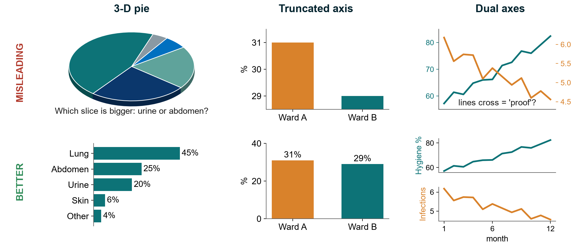{.neu-fig}

::: {.neu-takeaway}
**KEY MESSAGE** Bars start at zero, one axis per graph, and no 3-D effects.
:::

::: {.notes}
EXTRA: Teaching point: three distortions you will see in posters, reports and papers. Top row misleading, bottom row fixed.

3-D pie: the tilt makes slices at the front look bigger; the eye cannot compare angles well. Ask: which slice is bigger, urine or abdomen? Then show the sorted bar chart: 25% vs 20%, instantly clear.

Truncated axis: the y-axis starts at 28.5%, so a 2-point difference in mortality (31% vs 29%) looks like a tripling. Bars must start at zero. (Line charts may zoom in, but say so.)

Dual axes: two different y-axes scaled by the author make any two lines cross wherever the author wants, suggesting 'hand hygiene went up, so infections went down'. Better: two panels sharing the time axis, and remember correlation is not causation (6.3).

All data here are simulated.

Ask: where have you seen a truncated axis recently? Expected: hospital dashboards, pharmaceutical advertisements, news.

Timing: 2 minutes.
:::
