# Session 6 · Analyse: from sample to answer

## Week 6 · Saturday

- Recap quiz on Session 5 (10 min)
- 6.1 From sample to population: CI, p-value, power, sample size, choosing a test
- 6.2 Compare groups in the course dataset (live R demo)
- 6.3 Relationships and models: regression, Kaplan-Meier and Cox
- 6.4 Model the course dataset: adjusted OR, Cox HR, missing data, the SAP
- Proposal builder 6: sample size, analysis plan, missing-data plan

::: {.notes}
Welcome back. Last Saturday (Session 5) we collected, cleaned and described the data. Today we ANALYSE: how a sample answers a question about a population, and how to read the numbers a computer gives us.

Key promise: still no formulas. Every idea is a picture, a worked example from the running example, then a one-minute check.

The course dataset FLUID-ICU comes back twice: in 6.2 (comparing groups) and 6.4 (models, survival and missing data). Each group interprets its own results pack; those interpretations become the Results section of the manuscript in Weeks 7-8.

Timing: recap 0:00, 6.1 at 0:10, 6.2 at 0:50, break at 1:10, 6.3 at 1:25, 6.4 at 2:00, proposal builder at 2:25, wrap-up at 2:55.

This is the most technical session of the course. Go slowly; drop extra slides, not checks.
:::

## Recap quiz: Session 5 in three questions

::: {.neu-banner style="--c:#6C3483"}
QUICK QUIZ · 10 min
:::

:::: {.columns}
::: {.column width="60%"}
::: {.neu-activity-steps style="--c:#6C3483"}
- Q1. ICU length of stay in 300 patients is right-skewed. Which summary goes in Table 1?
- Q2. A CRF item reads 'Lactate: \_\_\_\_'. Name two things missing.
- Q3. In the raw FLUID-ICU data, one age was 210. Which check catches it, and what goes in the cleaning log?
- Answer alone (2 min), then compare with your neighbour (2 min)
:::
:::
::: {.column width="40%"}
::: {.neu-side .plain style="--c:#6C3483"}
Answers (reveal after)

- Q1: median (IQR)
- Q2: unit (mmol/L), time point, 'not done' option
- Q3: range check; the value, the correction, the reason, who and when
:::
:::
::::

::: {.neu-output style="--c:#6C3483"}
**OUTPUT** Everyone back on track with data types, CRF items and cleaning
:::

::: {.notes}
Purpose: wake up Session 5 and catch anyone who missed it. No marks.

Run it: read each question aloud; 2 minutes alone, 2 with a neighbour, then reveal.

Q1: median (IQR), because the mean is pulled by a few very long stays.

Q2: the unit (mmol/L), the time point (at ICU admission? highest in 24 h?), and a 'not done' option; also the number of decimal places.

Q3: a range check (allowed range from the data dictionary). In FLUID-ICU it was patient FLU-529: the value was set to missing and a query sent to the site. The cleaning log records the patient ID, the original value, what was done (here: set to missing), the reason (source document checked) and who did it when.

Read three or four exit sentences from Session 5 before starting 6.1.

Timing: 10 minutes.
:::

## 6.1 From sample to population, without fear

:::: {.neu-statement}
::: {.neu-big}
We study a few patients to learn about many.
:::

::: {.neu-sub}
6.1 From sample to population  \|  40 minutes
:::
::::

::: {.notes}
Section 6.1 opener (40 minutes: sample and population, confidence intervals, p-values, a check, errors and power, sample size with a live demo, choosing a test, multiple comparisons, a second check).

Key message: statistics exists because we cannot study every patient with septic shock in the world. We study a sample and use statistics to say how far our answer might be from the truth.

Reassure: today you learn to READ confidence intervals and p-values correctly. That is more than many published authors manage.

Transition: we study a sample of 40, 400 or 620 patients; how far is our estimate from the truth? The dance of the confidence intervals shows it (the sample-and-population picture is an extra slide).
:::

## The dance of the confidence intervals

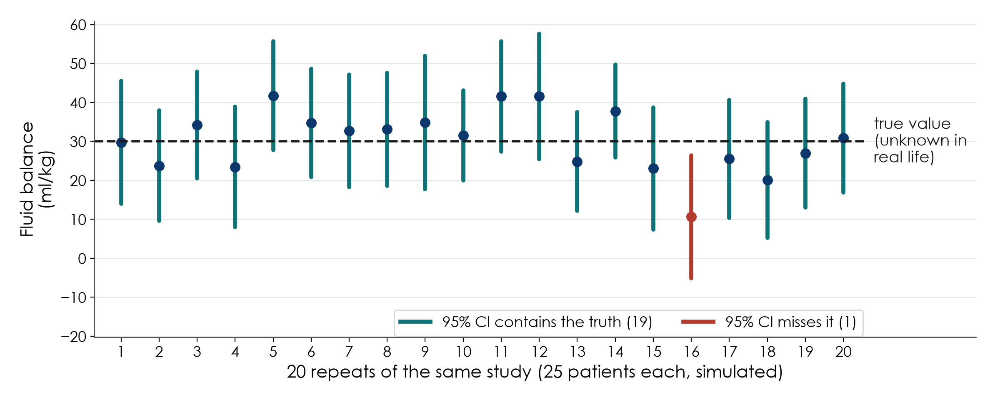{.neu-fig}

::: {.neu-takeaway}
**KEY MESSAGE** About 95 of 100 such intervals capture the truth. We never know which ones.
:::

::: {.notes}
Teaching point: this is the most important picture of the day. Take your time.

We simulated the same study 20 times, 25 patients each, from a population where the true mean fluid balance is 30 ml/kg (dashed line). Each study gives a different estimate (dot) and a different 95% CI (vertical line). The intervals 'dance'.

19 of the 20 intervals contain the true value; one (red) misses it. That is what '95%' means: the METHOD captures the truth in about 95% of studies.

In real life you run ONE study, you see ONE interval, and you cannot see the dashed line. You do not know if yours is one of the lucky 19 or the unlucky one.

Practical reading: a 95% CI is the range of values for the true effect that are compatible with our data. Narrow interval = precise; wide interval = imprecise.

Common misinterpretation: 'there is a 95% probability that the true value lies in THIS interval'. Strictly, the 95% refers to the method over many repeats. For teaching at this level, 'a range of plausible values' is the safe wording.

Ask: what makes the intervals shorter? Expected: more patients, less variability between patients.
:::

## The p-value in one picture

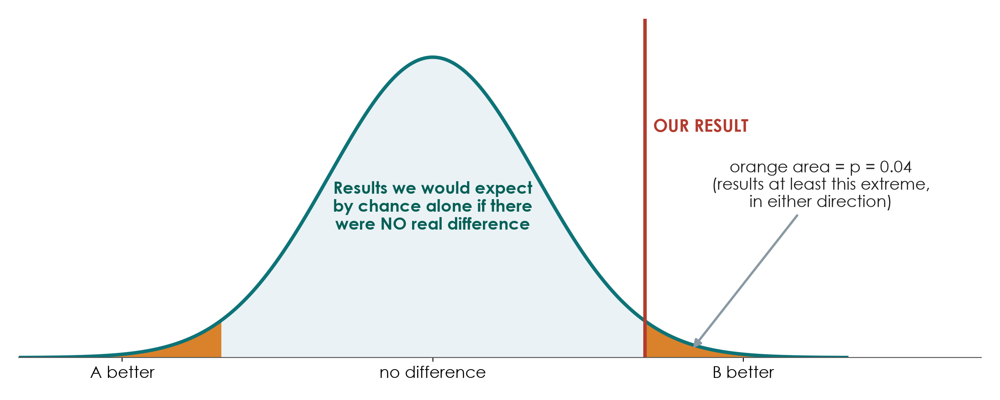{.neu-fig}

::: {.neu-takeaway}
**KEY MESSAGE** p = how surprising our result would be if there were truly no difference.
:::

::: {.notes}
Teaching point: start by imagining that there is NO real difference between the groups (the null hypothesis). Even then, chance alone produces results that scatter around 'no difference': that is the bell curve.

Now place OUR result on the picture. The p-value is the orange area: the proportion of results at least as extreme as ours (in either direction) that chance alone would produce if there were no real difference.

p = 0.04 means: if there were truly no difference, results this extreme or more would happen about 4 times in 100 studies. That is fairly surprising, so we doubt the 'no difference' assumption.

p = 0.42 (Paper 1) means: results like this would be common even with no real difference. Not surprising, so no evidence against 'no difference'. But not proof of 'no difference' either.

The 0.05 cut-off is a convention, not a law of nature. p = 0.049 and p = 0.051 are practically the same evidence.

Avoid saying 'the p-value is the probability that the result is due to chance'; see the next slide.

Ask: does a small p-value tell you the effect is big? Expected: no. That is misinterpretation number 2.
:::

## Five common p-value mistakes

::: {.neu-intro}
Each of these sentences appears in published papers. All are wrong.
:::

:::: {.neu-cards style="--n:5"}
::: {.neu-card .plain style="--c:#0D7377"}
['Chance of H0']{.neu-card-title}

- p is NOT the chance
- that there is no effect
:::
::: {.neu-card .plain style="--c:#0B376C"}
['Big effect']{.neu-card-title}

- Small p is NOT
- a big or important effect
:::
::: {.neu-card .plain style="--c:#5FA39B"}
['No effect']{.neu-card-title}

- p \> 0.05 is NOT
- proof of no effect
:::
::: {.neu-card .plain style="--c:#0070C0"}
['A trend']{.neu-card-title}

- p = 0.08 is NOT
- 'almost significant'
:::
::: {.neu-card .plain style="--c:#055F56"}
['Only p']{.neu-card-title}

- p alone is NOT enough:
- give effect + 95% CI
:::
::::

::: {.neu-takeaway}
**KEY MESSAGE** Report the effect size with its 95% CI. The p-value is a supporting actor.
:::

::: {.notes}
Teaching point: five misinterpretations, one per card. Ask the room to vote 'true or false' on each before you explain.

1. 'p = 0.03 means a 3% chance that the null hypothesis is true.' False: p is calculated ASSUMING the null is true; it cannot also be the probability of the null.

2. 'p \< 0.001, so the effect is large.' False: with thousands of patients, a clinically trivial difference can have a tiny p-value. Look at the effect size and ask if it matters to patients.

3. 'p = 0.42, so the two strategies are equivalent.' False: Paper 1 is the perfect example. The wide CI shows we simply do not know.

4. 'p = 0.08 shows a trend towards benefit.' False: a p-value does not move towards anything. The blueprint's appraisal checklist asks exactly this: no 'trend' for p = 0.42.

5. 'Results: p = 0.02.' Not enough: the reader needs the size of the effect and its uncertainty. Paper 2 does it right: HR 2.13 (95% CI 1.48-3.06), p \< 0.001.

These five statements are in the true/false exercise in the participant worksheet.
:::

## Check your understanding: CI and p-value

::: {.neu-banner style="--c:#6C3483"}
QUICK QUIZ · 3 min
:::

:::: {.columns}
::: {.column width="60%"}
::: {.neu-activity-steps style="--c:#6C3483"}
- 'HR 2.13 (95% CI 1.48-3.06)': the data are compatible with a true HR from about 1.5 to 3.1. True or false?
- 'p = 0.42, so the two strategies are equivalent.' True or false?
- 'p = 0.03 means a 3% chance that there is no effect.' True or false?
- 'A larger study usually gives a narrower CI.' True or false?
:::
:::
::: {.column width="40%"}
::: {.neu-side .plain style="--c:#6C3483"}
Answers

- True
- False: we do not know
- False: p assumes no effect
- True
:::
:::
::::

::: {.neu-output style="--c:#6C3483"}
**OUTPUT** Everyone can read a CI and avoid the classic p-value mistakes
:::

::: {.notes}
Check your understanding (3 minutes). Show of hands or coloured cards (green true, red false) for each statement, then reveal.

1. True: the practical reading of a 95% CI (Paper 2, day 2).

2. False: absence of evidence is not evidence of absence; Paper 1's CI was wide (-15.2 to 41.6).

3. False: p is calculated assuming there is no effect; it is not the probability of no effect.

4. True: more patients, more precision.

If the room splits on 2 or 3, go back to the p-value picture for one minute; this is the most important misunderstanding to fix today.
:::

## Type I and type II errors: the fire alarm

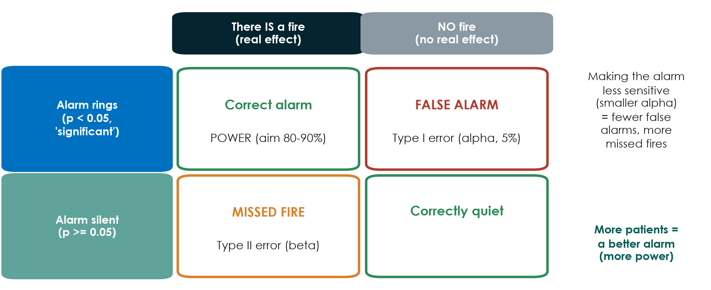{.neu-fig}

::: {.neu-takeaway}
**KEY MESSAGE** Alpha = risk of a false alarm; power = chance of detecting a real effect.
:::

::: {.notes}
Teaching point: a statistical test is like a fire alarm. Two things can go wrong.

Type I error (false alarm): the alarm rings but there is no fire. We conclude the treatment works when it does not. We accept a 5% risk of this: that is alpha = 0.05.

Type II error (missed fire): there IS a fire but the alarm stays silent. The treatment works but our study fails to show it. Its risk is called beta.

Power = 1 - beta = the chance that the alarm rings when there really is a fire. We usually aim for 80% or 90%.

Trade-off: making the alarm less sensitive (smaller alpha) gives fewer false alarms but more missed fires, unless you buy a better alarm: more patients.

Clinical link: a small trial that is 'negative' may simply be a missed fire. Paper 1 was a pilot designed to detect a large difference; a smaller real difference could easily be missed.

Ask: which error is worse when testing a new, expensive and risky drug? And for a cheap, safe intervention? There is no single right answer; let the room debate for one minute.
:::

## Sample size: bigger effect, less noise = fewer patients

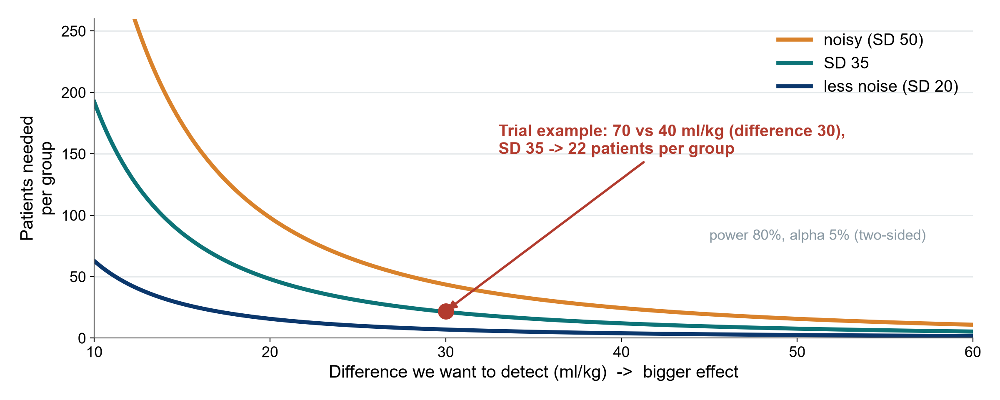{.neu-fig}

::: {.neu-takeaway}
**KEY MESSAGE** Sample size depends on the effect you hope to detect and on the noise.
:::

::: {.notes}
Teaching point: you need fewer patients when (1) the difference you want to detect is bigger and (2) patients vary less (less noise, smaller SD). Alpha and power are usually fixed at 5% and 80-90%.

Read the curves: for a 30 ml/kg difference with SD 35, you need 22 patients per group (red dot). Halve the difference to 15 ml/kg and you need about four times as many (86 per group). With noisier data (SD 50), every point moves up.

Running example: this is exactly the calculation in Paper 1's methods: they expected 70 vs 40 ml/kg with SD 35, 80% power, alpha 5% two-sided: 22 per group, 44 in total, increased by 10% for deaths to 50 patients.

The hardest input is the expected effect: take it from previous studies, pilot data, or the smallest difference that would change practice (the minimal clinically important difference). Do not choose it just to make the number small.

Common mistake: 'we included all patients from last year' with no calculation; reviewers will ask about power.

Transition: let us do this live.
:::

## Live demo: an online sample-size calculator

::: {.neu-banner style="--c:#B5651D"}
LIVE DEMO · 8 min
:::

:::: {.columns}
::: {.column width="60%"}
::: {.neu-activity-steps style="--c:#B5651D"}
- Open a free online calculator (for example OpenEpi) in the browser
- Two means: 70 vs 40 ml/kg, SD 35, power 80%, alpha 5% → 22 per group
- Two proportions: mortality 40% vs 30% → about 356 per group
- Change one input at a time and watch the number move
- Offline fallback: the Neudata sample-size spreadsheet
:::
:::
::: {.column width="40%"}
::: {.neu-side .plain style="--c:#B5651D"}
What changes n?

- Smaller effect: n goes UP
- More noise (SD): n goes UP
- More power: n goes UP
- Add 10-20% for drop-outs
:::
:::
::::

::: {.neu-output style="--c:#B5651D"}
**OUTPUT** Groups know which 4 numbers they need for their own sample-size statement
:::

::: {.notes}
Live demo, 8 minutes. If short of time, do Steps 2 and 3 only. Full script with expected outputs in Course/Demos/s6\_demo.md.

Step 1: open the calculator. Say: any free, reputable calculator works; what matters is understanding the inputs.

Step 2: two independent means, reproduce Paper 1: mean 1 = 70, mean 2 = 40, SD 35 in both groups, alpha 5% two-sided, power 80%, ratio 1. Expected: 22 per group (44 total). Add 10% for deaths: 50. Matches the paper.

Step 3: two proportions (our real question: 28-day mortality). Usual care 40%, restrictive 30%, power 80%, alpha 5%. Expected: about 356 per group without continuity correction (about 376 with it). Different methods give slightly different numbers; that is normal.

Step 4: change one input at a time: power 90% (n rises to about 477 per group); difference 40% vs 35% (n rises above 1400 per group). Ask the room to predict the direction before you click.

Step 5: if the internet fails, open Course/Resources/tools/sample\_size\_calculator.xlsx and show the same three examples; the yellow cells are inputs.

Key message: Paper 1 needed 50 patients for fluid balance, but a mortality trial needs hundreds per group. The outcome you choose changes everything.

Do NOT let participants calculate; they watch and predict.
:::

## Choosing a test: one decision chart

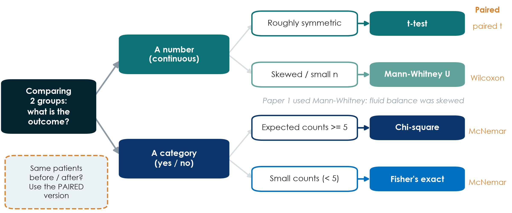{.neu-fig}

::: {.neu-takeaway}
**KEY MESSAGE** Outcome type + shape + paired or not = the right test.
:::

::: {.notes}
Teaching point: for comparing two groups, two questions choose the test.

Question 1: what is the outcome? A number (continuous) or a category (yes/no)?

Question 2a (numbers): is it roughly symmetric? Then t-test (compares means). Skewed or very small sample? Then Mann-Whitney U (compares distributions/ranks; often reported with medians).

Question 2b (categories): are the expected counts in each cell 5 or more? Then chi-square. Small counts? Then Fisher's exact test.

Paired data (same patients measured before and after, or matched pairs): use the paired version: paired t-test, Wilcoxon signed-rank, McNemar.

Running example: Paper 1 used a Mann-Whitney test because fluid balance is skewed: consistent with reporting medians.

Three or more groups: ANOVA or Kruskal-Wallis. Mention only; ask a statistician.

This chart is one of the take-home tools of the course. It is also the basis of the 'choose the test' exercise.

Ask: comparing the proportion with AKI in 24 vs 24 patients, with only 3 and 7 events? Expected: Fisher's exact (small counts).
:::

## Paired or unpaired? Same patients or different patients

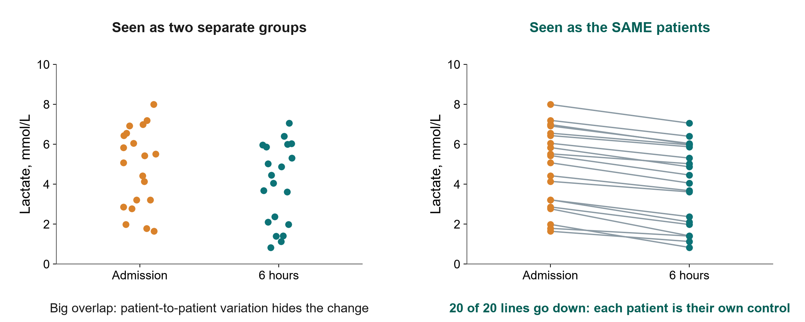{.neu-fig}

::: {.neu-takeaway}
**KEY MESSAGE** Same patients measured twice = paired test; different patients = unpaired.
:::

::: {.notes}
Teaching point: the decision chart asked 'paired or not?'. This picture shows why it matters.

Simulated lactate in 20 patients at ICU admission and 6 hours later. Left: drawn as two separate clouds, the before and after values overlap heavily; patients differ a lot from each other, and that variation hides the change.

Right: the same numbers, but each patient's two values are joined. Every line goes down. Each patient is their own control, so the between-patient noise disappears. A paired test (paired t-test, or Wilcoxon signed-rank if skewed) uses exactly this, and has much more power.

Paired designs: before/after in the same patients, crossover trials, matched pairs (Paper 2 matched patients 1:1 on a propensity score and analysed the pairs).

Common mistake: analysing before/after data with an unpaired t-test. It throws away the pairing and can miss a real change.

Ask: you measure pain scores in 30 patients before and after a new analgesia protocol. Paired or unpaired? Expected: paired.

Timing: 2 minutes.
:::

## Multiple comparisons: the jelly-bean problem

:::: {.columns}
::: {.column width="38%"}
::: {.neu-side-notes}
### What to do

- Pre-specify ONE primary outcome
- Label the rest as exploratory
- Adjust, e.g. Bonferroni: 0.05 / number of tests
- Report every test you ran
:::
:::
::: {.column width="62%"}
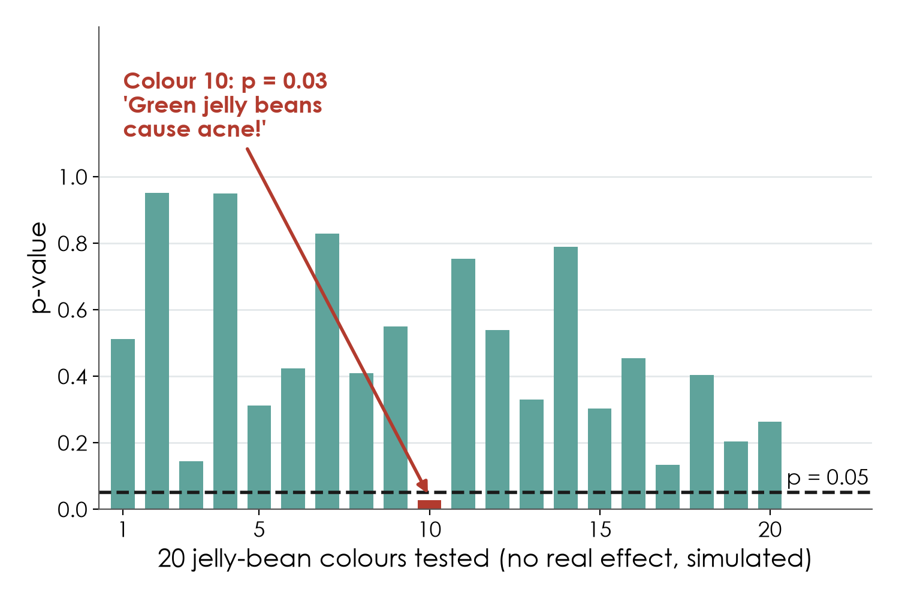{.neu-fig-side}
:::
::::

::: {.neu-takeaway}
**KEY MESSAGE** Test 20 things and one will be 'significant' by chance alone.
:::

::: {.notes}
Teaching point: every test carries a 5% risk of a false alarm. Run many tests and false alarms become almost certain.

The picture (inspired by a famous cartoon): researchers test whether jelly beans cause acne. Nothing is found overall, so they test 20 colours separately. With no real effect anywhere (simulated), one colour comes out at p = 0.03, and the headline reads 'Green jelly beans cause acne!'.

With 20 independent tests and no real effect, the chance of at least one p \< 0.05 is about 64%.

Clinical versions: 10 secondary outcomes, 8 subgroups, 5 time points, several lab values, all tested and only the 'significant' one reported.

Remedies (side panel): pre-specify one primary outcome in the protocol or SAP (6.4); call everything else exploratory; adjust the threshold when many tests answer the same question (Bonferroni: 0.05 divided by the number of tests, so 0.0025 for 20 tests); and report all tests, not just the winners.

Ask: a paper reports 12 subgroups and highlights the one with p = 0.04. How convinced are you? Expected: not very; it needs confirmation.

Timing: 2 minutes.
:::

## Check your understanding: which test?

::: {.neu-banner style="--c:#6C3483"}
QUICK QUIZ · 3 min
:::

:::: {.columns}
::: {.column width="60%"}
::: {.neu-activity-steps style="--c:#6C3483"}
- ICU stay (skewed) in positive vs negative fluid balance groups
- 28-day death (yes/no) in 300 vs 300 patients
- Lactate at admission and 6 h later in the same 40 patients
- Dialysis (yes/no): 2 of 24 vs 5 of 24 patients
:::
:::
::: {.column width="40%"}
::: {.neu-side .plain style="--c:#6C3483"}
Answers

- Mann-Whitney U
- Chi-square
- Paired t-test
- Fisher's exact
:::
:::
::::

::: {.neu-output style="--c:#6C3483"}
**OUTPUT** Everyone can use the decision chart
:::

::: {.notes}
Check your understanding (3 minutes). For each scenario, the room calls out the test using the decision chart (number or category? shape or counts? paired?).

1. Mann-Whitney U: numerical, skewed, two independent groups (this is the FLUID-ICU ICU-stay question).

2. Chi-square: binary outcome, two large independent groups.

3. Paired t-test (or Wilcoxon signed-rank if the changes are skewed): same patients twice.

4. Fisher's exact: binary outcome, very small counts.

Transition: now we run exactly these tests on the course dataset (6.2).
:::

## 6.2 Compare groups in the course dataset

:::: {.neu-statement}
::: {.neu-big}
Choose the test from the outcome, then read the result as an effect with a CI.
:::

::: {.neu-sub}
6.2 Compare groups in the course dataset  \|  20 minutes
:::
::::

::: {.notes}
Section 6.2 opener (20 minutes: a 6-minute live demo of the tests, the results table, a worked example, then 7 minutes for groups to interpret their own comparison).

Key message: the decision chart from 6.1, applied to FLUID-ICU. All comparisons here are UNADJUSTED: remember Table 1 (the positive-balance group was sicker).
:::

## Live demo: comparing two groups in R

::: {.neu-banner style="--c:#B5651D"}
LIVE DEMO · 6 min
:::

:::: {.columns}
::: {.column width="60%"}
::: {.neu-activity-steps style="--c:#B5651D"}
- Open 03\_compare.R
- Age (symmetric): t-test
- SOFA and lactate (skewed): Mann-Whitney
- 28-day death (yes/no): 2x2 table and chi-square
- The common mistake: a t-test on skewed ICU stay
:::
:::
::: {.column width="40%"}
::: {.neu-side .plain style="--c:#B5651D"}
Decision chart

- Number or category?
- Symmetric or skewed?
- Paired or not?
- Effect + 95% CI
:::
:::
::::

::: {.neu-output style="--c:#B5651D"}
**OUTPUT** Everyone has seen the test chosen from the outcome type
:::

::: {.notes}
Live demo, 6 minutes. Full script: Course/Demos/s6\_demo.md (Part B), using Course/Data/R/03\_compare.R.

For each comparison, ask the room to name the test BEFORE you run it (decision chart).

Show: age with a t-test; SOFA and lactate with Mann-Whitney (note that 91 patients have no lactate, so n changes); 28-day death as a 2x2 table: 134/373 (35.9%) vs 45/245 (18.4%), chi-square p \< 0.001; the 'wrong' t-test on skewed ICU stay in survivors (difference in means 2.7 days) next to the Mann-Whitney / Hodges-Lehmann difference (2.5 days).

If R fails: use the next slide (all results in one table).
:::

## FLUID-ICU: four outcomes, four comparisons

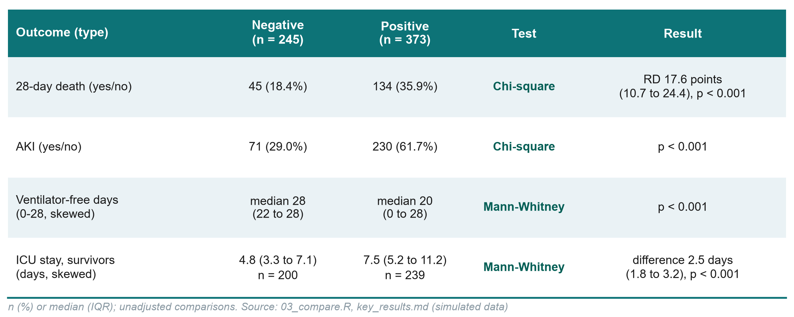{.neu-fig}

::: {.neu-takeaway}
**KEY MESSAGE** Every outcome is worse in the positive-balance group, before any adjustment.
:::

::: {.notes}
Teaching point: the right test for each outcome type, and the result read as an effect.

28-day death (binary): 134/373 (35.9%) vs 45/245 (18.4%); risk difference 17.6 percentage points (95% CI 10.7 to 24.4); RR 1.96; chi-square p \< 0.001.

AKI (binary): 230/373 (61.7%) vs 71/245 (29.0%); chi-square p \< 0.001.

Ventilator-free days (count 0-28, piled up at 0 and 28): median 20 (0 to 28) vs 28 (22 to 28); Mann-Whitney p \< 0.001.

ICU stay in survivors (skewed): median 7.5 (5.2 to 11.2) vs 4.8 (3.3 to 7.1) days; Mann-Whitney p \< 0.001; Hodges-Lehmann difference 2.5 days (95% CI 1.8 to 3.2).

All unadjusted: the positive-balance group was sicker at the start (Table 1). These differences mix the effect of fluid with the effect of severity. That is why 6.4 adjusts.

Ask: which number would you put in the abstract for death: p \< 0.001, or the risk difference with its CI? Expected: the risk difference with its CI (and later the adjusted OR).
:::

## Worked example: reading the mortality comparison

::: {.neu-intro}
Q1, unadjusted: positive vs negative fluid balance by day 3.
:::

:::: {.neu-steps}
::: {.neu-step style="--c:#0D7377"}
[Risks]{.neu-step-label}

- 134/373 = 35.9%
- 45/245 = 18.4%
:::
::: {.neu-step style="--c:#0B376C"}
[Difference]{.neu-step-label}

- 17.6 percentage points
- 95% CI 10.7 to 24.4
:::
::: {.neu-step style="--c:#5FA39B"}
[Ratio]{.neu-step-label}

- RR 1.96:
- about twice the risk
:::
::: {.neu-step style="--c:#0070C0"}
[Test]{.neu-step-label}

- Chi-square
- p \< 0.001
:::
::: {.neu-step style="--c:#055F56"}
[But...]{.neu-step-label}

- Unadjusted:
- sicker patients
:::
::::

::: {.neu-takeaway}
**KEY MESSAGE** Report the effect and its CI; then ask what else could explain it.
:::

::: {.notes}
Worked example (3 minutes), the only calculation step: the 2x2 table from Session 4 applied to the dataset.

Risks: 134 of 373 patients with a positive balance died (35.9%); 45 of 245 with a negative balance (18.4%).

Risk difference: 35.9 - 18.4 = 17.6 percentage points (rounding), 95% CI 10.7 to 24.4: far from 0.

Risk ratio: 35.9 / 18.4 = 1.96: about twice the risk.

Test: chi-square p \< 0.001: such a difference would be very surprising if there were no difference.

But: this is a cohort; patients with a positive balance were sicker (SOFA 8 vs 6). The crude comparison cannot separate fluid from severity.

Model sentence: 'Twenty-eight-day mortality was 35.9% in patients with a positive balance and 18.4% in those with a negative balance (risk difference 17.6 percentage points, 95% CI 10.7 to 24.4).'
:::

## Interpret your group's comparison

::: {.neu-banner style="--c:#0D7377"}
GROUP WORK · 7 min
:::

:::: {.columns}
::: {.column width="60%"}
::: {.neu-activity-steps style="--c:#0D7377"}
- Find your outcome in your results pack (comparison table)
- Which test was used, and why that test?
- Write the result as an effect with its 95% CI (or medians with IQR)
- Write one sentence for your Results section: no 'significant' alone, no causal words
- Note one reason the comparison could be biased
:::
:::
::: {.column width="40%"}
::: {.neu-side .plain style="--c:#0D7377"}
Avoid

- p-value alone
- 'proves', 'causes'
- 'trend' for p \> 0.05
- Forgetting the n
:::
:::
::::

::: {.neu-output style="--c:#0D7377"}
**OUTPUT** One Results sentence for your outcome (exercise 4)
:::

::: {.notes}
Group worksheet, 7 minutes (5 work, 2 feedback). Session 6 exercises, exercise 4; model answers in s6\_solutions.md.

Model sentences by question:

Q1: mortality 35.9% vs 18.4% (risk difference 17.6 points, 95% CI 10.7 to 24.4).

Q2: AKI 61.7% vs 29.0% (positive vs negative balance), chi-square p \< 0.001.

Q3: ventilator-free days median 20 (0 to 28) vs 28 (22 to 28), Mann-Whitney p \< 0.001.

Q4: median lactate 3.1 (2.2 to 4.5) mmol/L in non-survivors vs 2.3 (1.6 to 3.4) in survivors.

Q5: ICU stay in survivors median 7.5 (5.2 to 11.2) vs 4.8 (3.3 to 7.1) days; Hodges-Lehmann difference 2.5 days (95% CI 1.8 to 3.2).

Reason for bias (all groups): confounding by indication; the positive-balance group was sicker.

Then break.
:::

## Break

::: {.neu-banner style="--c:#8A99A3"}
BREAK · 15 min
:::

:::: {.columns}
::: {.column width="60%"}
::: {.neu-activity-steps style="--c:#8A99A3"}
- Stretch, coffee, fresh air
- Groups: note one question about your comparison results
- We restart with 6.3: relationships and models
:::
:::
::: {.column width="40%"}
::: {.neu-side .plain style="--c:#8A99A3"}
After the break

- Correlation
- Linear and logistic regression
- Adjustment
- Kaplan-Meier and Cox
- Your dataset models
:::
:::
::::

::: {.notes}
Break: 15 minutes. Start again on time (1:25).

During the break: open 04\_models.R and 05\_missing.R on the projector laptop and check the fallback figures for 6.4.

Collect the questions groups noted about their comparison results; answer the common ones at the start of 6.3.
:::

## 6.3 Relationships and models (concepts)

:::: {.neu-statement}
::: {.neu-big}
You do not need to run a model to read one.
:::

::: {.neu-sub}
6.3 Relationships and models  \|  35 minutes
:::
::::

::: {.notes}
Section 6.3 opener (35 minutes: correlation, linear and logistic regression, which model, adjustment, reading a regression table with a 5-minute check, overfitting, survival analysis and the running-example forest plot; interaction, null values and prediction/ML are extra slides).

Key message: every model answers the same question in a different language: how is the outcome related to the exposure, and how sure are we? You need four things to read any of them: what the outcome is, which model goes with it, what the number means (coefficient, OR or HR) and where the 'no effect' value is.

Link back to Session 4: confounding by indication. Models are one of the main tools for dealing with measured confounders in observational studies.

Transition: start with the simplest relationship, two numbers on a scatter plot.
:::

## Correlation: how closely two numbers move together

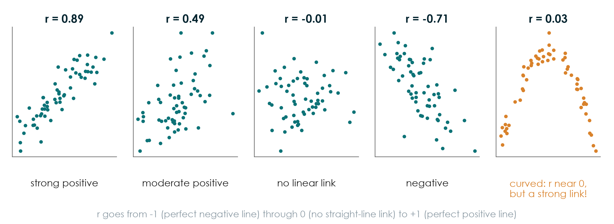{.neu-fig}

::: {.neu-takeaway}
**KEY MESSAGE** r measures straight-line association, from -1 to +1. Always look at the plot.
:::

::: {.notes}
Teaching point: the correlation coefficient r summarises a scatter plot of two numerical variables in one number.

Read the panels: r near +1, points close to a rising line; r around 0.5, a loose cloud with a trend; r near 0, no straight-line link; r negative, one goes up while the other goes down.

The last panel is the trap: r is near 0, but there is a very strong curved relationship (think of an optimal dose, or U-shaped mortality with blood pressure). r only measures STRAIGHT-line association, so always look at the plot.

Rough guide (not a rule): 0.1 weak, 0.3 moderate, 0.5 or more strong, but the clinical meaning matters more.

r has a p-value too; with many patients, a tiny r like 0.1 can be 'significant' and still useless.

Ask: which panel looks like age versus systolic blood pressure in adults? Expected: moderate positive.

Timing: 2 minutes.
:::

## Linear regression: the best straight line

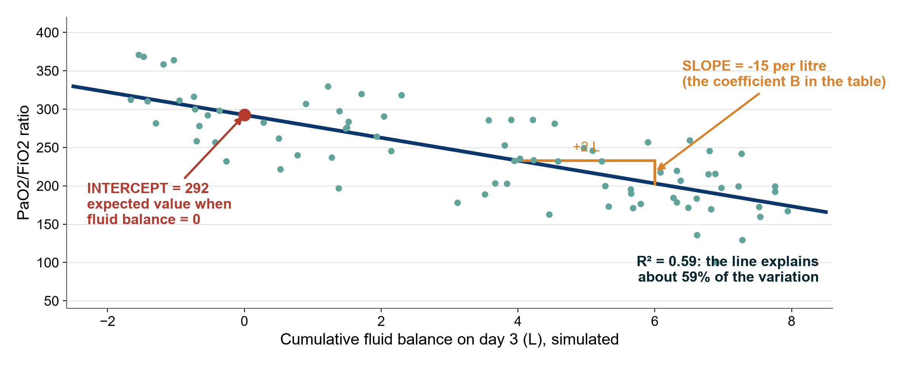{.neu-fig}

::: {.neu-takeaway}
**KEY MESSAGE** Slope = change in the outcome per unit of exposure; R² = how much the line explains.
:::

::: {.notes}
Teaching point: linear regression draws the straight line that best fits the points, for a NUMERICAL outcome.

Intercept: the expected outcome when the exposure is 0 (here a P/F ratio of about 292 with a fluid balance of 0). Often not interesting on its own.

Slope: how much the outcome changes for each one-unit increase in the exposure: here about -15 per extra litre of fluid balance. This is the coefficient B you read in a regression table, with its 95% CI; null value 0.

R²: the proportion of the variation in the outcome explained by the line (here about 0.6). Many other factors explain the rest.

Adding more variables to the model (multivariable regression) gives each slope 'adjusted for' the others: the same idea as the stratification picture, done by the computer.

Data are simulated; this is not a claim about real oxygenation.

Common mistake: extrapolating the line beyond the data (a fluid balance of 20 L would predict a negative P/F ratio).

Ask: in the table, B = -15 (95% CI -19 to -11). What does it mean? Expected: each extra litre is associated with a P/F ratio about 15 points lower, plausibly 11 to 19.

Timing: 2 minutes.
:::

## Logistic regression: an S-curve for yes/no outcomes

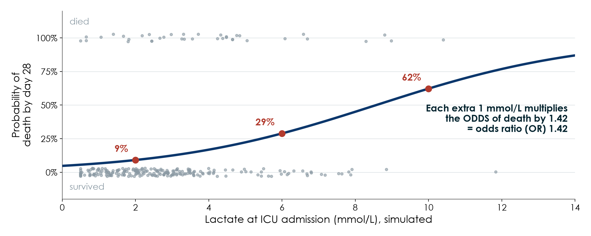{.neu-fig}

::: {.neu-takeaway}
**KEY MESSAGE** Logistic regression turns a yes/no outcome into an odds ratio per unit of exposure.
:::

::: {.notes}
Teaching point: when the outcome is yes/no (died by day 28), a straight line does not work: probabilities cannot go below 0% or above 100%. Logistic regression fits an S-shaped curve instead.

Grey dots: each simulated patient, at the top if they died and at the bottom if they survived. Blue curve: the probability of death at each lactate level: about 9% at 2 mmol/L, 29% at 6, 62% at 10.

The model reports an odds ratio: here each extra 1 mmol/L multiplies the ODDS of death by 1.42. The OR is constant along the curve; the change in probability is not (small at the ends, large in the middle).

This is the OR you read in a logistic regression table, with its 95% CI; null value 1. Adjusted ORs come from a model with several variables.

Common mistake: 'OR 1.42 means 42% more deaths'. It is 42% higher odds per unit; the risk change depends on where you are on the curve.

Ask: what would the curve look like if lactate had no effect? Expected: a flat horizontal line, OR = 1.

Timing: 2 minutes.
:::

## Which model? It depends on the outcome

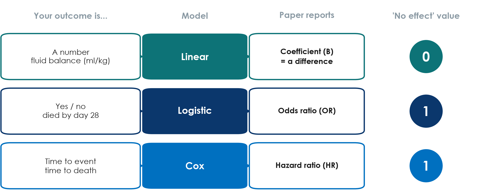{.neu-fig}

::: {.neu-takeaway}
**KEY MESSAGE** Outcome type tells you the model and the number to read.
:::

::: {.notes}
Teaching point: the outcome decides the model, just as it decided the test.

A number (fluid balance in ml/kg): linear regression. Reports a coefficient (B or beta), which is a DIFFERENCE in the outcome per unit of the exposure. No effect = 0.

Yes/no (died by day 28): logistic regression. Reports an odds ratio (OR). No effect = 1.

Time to event (time to death, with patients censored if still alive at day 28): Cox regression. Reports a hazard ratio (HR). No effect = 1. Paper 2 used Cox regression.

Why 0 vs 1? A difference of 0 means no difference; a ratio of 1 means the two groups are the same (2 divided by 2 = 1).

Common mistake: looking for 'does the CI cross 0' in an OR table. For ratios it is 1.

Ask: a study of length of stay in days analysed as a number. Which model and which no-effect value? Expected: linear, 0. (A statistician may choose a different model for skewed data, but the reading principle is the same.)
:::

## What 'adjusted' means: compare like with like

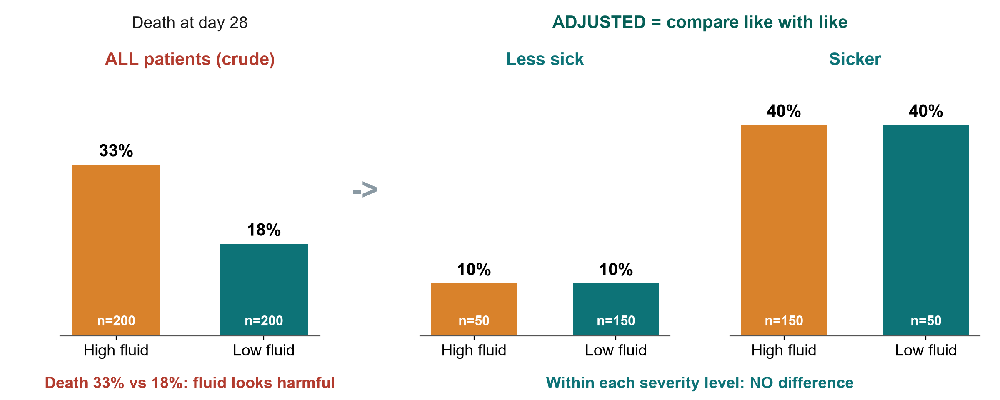{.neu-fig}

::: {.neu-caption}
Simulated numbers
:::

::: {.neu-takeaway}
**KEY MESSAGE** Adjusting = comparing patients who are alike on the confounders.
:::

::: {.notes}
Teaching point: adjusting for a confounder means comparing patients who are alike on that confounder.

Left (crude): patients who received a lot of fluid died more often (33% vs 18%). It looks as if fluid is harmful.

Right (stratified by severity): among less sick patients, 10% died with high or low fluid. Among sicker patients, 40% died either way. Within each level of severity there is NO difference.

What happened? Sicker patients were both more likely to receive more fluid (150 of 200) and more likely to die. Severity created the crude difference: confounding by indication, exactly as on Session 4.

A regression model does the same thing as this split, but for many confounders at once (age, SOFA, lactate, ...). Paper 2 used propensity-score matching for the same purpose.

Limitation: you can only adjust for confounders you MEASURED. Unmeasured confounding remains; only randomisation protects against it.

Ask: after adjustment, can we say fluid does not cause death? Expected: not with certainty; other unmeasured confounders may exist, and these numbers are simulated.
:::

## Reading a regression table, row by row

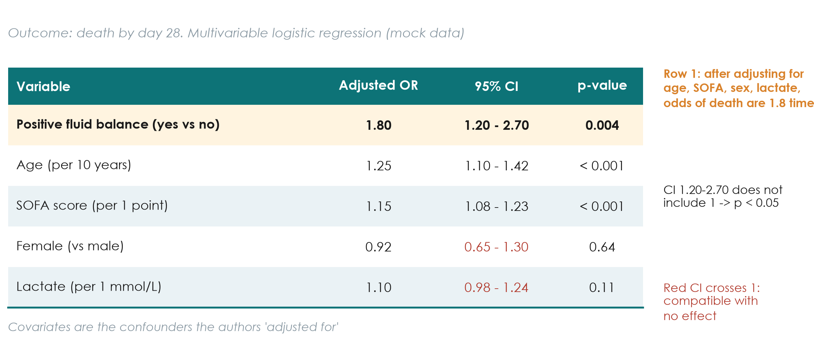{.neu-fig}

::: {.neu-takeaway}
**KEY MESSAGE** Read each row: comparison, effect, 95% CI, does the CI include the null?
:::

::: {.notes}
Teaching point: a regression table has one row per variable in the model. Read each row in four steps.

1. The comparison: 'positive fluid balance (yes vs no)'; 'age per 10 years'; 'female vs male'. Always check the reference group and the unit.

2. The effect: OR 1.80. Patients with positive fluid balance had 1.8 times the odds of death, adjusted for the other variables in the table.

3. The 95% CI: 1.20 to 2.70. Plausible values from a 20% to a 170% increase in odds.

4. The null: does the CI include 1? No, so p \< 0.05 (p = 0.004). For female sex (0.65-1.30) and lactate (0.98-1.24) the CI includes 1, shown in red: compatible with no association.

Per-unit rows: OR 1.15 per SOFA point means each extra point multiplies the odds by 1.15; 5 extra points multiply them by about 2 (1.15 to the power 5).

This table is mock data, built so the p-values agree with the CIs.

Wording: 'associated with', not 'caused'. It is an observational analysis.

Common mistake: interpreting an OR of 1.8 as '80% more deaths'. It is 80% higher ODDS; when the outcome is common (like ICU death), the risk ratio is smaller than the OR.
:::

## Check your understanding: read a regression table

::: {.neu-banner style="--c:#0D7377"}
GROUP WORK · 5 min
:::

:::: {.columns}
::: {.column width="60%"}
::: {.neu-activity-steps style="--c:#0D7377"}
- Worksheet 'Session 6, exercise 5': a mock table on hospital-acquired delirium
- For each row: comparison, effect, 95% CI, does it include 1?
- Write ONE plain-language sentence for the main exposure
- Homework: exercise 6 (read a Kaplan-Meier curve)
:::
:::
::: {.column width="40%"}
::: {.neu-side .plain style="--c:#0D7377"}
The 4-step reading

- What is compared?
- How big is the effect?
- How wide is the CI?
- Does it cross 1 (or 0)?
:::
:::
::::

::: {.neu-output style="--c:#0D7377"}
**OUTPUT** One correct plain-language sentence per pair
:::

::: {.notes}
Check your understanding in pairs (5 minutes: 3 in pairs, 2 feedback). Table and answer key in Course/Practicals/s6\_exercises.md and Course/Solutions/s6\_solutions.md (exercise 5).

What to listen for: correct reference groups ('vs no'), the word 'odds' rather than 'risk', 'associated with' rather than 'causes', and correct reading of CIs that include 1.

Model sentence for the main exposure: 'After adjusting for age, sex and severity, patients who received benzodiazepines had about twice the odds of developing delirium (OR 2.1, 95% CI 1.4 to 3.2).'

The authors' conclusion question and the Kaplan-Meier exercise (6) can be homework.

Transition: next, why too many variables can mislead (overfitting), then survival analysis.
:::

## Overfitting: too many variables for too few events

:::: {.columns}
::: {.column width="38%"}
::: {.neu-side-notes}
### Why stepwise misleads

- Picks variables by p-value
- Finds chance 'predictors'
- Effects too big, CIs too narrow
- Better: choose confounders in advance
:::
:::
::: {.column width="62%"}
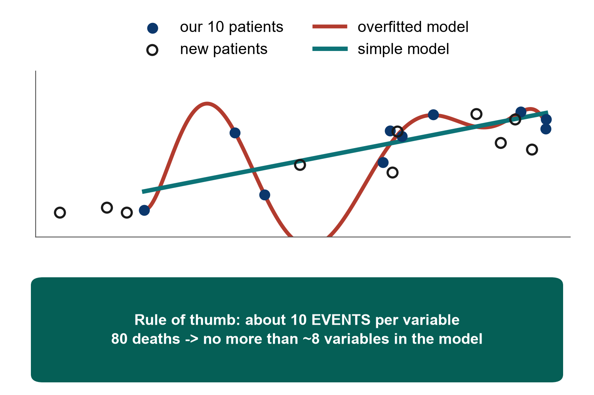{.neu-fig-side}
:::
::::

::: {.neu-takeaway}
**KEY MESSAGE** Plan about 10 events per variable and choose variables by knowledge, not p-values.
:::

::: {.notes}
Teaching point: a model with too many variables for the number of events learns the noise in YOUR data, not the truth. It fits your patients perfectly and fails on the next ones.

Picture: the red curve passes through all 10 filled points (our data) but misses the hollow points (new patients); the simple teal line does better on new patients.

Rule of thumb: about 10 events (deaths, not patients) per variable in a logistic or Cox model. 80 deaths: no more than about 8 variables, including categories counted separately. Some modern guidance asks for more.

Stepwise selection (side panel): letting the software add or drop variables by p-value. It looks objective but it multiplies the multiple-comparison problem, keeps chance findings, overestimates the effects that survive, gives CIs that are too narrow, and different samples pick different variables.

Better: choose confounders in advance from clinical knowledge and the literature (a causal diagram helps), write them in the SAP (6.4), and keep within the events-per-variable budget.

Ask: a study of 40 deaths reports a model with 15 variables chosen by stepwise selection. Concerns? Expected: overfitting; results will not replicate.

Timing: 2 minutes.
:::

## Survival analysis starts with censoring

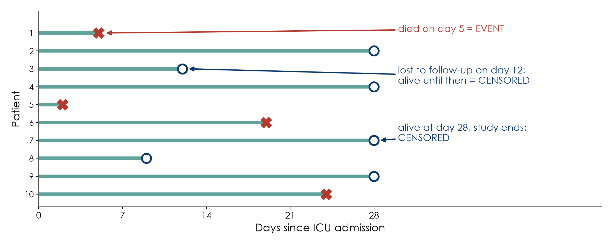{.neu-fig}

::: {.neu-takeaway}
**KEY MESSAGE** Censored patients still count: they tell us they survived up to that day.
:::

::: {.notes}
Teaching point: time-to-event outcomes need special methods because not everyone has the event while we watch.

Each line is a patient followed from ICU admission. A red X is the event (death). A circle is a censored patient: we stop watching before any event, because they were lost to follow-up (transferred, phone unreachable) or because the study ended at day 28.

Censored does NOT mean excluded. Patient 3 tells us they were alive for 12 days, and survival methods use that information. Dropping them, or counting them as survivors for the full 28 days, both bias the result.

Why not just compare the proportion dead at day 28? You can, if everyone is followed to day 28. Survival methods also use WHEN deaths happen and handle unequal follow-up.

Assumption: censoring is unrelated to the outcome (being transferred out for palliative care would break it). Sound familiar? It is the same logic as missing data (6.4).

Ask: a patient is discharged home on day 9 and not contacted again. Event or censored? Expected: censored at day 9.

Timing: 2 minutes.
:::

## How to read a Kaplan-Meier curve

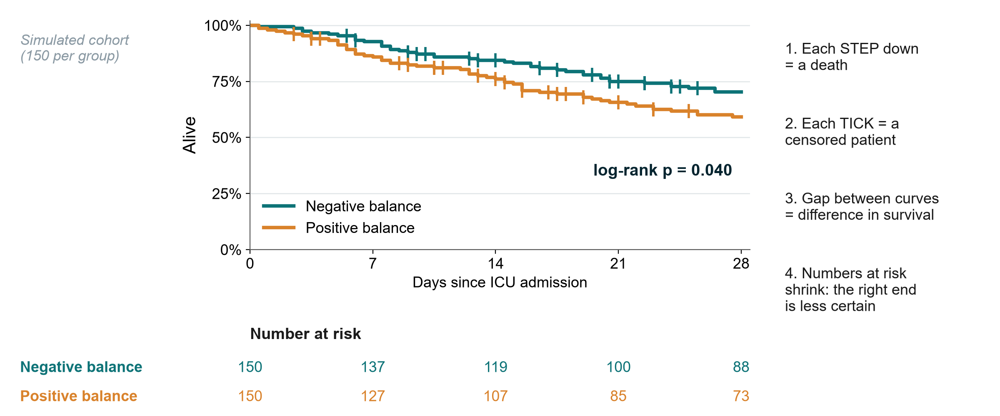{.neu-fig}

::: {.neu-takeaway}
**KEY MESSAGE** Read the steps, the ticks, the gap, and always the numbers at risk.
:::

::: {.notes}
Teaching point: the Kaplan-Meier (KM) curve shows the proportion still alive over time in each group, using censored patients correctly.

Walk through the four reading steps on the right of the figure:

1. Each step down is one or more deaths.

2. Each small vertical tick is a censored patient.

3. The vertical gap between curves is the difference in survival at that time; here about 70% vs 59% alive at day 28 (simulated cohort, 150 per group, mirroring Paper 2's question).

4. The numbers at risk under the plot show how many patients are still being followed. As they shrink, the right end of the curve rests on few patients and becomes less certain. A figure without numbers at risk hides this; reviewers will ask for them.

The log-rank test compares the whole curves and gives a p-value (here p = 0.040). It does not give the size of the effect; that comes from the Cox model (section 6.4).

Paper 2 shows exactly this kind of figure (Kaplan-Meier survival to day 28 in its matched cohorts).

Ask: if the curves cross half-way, what does that suggest? Expected: the effect changes over time; the proportional-hazards assumption may not hold.

Timing: 3 minutes.
:::

## 6.4 Model the course dataset

:::: {.neu-statement}
::: {.neu-big}
Adjust for what you planned, read the CI, and be honest about the gaps.
:::

::: {.neu-sub}
6.4 Model the course dataset  \|  25 minutes
:::
::::

::: {.notes}
Section 6.4 opener (25 minutes: the SAP, crude vs adjusted OR, the adjusted model, Kaplan-Meier and Cox, missing lactate, complete-case vs multiple imputation, then a 7-minute group worksheet).

Key message: this is 6.3 (models) applied to FLUID-ICU, and the payoff of Weeks 5-6: you will SEE confounding by indication shrink an odds ratio.
:::

## The SAP came first

::: {.neu-intro}
SAP\_FLUID-ICU.md: written and signed before the database was locked.
:::

:::: {.neu-steps}
::: {.neu-step style="--c:#0D7377"}
[Primary]{.neu-step-label}

- 28-day death
- logistic regression, OR
:::
::: {.neu-step style="--c:#0B376C"}
[Confounders]{.neu-step-label}

- Age, SOFA, lactate,
- vasopressor, ventilation, CKD
:::
::: {.neu-step style="--c:#5FA39B"}
[Supportive]{.neu-step-label}

- Kaplan-Meier, log-rank
- Cox hazard ratio
:::
::: {.neu-step style="--c:#0070C0"}
[Subgroup]{.neu-step-label}

- ONE pre-specified:
- heart failure
:::
::: {.neu-step style="--c:#055F56"}
[Missing data]{.neu-step-label}

- Complete case +
- multiple imputation
:::
::::

::: {.neu-takeaway}
**KEY MESSAGE** Everything on the next slides was decided before anyone saw the results.
:::

::: {.notes}
Teaching point: the statistical analysis plan from 6.3 / Session 6 exists for FLUID-ICU. Show Course/Data/SAP\_FLUID-ICU.md on screen.

Primary analysis: 28-day mortality by multivariable logistic regression; effect measure: odds ratio with 95% CI; the crude OR and the risk difference are also reported.

Confounders chosen in advance from clinical knowledge (a simple causal diagram): age; severity (SOFA, lactate, vasopressor, mechanical ventilation); chronic kidney disease. Variables measured after day 3 (AKI, dialysis) are NOT adjusted for: they are outcomes or mediators.

Supportive analysis: Kaplan-Meier curves with numbers at risk, log-rank test, Cox model with the same confounders; proportional hazards checked.

One pre-specified effect modifier: heart failure (an extra slide shows the result).

Missing data: assessed and handled by complete case plus multiple imputation (m = 20) as sensitivity analysis.

Ask: why does writing this first protect the authors? Expected: nobody can accuse them of choosing the analysis that gave the 'best' p-value.
:::

## Confounding by indication, made visible

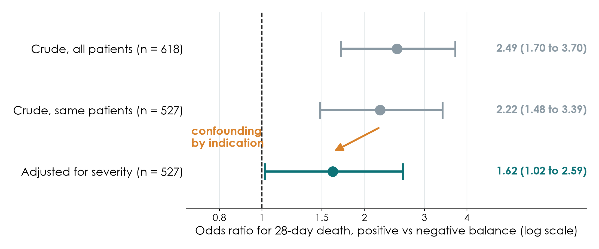{.neu-fig}

::: {.neu-takeaway}
**KEY MESSAGE** Crude OR 2.49 shrinks to 1.62 after adjusting for severity: still above 1.
:::

::: {.notes}
Teaching point: the key picture of the course dataset. Take 4 minutes.

Crude OR, all 618 patients: 2.49 (95% CI 1.70 to 3.70): positive balance looks strongly associated with death.

Crude OR in the 527 complete cases: 2.22 (1.48 to 3.39): same patients as the adjusted model, so the comparison is fair.

Adjusted OR (age, SOFA, lactate, vasopressor, ventilation, CKD), n = 527: 1.62 (95% CI 1.02 to 2.59), p = 0.044.

Why it shrinks: sicker patients receive more fluid and die more often. Part of the crude association was severity, not fluid. This is confounding by indication, exactly the stratification picture from 6.3, done by the model.

What remains: an adjusted association that is smaller and less precise; the lower CI limit is close to 1. It is compatible with a modest harm, or with almost no effect.

It is still an association: unmeasured confounding (severity we did not record) may remain.

Ask: if we had adjusted for AKI as well, would that be right? Expected: no; AKI happens after the fluid and may be on the pathway (a mediator), as the SAP says.
:::

## The adjusted model, as a forest plot

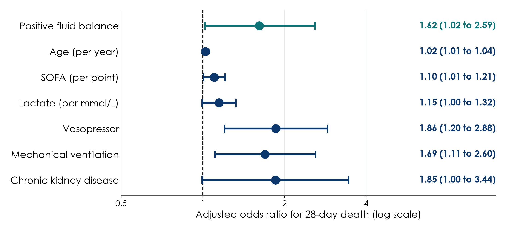{.neu-fig}

::: {.neu-takeaway}
**KEY MESSAGE** Read each row: comparison, OR, 95% CI, does it cross 1?
:::

::: {.notes}
Teaching point: the multivariable logistic model of Q1 drawn as a forest plot (all ORs adjusted for each other; n = 527).

Positive fluid balance: OR 1.62 (1.02 to 2.59).

The other rows are the confounders: severity markers (SOFA per point, lactate per mmol/L, vasopressor, ventilation), age per year, CKD. They are in the model to adjust; they are not the question. Do not over-interpret them (the 'Table 2 fallacy').

Notice the units: per year, per point, per mmol/L: a small OR per unit can be a large effect over many units.

Ask: which row would go in your abstract? Expected: only the exposure row (positive balance), with its CI.
:::

## Kaplan-Meier: survival to day 28 by fluid balance

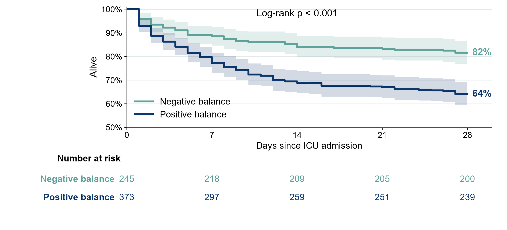{.neu-fig}

::: {.neu-takeaway}
**KEY MESSAGE** Day-28 survival 81.6% vs 64.1%, log-rank p \< 0.001: unadjusted.
:::

::: {.notes}
Teaching point: read a real Kaplan-Meier figure with the four steps from 6.3.

Steps down are deaths; most deaths happen in the first week.

The gap: day-28 survival 81.6% (negative balance) vs 64.1% (positive balance).

Numbers at risk under the plot: 245 and 373 at day 0, shrinking as patients die.

Log-rank test: p \< 0.001 (chi-square 21.4): the curves differ. But the log-rank test is unadjusted: the same confounding as the crude OR.

Ask: is the difference larger early or late? Expected: it opens in the first days and then the curves run roughly parallel, which is reassuring for the proportional-hazards assumption of the Cox model (next slide).
:::

## Cox model: the same story in hazard ratios

::: {.neu-intro}
Q1 supportive analysis (04\_models.R).
:::

:::: {.neu-cards style="--n:4"}
::: {.neu-card .plain style="--c:#0D7377"}
[Crude HR]{.neu-card-title}

- 2.17
- 95% CI 1.55 to 3.05
:::
::: {.neu-card .plain style="--c:#0B376C"}
[Adjusted HR]{.neu-card-title}

- 1.46
- 95% CI 1.00 to 2.13
- p = 0.053
:::
::: {.neu-card .plain style="--c:#5FA39B"}
[Assumption]{.neu-card-title}

- Proportional hazards:
- global test p = 0.10
- acceptable
:::
::: {.neu-card .plain style="--c:#0070C0"}
[Compare]{.neu-card-title}

- Adjusted OR 1.62, p = 0.044
- Adjusted HR 1.46, p = 0.053
- Same direction and size
:::
::::

::: {.neu-takeaway}
**KEY MESSAGE** p = 0.044 and p = 0.053 tell the same story: read the estimates and CIs.
:::

::: {.notes}
Teaching point: the Cox model gives a hazard ratio, adjusted for the same confounders.

Crude HR 2.17 (95% CI 1.55 to 3.05) shrinks to an adjusted HR of 1.46 (95% CI 1.00 to 2.13), p = 0.053: the same confounding as for the OR.

Proportional hazards checked: global test p = 0.10; no strong evidence against the assumption.

The big lesson: the logistic model gives p = 0.044 and the Cox model p = 0.053. One is 'significant', the other is not, but they say the same thing: a moderate association, imprecise, with a lower limit close to 1. Never let 0.05 decide whether you believe a finding (the five p-value mistakes, 6.1).

Ask: how would you write this in the Results? Expected: report both estimates with their CIs, and describe the association as modest and imprecise.
:::

## Why is it missing? MCAR, MAR and MNAR

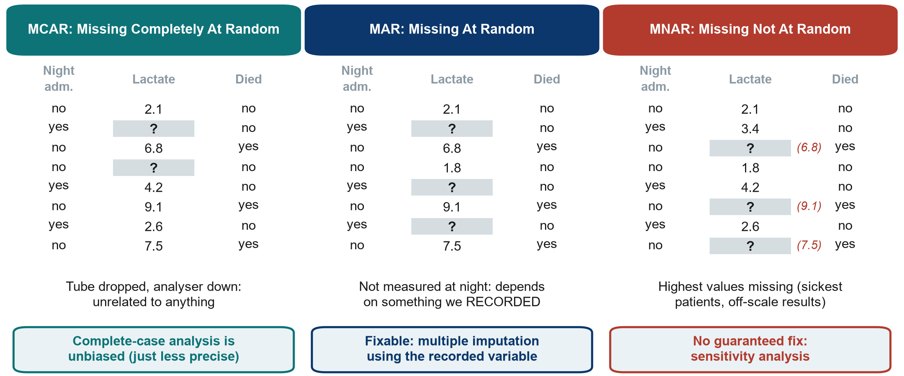{.neu-fig}

::: {.neu-takeaway}
**KEY MESSAGE** The reason data are missing decides how dangerous the gaps are.
:::

::: {.notes}
Teaching point: three mechanisms, shown on the same 8 patients with some lactate values missing.

MCAR, missing completely at random: a tube dropped, an analyser broke. Missingness has nothing to do with the patient. The remaining patients are a random subset; a complete-case analysis is unbiased, just less precise. Rare in practice.

MAR, missing at random (given what we recorded): lactate was not measured for night admissions. Missingness depends on something we HAVE in the data (admission time). Methods such as multiple imputation can use that recorded variable to correct the bias.

MNAR, missing not at random: the missing lactates are the highest ones (the sickest patients, values off the analyser's scale; red numbers we never see). Missingness depends on the missing value itself. No statistical method can fully fix this; we can only test how much it might matter (sensitivity analysis).

We can never prove which mechanism applies from the data alone; clinical knowledge of WHY values are missing is essential. Write the reasons down when you collect data.

Remember the first missing-data slide in 5.1: the sickest patients going missing is MNAR, the worst case.

Ask: day-28 outcome missing for patients transferred to another hospital. Which mechanism is most likely? Expected: possibly MNAR (sicker or improving patients transferred); at least MAR if transfer reason is recorded.

Timing: 2 minutes; then FLUID-ICU's own missing lactate.
:::

## Who is missing lactate? Not a random 15%

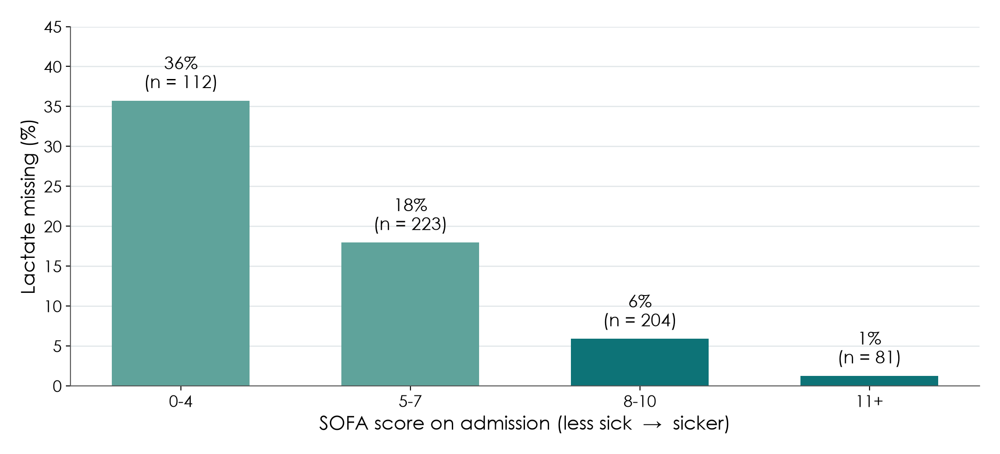{.neu-fig}

::: {.neu-takeaway}
**KEY MESSAGE** Lactate was missing mostly in less sick patients: not MCAR, but MAR is plausible.
:::

::: {.notes}
Teaching point: before handling missing data, ask WHY it is missing (previous slide: MCAR, MAR, MNAR).

Lactate is missing for 93 of 620 patients (15.0%). The figure shows the proportion missing by SOFA score: much higher in the least sick patients.

Patients without lactate had a median SOFA of 5 (4 to 6) vs 8 (6 to 10) in those with lactate, and lower mortality: 18/93 (19.4%) vs 161/527 (30.6%).

So the data are not missing completely at random (MCAR): a complete-case analysis drops mostly the less sick patients. Missingness depends on things we recorded (severity, ICU): missing at random (MAR) is plausible, which is the situation where multiple imputation works well.

Ask: clinically, why would lactate not be measured in the less sick? Expected: the clinician judged it unnecessary, or no point-of-care analyser in one ICU.
:::

## Complete case vs multiple imputation (Q4)

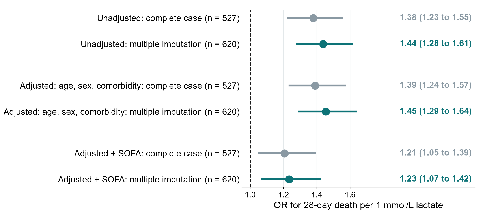{.neu-fig}

::: {.neu-takeaway}
**KEY MESSAGE** Multiple imputation keeps all 620 patients; the answer changes only modestly.
:::

::: {.notes}
Teaching point: the sensitivity analysis planned in the SAP.

Q4 (lactate and 28-day death), OR per 1 mmol/L adjusted for age, sex, diabetes, CKD and heart failure: complete case 1.39 (1.24 to 1.57), n = 527; multiple imputation 1.45 (1.29 to 1.64), n = 620. Adding SOFA: 1.21 (1.05 to 1.39) vs 1.23 (1.07 to 1.42).

Q1 primary model with multiple imputation (m = 20, n = 620): adjusted OR 1.70 (95% CI 1.09 to 2.64), p = 0.020, compared with 1.62 (1.02 to 2.59) in complete cases.

Interpretation: the conclusions do not depend on how the missing lactate was handled: a robust result. Had the two approaches disagreed strongly, we would have to say so.

Note also: the median lactate was 2.6 mmol/L in complete cases and 2.4 after imputation: the imputed values are lower, as expected, because the missing patients were less sick.

Ask: what would you write in the Methods? Expected: 'Missing lactate (15.0%) was handled by multiple imputation (20 data sets) as a sensitivity analysis; results were similar to the complete-case analysis.'
:::

## Interpret your group's model (worksheet)

::: {.neu-banner style="--c:#0D7377"}
GROUP WORK · 7 min
:::

:::: {.columns}
::: {.column width="60%"}
::: {.neu-activity-steps style="--c:#0D7377"}
- Find your crude and adjusted estimates in your results pack
- How much did adjustment change the estimate? Why?
- Does the adjusted 95% CI include 1 (or 0)?
- Look at the imputation result in your pack: close to the main one? (details in Level 2)
- Write two Results sentences: crude, then adjusted, with CIs
:::
:::
::: {.column width="40%"}
::: {.neu-side .plain style="--c:#0D7377"}
Words to use

- 'associated with'
- 'after adjustment for'
- '95% CI'
- not 'caused'
:::
:::
::::

::: {.neu-output style="--c:#0D7377"}
**OUTPUT** Two Results sentences for your model (exercise 8)
:::

::: {.notes}
Group worksheet, 7 minutes (5 work, 2 feedback). Session 6 exercises, exercise 8; model answers in s6\_solutions.md.

Key numbers by question (all in key\_results.md and the results packs):

Q1: crude OR 2.49 (1.70 to 3.70), adjusted 1.62 (1.02 to 2.59); Cox adjusted HR 1.46 (1.00 to 2.13); MI adjusted OR 1.70 (1.09 to 2.64).

Q2: AKI OR per 10 ml/kg crude 1.37 (1.27 to 1.47), adjusted 1.27 (1.16 to 1.40).

Q3: ventilator-free days per 10 ml/kg crude -1.48 (-1.84 to -1.13), adjusted -0.61 (-1.00 to -0.21) days.

Q4: lactate OR per 1 mmol/L adjusted CC 1.39 (1.24 to 1.57) vs MI 1.45 (1.29 to 1.64).

Q5: ICU stay ratio of geometric means crude 1.50 (1.34 to 1.68), adjusted 1.24 (1.10 to 1.39).

Pattern to point out: in every question the adjusted estimate is closer to 'no effect' than the crude one, the fingerprint of confounding by indication.

These sentences become the core of the Results section drafted in Session 7.
:::

## Proposal builder 6: what a good one contains

::: {.neu-intro}
Example from the running example (restrictive fluids trial).
:::

:::: {.neu-cards style="--n:4"}
::: {.neu-card .plain style="--c:#0D7377"}
[Sample size]{.neu-card-title}

- 40% vs 30% mortality
- power 80%, alpha 5%
- 356 per group + 10%
:::
::: {.neu-card .plain style="--c:#0B376C"}
[Analysis plan]{.neu-card-title}

- Describe: n (%), median (IQR)
- Compare: chi-square
- Report: RR + 95% CI
:::
::: {.neu-card .plain style="--c:#5FA39B"}
[Confounders]{.neu-card-title}

- Chosen in advance
- about 10 events
- per variable
:::
::: {.neu-card .plain style="--c:#0070C0"}
[Missing data]{.neu-card-title}

- Expected gaps + why
- Prevention
- CC + MI check
:::
::::

::: {.neu-takeaway}
**KEY MESSAGE** Today: how many patients, which analysis, and what if data are missing.
:::

::: {.notes}
Show for 1 minute before groups start.

Sample size: one sentence with the four inputs (expected values in each group, alpha, power) and the drop-out allowance: 'Assuming 28-day mortality of 40% with usual care and 30% with the restrictive strategy, 356 patients per group give 80% power at a two-sided alpha of 5%; allowing 10% loss to follow-up, we will recruit 396 per group.' (356 / 0.9 = 395.6, rounded up.)

Analysis plan in plain language: the summary for each variable type, the test or model for the primary outcome, the effect measure with its 95% CI.

Confounders: for observational designs, name them (from Part 2's bias section) within the events-per-variable budget; no stepwise selection.

Missing-data plan: expected missingness and why (MCAR / MAR / MNAR thinking), prevention (Session 5), and how missing data will be reported (how many, in whom). Imputation and sensitivity analyses are Level 2 topics.
:::

## Proposal builder 6: sample size and analysis plan

::: {.neu-banner style="--c:#055F56"}
PROPOSAL BUILDER · 30 min
:::

:::: {.columns}
::: {.column width="60%"}
::: {.neu-activity-steps style="--c:#055F56"}
- Sample-size statement: the 4 inputs and where they come from (8 min)
- Analysis plan: summary, test or model, effect measure + 95% CI (10 min)
- Confounders to adjust for, within about 10 events per variable (5 min)
- Missing-data plan: expected gaps, prevention, how missing data will be reported (7 min)
:::
:::
::: {.column width="40%"}
::: {.neu-side .plain style="--c:#055F56"}
Use these tools

- Sample-size spreadsheet
- Test decision chart
- FLUID-ICU SAP as a model
- Worksheet: exercise 9
:::
:::
::::

::: {.neu-output style="--c:#055F56"}
**OUTPUT** Proposal Part 3 completed in the group template
:::

::: {.notes}
Proposal builder 6: 30 minutes. Groups complete Part 3 of the proposal template; the worksheet (Session 6 exercises, exercise 9) has the same headings.

Call the time at 8, 18, 23 and 30 minutes.

Facilitators circulate and ask: Is your outcome a number, a category or time-to-event, so which test or model? Where does your expected effect size come from? What is most likely to be missing, and why (MCAR / MAR / MNAR thinking)?

The FLUID-ICU SAP is a good model: groups have just seen that it was written before the analysis.

Sample size: groups need the four inputs and a source, not necessarily a final number. Offer to run the spreadsheet for them.

Common problems: 'SPSS will be used' as the analysis plan; stepwise selection; no word on missing data; sample size = 'all patients we can get'.

At 2:55, stop for the wrap-up.
:::

## Key words of the day

::: {.neu-intro}
Twelve words you should now be able to explain to a colleague.
:::

:::: {.neu-cards style="--n:4"}
::: {.neu-card .plain style="--c:#0D7377"}
[Uncertainty]{.neu-card-title}

- 95% CI
- p-value
- Power
:::
::: {.neu-card .plain style="--c:#0B376C"}
[Comparing]{.neu-card-title}

- t-test / Mann-Whitney
- Chi-square
- Paired
:::
::: {.neu-card .plain style="--c:#5FA39B"}
[Models]{.neu-card-title}

- Adjusted OR
- Hazard ratio
- Censoring
:::
::: {.neu-card .plain style="--c:#0070C0"}
[Honesty]{.neu-card-title}

- SAP
- MCAR / MAR / MNAR
- Multiple imputation
:::
::::

::: {.neu-takeaway}
**KEY MESSAGE** If one word is unclear, ask now or look it up in the glossary.
:::

::: {.notes}
Key words of the day (2 minutes). Point to each word and ask the room for a one-line definition.

95% CI: range of plausible values. p-value: how surprising the data would be if there were no effect. Power: chance of detecting a real effect.

t-test / Mann-Whitney: compare a number between two groups (symmetric / skewed). Chi-square: compare proportions. Paired: same patients measured twice.

Adjusted OR: odds ratio after accounting for confounders. Hazard ratio: ratio of death rates over time (Cox). Censoring: follow-up ended without the event.

SAP: analysis plan written before seeing the data. MCAR / MAR / MNAR: why data are missing. Multiple imputation: filling gaps several times and pooling, honestly.

All terms are in the EN-VN glossary.
:::

## Session 6 recap

::: {.neu-intro}
Three messages to take home.
:::

:::: {.neu-cards style="--n:3"}
::: {.neu-card .plain style="--c:#0D7377"}
[Read the CI]{.neu-card-title}

- Effect + 95% CI
- Where is the null?
- p is a supporting actor
:::
::: {.neu-card .plain style="--c:#0B376C"}
[Adjust honestly]{.neu-card-title}

- Crude vs adjusted
- Confounders chosen
- in advance
:::
::: {.neu-card .plain style="--c:#5FA39B"}
[Plan first]{.neu-card-title}

- SAP before the data
- Missing data: report,
- handle, test
:::
::::

::: {.neu-takeaway}
**KEY MESSAGE** A good analysis is planned before, adjusted honestly and read through its CI.
:::

::: {.notes}
Session recap (2 minutes). Ask three volunteers for one example from today for each card.

Read the CI: the size, the direction, the precision; the null value 0 or 1; avoid the five p-value mistakes.

Adjust honestly: FLUID-ICU showed confounding by indication: the crude OR shrank after adjustment for severity. Confounders are chosen from knowledge, not by stepwise selection.

Plan first: the FLUID-ICU SAP was written before the analysis; missing lactate was reported, handled with multiple imputation and checked against complete-case analysis.

Next two Saturdays: write it up (Methods and Results in Session 7, the rest and publication in Session 8).
:::

## Wrap-up and homework

::: {.neu-banner style="--c:#1F5C7A"}
DISCUSSION · 5 min
:::

:::: {.columns}
::: {.column width="60%"}
::: {.neu-activity-steps style="--c:#1F5C7A"}
- Key words and recap (previous two slides)
- Exit question: write one sentence explaining what '95% CI 1.48 to 3.06' tells you
- Homework: finish your proposal Part 3; prepare the 6-minute presentation
- Re-read your results pack: it becomes your Methods and Results in Session 7
:::
:::
::: {.column width="40%"}
::: {.neu-side .plain style="--c:#1F5C7A"}
Weeks 7-8

- Protocol, ethics, registration
- Research integrity
- Writing Methods and Results
- Getting published
- Presentations
:::
:::
::::

::: {.neu-output style="--c:#1F5C7A"}
**OUTPUT** Exit sentence on a sticky note; Part 3 complete
:::

::: {.notes}
Wrap-up: 5 minutes, including the key-words and recap slides.

Exit question on a sticky note. A good answer: 'The true hazard ratio is plausibly between 1.48 and 3.06; all values are above 1, so the data suggest higher mortality.' Read a few at the start of Session 7.

Homework: finish Part 3 of the proposal; start preparing the 6-minute presentation (6 slides, Course/Assignment/presentation\_guide.md); re-read the group's results pack and the group interpretation worksheet, which become the Methods and Results drafted in Session 7; optional exercises in the Session 6 worksheet.

Thank the room: this was the most technical session of the course. Acknowledge that they stayed with it.
:::

## Extra slides: Session 6

:::: {.neu-statement}
::: {.neu-big}
Extra slides: use if time allows, or for self-study.
:::

::: {.neu-sub}
Interaction, null values, prediction and machine learning, missing-data details
:::
::::

::: {.notes}
EXTRA: the slides after this point are optional. Use them if the room is ahead of time, or point participants to them for self-study (they are in the handout deck).
:::

## Extra: the pre-specified interaction with heart failure (Q1)

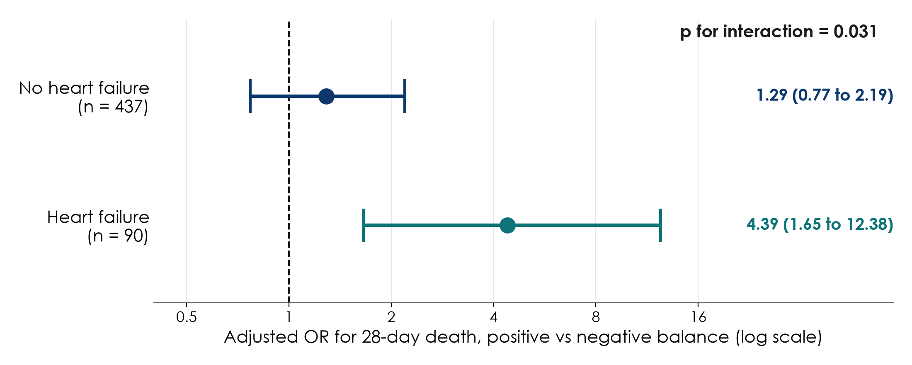{.neu-fig}

::: {.neu-takeaway}
**KEY MESSAGE** Stronger association in heart failure (p for interaction 0.031): needs confirmation.
:::

::: {.notes}
EXTRA: the one pre-specified effect modifier in the FLUID-ICU SAP.

Adjusted OR for death, positive vs negative balance: heart failure (n = 90) 4.39 (95% CI 1.65 to 12.38); no heart failure (n = 437) 1.29 (0.77 to 2.19). Interaction p = 0.031 (Wald; likelihood-ratio test p = 0.028).

Clinically plausible: patients with heart failure tolerate fluid less well.

But: small subgroup (90 patients), very wide CI, and the SAP said an interaction p \< 0.05 is 'evidence needing confirmation, not a definite finding'. Report it as exploratory.

Link to 6.3 (interaction slide) and to multiple comparisons (one pre-specified test, not 20 post hoc subgroups).
:::

## Extra: AKI rises with fluid balance (Q2)

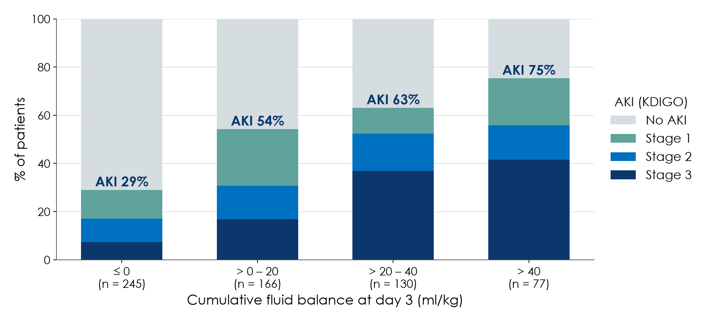{.neu-fig}

::: {.neu-takeaway}
**KEY MESSAGE** A dose-response gradient: 29%, 54%, 63%, 75% AKI across balance groups.
:::

::: {.notes}
EXTRA: group 2's question.

AKI (KDIGO stage 1 or more) by cumulative balance: 0 ml/kg or less 29%; above 0 to 20: 54%; above 20 to 40: 63%; above 40: 75%. A gradient (dose-response) is one of the Bradford Hill considerations (Session 4).

OR per 10 ml/kg: crude 1.37 (1.27 to 1.47), adjusted 1.27 (1.16 to 1.40), p \< 0.001 (n = 527).

Caution: reverse causation is possible: patients developing AKI pass less urine, so their balance becomes more positive. The timing of AKI vs the balance matters; discuss it in the limitations.
:::

## Extra: ventilator-free days, a tricky outcome (Q3)

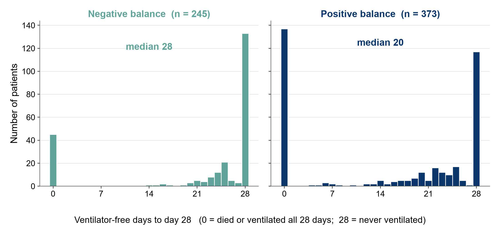{.neu-fig}

::: {.neu-takeaway}
**KEY MESSAGE** Piled up at 0 and 28: report medians and use non-parametric tests.
:::

::: {.notes}
EXTRA: group 3's question.

Ventilator-free days to day 28 are 0 for patients who died or stayed ventilated, and 28 for those never ventilated: two piles, nothing like a bell.

Median 20 (0 to 28) days in the positive-balance group vs 28 (22 to 28) in the negative; Mann-Whitney p \< 0.001.

Linear regression per 10 ml/kg: crude -1.48 (-1.84 to -1.13) days, adjusted -0.61 (-1.00 to -0.21) days, p = 0.003 (n = 527).

Teaching point: always look at the distribution before choosing the summary and the model.
:::

## Extra: Sample and population

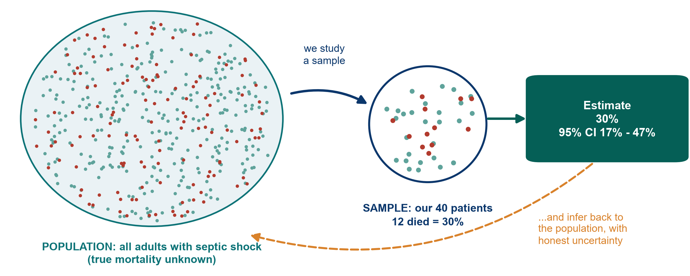{.neu-fig}

::: {.neu-takeaway}
**KEY MESSAGE** A sample gives an estimate; the CI says how precise it is.
:::

::: {.notes}
EXTRA: Teaching point: the POPULATION is everyone we want to learn about (all adults with septic shock); we never see all of them. The SAMPLE is the patients we actually study.

In our sample of 40 patients, 12 died: 30%. That is our ESTIMATE of the true mortality.

A different sample of 40 would give a slightly different number, maybe 25% or 35%. This variation from sample to sample is called sampling error. It is not a mistake; it is chance.

The 95% confidence interval (17% to 47%) expresses that uncertainty: the true mortality could plausibly be anywhere in that range. With only 40 patients, the range is wide.

Two conditions for a sample to tell us about the population: it must be representative (selection, from Session 4) and large enough (precision, coming up).

Ask: if we had studied 400 patients instead of 40, what would happen to the interval? Expected: narrower. That is the dance of the confidence intervals and the sample-size slide in 6.1.
:::

## Extra: Reading a 95% CI in a real paper

::: {.neu-intro}
Paper 1, primary outcome: cumulative fluid balance at day 5.
:::

:::: {.neu-cards style="--n:3"}
::: {.neu-card .plain style="--c:#0D7377"}
[The result]{.neu-card-title}

- Median 6.9 vs 35.0 ml/kg
- Mean difference 13.2 ml/kg
- 95% CI -15.2 to 41.6
- p = 0.42
:::
::: {.neu-card .plain style="--c:#0B376C"}
[Where is 0?]{.neu-card-title}

- 0 = no difference
- The CI includes 0
- So 'no difference' is compatible with the data
:::
::: {.neu-card .plain style="--c:#5FA39B"}
[How wide?]{.neu-card-title}

- From 15 ml/kg in one direction
- to 42 ml/kg in the other
- Very imprecise: only 48 patients
:::
::::

::: {.neu-takeaway}
**KEY MESSAGE** 'Not significant' with a wide CI means 'we do not know', not 'no effect'.
:::

::: {.notes}
EXTRA: Teaching point: read every CI in three steps: the estimate, where the 'no-effect' value is, and how wide the interval is.

Paper 1 (Boulet 2024, RCT): median day-5 cumulative fluid balance 6.9 ml/kg (restrictive) vs 35.0 ml/kg (usual care); the paper also reports the difference in MEANS: 13.2 ml/kg with 95% CI -15.2 to 41.6, p = 0.42.

The interval includes 0, so the data are compatible with no difference. But it also includes a large difference of 40 ml/kg. Conclusion: the study cannot tell us whether the strategy works. It was a pilot of 48 patients.

If someone asks why 13.2 is not 35.0 minus 6.9 (28.1): 13.2 is the difference between the two group MEANS, which the authors report with its 95% CI; the medians describe the skewed data. Means and medians differ when data are skewed, which is exactly the lesson of 5.3.

Common mistake: reading p = 0.42 as 'the restrictive strategy does not work'. Absence of evidence is not evidence of absence.

Ask: what would the CI look like if the trial had 500 patients? Expected: much narrower, possibly excluding 0.
:::

## Extra: the running example in one forest plot

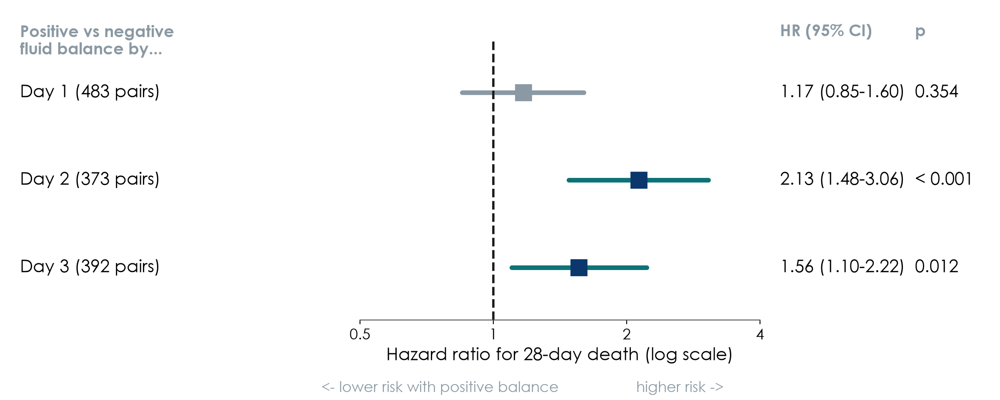{.neu-fig}

::: {.neu-caption}
Paper 2 (Hyun 2023): positive vs negative cumulative fluid balance, propensity-matched cohorts
:::

::: {.neu-takeaway}
**KEY MESSAGE** Day 1: CI crosses 1. Days 2 and 3: CIs above 1, so higher risk.
:::

::: {.notes}
EXTRA: Teaching point: a forest plot shows several estimates with their CIs against the null line. Each square is an HR, each horizontal line its 95% CI.

Paper 2 (Hyun 2023, Ann Intensive Care), 28-day mortality, positive vs negative cumulative fluid balance:

Day 1 (483 matched pairs): HR 1.17 (0.85-1.60), p = 0.354. Crosses 1: no clear association.

Day 2 (373 pairs): HR 2.13 (1.48-3.06), p \< 0.001. Entirely above 1: about double the hazard.

Day 3 (392 pairs): HR 1.56 (1.10-2.22), p = 0.012. Above 1, but the lower limit is close to 1.

Interpretation: a positive balance that persists beyond the first day is associated with higher mortality. Associated, not caused: this is a cohort, and even after matching, sicker patients may still receive more fluid (residual confounding).

Compare with Paper 1: an RCT showing no clear difference in fluid balance. The two designs answer different questions with different strengths; this is the core of Sessions 7-8's appraisal.

Ask: why are the day-1 CI and the day-2 CI different widths? Expected: different numbers of patients and events, and different variability.
:::

## Extra: Log-rank, Cox and proportional hazards

::: {.neu-intro}
Three words you will meet in every survival paper.
:::

:::: {.neu-cards style="--n:3"}
::: {.neu-card .plain style="--c:#0D7377"}
[Log-rank test]{.neu-card-title}

- Compares whole KM curves
- Gives a p-value
- No effect size, no adjustment
:::
::: {.neu-card .plain style="--c:#0B376C"}
[Cox regression]{.neu-card-title}

- Gives a hazard ratio (HR)
- with 95% CI, null = 1
- Can adjust for confounders
:::
::: {.neu-card .plain style="--c:#5FA39B"}
[Proportional hazards]{.neu-card-title}

- Assumes the HR is constant
- over time
- Crossing curves: be careful
:::
::::

::: {.neu-takeaway}
**KEY MESSAGE** Paper 2: Cox HR 2.13 (1.48-3.06): about double the hazard of death.
:::

::: {.notes}
EXTRA: Teaching point: the three tools that go with a KM curve.

Log-rank test: answers 'are the curves different?' with a p-value. It cannot adjust for confounders and does not say how big the difference is.

Cox (proportional hazards) regression: gives a hazard ratio, the ratio of the instantaneous death rates between groups, with a 95% CI; null value 1. Like logistic regression, it can include several variables, so the HR can be adjusted. Paper 2 used a (clustered) Cox model on its matched pairs: day-2 HR 2.13 (95% CI 1.48 to 3.06).

Proportional hazards: the Cox model assumes the HR is the same throughout follow-up. If the KM curves cross or converge strongly, one HR is misleading; good papers say how they checked this assumption.

HR versus RR: an HR of 2 means the death rate at any moment is twice as high; it is not exactly 'twice as many deaths by day 28', although it is often close when events are uncommon.

Ask: a paper shows KM curves that cross at day 10 and reports one HR of 1.0. What might be hidden? Expected: early harm and late benefit (or the reverse) cancelling out.

Timing: 2 minutes.
:::

## Extra: Correlation is not agreement, and not causation

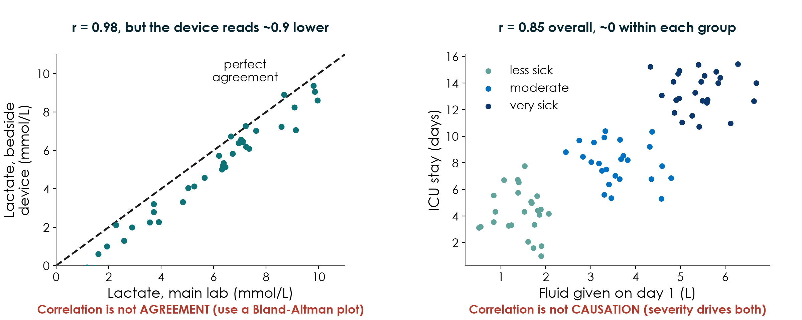{.neu-fig}

::: {.neu-takeaway}
**KEY MESSAGE** High r does not mean two methods agree, nor that one causes the other.
:::

::: {.notes}
EXTRA: Teaching point: two classic misuses of correlation.

Left, agreement: a bedside lactate device against the main laboratory (simulated). r = 0.98, so many authors write 'excellent agreement'. But every point lies below the line of perfect agreement: the device reads about 0.9 mmol/L lower. Correlation measures whether values rise together, not whether they are the same. To compare two measurement methods, use a Bland-Altman plot (differences against averages, with limits of agreement).

Right, causation: more fluid on day 1 goes with longer ICU stay (r = 0.85). But within each severity group there is no relationship at all; severity drives both. This is confounding again (Session 4), and the reason we adjust in models (6.3 and 6.4).

Ask: a new point-of-care haemoglobin meter correlates r = 0.95 with the lab. Can you replace the lab test? Expected: not yet; check agreement (bias and limits) first.

Timing: 2 minutes.
:::

## Extra: Interaction in a model: does the effect differ between groups?

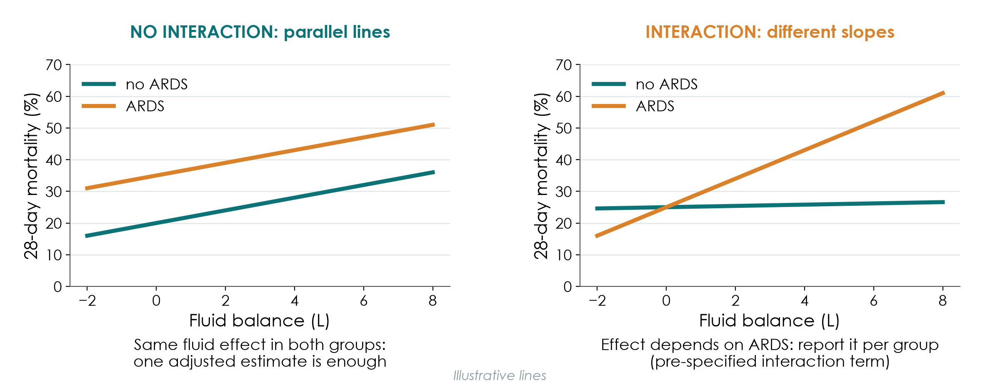{.neu-fig}

::: {.neu-takeaway}
**KEY MESSAGE** Parallel lines: adjust. Different slopes: report the effect for each group.
:::

::: {.notes}
EXTRA: Teaching point: adjustment (6.3 and 6.4) assumes the exposure has the same effect in everyone. Interaction (also called effect modification, Session 4) means the effect is different in different groups.

Left, no interaction: mortality rises with fluid balance at the same rate in patients with and without ARDS; ARDS patients simply start higher. One adjusted estimate is enough.

Right, interaction: fluid balance hardly matters without ARDS but matters a lot with ARDS. A single 'average' effect would describe nobody. The model includes an interaction term (fluid x ARDS); if it is important, report the effect in each group.

Rules: pre-specify the few interactions you will test, with a clinical reason (multiple comparisons again), and do not claim a subgroup difference just because one subgroup has p \< 0.05 and the other does not; test the interaction itself.

Lines are illustrative.

Ask: confounding or interaction? 'The drug works in women but not in men.' Expected: interaction (effect modification).

Timing: 2 minutes.
:::

## Extra: The 'no effect' line: 0 for differences, 1 for ratios

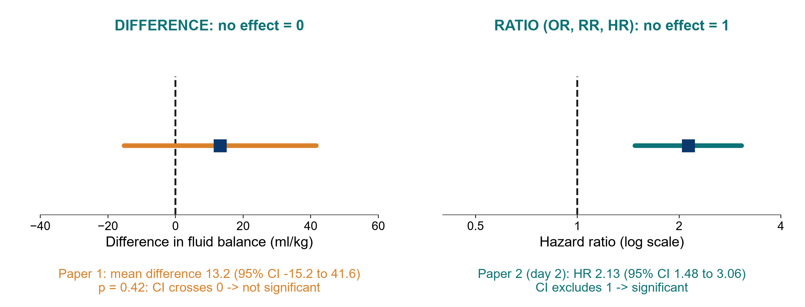{.neu-fig}

::: {.neu-takeaway}
**KEY MESSAGE** Find the null value first, then see if the CI crosses it.
:::

::: {.notes}
EXTRA: Teaching point: put both running-example papers side by side.

Left, Paper 1 (mean difference, null = 0): 13.2 ml/kg (95% CI -15.2 to 41.6). The interval crosses 0: no statistically significant difference, and very imprecise.

Right, Paper 2, day-2 cohort (ratio, null = 1): HR 2.13 (95% CI 1.48 to 3.06), p \< 0.001. The whole interval is above 1: positive fluid balance by day 2 was associated with higher 28-day mortality.

Note the ratio scale is drawn on a log scale: HR 0.5 (halving) and HR 2 (doubling) are equally far from 1. That is why forest plots of ratios look symmetric around 1.

Rule: CI excludes the null value means p \< 0.05 (for a 95% CI), and vice versa. The CI tells you everything the p-value does, plus the size and precision.

Ask: if a CI for an HR were 0.95 to 1.40, significant or not? Expected: not significant; it includes 1.
:::

## Extra: Prediction models: discrimination and calibration

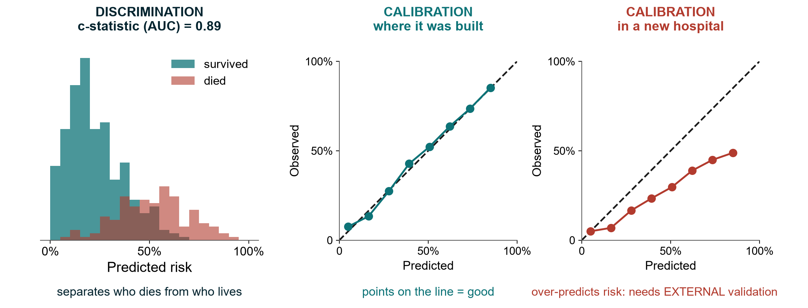{.neu-fig}

::: {.neu-takeaway}
**KEY MESSAGE** A good prediction model separates patients AND gets the risks right, in new hospitals too.
:::

::: {.notes}
EXTRA: Teaching point: so far, models EXPLAINED (is fluid associated with death, adjusted for confounders?). Prediction models PREDICT an individual's risk (SOFA, APACHE, sepsis early-warning alerts, machine-learning scores). They are judged differently.

Discrimination (left): does the model give higher risks to patients who die than to those who survive? Measured by the c-statistic (= area under the ROC curve, AUC): 0.5 is a coin toss, 1.0 perfect; here about 0.89 (simulated).

Calibration (middle): when the model predicts 30%, do about 30% die? Points on the diagonal line = well calibrated.

External validation (right): the same model in a new hospital over-predicts risk (points below the line). Case mix, treatments and measurement differ. A model must be tested on patients who were NOT used to build it, ideally elsewhere, before anyone uses it.

A high AUC alone is not enough: a model can rank patients well and still give wrong absolute risks.

Ask: a vendor says its sepsis alert has an AUC of 0.92 'in our development data'. What do you ask? Expected: calibration, and external validation in a setting like ours.

Timing: 2 minutes.
:::

## Extra: Prediction and machine learning: how to judge a model

::: {.neu-intro}
Machine learning is a flexible way to build prediction models; the same questions apply.
:::

:::: {.neu-cards style="--n:4"}
::: {.neu-card .plain style="--c:#0D7377"}
[What is it for?]{.neu-card-title}

- Predict an individual's risk
- Not to explain causes
- Who, when, which decision?
:::
::: {.neu-card .plain style="--c:#0B376C"}
[Enough data?]{.neu-card-title}

- ML needs MANY events
- Overfitting risk is high
- Internal validation done?
:::
::: {.neu-card .plain style="--c:#5FA39B"}
[Does it work?]{.neu-card-title}

- Discrimination (AUC)
- Calibration plot
- EXTERNAL validation
:::
::: {.neu-card .plain style="--c:#0070C0"}
[Is it reported?]{.neu-card-title}

- TRIPOD+AI checklist
- Code, data, fairness
- Impact on patients?
:::
::::

::: {.neu-takeaway}
**KEY MESSAGE** An AI score is a prediction model: ask for calibration and external validation.
:::

::: {.notes}
EXTRA: Teaching point: machine learning (ML) and AI tools are prediction models built with flexible algorithms (random forests, neural networks). Judge them with four questions.

What is it for? Prediction answers 'who is at high risk?', not 'what causes death?'. A variable that predicts well (e.g. being in the ICU at night) need not be a cause. Ask which decision the prediction will change.

Enough data? Flexible methods overfit easily; they need many more events than a regression model. Check how internal validation was done (cross-validation, bootstrapping, a held-out sample).

Does it work? Discrimination and calibration, and above all external validation in a different time or place.

Is it reported properly? TRIPOD+AI is the reporting guideline for prediction models, including AI (on EQUATOR, Sessions 7-8). Look for missing data handling, fairness across groups, and whether the model has been tested for impact on patient outcomes, not just accuracy.

The optional Advanced Modules include building and validating prediction models.

Ask: is an early-warning score with excellent accuracy but no impact study ready for routine use? Expected: not yet; accuracy is not the same as benefit.

Timing: 2 minutes.
:::

## Extra: Complete-case analysis vs multiple imputation

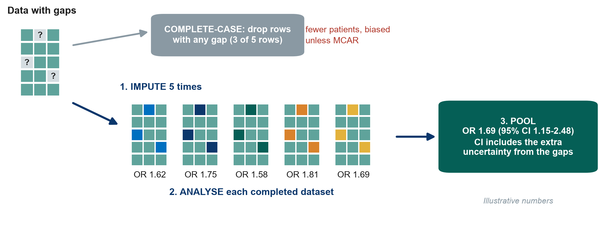{.neu-fig}

::: {.neu-takeaway}
**KEY MESSAGE** Multiple imputation keeps every patient and admits the uncertainty of the gaps.
:::

::: {.notes}
EXTRA: Teaching point: two common ways to handle gaps, shown as a picture. No formulas.

Complete-case analysis (top): use only patients with no missing values in the variables analysed. Simple and the default in most software, but you lose patients (here 3 of 5 rows) and the answer is biased unless data are MCAR. With many variables, small gaps in each add up to large losses.

Multiple imputation (bottom), the idea in three steps: 1. Fill each gap several times (here 5) with plausible values predicted from the other recorded variables, each time with a little random variation. 2. Analyse each completed dataset in the usual way. 3. Pool the results into one estimate whose CI includes the extra uncertainty from not knowing the missing values.

Works well when data are MAR and the imputation model includes the variables that explain the missingness. It is not 'making up data': it is honest about what we do not know.

Numbers are illustrative. In 6.4 you see it run on the course dataset; your job is to recognise it and ask whether it was appropriate.

Ask: a paper excludes 30% of patients for missing data and does a complete-case analysis only. What do you ask? Expected: who was excluded, were they different, and was there a sensitivity analysis with imputation?

Timing: 2 minutes.
:::

## Extra: Report and test your missing data

::: {.neu-intro}
Four things a reviewer will look for.
:::

:::: {.neu-cards style="--n:4"}
::: {.neu-card .plain style="--c:#0D7377"}
[Report]{.neu-card-title}

- n missing per variable
- Flow diagram: who and why
- In Table 1 or a footnote
:::
::: {.neu-card .plain style="--c:#0B376C"}
[Compare]{.neu-card-title}

- Patients with vs without
- complete data
- Are they different?
:::
::: {.neu-card .plain style="--c:#5FA39B"}
[Sensitivity (Level 2)]{.neu-card-title}

- Complete-case vs MI
- Example script: 05\_missing.R
- Done hands-on in Level 2
:::
::: {.neu-card .plain style="--c:#0070C0"}
[Plan]{.neu-card-title}

- Write it in the SAP
- before you see the data
- Part 3 of your proposal
:::
::::

::: {.neu-takeaway}
**KEY MESSAGE** Missing data are a result: report them, handle them, test the answer.
:::

::: {.notes}
EXTRA: Teaching point: what a good paper (and your proposal) says about missing data.

Report: the number of missing values for each variable (Table 1 'n' column or a footnote) and, for the outcome, a flow diagram showing who was lost and why (CONSORT, STROBE, Sessions 7-8).

Compare: patients with complete data against those with gaps on baseline characteristics. Big differences suggest the gaps are not random.

Sensitivity analysis: repeat the main analysis in a different way: complete-case vs multiple imputation; for a missing binary outcome, a best case (all missing survived) and worst case (all missing died). If the conclusion holds in all versions, it is robust. If it flips, say so.

Plan: all of this goes in the SAP and in Part 3 of your proposal today: expected missingness, prevention (5.1), and how missing data will be reported.

Ask: Paper 1 analysed 48 of 50 randomised patients; two control patients withdrew. Is that a problem? Expected: small loss (4%), reported transparently; a sensitivity analysis would still be good practice.

Timing: 2 minutes.
:::
