# Session 7 · Protect & write: ethics, integrity, Methods and Results

## Weekend 4 · Saturday

- Recap quiz: Session 6
- 7.1  Protocol, ethics, consent, registration, feasibility
- 7.2  Research integrity: authorship, conflicts of interest, data sharing, AI
- Proposal builder 7: ethics + publication plan
- 7.3  Writing the paper (I): Methods, Results, tables, STROBE
- Manuscript workshop 1: draft Methods + Results

::: {.notes}
SESSION 7 (0:00). Weekend 4, Saturday. Two halves today: before the break we protect the patient and the science (ethics, integrity) and finish Proposal Part 4; after the break we start WRITING the FLUID-ICU manuscript.

Pace: slow. Every block has a worked example and a 1-minute check. If time is short, drop slides from the 'Extra slides - Session 7' section at the end, never the workshop.

Before you start: results packs (Course/Data/results\_packs/Q1-Q5) printed, one per group; the manuscript template open on each group's laptop if they have one.

Timing: this slide 1 minute, then the 10-minute recap quiz.
:::

## Recap quiz: Session 6 in five questions

::: {.neu-banner style="--c:#6C3483"}
QUICK QUIZ · 10 min
:::

:::: {.columns}
::: {.column width="60%"}
::: {.neu-activity-steps style="--c:#6C3483"}
1. A crude OR is 2.1; the adjusted OR is 1.4. What happened?
2. HR 0.85 (95% CI 0.60 to 1.20): clear benefit?
3. Lactate is missing for 15% of patients. Name one way to handle it
4. Kaplan-Meier: what does a 'censored' patient mean?
5. Your group's FLUID-ICU question: what is its main result?
:::
:::
::: {.column width="40%"}
::: {.neu-side .plain style="--c:#6C3483"}
Answers

- 1. Confounding: part of the crude link came from severity
- 2. No - the CI includes 1
- 3. Complete-case, or multiple imputation + sensitivity
- 4. Left the study alive, outcome unknown after that
- 5. From your results pack
:::
:::
::::

::: {.neu-output style="--c:#6C3483"}
**OUTPUT** Everyone re-activated: adjustment, CIs, missing data, survival
:::

::: {.notes}
RECAP (0:01-0:10). Ask, wait, then reveal the answer panel.

Q1 links straight to today's writing: in the Results we report BOTH crude and adjusted estimates (STROBE item 16), and in the Discussion we explain why they differ.

Q5: ask one person per group - this is the number they will write about after the break. If a group cannot say it, sit with them during the break and go through their results pack.

Show of hands for each question; spend longest where the room is split.
:::

## Today: finish the proposal, start the paper

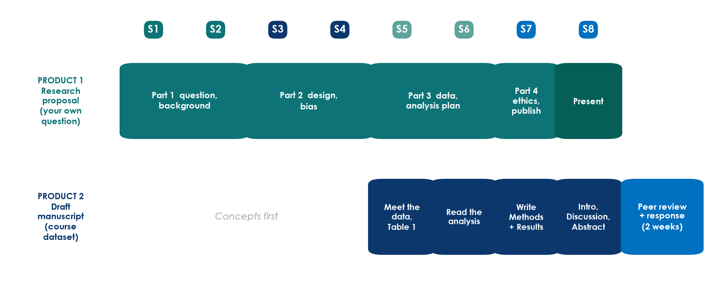{.neu-fig}

::: {.neu-takeaway}
**KEY MESSAGE** Before the break: Proposal Part 4. After the break: Methods and Results.
:::

::: {.notes}
Two products, two rows. Product 1 - your own research proposal - gets its last part today (ethics, registration, feasibility, publication plan) and is presented tomorrow.

Product 2 - the FLUID-ICU draft manuscript - moves from 'reading the analysis' (Session 6) to WRITING: today Methods and Results, tomorrow Introduction, Discussion, Abstract and Title.

Ask: which group question does your group have? (Q1-Q5.) Make sure everyone knows.
:::

## 7.1  \|  30 minutes

:::: {.neu-statement}
::: {.neu-big}
Protocol, ethics and consent
:::

::: {.neu-sub}
Protect the patient before the first data point
:::
::::

::: {.notes}
SECTION 7.1 (0:10-0:40). Eleven slides including two worked examples and a 1-minute check.

About 2.5 minutes per slide. The ICU consent slide and its worked example deserve the most time - it is the real-life problem of this department.

Link: everything in this block becomes a paragraph of Proposal Part 4 (Proposal builder 7 at 1:00).
:::

## The protocol: your study's building plan

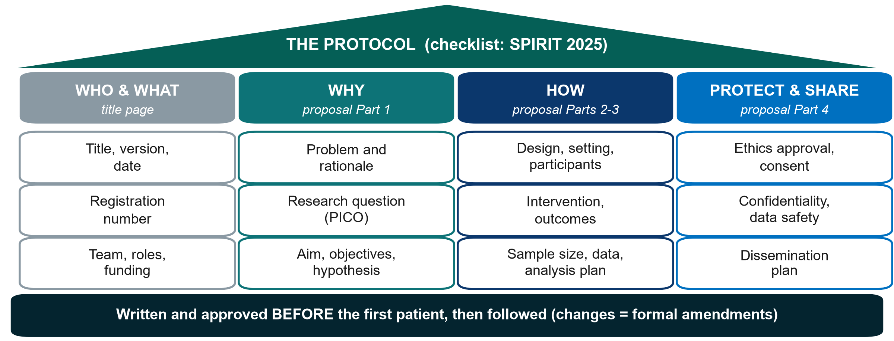{.neu-fig}

::: {.neu-takeaway}
**KEY MESSAGE** Your four proposal parts ARE the skeleton of a protocol.
:::

::: {.notes}
Teaching point: a protocol is the full written plan of the study, written and approved BEFORE the first patient is enrolled. SPIRIT 2025 is the international checklist for what a trial protocol should contain; observational studies follow the same logic.

Walk the four columns: WHO & WHAT (title page, registration, team, funding), WHY (Part 1), HOW (Parts 2 and 3), PROTECT & SHARE (Part 4, today).

Point to the foundation bar: changes after approval are made as formal amendments, approved before they are applied - not quietly.

Running example: Paper 1 says its protocol and statistical analysis plan were registered at ClinicalTrials.gov (NCT04947904) before the first patient - that is what lets a reader check the authors did what they planned.

Ask: which column of your proposal is weakest right now? Expected: HOW - sample size or analysis plan. Reassure: the template in Templates/ follows exactly this order.
:::

## Two rule books: Helsinki and Good Clinical Practice

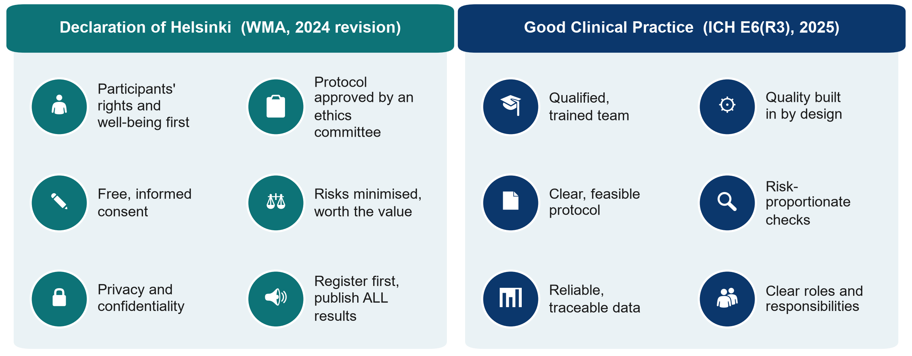{.neu-fig}

::: {.neu-takeaway}
**KEY MESSAGE** Helsinki says WHY we protect participants; GCP says HOW we run a trial well.
:::

::: {.notes}
Teaching point: the Declaration of Helsinki (World Medical Association, latest revision October 2024) is the ethical foundation for research with people. Its core: the rights and interests of the individual participant come before the goal of new knowledge; a protocol approved by an independent research ethics committee before the study starts; free, informed consent; risks minimised and justified; privacy protected; every study registered before the first participant and ALL results made public - including negative and inconclusive ones.

The 2024 revision speaks of 'participants' rather than 'subjects', strengthens the protection of vulnerable groups and of people who cannot consent, and stresses scientific integrity.

ICH E6(R3) Good Clinical Practice (adopted by ICH in January 2025) is the international quality standard for clinical trials: qualified people, quality built into the design, risk-proportionate monitoring, reliable and traceable data, clear roles. Its spirit applies to every study.

Misconception: 'GCP is only for drug companies'. Paper 1 - an academic ICU trial - states its analyses followed ICH-GCP.

Ask: which of these 12 icons would be hardest in our unit? Typical answer: reliable data (charts incomplete) or protected time.
:::

## The ethics-committee journey

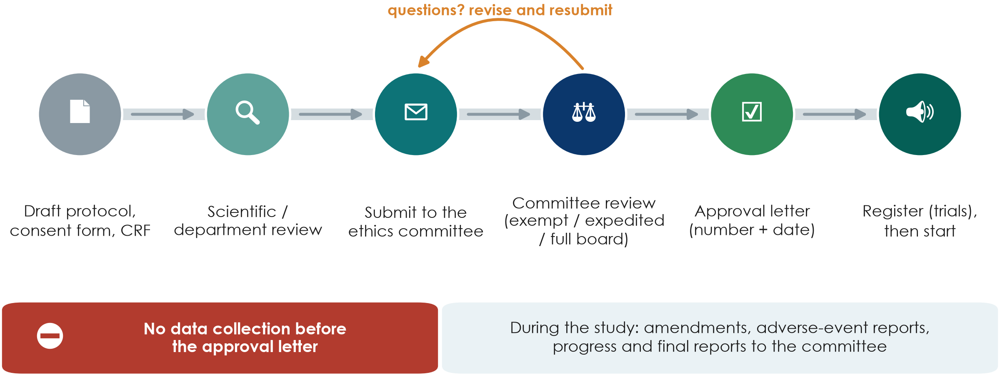{.neu-fig}

::: {.neu-takeaway}
**KEY MESSAGE** No approval letter, no data collection - not even 'just a few patients'.
:::

::: {.notes}
Walk the six stations left to right. Most institutions want a scientific or department review first; then the dossier goes to the research ethics committee (also called IRB or IEC).

The dossier: protocol, participant information and consent form, data collection form (CRF), investigator CVs and GCP training records, budget and insurance where required.

Review types: some low-risk studies are exempt or get an expedited review; trials and anything with more than minimal risk go to the full committee. Your committee decides the category - you do not.

Questions and revisions are normal - plan 1-3 months for the whole journey.

Trials are registered in a public registry (e.g. ClinicalTrials.gov or a WHO-recognised registry) before the first patient; journals refuse unregistered trials.

Misconception to kill: 'we can collect data now and ask for approval later'. Committees cannot approve retrospectively, and journals will reject the paper.

Running example: Paper 1 gives its committee name and approval number in the Methods; Paper 2 gives the IRB approval number in its Declarations.
:::

## Register before the first participant

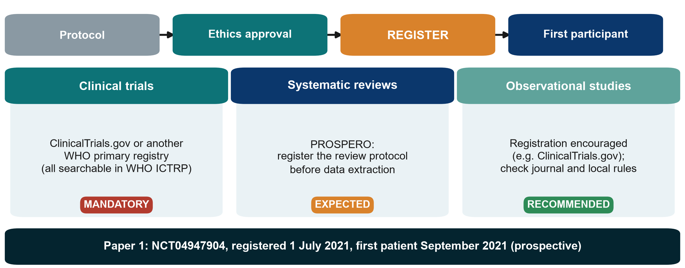{.neu-fig}

::: {.neu-takeaway}
**KEY MESSAGE** Trials: no registration before the first patient, no publication.
:::

::: {.notes}
Teaching point: registration puts the study's existence, design and primary outcome on a public record BEFORE anyone is enrolled. It prevents hidden negative studies and outcome switching.

Clinical trials: registration is mandatory. ICMJE journals will not publish a trial that was not registered before the first participant, and many countries require it by law. Use ClinicalTrials.gov or another WHO primary registry; the WHO ICTRP portal searches all of them at once - it is a search portal, not a registry itself.

Systematic reviews: register the protocol on PROSPERO before data extraction; many journals expect it.

Observational studies: registration is encouraged rather than required - check the target journal and local rules. The Declaration of Helsinki asks for every study with human participants to be registered.

Running example: Paper 1 was registered as NCT04947904 on 1 July 2021; the first patient was enrolled in September 2021 - prospective registration. Its registration number is in the abstract.

Ask: your group's study - does it need registration? Expected: trials yes; most cohort proposals 'recommended'.
:::

## Check: register or not?

::: {.neu-banner style="--c:#6C3483"}
QUICK QUIZ · 2 min
:::

:::: {.columns}
::: {.column width="60%"}
::: {.neu-activity-steps style="--c:#6C3483"}
1. A randomised trial of two dressings for pressure injuries
2. A systematic review of fluid strategies in sepsis
3. A retrospective cohort from ICU charts (like FLUID-ICU)
4. A clinical audit of hand-hygiene compliance
5. Show: 1 finger = must, 2 = should, 3 = not needed
:::
:::
::: {.column width="40%"}
::: {.neu-side .plain style="--c:#6C3483"}
Answers

- 1. Must - trial registry, before patient 1
- 2. Should - PROSPERO
- 3. Recommended, not required
- 4. Audit: not research registration; local approval
:::
:::
::::

::: {.notes}
CHECK (1 minute + 1 minute answers). Read each scenario, count fingers, then reveal.

Scenario 4 starts a useful discussion: audit compares practice with a standard and is usually approved through the quality office, not registered; but if you plan to publish it as research, ask the ethics committee first (Session 1: research vs audit vs QI).
:::

## Informed consent: four essentials

::: {.neu-intro}
Consent is a conversation, not a signature.
:::

:::: {.neu-cards style="--n:4"}
::: {.neu-card .plain style="--c:#0D7377"}
[Informed]{.neu-card-title}

- Purpose and what will happen
- Risks, benefits, alternatives
- How data are protected
- Who to contact
:::
::: {.neu-card .plain style="--c:#0B376C"}
[Understood]{.neu-card-title}

- Plain, local language
- Time to ask questions
- Teach-back: 'tell me in your words'
:::
::: {.neu-card .plain style="--c:#5FA39B"}
[Voluntary]{.neu-card-title}

- No pressure
- Free to refuse or withdraw
- Care is NOT affected
:::
::: {.neu-card .plain style="--c:#0070C0"}
[Documented]{.neu-card-title}

- Signed and dated form
- A copy for the participant
- Re-consent if the study changes
:::
::::

::: {.neu-takeaway}
**KEY MESSAGE** If the patient cannot explain the study back to you, consent is not informed.
:::

::: {.notes}
Teaching point: valid consent needs all four - information, understanding, voluntariness and a record.

Nurses and pharmacists are often the ones patients ask afterwards 'what did I sign?' - this is everybody's job, not only the investigator's.

Withdrawal: participants may leave at any time without giving a reason and without any effect on their care. Running example: in Paper 1, two control patients withdrew consent and were not analysed - that is the right respected, and it is why the trial analysed 48 of 50.

Common mistake: a consent form written at university reading level, in a language the family does not read fluently. Ask the committee for its template (there is also one in Templates/).

Ask: who in your group would take consent in your study, and when? Expected answer: a trained team member who is NOT the treating doctor under time pressure, if possible.
:::

## Consent in the ICU: when the patient cannot decide

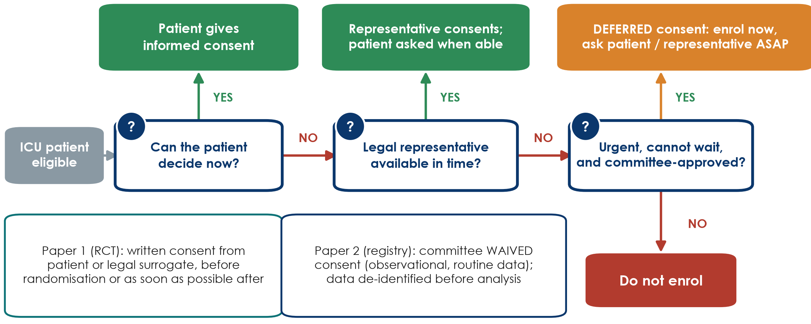{.neu-fig}

::: {.neu-takeaway}
**KEY MESSAGE** Patient, then legal representative, then deferred consent - and only if approved.
:::

::: {.notes}
This is the real-life ICU problem: most of our patients are sedated, delirious or in shock when they become eligible.

Read the flowchart left to right. 1) Can the patient decide now? Then the patient consents. 2) If not, a legally authorised representative (surrogate - usually family, as defined by local law) consents, and the patient is asked again when able. 3) If no representative can be reached in time and the treatment cannot wait, research may proceed ONLY if the protocol explains why and the ethics committee approved this emergency procedure in advance; consent to continue is then sought as soon as possible. This is 'deferred consent'. The 2024 Declaration of Helsinki allows exactly this, under these conditions.

Paper 1 used this: written consent from the patient or legal surrogate 'before randomization or as soon as possible thereafter' (page 3).

Paper 2 is different: a registry using routine data - the committee waived individual consent and the data were de-identified before analysis (page 8).

Local law decides who may act as representative and whether deferred consent is allowed - check with your committee before you write the protocol.

Ask: if a family refuses after the patient was enrolled under deferred consent, what happens? Expected: the patient leaves the study; whether data already collected may be used depends on the approved protocol and what the family agrees to.
:::

## Worked example: who consents for these three ICU patients?

::: {.neu-intro}
Walk each patient through the flowchart.
:::

:::: {.neu-cards style="--n:3"}
::: {.neu-card .plain style="--c:#0D7377"}
[Mr A, 54]{.neu-card-title}

- Pneumonia, awake, oriented
- Eligible for a fluid trial
- **[Patient consents]{style="color:#2E8B57"}**
:::
::: {.neu-card .plain style="--c:#0B376C"}
[Mrs B, 71]{.neu-card-title}

- Septic shock, sedated
- Daughter at the bedside
- **[Representative consents; ask Mrs B when awake]{style="color:#2E8B57"}**
:::
::: {.neu-card .plain style="--c:#5FA39B"}
[Mr C, 38]{.neu-card-title}

- Shock at 03:00, no family yet
- Treatment cannot wait; committee approved
- **[Deferred consent: ask ASAP]{style="color:#D9822B"}**
:::
::::

::: {.neu-takeaway}
**KEY MESSAGE** The pathway and the timing are written in the protocol before patient 1.
:::

::: {.notes}
WORKED EXAMPLE. Ask the room for each card BEFORE revealing the bottom line (cover it or click through slowly).

Mr A: capacity present - the patient decides.

Mrs B: lacks capacity now; the legally authorised representative (here the daughter, if local law allows) consents; Mrs B is asked to continue when she regains capacity - she may withdraw.

Mr C: no representative in time, treatment cannot wait - deferred consent ONLY if the protocol describes it and the committee approved it; seek consent from family or patient as soon as possible. Paper 1 used this route.

Misconception: 'the treating doctor can consent for the patient'. No - the treating doctor is not the representative.
:::

## Confidentiality: de-identify before you analyse

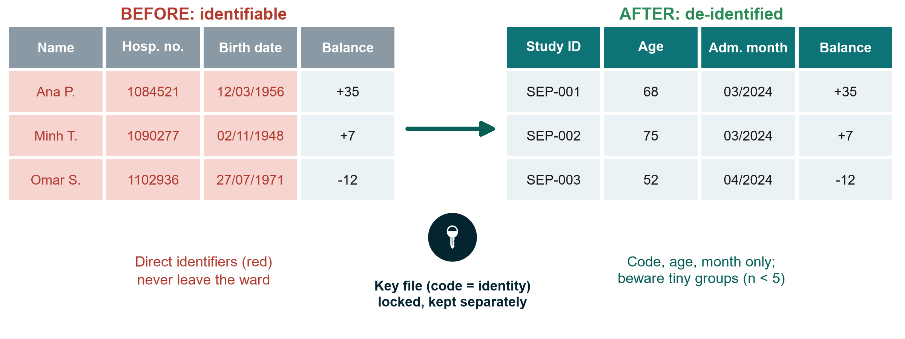{.neu-fig}

::: {.neu-takeaway}
**KEY MESSAGE** Names stay on the ward; only study codes travel.
:::

::: {.notes}
Teaching point: confidentiality is protected by design, not by good intentions.

Before: direct identifiers - name, hospital number, exact date of birth, address, phone, photos. After: a study code, age instead of birth date, month instead of exact dates, and only the variables in your data dictionary.

The key file that links codes to identities is kept separately, password-protected and locked, with access for one or two named people only.

Beware indirect identification: 'the only 19-year-old with ECMO in March' is identifiable even without a name. Report very small groups with care.

Practical rules: no patient data on personal phones, messaging apps, private email or public cloud and AI tools; encrypted, institution-approved storage only.

Running example: Paper 2 states that patient information was anonymised and de-identified before analysis.

Ask: where would your group's key file live? Expected answer: an institution-approved, password-protected location - not a USB stick in a pocket.
:::

## Worked example: the ethics paragraph for a cohort like FLUID-ICU

::: {.neu-intro}
FLUID-ICU is simulated - but if it were real, this is what the paper would say.
:::

:::: {.neu-cards style="--n:4"}
::: {.neu-card .plain style="--c:#0D7377"}
[Approval]{.neu-card-title}

- Ethics committee of each ICU
- Approval number + date
- Before data collection
:::
::: {.neu-card .plain style="--c:#0B376C"}
[Consent]{.neu-card-title}

- Routine data, minimal risk
- Committee may WAIVE consent
- (as in Paper 2)
:::
::: {.neu-card .plain style="--c:#5FA39B"}
[Confidentiality]{.neu-card-title}

- Study codes only
- Key file kept in each ICU
- Data de-identified before analysis
:::
::: {.neu-card .plain style="--c:#0070C0"}
[Registration & sharing]{.neu-card-title}

- Registration recommended
- Data-sharing statement
- Data dictionary shared
:::
::::

::: {.neu-takeaway}
**KEY MESSAGE** Your manuscript's ethics paragraph answers four questions in four sentences.
:::

::: {.notes}
WORKED EXAMPLE linking 7.1 to the manuscript. Make clear FLUID-ICU is a SIMULATED teaching dataset - there was no real approval - so in the course manuscripts groups write: 'This analysis uses a simulated teaching dataset; no ethics approval was required.' In a real cohort the paragraph would read like the four cards.

Model sentence (real study): 'The study was approved by the ethics committees of the four participating hospitals (number, date), which waived individual consent because data were collected during routine care and analysed after de-identification.'

Ask: which STROBE item does this belong to? Expected: the Methods (it is listed among other information; most journals ask for it in a 'Declarations' section too).
:::

## Feasibility in one picture: five honest questions

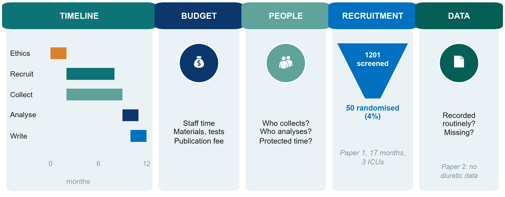{.neu-fig}

::: {.neu-takeaway}
**KEY MESSAGE** Count the eligible patients in your unit BEFORE you write the sample size.
:::

::: {.notes}
Walk the five tiles. TIMELINE: ethics approval alone can take 1-3 months; recruitment always takes longer than planned. BUDGET: name the headings even if the amounts are small - staff time, materials or tests, publication fee. PEOPLE: who collects data on night shifts and weekends, who analyses, and is there protected time? RECRUITMENT: Paper 1 screened 1201 patients in three ICUs over 17 months to randomise 50 (about 4%) - most eligible-looking patients are not eligible or not enrolled. DATA: is the variable already recorded routinely? Paper 2 could not study diuretics because the registry never recorded them.

Rule of thumb: count how many patients meeting your criteria your unit saw last year, then assume you will enrol a fraction of them.

Ask: which tile is the biggest risk for your group's study? Expected answers: recruitment and people (night-shift data collection).

This is the only feasibility slide in Level 1 - do not go deeper.
:::

## 7.2  \|  20 minutes

:::: {.neu-statement}
::: {.neu-big}
Research integrity
:::

::: {.neu-sub}
Honest data, honest credit, honest use of AI
:::
::::

::: {.notes}
SECTION 7.2 (0:40-1:00). Six slides (about 2 minutes each) and the 5-minute scenario quiz.

Tone: this is not about catching cheats. Most integrity problems start as small shortcuts under pressure - a missing value 'filled in', an outlier 'cleaned', a boss added as author. We want people to recognise the slope early.

Link to the manuscript: every group's draft will need an authorship (CRediT), conflicts-of-interest, data-availability and AI-use statement.
:::

## Fabrication, falsification, plagiarism (FFP)

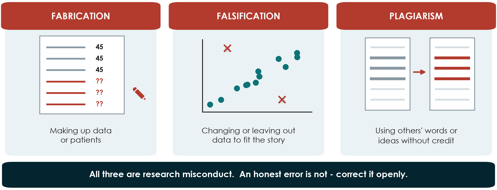{.neu-fig}

::: {.neu-takeaway}
**KEY MESSAGE** Missing data are reported as missing - never invented, never quietly removed.
:::

::: {.notes}
Teaching point: the three classic forms of research misconduct.

Fabrication: making up data or patients (e.g. filling day-3 fluid balances 'from memory' because the chart is lost).

Falsification: changing, selecting or leaving out data, images or results so the story looks better (e.g. dropping two 'odd' patients after seeing they weaken the result).

Plagiarism: using other people's words, ideas or figures without credit - including copying a paragraph WITH a citation but without quotation marks.

Honest error is not misconduct - but it must be corrected openly (a correction or erratum).

Link to Session 5: the data-quality plan (range checks, pre-specified rules for outliers) is what protects you from accidental falsification.

Ask: which of these three is the most common in student theses? Expected answer: plagiarism - often copy-paste in the introduction. Similarity-check software will find it.
:::

## Also off-limits: tricks that distort the record

::: {.neu-intro}
One study should tell one complete, honest story.
:::

:::: {.neu-cards style="--n:3"}
::: {.neu-card .plain style="--c:#0D7377"}
[Duplicate publication]{.neu-card-title}

- Same study, same results
- in a second journal
- without saying so
:::
::: {.neu-card .plain style="--c:#0B376C"}
[Salami slicing]{.neu-card-title}

- One study cut into thin papers
- to multiply publications
- Reader never sees the whole
:::
::: {.neu-card .plain style="--c:#5FA39B"}
[Selective reporting]{.neu-card-title}

- Only the 'significant' outcomes
- Primary outcome switched
- after seeing the data
:::
::::

::: {.neu-takeaway}
**KEY MESSAGE** Register first, pre-specify the primary outcome, report all of it.
:::

::: {.notes}
Teaching point: these practices distort the evidence that doctors and guideline panels rely on.

Duplicate publication counts the same patients twice in a meta-analysis and can exaggerate an effect. A legitimate secondary paper is fine - if it is clearly cross-referenced and adds something new.

Salami slicing: e.g. mortality in one paper, length of stay in another and ventilation days in a third, from the same cohort, each without mentioning the others.

Selective reporting and outcome switching are why trials must be registered with ONE primary outcome before the first patient. Running example: Paper 1 registered its protocol at ClinicalTrials.gov on 1 July 2021, before recruitment began in September 2021, and reported its negative primary outcome plainly in the abstract. That is good practice.

Ask: Paper 1's primary outcome was negative. Why does it matter that it was published at all? Expected: publication bias - if only positive trials appear, the literature overstates benefit.
:::

## Who is an author? The four ICMJE criteria

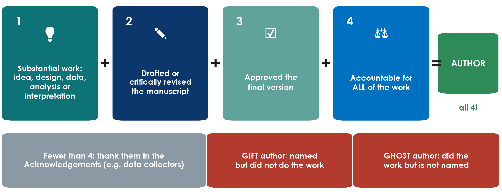{.neu-fig}

::: {.neu-takeaway}
**KEY MESSAGE** All four criteria, for every author - decide the list at the start.
:::

::: {.notes}
Teaching point: the International Committee of Medical Journal Editors (ICMJE) requires ALL four criteria for authorship: 1) substantial contribution to conception or design, or to acquisition, analysis or interpretation of data; 2) drafting or critically revising the work; 3) final approval of the version to be published; 4) agreement to be accountable for all aspects of the work.

Anyone who contributed but does not meet all four goes in the Acknowledgements (data collectors, the pharmacist who checked adherence, the department head who provided support).

Gift author: a name added for seniority or friendship. Ghost author: someone who did the work - often a junior or a paid writer - but is not named. Both are misconduct.

Running example: Paper 2 is published 'on behalf of' a study group; the group members are listed in the Acknowledgements - a correct way to credit a large network.

Ask: data collection alone - is that enough for authorship? Expected answer: no, not without criteria 2, 3 and 4.

Practical tip: agree the author list and order in writing at the protocol stage and revisit it before submission.
:::

## Conflicts of interest and funding: declare them all

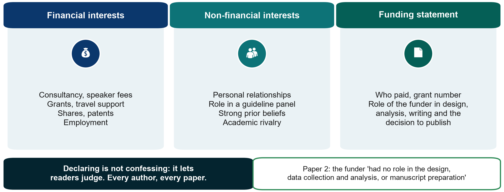{.neu-fig}

::: {.neu-takeaway}
**KEY MESSAGE** A declared interest is information; a hidden one is a scandal.
:::

::: {.notes}
Teaching point: a conflict (competing) interest is anything that could be seen to influence your judgement - financial or not. Having one is common and not wrong; hiding it is.

Financial: consultancy, speaker fees, grants, travel support, shares, patents, employment. Non-financial: personal relationships, membership of a guideline panel, strong prior beliefs, academic rivalry.

Every author completes the journal's disclosure form (most journals use the ICMJE disclosure form), usually covering the last 36 months.

Funding statement: who paid, the grant number, and the role of the funder in design, data collection, analysis, writing and the decision to publish.

Running example: Paper 2 states its funder had no role in the design, data collection and analysis or manuscript preparation - an ICMJE requirement that is often forgotten (annotation \#39). Paper 1 states an internal hospital grant and no competing interests (page 12).

Ask: a drug company paid your travel to a congress last year. Do you declare it on a fluids paper? Expected: yes if it could be perceived as relevant - when in doubt, declare.
:::

## Data sharing: from 'on request' to open

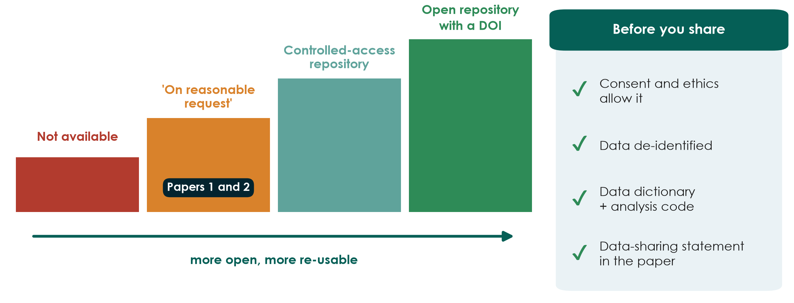{.neu-fig}

::: {.neu-takeaway}
**KEY MESSAGE** Plan data sharing at the protocol stage - consent must allow it.
:::

::: {.notes}
Teaching point: journals increasingly ask for a data-sharing statement; ICMJE requires one for clinical trials, and trials must describe their data-sharing plan when they register.

The ladder: not available; 'available on reasonable request' (the weakest promise - both papers use it, pages 12 and 8); a controlled-access repository (researchers apply); an open repository with a DOI (for fully de-identified data).

Before you share: the consent form and the ethics approval must allow it, data are de-identified, and you share the data dictionary and analysis code with the data so others can use them.

Link to Session 5: a clean data dictionary is what makes shared data usable.

Ask: what would you need to write in your consent form today so your data can be shared tomorrow? Expected: a sentence asking permission for de-identified data to be shared for future research.
:::

## AI in research and writing: what is allowed

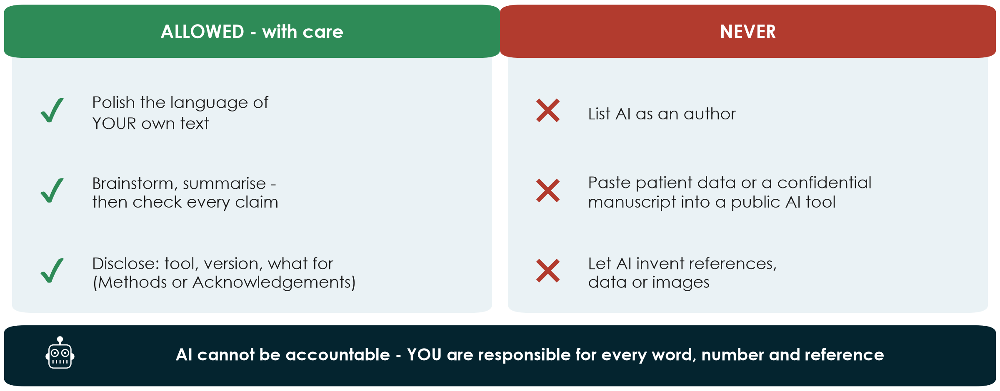{.neu-fig}

::: {.neu-takeaway}
**KEY MESSAGE** Use AI like a junior assistant: check everything, disclose it, keep patient data out.
:::

::: {.notes}
Teaching point - the current positions of ICMJE and COPE (Committee on Publication Ethics): AI tools cannot be authors, because they cannot take responsibility or be accountable for the work. Authors who use AI must disclose it - for writing help usually in the Acknowledgements, for use in data collection, analysis or figures in the Methods - and they remain fully responsible for every word, number and reference, including anything the tool produced.

Never paste identifiable patient data, or a manuscript you are reviewing, into a public AI tool: it breaches confidentiality, and reviewers are bound to keep manuscripts confidential.

AI tools can invent references that look real. Check every citation against PubMed.

Images: AI-generated or AI-altered images are not acceptable as data.

Always check the target journal's own AI policy in its Guide for Authors - policies change.

Ask: a colleague asks a chatbot to 'write the discussion' and submits it unread. Which of the three NEVER boxes does this hit? Expected: invented references and an unaccountable text - and it is undisclosed.
:::

## Integrity scenarios: green, amber or red?

::: {.neu-banner style="--c:#6C3483"}
QUICK QUIZ · 5 min
:::

:::: {.columns}
::: {.column width="60%"}
::: {.neu-activity-steps style="--c:#6C3483"}
1. Read the scenario on the screen or in your handout (6 scenarios)
2. Each group holds up GREEN (fine), AMBER (fine only if fixed or disclosed) or RED (misconduct)
3. The instructor asks one group to justify its colour
4. We do 3 together now; the rest are in the handout
:::
:::
::: {.column width="40%"}
::: {.neu-side .plain style="--c:#6C3483"}
Example

- A colleague lent you an ultrasound machine and asks to be an author.
- Your colour?
:::
:::
::::

::: {.neu-output style="--c:#6C3483"}
**OUTPUT** Each participant can name FFP, gift/ghost authorship and the AI rules
:::

::: {.notes}
QUIZ (0:55-1:00). Scenarios and answer key: Practicals/s7\_exercises.md (Part A) and Solutions/s7\_solutions.md.

Choose three: 1 (missing data 'filled from memory' - RED, fabrication), 3 (head of department as last author without contributing - RED, gift authorship, offer Acknowledgements), 4 (AI polish of the English, checked and disclosed - GREEN; same chatbot fed the patient spreadsheet - RED).

Example on the slide: lending equipment is not authorship - AMBER/RED: thank them in the Acknowledgements.

Facilitation: coloured cards (or coloured paper) on each table; if you have none, use fingers - 1 = green, 2 = amber, 3 = red.

If groups disagree, that is the teaching moment - ask each side for one reason.
:::

## Proposal builder 7: ethics, registration, feasibility, publication plan

::: {.neu-banner style="--c:#055F56"}
PROPOSAL BUILDER · 15 min
:::

:::: {.columns}
::: {.column width="60%"}
::: {.neu-activity-steps style="--c:#055F56"}
1. Who consents in your study? Use the ICU flowchart (5 min)
2. Registration: needed? which registry? Where is the key file?
3. Feasibility: biggest risk and one fix (3 min)
4. Publication plan: target journal, guideline, authors + CRediT (5 min)
5. Working title from your PICO (2 min)
:::
:::
::: {.column width="40%"}
::: {.neu-side .plain style="--c:#055F56"}
Worksheet

- Practicals/s7\_exercises.md, Part B
- Your slide 5 and 6 for tomorrow
- Finish at home tonight
:::
:::
::::

::: {.neu-output style="--c:#055F56"}
**OUTPUT** Proposal Part 4 drafted; slides 5-6 of the presentation outlined
:::

::: {.notes}
PROPOSAL BUILDER 7 (1:00-1:15). Call the sub-timings aloud.

Circulate. Typical problems: (1) 'consent will be obtained' with no who/when/how - push for the ICU pathway; (2) retrospective chart reviews assuming no ethics review is needed - wrong, the committee decides and may grant a waiver; (3) recruitment numbers taken from the sample-size calculation instead of the unit's admissions; (4) CONSORT chosen for an observational proposal.

The journal choice and EQUATOR checklist will be checked again in 8.2 tomorrow - a provisional answer is fine today.

Remind: tomorrow each group presents (6 minutes, 6 slides) - slides 5 (ethics & feasibility) and 6 (publication plan) come from this worksheet.
:::

## Break

::: {.neu-banner style="--c:#8A99A3"}
BREAK · 15 min
:::

:::: {.columns}
::: {.column width="60%"}
::: {.neu-activity-steps style="--c:#8A99A3"}
1. Collect your group's FLUID-ICU results pack
2. Open the manuscript template (or take paper)
3. Decide who writes Methods, who writes Results
4. Back at 1:30 sharp
:::
:::
::: {.column width="40%"}
::: {.neu-side .plain style="--c:#8A99A3"}
After the break

- 7.3 Writing the paper (35 min)
- Manuscript workshop 1 (50 min)
:::
:::
::::

::: {.notes}
BREAK (1:15-1:30).

During the break: put one printed results pack on each table (Q1 on table 1 ... Q5 on table 5) and the s7 exercise sheet (Part C, workshop instructions).

Use the break to visit any group that could not say its main result in the recap.
:::

## 7.3  \|  35 minutes

:::: {.neu-statement}
::: {.neu-big}
Writing the paper (I): Methods and Results
:::

::: {.neu-sub}
Write what you did and what you found - nothing more
:::
::::

::: {.notes}
SECTION 7.3 (1:30-2:05). Ten slides: writing order, Methods, a worked Methods example from FLUID-ICU, Results, a worked Results example, tables, STROBE, and a 3-minute check.

Every example now comes from the course dataset (Q1, the primary question) or from the two papers.

Pace: 3 minutes per slide. The two worked examples are the heart of the block - read them slowly with the room.
:::

## Write in a different order from the one readers read

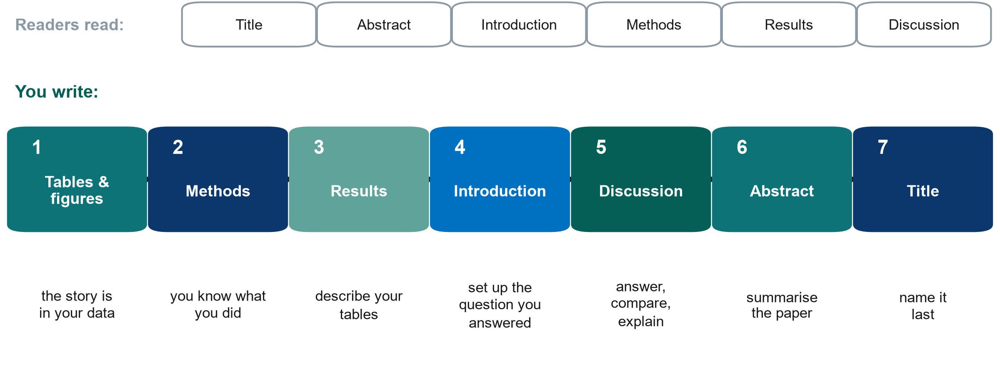{.neu-fig}

::: {.neu-takeaway}
**KEY MESSAGE** Start with your tables; write the title last.
:::

::: {.notes}
Teaching point: readers go title - abstract - introduction - methods - results - discussion. Writers should not. Start from the evidence: draft the tables and figures (the story is in your data), then the Methods (you know what you did - it can be drafted from the protocol even before the data), then Results (describe the tables), then the Introduction (set up exactly the question you answered), then the Discussion, and only then the abstract and the title.

Why it works: each section is written from something that already exists, and the abstract and title summarise a paper that is finished - so they cannot promise more than the paper delivers.

Misconception: 'I must finish the introduction before I can start'. Many first-time writers stall on the introduction for months.

Ask: which part of your proposal could already become the Methods of your paper? Expected: Parts 2 and 3 - design, participants, variables, analysis plan.
:::

## Methods: enough detail for someone to repeat it

::: {.neu-intro}
If a colleague could not redo your study from the Methods, add detail.
:::

:::: {.neu-cards style="--n:4"}
::: {.neu-card .plain style="--c:#0D7377"}
[Who and where]{.neu-card-title}

- Design, setting, dates
- Eligibility criteria
- Ethics no. and consent
- Registration no.
:::
::: {.neu-card .plain style="--c:#0B376C"}
[What was done]{.neu-card-title}

- Intervention in full
- Variables defined
- P1: training, daily pharmacist check
:::
::: {.neu-card .plain style="--c:#5FA39B"}
[Outcomes and size]{.neu-card-title}

- ONE primary outcome: how, when
- Sample size: assumptions + source
- P2: no sample-size statement
:::
::: {.neu-card .plain style="--c:#0070C0"}
[Statistical analysis]{.neu-card-title}

- A test for each comparison
- Estimate matches the test
- Missing data, multiplicity
- Software and version
:::
::::

::: {.neu-takeaway}
**KEY MESSAGE** The statistical paragraph names a method for every comparison you report.
:::

::: {.notes}
Teaching point: Methods = enough detail to repeat the study, in the order of the reporting checklist (CONSORT or STROBE).

Good practice: Paper 1 puts the ethics committee, approval number, consent procedure and funding inside the Methods (annotation \#13); describes the intervention well enough to replicate - staff training, a daily pharmacist check, dilution charts in a supplement (\#16); separates one primary outcome from secondary and safety outcomes (\#17); states the software and version (\#21). Paper 2 defines exactly which inputs and outputs make up fluid balance (\#13) and cites its cohort-profile paper instead of repeating it (\#12).

To fix: Paper 1 is a 'pilot' with an efficacy sample size whose assumptions (70 vs 40 ml/kg) were not met (\#18); it names a Mann-Whitney test but reports mean differences with CIs (\#19); about 40 secondary p-values with no word on multiplicity (\#20). Paper 2: 'caliper of 0.1' of what? How were missing covariates handled? Clustered by what? (\#15, \#17); no sample-size statement (\#19).

The statistical analysis paragraph: for each comparison, the summary, the test or model, the effect measure with 95% CI, how missing data and multiple comparisons were handled, and the software.
:::

## Worked example: Methods for FLUID-ICU question 1

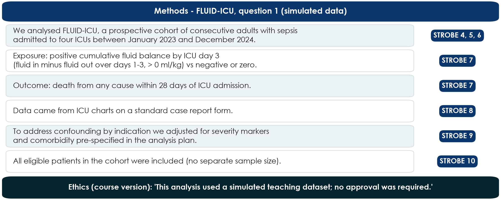{.neu-fig}

::: {.neu-takeaway}
**KEY MESSAGE** One sentence per STROBE item - and say plainly that the data are simulated.
:::

::: {.notes}
WORKED EXAMPLE (course dataset). Read each sentence and point to its STROBE item on the right.

All facts come from results pack Q1, section 2: prospective multicentre cohort, 4 ICUs, consecutive adults with sepsis, January 2023 - December 2024; exposure = cumulative balance (in minus out, days 1-3) \> 0 ml/kg; outcome = death within 28 days of ICU admission.

STROBE 10 (study size): for a fixed cohort we do not invent a sample-size calculation; we say all eligible patients were included.

The ethics sentence is specific to the course: FLUID-ICU is SIMULATED - every manuscript must say so.

Ask: which sentence would a reader need to repeat the study? Expected: the exposure definition - how fluid balance was calculated.
:::

## Worked example: the statistical-analysis paragraph

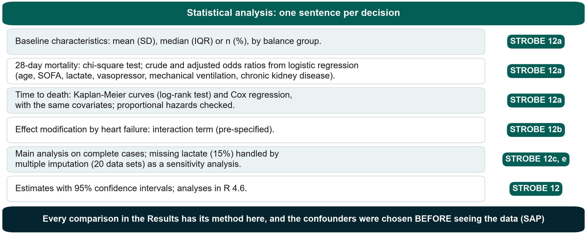{.neu-fig}

::: {.neu-takeaway}
**KEY MESSAGE** Name a method for every comparison you report - chosen before you saw the data.
:::

::: {.notes}
WORKED EXAMPLE. This is STROBE item 12 written out for Q1 (results pack Q1, sections 2 and 4-5).

Covariates: age, SOFA, lactate, vasopressor, mechanical ventilation, chronic kidney disease - pre-specified in the statistical analysis plan (Session 6), not chosen by looking at p-values.

Missing data: lactate missing in 93/620 (15.0%); main analysis on complete cases (n = 527), multiple imputation (m = 20) as sensitivity.

Effect modification: heart failure, pre-specified.

Misconception: 'the statistics paragraph is for the statistician'. Reviewers read it first; every number in the Results must be traceable to one sentence here.
:::

## Results: report, do not interpret

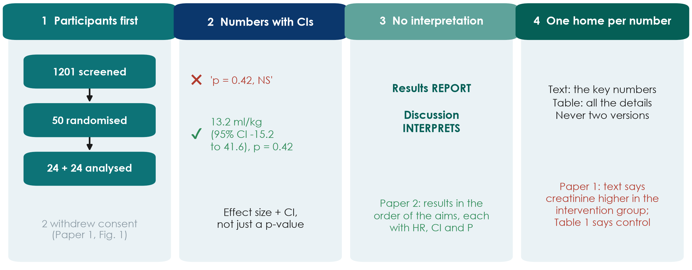{.neu-fig}

::: {.neu-takeaway}
**KEY MESSAGE** Participants first, then each outcome as an effect size with its 95% CI.
:::

::: {.notes}
Four rules. 1) Participants first: how many were screened, included, analysed and why some were lost - with a flow diagram. Paper 1 has its CONSORT flow chart in the main text (annotations \#23, \#27); Paper 2 keeps it in the supplement although 79% of the registry was excluded (\#20).

2) Numbers with confidence intervals, not 'p = 0.42, NS'. Analysing 48 of 50 randomised patients is a modified intention-to-treat analysis and should be called that (\#24).

3) No interpretation in the Results. Paper 2 reports its results in the order of the aims, each with HR, CI and P, and no comment (\#25).

4) One home for each number: key numbers in the text, all details in the tables - and they must agree. Paper 1's text says creatinine was higher in the intervention group; Table 1 shows the opposite (\#25). Text-table contradictions are a classic rejection reason.

Ask: who in your group will check every number in the text against the tables before submission? Name the person now.
:::

## Worked example: Results for FLUID-ICU question 1

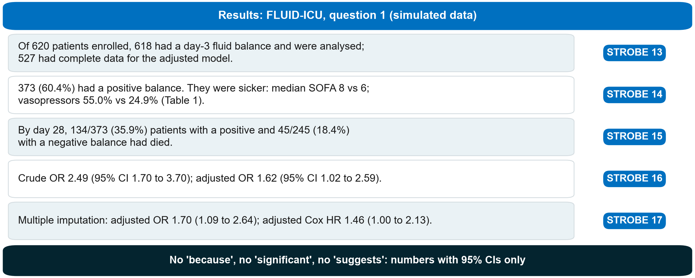{.neu-fig}

::: {.neu-takeaway}
**KEY MESSAGE** Participants, Table 1, outcome numbers, crude and adjusted estimates - in that order.
:::

::: {.notes}
WORKED EXAMPLE. All numbers from Course/Data/key\_results.md (SIMULATED data):

Flow: 620 enrolled -\> 618 with a day-3 balance -\> 527 in the complete-case adjusted model (91 without lactate or age).

Positive balance 373/618 (60.4%); SOFA median 8 (6 to 10) vs 6 (4 to 8); vasopressor 205/373 (55.0%) vs 61/245 (24.9%).

Deaths: 134/373 (35.9%) vs 45/245 (18.4%). Crude OR 2.49 (1.70 to 3.70); adjusted OR 1.62 (1.02 to 2.59), p 0.044. Sensitivity: multiple imputation OR 1.70 (1.09 to 2.64); adjusted Cox HR 1.46 (1.00 to 2.13).

Point out what is NOT in the paragraph: no 'because', no 'significant', no explanation of why the OR shrank - that belongs to the Discussion tomorrow.

Ask: which STROBE item does the crude-AND-adjusted sentence satisfy? Expected: 16.
:::

## Tables and figures that stand alone

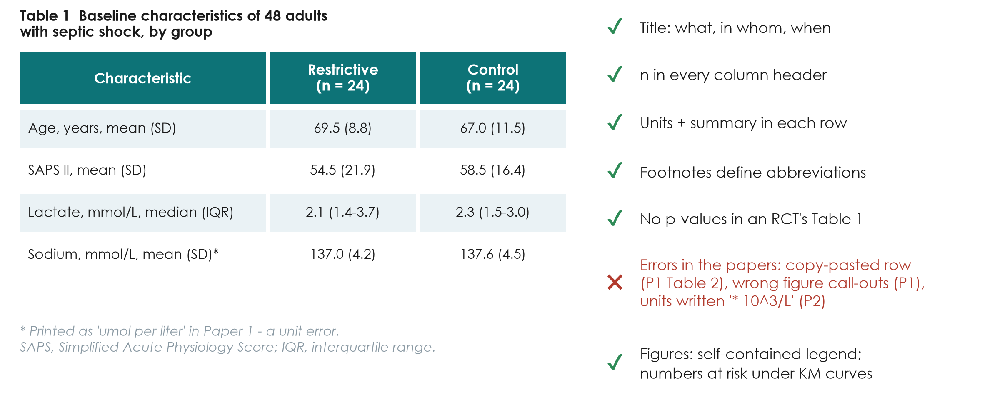{.neu-fig}

::: {.neu-takeaway}
**KEY MESSAGE** A reader should understand each table without reading the text.
:::

::: {.notes}
Teaching point: reviewers and clinicians read tables more carefully than text. A table must stand alone: a title that says what, in whom and when; n in every column header; units and the summary statistic in each row; footnotes defining abbreviations and missing data.

Good practice: Paper 1's Table 1 has n in each column, SD or IQR per row and no baseline p-values - correct for a randomised trial (annotation \#31). Paper 2's Table 1 adds SMDs and footnotes with the number of patients with missing data (\#30); its timeline figure has a self-contained legend (\#21).

Errors to avoid: sodium and potassium printed in umol per liter (should be mmol/L) in Paper 1 (\#30); a copy-pasted row in Paper 1's Table 2 (\#32); wrong figure call-outs in Paper 1 (\#28, \#41); a vague table title (\#34); white-cell units written '\* 10\^3/L' in Paper 2 (\#30). Kaplan-Meier curves should show numbers at risk (Paper 2, \#31).

Link to Session 5: the publication-quality table rules. Your FLUID-ICU Table 1 in the results pack already follows them - check it against this list in the workshop.

Ask: what is wrong with a table titled 'Results'? Expected: it says nothing about what, who or when.
:::

## Worked example: FLUID-ICU Table 1 in one sentence

| Characteristic | Negative balance (n = 245) | Positive balance (n = 373) |
|:---|:---|:---|
| Age, years, mean | 64.6 | 61.4 |
| SOFA score, median (IQR) | 6 (4 to 8) | 8 (6 to 10) |
| Vasopressor, n (%) | 61 (24.9%) | 205 (55.0%) |
| Mechanical ventilation, n (%) | 97 (39.6%) | 216 (57.9%) |
| Lactate, mmol/L, median (IQR) | 2.2 (1.4 to 3.0) | 2.9 (1.9 to 4.0) |
| Heart failure, n (%) | 54 (22.0%) | 43 (11.5%) |

::: {.neu-table-caption}
SIMULATED data (results pack Q1, Table 1). Sentence: 'Patients with a positive balance were sicker at baseline.'
:::

::: {.notes}
WORKED EXAMPLE: from Table 1 to one Results sentence (STROBE 14).

Model sentence: 'Patients with a positive balance were sicker at baseline (median SOFA 8 vs 6; vasopressors 55.0% vs 24.9%) and less often had heart failure (11.5% vs 22.0%).'

Teaching point: the Table 1 sentence describes, it does not test - no p-values needed (observational Table 1s often show SMDs instead).

Heart failure is lower in the positive group because clinicians give less fluid in heart failure - a nice example of how treatment decisions shape the data.

The full Table 1 with missing-data rows is in each results pack.
:::

## STROBE for the FLUID-ICU paper: which item goes where

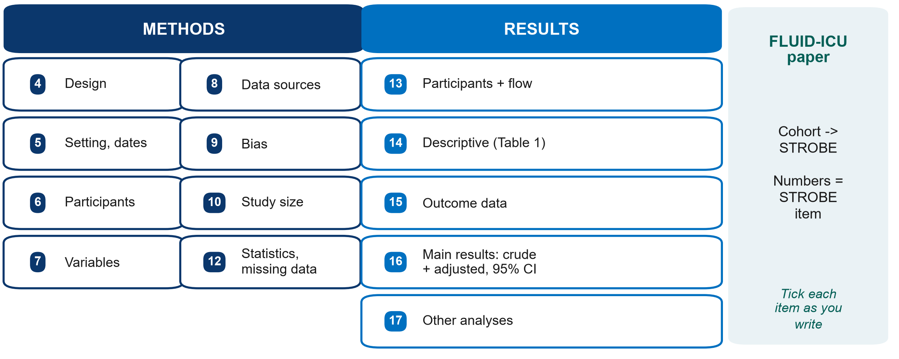{.neu-fig}

::: {.neu-takeaway}
**KEY MESSAGE** Write with the STROBE checklist open - tick each item as you write it.
:::

::: {.notes}
Teaching point: FLUID-ICU is a cohort, so the paper follows STROBE (cohort version). The numbers in the boxes are the STROBE item numbers for the Methods (4-12) and Results (13-17).

Items groups most often forget: 9 (bias - say how you addressed confounding by indication: adjustment for severity); 10 (study size - for a fixed dataset say 'all eligible patients in the cohort were included'); 12 (missing data - how lactate was handled); 16 (give BOTH crude and adjusted estimates, with the variables adjusted for).

The full checklist is in the s7 exercise sheet and on equator-network.org (demo tomorrow).

Ask: which item covers Table 1? Expected: 14 (descriptive data).
:::

## Check: Methods, Results or Discussion?

::: {.neu-banner style="--c:#6C3483"}
QUICK QUIZ · 3 min
:::

:::: {.columns}
::: {.column width="60%"}
::: {.neu-activity-steps style="--c:#6C3483"}
1. 'We used logistic regression adjusted for SOFA and age.'
2. 'Of 640 patients screened, 600 were included.'
3. 'This may be because sicker patients received more fluid.'
4. 'Lactate was missing in 15% and was imputed.'
5. '28-day mortality was higher with a positive balance (OR ..., 95% CI ...).'
:::
:::
::: {.column width="40%"}
::: {.neu-side .plain style="--c:#6C3483"}
Answers

- 1 Methods
- 2 Results (participants)
- 3 Discussion (explain)
- 4 Methods (+ Results: how many)
- 5 Results
:::
:::
::::

::: {.notes}
CHECK (2:02-2:05). Read each sentence; the room calls out M, R or D.

The numbers in sentences 2, 4 and 5 are illustrative ('...'), not FLUID-ICU results.

Sentence 4 is the trick: HOW missing data were handled is Methods; HOW MANY were missing is Results.

Sentence 3 is the classic error - an interpretation slipped into the Results. Move it to the Discussion.
:::

## Manuscript workshop 1  \|  50 minutes

:::: {.neu-statement}
::: {.neu-big}
Write your Methods and Results
:::

::: {.neu-sub}
About 600 words, Table 1 and one figure or table - from your results pack
:::
::::

::: {.notes}
MANUSCRIPT WORKSHOP 1 (2:05-2:55). Course dataset. Each group writes the Methods and Results of its FLUID-ICU paper (Q1-Q5) from its results pack.

Instructions for participants: Practicals/s7\_exercises.md, Part C. Model paragraphs for Q1: Solutions/s7\_solutions.md (do NOT hand these out before the workshop - show only the worked examples on the slides).
:::

## Fifty minutes, six people, one draft

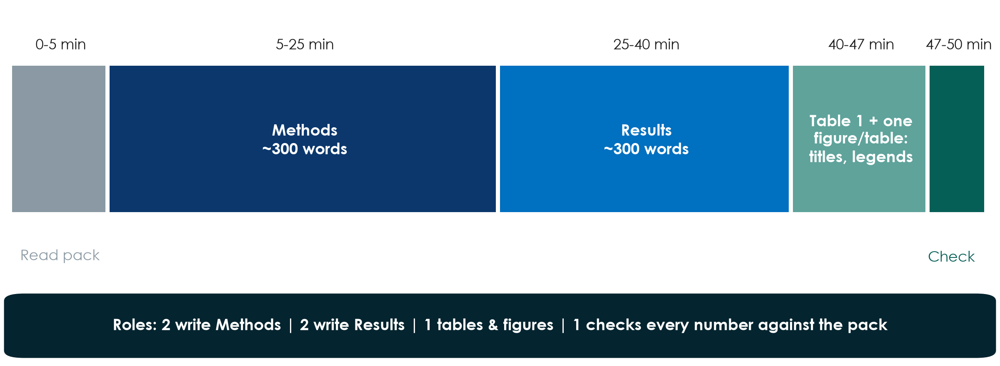{.neu-fig}

::: {.neu-takeaway}
**KEY MESSAGE** Every number in your text must come from your results pack - nobody calculates anything.
:::

::: {.notes}
Show the plan and assign roles in 1 minute: two write Methods, two write Results, one prepares Table 1 and one figure or table (title, column headers with n, units, footnotes), and one 'number checker' who compares every number in the text with the results pack.

Word budget: Methods \~300 words (design and setting, participants, variables, statistical analysis); Results \~300 words (participants, Table 1 in one sentence, main result crude and adjusted, one secondary or sensitivity result).

Instructors circulate from minute 5: check each Methods has the statistical paragraph and each Results starts with the participants.
:::

## Manuscript workshop 1: draft Methods + Results

::: {.neu-banner style="--c:#0D7377"}
GROUP WORK · 50 min
:::

:::: {.columns}
::: {.column width="60%"}
::: {.neu-activity-steps style="--c:#0D7377"}
1. 0-5: read your results pack; agree the main result in one sentence
2. 5-25: Methods - design, setting, participants, variables, statistics
3. 25-40: Results - participants, Table 1, main result (crude + adjusted)
4. 40-47: Table 1 + one figure/table with titles and footnotes
5. 47-50: tick STROBE items 4-17; check every number
:::
:::
::: {.column width="40%"}
::: {.neu-side .plain style="--c:#0D7377"}
Use

- Your results pack (Q1-Q5)
- Manuscript template
- Worked examples (slides)
- STROBE items 4-17
:::
:::
::::

::: {.neu-output style="--c:#0D7377"}
**OUTPUT** Methods + Results (\~600 words) + Table 1 + one figure/table, saved and shared
:::

::: {.notes}
WORKSHOP (2:05-2:55). Start a visible 50-minute timer; call each phase.

Circulate in a fixed order (table 1 to 5) so every group gets two visits.

Prompts: 'Where is your statistical paragraph?' 'What was adjusted for?' 'Where are the participants?' 'Is there a number without a confidence interval?' 'Is there an adjective ("significant", "strong") that should be a number?' 'Is there any interpretation in your Results?'

Q4 group (lactate): make sure they report BOTH complete-case and imputed estimates. Q5 group (length of stay): medians and IQR, not means. Q3 group: ventilator-free days are skewed - check the summary they chose.

At 2:52 ask each group to save and send its draft (email or shared folder) - it is the starting file for tomorrow's workshop 2.
:::

## Key words of Session 7

| Term | In plain words |
|:---|:---|
| Deferred consent | Enrol first in an emergency, ask consent as soon as possible (committee-approved) |
| Registration | Public record of a study before patient 1 (mandatory for trials) |
| FFP | Fabrication, falsification, plagiarism - research misconduct |
| ICMJE criteria / CRediT | Who may be an author / who did what |
| Conflict of interest | Anything that could be seen to influence your judgement - declare it |
| STROBE | Reporting checklist for observational studies: Methods items 4-12, Results 13-17 |

::: {.neu-table-caption}
Full glossary (EN-VN): Course/References/
:::

::: {.notes}
Read the six terms with the room - ask someone to explain each in their own words before you read the right-hand column.

These are also the words most likely to appear in the post-course quiz tomorrow.
:::

## Wrap-up and homework for tomorrow

::: {.neu-banner style="--c:#1F5C7A"}
DISCUSSION · 5 min
:::

:::: {.columns}
::: {.column width="60%"}
::: {.neu-activity-steps style="--c:#1F5C7A"}
1. Three take-home messages (next to this list)
2. Tonight: finish Proposal Part 4 and your 6 presentation slides
3. Tonight: read your Methods + Results draft once, aloud
4. Tomorrow: Introduction, Discussion, Abstract, Title - then present
:::
:::
::: {.column width="40%"}
::: {.neu-side .plain style="--c:#1F5C7A"}
Take home

- No approval, no data - not even 'a few patients'
- Every author meets all four criteria; declare every interest
- Methods = what you did; Results = numbers with CIs, no opinions
:::
:::
::::

::: {.neu-output style="--c:#1F5C7A"}
**OUTPUT** Proposal slides ready; Methods + Results draft saved
:::

::: {.notes}
WRAP-UP (2:55-3:00). Read the three take-home messages; ask one person to add a fourth.

Homework: proposal slides (presentation guide: 6 minutes, 6 slides), and a read-through of the manuscript draft. Tomorrow starts with a 5-minute recap and goes straight into writing.
:::

## Extra slides  \|  Session 7

:::: {.neu-statement}
::: {.neu-big}
Extra slides - Session 7
:::

::: {.neu-sub}
Use only if time allows, or for self-study
:::
::::

::: {.notes}
EXTRA: the slides after this divider are optional. Use them if the room moves faster than planned, or point participants to them for self-study.
:::

## IMRaD: the hourglass shape of every paper

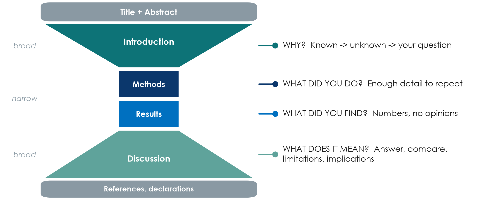{.neu-fig}

::: {.neu-takeaway}
**KEY MESSAGE** Introduction narrows to your question; Discussion widens back to practice.
:::

::: {.notes}
EXTRA: Teaching point: almost every clinical paper follows IMRaD - Introduction, Methods, Results and Discussion - framed by the title and abstract and closed by references and declarations.

Introduction: from what is known, to what is not known, to your question (a funnel). Methods: enough detail for someone else to repeat the study. Results: numbers, without opinions. Discussion: answer the question first, compare with other studies, state the limitations, then say what it means.

Running example: Paper 1's introduction is a textbook funnel in three paragraphs (pages 2-3), ending 'The primary objective was to assess the fluid balance after the first 5 days'. Its Discussion opens by answering that question (page 8).

Tip for the appraisal after the break: the hourglass tells you where to look - PICO in the last paragraph of the Introduction, design and outcome in the Methods, the main effect in the first paragraph of the Results, limitations near the end of the Discussion.

Ask: which section do you read first in a paper? Many will say the abstract and conclusion - fine, but the answer to 'can I believe it?' is in the Methods.
:::

## CRediT: say who did what

::: {.neu-intro}
Journals now ask for each author's role in standard words.
:::

:::: {.neu-cards style="--n:3"}
::: {.neu-card .plain style="--c:#0D7377"}
[The 14 CRediT roles]{.neu-card-title}

- Conceptualization, Methodology
- Investigation, Formal analysis
- Writing - original draft
- Writing - review & editing
- Supervision, Funding ...
:::
::: {.neu-card .plain style="--c:#0B376C"}
[Paper 1 did it]{.neu-card-title}

- NB: Writing - original draft
- CS: Methodology, Formal analysis
- SDB: Conceptualization, Supervision, Funding acquisition
:::
::: {.neu-card .plain style="--c:#5FA39B"}
[Your group, today]{.neu-card-title}

- Agree the author list now
- Write each person's roles
- Revisit before submission
:::
::::

::: {.neu-takeaway}
**KEY MESSAGE** Transparent roles prevent gift and ghost authorship.
:::

::: {.notes}
EXTRA: CRediT (Contributor Roles Taxonomy) is a list of 14 standard roles. It does not replace the ICMJE criteria; it makes each person's contribution visible.

Running example: Paper 1 (page 12) gives a CRediT statement - e.g. the statistician is credited for Methodology and Formal analysis. Paper 2 (page 8) describes contributions in free text and states that all authors read and approved the final manuscript - acceptable, but CRediT is the format most journals now ask for.

Facilitation: ask each group to write, in their proposal, who would be first author and who would do what. It prevents painful conversations later.

Question: in a hospital, who usually ends up as last author, and why? Expected: the senior supervisor - legitimate if they meet all four criteria, a gift if they do not.
:::
