# Session 8 · Publish: finish the paper, get it out, present

## Week 8 · Saturday

- Recap (5 min)
- 8.1  Writing the paper (II): Introduction, Discussion, Abstract, Title
- Manuscript workshop 2: complete the draft
- 8.2  Getting published: from checklist to proofs
- 8.3  Be the reviewer: appraise Papers 1 and 2
- Group presentations: proposal + publication plan

::: {.notes}
SESSION 8 (0:00). Week 8, Saturday: the last session. Today the FLUID-ICU manuscripts become complete drafts, we follow a paper from submission to publication, practise reviewing, and every group presents its own proposal.

The closing block (post-course quiz, evaluation, peer-review swap) is the last 15 minutes and has its own slides.

Before you start: all five presentations on ONE laptop; each group's workshop-1 draft open.
:::

## Recap: three questions from Session 7

::: {.neu-banner style="--c:#6C3483"}
QUICK QUIZ · 5 min
:::

:::: {.columns}
::: {.column width="60%"}
::: {.neu-activity-steps style="--c:#6C3483"}
1. Who consents for a sedated patient in septic shock?
2. Which STROBE item asks for crude AND adjusted estimates?
3. Where does 'this may be because sicker patients got more fluid' belong?
:::
:::
::: {.column width="40%"}
::: {.neu-side .plain style="--c:#6C3483"}
Answers

- The legal representative (or deferred consent if approved)
- Item 16 (main results)
- Discussion, not Results
:::
:::
::::

::: {.neu-output style="--c:#6C3483"}
**OUTPUT** Everyone back in writing mode
:::

::: {.notes}
RECAP (0:00-0:05). Quick hands-up; reveal the answers.

Q3 leads into 8.1: the Discussion is where interpretation lives.
:::

## 8.1  \|  25 minutes

:::: {.neu-statement}
::: {.neu-big}
Writing the paper (II)
:::

::: {.neu-sub}
Introduction, Discussion, Abstract and Title, in that order
:::
::::

::: {.notes}
SECTION 8.1 (0:05-0:30). Eleven slides with three worked examples from FLUID-ICU Q1 and a 2-minute check.

Order follows the writing order from last Saturday: Introduction, Discussion, then the Abstract and the Title last.

Pace: about 2 minutes per slide; slow down on the worked Discussion example.
:::

## Introduction: a funnel in three paragraphs

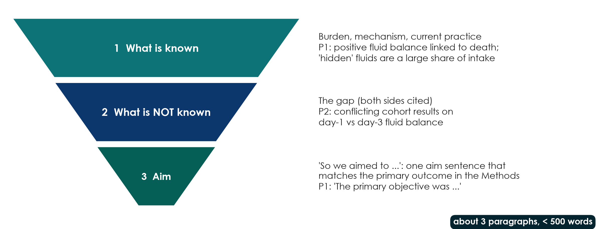{.neu-fig}

::: {.neu-takeaway}
**KEY MESSAGE** Known, unknown, aim. The aim matches the primary outcome.
:::

::: {.notes}
Teaching point: the introduction is a funnel, not a literature review. Paragraph 1: what is known (burden, mechanism, current practice). Paragraph 2: what is not known: the gap, ideally with conflicting evidence cited on both sides. Paragraph 3: 'We therefore aimed to ...', one aim sentence that matches the primary outcome in the Methods.

Paper 1 is the model (annotations \#10-\#12): known (positive fluid balance is linked to death; hidden fluids are a large share of intake), unknown (earlier trials targeted resuscitation fluids only), aim (primary objective = fluid balance after 5 days), all in under 500 words (pages 2-3).

Paper 2's paragraph 2 defines the gap by citing both sides of a conflict (annotation \#9). Copy that. But its introduction runs to about 550 words and the aim repeats the causal word 'impact' (\#3, \#10).

Link to Sessions 1-2: your problem statement and PICO already give you this funnel. The next slide shows a worked example for the FLUID-ICU paper.

Ask: in one sentence, what is NOT known in your group's topic? That sentence is your paragraph 2.
:::

## Worked example: the Introduction funnel for FLUID-ICU (Q1)

:::: {.neu-cards style="--n:3"}
::: {.neu-card .plain style="--c:#0D7377"}
[1  Known]{.neu-card-title}

- Fluids save lives early in sepsis
- Positive balance linked to death
- (Paper 2; large cohorts)
:::
::: {.neu-card .plain style="--c:#0B376C"}
[2  Not known]{.neu-card-title}

- Whether the link persists after
- adjusting for severity
- Sicker patients get more fluid
:::
::: {.neu-card .plain style="--c:#5FA39B"}
[3  Aim]{.neu-card-title}

- We examined whether a positive
- balance by day 3 is associated
- with 28-day mortality, after adjustment
:::
::::

::: {.neu-takeaway}
**KEY MESSAGE** Three paragraphs, about 350 words. The aim uses 'associated'.
:::

::: {.notes}
WORKED EXAMPLE. Model opening sentences (adapt, do not copy):

P1: 'Intravenous fluids are a cornerstone of early sepsis care, but a positive cumulative fluid balance has been associated with higher mortality in several observational studies \[refs\].'

P2: 'Because sicker patients receive more fluid, it remains uncertain whether this association persists after adjustment for illness severity \[refs\].'

P3: 'We therefore examined whether a positive cumulative fluid balance by ICU day 3 was associated with 28-day mortality in adults with sepsis, before and after adjustment for severity.'

References: groups use the references found in Sessions 1-2 plus Papers 1 and 2.

Point out: the confounding by indication from Session 4 IS the gap. That is why the study is worth doing.
:::

## Discussion: six moves

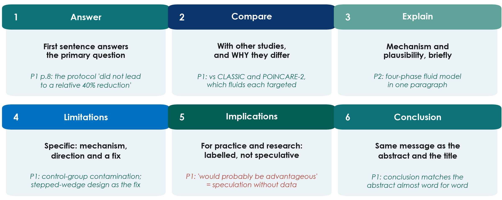{.neu-fig}

::: {.neu-takeaway}
**KEY MESSAGE** Answer first; limitations with their direction; conclusion = abstract = title.
:::

::: {.notes}
Teaching point: a good discussion makes six moves, in this order: answer the question; compare with other studies and explain why results differ; explain the mechanism briefly; state the limitations specifically, with their likely direction and a fix; give implications for practice and research, labelled as such; conclude with the same message as the abstract and title.

Paper 1 does most of this well: the first sentence answers the primary question (annotation \#36); the comparison with CLASSIC and POINCARE-2 explains WHY results differ (\#37); limitations are specific, with mechanism and a fix (\#38, \#39); the conclusion matches the abstract (\#44). Weak point: 'would probably be advantageous' is speculation without data (\#46).

Paper 2: one-paragraph mechanism using the four-phase fluid model (\#34); comparison closes the loop with the conflicting studies from the introduction (\#35). But its limitations miss survivor bias, residual lactate imbalance and confounding by indication (\#36).

Ask: which move do first-time writers usually skip? Expected: the limitations' direction, saying whether a bias makes the effect look bigger or smaller.
:::

## Worked example: the Discussion for FLUID-ICU question 1

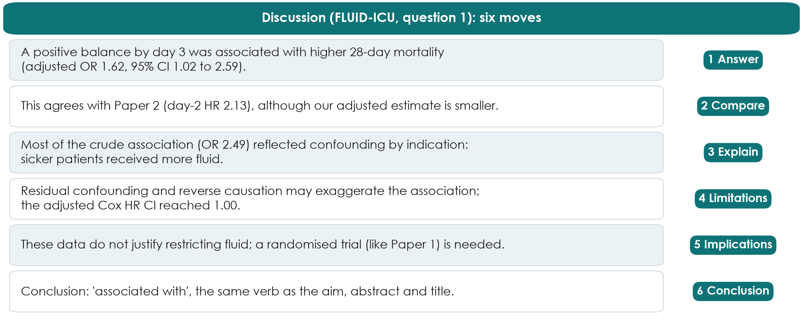{.neu-fig}

::: {.neu-takeaway}
**KEY MESSAGE** Answer with the number, explain the crude-adjusted gap, end with the same verb.
:::

::: {.notes}
WORKED EXAMPLE (six moves, one sentence each; numbers from key\_results.md, SIMULATED data).

1 Answer: adjusted OR 1.62 (95% CI 1.02 to 2.59). 2 Compare: Paper 2 found day-2 HR 2.13 (1.48 to 3.06). 3 Explain: the crude OR 2.49 fell to 1.62 after adjustment (confounding by indication). 4 Limitations: residual confounding, reverse causation (patients who are dying accumulate fluid), patients dying before day 3; the adjusted Cox HR 1.46 had a CI reaching 1.00. 5 Implications: no basis to restrict fluid. A trial like Paper 1 is needed. 6 Conclusion: 'associated with'.

Optional point for Q1 groups: the association looked stronger in heart failure (adjusted OR 4.39 vs 1.29, p for interaction 0.031, only 90 patients). This is a hypothesis, not a finding.
:::

## Why the odds ratio shrank: explain it in the Discussion

:::: {.columns}
::: {.column width="38%"}
::: {.neu-side-notes}
### FLUID-ICU Q1 (simulated)

- Crude OR 2.49 (1.70 to 3.70)
- Adjusted OR 1.62 (1.02 to 2.59)
- Imputed OR 1.70 (1.09 to 2.64)
- Gap = confounding by indication
:::
:::
::: {.column width="62%"}
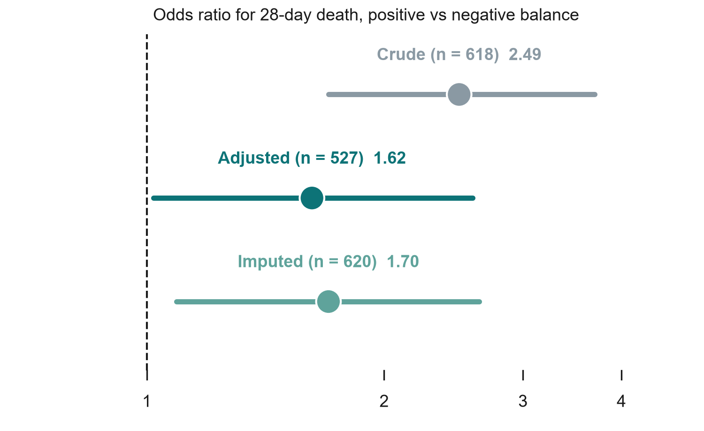{.neu-fig-side}
:::
::::

::: {.neu-takeaway}
**KEY MESSAGE** Report both; explain the gap; keep the verb at 'associated'.
:::

::: {.notes}
The figure shows the three estimates from results pack Q1 (Table 6): crude (n = 618), adjusted complete-case (n = 527) and adjusted after multiple imputation (n = 620).

Teaching point: the drop from 2.49 to 1.62 is the Session 4 lesson made visible: sicker patients received more fluid AND died more. The imputed estimate is close to the complete-case one, so missing lactate did not change the conclusion.

The adjusted CI starts at 1.02, just above 1. Calibrated sentence: 'a modest association remained'.

Ask: what would you write if the adjusted CI had crossed 1? Expected: 'no clear evidence of an association after adjustment', not 'no effect'.
:::

## Calibrated language: match the verb to the design

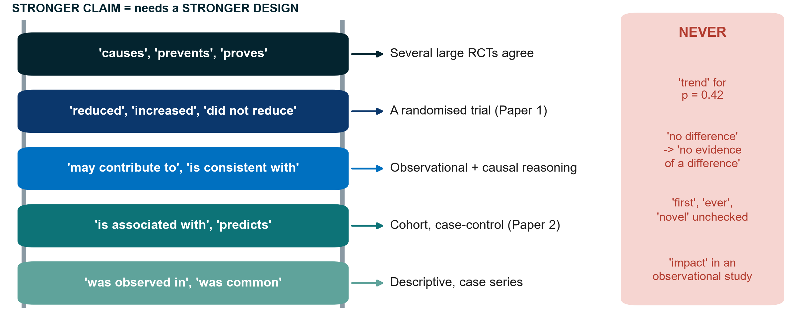{.neu-fig}

::: {.neu-takeaway}
**KEY MESSAGE** Climb the ladder only as far as your design allows.
:::

::: {.notes}
Teaching point: the strength of a verb is a claim. Over-interpretation (conclusions that go beyond the data) is one of the commonest reasons for rejection.

Read the ladder from the bottom: descriptive studies 'observe'; cohorts and case-control studies find that something 'is associated with' an outcome; strong observational evidence plus causal reasoning may 'contribute to'; a randomised trial may say 'reduced' or 'did not reduce'; 'causes' or 'proves' needs several consistent large trials.

NEVER: 'non-significant trend' for p = 0.42 (Paper 1, page 10, annotation \#41); 'no difference' when the study was too small (say 'no evidence of a difference', \#29); 'first', 'ever', 'novel' without checking ('lowest fluid balance ever published', \#40); 'impact', 'did not impact', 'show' in an observational study (Paper 2, \#1, \#27, \#28); 'the most reliable comparison' (\#32); ranking HRs from different cohorts as 'the highest risk' without a test (\#37).

Ask: rewrite 'positive fluid balance increases mortality' for Paper 2. Expected: 'a positive fluid balance on ICU day 2 was associated with higher 28-day mortality'.
:::

## Check: fix the verb (FLUID-ICU, simulated)

::: {.neu-banner style="--c:#6C3483"}
QUICK QUIZ · 2 min
:::

:::: {.columns}
::: {.column width="60%"}
::: {.neu-activity-steps style="--c:#6C3483"}
1. 'A positive balance caused higher mortality (OR 1.62).'
2. 'Fluid overload increases AKI (OR 1.27 per 10 ml/kg).'
3. 'There was a trend towards death (Cox HR 1.46, 95% CI 1.00 to 2.13).'
4. 'Lactate predicts death (OR 1.39 per mmol/L).'
:::
:::
::: {.column width="40%"}
::: {.neu-side .plain style="--c:#6C3483"}
Better

- 1 '... was associated with ...'
- 2 '... was associated with higher odds of AKI'
- 3 'HR 1.46 (1.00 to 2.13): CI reaches 1'
- 4 OK for prediction; for cause: 'associated'
:::
:::
::::

::: {.notes}
CHECK (2 minutes). Numbers from key\_results.md (SIMULATED): Q1 adjusted OR 1.62; Q2 adjusted OR 1.27 per 10 ml/kg; Q1 adjusted Cox HR 1.46 (1.00 to 2.13); Q4 adjusted complete-case OR 1.39 per mmol/L.

Room votes 'fine' or 'fix'; ask one person for the fix.

Sentence 3: no 'trend'. Give the estimate and say the CI reaches 1.

Sentence 4: 'predicts' is acceptable in a prediction sense; if the authors mean cause, 'associated with' is the honest verb.
:::

## The structured abstract: the shop window

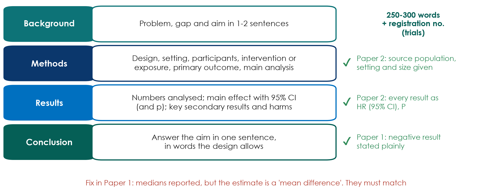{.neu-fig}

::: {.neu-takeaway}
**KEY MESSAGE** Every result in the abstract has a number and a confidence interval.
:::

::: {.notes}
Teaching point: most clinical journals want a structured abstract (Background, Methods, Results, Conclusions) of about 250-300 words; trials add the registration number. Many readers never go further, so it must stand alone.

Good practice: Paper 2's abstract gives the source population, setting and size (annotation \#4) and every result as HR with 95% CI and exact P (annotation \#5). Paper 1's conclusion reports a negative result plainly, with no spin (annotation \#6), and the registration number is in the abstract (annotation \#7).

Fix (Paper 1, annotation \#4): medians are reported but the estimate is called a 'mean difference', and p = 0.0506 with a CI touching 0 is given to four decimals. The summary, the estimate and the test must match, and borderline p-values are not 'nearly significant'.

Write the abstract LAST, and check that each number appears identically in the abstract, text and tables.

Ask: what is the first thing you look for in an abstract's Results? Expected: the main effect with its CI.
:::

## Worked example: the abstract and title for FLUID-ICU question 1

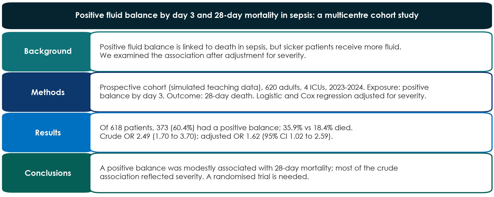{.neu-fig}

::: {.neu-takeaway}
**KEY MESSAGE** Copy the numbers from your Results. The abstract must not contain new ones.
:::

::: {.notes}
WORKED EXAMPLE (SIMULATED data; about 120 words shown, and a full abstract is up to 250).

Title: names the exposure, outcome, population and design; no 'impact'.

Methods: must say the data are simulated (course rule).

Results: the crude AND adjusted ORs, as in the Results; the participant numbers (618 analysed, 373 positive).

Conclusions: 'modestly associated', which matches an adjusted CI of 1.02 to 2.59.

Ask: which abstract sentence would change if the adjusted CI had been 0.95 to 2.40? Expected: Results and Conclusions, which would read 'no clear evidence of an association after adjustment'.
:::

## Title and keywords: your PICO in one line

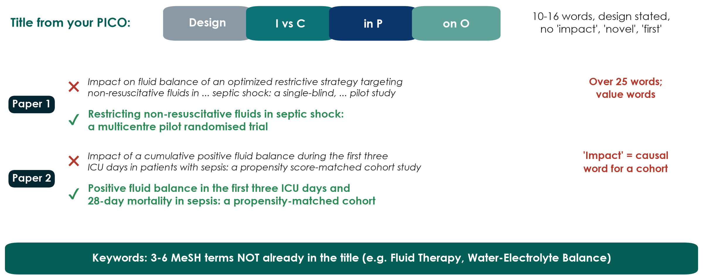{.neu-fig}

::: {.neu-takeaway}
**KEY MESSAGE** A good title states the question and the design, with no sales words.
:::

::: {.notes}
Teaching point: the title is the most-read sentence of the paper. Build it from the PICO: design, intervention or exposure vs comparator, population, outcome. Aim for about 10-16 words; state the design; avoid value-laden words ('impact', 'optimized', 'novel', 'first').

Paper 1 (annotation \#1): the design is in the title (good), but it is over 25 words and uses value words. A shorter descriptive version is on the slide.

Paper 2 (annotation \#1): 'Impact' is causal wording for an observational cohort; reviewers routinely ask for 'Association between ...'.

Keywords (Paper 1, annotation \#9): its keywords repeat words already in the title. Choose 3-6 MeSH terms that are NOT in the title, so the paper is found by more searches.

Ask: say your group's study in one line, starting with the design. That is the first draft of your working title. You will write it in the activity at the end of this section.
:::

## Before you submit: references, checklist, final read

:::: {.neu-cards style="--n:3"}
::: {.neu-card .plain style="--c:#0D7377"}
[References]{.neu-card-title}

- Use a reference manager
- Check every citation
- P2 cites the Sepsis-3 paper for its covariates
:::
::: {.neu-card .plain style="--c:#0B376C"}
[Reporting checklist]{.neu-card-title}

- Fill it in while writing
- Add page numbers
- Neither paper names CONSORT or STROBE
:::
::: {.neu-card .plain style="--c:#5FA39B"}
[Final read]{.neu-card-title}

- Text = table, every number
- Call-outs point to the right figure
- A co-author reads the tables
:::
::::

::: {.neu-takeaway}
**KEY MESSAGE** Most errors in these two papers needed no new data, only a careful co-author.
:::

::: {.notes}
References: use a reference manager (Zotero, Mendeley, EndNote) and check every citation. In Paper 2 the covariate list cites reference 26 (the Sepsis-3 definitions paper), almost certainly the wrong number (annotation \#22). Never cite a reference an AI tool suggested without reading it.

Reporting checklist: fill in CONSORT or STROBE while you write, with page numbers. Many journals require it at submission. Neither paper names its guideline (both annotated summaries flag this).

Final read: check every number in the text against the tables (Paper 1's creatinine, \#25), every figure call-out (Paper 1 refers to Fig. 1 where it means Fig. 2A, \#28), and typography of numbers (an IQR whose upper limit is below the lower limit, \#35).

Key message from the annotated summaries: almost all of Paper 1's errors would have been caught by a co-author reading the tables against the text.
:::

## Manuscript workshop 2  \|  30 minutes

:::: {.neu-statement}
::: {.neu-big}
Complete your draft
:::

::: {.neu-sub}
Introduction, Discussion, Abstract and Title
:::
::::

::: {.notes}
MANUSCRIPT WORKSHOP 2 (0:30-1:00). Course dataset. Groups add the Introduction, Discussion, Abstract and Title to last Saturday's Methods + Results.

Instructions: Practicals/s8\_exercises.md, Part B. Model paragraphs for Q1: Solutions/s8\_solutions.md.
:::

## Manuscript workshop 2: Introduction, Discussion, Abstract, Title

::: {.neu-banner style="--c:#0D7377"}
GROUP WORK · 30 min
:::

:::: {.columns}
::: {.column width="60%"}
::: {.neu-activity-steps style="--c:#0D7377"}
1. 0-8: Introduction, three paragraphs (two people)
2. 0-15: Discussion, six moves (three people)
3. 15-23: Abstract of 250 words, numbers from your Results
4. 23-27: Title (10-16 words, design stated) + keywords
5. 27-30: verb check: every 'cause' or 'impact' → 'associated'
:::
:::
::: {.column width="40%"}
::: {.neu-side .plain style="--c:#0D7377"}
Roles

- 2 Introduction
- 3 Discussion
- 1 number + verb checker
- All: Abstract and Title together
:::
:::
::::

::: {.neu-output style="--c:#0D7377"}
**OUTPUT** Complete draft (\~2,000 words) saved for the peer-review swap after the course
:::

::: {.notes}
WORKSHOP 2 (0:30-1:00). Start a 30-minute timer; Introduction and Discussion are written in parallel.

Circulate. Prompts: 'Does your first Discussion sentence answer the question with the number?' 'Is there a limitation with its direction?' 'Does your conclusion use the same verb as your aim?' 'Is every number in the abstract identical to the Results?'

Q4 group: discuss why complete-case and imputed results differ (or not). Q5 group: survivors only, so say who is missing.

At 0:58 ask groups to save; the draft goes to the peer-review swap (homework, 2 weeks, using the 10-question checklist from 8.3).
:::

## Break

::: {.neu-banner style="--c:#8A99A3"}
BREAK · 15 min
:::

:::: {.columns}
::: {.column width="60%"}
::: {.neu-activity-steps style="--c:#8A99A3"}
1. Save and send your manuscript draft
2. Groups 1-3: collect Paper 1 (RCT) and the answer grid
3. Groups 4-5: collect Paper 2 (cohort) and the answer grid
4. Presenters: check your slides open on the presentation laptop
5. Back at 1:15 sharp
:::
:::
::: {.column width="40%"}
::: {.neu-side .plain style="--c:#8A99A3"}
After the break

- Getting published (25 min)
- Be the reviewer (20 min)
- Group presentations (45 min)
:::
:::
::::

::: {.notes}
BREAK (1:00-1:15).

During the break: put the papers and the student appraisal pack (Practicals/s8\_exercises.md, Part D) on the tables: Paper 1 on tables 1-3, Paper 2 on tables 4-5. Use the ORIGINAL (unannotated) papers.

Load all five presentations on one laptop and test the projector.

Collect the five manuscript drafts (shared folder). They are needed for the peer-review swap.
:::

## 8.2  \|  25 minutes

:::: {.neu-statement}
::: {.neu-big}
Getting published
:::

::: {.neu-sub}
From checklist to proofs, and the traps on the way
:::
::::

::: {.notes}
SECTION 8.2 (1:15-1:40). Ten slides, the 3-minute EQUATOR demo and a 2-minute check.

Pace: about 2 minutes per slide. Point to the picture, give one example, move on. The appraisal needs its full 20 minutes at 1:40.

Link to the manuscripts: the FLUID-ICU drafts would go through exactly this route: STROBE checklist, journal choice, submission package, peer review.
:::

## Reporting guidelines: choose by design

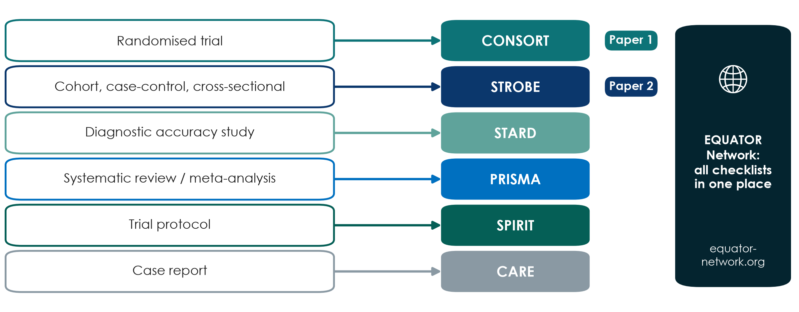{.neu-fig}

::: {.neu-takeaway}
**KEY MESSAGE** Name your guideline in Part 4 and use it as a writing checklist.
:::

::: {.notes}
Teaching point: for each study design there is an internationally agreed reporting checklist; all of them are collected free at the EQUATOR Network (equator-network.org).

CONSORT for randomised trials (updated as CONSORT 2025), STROBE for observational studies (cohort, case-control, cross-sectional), STARD for diagnostic accuracy, PRISMA for systematic reviews, SPIRIT for trial protocols (SPIRIT 2025), CARE for case reports.

Running example: Paper 1 is an RCT (CONSORT); Paper 2 is a cohort (STROBE). Interesting finding from the annotated papers: neither paper names its guideline. Paper 1 does include the CONSORT flow diagram in the main text; Paper 2 keeps its flow chart in the supplement.

Many journals require the completed checklist at submission, with page numbers.

Misconception: 'reporting guidelines tell you how to do the study'. They tell you what to report, but reading them BEFORE you start is the best design checklist you will find.

Ask each group: which guideline fits your proposal? Expected: most ICU proposals are cohort or cross-sectional (STROBE); a few are trials (CONSORT, and SPIRIT for the protocol).
:::

## Choosing a journal: four checks

::: {.neu-intro}
Decide the target journal before you write: it sets the rules.
:::

:::: {.neu-cards style="--n:4"}
::: {.neu-card .plain style="--c:#0D7377"}
[Fit]{.neu-card-title}

- Who needs your result?
- Read 3 recent issues
- Similar designs published?
:::
::: {.neu-card .plain style="--c:#0B376C"}
[Trust]{.neu-card-title}

- Indexed: MEDLINE, DOAJ, Scopus or Web of Science
- Clear peer-review policy
:::
::: {.neu-card .plain style="--c:#5FA39B"}
[Rules]{.neu-card-title}

- Guide for Authors
- Word limit, checklist
- Registration required?
:::
::: {.neu-card .plain style="--c:#0070C0"}
[Cost & speed]{.neu-card-title}

- Fee (APC) and waivers
- Licence: CC BY or BY-NC-ND
- Paper 1: 7 weeks; Paper 2: 7 months
:::
::::

::: {.neu-takeaway}
**KEY MESSAGE** A good journal is one your readers read, and one that is honestly run.
:::

::: {.notes}
Teaching point: choose the journal at the start, because its Guide for Authors sets word limits, structure, checklist and registration rules.

Fit: the people who need your answer (ICU nurses? pharmacists? intensivists?) decide the journal. Trust: indexed in MEDLINE/PubMed, the Directory of Open Access Journals (DOAJ), Scopus or Web of Science, with a clear peer-review and retraction policy.

Cost & speed: many open-access journals charge an article-processing charge (APC); ask about waivers and institutional agreements. Licence: Paper 1 is CC BY-NC-ND (share, but no adaptation or commercial use), Paper 2 is CC BY (re-use with attribution).

Speed: Paper 1 went from submission to acceptance in about 7 weeks (10 Sept to 31 Oct 2024); Paper 2 took about 7 months (15 Jan to 24 Aug 2023). Speed varies; it is not a sign of quality by itself.

Ask: name one journal your unit reads regularly. That is often a sensible first target.
:::

## Preprints, open access and licences

:::: {.neu-cards style="--n:3"}
::: {.neu-card .plain style="--c:#0D7377"}
[Preprint]{.neu-card-title}

- Posted before peer review (e.g. medRxiv)
- Fast, timestamped, open feedback
- NOT peer-reviewed: say so
- Check the journal's policy
:::
::: {.neu-card .plain style="--c:#0B376C"}
[Open access]{.neu-card-title}

- Free for everyone to read
- Gold: journal charges a fee (APC)
- Green: accepted version in a repository
- Ask about fee waivers
:::
::: {.neu-card .plain style="--c:#5FA39B"}
[Licence]{.neu-card-title}

- CC BY: re-use with credit (Paper 2)
- CC BY-NC-ND: share, no changes (Paper 1)
- Read it before you sign
:::
::::

::: {.neu-takeaway}
**KEY MESSAGE** Know who can read, re-use and pay before you submit.
:::

::: {.notes}
Preprints: a manuscript posted on a public server (for health research, medRxiv is the best known) before or during peer review. Benefits: speed, a public timestamp, early feedback. Risks: it has not been peer-reviewed, and the media or colleagues may treat it as established. Most journals accept submissions that were preprinted. Check the journal's policy first, and update the preprint with the published reference.

Open access: gold OA means the journal makes the article free and usually charges an article-processing charge (APC). Both our papers are gold OA (annotations \#2). Green OA means you deposit the accepted manuscript in a repository, often after an embargo. Ask about waivers and institutional agreements.

Licences: Paper 2 is CC BY (anyone may re-use and adapt with credit); Paper 1 is CC BY-NC-ND (share, but no adaptation or commercial use). This also matters when you want to re-use a figure in teaching.

Ask: you want to put Paper 1's flow chart, redrawn, in your teaching slides. Allowed? Expected: adaptation is not covered by CC BY-NC-ND, so ask permission or cite and link instead.
:::

## Spot the predatory journal

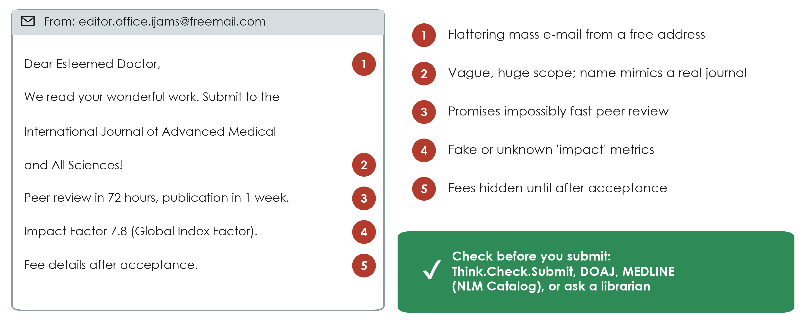{.neu-fig}

::: {.neu-takeaway}
**KEY MESSAGE** If a journal finds you by flattering e-mail, check it twice.
:::

::: {.notes}
Teaching point: predatory journals take publication fees without providing real peer review, editing or indexing. Your work disappears into a journal nobody trusts, and you cannot submit it elsewhere.

Walk the five red flags on this (invented) e-mail: flattering mass e-mail from a free address; a vague, huge scope and a name that imitates a real journal; impossibly fast review; fake or unknown 'impact' metrics; fees hidden until after acceptance. Other flags: editorial board members who cannot be verified, no physical address, many spelling errors.

Checks: Think.Check.Submit (a free checklist), DOAJ for open-access journals, the NLM Catalog to see if a journal is really indexed in MEDLINE. Also ask the hospital librarian.

Ask: how many of you received an e-mail like this in the last month? Usually many hands: every clinician who has published once receives them.

The s8 exercise sheet (Part C) has a short 'spot the predatory journal' exercise for later.
:::

## Live demo: find a checklist and check a journal

::: {.neu-banner style="--c:#B5651D"}
LIVE DEMO · 3 min
:::

:::: {.columns}
::: {.column width="60%"}
::: {.neu-activity-steps style="--c:#B5651D"}
1. Open the EQUATOR Network website and search 'CONSORT'
2. Show the checklist and the flow diagram (Paper 1 has one)
3. Find STROBE the same way (Paper 2)
4. Check a journal: DOAJ and NLM Catalog search
5. Open the Think.Check.Submit checklist
:::
:::
::: {.column width="40%"}
::: {.neu-side .plain style="--c:#B5651D"}
Watch for

- Where the checklist PDF is
- How to see if a journal is in MEDLINE
- Three questions to ask any journal
:::
:::
::::

::: {.neu-output style="--c:#B5651D"}
**OUTPUT** Each group checks the journal + guideline in its publication plan
:::

::: {.notes}
DEMO (1:24-1:27). Full script with offline fallback: Course/Demos/s8\_demo.md.

Keep it to 3 minutes: EQUATOR home page, search box, CONSORT 2025 page, checklist and flow diagram; then STROBE. Then DOAJ search for a journal title, and the NLM Catalog with the filter 'currently indexed in MEDLINE'. End on the Think.Check.Submit checklist.

If the internet fails, use the screenshots described in the demo script.

Close: ask each group to check the target journal and guideline in its publication plan (Proposal builder 7) and on its FLUID-ICU draft (STROBE). Allow 30 seconds, then continue with the submission package.
:::

## The submission package

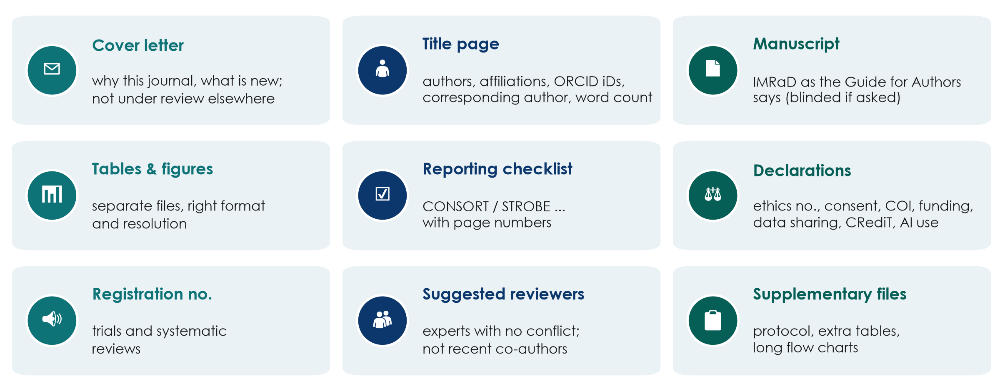{.neu-fig}

::: {.neu-takeaway}
**KEY MESSAGE** Submit the whole package at once. Missing items mean delay.
:::

::: {.notes}
Teaching point: journals check the package before any scientific review. Missing items send the manuscript straight back.

Cover letter: one page covering why this journal, what is new, that the work is not under consideration elsewhere, and any preprint. Title page: all authors, affiliations, ORCID iDs (a free, permanent researcher identifier that every participant can register at orcid.org), corresponding author, word count. Manuscript in the journal's format (blinded if the journal uses double-blind review). Tables and figures in the required files and resolution. The reporting checklist with page numbers. Declarations: ethics approval number, consent, competing interests, funding, data availability, author contributions (CRediT) and AI use. The registration number for trials and systematic reviews. Suggested reviewers: experts without conflicts, not recent co-authors. The editor decides whether to use them. Supplementary files.

Running example: Paper 1 has a complete declarations block, exactly what the submission system asks for, item by item (annotation \#48). Graphical abstracts are a journal-specific requirement you only find in the Guide for Authors (\#8).

Ask: who in your group already has an ORCID iD? Encourage everyone to register this week.
:::

## The peer-review journey

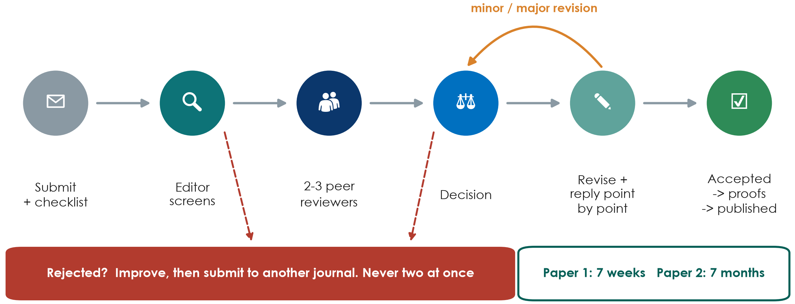{.neu-fig}

::: {.neu-takeaway}
**KEY MESSAGE** Most papers are revised before acceptance. Reply to every point politely.
:::

::: {.notes}
Walk the six stations. Submit (with cover letter, reporting checklist and declarations). The editor screens, and many papers are rejected here without review ('desk rejection') because they do not fit or are poorly reported. Two or three peer reviewers comment. The editor decides: accept, minor revision, major revision or reject. You revise and answer every comment point by point. Accepted, then proofs (read them carefully!) and publication.

Running example: our annotators judged Paper 1 'minor revision' and Paper 2 'major revision'. Both were published, and both still contain errors a careful reviewer would have caught (Paper 1 even prints the same 'Study protocol' paragraph twice, a proof-reading miss).

Rule: submit to ONE journal at a time; after rejection, improve the paper using the reviews, then submit elsewhere.

Ask: a reviewer is wrong about something. What do you do? Expected: thank them, explain politely with evidence, and clarify the text so the next reader is not confused.
:::

## Responding to reviewers: the point-by-point table

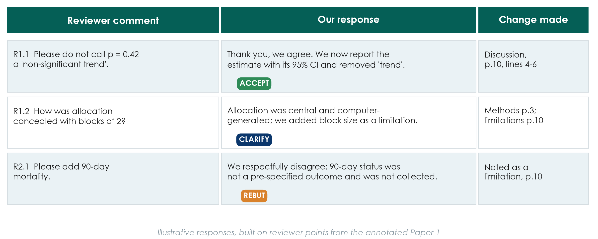{.neu-fig}

::: {.neu-takeaway}
**KEY MESSAGE** Thank, answer every point, show what changed, and disagree politely with evidence.
:::

::: {.notes}
Teaching point: the response letter is a table: every reviewer comment, your response, and exactly where the manuscript changed (page and line). Number the comments (R1.1, R1.2, R2.1 ...).

Tone: thank the reviewers, agree where you can, never ignore a point, never argue emotionally. When you disagree (a rebuttal), explain politely with evidence and, where possible, still clarify the text so the next reader is not confused.

The three rows are illustrative, built on what the annotators say a reviewer would have asked Paper 1: remove the 'non-significant trend' (accept); justify blocks of 2 (clarify and add a limitation); a request for an outcome that was never collected (polite rebuttal: you cannot add data that do not exist, but you can name it as a limitation).

Common mistakes: changing the manuscript without saying where; answering 'done' with no detail; accepting a request that makes the paper wrong just to please the reviewer.

A template is in Course/Templates/ (response to reviewers).

Ask: a reviewer asks for an analysis you think is inappropriate. What do you write? Expected: thank, explain why with a reference, and offer an alternative if one exists.
:::

## After acceptance: proofs, sharing, corrections

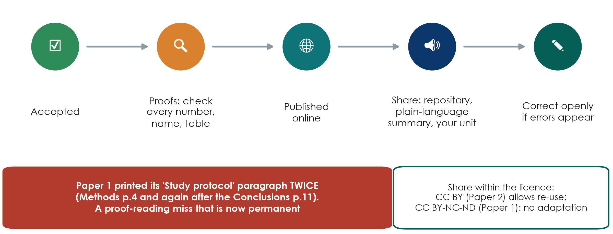{.neu-fig}

::: {.neu-takeaway}
**KEY MESSAGE** Read the proofs as carefully as the data. Errors become permanent.
:::

::: {.notes}
Teaching point: after acceptance the publisher sends proofs, often with a short deadline (days). Read them slowly: every number, every name and affiliation, every table and figure. This is the last chance.

Running example: Paper 1 prints the whole 'Study protocol' paragraph twice: in the Methods (page 4) and again after the Conclusions (page 11). It is a duplication that should have been caught at proof stage (annotation \#45). Paper 2's affiliations have inconsistent capitalisation (\#42).

Sharing: post the article as its licence and the journal's policy allow: institutional repository, a plain-language summary for patients and colleagues, a short talk in your department, social media. If the media call, keep to what the design allows (calibrated language again).

Corrections: if you find an error after publication, contact the journal. A correction is honest; a retraction is for serious errors or misconduct.

Ask: who will present your published results back to your unit? That is part of the dissemination plan.
:::

## Check: true or false?

::: {.neu-banner style="--c:#6C3483"}
QUICK QUIZ · 2 min
:::

:::: {.columns}
::: {.column width="60%"}
::: {.neu-activity-steps style="--c:#6C3483"}
1. 'A journal that e-mails me first is probably predatory'
2. 'I can send my paper to two journals at once to save time'
3. 'A preprint has been peer reviewed'
4. 'I must answer every reviewer comment, even if I disagree'
5. 'The FLUID-ICU paper should follow CONSORT'
:::
:::
::: {.column width="40%"}
::: {.neu-side .plain style="--c:#6C3483"}
Answers

- 1 Often: check it twice
- 2 False: duplicate submission
- 3 False
- 4 True: politely, with evidence
- 5 False: STROBE (cohort)
:::
:::
::::

::: {.notes}
CHECK (1:38-1:40). Thumbs up (true) or down (false) for each; reveal.

Statement 1 is 'often true' rather than always. Real journals also invite papers, but a flattering mass e-mail from an unknown journal deserves the five-flag check.
:::

## 8.3  \|  20 minutes

:::: {.neu-statement}
::: {.neu-big}
Be the reviewer
:::

::: {.neu-sub}
Practice for the peer-review swap of your manuscripts
:::
::::

::: {.notes}
SECTION 8.3 (1:40-2:00). Full instructor guide: Course/Resources/appraisal\_instructor\_guide.md (model answers, prompts, key messages).

Structure: 2 minutes set-up, 10 minutes group work, 8 minutes plenary. Papers and grids were put on the tables during the break.

Why now: after the course each group reviews another group's FLUID-ICU draft with the SAME 10 questions. This is the rehearsal.

Reassure: 'Can't tell' is a perfectly good answer if the paper does not say.
:::

## The jigsaw: three groups on the trial, two on the cohort

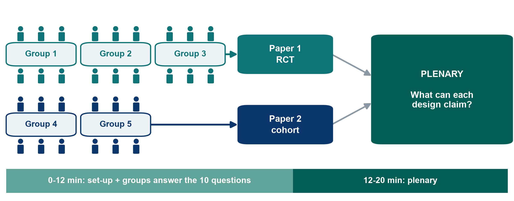{.neu-fig}

::: {.neu-takeaway}
**KEY MESSAGE** Same clinical question, two designs. Compare what each may claim.
:::

::: {.notes}
Explain the set-up in one minute. Both papers address our running question (fluids in septic shock) with different designs. Groups 1-3 appraise Paper 1, the randomised trial (Boulet 2024, Critical Care). Groups 4-5 appraise Paper 2, the propensity-matched cohort (Hyun 2023, Annals of Intensive Care).

Each group answers the same 10 questions on the answer grid: Yes / No / Can't tell, plus the page where they found it.

Then the plenary: groups report, and we compare what each design is allowed to claim.

Tip: split the work inside the group: pairs take 3-4 questions each, then the group agrees.

Link to Session 4: the 10 questions are a simplified version of the formal risk-of-bias tools: RoB 2 for Paper 1, Newcastle-Ottawa (or the newer ROBINS-E) for Paper 2. We do not run the formal tools today.
:::

## The 10-question checklist (1-5)

:::: {.neu-cards style="--n:5"}
::: {.neu-card .plain style="--c:#0D7377"}
[1  Question]{.neu-card-title}

- Can you write the study's PICO in one line?
:::
::: {.neu-card .plain style="--c:#0B376C"}
[2  Design]{.neu-card-title}

- What is the design, and is it the right one for the question?
:::
::: {.neu-card .plain style="--c:#5FA39B"}
[3  Participants]{.neu-card-title}

- Who was included, and who was left out?
- Would your patients have been included?
:::
::: {.neu-card .plain style="--c:#0070C0"}
[4  Comparison groups]{.neu-card-title}

- Were the groups similar at the start (Table 1)?
- How was this achieved (randomisation / matching / adjustment)?
:::
::: {.neu-card .plain style="--c:#055F56"}
[5  Bias]{.neu-card-title}

- Who knew which group patients were in (blinding)?
- Could that change the outcome?
:::
::::

::: {.notes}
The checklist, part 1. Read each question aloud once. Do not explain the answers.

Q1-Q2 are about the question and the design (Sessions 1-4). Q3 is about who was studied, external validity: would your patients be in this study? Q4 is about whether the groups were comparable at baseline (look at Table 1). Q5 is about blinding.

Hint to give: for Q4 the two papers use different tools: randomisation versus propensity-score matching. Ask them to find the sentence that says which.

Answers are Yes / No / Can't tell, plus the page.
:::

## The 10-question checklist (6-10)

:::: {.neu-cards style="--n:5"}
::: {.neu-card .plain style="--c:#0D7377"}
[6  Outcome]{.neu-card-title}

- Was there ONE pre-specified primary outcome,
- measured the same way in both groups?
:::
::: {.neu-card .plain style="--c:#0B376C"}
[7  Numbers]{.neu-card-title}

- What is the main result as an effect size with 95% CI?
- Is the CI narrow or wide?
:::
::: {.neu-card .plain style="--c:#5FA39B"}
[8  Words vs design]{.neu-card-title}

- Do the conclusions match the design
- ('associated' vs 'caused'; no 'trend' for p = 0.42)?
:::
::: {.neu-card .plain style="--c:#0070C0"}
[9  Limitations]{.neu-card-title}

- Are the main limitations stated honestly?
- Name one the authors missed.
:::
::: {.neu-card .plain style="--c:#055F56"}
[10  Use]{.neu-card-title}

- Would this change practice in your unit?
- Why / why not?
:::
::::

::: {.notes}
The checklist, part 2. Q6 and Q7 use what we learnt in Session 6: one primary outcome, an effect size with its 95% confidence interval.

Q8 is the heart of today's exercise: are the words in the title, abstract and discussion as strong as the design allows? 'Caused' or 'impact' needs randomisation; observational studies say 'associated'. And p = 0.42 is never a 'trend'.

Q9: the authors' own limitations section, plus one they missed. Each paper has a clear one (see the instructor guide).

Q10: their clinical judgement. There is no single right answer, but they must give a reason.
:::

## Be the reviewer: appraise your paper

::: {.neu-banner style="--c:#0D7377"}
GROUP WORK · 10 min
:::

:::: {.columns}
::: {.column width="60%"}
::: {.neu-activity-steps style="--c:#0D7377"}
1. Pairs take questions 1-3, 4-6 and 7-10
2. Read ONLY the pages listed on your answer grid
3. Answer Yes / No / Can't tell + page number
4. Minute 7: agree the group answers
5. Minute 9: choose a speaker; write your verdict in one sentence
:::
:::
::: {.column width="40%"}
::: {.neu-side .plain style="--c:#0D7377"}
Where to look

- Abstract: question and result
- Methods: design, blinding, outcome
- Table 1: groups similar?
- Discussion: words and limitations
:::
:::
::::

::: {.neu-output style="--c:#0D7377"}
**OUTPUT** Completed answer grid + one-sentence verdict per group
:::

::: {.notes}
GROUP WORK (1:42-1:52). Start a visible 10-minute timer.

Circulate between tables. The most useful prompts (more in the instructor guide): Paper 1 groups: 'Who was NOT blinded, and who decided how much fluid the patients got?' (clinicians were unblinded and they prescribe the fluids that make up the outcome); 'Find p = 0.42 in the Discussion. What word did the authors use?' (page 10, 'non-significant trend'). Paper 2 groups: 'Who decided which patients got more fluid?' (the doctors, and sicker patients receive more fluid: confounding by indication); 'Patients had to stay at least 3 days in the ICU. Who is missing?' (early deaths and early discharges: survivor bias).

Time calls: at minute 7 'agree your answers'; at minute 9 'choose your speaker and write your one-sentence verdict'.

If a group is stuck on statistics, tell them 'Can't tell' is allowed and move them to Q8 and Q9.
:::

## What may each design claim?

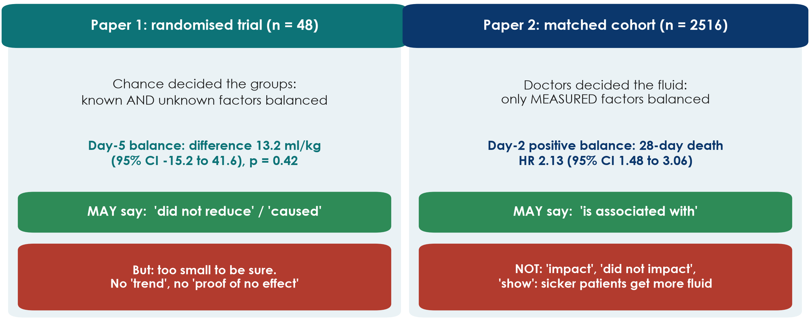{.neu-fig}

::: {.neu-takeaway}
**KEY MESSAGE** Randomisation earns the word 'caused'; observation earns 'associated'.
:::

::: {.notes}
Use this slide at the START of the plenary, after the first group reports, to frame the comparison.

Paper 1: chance decided who got the restrictive strategy, so known AND unknown factors are balanced on average, so a randomised trial may make a causal claim. Its claim is negative: the strategy did not reduce day-5 fluid balance (difference 13.2 ml/kg, 95% CI -15.2 to 41.6, p = 0.42). But with 48 patients the CI is wide: this is 'no evidence of an effect', not 'evidence of no effect', and certainly not a 'trend'.

Paper 2: doctors decided how much fluid each patient got. Propensity matching balances only the factors that were measured; sicker patients receive more fluid (confounding by indication, Session 4) and some severity is never fully measured. So the paper may say a positive balance on day 2 'is associated with' higher 28-day mortality (HR 2.13, 95% CI 1.48 to 3.06), not that it 'impacts' or 'shows' anything causal, although its title says 'Impact'.

Ask: if you had to change ICU practice tomorrow, which paper is stronger evidence for causation, and which tells you more about real-world risk? Expected: the RCT for causation (but it is a small pilot); the cohort for a large, real-world association that needs a trial to confirm.
:::

## The two papers side by side

| Paper 1: RCT (Boulet 2024) | Paper 2: cohort (Hyun 2023) |
|:---|:---|
| Groups made similar by | Randomisation 1:1 (blocks of 2) | Propensity matching (measured factors only) |
| Who knew the group | Clinicians knew; patients, statistician blinded | Everyone (observational) |
| Main result | 13.2 ml/kg (95% CI -15.2 to 41.6), p = 0.42 | Day 2: HR 2.13 (1.48 to 3.06) |
| Missed limitation | Blocks of 2 with unblinded clinicians | Survivor bias (ICU stay of 3+ days) |
| Wording problem | 'Non-significant trend' (p = 0.42) | 'Impact', 'did not impact', 'show' |
| May claim | Did not reduce day-5 balance (small pilot) | Positive balance associated with death |

::: {.neu-table-caption}
Pages and details: Resources/appraisal\_instructor\_guide.md
:::

::: {.notes}
Reveal this table at the END of the plenary as the summary, after the groups have given their own answers, not before.

Row by row: how the groups were made comparable; who knew the allocation; the main effect with its CI; the limitation the authors missed (Paper 1: permuted blocks of 2 make the next allocation predictable when clinicians are unblinded, page 3; Paper 2: requiring at least 3 ICU days excludes patients who died or left early (survivor bias), page 2); the wording problem (Paper 1 page 10; Paper 2 title and page 4); and the claim each design supports.

Both papers are good, published papers in Q1 journals, and both have fixable flaws. That is the normal state of the literature, which is why appraisal is a clinical skill.
:::

## Plenary: what can each design claim?

::: {.neu-banner style="--c:#1F5C7A"}
DISCUSSION · 6 min
:::

:::: {.columns}
::: {.column width="60%"}
::: {.neu-activity-steps style="--c:#1F5C7A"}
1. Groups 1 and 4 report Q1-Q4 (1 min each)
2. Groups 2 and 5 report Q5-Q8 (1 min each)
3. Group 3 reports Q9-Q10 for Paper 1
4. Compare Q4, Q5 and Q8 across the two papers
5. Vote on Q10: would either paper change practice in our unit?
:::
:::
::: {.column width="40%"}
::: {.neu-side .plain style="--c:#1F5C7A"}
Land these messages

- Design sets the verb: caused vs associated
- A wide CI means 'we don't know yet'
- Published is not the same as correct
- Name the reporting guideline: CONSORT, STROBE
:::
:::
::::

::: {.neu-output style="--c:#1F5C7A"}
**OUTPUT** Each group states what its paper may and may not claim
:::

::: {.notes}
PLENARY (1:52-2:00). Keep strict time: 1 minute per report. Use the design-claims slide first and the side-by-side table last.

Steer the comparison to Q4 (randomisation vs matching), Q5 (blinding) and Q8 (words vs design). Group 5 should answer Q9-Q10 for Paper 2 when Group 3 does it for Paper 1, if time allows.

The four key messages are on the side panel. Say each of them out loud before you close.

Model answers for all ten questions for both papers: Resources/appraisal\_instructor\_guide.md.

Transition: 'Now it is your turn to be reviewed.' Then announce the presentation order.
:::

## Key words of Session 8

| Term | In plain words |
|:---|:---|
| Introduction funnel | Known → not known → aim, in three paragraphs |
| Six moves | Answer, compare, explain, limitations, implications, conclusion |
| Calibrated language | Verbs as strong as the design allows ('associated', not 'caused') |
| Predatory journal | Takes fees without real peer review or indexing |
| Point-by-point response | A table answering every reviewer comment with the change made |
| Preprint | Public manuscript posted before peer review |

::: {.neu-table-caption}
Full glossary (EN-VN): Course/References/
:::

::: {.notes}
Read the six terms with the room before the presentations. Ask someone to explain each in their own words first.
:::

## From question to publication: what you can now do

:::: {.neu-cards style="--n:4"}
::: {.neu-card .plain style="--c:#0D7377"}
[Protect]{.neu-card-title}

- Ethics, consent, registration
- Honest data and authorship
:::
::: {.neu-card .plain style="--c:#0B376C"}
[Write]{.neu-card-title}

- IMRaD in the right order
- Numbers with CIs
- Verbs that match the design
:::
::: {.neu-card .plain style="--c:#5FA39B"}
[Publish]{.neu-card-title}

- Reporting checklist
- Trusted journal
- Polite, complete responses
:::
::: {.neu-card .plain style="--c:#0070C0"}
[Review]{.neu-card-title}

- 10 questions
- What each design may claim
:::
::::

::: {.neu-takeaway}
**KEY MESSAGE** Next: present your proposal and swap manuscripts for peer review.
:::

::: {.notes}
Take-home before the presentations (1 minute). Read the four cards; the closing block will come back to what the course built.

Transition: 'Now it is your turn to be reviewed.' Then announce the running order.
:::

## Group presentations  \|  45 minutes

:::: {.neu-statement}
::: {.neu-big}
Your proposals and publication plans
:::

::: {.neu-sub}
6 minutes to present, 2 minutes of feedback: be kind, be specific
:::
::::

::: {.notes}
PRESENTATIONS (2:00-2:45). Five groups x 8 minutes = 40 minutes, then 5 minutes for a one-sentence summary of each group's manuscript (or buffer). The timekeeper is essential.

Appoint a timekeeper from the audience (or the co-trainer) with the green, yellow and red cards.

Remind the room: the reviewing skills we just used now apply to our own proposals, but feedback is given the way you would like to receive it.
:::

## How presentations are scored

| Criterion | What we look for | Points |
|:---|:---|:---|
| 12  Structure & content | 6 slides; key decisions incl. journal + guideline visible | 0-6 |
| 13  Clarity | Every profession understands; one message per slide | 0-6 |
| 14  Visual design | Readable from the back; pictures, not text | 0-6 |
| 15  Timekeeping | Finished between 5:00 and 6:00 | 0-6 |
| 16  Questions & teamwork | Honest answers; several members speak | 0-6 |

::: {.neu-table-caption}
6 excellent, 4 good, 2 needs work, 0 missing = presentation /30.  Written proposal + publication plan /70 marked after the course.
:::

::: {.notes}
On the day we score the PRESENTATION only: criteria 12-16 of Course/Assignment/proposal\_rubric.md, 6/4/2/0 points each, total out of 30. The written proposal and publication plan (criteria 1-11, out of 70) are marked after the course.

Who scores: the instructors score every group; one peer group (rotating: Group 2 on Group 1, Group 3 on Group 2 ... Group 1 on Group 5) fills the feedback form at the end of proposal\_rubric.md.

Feedback in 2 minutes (Assignment/presentation\_guide.md): peer group 45 s (two stars and a wish); instructor 60 s (one strength, the most important improvement, one question); presenting group 15 s ('thank you', no defending).

Presenting does. It is feedback to help the group polish the proposal for the ethics committee.
:::

## Running order and timekeeping

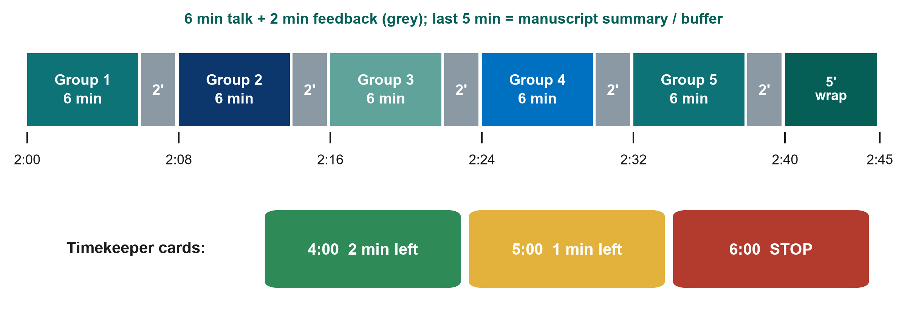{.neu-fig}

::: {.neu-takeaway}
**KEY MESSAGE** When the red card goes up, finish your sentence and stop.
:::

::: {.notes}
Show the running order. Clock times are relative to the start of the session (2:00 = two hours in; with an 08:00 start this is 10:00-10:45). 2:40-2:45: each group gives its FLUID-ICU question and main result in one sentence, or the 5 minutes absorb any overrun.

The timekeeper shows GREEN at 4 minutes (2 minutes left), YELLOW at 5 minutes (1 minute left) and RED at 6 minutes (stop).

The next group walks to the front during the previous group's feedback. All slides are already on one laptop, so no USB changes.

If the session runs late, shorten the feedback, never the presentations of the last groups. It is unfair to the group that presents last.
:::

## Group proposal presentations

::: {.neu-banner style="--c:#0070C0"}
GROUP PRESENTATIONS · 45 min
:::

:::: {.columns}
::: {.column width="60%"}
::: {.neu-activity-steps style="--c:#0070C0"}
1. 6 minutes, 6 slides: question, design, data and analysis, ethics and feasibility, publication plan (title, journal, guideline, abstract)
2. Timekeeper: green at 4:00, yellow at 5:00, red at 6:00
3. Feedback 2 min: peer group (two stars and a wish), then instructor
4. Peer group and instructors fill the feedback form
5. Next group sets up during the feedback
:::
:::
::: {.column width="40%"}
::: {.neu-side .plain style="--c:#0070C0"}
Running order

- 2:00  Group 1
- 2:08  Group 2
- 2:16  Group 3
- 2:24  Group 4
- 2:32  Group 5
- 2:40  Manuscript summary
:::
:::
::::

::: {.neu-output style="--c:#0070C0"}
**OUTPUT** Five proposals and publication plans presented; feedback forms to the trainers
:::

::: {.notes}
Leave this slide on screen during the presentations if groups present from their own file; otherwise switch to each group's slides.

Instructor feedback: start with a genuine strength; give the most important improvement for the written proposal or publication plan (usually design, outcome definition, feasibility or the choice of journal and guideline); one question if time allows.

Check slide 6 of each group: target journal + correct guideline (STROBE for a cohort, CONSORT for a trial), working title in calibrated words, CRediT roles, one line of the abstract skeleton.

Typical issues to watch for: outcome not measurable in routine data; a causal claim planned from an observational design (link back to the appraisal!); no plan for consent in sedated patients; unrealistic recruitment.

At 2:40 each group gives its manuscript in one sentence (question + main result, 1 minute each). At 2:45 collect the feedback forms and move straight to the closing: post-course quiz, evaluation and the peer-review swap (next slides).
:::

## Extra slides  \|  Session 8

:::: {.neu-statement}
::: {.neu-big}
Extra slides: Session 8
:::

::: {.neu-sub}
Use only if time allows, or for self-study
:::
::::

::: {.notes}
EXTRA: the slides after this divider are optional. Use them if time allows or point participants to them for self-study.
:::

## Write it right: fix the spin, then draft your title

::: {.neu-banner style="--c:#0B376C"}
INDIVIDUAL TASK · 6 min
:::

:::: {.columns}
::: {.column width="60%"}
::: {.neu-activity-steps style="--c:#0B376C"}
1. Alone (2 min): rewrite Paper 1's 'non-significant trend' sentence honestly
2. Alone: rewrite Paper 2's title with calibrated wording
3. Group (4 min): draft your working title from your PICO
4. Group: one line each for Background, Methods, expected Results, Conclusion
:::
:::
::: {.column width="40%"}
::: {.neu-side .plain style="--c:#0B376C"}
Publication plan (Part 4)

- Working title
- Abstract skeleton
- Authors + CRediT roles
- Target journal + guideline (8.2)
:::
:::
::::

::: {.neu-output style="--c:#0B376C"}
**OUTPUT** Working title + abstract skeleton to show in your presentation
:::

::: {.notes}
EXTRA: Optional 6-minute writing drill on the two papers (use if Manuscript workshop 2 finishes early or as homework). Worksheet: Practicals/s8\_exercises.md, Part A (writing exercises).

Spin sentence (Paper 1, page 10): 'considering the non-significant trend in fluid balance reduction in the optimized group, our approach ... remains worth exploring in a larger randomized controlled trial'. Model rewrite: 'The point estimate favoured the restrictive strategy, but the 95% CI was wide (-15.2 to 41.6 ml/kg) and included no effect; a larger trial would be needed to detect a smaller difference.'

Title (Paper 2): 'Positive cumulative fluid balance during the first three ICU days and 28-day mortality in sepsis: a propensity score-matched cohort study'. Use 'association', not 'impact'.

Group title: check 10-16 words, design stated, no value words. Abstract skeleton: Results are EXPECTED results, so write the format, e.g. '28-day mortality, RR (95% CI)'.

Take 2 group titles aloud if there is time. Groups add the title and skeleton to their presentation during the break.
:::

## Rejected? Resubmit smarter

::: {.neu-intro}
Rejection is normal: most papers are rejected at least once.
:::

:::: {.neu-cards style="--n:3"}
::: {.neu-card .plain style="--c:#0D7377"}
[Desk rejection]{.neu-card-title}

- Out of scope or poorly reported
- Often within days
- Re-target the journal
:::
::: {.neu-card .plain style="--c:#0B376C"}
[After review]{.neu-card-title}

- Read the reviews, wait a day
- Fix what they found
- Never resubmit unchanged
:::
::: {.neu-card .plain style="--c:#5FA39B"}
[Next journal]{.neu-card-title}

- Reformat to its Guide
- Use transfer offers if given
- Appeal only for a clear error
:::
::::

::: {.neu-takeaway}
**KEY MESSAGE** The next reviewer may be the same person. Fix the problems first.
:::

::: {.notes}
EXTRA: Teaching point: rejection is part of publishing, not a verdict on you. Many good papers are rejected once or twice before acceptance.

Desk rejection: the editor declines without review, usually because the topic does not fit the journal or the reporting is poor. Re-target: choose a journal whose readers need your result.

After peer review: read the reviews, wait a day before reacting, then fix what they found. The same reviewers are often invited by the next journal in the same field; an unchanged manuscript annoys them.

Next journal: reformat to the new Guide for Authors; some publishers offer to transfer the manuscript and reviews to a sister journal, which can save months. Appeal only if there is a clear factual error in the decision.

Never submit to two journals at once (duplicate submission is misconduct).

Ask: what is the first thing you do after a rejection? Expected: read the reviews for things to fix, not for reasons to be angry.
:::

## Conference abstracts and posters

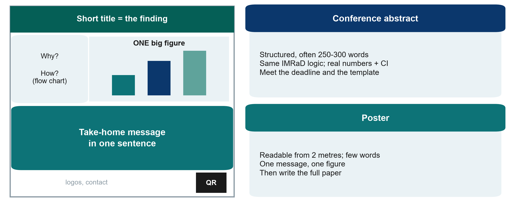{.neu-fig}

::: {.neu-takeaway}
**KEY MESSAGE** A poster is a billboard: one message, one figure, readable from 2 metres.
:::

::: {.notes}
EXTRA: Teaching point: a conference abstract is often the first output of a study. It follows the same IMRaD logic as the paper's abstract, usually 250-300 words, with real numbers and confidence intervals. An abstract that says 'results will be presented' is usually rejected. Follow the conference template and deadline.

Poster: a billboard, not a paper on a wall. A short title that states the finding, a few words of background and methods (a flow chart), ONE big figure, a take-home message in one sentence, and a QR code linking to more detail. It should be readable from 2 metres.

Presenting an abstract does not normally prevent publication of the full paper, but check the journal's policy. Do write the full paper: many abstracts never become publications.

A conference abstract template is in Course/Templates/.

Ask: what would be the single figure on your group's poster? Expected: the primary outcome by group.
:::

# Closing: what you built and what happens next

## Plan

- Post-course quiz (same 24 questions)
- What you built in eight sessions
- Course evaluation
- After the course: peer review of the manuscripts
- Next steps

::: {.notes}
Last 15 minutes of Session 8. Keep it brisk and positive.

Thank the groups for their presentations before starting the quiz.
:::

## Post-course quiz

::: {.neu-banner style="--c:#6C3483"}
QUICK QUIZ · 8 min
:::

::: {.neu-activity-steps style="--c:#6C3483"}
1. Same 24 questions as in Session 1 (online form recommended)
2. Individual, no discussion
3. Write the same participant number as in Session 1
4. The answer key is shared after the course
:::

::: {.neu-output style="--c:#6C3483"}
**OUTPUT** Quiz handed in (participant number only)
:::

::: {.notes}
Hand out the same quiz (online form or paper).

Later: compute the mean pre/post change with the table in pre\_post\_quiz\_answer\_key and report it to the department head in the course report.
:::

## What you built in eight sessions

:::: {.neu-steps}
::: {.neu-step style="--c:#0D7377"}
[1]{.neu-step-num}[ASK & FIND]{.neu-step-label}

- A PICO question
- 5 key references
- A working title
:::
::: {.neu-step style="--c:#0B376C"}
[2]{.neu-step-num}[DESIGN]{.neu-step-label}

- A justified design
- Outcomes
- A bias plan
:::
::: {.neu-step style="--c:#5FA39B"}
[3]{.neu-step-num}[ANALYSE]{.neu-step-label}

- A CRF and analysis plan
- A real dataset read and interpreted
:::
::: {.neu-step style="--c:#0070C0"}
[4]{.neu-step-num}[WRITE]{.neu-step-label}

- Methods, Results
- Introduction, Discussion, Abstract
:::
::: {.neu-step style="--c:#055F56"}
[5]{.neu-step-num}[PUBLISH]{.neu-step-label}

- A presented proposal
- A draft manuscript
:::
::::

::: {.neu-takeaway}
**KEY MESSAGE** Five proposals and five draft papers from this department.
:::

::: {.notes}
Celebrate: each group has a proposal it could take to the ethics committee and a draft paper.

Ask each group to agree a next step before leaving: who polishes the proposal, target date for the ethics committee, who leads the manuscript peer review.
:::

## Course evaluation

::: {.neu-banner style="--c:#0B376C"}
INDIVIDUAL TASK · 3 min
:::

::: {.neu-activity-steps style="--c:#0B376C"}
1. Rate each session: content, pace, usefulness
2. One thing to keep, one thing to change
3. Interested in Level 2 (hands-on R)?
:::

::: {.neu-output style="--c:#0B376C"}
**OUTPUT** Evaluation form (anonymous)
:::

::: {.notes}
Short anonymous form (paper or online). The pace question matters. We planned the course to be slow, so tell us if it was right.
:::

## After the course: peer review like real authors

:::: {.neu-steps}
::: {.neu-step style="--c:#0D7377"}
[1]{.neu-step-num}[Week 1]{.neu-step-label}

- Polish your draft
- Submit it to the trainers
:::
::: {.neu-step style="--c:#0B376C"}
[2]{.neu-step-num}[Swap]{.neu-step-label}

- Review another group's paper
- 10-question checklist + writing checks
:::
::: {.neu-step style="--c:#5FA39B"}
[3]{.neu-step-num}[Respond]{.neu-step-label}

- Answer each comment
- Response-to-reviewers template
:::
::: {.neu-step style="--c:#0070C0"}
[4]{.neu-step-num}[Week 2]{.neu-step-label}

- Final draft + response letter
- Trainer feedback
:::
::::

::: {.neu-takeaway}
**KEY MESSAGE** Due two weeks after Session 8 (see Assignment/peer\_review\_instructions).
:::

::: {.notes}
Explain the swap: group 1 reviews group 2, 2 reviews 3, ... 5 reviews 1.

Reviews follow Assignment/peer\_review\_instructions.md and the 10-question checklist. Authors reply with Templates/Response\_to\_Reviewers\_Template.docx.

This is the last step of the whole research process, exactly what happens after a real submission.
:::

## What comes next

:::: {.neu-cards style="--n:2"}
::: {.neu-card .plain style="--c:#0D7377"}
[Your toolkit]{.neu-card-title}

- Slides, handouts, glossary
- Proposal, protocol, consent, CRF, SAP,
- manuscript and reviewer templates
:::
::: {.neu-card .plain style="--c:#0B376C"}
[Keep going]{.neu-card-title}

- Take your proposal to ethics
- Level 2: hands-on analysis in R
- Level 3: advanced methods
:::
::::

::: {.notes}
Level 2 (hands-on, for those who want to run analyses themselves): reproducible R projects, data management, linear and logistic regression in depth, missing data, publication-ready tables and figures. Prerequisite: this course plus the free Neudata course Clinical Data Analysis in R.

Level 3 (on request): advanced, specialised methods for complex data: meta-analysis, prediction and machine learning, diagnostic accuracy, advanced survival, longitudinal and multilevel models. See Course\_Levels/.

Give the trainers' contact details for follow-up questions.
:::

---

:::: {.neu-statement}
::: {.neu-big}
Thank you!
:::

::: {.neu-sub}
Good questions. Sound designs. Honest analysis. Clear writing.
:::
::::

::: {.notes}
Thank the department leadership, the organisers and the participants. Group photo.
:::
