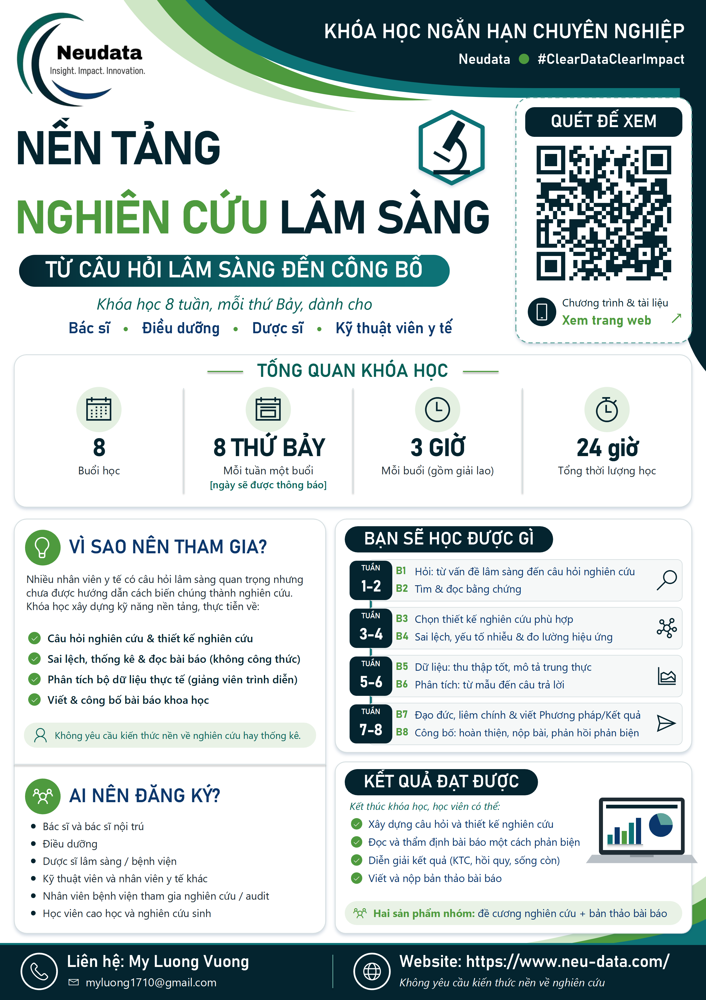

::: {.course-hero}
# Nền tảng Nghiên cứu Lâm sàng · Cấp độ 1
Từ câu hỏi lâm sàng đến công bố

::: {.badges}
[Cấp độ 1]{} [8 thứ Bảy]{} [mỗi tuần một buổi]{} [24 giờ học]{} [Không cần phần mềm]{} [Anh + Việt]{}
:::

[Lịch học](schedule.qmd){.btn .btn-light role="button"} [Nhận mã truy cập miễn phí](access.qmd){.btn .btn-light role="button"}
:::

{.float-end width="34%" style="margin:0 0 1rem 1.5rem" fig-alt="Poster khóa học"}

```{=html}
<div class="facts"><div><strong>Hình thức</strong><span>8 buổi × 3 giờ</span></div><div><strong>Thời gian</strong><span>Mỗi thứ Bảy, trong 8 tuần</span></div><div><strong>Đối tượng</strong><span>Bác sĩ, điều dưỡng, dược sĩ</span></div><div><strong>Phần mềm</strong><span>Không cần — giảng viên chạy phân tích</span></div></div>
```

## Giới thiệu khóa học

Nhân viên y tế đưa ra quyết định lâm sàng mỗi ngày mà nghiên cứu có thể giúp cải thiện — nhưng ít ai được hướng dẫn cách biến một điều chưa chắc chắn tại giường bệnh thành một nghiên cứu được công bố. Trong **8 tuần (mỗi thứ Bảy một buổi 3 giờ)**, khóa học đi hết **con đường nghiên cứu**: đặt câu hỏi tốt, tìm và đọc bằng chứng, chọn thiết kế, nhận biết sai lệch, thu thập và phân tích dữ liệu, bảo vệ người tham gia, viết bài báo và công bố.

- **Chậm và trực quan.** Dành cho người chưa có nền tảng nghiên cứu: hình ảnh trước, kiểm tra mức hiểu mỗi 20 phút, không có công thức nào ngoài bảng 2×2, và mỗi buổi có slide bổ sung để ai muốn có thể đọc thêm ở nhà.
- **Cả con đường trong một khóa.** Tuần 1–4 xây dựng hiểu biết và kỹ năng thiết kế; tuần 5–8 phân tích bộ dữ liệu mô phỏng **FLUID-ICU (620 bệnh nhân ICU)** qua các trình diễn R của giảng viên và viết thành bản thảo bài báo.
- **Cấp độ 1 trong ba cấp độ.** Khóa học này là **Cấp độ 1**. **Cấp độ 2** là một khóa thực hành R riêng cho những ai muốn tự phân tích (đang chuẩn bị); **Cấp độ 3** gồm các phương pháp nâng cao, chuyên sâu theo yêu cầu. Xem [Các cấp độ](levels.qmd).
- **Một ví dụ xuyên suốt:** dịch truyền trong sốc nhiễm khuẩn — đặt câu hỏi và tìm kiếm, thiết kế, phân tích, viết và công bố, và thẩm định qua hai bài báo thực tế.

## Tám thứ Bảy, tám buổi học

| Tuần | Buổi |
|:--:|:--|
| 1 | [Buổi 1 · Hỏi: từ vấn đề lâm sàng đến câu hỏi nghiên cứu](session1.qmd) |
| 2 | [Buổi 2 · Tìm & đọc: bằng chứng](session2.qmd) |
| 3 | [Buổi 3 · Thiết kế: chọn đúng loại nghiên cứu](session3.qmd) |
| 4 | [Buổi 4 · Sai lệch và tác động: có tin được không, lớn đến đâu?](session4.qmd) |
| 5 | [Buổi 5 · Dữ liệu: thu thập tốt, mô tả trung thực](session5.qmd) |
| 6 | [Buổi 6 · Phân tích: từ mẫu đến câu trả lời](session6.qmd) |
| 7 | [Buổi 7 · Bảo vệ & viết: đạo đức, liêm chính, Phương pháp và Kết quả](session7.qmd) |
| 8 | [Buổi 8 · Công bố: hoàn thiện bài báo, gửi đăng, trình bày](session8.qmd) |

[Lịch học →](schedule.qmd)

## Hai sản phẩm nhóm

```{=html}
<div class="cards2"><div><h4>1 · Đề cương nghiên cứu</h4><p>Cho <strong>câu hỏi lâm sàng của chính nhóm</strong>, xây dựng từng phần mỗi hai tuần bằng mẫu đề cương và <strong>trình bày ở Buổi 8</strong> (6 phút + 2 phút góp ý), kèm kế hoạch công bố.</p></div><div><h4>2 · Bản thảo bài báo</h4><p>Từ bộ dữ liệu khóa học <strong>FLUID-ICU</strong>: mỗi nhóm trả lời một câu hỏi khác nhau với gói kết quả của nhóm, soạn Phương pháp và Kết quả ở Buổi 7 và phần còn lại ở Buổi 8. Sau khóa học, các nhóm <strong>phản biện chéo</strong> bản thảo của nhau và trả lời như tác giả thực thụ.</p></div></div>
```

## Dành cho ai

Toàn bộ một khoa lâm sàng (khoảng 30 người): **bác sĩ, bác sĩ nội trú, điều dưỡng và dược sĩ**, chia thành **5 nhóm khoảng 6 người** cố định trong cả tám buổi. Không yêu cầu nền tảng nghiên cứu hay thống kê, và không cần phần mềm: giảng viên chạy các phân tích, học viên học cách đọc, diễn giải và viết lại kết quả. Khóa học có thể tổ chức cho bất kỳ khoa nào trong bệnh viện.

## Bắt đầu thế nào

1. Yêu cầu [mã truy cập](access.qmd) miễn phí (một lần cho mỗi trình duyệt).
2. Đọc [sổ tay học viên](handbook.qmd) và xem [lịch học](schedule.qmd).
3. Mỗi [trang buổi học](session1.qmd) có nội dung, bài giảng, phiếu bài tập và những việc cần chuẩn bị.

## Giảng viên

```{=html}
<div class="cards2"><div><h4>Vương Mỹ Lượng</h4><p>Chuyên gia Thống kê Sinh học cao cấp, Neudata</p></div><div><h4>Bernard Osang'ir</h4><p>Chuyên gia Thống kê Sinh học cao cấp, Neudata</p></div></div>
```

## Liên hệ

Câu hỏi về khóa học: **Vương Mỹ Lượng** — [myluong1710@gmail.com](mailto:myluong1710@gmail.com).

Neudata Consulting Ltd · [www.neu-data.com](https://www.neu-data.com)
