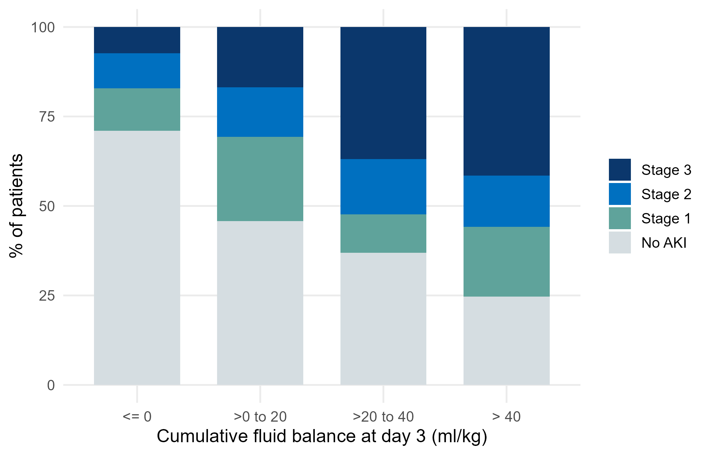
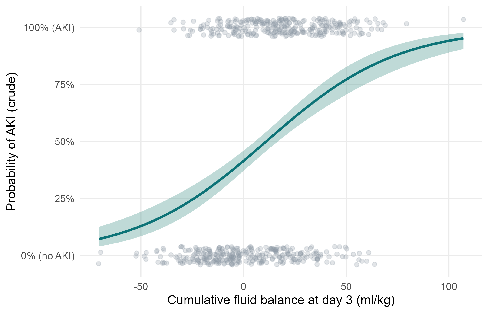

::: {.lang-note}
Tài liệu này hiện chỉ có bằng **tiếng Anh**. Thuật ngữ tiếng Việt: xem [Thuật ngữ Anh–Việt](glossary.qmd).
:::

::: {.simulated}
**Dữ liệu mô phỏng, không phải bệnh nhân thật.** FLUID-ICU là một nghiên cứu giả định: mọi giá trị đều do chương trình máy tính tạo ra với hạt giống ngẫu nhiên cố định. Dữ liệu không mô tả bất kỳ bệnh nhân, bệnh viện hay ICU thật nào. Mọi bản thảo viết từ bộ dữ liệu này phải ghi rõ dữ liệu là mô phỏng và không bao giờ được nộp như một nghiên cứu thật.
:::

Tải về: [Word](files/data/results_packs/Results_Pack_Q2.docx) · [PDF](files/data/results_packs/Results_Pack_Q2.pdf) · [zip (Markdown, bảng, biểu đồ)](files/data/results_packs/Results_Pack_Q2.zip) · [Quay lại trang bộ dữ liệu](dataset.qmd)

> **SIMULATED DATA: NOT REAL PATIENTS.** FLUID-ICU was generated by computer for this course. Write your manuscript as a training exercise and state clearly that the data are simulated.

## 1. The question

**In adults with sepsis in the ICU, is a higher cumulative fluid balance by day 3 associated with acute kidney injury?**

## 2. Design and data

- Design: multicentre prospective cohort study (observational).
- Setting: 4 ICUs (ICU A-D), consecutive adults with sepsis, enrolment January 2023 to December 2024.
- Exposure: cumulative fluid balance at day 3 in ml/kg, analysed per 10 ml/kg (continuous); secondary: positive vs negative balance.
- Outcome: acute kidney injury (KDIGO stage >= 1, maximum stage during ICU days 1-7; aki_any). Secondary: AKI stage 2-3; renal replacement therapy (descriptive).
- Analysis sample: 618 patients with a day-3 balance; adjusted models 527 complete cases.
- Pre-specified confounders (SAP): age, SOFA score, lactate, vasopressor, mechanical ventilation, chronic kidney disease.
- Software: R 4.6 (packages gtsummary, survival, mice). Scripts: Course/Data/R/.

Participant flow: 620 patients enrolled -> 2 without a day-3 fluid balance (weight or output missing after cleaning) -> 618 in the exposure analysis -> 91 without lactate (or age) -> 527 in the complete-case adjusted model.

## 3. Table 1: who was studied

**Table 1. Baseline characteristics by fluid-balance group**

|Characteristic               |Overall   N = 618 |Negative balance   N = 245 |Positive balance   N = 373 |
|:----------------------------|:-----------------|:--------------------------|:--------------------------|
|Age, years                   |62.6 (15.2)       |64.6 (15.0)                |61.4 (15.2)                |
|&emsp;Missing                |1                 |1                          |0                          |
|Sex                          |                  |                           |                           |
|&emsp;Female                 |243 (39%)         |102 (42%)                  |141 (38%)                  |
|&emsp;Male                   |375 (61%)         |143 (58%)                  |232 (62%)                  |
|Weight, kg                   |64.7 (11.9)       |65.1 (12.4)                |64.4 (11.6)                |
|Diabetes                     |158 (26%)         |70 (29%)                   |88 (24%)                   |
|Chronic kidney disease       |64 (10%)          |28 (11%)                   |36 (9.7%)                  |
|Heart failure                |97 (16%)          |54 (22%)                   |43 (12%)                   |
|Hypertension                 |282 (46%)         |124 (51%)                  |158 (42%)                  |
|Source of infection          |                  |                           |                           |
|&emsp;Respiratory            |267 (43%)         |101 (41%)                  |166 (45%)                  |
|&emsp;Urinary                |126 (20%)         |54 (22%)                   |72 (19%)                   |
|&emsp;Abdominal              |106 (17%)         |46 (19%)                   |60 (16%)                   |
|&emsp;Skin/soft tissue       |57 (9.2%)         |18 (7.3%)                  |39 (10%)                   |
|&emsp;Other                  |62 (10%)          |26 (11%)                   |36 (9.7%)                  |
|SOFA score                   |7 (5, 9)          |6 (4, 8)                   |8 (6, 10)                  |
|APACHE II score              |19 (15, 24)       |17 (12, 21)                |20 (17, 25)                |
|&emsp;Missing                |6                 |3                          |3                          |
|Lactate, mmol/L              |2.6 (1.7, 3.7)    |2.2 (1.4, 3.0)             |2.9 (1.9, 4.0)             |
|&emsp;Missing                |91                |50                         |41                         |
|Mean arterial pressure, mmHg |73 (66, 80)       |76 (70, 84)                |71 (65, 78)                |
|&emsp;Missing                |4                 |1                          |3                          |
|Vasopressor on admission     |266 (43%)         |61 (25%)                   |205 (55%)                  |
|Mechanical ventilation       |313 (51%)         |97 (40%)                   |216 (58%)                  |

*Mean (SD); n (%); median (Q1, Q3). Missing = number of patients without that value.*

Files: `tables/table1_by_balance.csv` and `tables/table1_by_balance.docx`

## 4. Main results

- AKI (any stage) occurred in 302/620 (48.7%) of all patients; RRT in 79/620 (12.7%).
- AKI: positive balance 230/373 (61.7%) vs negative balance 71/245 (29.0%).
- AKI rose with each balance category: <= 0: 29%; >0 to 20: 54%; >20 to 40: 63%; > 40: 75%.
- Crude OR per 10 ml/kg more balance: 1.37 (95% CI 1.27 to 1.47).
- Adjusted OR per 10 ml/kg: **1.27 (95% CI 1.16 to 1.40)**, p <0.001.
- Positive vs negative balance: crude OR 3.94 (95% CI 2.80 to 5.60); adjusted OR 2.70 (95% CI 1.76 to 4.15).

**Table 2. Maximum KDIGO AKI stage by fluid-balance group**

|AKI stage     |Negative balance |Positive balance |
|:-------------|:----------------|:----------------|
|KDIGO stage 0 |174 (71%)        |143 (38%)        |
|KDIGO stage 1 |29 (12%)         |68 (18%)         |
|KDIGO stage 2 |24 (10%)         |54 (14%)         |
|KDIGO stage 3 |18 (7%)          |108 (29%)        |

Files: `tables/table2_aki_stage_by_group.csv` and `tables/table2_aki_stage_by_group.docx`

**Table 3. AKI by category of cumulative fluid balance at day 3**

|Cumulative balance day 3, ml/kg |n   |Any AKI, n (%) |AKI stage 2-3, % |RRT, % |
|:-------------------------------|:---|:--------------|:----------------|:------|
|<= 0                            |245 |71 (29%)       |17.1             |4.1    |
|>0 to 20                        |166 |90 (54%)       |30.7             |11.4   |
|>20 to 40                       |130 |82 (63%)       |52.3             |21.5   |
|> 40                            |77  |58 (75%)       |55.8             |28.6   |

Files: `tables/table3_aki_by_balance_category.csv` and `tables/table3_aki_by_balance_category.docx`

**Table 4. Logistic regression for AKI (adjusted for age, SOFA, lactate, vasopressor, ventilation, CKD)**

|Model                                                  |n   |OR (95% CI)         |p      |
|:------------------------------------------------------|:---|:-------------------|:------|
|Balance per 10 ml/kg, crude                            |618 |1.37 (1.27 to 1.47) |<0.001 |
|Balance per 10 ml/kg, adjusted                         |527 |1.27 (1.16 to 1.40) |<0.001 |
|Positive vs negative balance, crude                    |618 |3.94 (2.80 to 5.60) |<0.001 |
|Positive vs negative balance, adjusted                 |527 |2.70 (1.76 to 4.15) |<0.001 |
|Balance per 10 ml/kg, adjusted (outcome AKI stage 2-3) |527 |1.23 (1.12 to 1.35) |<0.001 |

Files: `tables/table4_aki_models.csv` and `tables/table4_aki_models.docx`

*Figure 1. Maximum AKI stage by category of cumulative fluid balance* (`figures/fig1_aki_stage_by_balance.png`)

*Figure 2. Crude probability of AKI across the range of fluid balance (logistic curve, 95% band)* (`figures/fig2_aki_probability_curve.png`)

## 5. What this means (plain language)

- AKI was more common the more positive the fluid balance: a clear 'dose-response' pattern.
- After adjustment, each extra 10 ml/kg (about 650 ml for a 65 kg adult) was associated with about 27% higher odds of AKI.
- Using the continuous balance keeps more information than positive/negative and shows the gradient.

## 6. What this does NOT mean

- It does NOT show that fluid damages the kidney. The arrow may point the other way: AKI reduces urine output, and low output makes the balance positive (reverse causation).
- We do not know whether AKI started before or after the fluid accumulated. The data record the maximum stage over days 1-7.
- An OR of 1.27 per 10 ml/kg is not a risk: with AKI this common (about 49%), odds ratios overstate risk ratios.

## 7. Limitations to discuss (hints)

- Timing: exposure (days 1-3) and outcome (days 1-7) overlap.
- Residual confounding by severity and nephrotoxic drugs (not recorded).
- KDIGO staging may be based on creatinine, which fluid dilutes, so AKI may be under-diagnosed in patients with large positive balances.
- Complete-case analysis (lactate missing in 15%).

## Which STROBE items this pack helps you write

- Item 6-7: participants and variable definitions (KDIGO)
- Item 12: methods incl. continuous exposure scaling (per 10 ml/kg)
- Item 14: descriptive data (Table 1)
- Item 15: outcome data (Tables 2-3)
- Item 16: crude and adjusted ORs with 95% CI; category boundaries reported (Table 3-4)
- Item 19: limitations (reverse causation and timing)
- Item 17: secondary outcome AKI stage 2-3

