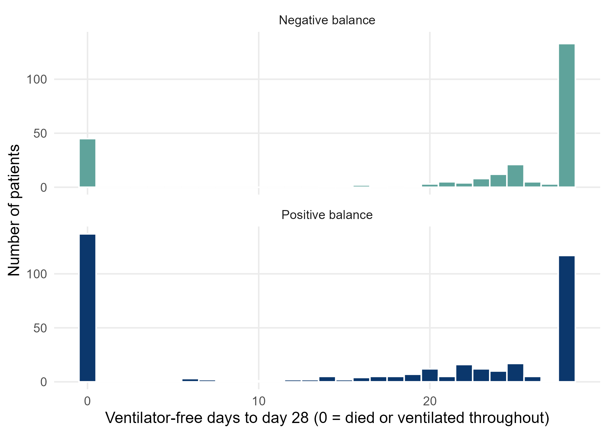
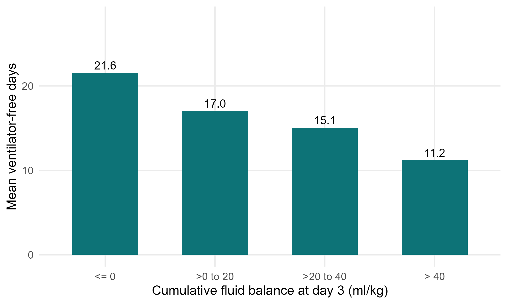

::: {.lang-note}
Tài liệu này hiện chỉ có bằng **tiếng Anh**. Thuật ngữ tiếng Việt: xem [Thuật ngữ Anh–Việt](glossary.qmd).
:::

::: {.simulated}
**Dữ liệu mô phỏng, không phải bệnh nhân thật.** FLUID-ICU là một nghiên cứu giả định: mọi giá trị đều do chương trình máy tính tạo ra với hạt giống ngẫu nhiên cố định. Dữ liệu không mô tả bất kỳ bệnh nhân, bệnh viện hay ICU thật nào. Mọi bản thảo viết từ bộ dữ liệu này phải ghi rõ dữ liệu là mô phỏng và không bao giờ được nộp như một nghiên cứu thật.
:::

Tải về: [Word](files/data/results_packs/Results_Pack_Q3.docx) · [PDF](files/data/results_packs/Results_Pack_Q3.pdf) · [zip (Markdown, bảng, biểu đồ)](files/data/results_packs/Results_Pack_Q3.zip) · [Quay lại trang bộ dữ liệu](dataset.qmd)

> **SIMULATED DATA: NOT REAL PATIENTS.** FLUID-ICU was generated by computer for this course. Write your manuscript as a training exercise and state clearly that the data are simulated.

## 1. The question

**In adults with sepsis in the ICU, is a higher cumulative fluid balance by day 3 associated with fewer ventilator-free days to day 28?**

## 2. Design and data

- Design: multicentre prospective cohort study (observational).
- Setting: 4 ICUs (ICU A-D), consecutive adults with sepsis, enrolment January 2023 to December 2024.
- Exposure: cumulative fluid balance at day 3 per 10 ml/kg (continuous); secondary: positive vs negative.
- Outcome: ventilator-free days (VFD) to day 28: days alive and free of mechanical ventilation; patients who died = 0; never ventilated and alive = 28 (vent_free_days_28).
- Analysis sample: 618 patients; adjusted models 527 complete cases; 313 were ventilated on admission.
- Pre-specified confounders (SAP): age, SOFA score, lactate, vasopressor, mechanical ventilation, chronic kidney disease.
- Software: R 4.6 (packages gtsummary, survival, mice). Scripts: Course/Data/R/.

Participant flow: 620 patients enrolled -> 2 without a day-3 fluid balance (weight or output missing after cleaning) -> 618 in the exposure analysis -> 91 without lactate (or age) -> 527 in the complete-case adjusted model.

## 3. Table 1: who was studied

**Table 1. Baseline characteristics by fluid-balance group**

|Characteristic               |Overall   N = 618 |Negative balance   N = 245 |Positive balance   N = 373 |
|:----------------------------|:-----------------|:--------------------------|:--------------------------|
|Age, years                   |62.6 (15.2)       |64.6 (15.0)                |61.4 (15.2)                |
|&emsp;Missing                |1                 |1                          |0                          |
|Sex                          |                  |                           |                           |
|&emsp;Female                 |243 (39%)         |102 (42%)                  |141 (38%)                  |
|&emsp;Male                   |375 (61%)         |143 (58%)                  |232 (62%)                  |
|Weight, kg                   |64.7 (11.9)       |65.1 (12.4)                |64.4 (11.6)                |
|Diabetes                     |158 (26%)         |70 (29%)                   |88 (24%)                   |
|Chronic kidney disease       |64 (10%)          |28 (11%)                   |36 (9.7%)                  |
|Heart failure                |97 (16%)          |54 (22%)                   |43 (12%)                   |
|Hypertension                 |282 (46%)         |124 (51%)                  |158 (42%)                  |
|Source of infection          |                  |                           |                           |
|&emsp;Respiratory            |267 (43%)         |101 (41%)                  |166 (45%)                  |
|&emsp;Urinary                |126 (20%)         |54 (22%)                   |72 (19%)                   |
|&emsp;Abdominal              |106 (17%)         |46 (19%)                   |60 (16%)                   |
|&emsp;Skin/soft tissue       |57 (9.2%)         |18 (7.3%)                  |39 (10%)                   |
|&emsp;Other                  |62 (10%)          |26 (11%)                   |36 (9.7%)                  |
|SOFA score                   |7 (5, 9)          |6 (4, 8)                   |8 (6, 10)                  |
|APACHE II score              |19 (15, 24)       |17 (12, 21)                |20 (17, 25)                |
|&emsp;Missing                |6                 |3                          |3                          |
|Lactate, mmol/L              |2.6 (1.7, 3.7)    |2.2 (1.4, 3.0)             |2.9 (1.9, 4.0)             |
|&emsp;Missing                |91                |50                         |41                         |
|Mean arterial pressure, mmHg |73 (66, 80)       |76 (70, 84)                |71 (65, 78)                |
|&emsp;Missing                |4                 |1                          |3                          |
|Vasopressor on admission     |266 (43%)         |61 (25%)                   |205 (55%)                  |
|Mechanical ventilation       |313 (51%)         |97 (40%)                   |216 (58%)                  |

*Mean (SD); n (%); median (Q1, Q3). Missing = number of patients without that value.*

Files: `tables/table1_by_balance.csv` and `tables/table1_by_balance.docx`

## 4. Main results

- VFD median (IQR): positive balance 20 (0 to 28) vs negative 28 (22 to 28) days; Mann-Whitney p <0.001.
- Linear regression, crude: -1.48 (95% CI -1.84 to -1.13) days per 10 ml/kg.
- Linear regression, adjusted: **-0.61 (95% CI -1.00 to -0.21) days per 10 ml/kg**, p 0.003.
- Positive vs negative balance, adjusted difference: -2.78 (95% CI -4.76 to -0.80) days.

**Table 2. Ventilator-free days by fluid-balance group**

|Summary                                   |Negative balance |Positive balance |
|:-----------------------------------------|:----------------|:----------------|
|n                                         |245              |373              |
|VFD, median (IQR)                         |28 (22 to 28)    |20 (0 to 28)     |
|VFD, mean (SD)                            |21.6 (10.5)      |15.2 (12.4)      |
|VFD = 0 (died or ventilated 28 d), n (%)  |45 (18%)         |137 (37%)        |
|VFD = 28 (never ventilated, alive), n (%) |133 (54%)        |117 (31%)        |
|Ventilated patients: VFD median (IQR)     |23 (0 to 25)     |12 (0 to 22)     |

Files: `tables/table2_vfd_by_group.csv` and `tables/table2_vfd_by_group.docx`

**Table 3. Association between fluid balance and ventilator-free days**

|Model                                                       |n   |Difference in VFD, days (95% CI) |p      |
|:-----------------------------------------------------------|:---|:--------------------------------|:------|
|Balance per 10 ml/kg, crude (linear)                        |618 |-1.48 (-1.84 to -1.13)           |<0.001 |
|Balance per 10 ml/kg, adjusted (linear)                     |527 |-0.61 (-1.00 to -0.21)           |0.003  |
|Positive vs negative balance, adjusted (linear)             |527 |-2.78 (-4.76 to -0.80)           |0.006  |
|Positive vs negative balance, Mann-Whitney (Hodges-Lehmann) |618 |-3.0 (-5.0 to 0.0)               |<0.001 |

*Negative = fewer ventilator-free days. Adjusted for age, SOFA, lactate, vasopressor, ventilation, CKD.*

Files: `tables/table3_vfd_models.csv` and `tables/table3_vfd_models.docx`

*Figure 1. Distribution of ventilator-free days by group (note the two spikes at 0 and 28)* (`figures/fig1_vfd_histogram.png`)

*Figure 2. Mean ventilator-free days by category of cumulative fluid balance* (`figures/fig2_vfd_by_balance_category.png`)

## 5. What this means (plain language)

- Patients with more fluid on board had fewer days alive and off the ventilator.
- After adjustment, each extra 10 ml/kg was associated with about 0.6 fewer ventilator-free days (95% CI 0.2 to 1.0).
- VFD is not a normal-shaped number: many patients are at 0 (died) or 28 (never ventilated). The median and Mann-Whitney test describe it honestly; the linear model gives an easy-to-read average difference but its assumptions are strained.

## 6. What this does NOT mean

- It does NOT mean fluid keeps patients on the ventilator: VFD mixes death and ventilation time, and sicker patients get more fluid.
- A difference in mean VFD is not the same as 'each patient was ventilated one day longer'.

## 7. Limitations to discuss (hints)

- Composite outcome: a VFD of 0 can mean early death or 28 days on the ventilator. Say which drives the result.
- Skewed, bounded outcome: linear regression is approximate; consider the Mann-Whitney result or a proportional-odds model as sensitivity.
- Residual confounding by severity; respiratory infections both raise ventilation and may change fluid practice.
- Complete-case analysis (lactate missing).

## Which STROBE items this pack helps you write

- Item 7: define the composite outcome VFD precisely
- Item 12: methods (why non-parametric and linear models)
- Item 14: descriptive data (Table 1)
- Item 15-16: outcome summaries and adjusted differences with 95% CI
- Item 19: limitations of a composite, skewed outcome

