---

:::: {.neu-statement}
::: {.neu-big}
Mỗi ngày bạn đưa ra những quyết định mà nghiên cứu có thể giúp tốt hơn.
:::

::: {.neu-sub}
Khóa học này giúp bạn đặt câu hỏi đúng cách - trả lời chúng - và công bố câu trả lời.
:::
::::

::: {.notes}
Mở đầu bằng câu hỏi: 'Hãy nghĩ tới một việc trong khoa mà mỗi đồng nghiệp làm một kiểu và không ai biết cách nào tốt nhất.'

Lấy 2-3 câu trả lời. Dự kiến: dịch truyền, an thần, vận động sớm, băng vết thương, chăm sóc catheter.

Điểm then chốt: nghiên cứu bắt đầu từ sự không chắc chắn trong lâm sàng, không phải từ thống kê.

Ghi các ví dụ lên bảng lật - đó là những chủ đề tiềm năng cho đề cương của các nhóm.
:::

## Bốn cuối tuần, tám buổi học

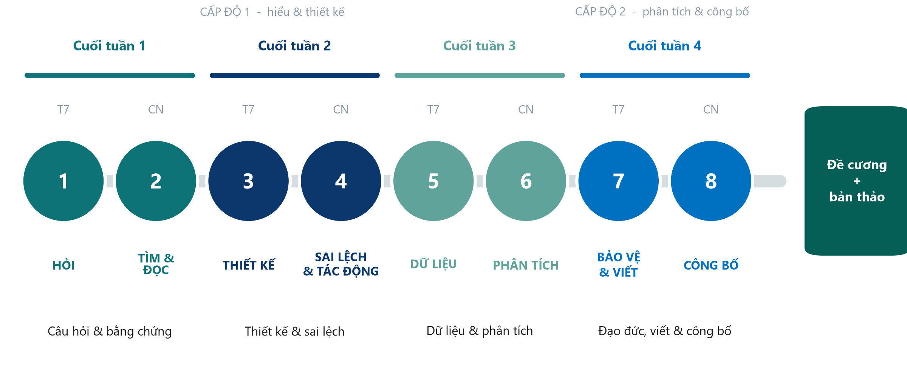{.neu-fig}

::: {.notes}
Đi dọc con đường: Cuối tuần 1 là câu hỏi và bằng chứng; Cuối tuần 2 thiết kế và sai lệch; Cuối tuần 3 dữ liệu và phân tích; Cuối tuần 4 đạo đức, viết và công bố.

Cuối tuần 1-2 là Cấp độ 1 (hiểu và thiết kế); Cuối tuần 3-4 là Cấp độ 2 (phân tích và công bố) - trong cùng một khóa học.

Một ví dụ xuyên suốt: dịch truyền trong sốc nhiễm khuẩn. Đồng nghiệp không thuộc ICU: mọi khái niệm đều có ví dụ ở khoa phòng (loét tì đè, vệ sinh tay, sai sót dùng thuốc, mê sảng).
:::

## Khóa học đưa bạn đến đâu

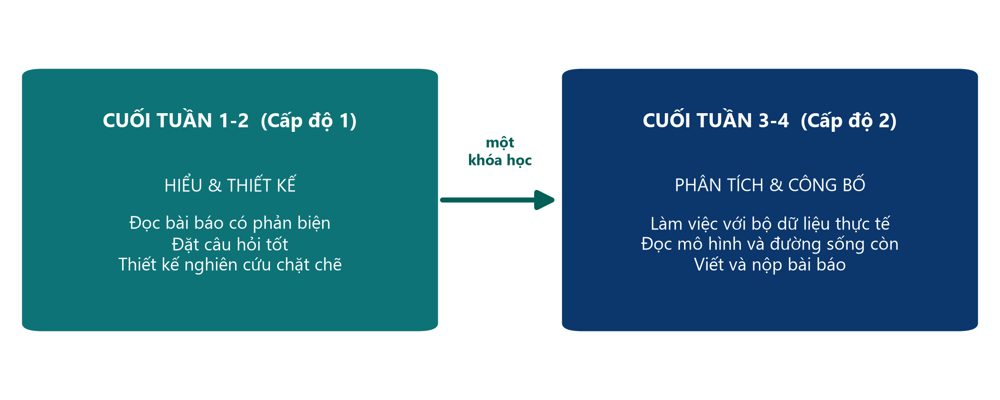{.neu-fig}

::: {.neu-takeaway}
**THÔNG ĐIỆP CHÍNH** Trước hết hiểu và thiết kế nghiên cứu - sau đó phân tích một bộ dữ liệu và viết bài báo.
:::

::: {.notes}
Khái niệm Cấp độ 1 đi trước: đọc bài báo có phản biện, đặt câu hỏi tốt, thiết kế nghiên cứu chặt chẽ.

Cấp độ 2 áp dụng các khái niệm đó trên một bộ dữ liệu thực tế gồm 600 bệnh nhân ICU: mô tả, phân tích và viết thành bài báo. Giảng viên chạy phần mềm; các bạn đọc và diễn giải kết quả.

Quan niệm sai cần gỡ bỏ: 'nghiên cứu chỉ dành cho nhà thống kê hay giáo sư'. Phần lớn câu hỏi lâm sàng tốt xuất phát từ điều dưỡng và bác sĩ tại giường bệnh.
:::

## Hai sản phẩm của nhóm bạn

{.neu-fig}

::: {.notes}
Sản phẩm 1: đề cương nghiên cứu cho câu hỏi của nhóm, xây dựng mỗi cuối tuần một phần và trình bày ở Buổi 8.

Sản phẩm 2: bản thảo bài báo viết từ bộ dữ liệu khóa học (FLUID-ICU). Mỗi nhóm trả lời một câu hỏi khác nhau trên cùng bộ dữ liệu. Phân tích ở Cuối tuần 3, viết ở Cuối tuần 4, và sau khóa học các nhóm phản biện chéo bản thảo của nhau và trả lời như tác giả thật.

Chỉ cho học viên Assignment/proposal\_brief và Assignment/manuscript\_brief.
:::

## Sau khóa học, bạn sẽ có thể

:::: {.neu-cards style="--n:4"}
::: {.neu-card .plain style="--c:#0D7377"}
[HỎI & TÌM]{.neu-card-title}

- Biến vấn đề thành câu hỏi PICO
- Tìm PubMed, quản lý tài liệu
- Đọc một bài báo trong 15 phút
:::
::: {.neu-card .plain style="--c:#0B376C"}
[THIẾT KẾ]{.neu-card-title}

- Chọn đúng thiết kế nghiên cứu
- Nhận biết sai lệch và nhiễu
- Đọc RR, OR, NNT và biểu đồ rừng
:::
::: {.neu-card .plain style="--c:#5FA39B"}
[PHÂN TÍCH]{.neu-card-title}

- Lập kế hoạch dữ liệu và CRF
- Đọc CI, giá trị p, hồi quy
- Diễn giải kết quả một bộ dữ liệu thật
:::
::: {.neu-card .plain style="--c:#0070C0"}
[VIẾT & CÔNG BỐ]{.neu-card-title}

- Lập kế hoạch đạo đức và đăng ký
- Viết từng phần của bài báo
- Nộp bài và trả lời phản biện
:::
::::

::: {.neu-takeaway}
**THÔNG ĐIỆP CHÍNH** Hiểu và diễn giải - bạn sẽ không phải tự tính toán.
:::

::: {.notes}
Đi qua bốn thẻ - mỗi thẻ một cuối tuần.

Điểm then chốt: mục tiêu là hiểu và diễn giải, không phải tính toán. Giảng viên chạy phân tích; các bạn học cách đọc và viết thành bài báo.

Hỏi cả lớp: thẻ nào làm bạn lo nhất? Dự kiến: PHÂN TÍCH. Trấn an: chúng ta đi chậm, dùng hình ảnh và kiểm tra mức hiểu mỗi 20 phút.

Quay lại slide này ở Buổi 8 để thấy sự tiến bộ.
:::

## Mỗi buổi học diễn ra như thế nào

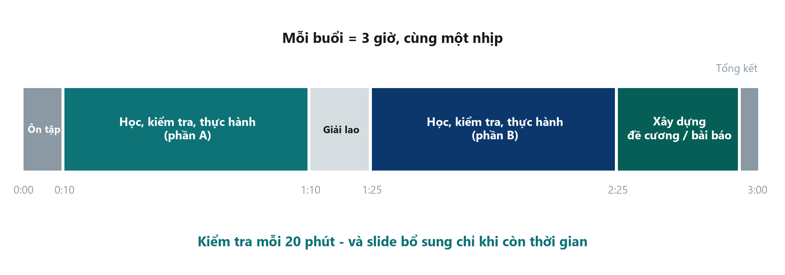{.neu-fig}

::: {.notes}
Cùng một nhịp mỗi buổi: ôn tập, hai phần học có kiểm tra và hoạt động, 15 phút giải lao, và thời gian xây dựng đề cương hoặc bài báo.

Cứ 20 phút chúng ta dừng lại để kiểm tra nhanh mức hiểu - nếu lớp chưa theo kịp, chúng ta đi chậm lại. Cuối mỗi buổi có 'slide bổ sung' chỉ dùng khi còn thời gian; các bạn có thể tự đọc ở nhà.

Giữ giải lao đúng 15 phút - bắt đầu lại đúng giờ.
:::

## Xây dựng đề cương

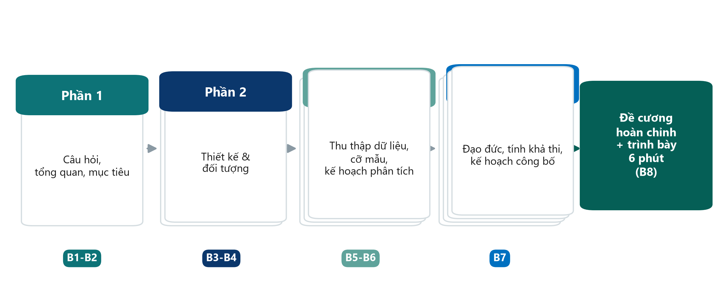{.neu-fig}

::: {.neu-takeaway}
**THÔNG ĐIỆP CHÍNH** Cùng nhóm, cùng mẫu, mỗi cuối tuần một phần, trình bày ở Buổi 8.
:::

::: {.notes}
Phần 1 (Cuối tuần 1): câu hỏi và tổng quan. Phần 2 (Cuối tuần 2): thiết kế. Phần 3 (Cuối tuần 3): dữ liệu và kế hoạch phân tích. Phần 4 (Buổi 7): đạo đức, tính khả thi và kế hoạch công bố.

Mỗi nhóm trình bày đề cương ở Buổi 8 (6 phút + 2 phút góp ý).

Mẫu: Templates/Research\_Proposal\_Template.docx.
:::

## Làm quen với nhóm

::: {.neu-banner style="--c:#0D7377"}
LÀM VIỆC NHÓM · 10 phút
:::

:::: {.columns}
::: {.column width="60%"}
::: {.neu-activity-steps style="--c:#0D7377"}
1. Ngồi theo nhóm (5 nhóm, mỗi nhóm khoảng 6 người, trộn các nghề)
2. Giới thiệu: tên, khoa, một câu hỏi bạn mong nghiên cứu trả lời được
3. Thống nhất các vai trò bên cạnh - có thể luân phiên mỗi cuối tuần
4. Chọn tên nhóm
:::
:::
::: {.column width="40%"}
::: {.neu-side .plain style="--c:#0D7377"}
Vai trò trong nhóm

- Điều phối - giúp mọi người cùng tham gia
- Thư ký - điền vào mẫu
- Bấm giờ
- Phụ trách tài liệu
- Phụ trách phương pháp & dữ liệu
- Người trình bày
:::
:::
::::

::: {.neu-output style="--c:#0D7377"}
**SẢN PHẨM** Tên nhóm + vai trò ghi trên phiếu nhóm
:::

::: {.notes}
Các nhóm nên trộn bác sĩ, điều dưỡng và dược sĩ - nhiều góc nhìn sẽ cho đề cương tốt hơn.

Vai trò giúp những người ít nói cũng tham gia; nên luân phiên thư ký.

Giảng viên: đi quanh các nhóm, ghi lại chủ đề tiềm năng của từng nhóm.
:::

## Chúng ta cùng học như thế nào

:::: {.neu-cards style="--n:4"}
::: {.neu-card .plain style="--c:#0D7377"}
[Cứ hỏi]{.neu-card-title}

- Không có câu hỏi nào ngớ ngẩn
- Nếu bạn chưa hiểu, người khác cũng vậy
:::
::: {.neu-card .plain style="--c:#0B376C"}
[Đi chậm]{.neu-card-title}

- Chúng ta kiểm tra mức hiểu thường xuyên
- Slide bổ sung chỉ khi còn thời gian
:::
::: {.neu-card .plain style="--c:#5FA39B"}
[Mang khoa phòng vào]{.neu-card-title}

- Dùng ví dụ từ thực hành của bạn
- Kinh nghiệm của bạn là nguyên liệu
:::
::: {.neu-card .plain style="--c:#0070C0"}
[Tôn trọng thời gian]{.neu-card-title}

- Bắt đầu và kết thúc đúng giờ
- Tắt chuông điện thoại, nghỉ đúng giờ nghỉ
:::
::::

::: {.notes}
Tạo không khí: đây là nơi an toàn để nói 'tôi chưa hiểu'.

Ngôn ngữ: thảo luận bằng tiếng Việt hoặc tiếng Anh - miễn giúp nhóm suy nghĩ tốt nhất.

Bảo mật người bệnh áp dụng cho mọi ví dụ: không nêu tên hay chi tiết nhận dạng.
:::

## Bài kiểm tra đầu khóa

::: {.neu-banner style="--c:#6C3483"}
CÂU HỎI NHANH · 15 phút
:::

:::: {.columns}
::: {.column width="60%"}
::: {.neu-activity-steps style="--c:#6C3483"}
1. Làm cá nhân, không thảo luận, không dùng điện thoại (trừ biểu mẫu trực tuyến)
2. 24 câu trắc nghiệm - chọn một đáp án cho mỗi câu
3. Nếu không chắc, hãy đoán: đây không phải kỳ thi
4. Chỉ ghi mã số học viên, không ghi tên
:::
:::
::: {.column width="40%"}
::: {.neu-side style="--c:#6C3483"}
Vì sao kiểm tra bây giờ?

- Biết lớp đang bắt đầu từ đâu
- Cùng bài này ở Buổi 8
- Chúng tôi đánh giá khóa học, không đánh giá bạn
:::
:::
::::

::: {.neu-output style="--c:#6C3483"}
**SẢN PHẨM** Nộp bài (chỉ ghi mã số học viên)
:::

::: {.notes}
Dùng biểu mẫu trực tuyến (khuyến nghị) hoặc bản giấy Assessment/pre\_post\_quiz.

Trấn an: kết quả ẩn danh, chỉ dùng để đo những gì KHÓA HỌC đạt được.

Thu bài sau 15 phút. Hôm nay không chữa đáp án - bài này được làm lại cuối Buổi 8.
:::

# Buổi 1 · Hỏi: từ vấn đề lâm sàng đến câu hỏi nghiên cứu

## Cuối tuần 1 · Thứ Bảy

- 1.1  Vì sao cần nghiên cứu? Bằng chứng, các loại nghiên cứu, nghiên cứu và audit, con đường đến công bố
- Giải lao
- 1.2  Từ vấn đề đến câu hỏi: PICO(T) qua các ví dụ, FINER (bài tập theo cặp)
- 1.3  Mục đích, mục tiêu và giả thuyết (bài tập nhanh)
- Xây dựng đề cương 1: chủ đề, PICO, câu hỏi, FINER, mục đích và mục tiêu
- Tổng kết: từ khóa, ôn tập, bài về nhà cho ngày mai

::: {.notes}
MỞ ĐẦU BUỔI 1 (0:35). Phần mở đầu khóa học (chào mừng, lộ trình, chia nhóm, bài kiểm tra đầu khóa) vừa kết thúc.

Ý chính: hôm nay chỉ có một việc - mỗi nhóm ra về với MỘT câu hỏi nghiên cứu rõ ràng, trả lời được, cùng mục đích và mục tiêu. Ngày mai (Buổi 2) ta tìm và đọc y văn cho câu hỏi đó.

Nhịp độ: học viên hầu như chưa có nền tảng nghiên cứu. Đi chậm, dùng các ví dụ mẫu, và dừng lại ở mọi slide 'Kiểm tra hiểu bài' - chúng được thiết kế ngắn.

Giới thiệu nhịp buổi học: ba phần giảng ngắn, giải lao, bài tập theo cặp, bài tập nhanh, rồi 30 phút làm việc nhóm cho đề cương.

Hỏi cả lớp: 'Ai đã từng tham gia một nghiên cứu - với vai trò nghiên cứu viên, người thu thập số liệu hay người tham gia?' Đếm số tay giơ để biết nên giảng ở mức nào.

Thời gian: 1 phút. Không đọc to chương trình; chỉ vào màn hình.
:::

## 1.1  Vì sao cần nghiên cứu?

:::: {.neu-statement}
::: {.neu-big}
Vì sao cần nghiên cứu khi chúng ta đã có kinh nghiệm?
:::

::: {.neu-sub}
35 phút: bằng chứng, tháp bằng chứng, các loại nghiên cứu, nghiên cứu và audit, con đường đến công bố
:::
::::

::: {.notes}
PHẦN 1.1 (0:35-1:10).

Dừng lại ở câu hỏi và để lớp trả lời trước khi chuyển slide. Lấy 2-3 ý kiến.

Câu trả lời mong đợi: kinh nghiệm thiên về những ca đáng nhớ; đồng nghiệp bất đồng; thực hành thay đổi; ta cần biết điều mình làm có thực sự giúp ích không.

Ý chính: kinh nghiệm rất quý để nảy sinh câu hỏi, nhưng là cách yếu để trả lời câu hỏi.

Thời gian: 1 phút.
:::

## Giai thoại và bằng chứng

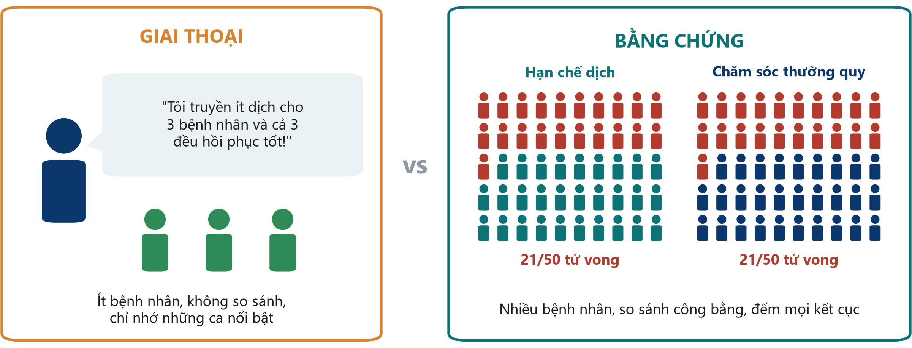{.neu-fig}

::: {.neu-takeaway}
**THÔNG ĐIỆP CHÍNH** Kinh nghiệm gợi ra câu hỏi. So sánh công bằng trên nhiều bệnh nhân trả lời câu hỏi.
:::

::: {.notes}
Bên trái: một bác sĩ, ba bệnh nhân, một kỷ niệm sống động, không có nhóm so sánh.

Bên phải: mỗi nhóm 50 bệnh nhân, đếm mọi ca tử vong, cùng một kết cục được đo ở cả hai nhánh.

Các con số chỉ minh họa, nhưng xu hướng là có thật: thử nghiệm lớn CLASSIC (Meyhoff, NEJM 2022, 1.554 bệnh nhân sốc nhiễm khuẩn) cho thấy tử vong 90 ngày là 42,3% khi hạn chế dịch so với 42,1% khi truyền dịch chuẩn. Ba bệnh nhân 'thành công' có lẽ vẫn hồi phục dù dùng chiến lược nào.

Quan niệm sai: 'nếu có hiệu quả ở bệnh nhân của tôi thì là có hiệu quả'. Không có nhóm so sánh, ta không biết điều gì vẫn sẽ xảy ra (tự hồi phục, hồi quy về trung bình, trí nhớ chọn lọc).

Hỏi cả lớp: 'Vì sao ta nhớ ba kết cục tốt?' Trả lời mong đợi: sai lệch nhớ lại (recall bias) - ca kịch tính và gần đây dễ nhớ; ta quên các ca thất bại.

Thời gian: 4 phút. Đi chậm - cả khóa học dựa trên ý này.
:::

## Vì sao kinh nghiệm của một khoa là chưa đủ

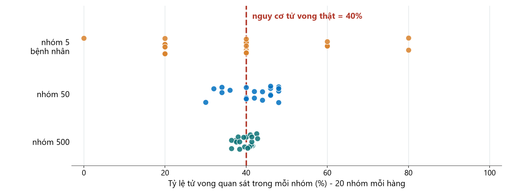{.neu-fig}

::: {.neu-takeaway}
**THÔNG ĐIỆP CHÍNH** Số nhỏ dao động do ngẫu nhiên. So sánh lớn và công bằng mới ổn định.
:::

::: {.notes}
Hình này là mô phỏng (hạt giống cố định): giả sử một bệnh có nguy cơ tử vong THẬT là 40%.

Hàng trên: 20 khoa, mỗi khoa chỉ gặp 5 bệnh nhân. Hoàn toàn do ngẫu nhiên, có khoa thấy 0% tử vong, có khoa thấy 80%. Mỗi khoa sẽ 'rút ra' một bài học khác nhau từ kinh nghiệm của mình.

Hàng giữa: nhóm 50 người - gần sự thật hơn nhưng vẫn phân tán. Hàng dưới: nhóm 500 người tập trung sát quanh 40%.

Ý chính: chỉ riêng ngẫu nhiên đã tạo ra những khác biệt trông rất ấn tượng ở số nhỏ. Vì vậy nghiên cứu cần đủ bệnh nhân và có nhóm so sánh - và vì sao 'ba bệnh nhân gần nhất của tôi' có thể gây hiểu lầm.

Quan niệm sai: 'khác biệt lớn ở nhóm nhỏ chắc chắn là thật'. Khác biệt lớn ở nhóm nhỏ chính là điều ngẫu nhiên hay tạo ra.

Hỏi cả lớp: 'Một khoa có 0/5 bệnh nhân tử vong sau quy trình mới. Quy trình có hiệu quả không?' Trả lời mong đợi: chưa thể biết - 0/5 xảy ra thường xuyên do ngẫu nhiên ngay cả khi nguy cơ thật là 40%.

Thời gian: 4 phút. Cỡ mẫu sẽ học lại ở Buổi 6.
:::

## Tháp bằng chứng

:::: {.columns}
::: {.column width="38%"}
::: {.neu-side-notes}
### Cách đọc

- Càng cao = càng ít nguy cơ sai lệch với câu hỏi về hiệu quả điều trị
- Bài báo 1 (Boulet) là RCT; Bài báo 2 (Hyun) là đoàn hệ
- Đoàn hệ làm tốt có thể hơn RCT làm kém
- Câu hỏi mô tả không cần RCT
:::
:::
::: {.column width="62%"}
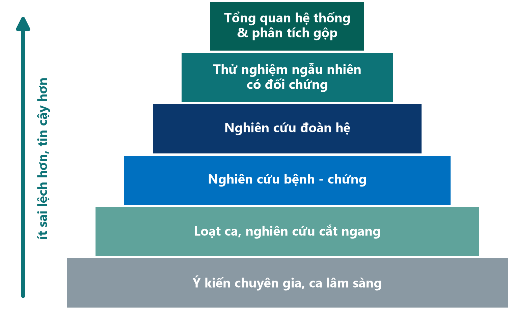{.neu-fig-side}
:::
::::

::: {.neu-takeaway}
**THÔNG ĐIỆP CHÍNH** Tháp xếp hạng thiết kế, không phải từng bài báo: vẫn phải kiểm tra chất lượng.
:::

::: {.notes}
Xây từ dưới lên: ý kiến chuyên gia và báo cáo ca, loạt ca và cắt ngang, bệnh - chứng, đoàn hệ, thử nghiệm ngẫu nhiên, và trên đỉnh là tổng quan hệ thống và phân tích gộp.

Ý chính: càng lên cao, thiết kế càng bảo vệ tốt hơn trước sai lệch. Vì vậy tầng cao cho độ tin cậy lớn hơn với câu hỏi 'điều trị X có hiệu quả không?'.

Quan niệm sai 1: 'RCT luôn đúng'. Thử nghiệm nhỏ hoặc làm kém có thể gây hiểu lầm. Các khung như GRADE đánh giá độ chắc chắn của cả tập hợp bằng chứng, không chỉ nhãn thiết kế.

Quan niệm sai 2: 'chỉ RCT mới có giá trị'. Với mức độ phổ biến, tác hại và tiên lượng, thiết kế quan sát thường là lựa chọn đúng (hoặc duy nhất hợp đạo đức). Nghiên cứu định tính nằm ngoài tháp này - nó trả lời câu hỏi khác.

Hỏi cả lớp: 'Tổng quan hệ thống gồm 10 thử nghiệm kém chất lượng nằm ở đâu?' Trả lời mong đợi: trên đỉnh theo nhãn, nhưng kết luận chỉ mạnh bằng các thử nghiệm bên trong.

Thời gian: 4 phút. Buổi 3 học kỹ từng thiết kế - đừng dạy thiết kế ở đây.
:::

## Câu hỏi nhanh: xếp hạng bằng chứng

::: {.neu-banner style="--c:#6C3483"}
CÂU HỎI NHANH · 3 phút
:::

:::: {.columns}
::: {.column width="60%"}
::: {.neu-activity-steps style="--c:#6C3483"}
1. Bốn nguồn cùng trả lời: 'Hạn chế dịch có giảm tử vong trong sốc nhiễm khuẩn không?'
2. A: một đồng nghiệp lâu năm: '20 năm nay, bệnh nhân để khô của tôi đều tốt hơn'
3. B: một đoàn hệ từ sổ đăng ký gồm hàng nghìn bệnh nhân nhiễm khuẩn huyết tại ICU
4. C: một thử nghiệm phân nhóm ngẫu nhiên 1.554 bệnh nhân sốc nhiễm khuẩn
5. D: một tổng quan gộp mọi thử nghiệm về hạn chế dịch
6. Xếp từ yếu nhất đến mạnh nhất - giơ ngón tay khi đếm đến 3
:::
:::
::: {.column width="40%"}
::: {.neu-side .plain style="--c:#6C3483"}
Rồi thảo luận

- Nguồn nào sẽ làm bạn đổi cách thực hành?
- Điều gì làm C yếu hơn B?
:::
:::
::::

::: {.neu-output style="--c:#6C3483"}
**SẢN PHẨM** Mỗi bàn thống nhất một thứ tự xếp hạng
:::

::: {.notes}
Đáp án: A (ý kiến chuyên gia) \< B (đoàn hệ) \< C (RCT) \< D (tổng quan hệ thống / phân tích gộp).

C chính là thử nghiệm CLASSIC (NEJM 2022) - không khác biệt tử vong 90 ngày. B giống Bài báo 2 (Hyun 2023): cân bằng dịch dương ở ngày 2-3 liên quan với tử vong 28 ngày cao hơn.

Vì sao đoàn hệ thấy có hại mà thử nghiệm lại không? Trả lời mong đợi: trong đoàn hệ, bệnh nhân nặng hơn được truyền nhiều dịch hơn, nên dịch trông như có hại (nhiễu do chỉ định - confounding by indication) - xem trước Buổi 4.

Gợi ý điều phối: đếm '1-2-3' để các bàn giơ tay cùng lúc.

Thời gian: đúng 3 phút.
:::

## Chu trình nghiên cứu

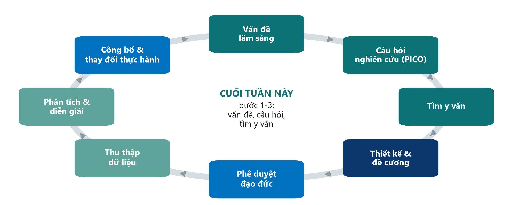{.neu-fig}

::: {.neu-takeaway}
**THÔNG ĐIỆP CHÍNH** Nghiên cứu là một chu trình: kết quả công bố thay đổi thực hành và gợi câu hỏi mới.
:::

::: {.notes}
Đi nhanh một vòng, mỗi ô một câu.

Cuối tuần này = vấn đề lâm sàng và câu hỏi nghiên cứu (hôm nay), tìm y văn (ngày mai) - ba ô màu xanh mòng két phía trên bên phải.

Ý chính: kết quả công bố làm thay đổi thực hành, từ đó lại nảy sinh điều chưa chắc chắn và câu hỏi mới.

Quan niệm sai: 'nghiên cứu = thu thập dữ liệu'. Thu thập dữ liệu đến SAU câu hỏi, thiết kế, đề cương và phê duyệt đạo đức.

Thời gian: 2 phút. Slide sau phóng to chính con đường này.
:::

## Các loại nghiên cứu

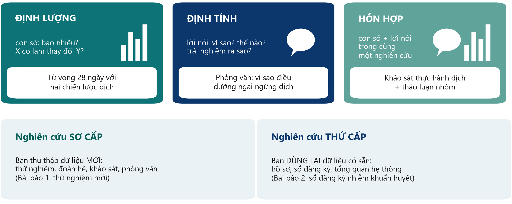{.neu-fig}

::: {.neu-takeaway}
**THÔNG ĐIỆP CHÍNH** Con số trả lời bao nhiêu, mức nào; lời nói trả lời vì sao, thế nào.
:::

::: {.notes}
Hàng trên: loại dữ liệu. Nghiên cứu định lượng (quantitative) đếm và đo (tử vong, cân bằng dịch). Nghiên cứu định tính (qualitative) thu thập lời nói - phỏng vấn, thảo luận nhóm, quan sát - để hiểu trải nghiệm, lý do và rào cản. Phương pháp hỗn hợp (mixed methods) kết hợp cả hai trong một nghiên cứu.

Hàng dưới: nguồn dữ liệu. Nghiên cứu sơ cấp (primary) thu thập dữ liệu mới (Bài báo 1, một thử nghiệm mới). Nghiên cứu thứ cấp (secondary) dùng lại dữ liệu có sẵn - hồ sơ bệnh án, sổ đăng ký (Bài báo 2 dùng sổ đăng ký nhiễm khuẩn huyết) hoặc các nghiên cứu đã công bố (tổng quan hệ thống).

Ý chính: câu hỏi quyết định loại nghiên cứu. 'Hạn chế dịch có giảm tử vong không?' là định lượng; 'vì sao điều dưỡng ngại ngừng dịch?' là định tính.

Quan niệm sai: 'nghiên cứu định tính chỉ là ý kiến'. Nó có phương pháp chặt chẽ và hướng dẫn báo cáo riêng (COREQ cho phỏng vấn và thảo luận nhóm); là công cụ đúng khi con số không giải thích được hành vi.

Hỏi cả lớp: 'Loại nào cho thấy vì sao một quy trình dịch mới không được tuân thủ?' Trả lời mong đợi: định tính, hoặc hỗn hợp kèm một audit.

Thời gian: 3 phút. Thiết kế định tính được học lại ở Buổi 3.
:::

## Kiểm tra hiểu bài: loại nghiên cứu nào?

::: {.neu-banner style="--c:#6C3483"}
CÂU HỎI NHANH · 2 phút
:::

::: {.neu-activity-steps style="--c:#6C3483"}
1. A: đếm số bệnh nhân ICU bị tổn thương do tì đè trong năm nay
2. B: phỏng vấn gia đình về quy định thăm bệnh ở ICU
3. C: phân tích lại hồ sơ ra viện 3 năm để tìm tái nhập viện
4. D: khảo sát thực hành vệ sinh tay kèm thảo luận nhóm với điều dưỡng
5. Mỗi câu: định lượng, định tính hay hỗn hợp? Sơ cấp hay thứ cấp?
:::

::: {.neu-output style="--c:#6C3483"}
**SẢN PHẨM** Cả lớp trả lời to - slide sau có đáp án
:::

::: {.notes}
Kiểm tra nhanh, không phải bài thi. Đọc từng câu và để cả lớp trả lời to.

Đáp án (slide sau): A định lượng, sơ cấp. B định tính, sơ cấp. C định lượng, thứ cấp (hồ sơ đã có sẵn). D phương pháp hỗn hợp, sơ cấp.

Nếu lớp lưỡng lự ở câu C: dữ liệu được thu thập cho chăm sóc, không phải cho nghiên cứu này - dùng lại chúng là nghiên cứu thứ cấp. Vẫn cần xét duyệt đạo đức.

Thời gian: 2 phút.
:::

## Đáp án: loại nghiên cứu nào?

:::: {.neu-cards style="--n:4"}
::: {.neu-card .plain style="--c:#0D7377"}
[A  Đếm số ca]{.neu-card-title}

- Định lượng
- Sơ cấp
- (số liệu mới)
:::
::: {.neu-card .plain style="--c:#0B376C"}
[B  Phỏng vấn]{.neu-card-title}

- Định tính
- Sơ cấp
- (lời nói, vì sao)
:::
::: {.neu-card .plain style="--c:#5FA39B"}
[C  Hồ sơ cũ]{.neu-card-title}

- Định lượng
- Thứ cấp
- (dữ liệu có sẵn)
:::
::: {.neu-card .plain style="--c:#0070C0"}
[D  Khảo sát + nhóm]{.neu-card-title}

- Hỗn hợp
- Sơ cấp
- (số + lời nói)
:::
::::

::: {.neu-takeaway}
**THÔNG ĐIỆP CHÍNH** Hỏi hai điều: con số hay lời nói? Dữ liệu mới hay có sẵn?
:::

::: {.notes}
Đi nhanh qua bốn thẻ.

Ý chính: hai câu hỏi đơn giản phân loại được gần như mọi nghiên cứu - loại dữ liệu (con số hay lời nói) và nguồn dữ liệu (mới hay có sẵn).

Nghiên cứu thứ cấp thường khả thi nhất với một khoa bận rộn - nhưng chất lượng phụ thuộc vào cách ghi chép hồ sơ (Buổi 5).

Thời gian: 2 phút.
:::

## Nghiên cứu, audit hay cải tiến chất lượng?

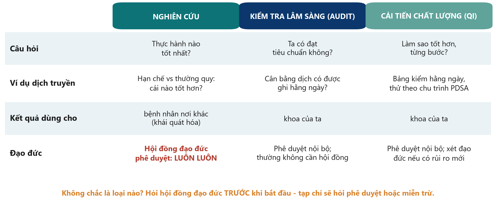{.neu-fig}

::: {.neu-takeaway}
**THÔNG ĐIỆP CHÍNH** Nghiên cứu hỏi điều gì tốt nhất; audit hỏi ta có làm không; QI làm cho tốt hơn.
:::

::: {.notes}
Nghiên cứu tạo ra kiến thức mới, có thể khái quát hóa - phương án nào tốt nhất? Kiểm tra lâm sàng (audit) so sánh thực hành của ta với một tiêu chuẩn đã thống nhất. Cải tiến chất lượng (QI) thay đổi một quy trình tại chỗ từng bước, thường theo chu trình Lập kế hoạch - Thực hiện - Nghiên cứu - Hành động (PDSA).

Vì sao quan trọng: nghiên cứu luôn cần hội đồng đạo đức phê duyệt trước khi bắt đầu. Audit và QI thường chỉ cần phê duyệt nội bộ - nhưng nếu dự án phân nhóm ngẫu nhiên, thêm can thiệp hay rủi ro mới, hoặc thu thập dữ liệu ngoài chăm sóc thường quy, thì đó là nghiên cứu và cần xét duyệt đạo đức.

Công bố không làm thay đổi bản chất dự án. Tạp chí sẽ hỏi phê duyệt đạo đức hoặc quyết định miễn trừ chính thức, vì vậy hãy xác định - và hỏi - ngay từ đầu, không phải sau khi đã thu thập dữ liệu.

Quan niệm sai: 'audit và QI là nghiên cứu hạng hai'. Chúng trả lời câu hỏi khác và rất cần thiết; nhiều câu hỏi nghiên cứu hay bắt đầu từ kết quả audit.

Hỏi cả lớp: 'Kiểm tra xem cân bằng dịch có được ghi hằng ngày theo quy trình không - là nghiên cứu, audit hay QI?' Trả lời mong đợi: audit.

Lưu ý: quy định khác nhau giữa các cơ sở. Nhắc học viên xem quy định nội bộ và, nếu không chắc, hỏi hội đồng đạo đức.

Thời gian: 3 phút.
:::

## Kiểm tra hiểu bài: nghiên cứu, audit hay QI?

::: {.neu-banner style="--c:#6C3483"}
CÂU HỎI NHANH · 2 phút
:::

::: {.neu-activity-steps style="--c:#6C3483"}
1. A: kiểm tra cân bằng dịch có được ghi hằng ngày theo quy trình không
2. B: phân nhóm ngẫu nhiên bệnh nhân vào hạn chế dịch hoặc dịch thường quy
3. C: thử bảng kiểm bàn giao ca mới theo các chu trình PDSA nhỏ
4. D: phỏng vấn điều dưỡng vì sao ngại ngừng dịch
5. Mỗi câu: nghiên cứu, audit hay QI - và ai phải phê duyệt?
:::

::: {.neu-output style="--c:#6C3483"}
**SẢN PHẨM** Giơ 1 ngón cho nghiên cứu, 2 cho audit, 3 cho QI
:::

::: {.notes}
Đọc từng câu; cả lớp giơ 1, 2 hoặc 3 ngón tay.

Đáp án (slide sau): A audit; B nghiên cứu (hội đồng đạo đức + đăng ký); C cải tiến chất lượng; D nghiên cứu (định tính - hội đồng đạo đức).

Ý chính: con đường đạo đức phụ thuộc vào việc bạn LÀM GÌ, không phụ thuộc vào việc có định công bố hay không.

Thời gian: 2 phút.
:::

## Đáp án: nghiên cứu, audit hay QI?

| Dự án | Loại | Phê duyệt trước khi bắt đầu |
|:---|:---|:---|
| A  Cân bằng dịch có ghi hằng ngày? | Audit | Nội bộ / quản lý chất lượng |
| B  Phân nhóm hạn chế dịch vs thường quy | Nghiên cứu | Hội đồng đạo đức + đăng ký thử nghiệm |
| C  Bảng kiểm bàn giao theo PDSA | Cải tiến chất lượng | Nội bộ; xét đạo đức nếu có rủi ro mới |
| D  Phỏng vấn điều dưỡng về ngừng dịch | Nghiên cứu (định tính) | Hội đồng đạo đức |

::: {.neu-table-caption}
Quy định khác nhau giữa các cơ sở: xem quy định nội bộ và hỏi hội đồng đạo đức khi không chắc.
:::

::: {.notes}
Đi qua bốn dòng.

Hay nhầm: câu D có vẻ như 'chỉ là nói chuyện với đồng nghiệp', nhưng phỏng vấn có hệ thống, có ghi âm và phân tích là nghiên cứu, cần đồng ý tham gia và phê duyệt đạo đức.

Quan niệm sai: 'nếu sau này mới công bố thì sau này xin phép cũng được'. Tạp chí sẽ hỏi phê duyệt hoặc quyết định miễn trừ, và phê duyệt hồi cứu thường bị từ chối.

Thời gian: 2 phút.
:::

## Cả con đường: từ ý tưởng đến công bố

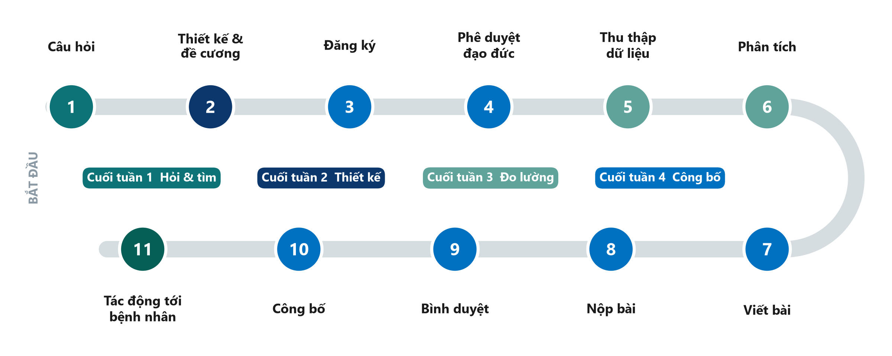{.neu-fig}

::: {.neu-takeaway}
**THÔNG ĐIỆP CHÍNH** Khóa học đi hết con đường - đề cương của nhóm bao gồm trạm 1 đến 6.
:::

::: {.notes}
Mười một trạm từ câu hỏi đến tác động. Màu sắc cho biết cuối tuần nào của khóa học dạy trạm đó.

Trạm 1-6 là lập kế hoạch và thực hiện: câu hỏi, thiết kế và đề cương, đăng ký (thử nghiệm phải đăng ký TRƯỚC bệnh nhân đầu tiên - Bài báo 1 đăng ký tháng 7/2021, bắt đầu tuyển tháng 9/2021), phê duyệt đạo đức, thu thập dữ liệu, phân tích.

Trạm 7-11 là công bố: viết bài, nộp bài, bình duyệt, công bố và tác động tới bệnh nhân. Con đường thường mất một đến ba năm; nhiều nghiên cứu tốt dừng lại ở trạm 7.

Ý chính: mọi trạm đều phụ thuộc trạm 1. Câu hỏi mơ hồ tạo ra đề cương yếu, phân tích không trả lời được và bài báo khó công bố.

Quan niệm sai: 'công bố là điểm kết thúc'. Mục đích là tác động - một hướng dẫn, quy trình hay thực hành được thay đổi.

Hỏi cả lớp: 'Theo bạn, nghiên cứu ở bệnh viện hay mắc kẹt ở trạm nào?' Mong đợi: thủ tục đạo đức, thu thập dữ liệu, hoặc viết bài (trạm 7) - ta sẽ giải quyết từng trạm.

Thời gian: 3 phút. Phần 1.1 kết thúc lúc 1:10 - giải lao.
:::

## Giải lao

::: {.neu-banner style="--c:#8A99A3"}
GIẢI LAO · 15 phút
:::

::: {.neu-activity-steps style="--c:#8A99A3"}
1. Thư giãn, uống cà phê, trò chuyện với người khác nghề
2. Suy nghĩ: nhóm bạn có thể làm vấn đề nào từ khoa mình hôm nay?
:::

::: {.notes}
GIẢI LAO (1:10-1:25).

Trong giờ giải lao: đặt phiếu bài tập Buổi 1 lên bàn và viết các tình huống của bài tập theo cặp lên bảng giấy.

Bắt đầu lại đúng giờ - nói rõ giờ quay lại.
:::

## 1.2  Từ vấn đề đến câu hỏi

:::: {.neu-statement}
::: {.neu-big}
Một câu hỏi tốt là một nửa câu trả lời.
:::

::: {.neu-sub}
40 phút: câu hỏi đến từ đâu, PICO(T) qua các ví dụ, loại câu hỏi, FINER - rồi bài tập theo cặp
:::
::::

::: {.notes}
PHẦN 1.2 (1:25-2:05).

Ý chính: một băn khoăn lâm sàng mơ hồ ('dịch truyền có hại không?') phải được chuyển thành câu hỏi chính xác, trả lời được, trước khi làm việc gì khác.

Ta sẽ xây PICO thật chậm qua nhiều ví dụ - ICU và khoa phòng - trước khi thực hành theo cặp.

Thời gian: 30 giây.
:::

## Câu hỏi nghiên cứu đến từ đâu?

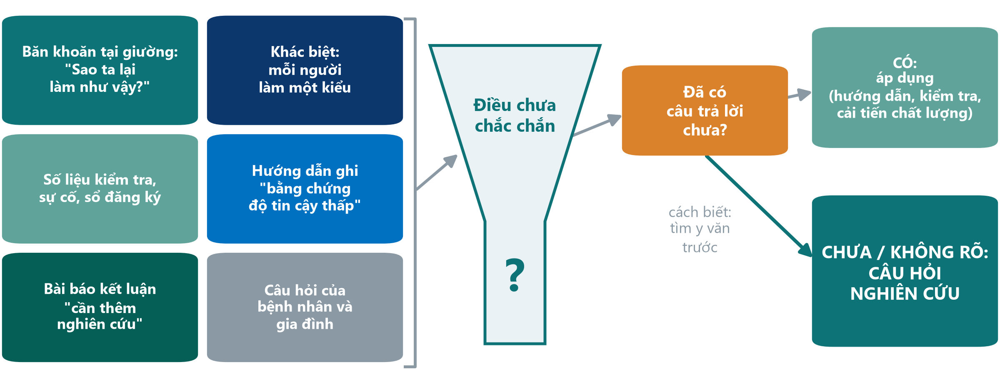{.neu-fig}

::: {.neu-takeaway}
**THÔNG ĐIỆP CHÍNH** Nếu đã có câu trả lời, hãy áp dụng. Nếu chưa, bạn có một câu hỏi nghiên cứu.
:::

::: {.notes}
Sáu nguồn thường gặp của câu hỏi hay, đều từ công việc hằng ngày.

Ô màu cam là quyết định then chốt: trước khi gọi một việc là nghiên cứu, hãy kiểm tra câu trả lời đã có chưa. Nếu đã có, việc cần làm là triển khai - hướng dẫn, audit hay dự án QI (phần 1.1).

Ý chính: 'cách biết' chính là tìm y văn - đó là nội dung Buổi 2 ngày mai.

Hỏi cả lớp: 'Kể một việc trong khoa mà mỗi đồng nghiệp làm một kiểu.' Mong đợi: mục tiêu an thần, lượng dịch truyền, thay băng, thời điểm vận động sớm. Ghi lên bảng giấy - đó là chủ đề tiềm năng cho đề cương.

Thời gian: 3 phút.
:::

## PICO(T): ví dụ xuyên suốt

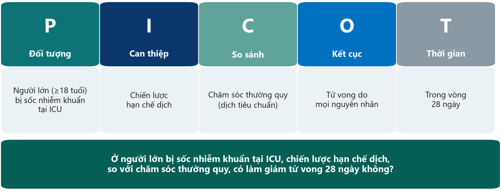{.neu-fig}

::: {.neu-takeaway}
**THÔNG ĐIỆP CHÍNH** Buổi nào chúng ta cũng quay lại câu hỏi này.
:::

::: {.notes}
PICO = Đối tượng (Population), Can thiệp (Intervention), So sánh (Comparison), Kết cục (Outcome). T (Time - thời gian) cho biết khi nào đo kết cục.

Đọc năm ô, rồi đọc cả câu ở dưới. Đây là ví dụ xuyên suốt cả khóa học.

Ý chính: mỗi chữ cái buộc ta quyết định. Chính xác là bệnh nhân nào? Hạn chế thế nào? So với cái gì? Kết cục nào, đo lúc nào?

Biến thể: với câu hỏi quan sát, I thành E (phơi nhiễm - exposure), ví dụ 'cân bằng dịch dương' - PECO. Câu hỏi mô tả có thể chỉ cần P và O.

Quan niệm sai: 'nhóm so sánh thì hiển nhiên'. Chăm sóc thường quy khác nhau giữa các bệnh viện và theo thời gian - phải mô tả rõ.

Hỏi cả lớp: 'Tử vong 28 ngày có phải kết cục hợp lý duy nhất?' Mong đợi: tử vong 90 ngày, số ngày sống không cần hỗ trợ sự sống, tổn thương thận cần lọc máu, cân bằng dịch. Các thử nghiệm lớn dùng tử vong 90 ngày.

Thời gian: 4 phút.
:::

## PICO(T) tại khoa: ba ví dụ mẫu

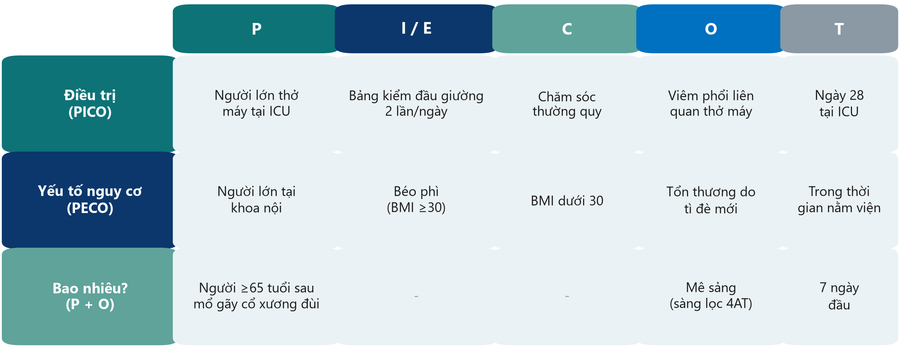{.neu-fig}

::: {.neu-takeaway}
**THÔNG ĐIỆP CHÍNH** Câu hỏi điều trị dùng PICO, câu hỏi nguy cơ dùng PECO, câu hỏi 'bao nhiêu?' chỉ cần P và O.
:::

::: {.notes}
Ba ví dụ KHÔNG về dịch truyền, để mọi ngành nghề đều thấy mình trong đó.

Dòng 1 - điều trị (PICO): người lớn thở máy; bảng kiểm đầu giường 2 lần/ngày so với chăm sóc thường quy; viêm phổi liên quan thở máy đến ngày 28 tại ICU.

Dòng 2 - yếu tố nguy cơ (PECO): ta không thể 'phân' béo phì cho bệnh nhân, nên I thành E (phơi nhiễm). Người lớn tại khoa nội; béo phì so với không béo phì; tổn thương do tì đè mới trong thời gian nằm viện.

Dòng 3 - bao nhiêu? Chỉ P và O (và T): người ≥65 tuổi sau mổ gãy cổ xương đùi; mê sảng sàng lọc bằng 4AT trong 7 ngày đầu.

Ý chính: các ô bạn điền đã cho biết loại câu hỏi - và sau này là thiết kế.

Hỏi cả lớp: 'Cho tôi một câu hỏi PECO từ khoa dược.' Ví dụ mong đợi: ở người lớn tại ICU, dùng nhiều thuốc (≥10 thuốc) so với ít hơn có liên quan với mê sảng không?

Thời gian: 4 phút.
:::

## Kiểm tra hiểu bài: tìm PICO

::: {.neu-banner style="--c:#6C3483"}
CÂU HỎI NHANH · 3 phút
:::

::: {.neu-activity-steps style="--c:#6C3483"}
1. Đọc câu hỏi: 'Ở người ≥65 tuổi sau mổ gãy cổ xương đùi, gói chăm sóc không dùng thuốc hằng ngày, so với chăm sóc thường quy, có giảm mê sảng trong 7 ngày đầu không?'
2. Những từ nào là P? I? C? O? T?
3. Ghi năm chữ cái vào phiếu (Bài tập 1, phần khởi động)
4. So sánh với người bên cạnh
:::

::: {.neu-output style="--c:#6C3483"}
**SẢN PHẨM** Năm phần được gắn nhãn - đáp án ở slide sau
:::

::: {.notes}
Cho lớp 2 phút làm yên lặng, rồi 1 phút so sánh.

Đáp án (slide sau): P người ≥65 tuổi sau mổ gãy cổ xương đùi; I gói phòng mê sảng không dùng thuốc hằng ngày; C chăm sóc thường quy; O mê sảng; T 7 ngày đầu sau mổ.

Chú ý học viên gắn 'gãy cổ xương đùi' là kết cục - thực ra đó là một phần của đối tượng.

Thời gian: 3 phút.
:::

## Đáp án: tìm PICO

:::: {.neu-cards style="--n:5"}
::: {.neu-card .plain style="--c:#0D7377"}
[P]{.neu-card-title}

- Người ≥65 tuổi
- sau mổ gãy
- cổ xương đùi
:::
::: {.neu-card .plain style="--c:#0B376C"}
[I]{.neu-card-title}

- Gói phòng mê sảng
- không dùng thuốc
- hằng ngày
:::
::: {.neu-card .plain style="--c:#5FA39B"}
[C]{.neu-card-title}

- Chăm sóc
- thường quy
:::
::: {.neu-card .plain style="--c:#0070C0"}
[O]{.neu-card-title}

- Mê sảng
- (sàng lọc
- hằng ngày)
:::
::: {.neu-card .plain style="--c:#055F56"}
[T]{.neu-card-title}

- 7 ngày đầu
- sau mổ
:::
::::

::: {.neu-takeaway}
**THÔNG ĐIỆP CHÍNH** Chẩn đoán khiến bệnh nhân vào nghiên cứu thuộc P, không phải O.
:::

::: {.notes}
Hiện đáp án và hỏi bao nhiêu người đúng cả năm.

Ý chính: kết cục phải là điều có thể xảy ra SAU khi can thiệp bắt đầu. Gãy cổ xương đùi đã xảy ra - nó xác định ai đủ tiêu chuẩn.

Câu hỏi thêm nếu lớp đi nhanh: 'Đo mê sảng thế nào?' Mong đợi: dùng công cụ sàng lọc đã chuẩn hóa (ví dụ 4AT hoặc CAM) vào cùng giờ mỗi ngày.

Thời gian: 2 phút.
:::

## Hai nhóm câu hỏi

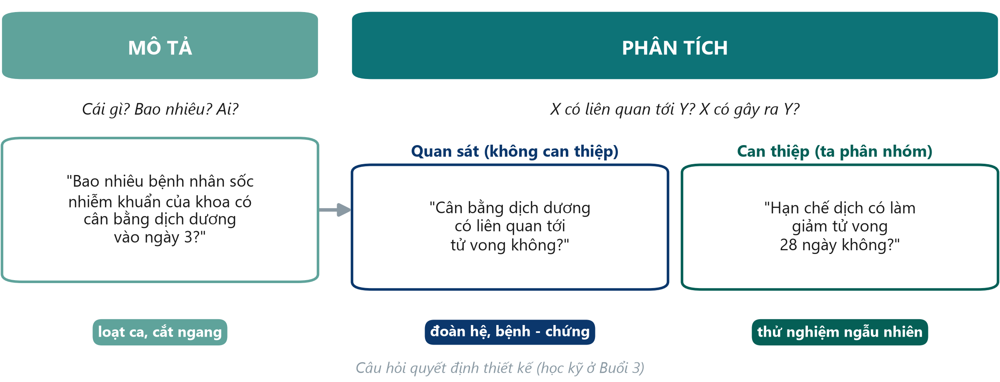{.neu-fig}

::: {.neu-takeaway}
**THÔNG ĐIỆP CHÍNH** Câu hỏi mô tả thì mô tả. Câu hỏi phân tích thì so sánh hoặc kiểm định nguyên nhân.
:::

::: {.notes}
Mô tả: cái gì, bao nhiêu, ai - không cần nhóm so sánh.

Phân tích: X có liên quan tới Y (quan sát - ta theo dõi), hoặc X có gây ra Y (thực nghiệm - ta chủ động phân nhóm X).

Ý chính: động từ tiết lộ loại câu hỏi. 'Bao nhiêu' là mô tả; 'có liên quan với' là quan sát; 'có làm giảm' hàm ý thực nghiệm.

Quan niệm sai: 'nghiên cứu mô tả không phải nghiên cứu thật'. Chúng thường đi trước và cho thấy vấn đề có tồn tại.

Hỏi cả lớp: 'Bài báo 2 (Hyun) thuộc ô nào?' Mong đợi: phân tích, quan sát (đoàn hệ).

Thời gian: 3 phút. Danh mục thiết kế đầy đủ học ở Buổi 3.
:::

## Mơ hồ và trả lời được

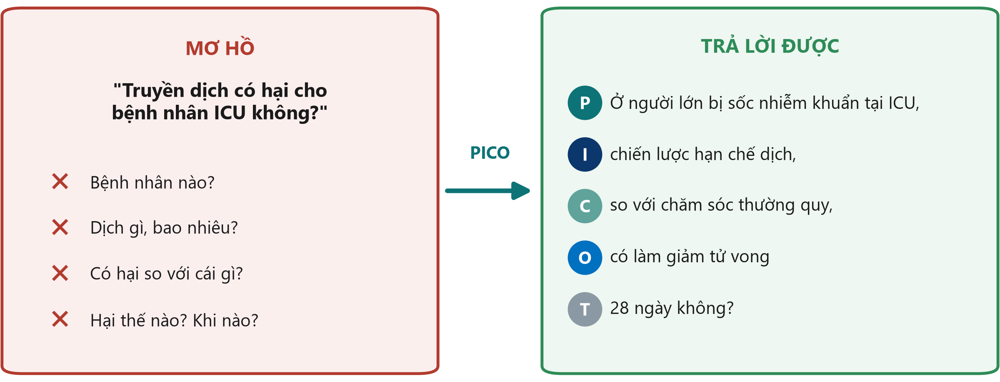{.neu-fig}

::: {.neu-takeaway}
**THÔNG ĐIỆP CHÍNH** Nếu chưa điền đủ bốn ô PICO, câu hỏi chưa sẵn sàng.
:::

::: {.notes}
Bên trái: câu hỏi ta hay hỏi ngoài hành lang - từ nào cũng chưa được định nghĩa. Bên phải: cùng băn khoăn đó viết theo PICO(T).

Ý chính: câu hỏi nghiên cứu được phải cụ thể, có một kết cục chính, và gợi ra thiết kế.

Quan niệm sai: 'câu hỏi rộng thì quan trọng hơn'. Câu hỏi rộng cho câu trả lời mơ hồ.

Hỏi cả lớp: 'Hãy làm câu này trả lời được: Rửa tay có tốt không?' Hướng mong đợi: ở nhân viên ICU (P), chương trình phản hồi (I) so với không phản hồi (C) có làm tăng tuân thủ vệ sinh tay sau 3 tháng (O, T) không?

Thời gian: 3 phút.
:::

## FINER: câu hỏi có đáng hỏi không?

::: {.neu-intro}
Kiểm tra mọi câu hỏi với năm tiêu chí trước khi đầu tư thời gian.
:::

:::: {.neu-cards style="--n:5"}
::: {.neu-card .plain style="--c:#0D7377"}
[Khả thi]{.neu-card-title}

- Đủ bệnh nhân
- Thời gian, kinh phí,
- kỹ năng, dữ liệu
:::
::: {.neu-card .plain style="--c:#0B376C"}
[Thú vị]{.neu-card-title}

- Với bạn, nhóm
- và người đọc
:::
::: {.neu-card .plain style="--c:#5FA39B"}
[Mới]{.neu-card-title}

- Khẳng định, bác bỏ
- hoặc mở rộng
- điều đã biết
:::
::: {.neu-card .plain style="--c:#0070C0"}
[Đạo đức]{.neu-card-title}

- Hội đồng đạo đức
- có thể phê duyệt
:::
::: {.neu-card .plain style="--c:#055F56"}
[Phù hợp]{.neu-card-title}

- Có thể thay đổi
- thực hành, chính sách
- hay nghiên cứu
:::
::::

::: {.neu-takeaway}
**THÔNG ĐIỆP CHÍNH** Nếu câu hỏi trượt một tiêu chí, hãy viết lại trước khi đi tiếp.
:::

::: {.notes}
FINER (Feasible, Interesting, Novel, Ethical, Relevant) do Hulley và cộng sự đề xuất trong sách Designing Clinical Research.

Khả thi là tiêu chí hay trượt nhất trong nghiên cứu tại bệnh viện: không đủ bệnh nhân, hoặc kết cục quá hiếm.

Mới không có nghĩa là 'chưa ai nghiên cứu'. Lặp lại ở bối cảnh mới, hoặc với thiết kế tốt hơn, vẫn có thể là mới - vì vậy tìm y văn rất quan trọng.

Đạo đức: có thực sự chưa chắc chắn (cân bằng lâm sàng - equipoise) lựa chọn nào tốt hơn không?

Hỏi cả lớp: 'Ví dụ xuyên suốt trượt tiêu chí nào?' Để lớp đoán - slide sau có đáp án.

Thời gian: 3 phút.
:::

## Kiểm tra FINER cho ví dụ xuyên suốt

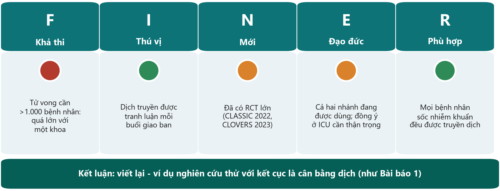{.neu-fig}

::: {.neu-takeaway}
**THÔNG ĐIỆP CHÍNH** Câu hỏi quan trọng nhưng không khả thi với một khoa: cần viết lại.
:::

::: {.notes}
F màu đỏ: để thấy khác biệt vài điểm phần trăm về tử vong cần hơn một nghìn bệnh nhân. CLASSIC phân nhóm 1.554 người; CLOVERS (NEJM 2023) 1.563 người. Một ICU không làm được.

N màu vàng cam: đã có thử nghiệm lớn và không thử nghiệm nào thấy khác biệt về tử vong.

E màu vàng cam: cả hai chiến lược đều đang dùng nên có cân bằng lâm sàng, nhưng lấy đồng ý trong sốc nhiễm khuẩn rất khó (Buổi 7).

Cách cứu câu hỏi: đổi kết cục (cân bằng dịch ngày 5, như Bài báo 1), làm nghiên cứu thử nghiệm tính khả thi (pilot), hoặc đặt câu hỏi mô tả về thực hành của chính khoa mình.

Quan niệm sai: 'trượt FINER nghĩa là ý tưởng tồi'. Nghĩa là ý tưởng cần được định hình lại - bình thường và được mong đợi.

Hỏi cả lớp: 'Đề xuất một phiên bản khả thi cho khoa mình.' Mong đợi: một câu hỏi mô tả kiểu audit, hoặc một pilot như Bài báo 1.

Thời gian: 3 phút.
:::

## Bài tập theo cặp: từ tình huống đến câu hỏi

::: {.neu-banner style="--c:#0D7377"}
LÀM VIỆC NHÓM · 11 phút
:::

:::: {.columns}
::: {.column width="60%"}
::: {.neu-activity-steps style="--c:#0D7377"}
1. Chọn MỘT tình huống trong Bài tập 1 của phiếu
2. Điền các ô PICO(T)
3. Viết câu hỏi thành một câu
4. Gắn đèn FINER nhanh (xanh / vàng / đỏ)
5. Viết H0 và H1 (hoặc giải thích vì sao không cần)
:::
:::
::: {.column width="40%"}
::: {.neu-side .plain style="--c:#0D7377"}
Tình huống

- Viêm phổi liên quan thở máy
- Tổn thương do tì đè
- Mê sảng
- Đột quỵ: thời gian cửa - kim
- Sai sót dùng thuốc
:::
:::
::::

::: {.neu-output style="--c:#0D7377"}
**SẢN PHẨM** Một câu hỏi PICO + đèn FINER + giả thuyết, sẵn sàng đọc to
:::

::: {.notes}
Ghép cặp: nếu được, mỗi cặp gồm hai nghề khác nhau.

Điều phối: đi vòng với ô 'thế nào là tốt' trong Course/Solutions/s1\_solutions.md. Lỗi hay gặp: thiếu nhóm so sánh, kết cục không có mốc thời gian, nhồi hai kết cục vào một câu hỏi.

Ở phút thứ 8, dừng lại. Mời ba cặp đọc to câu hỏi; mời lớp gọi tên từng chữ cái PICO và hỏi 'chữ FINER nào làm bạn lo?'.

Cặp làm tổn thương do tì đè thường nhận ra câu hỏi đầu tiên nên là câu hỏi mô tả - hãy khen điều này.

Thời gian: 8 phút làm + 3 phút tổng kết. Phần 1.3 bắt đầu lúc 2:05.
:::

## 1.3  Mục đích, mục tiêu, giả thuyết

:::: {.neu-statement}
::: {.neu-big}
Câu hỏi cho biết ta muốn biết gì. Mục đích và mục tiêu cho biết ta sẽ làm gì.
:::

::: {.neu-sub}
20 phút: mục đích, mục tiêu, giả thuyết không và giả thuyết đối - và một bài tập nhanh
:::
::::

::: {.notes}
PHẦN 1.3 (2:05-2:25).

Ý chính: mục đích, mục tiêu và giả thuyết là câu hỏi được viết thành kế hoạch. Hội đồng đạo đức và người xét duyệt tài trợ đọc phần này đầu tiên.

Giữ cụ thể: mọi ví dụ dùng ví dụ xuyên suốt hoặc tình huống của bài tập theo cặp.

Thời gian: 30 giây.
:::

## Mục đích, mục tiêu, giả thuyết

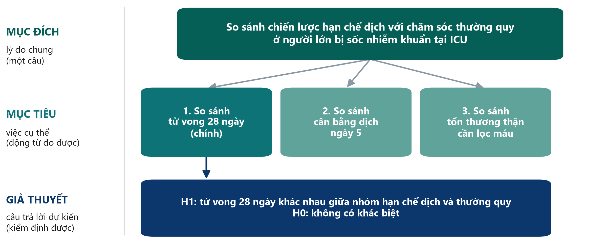{.neu-fig}

::: {.neu-takeaway}
**THÔNG ĐIỆP CHÍNH** Một mục đích, 2-3 mục tiêu đo được, một giả thuyết cho mỗi mục tiêu chính.
:::

::: {.notes}
Mục đích (aim) = mục đích chung trong một câu ('So sánh...', 'Mô tả...').

Mục tiêu (objectives) = các bước cụ thể, đo được. Dùng động từ đo được: so sánh, ước tính, mô tả, xác định. Tránh 'tìm hiểu', 'khám phá', 'nghiên cứu'.

Đánh dấu mục tiêu chính - nó quyết định cỡ mẫu (Buổi 6).

Giả thuyết (hypothesis) = câu trả lời dự kiến cho mục tiêu phân tích chính, phát biểu sao cho dữ liệu có thể bác bỏ.

Quan niệm sai: 'nghiên cứu nào cũng cần giả thuyết'. Nghiên cứu thuần mô tả thì ước tính; không kiểm định giả thuyết.

Thời gian: 3 phút.
:::

## Mục tiêu bắt đầu bằng động từ đo được

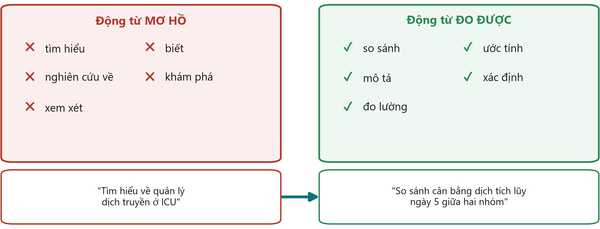{.neu-fig}

::: {.neu-takeaway}
**THÔNG ĐIỆP CHÍNH** Nếu không nói được sẽ đo bằng cách nào, đó chưa phải là mục tiêu.
:::

::: {.notes}
Bên trái: động từ mô tả mong muốn, không phải hành động kiểm tra được. Bên phải: động từ chỉ tới điều đếm được hoặc đo được.

Phía dưới: cùng một ý được viết lại. 'Tìm hiểu về quản lý dịch truyền' không thể hoàn thành hay kiểm tra; 'so sánh cân bằng dịch tích lũy ngày 5 giữa hai nhóm' cho biết kết cục, thời điểm và sự so sánh.

Ý chính: mỗi mục tiêu ứng với một kết cục và, sau này, một phân tích (Buổi 6).

Quan niệm sai: 'càng nhiều mục tiêu đề cương càng mạnh'. Hai hoặc ba mục tiêu tập trung tốt hơn tám mục tiêu mơ hồ.

Hỏi cả lớp: 'Viết lại: nghiên cứu về mê sảng ở khoa.' Mong đợi: ước tính tỷ lệ người ≥65 tuổi bị mê sảng trong 7 ngày đầu sau mổ gãy cổ xương đùi.

Thời gian: 3 phút.
:::

## Giả thuyết không và giả thuyết đối

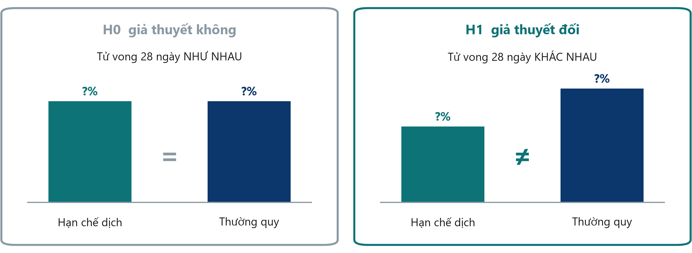{.neu-fig}

::: {.neu-takeaway}
**THÔNG ĐIỆP CHÍNH** Ta kiểm định H0. Dữ liệu có thể bác bỏ hoặc chưa bác bỏ được - không bao giờ chứng minh H0.
:::

::: {.notes}
H0, giả thuyết không (null hypothesis): không có khác biệt. H1, giả thuyết đối (alternative hypothesis): có khác biệt.

So sánh: tòa án giả định 'không có tội' (H0) cho đến khi bằng chứng đủ mạnh. 'Không có tội' không giống 'vô tội' - và 'khác biệt không có ý nghĩa thống kê' không giống 'không có khác biệt'.

H1 thường là hai phía, ngay cả khi kỳ vọng có lợi, vì hạn chế dịch cũng có thể gây hại.

Quan niệm sai: 'p \> 0,05 chứng minh hai điều trị như nhau'. Nghiên cứu nhỏ như Bài báo 1 (48 bệnh nhân) thường không phát hiện được khác biệt có thật. Giá trị p học ở Buổi 6.

Thời gian: 3 phút.
:::

## Bài tập nhanh: mục đích, mục tiêu, giả thuyết

::: {.neu-banner style="--c:#0B376C"}
BÀI TẬP CÁ NHÂN · 7 phút
:::

:::: {.columns}
::: {.column width="60%"}
::: {.neu-activity-steps style="--c:#0B376C"}
1. Dùng câu hỏi từ bài tập theo cặp (hoặc ví dụ mê sảng)
2. Viết MỘT mục đích: 'So sánh...' hoặc 'Mô tả...'
3. Viết HAI mục tiêu với động từ đo được; đánh dấu mục tiêu chính
4. Viết H0 và H1 cho mục tiêu chính - hoặc 'mô tả: không cần giả thuyết'
5. Đổi phiếu với người bên cạnh: mọi động từ có đo được không?
:::
:::
::: {.column width="40%"}
::: {.neu-side .plain style="--c:#0B376C"}
Động từ dùng được

- so sánh
- ước tính
- mô tả
- xác định
- đo lường
:::
:::
::::

::: {.neu-output style="--c:#0B376C"}
**SẢN PHẨM** Bài tập 3 trong phiếu - đáp án mẫu ở slide sau
:::

::: {.notes}
Làm cá nhân, 5 phút viết + 2 phút đổi phiếu.

Đi vòng và tìm: 'tìm hiểu/biết/nghiên cứu', mục tiêu không có mốc thời gian, giả thuyết về một kết cục không có trong mục tiêu.

Đáp án mẫu cho ví dụ mê sảng ở slide sau và trong Course/Solutions/s1\_solutions.md.

Thời gian: 7 phút.
:::

## Đáp án mẫu: ví dụ mê sảng

:::: {.neu-cards style="--n:3"}
::: {.neu-card .plain style="--c:#0D7377"}
[Mục đích]{.neu-card-title}

- So sánh gói chăm sóc
- không dùng thuốc với
- chăm sóc thường quy
- sau mổ gãy cổ xương đùi
:::
::: {.neu-card .plain style="--c:#0B376C"}
[Mục tiêu]{.neu-card-title}

- 1. (Chính) So sánh
- mê sảng trong 7 ngày
- 2. So sánh thời gian
- nằm viện
:::
::: {.neu-card .plain style="--c:#5FA39B"}
[Giả thuyết]{.neu-card-title}

- H0: tỷ lệ mê sảng
- như nhau ở hai nhóm
- H1: khác nhau
:::
::::

::: {.neu-takeaway}
**THÔNG ĐIỆP CHÍNH** Mục đích, mục tiêu chính và giả thuyết cùng nêu một kết cục.
:::

::: {.notes}
Đọc ba thẻ.

Kiểm tra chuỗi: O của câu hỏi (mê sảng trong 7 ngày) = mục tiêu chính = kết cục trong H0/H1. Nếu các phần này khác nhau, đề cương thiếu nhất quán - người phản biện nhận ra ngay.

Phiên bản mô tả không cần giả thuyết: 'Ước tính tỷ lệ người ≥65 tuổi bị mê sảng trong 7 ngày đầu sau mổ gãy cổ xương đùi.'

Thời gian: 3 phút. Phần 1.3 kết thúc lúc 2:25.
:::

## Xây dựng đề cương 1

:::: {.neu-statement}
::: {.neu-big}
Đến lượt nhóm bạn: một chủ đề, một câu hỏi, một mục đích.
:::

::: {.neu-sub}
30 phút làm việc nhóm - khởi đầu đề cương nghiên cứu
:::
::::

::: {.notes}
XÂY DỰNG ĐỀ CƯƠNG 1 (2:25-2:55).

Ý chính: mọi điều học hôm nay giờ được áp dụng vào chủ đề của nhóm. Đến 2:55 mỗi nhóm có một câu hỏi PICO qua được FINER, một mục đích và 2-3 mục tiêu trong mẫu đề cương.

Mỗi nhóm chọn MỘT vấn đề. Nếu sau 5 phút chưa thống nhất, giao ví dụ xuyên suốt hoặc một ví dụ phụ (viêm phổi thở máy, tổn thương do tì đè, vệ sinh tay, thời gian cửa - kim, mê sảng, sai sót dùng thuốc).

Tìm kiếm, 5 tài liệu, đặt vấn đề và tên đề tài là việc của ngày mai (Xây dựng đề cương 2).

Thời gian: 1 phút.
:::

## Xây dựng đề cương 1: câu hỏi của nhóm

::: {.neu-banner style="--c:#055F56"}
XÂY DỰNG ĐỀ CƯƠNG · 28 phút
:::

:::: {.columns}
::: {.column width="60%"}
::: {.neu-activity-steps style="--c:#055F56"}
1. Chọn MỘT vấn đề của khoa (liệt kê 3 ý, bỏ phiếu, chọn một)
2. Điền bảng PICO(T) và viết câu hỏi trong một câu
3. Đèn FINER cho từng chữ cái; viết lại nếu có đèn đỏ
4. Nghiên cứu, audit hay QI? Ghi con đường phê duyệt
5. Mục đích + 2-3 mục tiêu (đánh dấu mục tiêu chính) + H0/H1
6. Một nhóm đọc to câu hỏi
:::
:::
::: {.column width="40%"}
::: {.neu-side .plain style="--c:#055F56"}
Thời gian

- 0-7 phút: chọn chủ đề
- 7-14: PICO + câu hỏi
- 14-19: FINER + viết lại
- 19-25: mục đích, mục tiêu, H0/H1
- 25-28: 1 nhóm đọc to
:::
:::
::::

::: {.neu-output style="--c:#055F56"}
**SẢN PHẨM** Bắt đầu Đề cương Phần 1: PICO, câu hỏi, FINER, mục đích, mục tiêu
:::

::: {.notes}
Nhóm khoảng 6 người, đa ngành. Gợi ý vai trò: chủ trì, thư ký (gõ vào mẫu), người bấm giờ, và một người 'phản biện' kiểm tra FINER.

Giảng viên đi vòng. Dành 7 phút đầu để chắc chắn mỗi nhóm có MỘT vấn đề tập trung - đây là chỗ các nhóm hay mắc kẹt.

Kiểm tra câu hỏi của mỗi nhóm với PICO và FINER trước khi viết mục tiêu. Chữ F đỏ là vấn đề hay gặp nhất - giúp nhóm thu hẹp kết cục, rút ngắn thời gian, hoặc chuyển thành câu hỏi mô tả hay pilot.

Lần ghé thứ hai: mục tiêu chính có nêu cùng kết cục với câu hỏi không? Con đường phê duyệt (nghiên cứu / audit / QI) đã được ghi chưa?

Lúc 2:50 (phút thứ 25), dừng làm việc; một nhóm đọc to câu hỏi và mục đích; mời lớp góp một ý cải thiện.

Thế nào là tốt: Course/Solutions/s1\_solutions.md (Bài tập 4).

Thời gian: 28 phút. Tổng kết bắt đầu lúc 2:55.
:::

## Từ khóa của buổi học

| Từ khóa | Trong một câu |
|:---|:---|
| Tháp bằng chứng | Xếp hạng thiết kế theo mức chống sai lệch |
| Nghiên cứu / audit / QI | Điều gì tốt nhất? / Ta có làm không? / Làm sao tốt hơn? |
| PICO(T) / PECO | Đối tượng, Can thiệp (hoặc Phơi nhiễm), So sánh, Kết cục, Thời gian |
| FINER | Khả thi, Thú vị, Mới, Đạo đức, Phù hợp |
| Mục đích / mục tiêu | Lý do chung / việc cụ thể, đo được |
| H0 / H1 | Không khác biệt / có khác biệt - ta kiểm định H0 |

::: {.notes}
TỔNG KẾT (2:55-3:00).

Đọc nhanh sáu từ khóa; chúng cũng có trong bảng thuật ngữ của khóa học (Anh-Việt).

Mời một học viên giải thích PICO bằng lời của mình.

Thời gian: 1 phút.
:::

## Ôn tập Buổi 1

:::: {.neu-cards style="--n:3"}
::: {.neu-card .plain style="--c:#0D7377"}
[1. Vì sao nghiên cứu]{.neu-card-title}

- Kinh nghiệm đặt câu hỏi;
- so sánh công bằng
- trên đủ bệnh nhân trả lời
:::
::: {.neu-card .plain style="--c:#0B376C"}
[2. Hỏi chính xác]{.neu-card-title}

- Câu hỏi PICO(T),
- một kết cục chính,
- FINER trước khi bắt đầu
:::
::: {.neu-card .plain style="--c:#5FA39B"}
[3. Lập kế hoạch]{.neu-card-title}

- Một mục đích, 2-3
- mục tiêu đo được,
- H0/H1 kiểm định được
:::
::::

::: {.neu-takeaway}
**THÔNG ĐIỆP CHÍNH** Ngày mai: tìm và đọc những gì đã biết về câu hỏi của bạn.
:::

::: {.notes}
Đọc ba thông điệp.

Nối sang buổi sau: ngày mai (Buổi 2) ta tìm trên PubMed cho câu hỏi của từng nhóm, quản lý tài liệu tham khảo, và học cách đọc một bài báo trong 15 phút.

Thời gian: 1,5 phút.
:::

## Câu hỏi cuối buổi

::: {.neu-banner style="--c:#6C3483"}
CÂU HỎI NHANH · 2 phút
:::

::: {.neu-activity-steps style="--c:#6C3483"}
1. Ví dụ xuyên suốt trượt tiêu chí FINER nào, và vì sao?
2. Viết lại thành mục tiêu: 'Tìm hiểu về tổn thương do tì đè ở khoa'
3. Viết cả hai câu trả lời lên giấy dán (không ghi tên) và dán lên cửa khi ra về
:::

::: {.neu-output style="--c:#6C3483"}
**SẢN PHẨM** Mỗi người một tờ giấy dán (giảng viên đọc trước ngày mai)
:::

::: {.notes}
Đáp án: 1 - Khả thi: kết cục tử vong cần hơn một nghìn bệnh nhân. 2 - ví dụ 'Ước tính tỷ lệ mới mắc tổn thương do tì đè độ 2 trở lên ở người lớn tại khoa trong 6 tháng'.

Đọc các tờ giấy tối nay. Nếu nhiều người vẫn dùng động từ mơ hồ, mở đầu Buổi 2 bằng thêm một phút về mục tiêu.

Thời gian: 1,5 phút.
:::

## Bài về nhà cho ngày mai (Buổi 2)

::: {.neu-banner style="--c:#0B376C"}
BÀI TẬP CÁ NHÂN
:::

:::: {.columns}
::: {.column width="60%"}
::: {.neu-activity-steps style="--c:#0B376C"}
1. Nhóm: hoàn thành PICO, câu hỏi, mục đích và mục tiêu nếu chưa xong
2. Mọi người: với mỗi từ PICO, viết 2-3 từ đồng nghĩa tiếng Anh (Bài tập 5)
3. Mọi người: nghĩ một con số tại khoa cho thấy vấn đề (audit, số ca)
4. Không bắt buộc: cài Zotero (miễn phí, zotero.org) lên laptop
:::
:::
::: {.column width="40%"}
::: {.neu-side .plain style="--c:#0B376C"}
Mang theo ngày mai

- Câu hỏi PICO của nhóm
- Danh sách từ đồng nghĩa
- Mỗi nhóm một laptop hoặc điện thoại
:::
:::
::::

::: {.neu-output style="--c:#0B376C"}
**SẢN PHẨM** Câu hỏi PICO sẵn sàng cho buổi tìm kiếm ngày mai
:::

::: {.notes}
Giữ nhẹ nhàng: khoảng 30 phút tối nay.

Danh sách từ đồng nghĩa giúp tìm kiếm PubMed ngày mai nhanh hơn nhiều - PubMed tìm bằng tiếng Anh.

'Con số tại khoa' sẽ thành đoạn 3 của phần đặt vấn đề ngày mai.

Kết thúc đúng giờ. Cảm ơn cả lớp.

Thời gian: 1 phút.
:::

---

:::: {.neu-statement}
::: {.neu-big}
Slide bổ sung — Buổi 1
:::

::: {.neu-sub}
Dùng nếu còn thời gian, hoặc để tự học
:::
::::

::: {.notes}
SLIDE BỔ SUNG (Buổi 1).

Mọi slide sau slide này là tùy chọn. Dùng nếu lớp đi nhanh, nếu một nhóm hỏi, hoặc giới thiệu để học viên tự học.

Buổi học chính vẫn trọn vẹn khi không dùng các slide này.
:::

## PICO cho các loại câu hỏi khác

:::: {.neu-cards style="--n:3"}
::: {.neu-card .plain style="--c:#0D7377"}
[Chẩn đoán]{.neu-card-title}

- P: người được xét nghiệm
- I: xét nghiệm mới
- C: tiêu chuẩn tham chiếu
- O: độ chính xác
:::
::: {.neu-card .plain style="--c:#0B376C"}
[Tiên lượng]{.neu-card-title}

- P: bệnh nhân mắc X
- E: yếu tố nguy cơ
- O: điều xảy ra
- T: đến khi nào
:::
::: {.neu-card .plain style="--c:#5FA39B"}
[Định tính (SPIDER)]{.neu-card-title}

- Mẫu, Hiện tượng
- quan tâm, Thiết kế,
- Đánh giá,
- Loại nghiên cứu
:::
::::

::: {.neu-takeaway}
**THÔNG ĐIỆP CHÍNH** Chữ cái thay đổi; nguyên tắc - nói rõ ràng - vẫn giữ nguyên.
:::

::: {.notes}
EXTRA: khung câu hỏi chẩn đoán, tiên lượng và định tính.

Câu hỏi chẩn đoán: xét nghiệm cần đánh giá là I, tiêu chuẩn tham chiếu là C, kết cục là độ chính xác (độ nhạy, độ đặc hiệu - Buổi 4).

Tiên lượng: thường là PECO cộng mốc thời gian.

Câu hỏi định tính thường dùng SPIDER (Cooke và cộng sự, 2012): Sample (mẫu), Phenomenon of Interest (hiện tượng quan tâm), Design (thiết kế), Evaluation (đánh giá), Research type (loại nghiên cứu).

Thời gian: 2 phút nếu dùng.
:::

## H1 một phía hay hai phía?

:::: {.neu-cards style="--n:3"}
::: {.neu-card .plain style="--c:#0D7377"}
[Hai phía (thường dùng)]{.neu-card-title}

- 'Tử vong khác nhau'
- Cho phép có lợi
- HOẶC có hại
:::
::: {.neu-card .plain style="--c:#0B376C"}
[Một phía (hiếm)]{.neu-card-title}

- 'Tử vong thấp hơn'
- Bỏ qua khả năng có hại
- Cần lý do mạnh
:::
::: {.neu-card .plain style="--c:#5FA39B"}
[Không kém hơn]{.neu-card-title}

- 'Không kém hơn quá
- một ngưỡng định trước'
- (Buổi 3)
:::
::::

::: {.neu-takeaway}
**THÔNG ĐIỆP CHÍNH** Khi không chắc, hãy viết H1 hai phía.
:::

::: {.notes}
EXTRA: giả thuyết một phía và hai phía.

Giả thuyết hai phía là mặc định trong nghiên cứu lâm sàng vì can thiệp mới có thể gây hại cũng như có lợi.

Kiểm định một phía phải được định trước và có lý do; người phản biện thường nghi ngờ.

Câu hỏi không kém hơn (non-inferiority - lựa chọn rẻ hơn hay đơn giản hơn có kém đáng kể không?) có thiết kế riêng - Buổi 3.

Thời gian: 2 phút nếu dùng.
:::

## Luyện thêm: trượt tiêu chí FINER nào?

::: {.neu-banner style="--c:#6C3483"}
CÂU HỎI NHANH · 4 phút
:::

::: {.neu-activity-steps style="--c:#6C3483"}
1. Mọi người lớn nằm viện trong cả nước: vitamin D có giảm tử vong trong 10 năm?
2. Sốc nhiễm khuẩn: hoãn kháng sinh 24 giờ có giảm kháng thuốc?
3. Điều dưỡng ICU có rửa tay không? (đã audit hằng tháng suốt 5 năm)
4. Viêm phổi: màu của tờ y lệnh có ảnh hưởng tử vong 28 ngày?
:::

::: {.neu-output style="--c:#6C3483"}
**SẢN PHẨM** Mỗi câu một chữ cái
:::

::: {.notes}
EXTRA: luyện thêm FINER.

Đáp án: 1 Khả thi (quá lớn, quá dài, quá tốn kém; cũng đã có thử nghiệm vitamin D lớn - Mới). 2 Đạo đức (hoãn kháng sinh trong sốc nhiễm khuẩn gây hại - không có cân bằng lâm sàng). 3 Mới (đã có số liệu: đây là câu hỏi audit). 4 Phù hợp (không có cơ chế hợp lý, không tác động tới thực hành).

Cũng có trong Bài tập 2 Phần B của phiếu học viên.

Thời gian: 4 phút nếu dùng.
:::

## Mơ hồ và trả lời được: ví dụ tại khoa

{.neu-fig}

::: {.neu-takeaway}
**THÔNG ĐIỆP CHÍNH** Luyện trên khoa của bạn: lấy một câu hỏi hành lang và điền các ô PICO.
:::

::: {.notes}
EXTRA: luyện thêm chuyển câu hỏi mơ hồ thành trả lời được với ví dụ tại khoa.

Dùng lại slide này với một ví dụ tại khoa nếu lớp cần luyện thêm.

Hỏi: 'Làm câu này trả lời được: Ca đêm có gây sai sót thuốc không?' Hướng mong đợi: ở điều dưỡng khoa phòng (P), ca đêm (E) so với ca ngày (C) có liên quan với nhiều sai sót khi dùng thuốc hơn trên 1.000 liều (O) trong 6 tháng (T) không?

Chỉ ra đây là câu hỏi PECO (quan sát) vì khó phân nhóm ngẫu nhiên điều dưỡng vào ca đêm.

Thời gian: 3 phút nếu dùng.
:::
