# Buổi 2 · Tìm & đọc: bằng chứng

## Cuối tuần 1 · Chủ Nhật

- Câu hỏi ôn tập Buổi 1
- 2.1  Tìm bằng chứng: từ PICO đến tìm kiếm, Boolean, MeSH, trình diễn PubMed
- 2.2  Quản lý và trích dẫn: trình diễn Zotero, kiểu trích dẫn, diễn đạt lại, y văn xám
- Giải lao
- 2.3  Đọc một bài báo trong 15 phút - và 2.4 từ y văn đến phần đặt vấn đề
- Xây dựng đề cương 2: chuỗi tìm kiếm, 5 tài liệu, đặt vấn đề, tên đề tài

::: {.notes}
MỞ ĐẦU BUỔI 2 (0:00).

Ý chính: hôm qua mỗi nhóm đã viết một câu hỏi; hôm nay ta tìm xem điều gì đã được biết về câu hỏi đó, lưu tài liệu tham khảo an toàn, và đọc bài báo hiệu quả.

Nhịp độ: chậm hơn vẻ ngoài. Phần nào cũng có trình diễn hoặc bài tập. Dùng các slide 'Kiểm tra hiểu bài' - đó là lúc phát hiện ai bị lạc.

Kiểm tra thực tế trước khi bắt đầu: mỗi nhóm có câu hỏi PICO, danh sách từ đồng nghĩa (bài về nhà) và ít nhất một laptop hoặc điện thoại.

Thời gian: 1 phút, rồi câu hỏi ôn tập.
:::

## Câu hỏi ôn tập: Buổi 1

::: {.neu-banner style="--c:#6C3483"}
CÂU HỎI NHANH · 8 phút
:::

::: {.neu-activity-steps style="--c:#6C3483"}
1. Kiểm tra cân bằng dịch có được ghi hằng ngày theo quy trình: nghiên cứu, audit hay QI?
2. 'Ở nhân viên ICU, phản hồi vệ sinh tay so với không phản hồi có tăng tuân thủ sau 3 tháng?' Nêu P, I, C, O, T
3. Ví dụ xuyên suốt trượt tiêu chí FINER nào?
4. Câu nào là mục tiêu: 'tìm hiểu về mê sảng' hay 'ước tính tỷ lệ mê sảng'?
5. Viết H0 cho: vận động sớm có rút ngắn thời gian nằm ICU không?
:::

::: {.neu-output style="--c:#6C3483"}
**SẢN PHẨM** Trả lời trên giấy - đối chiếu với slide sau
:::

::: {.notes}
CÂU HỎI ÔN TẬP (0:00-0:10). Làm cá nhân trên giấy, 6 phút; rồi 2 phút so sánh với người bên cạnh. Đáp án ở slide sau.

Bài này cũng khơi lại từ vựng hôm qua cho buổi tìm kiếm hôm nay.

Người đến muộn: cho tham gia từ câu 2.

Thời gian: 8 phút.
:::

## Câu hỏi ôn tập: đáp án

:::: {.neu-cards style="--n:5"}
::: {.neu-card .plain style="--c:#0D7377"}
[1. Audit]{.neu-card-title}

- Kiểm tra thực hành
- so với tiêu chuẩn
:::
::: {.neu-card .plain style="--c:#0B376C"}
[2. PICO(T)]{.neu-card-title}

- P nhân viên ICU
- I phản hồi  C không
- O tuân thủ
- T 3 tháng
:::
::: {.neu-card .plain style="--c:#5FA39B"}
[3. Khả thi]{.neu-card-title}

- Tử vong cần
- \>1.000 bệnh nhân
:::
::: {.neu-card .plain style="--c:#0070C0"}
[4. Ước tính]{.neu-card-title}

- Động từ đo được;
- 'tìm hiểu' thì không
:::
::: {.neu-card .plain style="--c:#055F56"}
[5. H0]{.neu-card-title}

- Thời gian nằm ICU
- như nhau giữa vận
- động sớm và
- thường quy
:::
::::

::: {.neu-takeaway}
**THÔNG ĐIỆP CHÍNH** Nếu đúng 4 hoặc 5 câu, bạn đã sẵn sàng cho hôm nay.
:::

::: {.notes}
Đi qua năm đáp án trong 2 phút. Hỏi giơ tay: ai đúng 4 hoặc 5 câu?

Nếu nhiều người sai câu 4 hoặc 5, dành thêm một phút: mục tiêu dùng động từ đo được; H0 luôn nói 'không khác biệt'.

Thời gian: 2 phút. Phần 2.1 bắt đầu lúc 0:10.
:::

## 2.1  Tìm bằng chứng

:::: {.neu-statement}
::: {.neu-big}
Trước khi nghiên cứu, hãy tìm xem điều gì đã được biết.
:::

::: {.neu-sub}
40 phút: phễu tìm kiếm, từ PICO đến khối tìm kiếm, Boolean, MeSH, công cụ tìm kiếm - và trình diễn PubMed trực tiếp
:::
::::

::: {.notes}
PHẦN 2.1 (0:10-0:50).

Ý chính: tìm y văn quyết định câu hỏi có mới không, cung cấp tổng quan cho phần đặt vấn đề, và cho thấy người khác đo kết cục thế nào.

Hỏi cả lớp: 'Khi cần bằng chứng nhanh, bạn thường làm gì?' Trả lời thật: Google, hỏi đồng nghiệp, UpToDate, hướng dẫn điều trị. Đều ổn cho chăm sóc - nhưng đề cương cần một chiến lược tìm kiếm được ghi lại.

Thời gian: 1 phút.
:::

## Phễu tìm kiếm

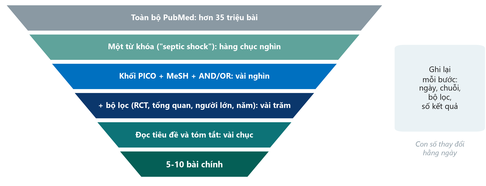{.neu-fig}

::: {.neu-takeaway}
**THÔNG ĐIỆP CHÍNH** Tìm kiếm tốt bắt đầu rộng, thu hẹp từng bước và được ghi lại.
:::

::: {.notes}
Đi xuống theo phễu: toàn bộ PubMed, một từ khóa, các khối PICO có cấu trúc, bộ lọc, người đọc sàng lọc, còn lại vài bài chính.

Các con số chỉ là bậc độ lớn - thay đổi hằng ngày.

Ý chính: hai bước cuối do con người đọc, không phải máy tính.

Hỏi cả lớp: 'Vì sao phải ghi ngày và chuỗi tìm kiếm?' Mong đợi: để lặp lại được - tạp chí và người phản biện sẽ yêu cầu.

Thời gian: 3 phút.
:::

## Từ PICO đến các khối tìm kiếm

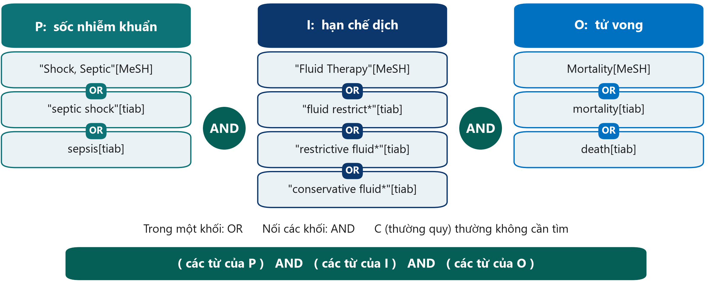{.neu-fig}

::: {.neu-takeaway}
**THÔNG ĐIỆP CHÍNH** Mỗi khái niệm PICO một khối: OR trong khối, AND giữa các khối.
:::

::: {.notes}
Chuyển mỗi thành phần PICO thành một khối khái niệm: thuật ngữ MeSH cộng với từ tự do.

\[tiab\] = tiêu đề và tóm tắt. Dấu sao (\*) là cắt cụt (truncation): restrictive fluid\* tìm cả 'restrictive fluids'.

Nhóm so sánh (thường quy) thường bỏ ra - cách viết quá đa dạng.

Lưu ý: PubMed là cơ sở dữ liệu tiếng Anh - luôn tìm bằng thuật ngữ tiếng Anh.

Quan niệm sai: 'cứ gõ cả câu hỏi vào PubMed'. Bạn mất kiểm soát từ đồng nghĩa và logic.

Hỏi cả lớp: 'Tác giả còn dùng từ nào cho restrictive?' Mong đợi: conservative, limited, de-resuscitation, fluid removal, negative fluid balance.

Thời gian: 4 phút.
:::

## Ví dụ mẫu 2: một câu hỏi tại khoa

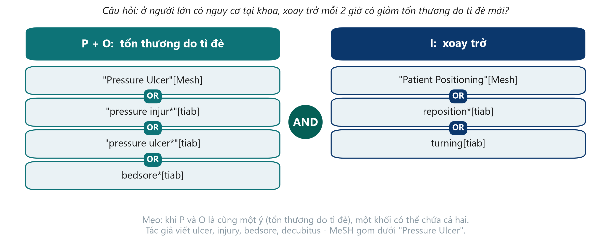{.neu-fig}

::: {.neu-takeaway}
**THÔNG ĐIỆP CHÍNH** Cùng một cách cho mọi chủ đề: khái niệm thành khối, từ đồng nghĩa nối bằng OR, các khối nối bằng AND.
:::

::: {.notes}
Ví dụ mẫu thứ hai, từ khoa phòng, để điều dưỡng và dược sĩ thấy phương pháp dùng được ngoài ICU.

Câu hỏi: ở người lớn có nguy cơ tại khoa, xoay trở mỗi 2 giờ có giảm tổn thương do tì đè mới không?

Ở đây P và O cùng một ý - tổn thương do tì đè - nên một khối chứa cả hai. Khối thứ hai là can thiệp.

MeSH: tác giả viết pressure ulcer, pressure injury, bedsore, decubitus - đề mục MeSH 'Pressure Ulcer' gom tất cả.

Hỏi cả lớp: 'Tác giả còn dùng từ nào cho xoay trở?' Mong đợi: turning, position change, mobilisation, offloading.

Thời gian: 4 phút.
:::

## Logic Boolean bằng hình ảnh

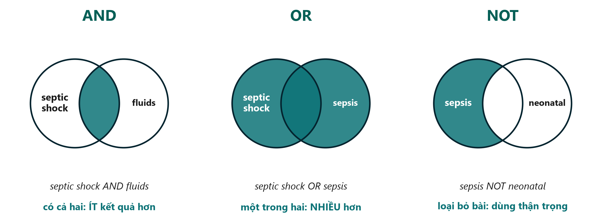{.neu-fig}

::: {.neu-takeaway}
**THÔNG ĐIỆP CHÍNH** AND thu hẹp, OR mở rộng, NOT loại bỏ - hạn chế dùng NOT.
:::

::: {.notes}
AND: chỉ bài có cả hai khái niệm - ít kết quả hơn. OR: một trong hai từ - nhiều hơn; dùng cho từ đồng nghĩa.

NOT loại mọi bài có nhắc từ thứ hai - kể cả bài tốt chỉ nhắc trẻ sơ sinh một lần. Vì vậy NOT rủi ro.

Mẹo: toán tử viết HOA; dấu ngoặc quyết định thứ tự.

Hỏi cả lớp: 'septic shock AND fluids so với septic shock OR fluids - cái nào nhiều kết quả hơn?' Mong đợi: OR.

Thời gian: 3 phút.
:::

## Kiểm tra hiểu bài: AND, OR hay NOT?

::: {.neu-banner style="--c:#6C3483"}
CÂU HỎI NHANH · 2 phút
:::

::: {.neu-activity-steps style="--c:#6C3483"}
1. Bạn muốn bài có CẢ mê sảng VÀ gãy cổ xương đùi: dùng toán tử nào?
2. Bạn muốn bài dùng HOẶC 'pressure ulcer' HOẶC 'bedsore': toán tử nào?
3. Tìm kiếm ra 40.000 kết quả. Thêm khối AND thứ ba sẽ nhiều hơn hay ít hơn?
4. Vì sao 'sepsis NOT children' là rủi ro?
:::

::: {.neu-output style="--c:#6C3483"}
**SẢN PHẨM** Trả lời to
:::

::: {.notes}
Đáp án: 1 AND. 2 OR. 3 Ít hơn (AND thu hẹp). 4 Nó loại mọi bài có nhắc trẻ em ở bất kỳ đâu - kể cả nghiên cứu tốt ở người lớn chỉ nhắc trẻ em một lần.

Thời gian: 2 phút.
:::

## MeSH: nhãn chung cho nhiều cách viết

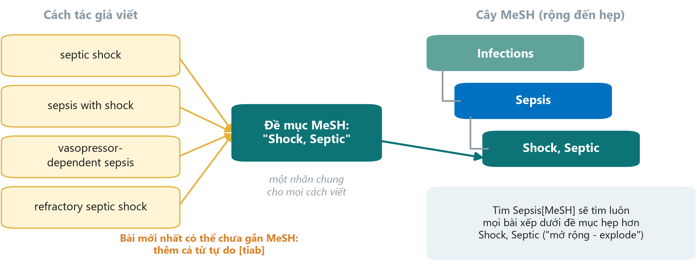{.neu-fig}

::: {.neu-takeaway}
**THÔNG ĐIỆP CHÍNH** Tìm cả thuật ngữ MeSH VÀ từ tự do, nối với nhau bằng OR.
:::

::: {.notes}
MeSH (Medical Subject Headings - Đề mục chủ đề y học) là bộ từ vựng chuẩn của Thư viện Y khoa Quốc gia Hoa Kỳ. Mỗi bài MEDLINE được gắn thuật ngữ MeSH, bất kể tác giả dùng từ gì.

Tìm một thuật ngữ MeSH sẽ gồm luôn các thuật ngữ hẹp hơn bên dưới ('explode' - mở rộng) - Sepsis\[MeSH\] bao gồm Shock, Septic.

Bài mới nhất có thể chưa được gắn MeSH, nên luôn thêm từ tự do \[tiab\].

Hỏi cả lớp: 'MeSH giúp gì cho điều dưỡng tìm về tổn thương do tì đè?' Mong đợi: tác giả viết pressure ulcer, bedsore, decubitus ulcer - MeSH gom dưới một đề mục.

Thời gian: 3 phút.
:::

## Bốn công cụ giúp tìm chính xác hơn

:::: {.neu-cards style="--n:4"}
::: {.neu-card .plain style="--c:#0D7377"}
["Ngoặc kép"]{.neu-card-title}

- "septic shock"
- = đúng cụm từ,
- không phải hai từ rời
:::
::: {.neu-card .plain style="--c:#0B376C"}
[Cắt cụt \*]{.neu-card-title}

- restrict\*
- = restrict, restricted,
- restriction, restrictive
:::
::: {.neu-card .plain style="--c:#5FA39B"}
[Thẻ trường]{.neu-card-title}

- \[tiab\] tiêu đề/tóm tắt
- \[mh\] thuật ngữ MeSH
- \[pt\] loại bài báo
:::
::: {.neu-card .plain style="--c:#0070C0"}
[Bộ lọc]{.neu-card-title}

- Loại bài (RCT,
- tổng quan hệ thống)
- Năm, tuổi, người
:::
::::

::: {.neu-takeaway}
**THÔNG ĐIỆP CHÍNH** Xem 'Search details' để biết chính xác PubMed đã tìm gì.
:::

::: {.notes}
Ngoặc kép giữ nguyên cụm từ. Cắt cụt tìm mọi đuôi từ - nhưng gốc quá ngắn (flu\*) sẽ ra cả influenza và fluoride.

Thẻ trường giới hạn nơi PubMed tìm; bộ lọc (bên trái trang kết quả) thu hẹp theo loại bài, năm, tuổi. Mỗi bộ lọc cần lý do ghi lại được.

Quan niệm sai: 'lọc lấy toàn văn miễn phí'. Làm vậy bỏ mất bài quan trọng.

Thời gian: 3 phút.
:::

## PubMed và Google Scholar

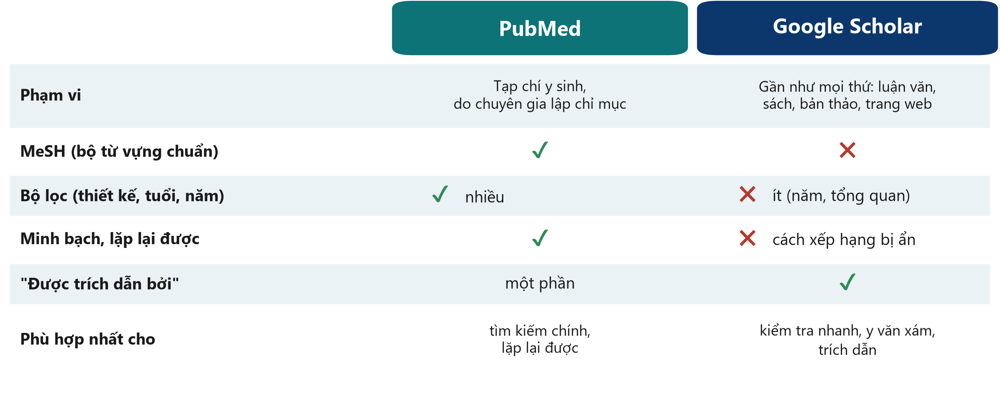{.neu-fig}

::: {.neu-takeaway}
**THÔNG ĐIỆP CHÍNH** PubMed cho tìm kiếm chính; Google Scholar để kiểm tra và theo dấu trích dẫn.
:::

::: {.notes}
PubMed: miễn phí, do Thư viện Y khoa Quốc gia Hoa Kỳ vận hành, tạp chí y sinh, MeSH, nhiều bộ lọc, tìm kiếm minh bạch, lặp lại được.

Google Scholar: rất rộng (luận văn, sách, bản thảo trước in), tốt cho y văn xám và 'Cited by'; nhưng xếp hạng bị ẩn, ít bộ lọc, khó lặp lại.

Còn các cơ sở dữ liệu khác (Embase, CINAHL cho điều dưỡng, Thư viện Cochrane) - không cần ở Cấp độ 1.

Hỏi cả lớp: 'Đồng nghiệp tìm được bài hoàn hảo trên Google Scholar - cần kiểm tra gì?' Mong đợi: đã bình duyệt chưa hay chỉ là preprint? tạp chí có uy tín không? (tạp chí săn mồi - Buổi 8).

Thời gian: 3 phút.
:::

## Trình diễn: tìm câu hỏi của chúng ta trên PubMed

::: {.neu-banner style="--c:#B5651D"}
TRÌNH DIỄN TRỰC TIẾP · 10 phút
:::

:::: {.columns}
::: {.column width="60%"}
::: {.neu-activity-steps style="--c:#B5651D"}
1. Tìm một từ khóa: septic shock - ghi lại số kết quả
2. Dán chuỗi PICO đầy đủ: khối P, I và O nối bằng AND
3. Xem 'Search details': PubMed thực sự đã tìm gì?
4. Thêm bộ lọc: RCT và tổng quan hệ thống, người lớn, 10 năm gần đây
5. Mở một kết quả: tóm tắt, MeSH, 'Similar articles', 'Cited by'
6. Send to - Citation manager (sẽ nhập vào ở phần 2.2)
:::
:::
::: {.column width="40%"}
::: {.neu-side .plain style="--c:#B5651D"}
Hãy để ý

- Số kết quả giảm thế nào sau mỗi bước
- Bài nào cứ xuất hiện lại
- Bạn có tìm thấy Bài báo 1 và CLASSIC?
:::
:::
::::

::: {.neu-output style="--c:#B5651D"}
**SẢN PHẨM** Một chuỗi tìm kiếm cả lớp có thể chép lại (Bài tập 1 trong phiếu)
:::

::: {.notes}
Làm theo Course/Demos/s2\_demo.md, Phần A (PubMed) - chuỗi tìm kiếm chính xác, chỗ cần bấm và phương án dự phòng.

Không hứa số kết quả. Dự kiến hàng chục nghìn cho 'septic shock' và vài nghìn cho chuỗi PICO đầy đủ; con số thay đổi hằng ngày.

Nói chậm và dừng sau mỗi bước để học viên ghi số kết quả vào phiếu.

Nếu mất internet, chuyển sang ảnh chụp màn hình - không sửa lỗi mạng trước lớp.

Thời gian: 10 phút.
:::

## Đến lượt bạn: xây chuỗi tìm kiếm Boolean

::: {.neu-banner style="--c:#0B376C"}
BÀI TẬP CÁ NHÂN · 5 phút
:::

::: {.neu-activity-steps style="--c:#0B376C"}
1. Lấy câu hỏi PICO của nhóm và danh sách từ đồng nghĩa
2. Bài tập 1: viết 2-4 từ đồng nghĩa (tiếng Anh) cho P, I (hoặc E) và O
3. Nối từ đồng nghĩa bằng OR trong ngoặc, các khối bằng AND
4. Đánh dấu từ nào có thể là thuật ngữ MeSH
5. Đổi phiếu với người bên cạnh: tìm một từ đồng nghĩa còn thiếu
:::

::: {.neu-output style="--c:#0B376C"}
**SẢN PHẨM** Một chuỗi tìm kiếm trên giấy - nhóm chạy nó trong Xây dựng đề cương 2
:::

::: {.notes}
Không cần máy tính - bài tập trên giấy với bảng xây dựng tìm kiếm Boolean.

Đi vòng và tìm: thiếu ngoặc, trộn AND và OR trong cùng khối, đưa nhóm so sánh thành một khối, dùng NOT không có lý do.

Ai xong sớm: thêm một bộ lọc và ghi lý do.

Thời gian: 5 phút. Phần 2.1 kết thúc lúc 0:50.
:::

## 2.2  Quản lý và trích dẫn

:::: {.neu-statement}
::: {.neu-big}
Giữ lại mọi tài liệu bạn tìm được - và dùng công trình của người khác một cách trung thực.
:::

::: {.neu-sub}
20 phút: phần mềm quản lý tài liệu (trình diễn Zotero), kiểu trích dẫn, diễn đạt lại an toàn, y văn xám
:::
::::

::: {.notes}
PHẦN 2.2 (0:50-1:10).

Ý chính: hai thói quen bảo vệ mọi đề cương và bài báo - lưu tài liệu vào phần mềm quản lý tài liệu ngay từ ngày đầu, và không bao giờ sao chép câu chữ từ nguồn.

Thời gian: 30 giây.
:::

## Phần mềm quản lý tài liệu: lưu ngay khi tìm

:::: {.neu-steps}
::: {.neu-step style="--c:#0D7377"}
[1]{.neu-step-num}[Gom]{.neu-step-label}

- Đánh dấu bài trên
- PubMed: Clipboard
- hoặc Collections
:::
::: {.neu-step style="--c:#0B376C"}
[2]{.neu-step-num}[Xuất]{.neu-step-label}

- Send to:
- Citation manager
- (tệp .nbib)
:::
::: {.neu-step style="--c:#5FA39B"}
[3]{.neu-step-num}[Nhập]{.neu-step-label}

- Zotero hoặc Mendeley
- (miễn phí), EndNote
- (trả phí)
:::
::: {.neu-step style="--c:#0070C0"}
[4]{.neu-step-num}[Trích dẫn]{.neu-step-label}

- Chèn trích dẫn
- trong Word bằng
- plug-in
:::
::: {.neu-step style="--c:#055F56"}
[5]{.neu-step-num}[Danh mục]{.neu-step-label}

- Danh mục tài liệu
- tự động, theo
- mọi kiểu trích dẫn
:::
::::

::: {.neu-takeaway}
**THÔNG ĐIỆP CHÍNH** Phần mềm quản lý tài liệu ngăn lỗi phổ biến nhất trong đề cương: trích dẫn sai.
:::

::: {.notes}
Ý chính: không bao giờ gõ tay tài liệu tham khảo. Phần mềm quản lý tài liệu lưu mỗi bài một lần và định dạng theo mọi kiểu tạp chí.

Zotero (miễn phí, mã nguồn mở) và Mendeley (miễn phí) tích hợp với Word; EndNote phổ biến ở đại học nhưng trả phí. Phần mềm tốt nhất là phần mềm cả nhóm cùng dùng.

Tiện ích trình duyệt (ví dụ Zotero Connector) lưu bài từ trang tạp chí bằng một cú nhấp, thường kèm PDF.

Quan niệm sai: 'cuối cùng mới xử lý tài liệu tham khảo'. Lưu ngay mất vài giây; dựng lại danh mục mất hàng giờ và dễ sai.

Thời gian: 2 phút.
:::

## Trình diễn: từ PubMed sang Zotero đến Word

::: {.neu-banner style="--c:#B5651D"}
TRÌNH DIỄN TRỰC TIẾP · 5 phút
:::

:::: {.columns}
::: {.column width="60%"}
::: {.neu-activity-steps style="--c:#B5651D"}
1. Nhập tệp .nbib từ phần trình diễn PubMed vào Zotero
2. Xem: tác giả, tiêu đề, tạp chí, năm, DOI - không gõ tay gì cả
3. Trong Word: thẻ Zotero - Add/Edit Citation - gõ 'Meyhoff'
4. Add/Edit Bibliography - danh mục tài liệu xuất hiện
5. Document Preferences: đổi Vancouver sang APA rồi đổi lại
:::
:::
::: {.column width="40%"}
::: {.neu-side .plain style="--c:#B5651D"}
Hãy để ý

- \[1\] thành (Meyhoff et al., 2022)
- Danh mục tự định dạng lại
:::
:::
::::

::: {.neu-output style="--c:#B5651D"}
**SẢN PHẨM** Mọi người đã thấy trọn chu trình gom - trích dẫn - danh mục
:::

::: {.notes}
Làm theo Course/Demos/s2\_demo.md, Phần B (Zotero).

Chuẩn bị: Zotero desktop và plug-in Word đã cài, một thư viện thử trống, một tài liệu Word trắng.

Học viên không cài gì trong buổi học; ai đã cài Zotero ở nhà có thể làm theo.

Nếu Zotero lỗi, dùng ảnh chụp màn hình và nói 'cùng tệp này dùng được trong Mendeley và EndNote'.

Thời gian: 5 phút.
:::

## Kiểu trích dẫn: một bài, hai cách trình bày

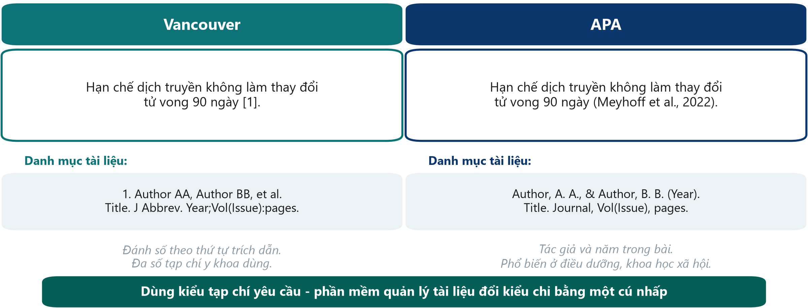{.neu-fig}

::: {.neu-takeaway}
**THÔNG ĐIỆP CHÍNH** Chọn kiểu tạp chí đích dùng; để phần mềm lo việc định dạng.
:::

::: {.notes}
Vancouver (đánh số theo thứ tự trích dẫn) được đa số tạp chí y khoa dùng và theo khuyến nghị ICMJE. APA (tác giả và năm) phổ biến ở điều dưỡng, tâm lý và khoa học xã hội.

Mỗi tạp chí nêu kiểu trích dẫn trong 'Hướng dẫn cho tác giả' (Guide for authors). Phần mềm quản lý tài liệu đổi giữa hàng nghìn kiểu bằng một cú nhấp.

Ý chính: trích dẫn giúp người đọc kiểm tra nhận định của bạn. Khi có thể, hãy trích nghiên cứu gốc cho dữ kiện và con số, không trích bài tổng quan nhắc lại nó.

Hỏi cả lớp: 'Kiểu nào dùng \[1\]?' Mong đợi: Vancouver.

Thời gian: 2 phút.
:::

## Trích dẫn và sao chép: diễn đạt lại an toàn

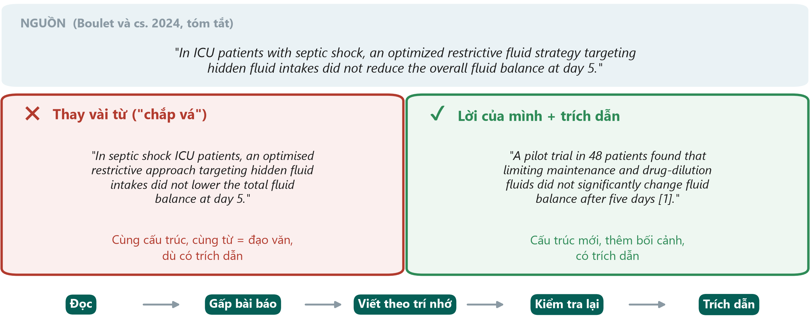{.neu-fig}

::: {.neu-takeaway}
**THÔNG ĐIỆP CHÍNH** Thay đổi cấu trúc, không chỉ thay từ - và luôn trích dẫn nguồn.
:::

::: {.notes}
Trên cùng: một câu trong phần kết luận của tóm tắt Bài báo 1 (trích nguyên văn có ghi nguồn). Câu ví dụ để nguyên tiếng Anh vì đạo văn được kiểm tra trên ngôn ngữ của bài báo.

Bên trái: 'viết chắp vá' (patchwriting) - cùng câu đó chỉ thay vài từ. Dù có trích dẫn, đây vẫn là đạo văn vì cấu trúc và phần lớn từ ngữ bị sao chép. Phần mềm kiểm tra trùng lặp của tạp chí phát hiện dễ dàng.

Bên phải: diễn đạt lại thật sự - cấu trúc mới, thêm bối cảnh từ bài báo (pilot, 48 bệnh nhân, loại dịch nào) và có trích dẫn.

Cách làm: đọc, gấp bài báo, viết theo trí nhớ, kiểm tra lại dữ kiện, trích dẫn. Nếu cần nguyên văn, dùng ngoặc kép kèm trích dẫn - nhưng trong viết y khoa hiếm khi trích nguyên văn.

Quan niệm sai: 'đã trích dẫn thì được chép'. Trích dẫn ghi công cho ý tưởng; không cho phép chép câu chữ. Công cụ AI viết lại câu cũng không giải quyết được - bạn vẫn chịu trách nhiệm (Buổi 7).

Hỏi cả lớp: 'Chép phần Phương pháp từ bài báo cũ của chính mình có được không?' Mong đợi: đó là tái sử dụng văn bản - xem chính sách của tạp chí; thường phải viết lại hoặc trích dẫn.

Thời gian: 3 phút. Bài tập 2 trong phiếu luyện kỹ năng này ở nhà.
:::

## Bốn quy tắc trích dẫn an toàn

:::: {.neu-cards style="--n:4"}
::: {.neu-card .plain style="--c:#0D7377"}
[Trích dữ kiện]{.neu-card-title}

- Con số, phát hiện
- và ý tưởng của người
- khác cần trích dẫn
:::
::: {.neu-card .plain style="--c:#0B376C"}
[Trích nguồn gốc]{.neu-card-title}

- Đọc và trích
- bài báo gốc,
- không trích bản tóm lược
:::
::: {.neu-card .plain style="--c:#5FA39B"}
[Lời của mình]{.neu-card-title}

- Cấu trúc mới;
- nguyên văn phải
- có ngoặc kép
:::
::: {.neu-card .plain style="--c:#0070C0"}
[Kiểm tra]{.neu-card-title}

- Mỗi tài liệu
- nói đúng điều
- bạn dẫn ra
:::
::::

::: {.neu-takeaway}
**THÔNG ĐIỆP CHÍNH** Không bao giờ trích dẫn một bài báo bạn chưa đọc.
:::

::: {.notes}
Kiến thức phổ thông ('nhiễm khuẩn huyết là một cấp cứu') không cần trích dẫn; dữ kiện và con số cụ thể thì cần.

Trích một bài chỉ thấy được nhắc lại ở nơi khác sẽ lan truyền lỗi - hãy kiểm tra bài gốc.

Công cụ trò chuyện AI có thể bịa ra tài liệu tham khảo trông như thật. Mọi tài liệu phải tìm được trên PubMed hoặc trang tạp chí.

Thời gian: 1 phút.
:::

## Kiểm tra hiểu bài: được hay không được?

::: {.neu-banner style="--c:#6C3483"}
CÂU HỎI NHANH · 2 phút
:::

::: {.neu-activity-steps style="--c:#6C3483"}
1. Bạn chép một câu từ tóm tắt, đổi hai từ và thêm \[3\]
2. Bạn trích nguyên văn một câu, trong ngoặc kép, có \[3\]
3. Bạn viết một phát hiện bằng lời của mình nhưng quên trích dẫn
4. Bạn trích dẫn một bài thấy được nhắc trong bài tổng quan, mà không đọc
:::

::: {.neu-output style="--c:#6C3483"}
**SẢN PHẨM** Giơ ngón cái lên (được) hoặc xuống (không được)
:::

::: {.notes}
Đáp án: 1 Không được - viết chắp vá là đạo văn dù có trích dẫn. 2 Được (nhưng hiếm trong viết y khoa). 3 Không được - phát hiện của người khác cần trích dẫn. 4 Không được - có thể lặp lại lỗi; hãy đọc và trích bài gốc.

Thời gian: 2 phút.
:::

## Y văn xám và sổ đăng ký thử nghiệm

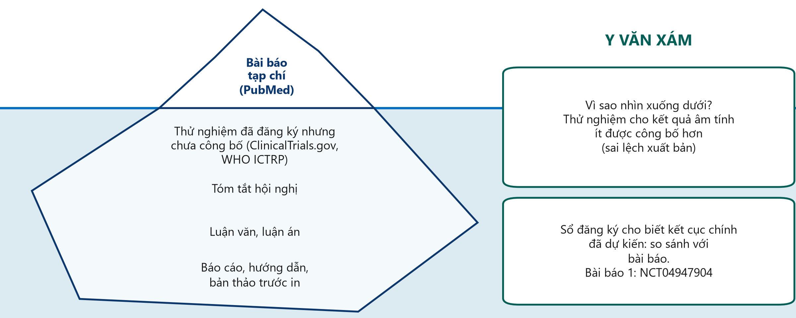{.neu-fig}

::: {.neu-takeaway}
**THÔNG ĐIỆP CHÍNH** Hãy nhìn dưới mặt nước: sổ đăng ký và y văn xám giảm sai lệch xuất bản.
:::

::: {.notes}
Bài báo tạp chí trên PubMed chỉ là phần nổi của tảng băng. Dưới mặt nước: thử nghiệm đã đăng ký nhưng chưa công bố kết quả, tóm tắt hội nghị, luận văn, báo cáo, hướng dẫn và bản thảo trước in (preprint).

Vì sao quan trọng: nghiên cứu có kết quả âm tính hoặc gây thất vọng ít được công bố hơn (sai lệch xuất bản - publication bias), nên y văn đã công bố có thể trông tích cực hơn sự thật.

Sổ đăng ký thử nghiệm - ClinicalTrials.gov và Nền tảng Đăng ký Thử nghiệm Lâm sàng Quốc tế của WHO (ICTRP) - liệt kê các thử nghiệm đang và đã làm kèm kết cục chính DỰ KIẾN. Hãy so sánh với bài báo: đổi kết cục là dấu hiệu cảnh báo.

Bài báo 1 được đăng ký số NCT04947904, trước khi tuyển bệnh nhân đầu tiên. Thói quen tốt khi làm bài về nhà: mở hồ sơ đăng ký và so sánh kết cục chính dự kiến với bài báo.

Bản thảo trước in (ví dụ medRxiv) chưa qua bình duyệt - đọc thật cẩn thận.

Hỏi cả lớp: 'Vì sao nên xem sổ đăng ký trước khi bắt đầu thử nghiệm của mình?' Mong đợi: có thể ai đó đang làm đúng nghiên cứu đó.

Thời gian: 3 phút. Phần 2.2 kết thúc lúc 1:10 - giải lao.
:::

## Giải lao

::: {.neu-banner style="--c:#8A99A3"}
GIẢI LAO · 15 phút
:::

::: {.neu-activity-steps style="--c:#8A99A3"}
1. Thư giãn, uống cà phê, trò chuyện với người khác nghề
2. Suy nghĩ: nhóm bạn có thể làm vấn đề nào từ khoa mình hôm nay?
:::

::: {.notes}
GIẢI LAO (1:10-1:25).

Trong giờ giải lao: đặt bản in tóm tắt Bài báo 1 (bản gốc, không chú giải) lên mỗi chỗ ngồi cho bài tập đọc.

Bắt đầu lại đúng giờ - nói rõ giờ quay lại.
:::

## 2.3  Đọc một bài báo trong 15 phút

:::: {.neu-statement}
::: {.neu-big}
Không cần đọc từng chữ - cần đọc đúng chỗ, theo đúng thứ tự.
:::

::: {.neu-sub}
40 phút: cấu trúc bài báo, thứ tự đọc, phần tóm tắt, thổi phồng - và bài tập đọc Bài báo 1
:::
::::

::: {.notes}
PHẦN 2.3 (1:25-2:05).

Ý chính: người thầy thuốc bận rộn cần một quy trình đọc. Trong 15 phút có thể quyết định bài báo có liên quan không, tìm thấy gì và có đáng tin không.

Kiểm tra mọi học viên đã có bản in tóm tắt Bài báo 1 trước bài tập.

Thời gian: 30 giây.
:::

## Cấu trúc bài báo: IMRaD

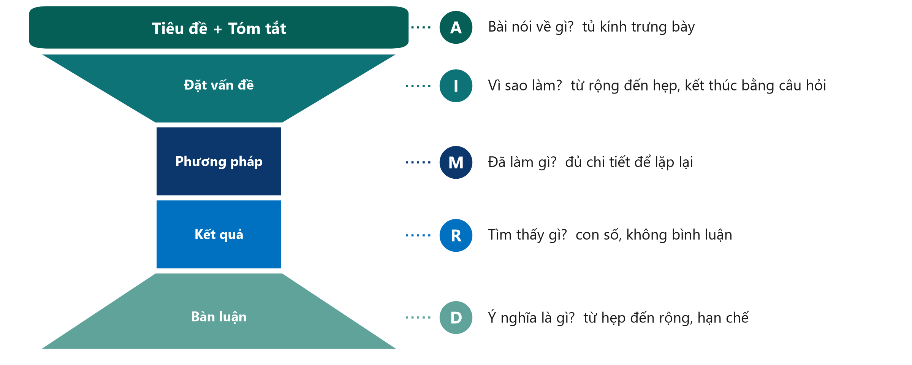{.neu-fig}

::: {.neu-takeaway}
**THÔNG ĐIỆP CHÍNH** Mọi bài báo gốc có cùng hình dạng: vì sao, làm gì, thấy gì, ý nghĩa gì.
:::

::: {.notes}
IMRaD = Đặt vấn đề (Introduction), Phương pháp (Methods), Kết quả (Results) và Bàn luận (Discussion) - cấu trúc chuẩn của bài báo nghiên cứu gốc, với tiêu đề và tóm tắt ở trên cùng.

Đồng hồ cát: Đặt vấn đề thu hẹp từ vấn đề rộng đến câu hỏi cụ thể; Phương pháp và Kết quả hẹp và thuần dữ kiện; Bàn luận mở rộng lại tới ý nghĩa cho thực hành.

Ý chính: biết hình dạng là biết chỗ cần nhìn. Câu hỏi ở CUỐI phần Đặt vấn đề; kết cục chính ở Phương pháp; con số chính ở Kết quả (và tóm tắt).

Quan niệm sai: 'phần Bàn luận cho biết kết quả'. Bàn luận là diễn giải của tác giả; Kết quả mới là bằng chứng.

Hỏi cả lớp: 'Tìm ai được đưa vào nghiên cứu ở đâu?' Mong đợi: Phương pháp (tiêu chuẩn chọn) và Kết quả (sơ đồ, Bảng 1).

Thời gian: 4 phút. Buổi 7 và 8 dạy cách VIẾT từng phần.
:::

## Thứ tự đọc trong 15 phút

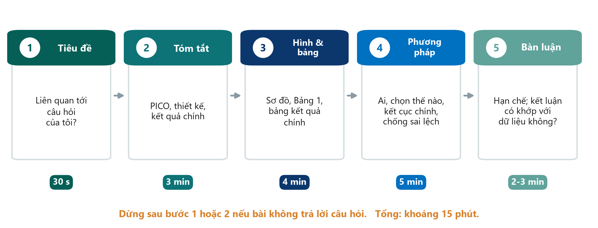{.neu-fig}

::: {.neu-takeaway}
**THÔNG ĐIỆP CHÍNH** Tiêu đề, tóm tắt, hình và bảng, phương pháp - dừng sớm nếu không liên quan.
:::

::: {.notes}
Đừng đọc từ đầu đến cuối. Bước 1, tiêu đề (30 giây): có liên quan đến câu hỏi của tôi? Bước 2, tóm tắt (3 phút): PICO, thiết kế, kết quả chính. Đa số bài bị loại ở đây.

Bước 3, hình và bảng (4 phút): sơ đồ tuyển chọn (mất ai), Bảng 1 (các nhóm có tương đồng không), bảng kết quả chính.

Bước 4, phương pháp (5 phút): ai, chọn thế nào, kết cục chính, chống sai lệch ra sao. Bước 5, bàn luận (2-3 phút): hạn chế, và kết luận có khớp với dữ liệu không?

Ý chính: chỉ đọc toàn bộ Đặt vấn đề và Bàn luận với bài sẽ trích dẫn hoặc thẩm định sâu.

Quan niệm sai: 'chỉ đọc tóm tắt là đủ'. Tóm tắt bỏ qua hạn chế và có thể bị thổi phồng (các slide tiếp).

Thời gian: 3 phút.
:::

## Phần tóm tắt phải có gì

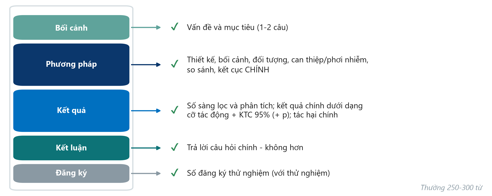{.neu-fig}

::: {.neu-takeaway}
**THÔNG ĐIỆP CHÍNH** Tóm tắt tốt giúp bạn viết PICO và kết quả chính mà không cần mở bài báo.
:::

::: {.notes}
Đa số tạp chí lâm sàng yêu cầu tóm tắt có cấu trúc: Bối cảnh, Phương pháp, Kết quả, Kết luận (cộng số đăng ký với thử nghiệm).

Phương pháp phải nêu thiết kế, bối cảnh, đối tượng, can thiệp hoặc phơi nhiễm, so sánh và kết cục CHÍNH.

Kết quả phải có số sàng lọc và phân tích, và kết quả chính dưới dạng cỡ tác động kèm khoảng tin cậy (KTC) 95% - không chỉ giá trị p hay chữ 'có ý nghĩa'.

Kết luận trả lời câu hỏi chính - không hơn, không kém. Các hướng dẫn báo cáo có bảng kiểm cho tóm tắt (CONSORT for Abstracts, STROBE) - Buổi 8.

Hỏi cả lớp: 'Tóm tắt chỉ viết: tử vong thấp hơn có ý nghĩa (p \< 0,05). Thiếu gì?' Mong đợi: tỷ lệ thực tế, cỡ tác động và khoảng tin cậy.

Thời gian: 3 phút.
:::

## Một câu kết quả: kém và tốt

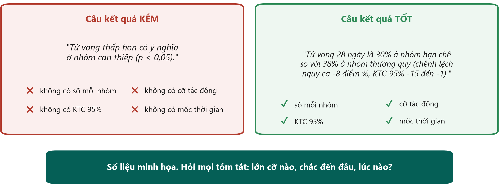{.neu-fig}

::: {.neu-takeaway}
**THÔNG ĐIỆP CHÍNH** Mỗi kết quả chính cần: số mỗi nhóm, cỡ tác động, KTC 95% và mốc thời gian.
:::

::: {.notes}
Ví dụ mẫu (số liệu minh họa, không từ thử nghiệm thật).

Bên trái: 'thấp hơn có ý nghĩa (p \< 0,05)' không cho biết khác biệt lớn cỡ nào, chắc chắn đến đâu, hay đo lúc nào.

Bên phải: tỷ lệ mỗi nhóm, độ lớn khác biệt (8 điểm phần trăm), khoảng tin cậy (KTC) 95% và mốc thời gian (28 ngày). Người đọc có thể đánh giá khác biệt có ý nghĩa lâm sàng không.

Ý chính: 'lớn cỡ nào, chắc đến đâu, lúc nào?' - hỏi ba câu này với mọi kết quả bạn đọc. Khoảng tin cậy được giải thích kỹ ở Buổi 6.

Hỏi cả lớp: 'Câu nào đủ tin cậy để thay đổi thực hành?' Mong đợi: câu bên phải - thấy được độ lớn và độ không chắc chắn.

Thời gian: 3 phút.
:::

## Thổi phồng (spin): khi lời văn vượt quá dữ liệu

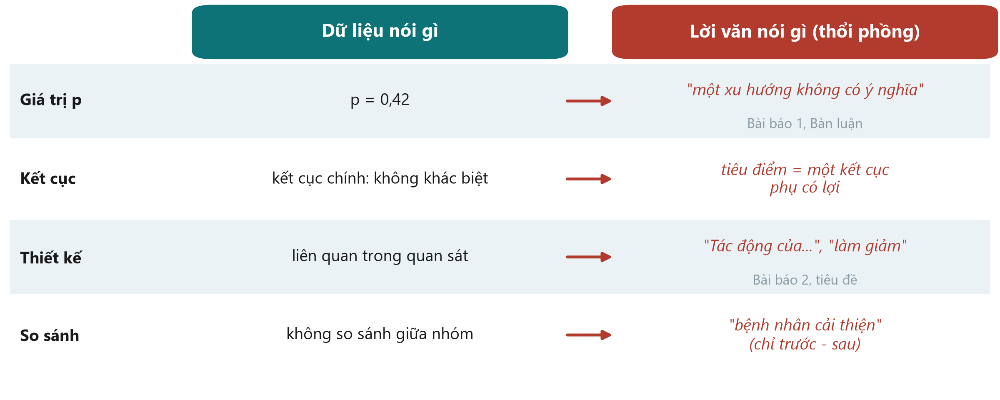{.neu-fig}

::: {.neu-takeaway}
**THÔNG ĐIỆP CHÍNH** Đọc con số trước, rồi kiểm tra lời văn có khớp với chúng không.
:::

::: {.notes}
Thổi phồng (spin) = trình bày làm kết quả trông tốt hơn mức dữ liệu cho phép. Hay gặp trong tóm tắt của thử nghiệm có kết cục chính không có ý nghĩa.

Dòng 1: phần Bàn luận của Bài báo 1 gọi p = 0,42 của kết cục chính là 'xu hướng không có ý nghĩa'. p = 0,42 không phải bằng chứng có khác biệt; cách viết đúng là 'không có khác biệt có ý nghĩa; khoảng tin cậy rộng'. Đáng khen là kết luận trong TÓM TẮT của Bài báo 1 không thổi phồng.

Dòng 2: nhấn mạnh một kết cục phụ có lợi khi kết cục chính không cho thấy gì.

Dòng 3: từ ngữ nhân quả cho dữ liệu quan sát - tiêu đề Bài báo 2 viết 'Impact of...' (tác động) dù đoàn hệ chỉ cho thấy liên quan (phần kết luận tóm tắt viết đúng là 'associated').

Dòng 4: tuyên bố cải thiện dựa trên thay đổi trước - sau trong một nhóm, không so sánh giữa các nhóm.

Quan niệm sai: 'bình duyệt loại bỏ hết thổi phồng'. Bình duyệt giảm bớt, nhưng thổi phồng vẫn thường gặp trong bài đã công bố.

Thời gian: 4 phút.
:::

## Kiểm tra hiểu bài: tìm chỗ thổi phồng

::: {.neu-banner style="--c:#6C3483"}
CÂU HỎI NHANH · 3 phút
:::

::: {.neu-activity-steps style="--c:#6C3483"}
1. Một nghiên cứu đoàn hệ: 'Cho ăn sớm LÀM GIẢM viêm phổi ở bệnh nhân đột quỵ'
2. Kết cục chính p = 0,31: 'một xu hướng có lợi đầy hứa hẹn'
3. Kết cục chính không khác biệt; tiêu điểm tóm tắt: 'cải thiện sự hài lòng của bệnh nhân'
4. 'Tử vong giảm từ 30% xuống 22% sau quy trình mới' (không có nhóm chứng)
:::

::: {.neu-output style="--c:#6C3483"}
**SẢN PHẨM** Mỗi câu: thổi phồng ở đâu, và bạn viết lại thế nào?
:::

::: {.notes}
Đáp án: 1 từ nhân quả cho thiết kế quan sát - viết 'có liên quan với viêm phổi thấp hơn'. 2 p = 0,31 không phải bằng chứng có khác biệt - viết 'không có khác biệt có ý nghĩa; KTC rộng'. 3 tiêu điểm là kết cục phụ - nêu kết quả chính trước. 4 thay đổi trước - sau không có nhóm so sánh - các yếu tố khác có thể đã thay đổi; viết 'tử vong thấp hơn sau khi áp dụng; không có nhóm chứng nên không thể quy cho quy trình'.

Thời gian: 3 phút.
:::

## Đến lượt bạn: đọc tóm tắt Bài báo 1

::: {.neu-banner style="--c:#0B376C"}
BÀI TẬP CÁ NHÂN · 12 phút
:::

:::: {.columns}
::: {.column width="60%"}
::: {.neu-activity-steps style="--c:#0B376C"}
1. Lấy phần tóm tắt của Bài báo 1 (Boulet 2024, Crit Care)
2. Điền bảng đọc (Bài tập 3): thiết kế, P, I vs C
3. Kết cục chính, số sàng lọc và số phân tích
4. Kết quả chính kèm KTC 95% và giá trị p
5. Kết luận có khớp với kết quả? Có thổi phồng không?
6. So sánh bảng của bạn với người bên cạnh
:::
:::
::: {.column width="40%"}
::: {.neu-side .plain style="--c:#0B376C"}
Thời gian

- 8 phút đọc
- 4 phút so sánh
:::
:::
::::

::: {.neu-output style="--c:#0B376C"}
**SẢN PHẨM** Một bảng đọc tóm tắt đã điền đủ
:::

::: {.notes}
Làm cá nhân, yên lặng trong 8 phút, rồi 4 phút so sánh với người bên cạnh. Người mới cần thêm thời gian - đừng vội.

Học viên đọc tóm tắt thật từ bản phát tay (Course/Papers - có bản chú giải tiếng Anh và tiếng Việt, nhưng nên dùng tóm tắt gốc không chú giải cho bài tập này).

Đi vòng. Ô khó nhất: kết cục chính (nhiều người ghi 'tử vong' - thực ra là cân bằng dịch tích lũy ngày 5) và kết quả chính (cần chép chênh lệch kèm KTC 95%, -15,2 đến 41,6, cắt qua số 0).

Ai xong sớm: đọc tóm tắt Bài báo 2 và tìm từ trong tiêu đề nói quá so với thiết kế ('Impact').

Thời gian: 12 phút. Đáp án ở slide sau.
:::

## Tóm tắt Bài báo 1: đáp án

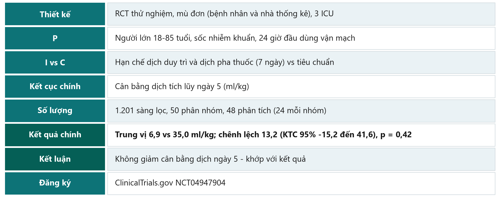{.neu-fig}

::: {.neu-takeaway}
**THÔNG ĐIỆP CHÍNH** Kết cục chính là cân bằng dịch, không phải tử vong - đọc đúng điều nghiên cứu đã đo.
:::

::: {.notes}
Đi nhanh qua bảng; mỗi dòng hỏi một bàn khác nhau.

Điểm chính: (1) thử nghiệm PILOT với 48 bệnh nhân được phân tích; (2) kết cục chính là cân bằng dịch tích lũy ngày 5, không phải tử vong; (3) KTC của chênh lệch (-15,2 đến 41,6 ml/kg) chứa số 0, nên không có bằng chứng khác biệt; (4) kết luận tóm tắt khớp với kết quả - thực hành tốt; (5) thử nghiệm đã được đăng ký.

Nếu có học viên tinh ý hỏi: trung vị (6,9 vs 35,0 ml/kg) chênh nhau nhiều hơn mức chênh lệch được báo cáo 13,2 vì chênh lệch được ước tính theo cách khác - bản chú giải của khóa học có nêu điểm không khớp này. Để dành cho Buổi 6-8.

Liên hệ câu hỏi của ta: thử nghiệm này KHÔNG trả lời câu hỏi tử vong 28 ngày - nó trả lời câu hỏi kiểu khả thi về cân bằng dịch. Đó chính là 'phiên bản khả thi' ở slide FINER.

Thời gian: 5 phút - đi từng dòng. Phần 2.3 kết thúc lúc 2:05.
:::

## 2.4  Từ y văn đến phần đặt vấn đề

:::: {.neu-statement}
::: {.neu-big}
Các bài báo bạn đọc trở thành trang đầu tiên của đề cương.
:::

::: {.neu-sub}
15 phút: bảng ma trận tài liệu, phễu đặt vấn đề, một đoạn đặt vấn đề mẫu, tên đề tài tạm và từ khóa
:::
::::

::: {.notes}
PHẦN 2.4 (2:05-2:20).

Ý chính: đọc chưa phải là xong. Bảng ma trận tài liệu biến các bài báo thành khoảng trống, khoảng trống thành phần đặt vấn đề, và PICO thành tên đề tài tạm.

Thời gian: 30 giây.
:::

## Phiếu tổng quan tài liệu

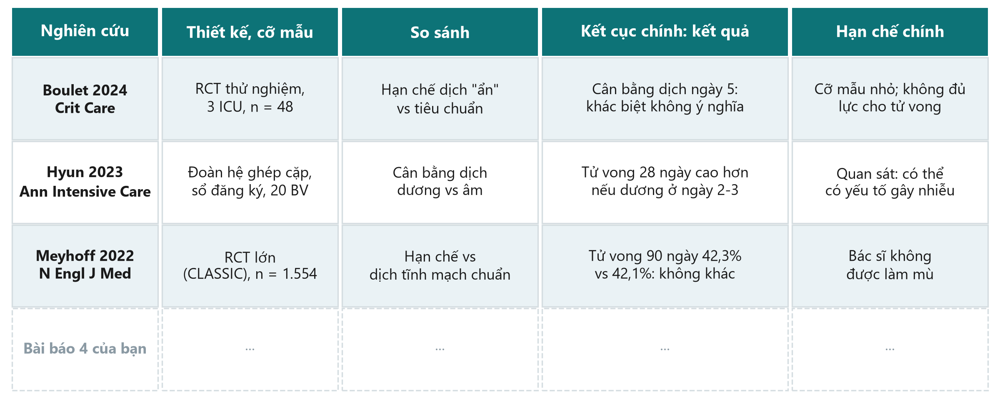{.neu-fig}

::: {.neu-takeaway}
**THÔNG ĐIỆP CHÍNH** Mỗi bài một dòng: hôm nay 5 dòng, mọi bài cùng các cột.
:::

::: {.notes}
Phiếu nằm trong Course/Templates (phiếu tổng quan tài liệu - literature review worksheet). Mỗi bài một dòng, các cột giống nhau.

Dòng 1-3 là các bài của khóa học: Bài báo 1 (Boulet 2024, RCT thử nghiệm - cân bằng dịch, khác biệt không có ý nghĩa), Bài báo 2 (Hyun 2023, đoàn hệ ghép cặp - cân bằng dương ở ngày 2-3 liên quan với tử vong 28 ngày cao hơn), và CLASSIC (Meyhoff 2022 - không khác biệt tử vong 90 ngày).

Lưu ý: ba bài đo kết cục khác nhau ở thời điểm khác nhau - bảng ma trận làm điều này lộ ra ngay.

Ý chính: cột 'hạn chế chính' là nơi khoảng trống - và lý do cho nghiên cứu của bạn - xuất hiện.

Thời gian: 3 phút.
:::

## Từ y văn đến phần Đặt vấn đề

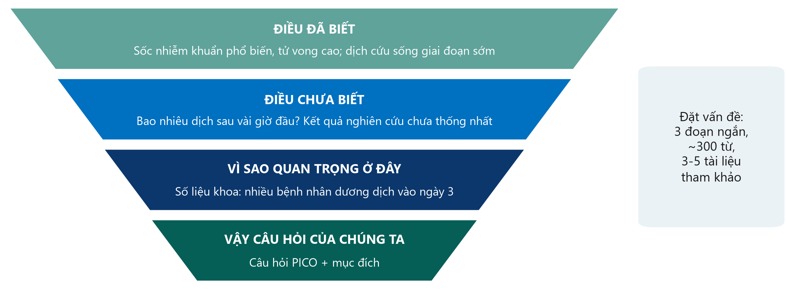{.neu-fig}

::: {.neu-takeaway}
**THÔNG ĐIỆP CHÍNH** Đã biết, chưa biết, vì sao ở đây - rồi câu hỏi tự nhiên xuất hiện.
:::

::: {.notes}
Các bài báo bạn đọc trở thành phần Đặt vấn đề của đề cương - cùng cái phễu như phần trên của đồng hồ cát IMRaD.

Đoạn 1, điều đã biết: quy mô vấn đề và thực hành hiện tại, có trích dẫn.

Đoạn 2, điều chưa biết: khoảng trống - nghiên cứu mâu thuẫn, chưa có nghiên cứu trên bệnh nhân như của ta, kết cục chưa được đo. Cột 'hạn chế' trong bảng ma trận tài liệu nuôi đoạn này.

Đoạn 3, vì sao quan trọng ở đây: số liệu tại chỗ (audit, phân tích sự cố, một con số của khoa). Sau đó nêu câu hỏi và mục đích.

Quan niệm sai: 'phần tổng quan phải điểm lại mọi thứ đã viết'. Phần mở đầu Bài báo 1 đi hết cái phễu trong chưa đến 500 từ.

Thời gian: 3 phút.
:::

## Một đoạn đặt vấn đề mẫu

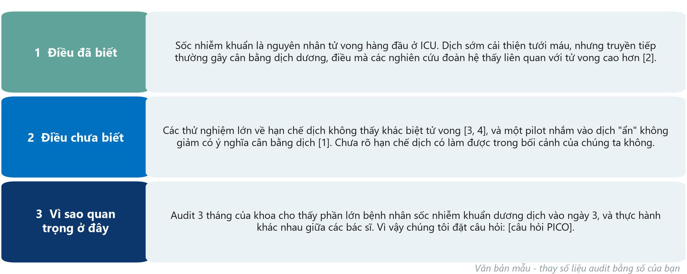{.neu-fig}

::: {.neu-takeaway}
**THÔNG ĐIỆP CHÍNH** Ba đoạn ngắn, mỗi đoạn một nhiệm vụ - và tài liệu tham khảo trong ngoặc.
:::

::: {.notes}
Đây là cái phễu khi viết thành văn bản thật, cho phiên bản khả thi của ví dụ xuyên suốt.

Đoạn 1 (đã biết) trích Bài báo 2. Đoạn 2 (chưa biết) trích CLASSIC, CLOVERS và Bài báo 1, kết thúc bằng khoảng trống. Đoạn 3 (vì sao ở đây) dùng số liệu TẠI CHỖ - thay câu về audit bằng số liệu của bạn - và kết thúc bằng câu hỏi.

Ý chính: mỗi câu nêu dữ kiện đều có số trích dẫn; câu cuối dẫn thẳng vào câu hỏi PICO.

Quan niệm sai: 'phần đặt vấn đề phải dài và ấn tượng'. Khoảng 300 từ là đủ cho một đề cương.

Nhóm có thể viết đề cương bằng tiếng Việt, nhưng tìm kiếm và trích dẫn bằng tiếng Anh.

Thời gian: 4 phút.
:::

## Tên đề tài tạm và từ khóa từ PICO

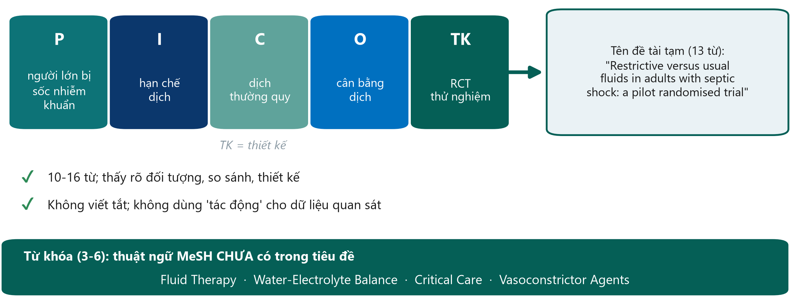{.neu-fig}

::: {.neu-takeaway}
**THÔNG ĐIỆP CHÍNH** PICO đã chứa sẵn tên đề tài: thêm thiết kế và giữ ngắn gọn.
:::

::: {.notes}
Tên tốt nêu đối tượng, can thiệp và so sánh (hoặc phơi nhiễm), và thiết kế - khoảng 10 đến 16 từ.

Ví dụ từ phiên bản khả thi: 'Restrictive versus usual fluids in adults with septic shock: a pilot randomised trial' (13 từ tiếng Anh). Tiếng Việt: 'Hạn chế dịch so với dịch thường quy ở người lớn bị sốc nhiễm khuẩn: thử nghiệm ngẫu nhiên thí điểm'.

Tránh viết tắt và từ quảng cáo hay nhân quả ('tác động', 'mới', 'hiệu quả của') - nhất là với thiết kế quan sát (so sánh tiêu đề Bài báo 2).

Từ khóa: 3 đến 6, tốt nhất là thuật ngữ MeSH CHƯA có trong tiêu đề, để bài được tìm thấy qua nhiều chuỗi tìm kiếm hơn (bản chú giải Bài báo 1 cũng nêu điểm này).

Hỏi cả lớp: 'Dịch truyền ở ICU có phải tên đề tài tốt?' Mong đợi: không - thiếu đối tượng, so sánh và thiết kế.

Thời gian: 4 phút. Phần 2.4 kết thúc lúc 2:20.
:::

## Xây dựng đề cương 2

:::: {.neu-statement}
::: {.neu-big}
Giờ hãy tìm bằng chứng cho nhóm: một chuỗi tìm kiếm, năm bài báo, một đoạn đặt vấn đề, một tên đề tài.
:::

::: {.neu-sub}
35 phút làm việc nhóm - hoàn thành Phần 1 của đề cương nghiên cứu
:::
::::

::: {.notes}
XÂY DỰNG ĐỀ CƯƠNG 2 (2:20-2:55).

Ý chính: mọi điều học hôm nay được áp dụng cho câu hỏi của nhóm từ hôm qua. Đến 2:55 mỗi nhóm có một chuỗi tìm kiếm được ghi lại, ít nhất 3-5 tài liệu trong bảng ma trận, bản nháp đặt vấn đề và tên đề tài tạm.

Đảm bảo mỗi nhóm có laptop hoặc điện thoại cho người tìm kiếm.

Thời gian: 1 phút.
:::

## Xây dựng đề cương 2: bằng chứng của nhóm

::: {.neu-banner style="--c:#055F56"}
XÂY DỰNG ĐỀ CƯƠNG · 33 phút
:::

:::: {.columns}
::: {.column width="60%"}
::: {.neu-activity-steps style="--c:#055F56"}
1. Chạy chuỗi tìm kiếm trên PubMed; ghi ngày và số kết quả
2. Sàng lọc tiêu đề và tóm tắt; chọn 5 bài chính; xuất sang Zotero
3. Điền mỗi bài một dòng trong bảng ma trận tài liệu
4. Viết nháp đặt vấn đề: đã biết - chưa biết - vì sao ở đây
5. Tên đề tài tạm (10-16 từ) + 3-6 từ khóa
6. Một nhóm đọc to tên đề tài và khoảng trống
:::
:::
::: {.column width="40%"}
::: {.neu-side .plain style="--c:#055F56"}
Thời gian

- 0-8 phút: chạy tìm kiếm
- 8-16: sàng lọc + chọn 5 bài
- 16-22: các dòng ma trận
- 22-28: đặt vấn đề
- 28-31: tên đề tài + từ khóa
- 31-33: 1 nhóm đọc to
:::
:::
::::

::: {.neu-output style="--c:#055F56"}
**SẢN PHẨM** Hoàn thành Đề cương Phần 1: tìm kiếm, 5 tài liệu, đặt vấn đề, tên đề tài
:::

::: {.notes}
Vai trò: người tìm kiếm chạy PubMed và xuất tài liệu; thư ký điền bảng ma trận và mẫu; các thành viên khác đọc tóm tắt song song (chia nhau 5 bài).

Giảng viên đi vòng. Lần ghé đầu: chuỗi tìm kiếm có hợp lý không (ngoặc, OR trong khối, AND giữa khối, không có khối so sánh)? Quá nhiều kết quả - thêm khối hoặc bộ lọc; quá ít - thêm từ đồng nghĩa.

Lần ghé thứ hai: phần đặt vấn đề có kết thúc bằng câu hỏi của nhóm không, và đoạn 2 có thật sự nêu khoảng trống không?

Nếu nhóm chưa xong 5 tài liệu, ghi lại chuỗi tìm kiếm, cơ sở dữ liệu và ngày; phần còn lại thành bài về nhà.

Lúc 2:51 (phút thứ 31), dừng; một nhóm đọc to tên đề tài và câu nêu khoảng trống; mời lớp góp một ý cải thiện.

Thế nào là tốt: Course/Solutions/s2\_solutions.md (Bài tập 4).

Thời gian: 33 phút. Tổng kết bắt đầu lúc 2:55.
:::

## Từ khóa của buổi học

| Từ khóa | Trong một câu |
|:---|:---|
| MeSH | Nhãn chung PubMed gán cho nhiều cách viết của một ý |
| AND / OR / NOT | Thu hẹp / mở rộng / loại bỏ - OR trong khối, AND giữa các khối |
| Phần mềm quản lý tài liệu | Lưu mỗi bài một lần và định dạng trích dẫn theo mọi kiểu |
| Viết chắp vá | Chép và đổi vài từ - là đạo văn dù có trích dẫn |
| IMRaD | Đặt vấn đề, Phương pháp, Kết quả và Bàn luận |
| Thổi phồng (spin) | Lời văn khẳng định nhiều hơn những gì con số cho thấy |

::: {.notes}
TỔNG KẾT (2:55-3:00).

Đọc nhanh sáu từ khóa; chúng cũng có trong bảng thuật ngữ của khóa học (Anh-Việt).

Thời gian: 1 phút.
:::

## Ôn tập Buổi 2

:::: {.neu-cards style="--n:3"}
::: {.neu-card .plain style="--c:#0D7377"}
[1. Tìm kiếm]{.neu-card-title}

- Khối PICO, MeSH +
- từ tự do; OR trong khối,
- AND giữa khối; ghi lại
:::
::: {.neu-card .plain style="--c:#0B376C"}
[2. Trích dẫn trung thực]{.neu-card-title}

- Phần mềm quản lý tài
- liệu từ ngày đầu; lời
- của mình; đọc bài mình trích
:::
::: {.neu-card .plain style="--c:#5FA39B"}
[3. Đọc thông minh]{.neu-card-title}

- Tiêu đề, tóm tắt,
- hình bảng, phương pháp;
- con số trước lời văn
:::
::::

::: {.neu-takeaway}
**THÔNG ĐIỆP CHÍNH** Xong cuối tuần 1: nhóm bạn có câu hỏi, năm bài báo và tên đề tài.
:::

::: {.notes}
Đọc ba thông điệp, rồi hỏi một học viên: 'Điều đầu tiên bạn tìm trong phần tóm tắt là gì?' Mong đợi: kết cục chính và kết quả của nó kèm KTC.

Nối sang buổi sau: cuối tuần tới (Buổi 3 và 4) ta chọn THIẾT KẾ phù hợp cho câu hỏi của từng nhóm - và tìm hiểu sai lệch, yếu tố gây nhiễu và các số đo tác động qua hai bài báo về dịch truyền.

Thời gian: 1,5 phút.
:::

## Câu hỏi cuối buổi

::: {.neu-banner style="--c:#6C3483"}
CÂU HỎI NHANH · 2 phút
:::

::: {.neu-activity-steps style="--c:#6C3483"}
1. Chuỗi nào cho NHIỀU kết quả hơn: septic shock AND fluids, hay septic shock OR fluids?
2. Kết cục chính của Bài báo 1 là gì?
3. Viết cả hai câu trả lời lên giấy dán (không cần ghi tên) và dán lên cửa khi ra về
:::

::: {.neu-output style="--c:#6C3483"}
**SẢN PHẨM** Mỗi người một tờ giấy dán (giảng viên đọc trước Buổi 3)
:::

::: {.notes}
Đáp án: câu 1 - OR (một trong hai từ). Câu 2 - cân bằng dịch tích lũy ngày 5 (ml/kg), không phải tử vong.

Đọc các tờ giấy sau buổi học. Nếu hơn một phần tư trả lời sai câu nào, ôn lại trong câu hỏi ôn tập đầu Buổi 3.

Thời gian: 1,5 phút.
:::

## Bài về nhà trước Buổi 3 (cuối tuần tới)

::: {.neu-banner style="--c:#0B376C"}
BÀI TẬP CÁ NHÂN
:::

:::: {.columns}
::: {.column width="60%"}
::: {.neu-activity-steps style="--c:#0B376C"}
1. Nhóm: hoàn thành 5 tài liệu chính và phần đặt vấn đề
2. Mỗi thành viên: đọc một bài (quy trình 15 phút) và điền dòng của bài đó
3. Mọi người: đọc tóm tắt Bài báo 2 (Hyun) với bảng đọc
4. Bài tập 2 (diễn đạt lại) nếu chưa làm trên lớp
5. Không bắt buộc: tra Bài báo 1 (NCT04947904) trên ClinicalTrials.gov
:::
:::
::: {.column width="40%"}
::: {.neu-side .plain style="--c:#0B376C"}
Mang theo cuối tuần tới

- Đề cương Phần 1 (bản in hoặc trên laptop)
- Bảng ma trận tài liệu đã hoàn thành
:::
:::
::::

::: {.neu-output style="--c:#0B376C"}
**SẢN PHẨM** Đề cương Phần 1 hoàn chỉnh trước Buổi 3
:::

::: {.notes}
Nói rõ khối lượng: khoảng 60-90 phút mỗi người trong tuần, chia sẻ trong nhóm.

Hai bài báo nằm trong Course/Papers (có bản chú giải tiếng Anh và tiếng Việt). Buổi 3 dùng cả hai tóm tắt để so sánh RCT với đoàn hệ.

Nhắc các nhóm gửi Phần 1 cho giảng viên nếu khóa học có nhận xét bằng văn bản giữa các cuối tuần.

Kết thúc đúng giờ. Cảm ơn cả lớp.

Thời gian: 1 phút.
:::

---

:::: {.neu-statement}
::: {.neu-big}
Slide bổ sung — Buổi 2
:::

::: {.neu-sub}
Dùng nếu còn thời gian, hoặc để tự học
:::
::::

::: {.notes}
SLIDE BỔ SUNG (Buổi 2).

Mọi slide sau slide này là tùy chọn. Dùng nếu lớp đi nhanh, nếu một nhóm hỏi, hoặc giới thiệu để học viên tự học.

Buổi học chính vẫn trọn vẹn khi không dùng các slide này.
:::

## Ngoài PubMed: những nơi khác để tìm

:::: {.neu-cards style="--n:4"}
::: {.neu-card .plain style="--c:#0D7377"}
[Thư viện Cochrane]{.neu-card-title}

- Tổng quan hệ thống
- và sổ đăng ký
- thử nghiệm
:::
::: {.neu-card .plain style="--c:#0B376C"}
[Embase]{.neu-card-title}

- Cơ sở dữ liệu y sinh
- lớn; mạnh về thuốc
- (cần đăng ký)
:::
::: {.neu-card .plain style="--c:#5FA39B"}
[CINAHL]{.neu-card-title}

- Y văn điều dưỡng
- và các ngành sức khỏe
- (cần đăng ký)
:::
::: {.neu-card .plain style="--c:#0070C0"}
[Sổ đăng ký thử nghiệm]{.neu-card-title}

- ClinicalTrials.gov,
- WHO ICTRP: thử nghiệm
- đang làm, chưa công bố
:::
::::

::: {.neu-takeaway}
**THÔNG ĐIỆP CHÍNH** Với đề cương, PubMed + một sổ đăng ký là đủ; tổng quan hệ thống tìm trên nhiều cơ sở dữ liệu.
:::

::: {.notes}
EXTRA: các cơ sở dữ liệu khác.

Thư viện Cochrane: bắt đầu từ đây với câu hỏi điều trị - một tổng quan hệ thống tốt có thể đã trả lời câu hỏi của bạn.

Embase và CINAHL thường cần tài khoản của cơ sở; hỏi thư viện.

Cơ sở dữ liệu quốc gia và khu vực có thể quan trọng với các tạp chí tiếng địa phương.

Thời gian: 2 phút nếu dùng.
:::

## PubMed Clinical Queries: bộ lọc có sẵn

:::: {.neu-steps}
::: {.neu-step style="--c:#0D7377"}
[1]{.neu-step-num}[Mở]{.neu-step-label}

- Trang chủ PubMed:
- Clinical Queries
- (mục Find)
:::
::: {.neu-step style="--c:#0B376C"}
[2]{.neu-step-num}[Gõ]{.neu-step-label}

- Từ khóa chủ đề,
- ví dụ septic shock
- fluid restriction
:::
::: {.neu-step style="--c:#5FA39B"}
[3]{.neu-step-num}[Chọn]{.neu-step-label}

- Loại: điều trị,
- chẩn đoán, nguyên nhân,
- tiên lượng...
:::
::: {.neu-step style="--c:#0070C0"}
[4]{.neu-step-num}[Phạm vi]{.neu-step-label}

- Rộng (tìm nhiều hơn)
- hoặc hẹp (chính xác
- hơn)
:::
::::

::: {.neu-takeaway}
**THÔNG ĐIỆP CHÍNH** Lối tắt nhanh để hỏi 'có bằng chứng tốt không?' - không thay thế tìm kiếm của bạn.
:::

::: {.notes}
EXTRA: PubMed Clinical Queries.

Clinical Queries áp dụng các bộ lọc tìm kiếm đã được kiểm định cho các loại nghiên cứu trả lời câu hỏi lâm sàng.

Hữu ích để xem nhanh trước giao ban hoặc kiểm tra tìm kiếm của mình có bỏ sót thử nghiệm rõ ràng nào không.

Giao diện thỉnh thoảng thay đổi - kiểm tra trước khi trình diễn trực tiếp.

Thời gian: 2 phút nếu dùng.
:::

## Trình diễn tùy chọn: Google Scholar và 'Cited by'

::: {.neu-banner style="--c:#B5651D"}
TRÌNH DIỄN TRỰC TIẾP · 3 phút
:::

::: {.neu-activity-steps style="--c:#B5651D"}
1. Tìm: restrictive fluid septic shock mortality
2. Xem: tạp chí, luận văn, bản thảo trước in - xếp hạng bằng thuật toán ẩn
3. Dưới một thử nghiệm chính, bấm 'Cited by' - tìm trong các bài trích dẫn
4. Bấm biểu tượng ngoặc kép để xem các định dạng xuất
:::

::: {.neu-output style="--c:#B5651D"}
**SẢN PHẨM** Học viên thấy Scholar bổ sung gì - và thiếu gì
:::

::: {.notes}
EXTRA: trình diễn Google Scholar.

Course/Demos/s2\_demo.md, Phần C.

Nói: 'Scholar rất tốt để lần theo trích dẫn và tìm y văn xám, nhưng không có MeSH, ít bộ lọc, và cùng một tìm kiếm tháng sau có thể ra kết quả khác.'

Nếu Scholar hiện CAPTCHA, đừng cố giải trên máy dùng chung; chuyển sang ảnh chụp màn hình.

Thời gian: 3 phút nếu dùng.
:::

## Tái sử dụng văn bản, công cụ AI và kiểm tra trùng lặp

:::: {.neu-cards style="--n:4"}
::: {.neu-card .plain style="--c:#0D7377"}
[Tái sử dụng văn bản]{.neu-card-title}

- Dùng lại câu chữ đã
- công bố của mình:
- xem chính sách tạp chí
:::
::: {.neu-card .plain style="--c:#0B376C"}
[AI viết lại câu]{.neu-card-title}

- Không xóa được
- đạo văn; bạn vẫn
- chịu trách nhiệm
:::
::: {.neu-card .plain style="--c:#5FA39B"}
[Tài liệu do AI]{.neu-card-title}

- Có thể bị bịa;
- tìm từng tài liệu
- trên PubMed
:::
::: {.neu-card .plain style="--c:#0070C0"}
[Kiểm tra trùng lặp]{.neu-card-title}

- Tạp chí sàng lọc
- bài nộp để tìm
- văn bản sao chép
:::
::::

::: {.neu-takeaway}
**THÔNG ĐIỆP CHÍNH** Viết từ hiểu biết, trích dẫn những gì bạn dùng, và tự kiểm tra mọi tài liệu.
:::

::: {.notes}
EXTRA: tái sử dụng văn bản, AI và kiểm tra trùng lặp.

Tái sử dụng văn bản ('tự đạo văn'): dùng lại một phần câu chữ chuẩn ở phần Phương pháp có thể được chấp nhận nếu có trích dẫn và tạp chí cho phép; không bao giờ dùng lại phần Kết quả hay Bàn luận.

Công cụ AI: tạp chí yêu cầu công khai việc dùng AI (Buổi 7 học kỹ về liêm chính và AI).

Thời gian: 2 phút nếu dùng.
:::
