# Buổi 3 · Thiết kế: chọn đúng loại nghiên cứu

## Tuần 3 · Thứ Bảy

- Câu hỏi ôn tập Buổi 2 (10 phút)
- 3.1  Thiết kế nghiên cứu qua hình ảnh (45 phút) + bài tập "Gọi tên thiết kế" (15 phút)
- Giải lao (15 phút)
- 3.2  Các thiết kế khác: biến thể thử nghiệm, thí điểm, cải tiến chất lượng, định tính (35 phút)
- Bài tập: chọn thiết kế cho 5 câu hỏi (20 phút)
- Xây dựng đề cương 3: thiết kế, bối cảnh và đối tượng (35 phút), rồi tổng kết

::: {.notes}
MỞ ĐẦU BUỔI 3 (0:00). Chào mừng đến Tuần 3. Ở Buổi 1 và 2 chúng ta đặt câu hỏi và tìm bằng chứng. Hôm nay chọn CÁCH một nghiên cứu trả lời câu hỏi; thứ Bảy tuần sau (Buổi 4) đánh giá có tin được câu trả lời không và tác động lớn đến đâu.

Ý chính: thiết kế quyết định điều được phép kết luận ở cuối nghiên cứu. Câu hỏi hay mà chọn sai thiết kế sẽ cho ra một nghiên cứu yếu.

Nhịp độ: buổi này cố ý đi chậm. Mỗi thiết kế được trình bày bằng hình trên trục thời gian, rồi một ví dụ từng bước, rồi một câu hỏi kiểm tra nhanh.

Ví dụ xuyên suốt: câu hỏi về dịch truyền được trả lời hai lần: bằng một thử nghiệm ngẫu nhiên nhỏ (Boulet 2024) và một nghiên cứu thuần tập lớn (Hyun 2023).

Hỏi cả lớp: ai đã từng tham gia thu thập dữ liệu cho một nghiên cứu? Dự kiến: vài người. Dùng họ làm ví dụ sau.

Thời gian: 1 phút. Lịch: ôn tập 10, 3.1 45, bài tập 15, giải lao 15, 3.2 35, bài tập 20, đề cương 35, tổng kết 5.
:::

## Ôn tập: ba câu hỏi về Buổi 2

::: {.neu-banner style="--c:#6C3483"}
CÂU HỎI NHANH · 10 phút
:::

:::: {.columns}
::: {.column width="60%"}
::: {.neu-activity-steps style="--c:#6C3483"}
- C1. Tìm kiếm PubMed ra 3.000 bài. Thêm một khái niệm bằng AND, hay một từ đồng nghĩa bằng OR?
- C2. Sau tiêu đề và tóm tắt, đọc phần nào tiếp theo trong bài báo?
- C3. Một tóm tắt viết 'có xu hướng giảm tử vong (p = 0,42)'. Điều này gọi là gì?
- Các nhóm: đọc lại câu hỏi nghiên cứu và phần đặt vấn đề (2 phút)
:::
:::
::: {.column width="40%"}
::: {.neu-side .plain style="--c:#6C3483"}
Cách thực hiện

- Tự trả lời trước (30 giây/câu)
- Giơ tay, rồi công bố đáp án
- Không chấm điểm, chỉ khởi động
:::
:::
::::

::: {.neu-output style="--c:#6C3483"}
**SẢN PHẨM** Câu hỏi của mỗi nhóm được đọc lại và xác nhận
:::

::: {.notes}
Mục đích: gợi lại Buổi 2 và đặt câu hỏi của từng nhóm trở lại bàn. Phần xây dựng đề cương hôm nay chọn thiết kế cho câu hỏi đó.

Đáp án. C1: AND với một khái niệm khác thu hẹp tìm kiếm; OR mở rộng. C2: hình và bảng (thứ tự đọc: tiêu đề, tóm tắt, hình và bảng, rồi phương pháp). C3: tô vẽ (spin), tức là mô tả kết quả không có ý nghĩa như thể có lợi.

Quan niệm sai cần sửa: 'p = 0,42 là gần có ý nghĩa'. Không phải; cách nói trung thực là 'không có khác biệt rõ'.

Hỏi cả lớp sau C3: nên viết lại câu đó thế nào? Dự kiến: 'tử vong không khác biệt rõ giữa hai nhóm (p = 0,42)'.

Thời gian: khoảng 6 phút cho ba câu, 3 phút để nhóm đọc lại câu hỏi. Ghi lại nhóm nào đổi câu hỏi.
:::

## Từ khóa của ngày hôm nay

::: {.neu-intro}
Mười từ dùng suốt buổi (không cần học thuộc định nghĩa)
:::

:::: {.neu-cards style="--n:4"}
::: {.neu-card .plain style="--c:#0D7377"}
[Các thành phần]{.neu-card-title}

- Phơi nhiễm: điều có trước
- Kết cục: điều đếm sau đó
- Nhóm so sánh
:::
::: {.neu-card .plain style="--c:#0B376C"}
[Ai quyết định?]{.neu-card-title}

- Quan sát: ta theo dõi
- Thực nghiệm: ta chỉ định
- Ngẫu nhiên: may rủi chỉ định
:::
::: {.neu-card .plain style="--c:#0070C0"}
[Thời gian chiều nào?]{.neu-card-title}

- Cắt ngang: ảnh chụp
- Bệnh-chứng: nhìn lại
- Thuần tập: theo dõi về sau
:::
::: {.neu-card .plain style="--c:#055F56"}
[Sau giải lao]{.neu-card-title}

- Thử nghiệm cụm, bắt chéo
- Không kém hơn, thí điểm
- Chuỗi thời gian, định tính
:::
::::

::: {.neu-takeaway}
**THÔNG ĐIỆP CHÍNH** Hai câu hỏi gọi tên hầu hết thiết kế: ai quyết định phơi nhiễm, và thời gian chạy chiều nào?
:::

::: {.notes}
Chỉ đọc bốn tiêu đề; chi tiết đến dần theo từng slide. Nói với cả lớp slide này có in trong tài liệu như một bảng thuật ngữ.

Ý chính: gần như mọi câu hỏi về thiết kế trở nên dễ khi gọi tên được PHƠI NHIỄM và KẾT CỤC. Ta luyện điều đó trước.

Quan niệm sai: 'phải học thuộc tên thiết kế'. Không. Có thể suy ra từ hai câu hỏi ở thông điệp chính.

Hỏi cả lớp: trong câu hỏi về dịch truyền, đâu là phơi nhiễm và đâu là kết cục? Dự kiến: phơi nhiễm = chiến lược hạn chế dịch (so với thường quy); kết cục = tử vong ngày 28.

Thời gian: 1 phút.
:::

## Một câu hỏi, hai thiết kế

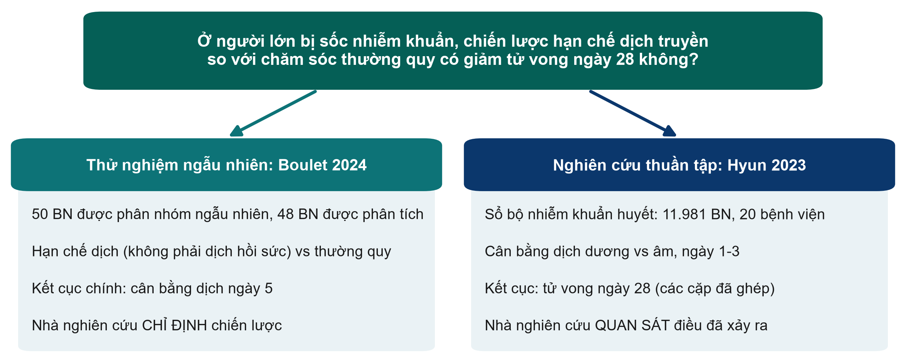{.neu-fig}

::: {.neu-takeaway}
**THÔNG ĐIỆP CHÍNH** Cùng câu hỏi, hai thiết kế: thiết kế quyết định điều được phép kết luận.
:::

::: {.notes}
Đây là sợi chỉ xuyên suốt cả buổi. Đọc to câu hỏi: đó là PICO cả lớp đã xây dựng ở Buổi 1.

Ý chính: Boulet CHỈ ĐỊNH chiến lược dịch truyền bằng ngẫu nhiên (một thực nghiệm). Hyun chỉ QUAN SÁT điều bác sĩ đã làm và điều xảy ra sau đó (một nghiên cứu thuần tập quan sát).

Chi tiết hay bị bỏ qua: kết cục chính của Boulet là cân bằng dịch ngày 5, không phải tử vong. Đây là thử nghiệm thí điểm. Hyun xét tử vong ngày 28 (đúng câu hỏi của chúng ta) nhưng không chỉ định được gì.

Quan niệm sai: 'nghiên cứu lớn hơn luôn tốt hơn'. Cỡ mẫu làm giảm sai số ngẫu nhiên, không loại bỏ sai lệch. Ta quay lại ở Buổi 4.

Hỏi cả lớp: nghiên cứu nào đáng tin hơn để biết hạn chế dịch có CỨU SỐNG bệnh nhân không? Dự kiến: ý kiến khác nhau, và đó chính là vấn đề. Không nghiên cứu nào trả lời trọn vẹn. Giữ sự băn khoăn này đến cuối phần 3.1.

Thời gian: 2 phút.
:::

## 3.1  Thiết kế nghiên cứu qua hình ảnh

:::: {.neu-statement}
::: {.neu-big}
Nhà nghiên cứu chỉ định phơi nhiễm, hay chỉ quan sát?
:::

::: {.neu-sub}
Một câu hỏi đó phân loại được gần như mọi thiết kế. (45 phút)
:::
::::

::: {.notes}
Đánh dấu phần 3.1 (45 phút, gồm hai lần kiểm tra ngắn).

Ý chính: học thiết kế như những hình vẽ trên trục thời gian, không phải định nghĩa. Với mỗi thiết kế hỏi: ai quyết định phơi nhiễm, và thời gian chạy chiều nào? Sau mỗi hình là một ví dụ từng bước.

Nói với cả lớp: không cần thuộc tên. Cuối phần này họ sẽ tự vẽ được.

Thời gian: 30 giây.
:::

## Cây gia phả các thiết kế nghiên cứu

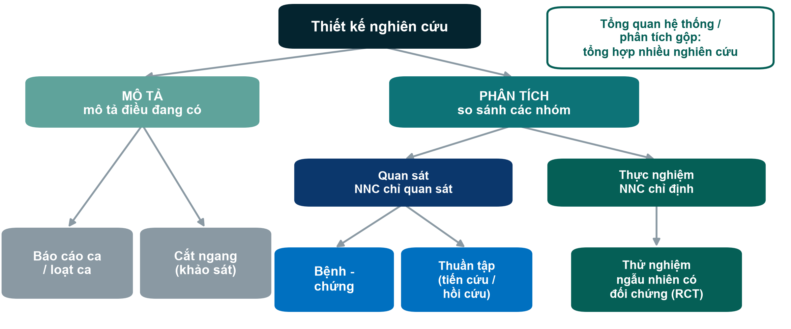{.neu-fig}

::: {.neu-takeaway}
**THÔNG ĐIỆP CHÍNH** Thiết kế mô tả thì mô tả; thiết kế phân tích thì so sánh các nhóm.
:::

::: {.notes}
Đi từ trên xuống. Nghiên cứu mô tả mô tả điều đang có, không so sánh. Nghiên cứu phân tích so sánh các nhóm để kiểm định một mối liên quan.

Nghiên cứu phân tích lại chia hai: quan sát (nhà nghiên cứu theo dõi điều xảy ra trong chăm sóc thường ngày) và thực nghiệm (nhà nghiên cứu quyết định ai nhận gì).

Tổng quan hệ thống nằm ngoài cây: đó là nghiên cứu về các nghiên cứu, tổng hợp nhiều thiết kế bên dưới.

Quan niệm sai: 'quan sát nghĩa là kém'. Không. Nhiều câu hỏi quan trọng (tác hại, tiên lượng, bệnh hiếm) chỉ trả lời được bằng nghiên cứu quan sát. Vấn đề là sự phù hợp, không phải thứ hạng.

Hỏi cả lớp: Boulet nằm ở đâu? Hyun? Dự kiến: Boulet = thực nghiệm, RCT; Hyun = quan sát, thuần tập.

Thời gian: 2 phút.
:::

## Phơi nhiễm và kết cục: hai từ bạn cần

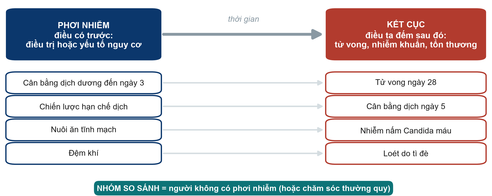{.neu-fig}

::: {.neu-takeaway}
**THÔNG ĐIỆP CHÍNH** Gọi tên phơi nhiễm và kết cục trước, thiết kế sẽ theo sau.
:::

::: {.notes}
Trước mọi thiết kế, ai cũng phải gọi tên được hai thành phần của câu hỏi.

Phơi nhiễm: điều có trước (một điều trị, chiến lược, yếu tố nguy cơ, hành vi). Kết cục: điều đếm sau đó (tử vong, nhiễm khuẩn, tổn thương, một chỉ số xét nghiệm). Nhóm so sánh là những người không có phơi nhiễm, hoặc được chăm sóc thường quy.

Đi qua bốn ví dụ. Cùng một biến có thể đóng vai trò khác nhau: cân bằng dịch là KẾT CỤC trong Boulet (cân bằng dịch ngày 5) nhưng là PHƠI NHIỄM trong Hyun (cân bằng đến ngày 3, kết cục tử vong).

Quan niệm sai: 'phơi nhiễm phải có hại'. Không. Một điều trị cũng là phơi nhiễm.

Hỏi cả lớp: trong 'Vận động sớm có giảm mê sảng ở ICU không?', đâu là phơi nhiễm, kết cục và so sánh? Dự kiến: vận động sớm; mê sảng; vận động thường quy (muộn hơn).

Thời gian: 2,5 phút.
:::

## Thiết kế mô tả: mô tả, không so sánh

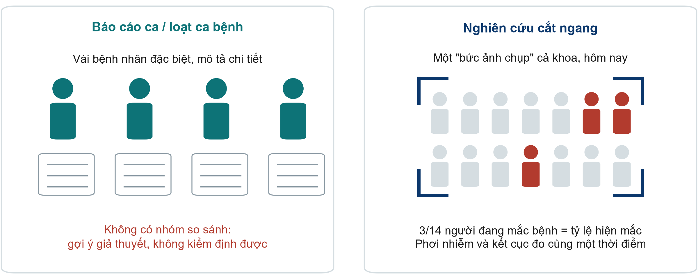{.neu-fig}

::: {.neu-takeaway}
**THÔNG ĐIỆP CHÍNH** Nghiên cứu mô tả gợi câu hỏi; không trả lời được 'X có gây ra Y không?'
:::

::: {.notes}
Báo cáo ca hoặc loạt ca: vài bệnh nhân đặc biệt được mô tả chi tiết. Có vai trò lịch sử quan trọng (những báo cáo đầu tiên về AIDS, tác hại của thalidomide) vì chúng báo động và gợi giả thuyết.

Nghiên cứu cắt ngang: một bức ảnh chụp quần thể tại một thời điểm, ví dụ khảo sát loét do tì đè ở mọi khoa trong một ngày. Nó đo tỷ lệ hiện mắc (bao nhiêu người đang mắc NGAY LÚC NÀY).

Ý chính: trong nghiên cứu cắt ngang, phơi nhiễm và kết cục được đo cùng lúc, nên thường không biết cái nào có trước.

Quan niệm sai: 'nghiên cứu cắt ngang chứng minh được nhân quả vì có hai nhóm'. Nó có thể so sánh các nhóm (cắt ngang phân tích) nhưng thiếu trình tự thời gian.

Hỏi cả lớp: cho một ví dụ nghiên cứu cắt ngang có thể làm ở khoa mình tuần tới. Dự kiến: khảo sát hiện mắc một thời điểm (dùng ống thông, sàng lọc mê sảng, tuân thủ vệ sinh tay).

Thời gian: 2 phút.
:::

## Ví dụ: khảo sát hiện mắc trong một ngày

::: {.neu-intro}
Một nghiên cứu cắt ngang có thể làm ngay tuần tới
:::

:::: {.neu-steps}
::: {.neu-step style="--c:#0D7377"}
[Chọn ngày]{.neu-step-label}

- Mọi BN nội trú ở mọi khoa, một ngày trong tuần
:::
::: {.neu-step style="--c:#0B376C"}
[Khám tất cả]{.neu-step-label}

- Hai điều dưỡng được tập huấn, một phiếu chuẩn
:::
::: {.neu-step style="--c:#5FA39B"}
[Ghi cả hai]{.neu-step-label}

- Loét tì đè (có/không) VÀ loại đệm, cùng một lần khám
:::
::: {.neu-step style="--c:#0070C0"}
[Đếm]{.neu-step-label}

- vd. 37/412 = 9% hiện mắc hôm nay
:::
::::

::: {.neu-takeaway}
**THÔNG ĐIỆP CHÍNH** Một bức ảnh chụp cho tỷ lệ hiện mắc; không cho biết cái nào có trước.
:::

::: {.notes}
Một ví dụ để 'cắt ngang' trở nên cụ thể. Số liệu giả định.

Bước 1-2: mọi người có mặt trong một ngày, được khám cùng một cách (giúp tránh sai lệch thông tin, sẽ học ở Buổi 4). Bước 3: phơi nhiễm (đệm) và kết cục (loét) được ghi cùng lúc. Bước 4: kết quả là tỷ lệ hiện mắc: 37/412 bệnh nhân, 9%.

Ý chính: có thể so sánh các nhóm (loét ở đệm thường và đệm khí), nhưng không biết đệm có trước hay bệnh nhân đã bị loét mới được chuyển sang đệm khí.

Quan niệm sai: 'cắt ngang = chất lượng thấp'. Với câu hỏi 'hiện nay phổ biến thế nào?' đó đúng là thiết kế phù hợp, lại rẻ và nhanh.

Hỏi cả lớp: vấn đề nào khác ở khoa có thể đo trong một ngày? Dự kiến: ống thông tiểu đang đặt, sàng lọc mê sảng, tuân thủ vệ sinh tay.

Thời gian: 2 phút.
:::

## Bệnh-chứng: bắt đầu từ kết cục, nhìn ngược lại

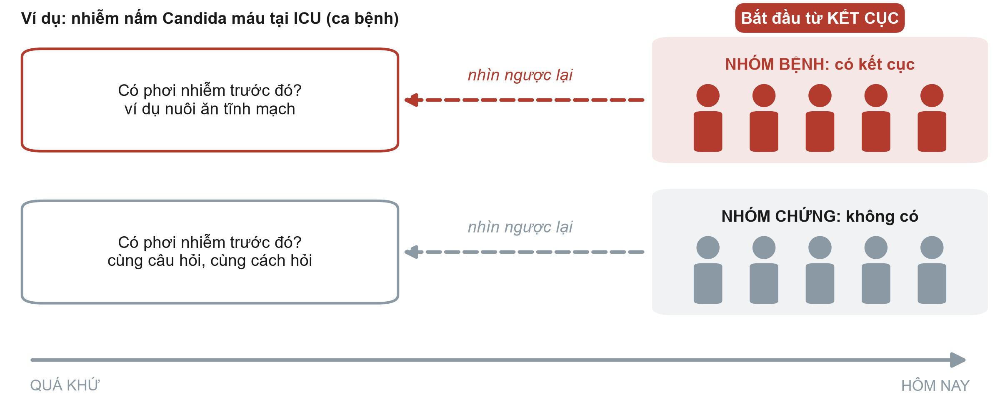{.neu-fig}

::: {.neu-takeaway}
**THÔNG ĐIỆP CHÍNH** Bệnh-chứng: chọn người THEO kết cục, rồi so sánh phơi nhiễm trong quá khứ.
:::

::: {.notes}
Dùng tay vẽ mũi tên từ phải sang trái. Ta bắt đầu HÔM NAY với những người đã có kết cục (nhóm bệnh) và những người tương tự không có (nhóm chứng). Rồi nhìn ngược lại tìm phơi nhiễm.

Ví dụ: bệnh nhân ICU bị nhiễm nấm Candida máu (nhóm bệnh) so với bệnh nhân ICU không bị (nhóm chứng); tra hồ sơ xem có nuôi ăn tĩnh mạch không.

Điểm mạnh: hiệu quả với kết cục HIẾM hoặc thời gian ủ bệnh dài, vì không cần theo dõi hàng nghìn người. Điểm yếu: sai lệch nhớ lại, khó chọn nhóm chứng tốt, và chỉ tính được tỷ số chênh (OR), không tính được nguy cơ.

Quan niệm sai: 'bệnh-chứng giống thuần tập hồi cứu vì cùng dùng hồ sơ cũ'. Khác biệt nằm ở cách chọn người: theo KẾT CỤC trong bệnh-chứng, theo PHƠI NHIỄM trong thuần tập.

Hỏi cả lớp: vì sao không tính được nguy cơ nhiễm Candida máu từ nghiên cứu bệnh-chứng? Dự kiến: nhà nghiên cứu tự chọn số ca bệnh và ca chứng, nên tỷ lệ có kết cục do thiết kế quyết định chứ không phải do tự nhiên.

Thời gian: 2,5 phút.
:::

## Ví dụ: một nghiên cứu bệnh-chứng ở ICU

::: {.neu-intro}
Câu hỏi: nuôi ăn tĩnh mạch có phải yếu tố nguy cơ của nhiễm Candida máu ở ICU?
:::

:::: {.neu-steps}
::: {.neu-step style="--c:#0D7377"}
[Tìm ca bệnh]{.neu-step-label}

- 40 BN ICU nhiễm Candida máu (hồ sơ xét nghiệm)
:::
::: {.neu-step style="--c:#0B376C"}
[Tìm ca chứng]{.neu-step-label}

- 80 BN ICU không bị, cùng khoa và cùng tháng
:::
::: {.neu-step style="--c:#5FA39B"}
[Nhìn lại]{.neu-step-label}

- Có nuôi ăn tĩnh mạch trong 14 ngày trước?
:::
::: {.neu-step style="--c:#0070C0"}
[So sánh]{.neu-step-label}

- Phơi nhiễm: 24/40 ca bệnh vs 16/80 ca chứng
:::
::: {.neu-step style="--c:#055F56"}
[Báo cáo]{.neu-step-label}

- Tỷ số chênh (tính ở Buổi 4)
:::
::::

::: {.neu-takeaway}
**THÔNG ĐIỆP CHÍNH** Ca bệnh và ca chứng được chọn theo KẾT CỤC; phơi nhiễm đo bằng cách nhìn lại.
:::

::: {.notes}
Ví dụ này xuất hiện lại trong bài tính toán ở Buổi 4, nên hãy đi chậm.

Bước 1: ca bệnh là người CÓ kết cục. Bước 2: ca chứng là những người tương tự KHÔNG có kết cục, từ cùng nguồn (cùng ICU, cùng thời gian). Chọn ca chứng tốt là phần khó nhất. Bước 3: nhìn lại phơi nhiễm, cùng một cách cho cả hai nhóm. Bước 4: 60% ca bệnh so với 20% ca chứng có phơi nhiễm. Bước 5: kết quả là tỷ số chênh (OR = 6,0, sẽ tính thứ Bảy tuần sau).

Quan niệm sai: 'ca chứng nên là người tình nguyện khỏe mạnh'. Không. Ca chứng phải đến từ quần thể đã sinh ra ca bệnh, nếu không phép so sánh không công bằng.

Hỏi cả lớp: vì sao không báo cáo được nguy cơ nhiễm Candida máu từ nghiên cứu này? Dự kiến: ta tự chọn số ca bệnh và ca chứng (1:2), nên tỷ lệ mắc do ta quyết định.

Thời gian: 2,5 phút.
:::

## Thuần tập: bắt đầu từ phơi nhiễm, theo dõi về sau

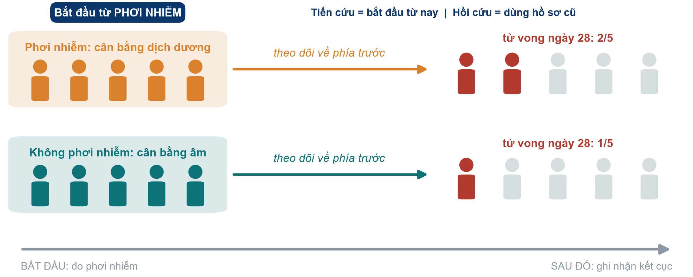{.neu-fig}

::: {.neu-takeaway}
**THÔNG ĐIỆP CHÍNH** Thuần tập: phơi nhiễm trước, kết cục sau, nên thời gian chạy đúng chiều.
:::

::: {.notes}
Mũi tên từ trái sang phải. Chia người theo PHƠI NHIỄM (ở đây: cân bằng dịch dương và âm trong những ngày đầu ở ICU) rồi đếm ai có kết cục (tử vong ngày 28). Đó là Hyun 2023.

Thuần tập tiến cứu: bắt đầu từ bây giờ và theo dõi về tương lai. Thuần tập hồi cứu: bắt đầu từ hồ sơ cũ, nhưng logic vẫn là phơi nhiễm rồi đến kết cục. Hyun phân tích một sổ bộ (registry) có dữ liệu được thu thập tiến cứu.

Điểm mạnh: trình tự thời gian rõ, xét được nhiều kết cục, cho nguy cơ và tỷ lệ mới mắc. Điểm yếu: chậm và tốn kém nếu tiến cứu, kém với kết cục hiếm, và yếu tố nhiễu, vì nhà nghiên cứu không chọn ai được truyền nhiều dịch hơn.

Quan niệm sai: 'hồi cứu nghĩa là chất lượng kém'. Không hẳn. Chất lượng phụ thuộc vào việc ghi chép dữ liệu tốt đến đâu.

Hỏi cả lớp: trong Hyun, ai quyết định bệnh nhân nào được truyền nhiều dịch hơn? Dự kiến: bác sĩ điều trị, tùy theo bệnh nhân trông nặng đến đâu. Giữ ý này cho phần yếu tố nhiễu ở Buổi 4.

Thời gian: 2 phút.
:::

## Ví dụ: nghiên cứu thuần tập Hyun, từng bước

::: {.neu-intro}
Câu hỏi: cân bằng dịch dương có liên quan với tử vong ngày 28?
:::

:::: {.neu-steps}
::: {.neu-step style="--c:#0D7377"}
[Xác định nhóm]{.neu-step-label}

- Người lớn nhiễm khuẩn huyết ở 20 bệnh viện, nằm ICU từ 3 ngày
:::
::: {.neu-step style="--c:#0B376C"}
[Đo phơi nhiễm]{.neu-step-label}

- Cân bằng dịch tích lũy ngày 1-3: dương hay âm
:::
::: {.neu-step style="--c:#5FA39B"}
[Theo dõi]{.neu-step-label}

- Ghi nhận ai tử vong đến ngày 28
:::
::: {.neu-step style="--c:#0070C0"}
[So sánh]{.neu-step-label}

- Các cặp đã ghép; HR 2,13 ở ngày 2
:::
::::

::: {.neu-takeaway}
**THÔNG ĐIỆP CHÍNH** Thuần tập chia người theo PHƠI NHIỄM rồi theo dõi đến KẾT CỤC.
:::

::: {.notes}
Đây là cách Bài báo 2 (Hyun 2023) hoạt động. Đây là ví dụ tốt về thuần tập xây dựng từ một sổ bộ có dữ liệu thu thập tiến cứu.

Bước 1: nhóm thuần tập: ai được theo dõi (và ai bị loại: bệnh nhân rời ICU trước ngày 3). Bước 2: phơi nhiễm được đo TRƯỚC kết cục. Bước 3: kết cục được đếm sau đó. Bước 4: so sánh các nhóm; Hyun ghép cặp theo điểm xu hướng để các nhóm tương đồng (483, 373 và 392 cặp cho ngày 1, 2 và 3). Kết quả ngày 2: HR 2,13 (KTC 95% 1,48-3,06); ngày 1 không khác biệt rõ.

Quan niệm sai: 'thuần tập phải bắt đầu từ hôm nay'. Thuần tập hồi cứu dùng hồ sơ cũ nhưng vẫn đi từ phơi nhiễm đến kết cục.

Hỏi cả lớp: ai quyết định bệnh nhân nào được truyền nhiều dịch hơn? Dự kiến: bác sĩ điều trị, thường vì bệnh nhân nặng hơn. Ta quay lại ở Buổi 4 (yếu tố nhiễu).

Thời gian: 2,5 phút.
:::

## RCT: phân nhóm ngẫu nhiên, rồi theo dõi về sau

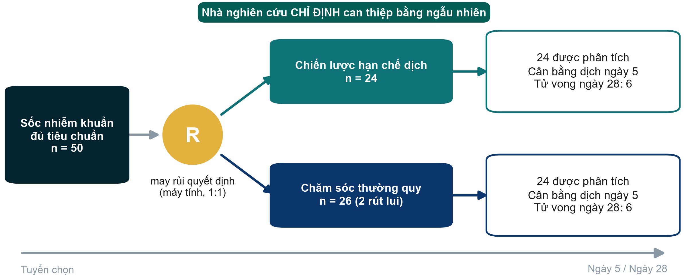{.neu-fig}

::: {.neu-takeaway}
**THÔNG ĐIỆP CHÍNH** Trong RCT, may rủi (không phải bác sĩ) quyết định ai nhận gì.
:::

::: {.notes}
Boulet 2024: 50 người lớn bị sốc nhiễm khuẩn được máy tính trung tâm phân nhóm ngẫu nhiên tỷ lệ 1:1 vào chiến lược hạn chế dịch không phải hồi sức hoặc chăm sóc thường quy. Hai bệnh nhân nhóm thường quy rút lại đồng ý, nên 24 + 24 được phân tích.

Ý chính: RCT là một nghiên cứu thuần tập trong đó nhà nghiên cứu chỉ định phơi nhiễm bằng ngẫu nhiên. Vì vậy các nhóm giống nhau từ đầu, cả với yếu tố đã đo VÀ yếu tố chưa đo.

Lưu ý kết quả trung thực: mỗi nhóm có 6 ca tử vong đến ngày 28. Với 24 bệnh nhân mỗi nhóm, điều này gần như không nói được gì về tử vong. Thử nghiệm thí điểm được tính cỡ mẫu cho cân bằng dịch.

Quan niệm sai: 'RCT = sự thật'. Một RCT nhỏ, không làm mù hoặc thực hiện kém vẫn có thể gây hiểu nhầm. Thiết kế là điều kiện cần, chưa đủ.

Hỏi cả lớp: sao không phân nhóm ngẫu nhiên mọi thứ? Dự kiến: có phơi nhiễm không thể chỉ định về mặt đạo đức (hút thuốc, tác hại), có kết cục hiếm hoặc mất nhiều năm, và thử nghiệm rất tốn kém.

Thời gian: 2 phút. Sau giải lao, phần 3.2 cho thấy những cách bố trí thử nghiệm khác.
:::

## Ví dụ: thử nghiệm Boulet, từng bước

::: {.neu-intro}
Câu hỏi: hạn chế dịch không phải hồi sức có giảm cân bằng dịch ngày 5?
:::

:::: {.neu-steps}
::: {.neu-step style="--c:#0D7377"}
[Tiêu chuẩn]{.neu-step-label}

- Sốc nhiễm khuẩn, 18-85 tuổi, vận mạch \< 24 giờ
:::
::: {.neu-step style="--c:#0B376C"}
[Đồng ý]{.neu-step-label}

- Bệnh nhân hoặc người đại diện hợp pháp
:::
::: {.neu-step style="--c:#5FA39B"}
[Ngẫu nhiên]{.neu-step-label}

- Máy tính trung tâm, 1:1, nên không ai đoán được
:::
::: {.neu-step style="--c:#0070C0"}
[Điều trị]{.neu-step-label}

- Hạn chế dịch vs thường quy trong 7 ngày
:::
::: {.neu-step style="--c:#055F56"}
[Đo]{.neu-step-label}

- Cân bằng dịch ngày 5; tử vong ngày 28
:::
::::

::: {.neu-takeaway}
**THÔNG ĐIỆP CHÍNH** Trong thử nghiệm, nhà nghiên cứu chỉ định phơi nhiễm bằng may rủi.
:::

::: {.notes}
Đây là Bài báo 1 (Boulet 2024), thử nghiệm ngẫu nhiên thí điểm tại 3 ICU.

Bước 1: tiêu chuẩn chọn chặt chẽ (ta quay lại khi xây dựng đề cương). Bước 2: đồng ý tham gia (ở ICU thường từ người đại diện), trước hoặc ngay sau phân nhóm. Bước 3: phân nhóm bằng máy tính trung tâm giữ kín lần phân bổ tiếp theo (che giấu phân bổ, Buổi 4). Bước 4: thực hiện hai chiến lược. Bước 5: kết cục chính là cân bằng dịch ngày 5; tử vong ngày 28 là 6/24 ở mỗi nhóm.

Quan niệm sai: 'ngẫu nhiên = làm mù'. Không phải ở đây. Bác sĩ biết nhóm; chỉ bệnh nhân và nhà thống kê được làm mù.

Hỏi cả lớp: bước nào biến đây thành THỰC NGHIỆM thay vì thuần tập? Dự kiến: bước 3, khi nhà nghiên cứu chỉ định phơi nhiễm.

Thời gian: 2 phút.
:::

## Kiểm tra nhanh: gọi tên thiết kế

::: {.neu-banner style="--c:#6C3483"}
CÂU HỎI NHANH · 3 phút
:::

:::: {.columns}
::: {.column width="60%"}
::: {.neu-activity-steps style="--c:#6C3483"}
- A. Hôm nay kiểm tra cả 300 BN nội trú: có ống thông tiểu không, có nhiễm khuẩn tiết niệu không
- B. BN viêm phổi thở máy được so sánh với BN không viêm phổi về việc dùng an thần trước đó
- C. BN được vận động sớm (do chuyên viên vật lý trị liệu quyết định) và BN không được, theo dõi đến khi ra viện
:::
:::
::: {.column width="40%"}
::: {.neu-side .plain style="--c:#6C3483"}
Chọn

- Cắt ngang
- Bệnh-chứng
- Thuần tập
- RCT
:::
:::
::::

::: {.neu-output style="--c:#6C3483"}
**SẢN PHẨM** Mỗi tình huống một thiết kế (đáp án ở slide sau)
:::

::: {.notes}
Cho 1 phút tự làm, rồi giơ tay cho từng tình huống. Chưa giải thích; slide sau có đáp án.

Chú ý tình huống C: một số người sẽ nói RCT vì có hai nhóm. Hỏi: ai quyết định ai được vận động? (Chuyên viên vật lý trị liệu, không phải may rủi.)

Thời gian: 3 phút tính cả slide đáp án.
:::

## Đáp án: gọi tên thiết kế

:::: {.neu-cards style="--n:3"}
::: {.neu-card .plain style="--c:#5FA39B"}
[A. Cắt ngang]{.neu-card-title}

- Một ngày, tất cả mọi người
- Phơi nhiễm và kết cục đo cùng lúc
- Cho tỷ lệ hiện mắc
:::
::: {.neu-card .plain style="--c:#0070C0"}
[B. Bệnh-chứng]{.neu-card-title}

- Chọn theo KẾT CỤC (viêm phổi)
- Nhìn lại phơi nhiễm (an thần)
- Cho tỷ số chênh
:::
::: {.neu-card .plain style="--c:#0B376C"}
[C. Thuần tập]{.neu-card-title}

- Chia theo PHƠI NHIỄM (vận động)
- Theo dõi đến khi ra viện
- Không phải RCT: không ngẫu nhiên
:::
::::

::: {.neu-takeaway}
**THÔNG ĐIỆP CHÍNH** Hỏi: chọn theo phơi nhiễm hay theo kết cục? Có do may rủi chỉ định không?
:::

::: {.notes}
Đi từng thẻ và mời một người giải thích bằng lời của mình.

Ý chính cho C: có hai nhóm không có nghĩa là thử nghiệm. Nếu không phải may rủi quyết định thì đó là nghiên cứu quan sát.

Quan niệm sai: 'xem hồ sơ cũ thì là bệnh-chứng'. Cách chọn mới quyết định: theo kết cục = bệnh-chứng; theo phơi nhiễm = thuần tập.

Nếu đa số làm đúng cả ba, đi nhanh hơn qua các slide sau; nếu không, vẽ lại ba trục thời gian lên bảng.

Thời gian: nằm trong 3 phút kiểm tra.
:::

## Tổng quan hệ thống và phân tích gộp

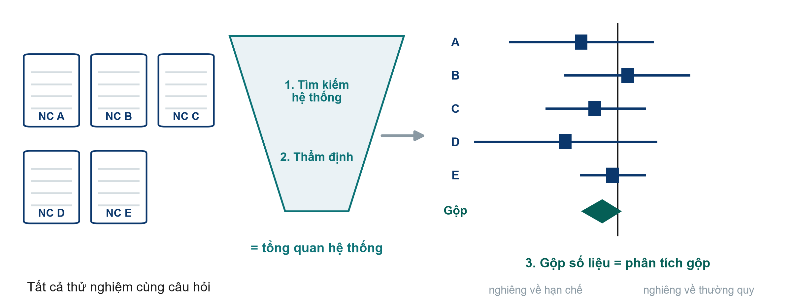{.neu-fig}

::: {.neu-takeaway}
**THÔNG ĐIỆP CHÍNH** Tổng quan hệ thống tìm kiếm và thẩm định; phân tích gộp gộp các con số.
:::

::: {.notes}
Tổng quan hệ thống dùng chiến lược tìm kiếm định trước, có thể lặp lại (nhớ PubMed và Boolean ở Buổi 2) và thẩm định mọi nghiên cứu tìm được. Phân tích gộp sau đó gộp kết quả thành một ước lượng chung: hình thoi ở cuối biểu đồ rừng (forest plot).

Biểu đồ rừng ở đây chỉ minh họa: mỗi ô vuông là một thử nghiệm, đường ngang là khoảng tin cậy 95%, đường dọc là 'không khác biệt'. Buổi 4 sẽ đọc sơ đồ PRISMA và biểu đồ rừng từng bước.

Quan niệm sai: 'phân tích gộp luôn là bằng chứng tốt nhất'. Nó chỉ tốt bằng các nghiên cứu được gộp: đầu vào kém, đầu ra kém. Gộp các thử nghiệm nhỏ bị sai lệch cho một câu trả lời sai nhưng rất chính xác.

Hỏi cả lớp: tổng quan tường thuật khác tổng quan hệ thống thế nào? Dự kiến: tổng quan hệ thống có phương pháp tìm kiếm và chọn lọc được nêu rõ, lặp lại được; tổng quan tường thuật do tác giả tự chọn.

Thời gian: 2 phút.
:::

## Hai bài báo nằm ở đâu trên tháp bằng chứng

:::: {.columns}
::: {.column width="38%"}
::: {.neu-side-notes}
### Đọc một cách thận trọng

- Càng cao = trung bình càng ít sai lệch
- Quy tắc kinh nghiệm, không phải định luật
- Thuần tập tốt có thể hơn RCT kém
- Thiết kế tốt nhất là thiết kế hợp với câu hỏi
:::
:::
::: {.column width="62%"}
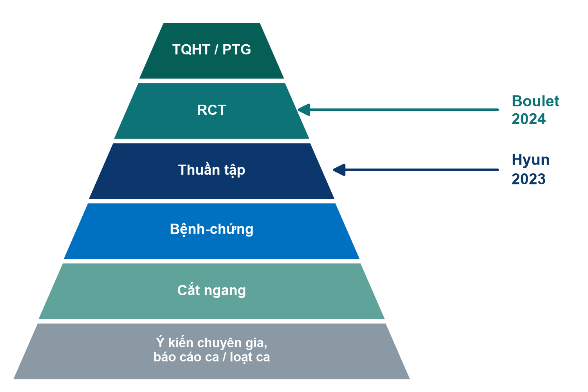{.neu-fig-side}
:::
::::

::: {.notes}
Ôn lại từ Buổi 1, giờ có đặt thêm hai bài báo. Boulet là RCT, Hyun là thuần tập.

Ý chính: tháp xếp hạng thiết kế theo mức bảo vệ điển hình trước sai lệch với câu hỏi về hiệu quả điều trị. Nó không xếp hạng câu hỏi về tỷ lệ hiện mắc, tiên lượng hay tác hại hiếm, nơi các thiết kế khác mới là công cụ đúng.

Quan niệm sai: 'bất cứ thứ gì ở tầng cao hơn đều thắng tầng dưới'. Một RCT thí điểm 48 bệnh nhân không bác bỏ được một thuần tập đa trung tâm cẩn thận về tử vong. Chúng trả lời những phần khác nhau của câu hỏi.

Hỏi cả lớp: bài nào ở cao hơn, và điều đó có làm nó hữu ích hơn cho câu hỏi về tử vong không? Dự kiến: Boulet cao hơn, nhưng không được thiết kế hay đủ cỡ mẫu cho tử vong, nên với tử vong nó đóng góp ít.

Thời gian: 1,5 phút.
:::

## Gọi tên thiết kế bằng ba câu hỏi

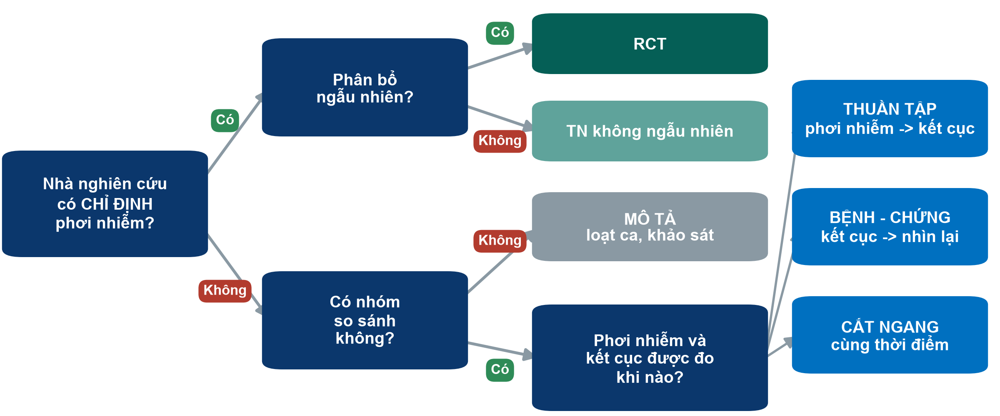{.neu-fig}

::: {.neu-takeaway}
**THÔNG ĐIỆP CHÍNH** Có chỉ định? Có ngẫu nhiên? Thời gian chạy chiều nào? Ba câu gọi tên thiết kế.
:::

::: {.notes}
Đây là công cụ cho bài tập ở cuối phần 3.1. Đi chậm một lần với Boulet, rồi với Hyun.

Boulet: nhà nghiên cứu có chỉ định chiến lược không? Có. Ngẫu nhiên? Có. RCT.

Hyun: có chỉ định? Không. Có nhóm so sánh? Có (cân bằng dương vs âm). Phơi nhiễm đo trước và kết cục theo dõi sau? Có. Thuần tập.

Quan niệm sai: gọi tên thiết kế theo chữ trong tiêu đề ('tiến cứu', 'sổ bộ', 'hồi cứu'). Tiêu đề có thể gây nhầm, vì vậy hãy dùng ba câu hỏi.

Hỏi cả lớp: một nghiên cứu so sánh điểm vệ sinh tay của điều dưỡng và tỷ lệ nhiễm khuẩn ở mọi khoa trong một ngày. Thiết kế gì? Dự kiến: không chỉ định, có so sánh, cùng thời điểm = cắt ngang. Còn một gói can thiệp áp dụng từ một ngày, so sánh trước và sau? Có chỉ định nhưng không ngẫu nhiên: nghiên cứu không ngẫu nhiên (bán thực nghiệm).

Thời gian: 3 phút. Nếu được, để slide này trên màn hình trong lúc làm bài tập (hoặc in trong tài liệu phát tay).
:::

## Thiết kế nào cũng phải đánh đổi một điều gì đó

::: {.neu-intro}
Điểm mạnh và điểm yếu trong nháy mắt
:::

:::: {.neu-cards style="--n:4"}
::: {.neu-card .plain style="--c:#5FA39B"}
[Cắt ngang]{.neu-card-title}

- [+ nhanh, rẻ]{style="color:#2E8B57"}
- [+ cho tỷ lệ hiện mắc]{style="color:#2E8B57"}
- [- cái nào có trước?]{style="color:#B23B2E"}
:::
::: {.neu-card .plain style="--c:#0070C0"}
[Bệnh-chứng]{.neu-card-title}

- [+ kết cục hiếm]{style="color:#2E8B57"}
- [+ ít BN, nhanh]{style="color:#2E8B57"}
- [- sai lệch nhớ lại]{style="color:#B23B2E"}
- [- chỉ có OR]{style="color:#B23B2E"}
:::
::: {.neu-card .plain style="--c:#0B376C"}
[Thuần tập]{.neu-card-title}

- [+ trình tự thời gian rõ]{style="color:#2E8B57"}
- [+ nguy cơ, nhiều kết cục]{style="color:#2E8B57"}
- [- chậm nếu tiến cứu]{style="color:#B23B2E"}
- [- yếu tố nhiễu]{style="color:#B23B2E"}
:::
::: {.neu-card .plain style="--c:#0D7377"}
[RCT]{.neu-card-title}

- [+ cân bằng cả yếu tố chưa biết]{style="color:#2E8B57"}
- [+ mạnh nhất cho nhân quả]{style="color:#2E8B57"}
- [- tốn kém, giới hạn đạo đức]{style="color:#B23B2E"}
- [- BN được chọn lọc]{style="color:#B23B2E"}
:::
::::

::: {.neu-takeaway}
**THÔNG ĐIỆP CHÍNH** Không thiết kế nào hoàn hảo: chọn thiết kế có điểm yếu ít hại câu hỏi nhất.
:::

::: {.notes}
Đừng đọc từng dòng. Chọn một điểm mạnh và một điểm yếu mỗi thẻ và nối với hình vừa xem.

Ý chính: điểm mạnh độc nhất của RCT là cân bằng các yếu tố nhiễu CHƯA BIẾT. Điểm yếu thường là khả năng khái quát: bệnh nhân thử nghiệm được chọn lọc (Boulet loại người trên 85 tuổi, người cần lọc máu và người suy dinh dưỡng nặng).

Quan niệm sai: 'nghiên cứu bệnh-chứng yếu'. Với kết cục hiếm, đó thường là thiết kế khả thi duy nhất, và chính nó lần đầu liên kết hút thuốc với ung thư phổi.

Hỏi cả lớp: muốn tìm yếu tố nguy cơ của một phản ứng thuốc hiếm, chọn thiết kế nào? Dự kiến: bệnh-chứng.

Thời gian: 2 phút. Tài liệu phát tay có lại bảng này.
:::

## Mỗi thiết kế được kết luận điều gì?

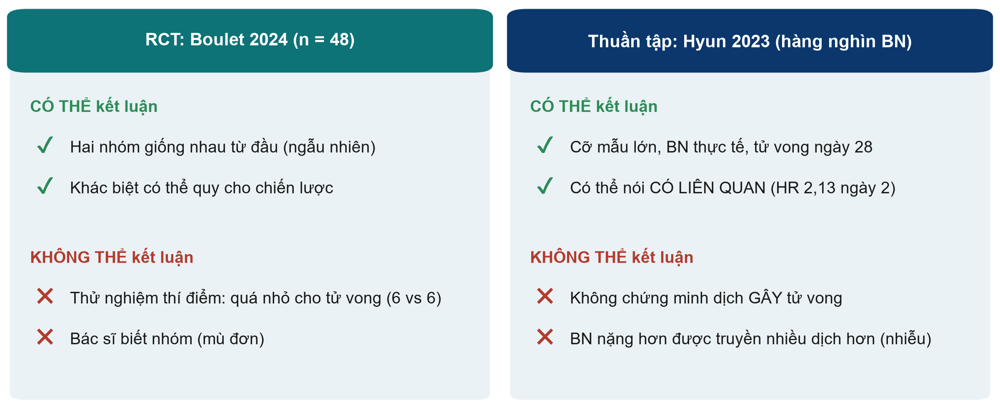{.neu-fig}

::: {.neu-takeaway}
**THÔNG ĐIỆP CHÍNH** RCT có thể nói 'gây ra'; thuần tập nên nói 'có liên quan'.
:::

::: {.notes}
Quay lại ví dụ xuyên suốt để kết thúc phần 3.1.

Boulet (RCT): vì may rủi làm hai nhóm tương đồng, mọi khác biệt về cân bằng dịch có thể quy cho chiến lược. Nhưng với 48 bệnh nhân và 6 ca tử vong mỗi nhóm, nó không nói được gì chắc chắn về tử vong. Bác sĩ biết phân nhóm, điều này có thể ảnh hưởng lượng dịch họ truyền.

Hyun (thuần tập): hàng nghìn bệnh nhân và đúng kết cục ta quan tâm. Cân bằng dịch dương ở ngày 2-3 có liên quan với tử vong ngày 28 cao hơn (HR 2,13 ở ngày 2; 1,56 ở ngày 3; ngày 1 không khác biệt rõ). Nhưng không chứng minh được dịch gây tử vong, vì bệnh nhân nặng hơn được truyền nhiều dịch hơn.

Quan niệm sai: 'đã hiệu chỉnh' hay 'đã ghép cặp theo điểm xu hướng' biến mối liên quan thành nhân quả. Nó chỉ giảm nhiễu do các yếu tố đã đo.

Hỏi cả lớp: viết một câu kết luận trung thực cho mỗi bài. Dự kiến: với Boulet, 'chiến lược không làm giảm rõ cân bằng dịch ngày 5'; với Hyun, 'cân bằng dịch dương ở ngày 2-3 có liên quan với tử vong cao hơn'.

Thời gian: 3 phút. Sau đó là 2 phút kiểm tra, rồi đến bài tập.
:::

## Kiểm tra nhanh: gây ra hay có liên quan?

::: {.neu-banner style="--c:#6C3483"}
CÂU HỎI NHANH · 2 phút
:::

:::: {.columns}
::: {.column width="60%"}
::: {.neu-activity-steps style="--c:#6C3483"}
- A. Boulet (RCT): 'Chiến lược hạn chế không làm giảm cân bằng dịch ngày 5'
- B. Hyun (thuần tập): 'Cân bằng dịch dương GÂY RA tử vong ngày 28 cao hơn'
- C. Khảo sát một ngày: 'Ống thông tiểu có liên quan với nhiễm khuẩn tiết niệu'
:::
:::
::: {.column width="40%"}
::: {.neu-side .plain style="--c:#6C3483"}
Với mỗi câu

- Lời lẽ có hợp với thiết kế?
- Giơ ngón cái lên hoặc xuống
:::
:::
::::

::: {.neu-output style="--c:#6C3483"}
**SẢN PHẨM** Ngón cái lên / xuống cho mỗi câu
:::

::: {.notes}
Đọc từng câu; cả lớp giơ ngón cái lên (lời lẽ hợp thiết kế) hoặc xuống.

Đáp án. A: lên. Thử nghiệm ngẫu nhiên được phép nói về nhân quả, và câu này báo cáo trung thực một kết quả âm tính. B: XUỐNG. Thuần tập chỉ nói 'có liên quan', không nói 'gây ra' (chính tóm tắt của Hyun dùng đúng chữ 'có liên quan'). C: lên. 'Có liên quan' là từ đúng cho khảo sát cắt ngang; nó không cho biết cái nào có trước.

Ý chính: đây là câu 8 trong bảng kiểm thẩm định dùng ở Buổi 8: lời lẽ có khớp với thiết kế không?

Thời gian: 2 phút.
:::

## Bài tập: Gọi tên thiết kế

::: {.neu-banner style="--c:#0D7377"}
LÀM VIỆC NHÓM · 15 phút
:::

:::: {.columns}
::: {.column width="60%"}
::: {.neu-activity-steps style="--c:#0D7377"}
- Làm theo cặp với tài liệu phát tay: 8 tóm tắt lâm sàng ngắn
- Với mỗi tóm tắt: có chỉ định? có ngẫu nhiên? thời gian chạy chiều nào?
- Ghi thiết kế và một cụm từ làm bằng chứng trong tóm tắt
- Đánh dấu sao câu khó nhất: cả lớp sẽ cùng thảo luận
:::
:::
::: {.column width="40%"}
::: {.neu-side .plain style="--c:#0D7377"}
Dùng cây quyết định

- Chỉ định + ngẫu nhiên = RCT
- Kết cục trước, nhìn lại = bệnh-chứng
- Phơi nhiễm trước, theo dõi = thuần tập
- Cùng thời điểm = cắt ngang
:::
:::
::::

::: {.neu-output style="--c:#0D7377"}
**SẢN PHẨM** 8 thiết kế được gọi tên, mỗi thiết kế có một bằng chứng
:::

::: {.notes}
Tài liệu: Practicals/s3\_exercises.md, Phần A. Đáp án: Solutions/s3\_solutions.md.

Cách chạy: 9 phút làm theo cặp, 6 phút thảo luận chung. Khi thảo luận, không đi qua cả tám câu. Hỏi các cặp đã đánh dấu sao câu nào và thảo luận những câu đó. Tóm tắt 5 (thuần tập hồi cứu nghe giống bệnh-chứng), 7 (nghiên cứu trước-sau không ngẫu nhiên) và 9 (thử nghiệm theo cụm, tùy chọn; sẽ học sau giải lao) thường khó nhất.

Ý chính: cụm từ làm bằng chứng quan trọng hơn cái nhãn: 'phân bổ ngẫu nhiên', 'chọn những bệnh nhân đã bị', 'theo dõi trong 12 tháng', 'trong một ngày'.

Quan niệm sai cần lắng nghe: 'dùng hồ sơ cũ nên là bệnh-chứng'. Hỏi lại: người được chọn theo kết cục hay theo phơi nhiễm?

Thời gian: nếu các cặp xong sớm, yêu cầu nêu một điểm mạnh và một điểm yếu cho mỗi thiết kế. Thông báo giải lao ở cuối slide này.
:::

## Giải lao

::: {.neu-banner style="--c:#8A99A3"}
GIẢI LAO · 15 phút
:::

::: {.neu-activity-steps style="--c:#8A99A3"}
- Vận động, uống cà phê, hít thở không khí
- Tùy chọn: thiết kế nào hợp nhất với câu hỏi của nhóm?
- Chúng ta tiếp tục với các thiết kế khác
:::

::: {.notes}
Giải lao 15 phút. Chiếu đồng hồ đếm ngược trên màn hình.

Trong giờ giải lao, đi qua các nhóm và hỏi nhẹ nhàng họ đang nghĩ đến thiết kế nào cho câu hỏi của mình. Điều này giúp bạn biết nhóm nào sẽ cần hỗ trợ trong phần xây dựng đề cương.

Bắt đầu lại đúng giờ, kể cả khi vài người chưa quay lại.
:::

## 3.2  Các thiết kế khác

:::: {.neu-statement}
::: {.neu-big}
Dự án thực tế uốn các thiết kế cơ bản.
:::

::: {.neu-sub}
Biến thể thử nghiệm, không kém hơn, thí điểm, thiết kế cải tiến chất lượng và nghiên cứu định tính. (35 phút)
:::
::::

::: {.notes}
Đánh dấu phần 3.2 (35 phút, gồm 3 phút kiểm tra).

Vì sao quan trọng: phần lớn dự án trong một khoa bệnh viện không phải thử nghiệm hai nhóm kinh điển. Đó là thay đổi ở cấp khoa, dự án cải tiến chất lượng, nghiên cứu thí điểm hay phỏng vấn. Biết các thiết kế này giúp các nhóm chọn được điều khả thi.

Thời gian: 30 giây.
:::

## Không phải thử nghiệm nào cũng song song: bốn cách bố trí

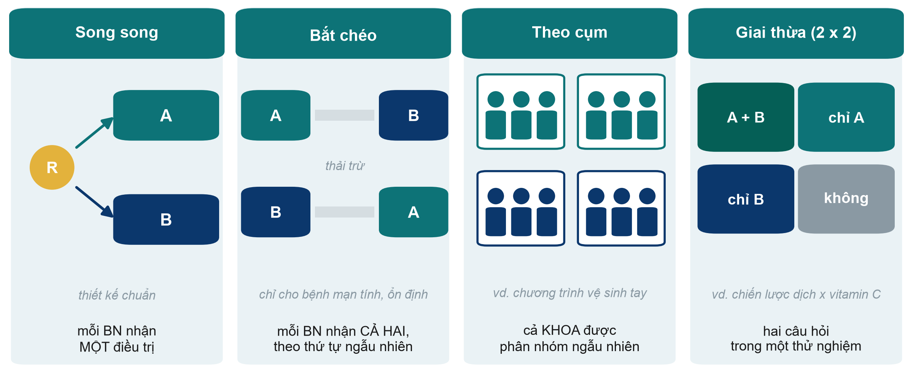{.neu-fig}

::: {.neu-takeaway}
**THÔNG ĐIỆP CHÍNH** Chọn cách bố trí thử nghiệm phù hợp với can thiệp và đơn vị chăm sóc.
:::

::: {.notes}
Phần lớn thử nghiệm là song song (parallel): mỗi bệnh nhân nhận một điều trị (Boulet). Ba biến thể giải quyết những vấn đề riêng.

Bắt chéo (crossover): mỗi bệnh nhân nhận cả hai điều trị theo thứ tự ngẫu nhiên, có giai đoạn thải trừ ở giữa, và là đối chứng của chính mình, nên cần ít bệnh nhân hơn. Chỉ dùng cho bệnh mạn tính, ổn định, khi tác dụng hết đi (ví dụ thuốc hít trong COPD). Vô dụng trong sốc nhiễm khuẩn: bệnh nhân ở ngày 7 không còn như ngày 1.

Theo cụm (cluster): phân nhóm ngẫu nhiên cả khoa, ICU hoặc bệnh viện, không phải từng bệnh nhân. Dùng khi can thiệp tác động ở cấp đơn vị (chương trình vệ sinh tay, gói xử trí nhiễm khuẩn huyết) hoặc khi bệnh nhân cùng khoa 'lây' can thiệp cho nhau. Cần nhiều bệnh nhân hơn vì bệnh nhân trong một cụm giống nhau.

Giai thừa (factorial): hai câu hỏi trong một thử nghiệm. Bệnh nhân được phân nhóm hai lần (ví dụ chiến lược dịch VÀ vitamin C), tạo bốn nhóm. Hiệu quả nếu hai điều trị không tương tác.

Quan niệm sai: 'thử nghiệm theo cụm là thử nghiệm yếu hơn'. Đó là RCT thực thụ; phân tích phải tính đến yếu tố cụm.

Hỏi cả lớp: muốn thử một bảng kiểm bàn giao mới cho điều dưỡng, chọn cách bố trí nào? Dự kiến: theo cụm. Phân nhóm ngẫu nhiên theo khoa hoặc ca trực, không theo bệnh nhân.

Thời gian: 6 phút.
:::

## Vượt trội hay không kém hơn? Hình ảnh ngưỡng

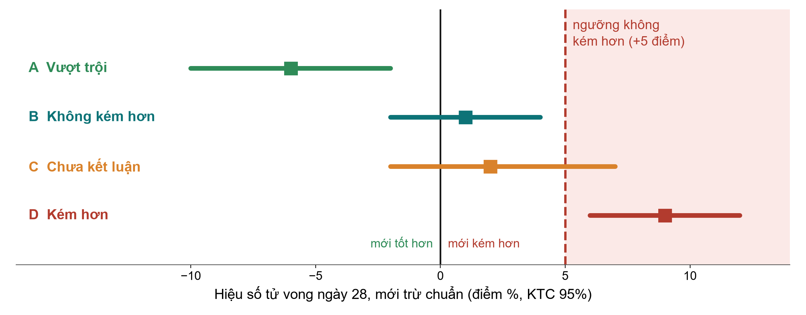{.neu-fig}

::: {.neu-takeaway}
**THÔNG ĐIỆP CHÍNH** Không kém hơn: toàn bộ KTC phải nằm dưới ngưỡng định trước.
:::

::: {.notes}
Thử nghiệm vượt trội (superiority) hỏi: điều trị mới có TỐT HƠN không? Thử nghiệm không kém hơn (non-inferiority) hỏi: nó có KHÔNG KÉM HƠN ĐẾN MỨC KHÔNG CHẤP NHẬN ĐƯỢC không (thường vì nó rẻ hơn, an toàn hơn, đơn giản hơn hoặc dùng ít dịch hơn).

Ngưỡng (ở đây +5 điểm phần trăm tử vong, giả định) là mức thiệt hại lớn nhất ta chấp nhận. Ngưỡng được định trong đề cương, trước khi có dữ liệu, dựa trên lập luận lâm sàng.

Đọc các thanh (hiệu số và KTC 95%). A: toàn bộ KTC dưới 0, vậy là vượt trội. B: KTC cắt 0 nhưng vẫn dưới ngưỡng, vậy là không kém hơn. C: KTC cắt ngưỡng, vậy là chưa kết luận. D: toàn bộ KTC trên ngưỡng, vậy là kém hơn.

Quan niệm sai: 'p \> 0,05 trong thử nghiệm vượt trội chứng tỏ hai điều trị tương đương'. Không. Không có bằng chứng không phải là bằng chứng của sự không có. p = 0,42 của Boulet không chứng tỏ hạn chế dịch tốt bằng chăm sóc thường quy.

Hỏi cả lớp: ai nên quyết định ngưỡng: nhà thống kê hay bác sĩ lâm sàng? Dự kiến: bác sĩ lâm sàng (và bệnh nhân), cùng nhà thống kê; đó là một nhận định lâm sàng.

Thời gian: 5 phút.
:::

## Nghiên cứu thí điểm và tính khả thi: buổi tổng duyệt

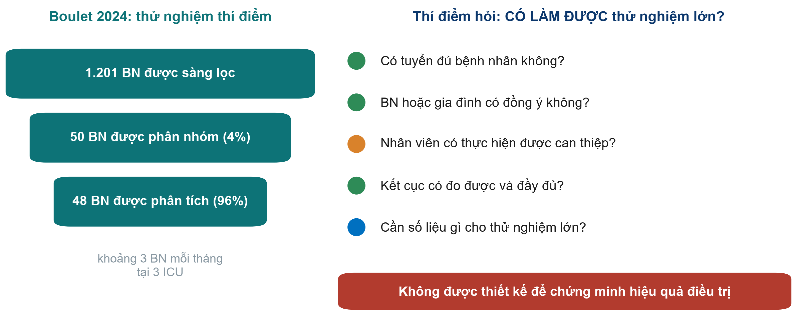{.neu-fig}

::: {.neu-takeaway}
**THÔNG ĐIỆP CHÍNH** Thí điểm hỏi 'có làm được không?', không phải 'có hiệu quả không?'
:::

::: {.notes}
Boulet 2024 tự gọi là thử nghiệm thí điểm (pilot). Giá trị thực sự nằm ở các con số bên trái: 1.201 bệnh nhân được sàng lọc để có 50 bệnh nhân được phân nhóm (khoảng 4%), khoảng 3 bệnh nhân mỗi tháng tại 3 ICU, 48/50 được phân tích.

Nghiên cứu thí điểm hay khả thi kiểm tra bộ máy của thử nghiệm lớn: tuyển chọn, đồng ý tham gia, nhân viên có thực hiện được can thiệp không, kết cục có đo đầy đủ không, và các con số cần để tính cỡ mẫu.

Ý chính: không nên dùng nghiên cứu thí điểm để khẳng định hiệu quả. Tiêu chí thành công của nó là về tính khả thi (ví dụ 'tuyển 2 bệnh nhân mỗi điểm mỗi tháng', 'dữ liệu đầy đủ trên 90%').

Quan niệm sai: 'nghiên cứu nhỏ của chúng tôi không thấy tác động, nên gọi là thí điểm'. Nghiên cứu thí điểm phải được lên kế hoạch như vậy từ đầu, với mục tiêu khả thi.

Hỏi cả lớp: với những con số này, có nên làm thử nghiệm 1.000 bệnh nhân tại đúng 3 ICU đó không? Dự kiến: không theo thiết kế này. Với 3 bệnh nhân mỗi tháng sẽ mất hàng chục năm; cần nhiều điểm hơn hoặc tiêu chuẩn chọn rộng hơn.

Thời gian: 4,5 phút.
:::

## Thiết kế bán thực nghiệm: trước-sau và chuỗi thời gian ngắt quãng

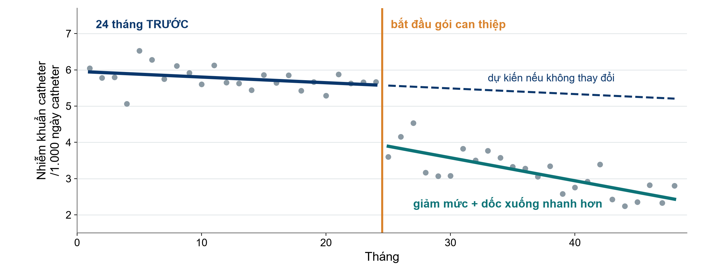{.neu-fig}

::: {.neu-caption}
Dữ liệu mô phỏng dùng cho giảng dạy
:::

::: {.neu-takeaway}
**THÔNG ĐIỆP CHÍNH** So sánh với xu hướng dự kiến, không phải với một giá trị trung bình 'trước'.
:::

::: {.notes}
Phần lớn dự án cải tiến chất lượng áp dụng thay đổi cho mọi người cùng lúc, không ngẫu nhiên và không có nhóm chứng song song. Đó là thiết kế bán thực nghiệm (quasi-experimental).

Nghiên cứu trước-sau đơn giản so sánh trung bình trước với trung bình sau. Yếu: tỷ lệ thường tự giảm (mùa, nhân viên mới, dự án khác, hồi quy về trung bình sau một tháng xấu).

Chuỗi thời gian ngắt quãng (interrupted time series, ITS) mạnh hơn nhiều: nhiều lần đo trước và sau (ở đây mỗi bên 24 điểm theo tháng). Ta so sánh điều đã xảy ra với điều mà xu hướng trước thay đổi dự báo (đường nét đứt). Tìm sự thay đổi về MỨC (sụt giảm) và về ĐỘ DỐC (giảm nhanh hơn).

Ý chính: ITS là thiết kế chuẩn để đánh giá một gói can thiệp, quy trình hay chính sách trong một bệnh viện. Thêm một chuỗi đối chứng (một khoa không thay đổi) để mạnh hơn.

Quan niệm sai: 'tỷ lệ nhiễm khuẩn giảm sau gói can thiệp, vậy gói can thiệp hiệu quả'. Chỉ đúng nếu mức giảm lớn hơn xu hướng sẵn có.

Hỏi cả lớp: trong tháng thực hiện dự án cải tiến gần nhất, bệnh viện còn thay đổi gì khác? Dự kiến: thường có (luân chuyển nhân sự, chính sách mới, kiểm tra), chính vì vậy xu hướng mới quan trọng.

Thời gian: 5 phút.
:::

## Thiết kế định tính: khi con số không trả lời được

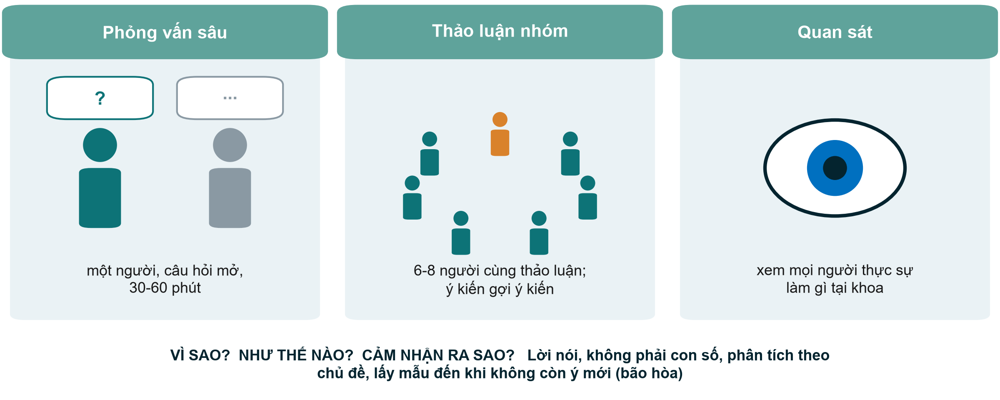{.neu-fig}

::: {.neu-takeaway}
**THÔNG ĐIỆP CHÍNH** Nghiên cứu định tính giải thích VÌ SAO và NHƯ THẾ NÀO; nó bổ sung cho con số.
:::

::: {.notes}
Có những câu hỏi không phải về bao nhiêu mà về vì sao, như thế nào và cảm nhận ra sao. Vì sao điều dưỡng không ghi lượng nước tiểu ban đêm? Gia đình trải qua việc đồng ý thay ở ICU như thế nào? Con số không trả lời được.

Ba phương pháp chính: phỏng vấn sâu (một người, câu hỏi mở), thảo luận nhóm (6-8 người; thảo luận làm lộ ra quan điểm chung và bất đồng), và quan sát (điều mọi người thực sự làm, có thể khác điều họ nói).

Chọn mẫu có chủ đích (chọn người hiểu vấn đề) và tiếp tục đến khi không còn chủ đề mới (bão hòa). Phân tích tìm các chủ đề trong bản ghi. Hướng dẫn báo cáo: COREQ hoặc SRQR.

Phương pháp hỗn hợp kết hợp cả hai: một thử nghiệm kèm phỏng vấn để hiểu vì sao can thiệp được hoặc không được thực hiện.

Quan niệm sai: 'định tính nghĩa là giai thoại'. Làm đúng cách, nó có hệ thống, minh bạch và được bình duyệt.

Hỏi cả lớp: một câu hỏi ở khoa mình mà chỉ phỏng vấn mới trả lời được. Dự kiến: rào cản vận động sớm, vì sao bàn giao thất bại, trải nghiệm mê sảng của bệnh nhân.

Thời gian: 4,5 phút.
:::

## Chọn thiết kế phù hợp với câu hỏi

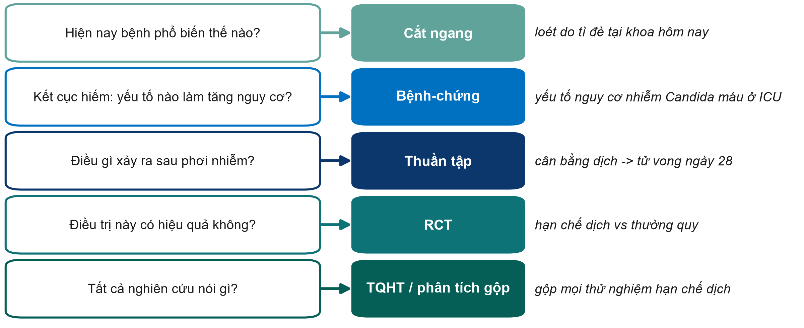{.neu-fig}

::: {.neu-takeaway}
**THÔNG ĐIỆP CHÍNH** Bắt đầu từ câu hỏi, thiết kế sẽ theo sau.
:::

::: {.notes}
Đây là tóm tắt thực hành của cả hai phần hôm nay. Đọc mỗi dòng như sau: nếu câu hỏi của bạn giống thế này, hãy bắt đầu với thiết kế này.

Ý chính: lát nữa các nhóm sẽ biện luận thiết kế của mình trong phần xây dựng đề cương bằng đúng logic này: 'câu hỏi của chúng tôi về X, nên thiết kế khả thi tốt nhất là Y'.

Lưu ý chữ KHẢ THI: thiết kế lý tưởng cho câu hỏi 'hạn chế dịch có cứu sống bệnh nhân không?' là một RCT lớn, nhưng một nhóm chỉ có một ICU và không có kinh phí có thể trung thực chọn thuần tập hồi cứu và nêu rõ giới hạn.

Quan niệm sai: 'phải làm RCT mới được coi trọng'. Một nghiên cứu thuần tập làm tốt và báo cáo trung thực vẫn có thể công bố và hữu ích.

Hỏi cả lớp: một nhóm muốn biết hôm nay có bao nhiêu bệnh nhân ICU bị mê sảng. Thiết kế nào? Dự kiến: cắt ngang (hiện mắc tại một thời điểm).

Thời gian: 5 phút.
:::

## Kiểm tra nhanh: thiết kế nào?

::: {.neu-banner style="--c:#6C3483"}
CÂU HỎI NHANH · 3 phút
:::

:::: {.columns}
::: {.column width="60%"}
::: {.neu-activity-steps style="--c:#6C3483"}
- A. Một phác đồ kháng sinh rẻ hơn; chỉ cần chứng minh nó không kém hơn
- B. Chương trình vệ sinh tay áp dụng cho cả khoa
- C. Gói xử trí nhiễm khuẩn huyết bắt đầu năm 2023; có 3 năm số liệu tử vong theo tháng
- D. Vì sao gia đình từ chối đồng ý tham gia nghiên cứu ở ICU?
:::
:::
::: {.column width="40%"}
::: {.neu-side .plain style="--c:#6C3483"}
Chọn

- Thử nghiệm theo cụm
- Thử nghiệm không kém hơn
- Chuỗi thời gian ngắt quãng
- Phỏng vấn định tính
:::
:::
::::

::: {.neu-output style="--c:#6C3483"}
**SẢN PHẨM** Mỗi câu một thiết kế (đáp án trong ghi chú)
:::

::: {.notes}
1 phút tự làm, rồi giơ tay.

Đáp án. A: thử nghiệm không kém hơn. Xác định ngưỡng từ trước. B: thử nghiệm ngẫu nhiên theo cụm. Phân nhóm theo khoa, không theo bệnh nhân. C: chuỗi thời gian ngắt quãng. So sánh các tháng sau gói can thiệp với xu hướng trước đó. D: thiết kế định tính, dùng phỏng vấn sâu (hoặc thảo luận nhóm) với gia đình.

Nếu lớp lúng túng với C, quay lại hình ITS 30 giây.

Thời gian: 3 phút.
:::

## Bài tập: chọn thiết kế cho 5 câu hỏi

::: {.neu-banner style="--c:#0D7377"}
LÀM VIỆC NHÓM · 20 phút
:::

:::: {.columns}
::: {.column width="60%"}
::: {.neu-activity-steps style="--c:#0D7377"}
- Tài liệu Phần B: bốn câu hỏi lâm sàng + câu hỏi của nhóm bạn
- Với mỗi câu: chọn thiết kế KHẢ THI tốt nhất (dùng cây quyết định)
- Ghi một lý do và điểm yếu chính của thiết kế
- Câu hỏi của nhóm: được nói 'gây ra' hay chỉ 'có liên quan'?
- Hai nhóm chia sẻ câu hỏi và thiết kế của mình (mỗi nhóm 1 phút)
:::
:::
::: {.column width="40%"}
::: {.neu-side .plain style="--c:#0D7377"}
Ghi nhớ

- Phổ biến hiện nay? Cắt ngang
- Kết cục hiếm? Bệnh-chứng
- Điều gì xảy ra sau? Thuần tập
- Có hiệu quả? RCT / theo cụm
- Đã thay đổi rồi? Chuỗi thời gian
- Vì sao / thế nào? Định tính
:::
:::
::::

::: {.neu-output style="--c:#0D7377"}
**SẢN PHẨM** 5 thiết kế kèm lý do và điểm yếu, gồm cả câu hỏi của nhóm
:::

::: {.notes}
Theo nhóm 6 người (nhóm đề cương). 12 phút làm, 8 phút chia sẻ.

Đáp án cho bốn câu (tài liệu Phần B; đáp án ở Solutions/s3\_solutions.md): 1 hiện mắc loét tì đè (cắt ngang); 2 tắm chlorhexidine áp dụng lần lượt từng khoa (thử nghiệm ngẫu nhiên theo cụm); 3 gói xử trí nhiễm khuẩn huyết đã áp dụng, có số liệu theo tháng (chuỗi thời gian ngắt quãng); 4 vì sao điều dưỡng không báo cáo sự cố suýt xảy ra (phỏng vấn định tính hoặc thảo luận nhóm). Hai câu bổ sung tùy chọn: bệnh-chứng và không kém hơn.

Câu hỏi của nhóm là cầu nối sang phần xây dựng đề cương: thiết kế chọn ở đây là thiết kế sẽ được biện luận ngay sau bài tập.

Vấn đề thường gặp: nhóm chọn RCT cho câu hỏi về tác hại hay tiên lượng. Hỏi: có thể chỉ định phơi nhiễm này một cách đạo đức không?

Thời gian: nhắc trước 5 phút khi đến phần chia sẻ.
:::

## Ai trong nghiên cứu của bạn? Tiêu chuẩn chọn và loại trừ

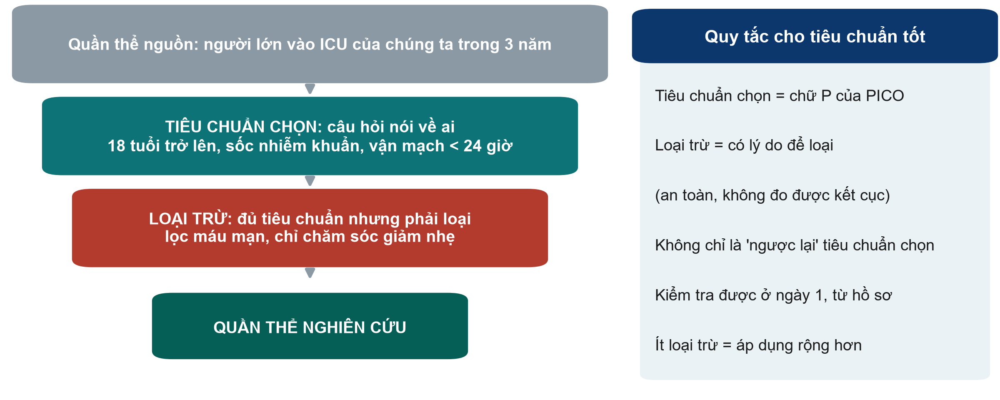{.neu-fig}

::: {.neu-takeaway}
**THÔNG ĐIỆP CHÍNH** Tiêu chuẩn chọn mô tả chữ P; tiêu chuẩn loại trừ loại người đủ tiêu chuẩn vì một lý do nêu rõ.
:::

::: {.notes}
Slide này chuẩn bị cho phần xây dựng đề cương: hôm nay các nhóm phải viết đối tượng nghiên cứu.

Đi xuống phễu với ví dụ ICU (phiên bản quan sát của câu hỏi về dịch truyền). Quần thể nguồn: mọi người có thể được nghiên cứu. Tiêu chuẩn chọn: chữ P của PICO, đo được (từ 18 tuổi, sốc nhiễm khuẩn, vận mạch bắt đầu trong 24 giờ). Tiêu chuẩn loại trừ: người đạt tiêu chuẩn chọn nhưng phải loại vì một lý do như an toàn, hoặc không đo được kết cục (lọc máu mạn, chỉ chăm sóc giảm nhẹ).

So với Boulet: chọn sốc nhiễm khuẩn, 18-85 tuổi, trong 24 giờ từ khi dùng vận mạch; loại tổn thương thận cấp cần lọc máu trong 24 giờ, bệnh thận giai đoạn cuối, suy dinh dưỡng nặng (BMI \< 18).

Quan niệm sai: viết tiêu chuẩn loại trừ là ngược lại của tiêu chuẩn chọn ('dưới 18 tuổi' không phải loại trừ; chỉ là không được chọn).

Ý chính: mỗi tiêu chuẩn loại trừ thêm vào làm nghiên cứu 'sạch' hơn nhưng kết quả áp dụng cho ít bệnh nhân hơn (giá trị ngoại suy, Buổi 4).

Hỏi cả lớp: nêu một tiêu chuẩn loại trừ tốt cho nghiên cứu vận động sớm. Dự kiến: gãy cột sống không vững, hoặc chỉ chăm sóc giảm nhẹ.

Thời gian: 3 phút.
:::

## Xây dựng đề cương 3: thiết kế, bối cảnh và đối tượng

::: {.neu-banner style="--c:#055F56"}
XÂY DỰNG ĐỀ CƯƠNG · 35 phút
:::

:::: {.columns}
::: {.column width="60%"}
::: {.neu-activity-steps style="--c:#055F56"}
- Đọc lại câu hỏi nghiên cứu ở Phần 1
- Chọn thiết kế bằng cây quyết định; biện luận trong 3-5 câu
- Bối cảnh: ở đâu, khi nào, những khoa nào, nguồn dữ liệu nào
- Đối tượng: 3-5 tiêu chuẩn chọn và 3-5 tiêu chuẩn loại trừ (kèm lý do)
- Vẽ nghiên cứu trên trục thời gian: phơi nhiễm, rồi kết cục
- Mời người hướng dẫn kiểm tra trước khi kết thúc
:::
:::
::: {.column width="40%"}
::: {.neu-side .plain style="--c:#055F56"}
Người hướng dẫn kiểm tra

- Thiết kế hợp với câu hỏi?
- Khả thi ở khoa bạn?
- Tiêu chuẩn chọn = chữ P?
- Mỗi loại trừ có lý do?
- Gây ra hay có liên quan?
:::
:::
::::

::: {.neu-output style="--c:#055F56"}
**SẢN PHẨM** Phần 2a của đề cương: thiết kế + biện luận, bối cảnh, đối tượng
:::

::: {.notes}
Phiếu làm việc: Practicals/s3\_exercises.md, Phần C, và mẫu đề cương (Phần 2). 35 phút.

Nhịp gợi ý (slide tiêu chuẩn chọn trước đó mất 3 phút): 4 phút thống nhất thiết kế (đa số nhóm đã chọn ở bài tập trước); 19 phút viết, chia cho các thành viên (một người viết biện luận, một người viết bối cảnh, hai người viết tiêu chuẩn, một người vẽ trục thời gian); 9 phút để người hướng dẫn kiểm tra và một nhóm đọc to phần biện luận.

Đáp án mẫu cho ví dụ xuyên suốt (phiên bản quan sát): thuần tập hồi cứu người lớn sốc nhiễm khuẩn tại ICU của chúng ta trong 3 năm; biện luận: RCT là lý tưởng nhưng không khả thi với một ICU không có kinh phí; hồ sơ sẵn có ghi dịch vào/ra và kết cục; sẽ kết luận 'có liên quan với'. Tiêu chuẩn chọn và loại trừ như slide phễu.

Vấn đề thường gặp: chọn RCT cho phơi nhiễm không thể chỉ định; bối cảnh quá lớn; tiêu chuẩn loại trừ chỉ lặp lại tiêu chuẩn chọn theo chiều ngược.

Phần còn lại của Phần 2 (phơi nhiễm, so sánh, kết cục, sai lệch) được xây dựng ở Buổi 4.

Thời gian: nhắc khi còn 10 phút và 2 phút.
:::

## Buổi 3 trong một slide

:::: {.neu-cards style="--n:3"}
::: {.neu-card .plain style="--c:#0D7377"}
[3.1 Thiết kế cơ bản]{.neu-card-title}

- Ảnh chụp, nhìn lại, theo dõi về sau
- RCT = may rủi chỉ định phơi nhiễm
- RCT nói 'gây ra'; thuần tập nói 'có liên quan'
:::
::: {.neu-card .plain style="--c:#0B376C"}
[3.2 Thiết kế khác]{.neu-card-title}

- Theo cụm, bắt chéo, giai thừa
- Không kém hơn cần ngưỡng
- Thí điểm, chuỗi thời gian, định tính
:::
::: {.neu-card .plain style="--c:#055F56"}
[Đề cương của bạn]{.neu-card-title}

- Thiết kế + biện luận
- Bối cảnh
- Tiêu chuẩn chọn và loại trừ
:::
::::

::: {.neu-takeaway}
**THÔNG ĐIỆP CHÍNH** Câu hỏi chọn thiết kế; thiết kế quyết định điều được phép kết luận.
:::

::: {.notes}
Tóm tắt buổi học. Mời ba người khác nhau giải thích mỗi thẻ bằng lời của mình.

Nếu thiếu thời gian, chỉ đọc thông điệp chính.

Thời gian: 2 phút (nằm trong 5 phút tổng kết).
:::

## Tổng kết và bài về nhà

::: {.neu-banner style="--c:#1F5C7A"}
THẢO LUẬN · 5 phút
:::

::: {.neu-activity-steps style="--c:#1F5C7A"}
- Câu hỏi cuối buổi: so sánh người tự chọn tiêm vắc xin cúm với người không tiêm. Thiết kế gì? Gây ra hay có liên quan?
- Bài về nhà: hoàn thành Phần 2a của đề cương (thiết kế, bối cảnh, đối tượng)
- Bài về nhà: đọc đoạn 'Patients' của Boulet và đoạn 'Data source' của Hyun
- Thứ Bảy tuần sau (Buổi 4): có tin được kết quả không, và tác động lớn đến đâu?
:::

::: {.neu-output style="--c:#1F5C7A"}
**SẢN PHẨM** Câu trả lời cuối buổi trên giấy dán
:::

::: {.notes}
Đáp án câu hỏi cuối buổi: thuần tập (chia theo phơi nhiễm họ tự chọn, theo dõi về sau); chỉ được nói 'có liên quan', vì người chọn tiêm vắc xin khác biệt ở nhiều mặt (hiệu ứng người dùng khỏe mạnh). Đây là bước dẫn vào yếu tố nhiễu thứ Bảy tuần sau.

Thu giấy dán; đọc to ba tờ khi mở đầu Buổi 4.

Thời gian: 3 phút sau slide tóm tắt. Kết thúc đúng giờ.
:::

## Slide bổ sung: Buổi 3

:::: {.neu-statement}
::: {.neu-big}
Slide bổ sung: Buổi 3
:::

::: {.neu-sub}
Dùng nếu còn thời gian, hoặc để tự học
:::
::::

::: {.notes}
EXTRA (slide bổ sung): các slide sau đây là tùy chọn. Dùng nếu lớp đi nhanh, để trả lời câu hỏi, hoặc giới thiệu cho học viên tự học.

Thời gian: bỏ qua trong buổi học trừ khi còn thời gian.
:::

## Cây quyết định trong thực tế: Boulet và Hyun

:::: {.neu-steps}
::: {.neu-step style="--c:#0D7377"}
[Chỉ định?]{.neu-step-label}

- Boulet: có, thử nghiệm chỉ định chiến lược
- Hyun: không, bác sĩ quyết định
:::
::: {.neu-step style="--c:#0B376C"}
[Ngẫu nhiên?]{.neu-step-label}

- Boulet: có, máy tính trung tâm
:::
::: {.neu-step style="--c:#5FA39B"}
[So sánh?]{.neu-step-label}

- Hyun: có, cân bằng dương vs âm
:::
::: {.neu-step style="--c:#0070C0"}
[Thứ tự?]{.neu-step-label}

- Hyun: phơi nhiễm ngày 1-3, rồi tử vong ngày 28
:::
::: {.neu-step style="--c:#055F56"}
[Thiết kế]{.neu-step-label}

- Boulet: RCT
- Hyun: thuần tập
:::
::::

::: {.neu-takeaway}
**THÔNG ĐIỆP CHÍNH** Cho mọi bài báo đi qua cùng các câu hỏi trước khi đọc kết quả.
:::

::: {.notes}
EXTRA (slide bổ sung): Đi chậm qua cây quyết định với hai bài báo xuyên suốt. Hữu ích nếu bài tập 'Gọi tên thiết kế' cho thấy lớp còn lúng túng.

Boulet: chỉ định? Có. Ngẫu nhiên? Có. Vậy là RCT. Hyun: chỉ định? Không. Có nhóm so sánh? Có. Phơi nhiễm đo trước kết cục? Có. Vậy là thuần tập.

Mời cả lớp làm tương tự với bài báo họ mang theo.

Thời gian: 2 phút nếu dùng.
:::

## Chọn ca chứng tốt trong nghiên cứu bệnh-chứng

:::: {.neu-cards style="--n:3"}
::: {.neu-card .plain style="--c:#0D7377"}
[Cùng nguồn]{.neu-card-title}

- Cùng bệnh viện, khoa và thời gian với ca bệnh
- Sẽ thành ca bệnh nếu có kết cục
:::
::: {.neu-card .plain style="--c:#0B376C"}
[Cùng cách đo]{.neu-card-title}

- Cùng hồ sơ, cùng câu hỏi
- Tốt nhất người đánh giá không biết ca bệnh hay ca chứng
:::
::: {.neu-card .plain style="--c:#0070C0"}
[Ghép cặp (tùy chọn)]{.neu-card-title}

- vd. tuổi, tháng nhập viện
- Không ghép theo chính phơi nhiễm
:::
::::

::: {.neu-takeaway}
**THÔNG ĐIỆP CHÍNH** Ca chứng kém làm mọi nghiên cứu bệnh-chứng trở nên vô nghĩa.
:::

::: {.notes}
EXTRA (slide bổ sung): Dành cho nhóm định làm nghiên cứu bệnh-chứng.

Ca chứng phải đến từ quần thể đã sinh ra ca bệnh: trong ví dụ nhiễm Candida máu là những bệnh nhân ICU khác cùng khoa và cùng tháng, không phải người tình nguyện khỏe mạnh.

Phơi nhiễm phải được đo cùng cách ở ca bệnh và ca chứng, tốt nhất bởi người không biết ai là ai.

Ghép cặp theo vài yếu tố có thể tăng hiệu quả, nhưng ghép quá mức (theo yếu tố liên quan đến phơi nhiễm) che mất tác động.

Thời gian: 2 phút nếu dùng.
:::

## Vượt trội, tương đương và không kém hơn

:::: {.neu-cards style="--n:3"}
::: {.neu-card .plain style="--c:#2E8B57"}
[Vượt trội]{.neu-card-title}

- Điều trị mới có TỐT HƠN?
- Toàn bộ KTC ở phía 'tốt hơn' của 0
:::
::: {.neu-card .plain style="--c:#0B376C"}
[Tương đương]{.neu-card-title}

- Có NHƯ NHAU không?
- Toàn bộ KTC nằm trong -ngưỡng đến +ngưỡng
:::
::: {.neu-card .plain style="--c:#0D7377"}
[Không kém hơn]{.neu-card-title}

- Có KHÔNG kém đến mức không chấp nhận được?
- Toàn bộ KTC dưới +ngưỡng
:::
::::

::: {.neu-takeaway}
**THÔNG ĐIỆP CHÍNH** Câu hỏi (tốt hơn, như nhau, không kém) được định trong đề cương, trước khi có dữ liệu.
:::

::: {.notes}
EXTRA (slide bổ sung): Hoàn chỉnh hình ảnh ngưỡng ở phần 3.2.

Thử nghiệm vượt trội là loại thông thường. Thử nghiệm tương đương (thường gặp với thuốc generic) cần KTC nằm trong ngưỡng ở cả hai phía. Thử nghiệm không kém hơn chỉ cần phía trên.

Quan niệm sai: 'thử nghiệm vượt trội thất bại chứng tỏ tương đương'. Không. Nó không được thiết kế với một ngưỡng.

Thời gian: 2 phút nếu dùng.
:::

## Làm đánh giá cải tiến chất lượng mạnh hơn

:::: {.neu-cards style="--n:3"}
::: {.neu-card .plain style="--c:#0D7377"}
[Nhiều điểm thời gian]{.neu-card-title}

- Ít nhất 8-12 điểm trước và sau
- Cùng một định nghĩa mỗi tháng
:::
::: {.neu-card .plain style="--c:#0B376C"}
[Chuỗi đối chứng]{.neu-card-title}

- Một khoa hay bệnh viện không thay đổi
- Cùng tháng, cùng cách đo
:::
::: {.neu-card .plain style="--c:#B23B2E"}
[Ghi các can thiệp khác]{.neu-card-title}

- Thay đổi nhân sự, chính sách mới, kiểm tra
- Ghi lại ngay khi xảy ra
:::
::::

::: {.neu-takeaway}
**THÔNG ĐIỆP CHÍNH** Trung bình trước-sau là yếu; chuỗi thời gian dài có đối chứng mạnh hơn nhiều.
:::

::: {.notes}
EXTRA (slide bổ sung): Dành cho nhóm có dự án đánh giá một thay đổi đã thực hiện ở khoa.

Chuỗi thời gian ngắt quãng so sánh dữ liệu sau thay đổi với xu hướng trước thay đổi. Nhiều điểm dữ liệu hơn, một chuỗi đối chứng và nhật ký các thay đổi khác làm kết quả thuyết phục hơn nhiều.

Hướng dẫn báo cáo cho dự án cải tiến chất lượng: SQUIRE 2.0.

Thời gian: 2 phút nếu dùng.
:::
