# Buổi 4 · Sai lệch và tác động: có tin được không, lớn đến đâu?

## Tuần 4 · Thứ Bảy

- Câu hỏi ôn tập Buổi 3 (10 phút)
- 4.1  Sai lệch, yếu tố nhiễu và nhân quả (40 phút)
- 4.2  Đo lường bệnh và mối liên quan + trình diễn bảng 2x2 (30 phút)
- Giải lao (15 phút), rồi hai bài tính bảng 2x2 (20 phút)
- 4.3  Vượt ra ngoài một nghiên cứu: xét nghiệm, phân tích gộp, thẩm định (30 phút)
- Xây dựng đề cương 4: phơi nhiễm, kết cục, sai lệch (30 phút), rồi tổng kết

::: {.notes}
MỞ ĐẦU BUỔI 4 (0:00). Thứ Bảy tuần trước ta chọn CÁCH trả lời câu hỏi. Hôm nay hai câu hỏi cho mọi kết quả: có TIN được không (sai lệch, yếu tố nhiễu, nhân quả) và LỚN đến đâu (nguy cơ, RR, OR, RD, NNT)? Sau đó vượt ra ngoài một nghiên cứu: xét nghiệm chẩn đoán, phân tích gộp và công cụ thẩm định.

Đọc ba giấy dán câu hỏi cuối Buổi 3 trước (thuần tập vắc xin cúm). Nó dẫn thẳng vào yếu tố nhiễu.

Nhịp độ: phép tính duy nhất là phép chia trong bảng 2x2, và bảng tính kiểm tra mọi đáp án.

Thời gian: 1 phút. Lịch: ôn tập 10, 4.1 40, 4.2 30, giải lao 15, bài tính 20, 4.3 30, đề cương 30, tổng kết 5.
:::

## Ôn tập: ba câu hỏi về Buổi 3

::: {.neu-banner style="--c:#6C3483"}
CÂU HỎI NHANH · 10 phút
:::

:::: {.columns}
::: {.column width="60%"}
::: {.neu-activity-steps style="--c:#6C3483"}
1. C1. BN ICU mê sảng được so sánh với BN không mê sảng về việc dùng benzodiazepine trước đó. Thiết kế?
2. C2. Thiết kế nào phân nhóm ngẫu nhiên cả khoa thay vì từng bệnh nhân?
3. C3. Chiến lược mới vs cũ, hiệu số tử vong KTC 95% -1 đến +3 điểm; ngưỡng +4 điểm. Kết quả?
4. Các nhóm: đọc lại Phần 2a của đề cương (thiết kế, bối cảnh, đối tượng): 2 phút
:::
:::
::: {.column width="40%"}
::: {.neu-side .plain style="--c:#6C3483"}
Cách thực hiện

- Tự trả lời trước
- Giơ tay, rồi công bố đáp án
- Mời một người giải thích
:::
:::
::::

::: {.neu-output style="--c:#6C3483"}
**SẢN PHẨM** Phần 2a của mỗi nhóm được đọc lại, sẵn sàng làm tiếp
:::

::: {.notes}
Đáp án. C1: bệnh-chứng (chọn theo kết cục, nhìn lại phơi nhiễm). C2: thử nghiệm ngẫu nhiên theo cụm. C3: không kém hơn. Toàn bộ KTC nằm dưới ngưỡng +4 (KTC cắt 0 nên không vượt trội).

Quan niệm sai cần sửa ở C1: 'dùng hồ sơ nên là thuần tập'. Hỏi: người được chọn theo điều đã xảy ra với họ (mê sảng) hay theo điều họ nhận được?

Thời gian: khoảng 6 phút cho các câu hỏi, 3 phút để nhóm đọc lại Phần 2a. Phần xây dựng đề cương hôm nay hoàn thành Phần 2.
:::

## Từ khóa của ngày hôm nay

::: {.neu-intro}
Từ vựng hôm nay. Mỗi định nghĩa đi kèm một hình
:::

:::: {.neu-cards style="--n:4"}
::: {.neu-card .plain style="--c:#B23B2E"}
[Có tin được?]{.neu-card-title}

- Sai lệch, yếu tố nhiễu
- Thay đổi tác động
- Nhân quả ngược
:::
::: {.neu-card .plain style="--c:#0D7377"}
[Lớn đến đâu?]{.neu-card-title}

- Nguy cơ, tỷ số nguy cơ (RR)
- Hiệu số nguy cơ, NNT
- Tỷ số chênh (OR)
:::
::: {.neu-card .plain style="--c:#0B376C"}
[Xét nghiệm]{.neu-card-title}

- Độ nhạy, độ đặc hiệu
- PPV, NPV, đường cong ROC
:::
::: {.neu-card .plain style="--c:#055F56"}
[Nhiều nghiên cứu]{.neu-card-title}

- Biểu đồ rừng, I bình phương
- Công cụ nguy cơ sai lệch
:::
::::

::: {.neu-takeaway}
**THÔNG ĐIỆP CHÍNH** Tin trước, rồi mới đến độ lớn: một câu trả lời chính xác vẫn có thể bị sai lệch.
:::

::: {.notes}
Đọc bốn tiêu đề; nói với cả lớp bảng thuật ngữ có trong tài liệu.

Ý chính: thứ tự quan trọng. Ta đánh giá kết quả có tin được không trước khi quan tâm nó lớn đến đâu.

Hỏi cả lớp: tháng này bạn đã gặp từ nào trong các bài báo? Dự kiến: OR, RR, KTC 95%, biểu đồ rừng.

Thời gian: 1 phút.
:::

## 4.1  Sai lệch, yếu tố nhiễu và nhân quả

:::: {.neu-statement}
::: {.neu-big}
Sai lệch là sai số hệ thống. Tăng cỡ mẫu không sửa được.
:::

::: {.neu-sub}
Chọn lựa, thông tin, yếu tố nhiễu, thay đổi tác động, và từ liên quan đến nhân quả. (40 phút)
:::
::::

::: {.notes}
Đánh dấu phần 4.1 (40 phút, gồm 2 phút kiểm tra và 4 phút câu hỏi 'Phát hiện sai lệch').

Ba nhóm sai lệch: ai được ĐƯA VÀO nghiên cứu (chọn lựa), mọi thứ được ĐO thế nào (thông tin), và sự TRỘN LẪN tác động (yếu tố nhiễu). Sau đó là cách thiết kế chống sai lệch, và bốn ý để đánh giá một kết quả: thay đổi tác động, giá trị nội tại và ngoại suy, nhân quả ngược và các quan điểm của Bradford Hill.

Thời gian: 30 giây.
:::

## Sai số ngẫu nhiên và sai lệch

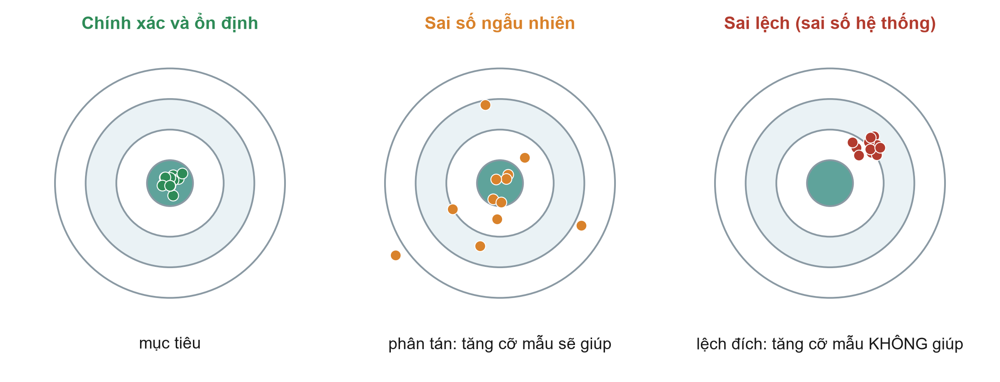{.neu-fig}

::: {.neu-takeaway}
**THÔNG ĐIỆP CHÍNH** Cỡ mẫu lớn làm giảm sai số ngẫu nhiên nhưng không động đến sai lệch.
:::

::: {.notes}
Dùng hình bia phi tiêu. Trái: điều ta muốn, gần sự thật và tập trung. Giữa: sai số ngẫu nhiên, quanh sự thật nhưng phân tán. Cỡ mẫu lớn hơn sẽ kéo các phi tiêu lại gần nhau. Phải: sai lệch, tập trung nhưng sai chỗ. Cỡ mẫu lớn hơn chỉ làm ta tự tin hơn vào câu trả lời sai.

Ý chính: khoảng tin cậy (Buổi 6) chỉ mô tả sai số ngẫu nhiên. Khoảng tin cậy hẹp không nói gì về sai lệch.

Quan niệm sai: 'nghiên cứu 10.000 bệnh nhân không thể bị sai lệch'. Nghiên cứu sổ bộ lớn có thể rất chính xác mà vẫn sai lệch.

Hỏi cả lớp: bài nào dễ bị sai số ngẫu nhiên hơn, bài nào dễ bị sai lệch hơn? Dự kiến: Boulet (48 BN) dễ bị sai số ngẫu nhiên; Hyun (quan sát) dễ bị sai lệch, nhất là yếu tố nhiễu.

Thời gian: 2 phút.
:::

## Sai lệch chọn lựa: ai được đưa vào nghiên cứu?

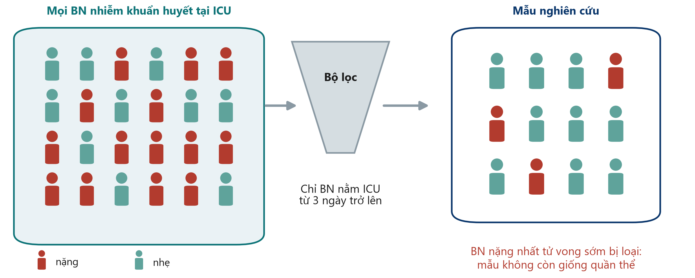{.neu-fig}

::: {.neu-takeaway}
**THÔNG ĐIỆP CHÍNH** Nếu mẫu khác quần thể đích, kết quả có thể không áp dụng được.
:::

::: {.notes}
Sai lệch chọn lựa xảy ra khi những người vào (hoặc ở lại) nghiên cứu khác một cách hệ thống với những người ta muốn tìm hiểu.

Ví dụ từ Hyun: chỉ bệnh nhân nằm ICU ít nhất ba ngày và có dữ liệu dịch được đưa vào (2.516 trong 11.981 bệnh nhân của sổ bộ). Những bệnh nhân nặng nhất tử vong sớm, và những người nhẹ nhất ra sớm, bị loại. Kết quả áp dụng cho 'bệnh nhân còn ở ICU ngày 3', không phải mọi bệnh nhân nhiễm khuẩn huyết.

Nguồn thường gặp khác: người tình nguyện, bệnh nhân từ chối tham gia, mất theo dõi, trung tâm tuyến cuối duy nhất.

Quan niệm sai: 'sai lệch chọn lựa chỉ quan trọng trong khảo sát'. Nó ảnh hưởng mọi thiết kế, kể cả RCT (tiêu chuẩn loại trừ chặt làm hẹp đối tượng áp dụng kết quả).

Hỏi cả lớp: trong Boulet, 1.201 bệnh nhân được sàng lọc và 50 được đưa vào. Điều đó nói gì? Dự kiến: bệnh nhân thử nghiệm được chọn lọc rất kỹ. Kiểm tra xem họ có giống bệnh nhân của mình không trước khi áp dụng.

Thời gian: 2,5 phút.
:::

## Sai lệch thông tin: mọi thứ được đo thế nào

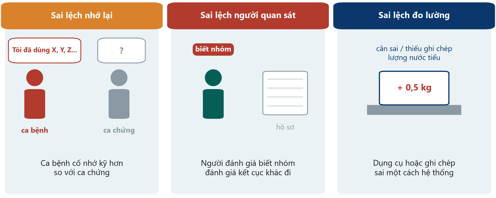{.neu-fig}

::: {.neu-takeaway}
**THÔNG ĐIỆP CHÍNH** Đo phơi nhiễm và kết cục theo cùng một cách ở mọi nhóm.
:::

::: {.notes}
Sai lệch thông tin (đo lường): dữ liệu sai một cách hệ thống.

Sai lệch nhớ lại: trong nghiên cứu bệnh-chứng, ca bệnh (hoặc gia đình) cố nhớ kỹ hơn ca chứng, nên phơi nhiễm có vẻ phổ biến hơn ở ca bệnh.

Sai lệch người quan sát: người đánh giá biết nhóm có thể đánh giá kết cục 'mềm' khác đi, ví dụ 'đủ điều kiện ra viện' hay 'có mê sảng'. Trong Boulet, bác sĩ biết phân nhóm.

Sai lệch đo lường: cân luôn chỉ cao 0,5 kg, hoặc lượng nước tiểu bị ghi thiếu ở ca đêm. Nếu khác nhau giữa các nhóm, nó làm méo phép so sánh.

Quan niệm sai: 'kết cục cứng như tử vong thì miễn nhiễm'. Tử vong được ghi nhận đáng tin cậy, nhưng thời điểm và nguyên nhân tử vong vẫn có thể bị phân loại sai.

Hỏi cả lớp: làm sao giảm sai lệch người quan sát trong một thử nghiệm ICU không làm mù? Dự kiến: kết cục khách quan, người đánh giá kết cục được làm mù, định nghĩa chuẩn và tập huấn.

Thời gian: 2,5 phút.
:::

## Kiểm tra nhanh: sai lệch nào?

::: {.neu-banner style="--c:#6C3483"}
CÂU HỎI NHANH · 2 phút
:::

:::: {.columns}
::: {.column width="60%"}
::: {.neu-activity-steps style="--c:#6C3483"}
1. A. Chỉ phỏng vấn những BN sống đến lúc ra viện về chăm sóc tại ICU
2. B. Điều dưỡng biết BN thuộc nhóm nào chấm điểm đau
3. C. Một cái cân luôn chỉ cao 0,5 kg chỉ được dùng ở một khoa
:::
:::
::: {.column width="40%"}
::: {.neu-side .plain style="--c:#6C3483"}
Chọn

- Sai lệch chọn lựa
- Sai lệch người quan sát
- Sai lệch đo lường
:::
:::
::::

::: {.neu-output style="--c:#6C3483"}
**SẢN PHẨM** Mỗi câu một sai lệch (đáp án trong ghi chú)
:::

::: {.notes}
Giơ tay cho từng lựa chọn.

Đáp án. A: sai lệch chọn lựa. Những bệnh nhân nặng nhất (đã tử vong) bị thiếu, nên mẫu không còn là quần thể. B: sai lệch người quan sát (sai lệch thông tin): một điểm số chủ quan do người biết nhóm đánh giá. C: sai lệch đo lường (sai lệch thông tin). Vì chỉ ảnh hưởng một khoa, nó làm méo phép so sánh giữa các khoa.

Thời gian: 2 phút.
:::

## Nhiễu do chỉ định: ví dụ dịch truyền ở ICU

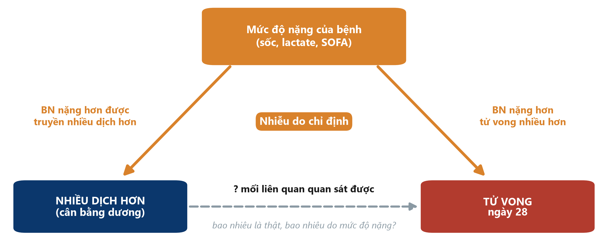{.neu-fig}

::: {.neu-takeaway}
**THÔNG ĐIỆP CHÍNH** Yếu tố nhiễu liên quan với phơi nhiễm VÀ là nguyên nhân của kết cục.
:::

::: {.notes}
Đây là slide quan trọng nhất của 4.1. Chỉ vào từng mũi tên.

Mức độ nặng của bệnh khiến bác sĩ truyền nhiều dịch hơn (mũi tên trái). Mức độ nặng cũng gây tử vong (mũi tên phải). Vì vậy bệnh nhân được truyền nhiều dịch hơn tử vong nhiều hơn, kể cả khi dịch không có tác động gì.

Trường hợp đặc biệt này gọi là nhiễu do chỉ định (confounding by indication): lý do đưa ra điều trị lại chính là thứ liên quan với kết cục.

Ba điều kiện của một yếu tố nhiễu: liên quan với phơi nhiễm, là nguyên nhân của kết cục, và không nằm trên con đường nhân quả giữa hai yếu tố đó.

Quan niệm sai: 'yếu tố nhiễu là bất kỳ biến nào khác nhau giữa các nhóm'. Nó còn phải ảnh hưởng đến kết cục.

Hỏi cả lớp: nêu một ví dụ nhiễu do chỉ định khác ở khoa mình. Dự kiến: bệnh nhân dùng nhiều kháng sinh tử vong nhiều hơn; bệnh nhân được chuyên gia dinh dưỡng khám sụt cân nhiều hơn; bệnh nhân dùng vận mạch có nhiều rối loạn nhịp hơn.

Thời gian: 3 phút.
:::

## Yếu tố nhiễu bằng con số: mối liên quan biến mất

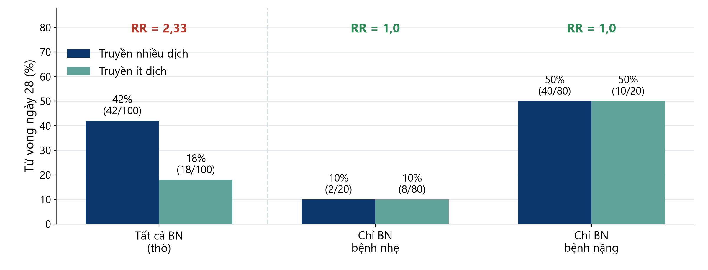{.neu-fig}

::: {.neu-caption}
Số liệu giả định dùng cho giảng dạy
:::

::: {.neu-takeaway}
**THÔNG ĐIỆP CHÍNH** So sánh tương đồng: trong từng mức độ nặng, lượng dịch không tạo khác biệt.
:::

::: {.notes}
Số liệu giả định, chọn để minh họa. Gộp tất cả bệnh nhân: 42% bệnh nhân truyền nhiều dịch tử vong so với 18% bệnh nhân truyền ít, tỷ số nguy cơ thô 2,33. Trông như dịch gây tử vong.

Giờ chia theo mức độ nặng. Bệnh nhẹ: 10% so với 10%. Bệnh nặng: 50% so với 50%. Trong mỗi mức, RR là 1,0.

Lý do: 80 trong 100 bệnh nhân truyền nhiều dịch là bệnh nặng, nhưng chỉ 20 trong 100 bệnh nhân truyền ít dịch. Mức độ nặng, chứ không phải dịch, giải thích khác biệt thô.

Ý chính: đó là điều 'hiệu chỉnh theo mức độ nặng' làm: so sánh tương đồng với tương đồng. Buổi 6 sẽ xem các bài báo và mô hình trình bày điều này thế nào. Slide sau: điều gì xảy ra khi các tầng KHÔNG giống nhau.

Quan niệm sai: 'sau hiệu chỉnh, mối liên quan còn lại là nhân quả'. Chỉ đúng nếu mọi yếu tố nhiễu quan trọng đều được đo tốt, điều không bao giờ được bảo đảm trong dữ liệu quan sát.

Hỏi cả lớp: cần đo gì lúc ban đầu trong nghiên cứu quan sát của mình để làm được điều này? Dự kiến: các chỉ dấu mức độ nặng chính. Với nhiễm khuẩn huyết là SOFA, lactate, liều vận mạch, tuổi, bệnh kèm.

Thời gian: 2,5 phút. Kiểm tra số học thành tiếng: 2 + 40 = 42 ca tử vong/100; 8 + 10 = 18/100.
:::

## Ví dụ: tìm yếu tố nhiễu

::: {.neu-intro}
Trong mỗi ví dụ, một yếu tố thứ ba chi phối cả phơi nhiễm lẫn kết cục
:::

:::: {.neu-cards style="--n:3"}
::: {.neu-card .plain style="--c:#0D7377"}
[Kháng sinh và tử vong]{.neu-card-title}

- Nhiều kháng sinh → nhiều tử vong?
- **Yếu tố nhiễu: độ nặng nhiễm khuẩn**
- BN nặng hơn dùng nhiều thuốc hơn
:::
::: {.neu-card .plain style="--c:#0B376C"}
[Dinh dưỡng và sụt cân]{.neu-card-title}

- Được chuyên gia dinh dưỡng khám → sụt cân nhiều hơn?
- **Yếu tố nhiễu: suy dinh dưỡng khi vào viện**
- Chính là lý do được giới thiệu
:::
::: {.neu-card .plain style="--c:#B23B2E"}
[Vận mạch và rối loạn nhịp]{.neu-card-title}

- Vận mạch → nhiều rối loạn nhịp?
- **Yếu tố nhiễu: mức độ sốc**
- Một phần cũng do thuốc
:::
::::

::: {.neu-takeaway}
**THÔNG ĐIỆP CHÍNH** Hỏi: vì sao những BN này nhận phơi nhiễm? Lý do đó có thể là yếu tố nhiễu.
:::

::: {.notes}
Thêm ba ví dụ về nhiễu do chỉ định để ý tưởng thấm vào người mới học.

Với mỗi thẻ, đọc mối liên quan bề ngoài, rồi hỏi cả lớp yếu tố thứ ba trước khi công bố.

Thẻ 3 cố ý pha trộn: vận mạch có thể gây rối loạn nhịp, VÀ mức độ sốc chi phối cả hai. Mối liên quan thực tế thường là hỗn hợp của tác động thật và yếu tố nhiễu. Vì vậy cần hiệu chỉnh, hoặc ngẫu nhiên hóa, để tách chúng ra.

Quan niệm sai: 'yếu tố nhiễu là bất kỳ khác biệt nào giữa các nhóm'. Nó phải liên quan với phơi nhiễm VÀ gây ra kết cục.

Thời gian: 2 phút.
:::

## Yếu tố nhiễu hay thay đổi tác động?

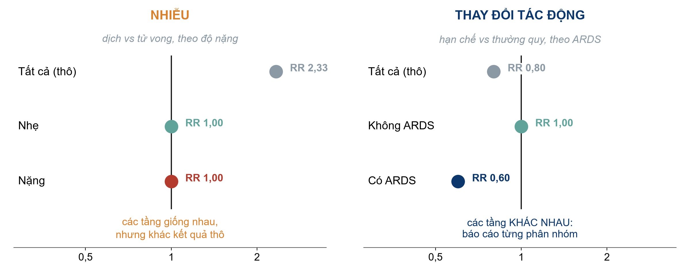{.neu-fig}

::: {.neu-caption}
Số liệu giả định dùng cho giảng dạy
:::

::: {.neu-takeaway}
**THÔNG ĐIỆP CHÍNH** Nhiễu là sai lệch cần loại bỏ; thay đổi tác động là phát hiện cần báo cáo.
:::

::: {.notes}
Cả hai xuất hiện khi ta chia dữ liệu theo tầng, nhưng mang ý nghĩa ngược nhau.

Bên trái, yếu tố nhiễu (ví dụ dịch truyền): các tầng giống NHAU (RR 1,0 và 1,0) nhưng khác kết quả thô (2,33). Yếu tố thứ ba (độ nặng) tạo ra một mối liên quan giả. Cách xử lý: hiệu chỉnh, và báo cáo ước lượng đã hiệu chỉnh.

Bên phải, thay đổi tác động (effect modification), còn gọi là tương tác (interaction) (giả định): chiến lược hạn chế dịch có thể có lợi ở bệnh nhân ARDS (RR 0,60) nhưng không khác biệt khi không có ARDS (RR 1,00). Các tầng khác NHAU. Đây là sinh học thật, không phải sai lệch: báo cáo từng phân nhóm; đừng gộp trung bình.

Quy tắc: các tầng giống nhau nhưng khác kết quả thô = nhiễu. Các tầng khác nhau = thay đổi tác động.

Quan niệm sai: 'mọi khác biệt giữa phân nhóm đều là thật'. Phân nhóm phải được định trước và ít; với nhiều phân nhóm, một số sẽ khác nhau do may rủi. Buổi 6 sẽ xem tương tác trong mô hình.

Hỏi cả lớp: cho một ví dụ lâm sàng mà điều trị tác động khác nhau ở hai nhóm. Dự kiến: tiêu huyết khối theo thời gian từ khởi phát đột quỵ; tác dụng thuốc theo chức năng thận; corticoid theo mức độ nặng COVID-19.

Thời gian: 3 phút.
:::

## Thiết kế chống lại sai lệch như thế nào

::: {.neu-intro}
Xây sự bảo vệ vào thiết kế; sửa phần còn lại trong phân tích.
:::

:::: {.neu-cards style="--n:3"}
::: {.neu-card .plain style="--c:#0D7377"}
[Ngẫu nhiên + che giấu]{.neu-card-title}

- May rủi quyết định nhóm
- Cân bằng yếu tố nhiễu đã biết VÀ chưa biết
- Không ai đoán được lần phân bổ kế tiếp
:::
::: {.neu-card .plain style="--c:#0B376C"}
[Làm mù]{.neu-card-title}

- Bệnh nhân, bác sĩ, người đánh giá, người phân tích
- Bảo vệ cách đo kết cục
- Nếu không thể: làm mù người đánh giá
:::
::: {.neu-card .plain style="--c:#0070C0"}
[Giới hạn, ghép cặp, hiệu chỉnh]{.neu-card-title}

- Giới hạn: thu hẹp tiêu chuẩn chọn
- Ghép cặp: ghép BN tương tự
- Hiệu chỉnh: thống kê khi phân tích
- **[Chỉ với yếu tố nhiễu đã đo]{style="color:#B23B2E"}**
:::
::::

::: {.neu-takeaway}
**THÔNG ĐIỆP CHÍNH** Chỉ phân nhóm ngẫu nhiên bảo vệ trước yếu tố nhiễu chưa từng được đo.
:::

::: {.notes}
Slide này là hộp công cụ; ba slide sau minh họa từng công cụ bằng hình.

Giai đoạn thiết kế (phòng ngừa): ngẫu nhiên hóa, che giấu phân bổ, làm mù, giới hạn, ghép cặp. Giai đoạn phân tích (sửa chữa): phân tầng, hiệu chỉnh bằng hồi quy, điểm xu hướng (propensity score).

Ý chính: dòng chữ đỏ in đậm là thông điệp then chốt. Mọi công cụ quan sát chỉ tác động lên những gì đã đo. Ngẫu nhiên hóa là công cụ duy nhất cân bằng cả những gì chưa đo.

Quan niệm sai: 'ghép cặp theo điểm xu hướng tốt như ngẫu nhiên hóa'. Đó là ghép cặp trên các yếu tố đã đo: khéo léo, nhưng vẫn giới hạn ở những yếu tố đó.

Hỏi cả lớp: Hyun đã dùng công cụ nào? Dự kiến: giới hạn (người lớn nhiễm khuẩn huyết, nằm ICU từ 3 ngày) và ghép cặp 1:1 theo điểm xu hướng.

Thời gian: 1,5 phút.
:::

## Ngẫu nhiên hóa cân bằng điều ta biết và điều ta chưa biết

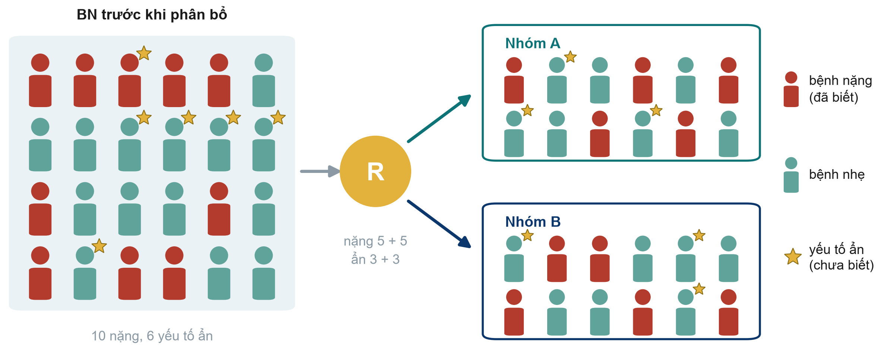{.neu-fig}

::: {.neu-takeaway}
**THÔNG ĐIỆP CHÍNH** Nhờ may rủi, hai nhóm có thành phần tương tự, kể cả yếu tố chưa ai đo.
:::

::: {.notes}
Hình màu đỏ là bệnh nhân nặng (yếu tố nhiễu đã biết). Ngôi sao vàng là một yếu tố ẩn chưa ai đo: một đặc điểm di truyền, sự suy yếu (frailty), linh cảm của bác sĩ.

Ngẫu nhiên hóa đưa bệnh nhân vào nhóm A hoặc B bằng may rủi, nên trung bình cả hai nhóm có cùng tỷ lệ bệnh nhân nặng VÀ ngôi sao. Ở đây mỗi nhóm có 5 bệnh nhân nặng và 3 ngôi sao.

Ý chính: sự cân bằng là tính trung bình; với thử nghiệm rất nhỏ vẫn có mất cân bằng do may rủi. Boulet thấy creatinine ban đầu cao hơn ở nhóm can thiệp. Với 24 bệnh nhân mỗi nhóm điều này không lạ.

Quan niệm sai: 'ngẫu nhiên nghĩa là hai nhóm giống hệt nhau'. Chúng tương tự nhau tính trung bình; Bảng 1 giúp kiểm tra.

Hỏi cả lớp: vì sao điều này hiệu quả hơn với 500 bệnh nhân so với 50? Dự kiến: với số lượng lớn, mất cân bằng do may rủi được san bằng.

Thời gian: 1,5 phút.
:::

## Che giấu phân bổ trước, làm mù sau

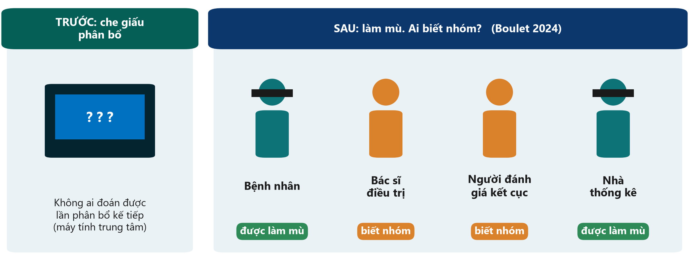{.neu-fig}

::: {.neu-takeaway}
**THÔNG ĐIỆP CHÍNH** Che giấu bảo vệ AI được đưa vào; làm mù bảo vệ CÁCH đo kết cục.
:::

::: {.notes}
Che giấu phân bổ (allocation concealment) diễn ra TRƯỚC khi phân nhóm: người tuyển bệnh nhân không biết và không đoán được lần phân bổ kế tiếp (máy tính trung tâm, không phải phong bì trên bàn). Nếu không, bác sĩ có thể hướng bệnh nhân nặng tránh khỏi điều trị mới: sai lệch chọn lựa ngay trong thử nghiệm.

Làm mù (blinding) diễn ra SAU: ai biết nhóm? Trong Boulet, bệnh nhân và nhà thống kê được làm mù, bác sĩ và nghiên cứu viên thì không, vì vậy gọi là 'mù đơn'.

Ý chính: trong thử nghiệm về dịch truyền và nhiều thử nghiệm ICU, làm mù bác sĩ thường không thể. Khi đó hãy làm mù người đánh giá kết cục và chọn kết cục khách quan.

Quan niệm sai: 'mù đơn, mù đôi, mù ba' có nghĩa cố định. Không. Bài báo nên nêu chính xác AI được làm mù.

Hỏi cả lớp: có thể che giấu phân bổ khi không thể làm mù không? Dự kiến: có. Che giấu phân bổ luôn làm được và luôn bắt buộc.

Thời gian: 1,5 phút.
:::

## Ghép cặp có ích, nhưng chỉ với điều đã được đo

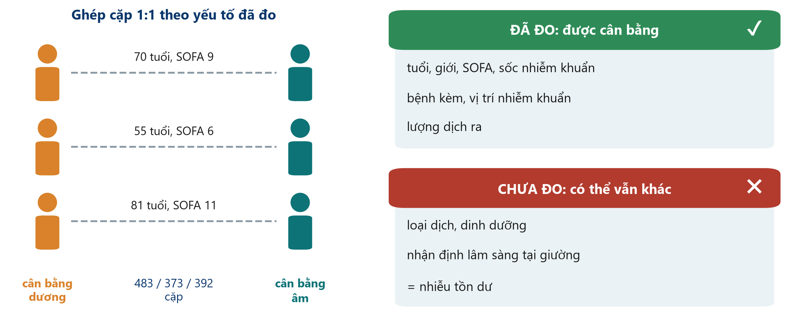{.neu-fig}

::: {.neu-takeaway}
**THÔNG ĐIỆP CHÍNH** Ghép cặp và hiệu chỉnh không cân bằng được điều không ai ghi lại.
:::

::: {.notes}
Hyun ghép mỗi bệnh nhân cân bằng dương với một bệnh nhân cân bằng âm có điểm xu hướng tương tự, xây dựng từ các yếu tố đã đo: tuổi, giới, SOFA, sốc nhiễm khuẩn, bệnh kèm, vị trí nhiễm khuẩn, lượng dịch ra và các yếu tố khác. Kết quả là 483, 373 và 392 cặp cho phân tích ngày 1, ngày 2 và ngày 3.

Chính tác giả đã nêu những gì KHÔNG đo: loại dịch và hỗ trợ dinh dưỡng. Nhận định tại giường của bác sĩ về độ nặng của bệnh nhân không bao giờ được ghi nhận đầy đủ. Phần còn lại gọi là nhiễu tồn dư (residual confounding).

Ý chính: đó là lý do một nghiên cứu thuần tập, dù ghép cặp tốt đến đâu, vẫn nói 'có liên quan', và câu hỏi 'hạn chế dịch có cứu sống không?' vẫn cần một RCT lớn.

Quan niệm sai: 'nhóm đã ghép cặp tốt như nhóm ngẫu nhiên'. Hãy xem Bảng 1, rồi hỏi điều gì không có trong Bảng 1.

Hỏi cả lớp: nêu một yếu tố chưa đo có thể khiến bác sĩ truyền nhiều dịch hơn VÀ dự báo tử vong. Dự kiến: ấn tượng lâm sàng về sốc, da nổi vân tím, tim suy, thảo luận về mục tiêu điều trị.

Thời gian: 1,5 phút.
:::

## Giá trị nội tại trước, rồi đến giá trị ngoại suy

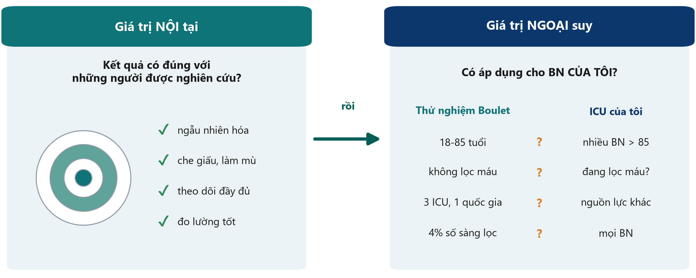{.neu-fig}

::: {.neu-takeaway}
**THÔNG ĐIỆP CHÍNH** Trước hết: đúng với người được nghiên cứu? Sau đó: có áp dụng cho BN của tôi?
:::

::: {.notes}
Giá trị nội tại (internal validity): câu trả lời có đúng với những người trong nghiên cứu không? Đây là điều mà ngẫu nhiên hóa, che giấu phân bổ, làm mù, theo dõi đầy đủ và đo lường tốt bảo vệ.

Giá trị ngoại suy (external validity, khả năng khái quát hóa): câu trả lời có áp dụng cho bệnh nhân CỦA TÔI trong bối cảnh CỦA TÔI không? So sánh quần thể thử nghiệm với quần thể của mình. Boulet đưa vào người lớn 18-85 tuổi không lọc máu hay suy dinh dưỡng nặng, tại 3 ICU của một quốc gia, và chỉ khoảng 4% số bệnh nhân được sàng lọc.

Ý chính: giá trị nội tại đi trước. Một kết quả sai lệch không áp dụng được ở đâu cả. Nhưng một thử nghiệm hoàn toàn đúng trên bệnh nhân được chọn lọc kỹ có thể không giúp được khoa của bạn.

Quan niệm sai: 'RCT áp dụng cho tất cả mọi người'. Nó áp dụng rõ nhất cho những bệnh nhân giống người đã tham gia.

Hỏi cả lớp: nêu một nhóm bệnh nhân ở ICU của mình không thể vào thử nghiệm Boulet. Dự kiến: bệnh nhân trên 85 tuổi, bệnh nhân lọc máu mạn, bệnh nhân vào sau hơn 24 giờ dùng vận mạch.

Thời gian: 2 phút.
:::

## Nhân quả ngược: cái nào có trước?

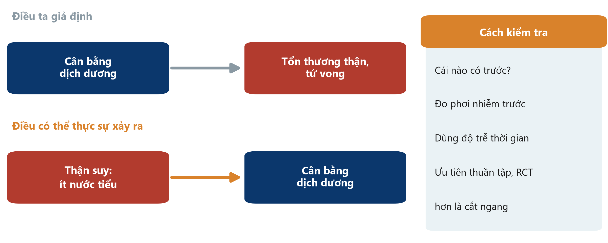{.neu-fig}

::: {.neu-takeaway}
**THÔNG ĐIỆP CHÍNH** Trước khi nói X gây ra Y, hãy chắc rằng Y không gây ra X.
:::

::: {.notes}
Nhân quả ngược (reverse causation): 'kết cục' thực ra gây ra 'phơi nhiễm'.

Ví dụ ICU: ta giả định cân bằng dịch dương gây tổn thương thận và tử vong. Nhưng thận suy tạo ít nước tiểu, và ít dịch ra nghĩa là cân bằng dương hơn. Mũi tên có thể chạy ngược lại. Đó là lý do Hyun ghép cặp theo cả lượng dịch RA lẫn dịch vào.

Ví dụ khác: người mắc bệnh sớm chưa chẩn đoán ngừng vận động (nên ít vận động trông có hại); bệnh nhân đang xấu đi được làm nhiều xét nghiệm và dùng nhiều thuốc hơn.

Cách kiểm tra: bảo đảm phơi nhiễm được đo TRƯỚC khi kết cục bắt đầu, dùng độ trễ thời gian, ưu tiên thiết kế thuần tập hoặc thử nghiệm hơn cắt ngang.

Quan niệm sai: 'nhân quả ngược chỉ quan trọng trong nghiên cứu cắt ngang'. Nó có thể ảnh hưởng cả thuần tập khi phơi nhiễm được đo lúc kết cục đang hình thành.

Hỏi cả lớp: bệnh nhân mê sảng dùng nhiều thuốc chống loạn thần hơn. Mũi tên có thể chạy chiều nào? Dự kiến: cả hai. Thuốc có thể gây hại, nhưng mê sảng chính là lý do kê đơn.

Thời gian: 2 phút.
:::

## Từ liên quan đến nhân quả: Bradford Hill bằng hình ảnh

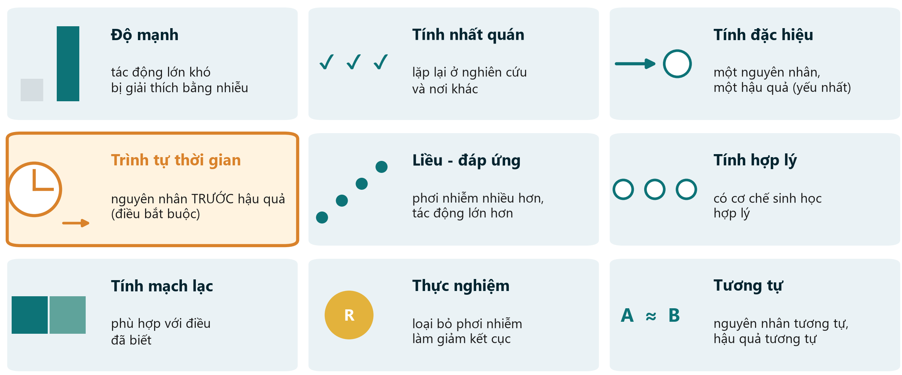{.neu-fig}

::: {.neu-takeaway}
**THÔNG ĐIỆP CHÍNH** Nhân quả là nhận định từ nhiều manh mối; trình tự thời gian là điều bắt buộc duy nhất.
:::

::: {.notes}
Năm 1965, Austin Bradford Hill nêu chín quan điểm để đánh giá một mối liên quan có khả năng là nhân quả không. Chúng không phải bảng kiểm để cho điểm; chúng là manh mối.

Độ mạnh (RR lớn khó giải thích bằng nhiễu), tính nhất quán (lặp lại ở nghiên cứu và bối cảnh khác), tính đặc hiệu (yếu nhất), trình tự thời gian (nguyên nhân phải có trước, và đây là điều duy nhất bắt buộc), liều-đáp ứng (phơi nhiễm nhiều hơn, tác động lớn hơn), tính hợp lý (có cơ chế), tính mạch lạc (phù hợp với điều đã biết), thực nghiệm (loại bỏ phơi nhiễm làm giảm kết cục, và RCT là dạng mạnh nhất), tương tự.

Áp dụng cho Hyun: độ mạnh vừa (HR khoảng 1,6-2,1); nhất quán với các thuần tập khác; trình tự thời gian: cân bằng dịch đo trước tử vong, nhưng có thể có nhân quả ngược; chưa cho thấy liều-đáp ứng; thực nghiệm: các thử nghiệm như Boulet chưa cho thấy tác động lên tử vong. Kết luận: có thể, chưa được chứng minh.

Quan niệm sai: 'đạt phần lớn tiêu chí là chứng minh được nhân quả'. Chúng làm tăng hoặc giảm sự tin cậy; không bao giờ chứng minh.

Hỏi cả lớp: tiêu chí nào RCT cung cấp mà không thuần tập nào có? Dự kiến: thực nghiệm.

Thời gian: 3 phút.
:::

## Câu hỏi nhanh: Phát hiện sai lệch

::: {.neu-banner style="--c:#6C3483"}
CÂU HỎI NHANH · 4 phút
:::

:::: {.columns}
::: {.column width="60%"}
::: {.neu-activity-steps style="--c:#6C3483"}
1. Mẹ của trẻ dị tật bẩm sinh nhớ thuốc dùng khi mang thai rõ hơn các bà mẹ khác
2. Điều dưỡng nghiên cứu biết nhóm chấm điểm 'đủ điều kiện ra viện'
3. Khảo sát chất lượng sống sau ICU chỉ tuyển người đến tái khám
4. BN có lactate cao được truyền nhiều dịch hơn và tử vong nhiều hơn
:::
:::
::: {.column width="40%"}
::: {.neu-side .plain style="--c:#6C3483"}
Chọn một

- Sai lệch chọn lựa
- Sai lệch nhớ lại
- Sai lệch người quan sát
- Yếu tố nhiễu
:::
:::
::::

::: {.neu-output style="--c:#6C3483"}
**SẢN PHẨM** Mỗi tình huống: gọi tên một sai lệch và một cách khắc phục
:::

::: {.notes}
Đọc từng tình huống; cả lớp trả lời bằng giơ tay hoặc nói to. Mỗi lần hỏi thêm một cách khắc phục.

Đáp án. 1: sai lệch nhớ lại. Khắc phục: ghi nhận phơi nhiễm trước khi biết kết cục (hồ sơ kê đơn), hỏi ca bệnh và ca chứng theo cùng một cách có cấu trúc. 2: sai lệch người quan sát. Khắc phục: người đánh giá được làm mù, tiêu chuẩn ra viện khách quan. 3: sai lệch chọn lựa (và mất theo dõi). Khắc phục: liên hệ mọi người sống sót, báo cáo người không trả lời. 4: nhiễu do chỉ định. Khắc phục: phân nhóm ngẫu nhiên, hoặc đo lactate và các chỉ dấu độ nặng khác rồi hiệu chỉnh/ghép cặp.

Tài liệu phát tay (Phần A) có bốn tình huống này kèm chỗ để viết; dùng nếu lớp im lặng.

Thời gian: 4 phút. Đi nhanh: đây là kiểm tra, không phải bài giảng.
:::

## 4.2  Đo lường bệnh và mối liên quan

:::: {.neu-statement}
::: {.neu-big}
Phổ biến đến đâu? Khả năng cao hơn bao nhiêu?
:::

::: {.neu-sub}
Hiện mắc, mới mắc, nguy cơ, và bảng 2x2 đằng sau RR, OR, RD và NNT. (30 phút)
:::
::::

::: {.notes}
Đánh dấu phần 4.2 (30 phút: khoảng 20 phút hình ảnh và 3 phút kiểm tra, rồi 8 phút trình diễn trực tiếp; phần tính toán ở sau giải lao).

Trấn an cả lớp: phép tính duy nhất hôm nay là phép chia với bảng 2x2, và bảng tính sẽ kiểm tra mọi đáp án.

Thời gian: 30 giây.
:::

## Hiện mắc và mới mắc: hình ảnh bồn tắm

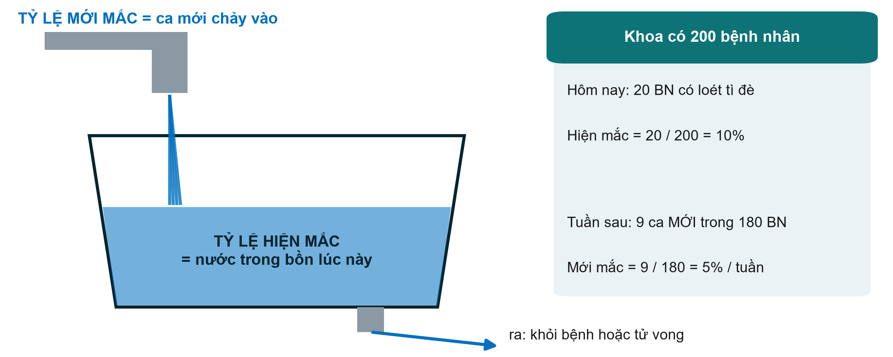{.neu-fig}

::: {.neu-takeaway}
**THÔNG ĐIỆP CHÍNH** Hiện mắc = bao nhiêu người đang mắc; mới mắc = bao nhiêu ca mới theo thời gian.
:::

::: {.notes}
Nước chảy vào từ vòi = ca mới = tỷ lệ mới mắc (incidence). Nước trong bồn lúc này = ca hiện có = tỷ lệ hiện mắc (prevalence). Nước thoát qua lỗ xả = bệnh nhân khỏi bệnh hoặc tử vong.

Ví dụ bên phải: 20 trong 200 bệnh nhân của khoa có loét tì đè hôm nay, hiện mắc 10%. Trong 180 người chưa bị, 9 người bị loét mới trong tuần tới, mới mắc 5%/tuần. Lưu ý mẫu số của tỷ lệ mới mắc: chỉ những người CÓ NGUY CƠ (chưa mắc lúc bắt đầu).

Ý chính: bệnh kéo dài có thể có hiện mắc cao dù mới mắc thấp (đái tháo đường); bệnh ngắn có thể có mới mắc cao nhưng hiện mắc thấp (cảm lạnh, các đợt mê sảng ngắn).

Quan niệm sai: dùng lẫn lộn hiện mắc và mới mắc. Tỷ lệ mới mắc luôn gắn với một khoảng thời gian.

Hỏi cả lớp: nếu ta giữ bệnh nhân mắc một bệnh mạn tính sống lâu hơn nhưng không phòng bệnh tốt hơn, tỷ lệ hiện mắc thay đổi thế nào? Dự kiến: tăng, vì lỗ xả chảy chậm lại.

Thời gian: 3 phút.
:::

## Nguy cơ ở hai nhóm, bằng hình ảnh

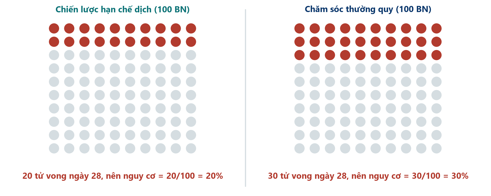{.neu-fig}

::: {.neu-caption}
Thử nghiệm giả định dùng cho giảng dạy: 100 bệnh nhân mỗi nhóm
:::

::: {.neu-takeaway}
**THÔNG ĐIỆP CHÍNH** Nguy cơ = số người có kết cục / số người trong nhóm.
:::

::: {.notes}
Một thử nghiệm giả định, lớn hơn, cho câu hỏi xuyên suốt, không phải số liệu của Boulet. 100 bệnh nhân mỗi nhóm. Hạn chế dịch: 20 tử vong đến ngày 28. Thường quy: 30 tử vong.

Nguy cơ (risk) là số đo đơn giản nhất: 20/100 = 20% và 30/100 = 30%. Hình như thế này (biểu đồ biểu tượng) cũng là cách tốt nhất để giải thích nguy cơ cho bệnh nhân và gia đình.

Ý chính: luôn hỏi 'trên tổng số bao nhiêu?' Một tiêu đề '10 ca tử vong nhiều hơn' vô nghĩa nếu không có mẫu số.

Quan niệm sai: nguy cơ và odds. Nguy cơ tính trên mọi người trong nhóm (20 trên 100). Odds so sánh người có kết cục với người không có (20 so với 80). Ta sẽ cần cả hai ngay sau đây.

Hỏi cả lớp: odds tử vong ở nhóm hạn chế dịch là bao nhiêu? Dự kiến: 20 so với 80, tức 0,25.

Thời gian: 2,5 phút.
:::

## Bảng 2x2: một công cụ cho mọi số đo

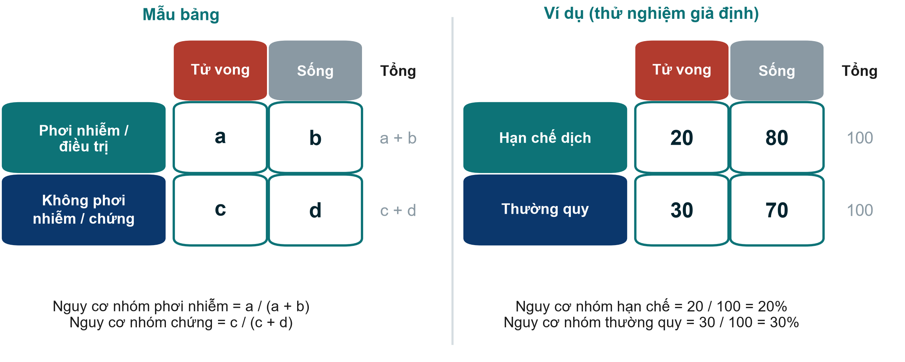{.neu-fig}

::: {.neu-takeaway}
**THÔNG ĐIỆP CHÍNH** Phơi nhiễm ở hàng, kết cục ở cột: a, b, c, d.
:::

::: {.notes}
Yêu cầu một cách trình bày và giữ mãi: phơi nhiễm (hoặc điều trị) ở hàng, nhóm phơi nhiễm ở trên; kết cục ở cột, 'có kết cục' ở bên trái. Khi đó a, b, c, d luôn mang cùng ý nghĩa.

Ví dụ: a = 20, b = 80, c = 30, d = 70. Tổng hàng 100 và 100.

Ý chính: gần như mọi số đo mối liên quan cho kết cục có/không đều đến từ bốn con số này. Bảng tính trong phần trình diễn dùng đúng cách trình bày này.

Quan niệm sai: đảo hàng và cột. Nhiều lỗi trong bài làm của học viên đến từ bảng vẽ ngược. Kiểm tra cách trình bày trước khi tính.

Hỏi cả lớp: trong bảng tử vong ngày 28 của Boulet, a, b, c và d là bao nhiêu? Dự kiến: a = 6, b = 18, c = 6, d = 18 (mỗi nhóm 6/24 tử vong).

Thời gian: 2,5 phút.
:::

## Bốn số đo từ một bảng 2x2

::: {.neu-intro}
Ví dụ: hạn chế dịch 20/100 tử vong, thường quy 30/100 tử vong
:::

:::: {.neu-cards style="--n:4"}
::: {.neu-card .plain style="--c:#0D7377"}
[Tỷ số nguy cơ (RR)]{.neu-card-title}

- \[a/(a+b)\] / \[c/(c+d)\]
- **20% / 30% = 0,67**
- nguy cơ thấp hơn 1/3
:::
::: {.neu-card .plain style="--c:#0B376C"}
[Hiệu số nguy cơ (RD)]{.neu-card-title}

- a/(a+b) - c/(c+d)
- **20% - 30% = -10 điểm**
- ít hơn 10 ca tử vong/100
:::
::: {.neu-card .plain style="--c:#2E8B57"}
[NNT]{.neu-card-title}

- 1 / \|hiệu số nguy cơ\|
- **1 / 0,10 = 10**
- điều trị 10 để ngăn 1 ca tử vong
:::
::: {.neu-card .plain style="--c:#0070C0"}
[Tỷ số chênh (OR)]{.neu-card-title}

- (a x d) / (b x c)
- **(20x70)/(80x30) = 0,58**
- odds, không phải nguy cơ
:::
::::

::: {.neu-takeaway}
**THÔNG ĐIỆP CHÍNH** Tỷ số cho biết mạnh đến đâu; hiệu số cho biết bao nhiêu bệnh nhân.
:::

::: {.notes}
Đi từng thẻ, luôn quay về bảng 2x2.

RR = 0,20 / 0,30 = 0,67: nguy cơ tử vong thấp hơn một phần ba khi hạn chế dịch. RR = 1 là không khác biệt; dưới 1 là bảo vệ; trên 1 là có hại.

RD = 0,20 - 0,30 = -0,10: ít hơn 10 ca tử vong trên 100 bệnh nhân được điều trị. Còn gọi là giảm nguy cơ tuyệt đối (ARR = 10%).

NNT (số người cần điều trị) = 1 / 0,10 = 10: điều trị 10 bệnh nhân để ngăn một ca tử vong. Nếu phơi nhiễm có hại, phép tính tương tự cho số người cần để gây hại (NNH).

OR = (20 x 70) / (80 x 30) = 1400 / 2400 = 0,58. Xa 1 hơn RR. Các slide sau giải thích vì sao.

Quan niệm sai: tác động tương đối nghe lớn hơn. 'Thấp hơn một phần ba' và 'ít hơn 10 ca/100' là cùng một kết quả; bệnh nhân và nhà quản lý cần con số tuyệt đối.

Hỏi cả lớp: nếu nguy cơ nền là 3% thay vì 30%, với cùng RR 0,67, NNT là bao nhiêu? Dự kiến: nguy cơ 2% so với 3%, hiệu số 1%, NNT = 100.

Thời gian: 5 phút.
:::

## NNT bằng hình ảnh

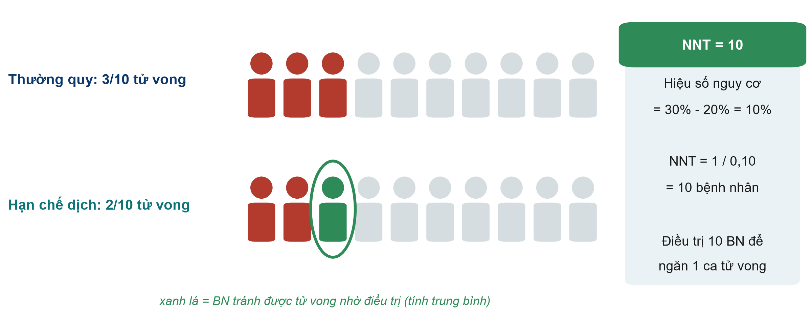{.neu-fig}

::: {.neu-takeaway}
**THÔNG ĐIỆP CHÍNH** NNT = 1 / hiệu số nguy cơ: cần điều trị bao nhiêu người để một người có lợi.
:::

::: {.notes}
Thu nhỏ 100 bệnh nhân xuống 10. Với chăm sóc thường quy 3/10 tử vong. Với chiến lược hạn chế dịch 2/10 tử vong. Người màu xanh lá là bệnh nhân, tính trung bình, đã tránh được tử vong nhờ điều trị. Vậy ta điều trị 10 bệnh nhân để một người có lợi: NNT = 10.

Ý chính: 9 người còn lại hoặc đằng nào cũng sống, hoặc đằng nào cũng tử vong. Họ chịu gánh nặng điều trị mà không được lợi. Vì vậy NNT là công cụ trao đổi hữu ích với bệnh nhân, nhà quản lý và khoa dược.

Quan niệm sai: 'NNT bằng 10 nghĩa là 1/10 bệnh nhân đáp ứng'. Đó là trung bình của cả nhóm, không phải dự đoán cho một bệnh nhân.

Hỏi cả lớp: NNT 5 hay NNT 50 tốt hơn? Dự kiến: 5. Cần điều trị ít người hơn để một người có lợi (nhưng luôn cân nhắc với tác hại và chi phí).

Thời gian: 2,5 phút.
:::

## Khi nào tỷ số chênh gần bằng tỷ số nguy cơ?

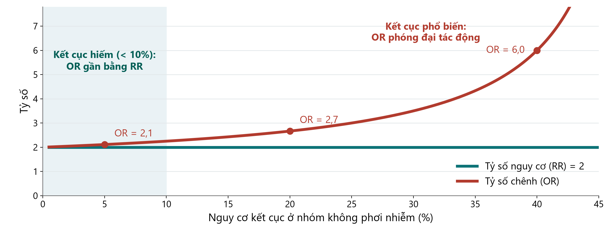{.neu-fig}

::: {.neu-takeaway}
**THÔNG ĐIỆP CHÍNH** OR chỉ gần bằng RR khi kết cục hiếm (dưới khoảng 10%).
:::

::: {.notes}
Ở đây phơi nhiễm thực sự làm nguy cơ tăng gấp đôi (RR = 2, đường xanh). Đường đỏ là OR với cùng dữ liệu khi kết cục ngày càng phổ biến.

Khi kết cục hiếm (bên trái, vùng tô), OR khoảng 2,1, gần như bằng RR. Ở nguy cơ nền 20%, OR = 2,7. Ở 40%, OR = 6. OR luôn nằm xa 1 hơn RR.

Ý chính: nghiên cứu bệnh-chứng và hồi quy logistic cho ra OR. Khi bài báo báo cáo OR cho kết cục phổ biến, như tử vong ICU 20-40%, đừng đọc thành 'nguy cơ gấp X lần'.

Quan niệm sai: 'OR bằng 2 nghĩa là nguy cơ gấp đôi'. Chỉ đúng với kết cục hiếm.

Hỏi cả lớp: trong ví dụ của ta (tử vong 20% và 30%), OR là 0,58 còn RR là 0,67. Vì sao khác nhau? Dự kiến: tử vong phổ biến trong quần thể này, nên OR phóng đại tác động.

Thời gian: 2,5 phút.
:::

## Kiểm tra nhanh: thêm một bảng 2x2

::: {.neu-banner style="--c:#6C3483"}
CÂU HỎI NHANH · 3 phút
:::

:::: {.columns}
::: {.column width="60%"}
::: {.neu-activity-steps style="--c:#6C3483"}
1. Mỗi nhóm 200 BN: 20 tử vong với điều trị mới, 30 với thường quy
2. Nguy cơ ở mỗi nhóm?
3. RR? Hiệu số nguy cơ? NNT?
4. Câu thêm: OR = (a x d) / (b x c)?
:::
:::
::: {.column width="40%"}
::: {.neu-side .plain style="--c:#6C3483"}
Bảng

- a = 20, b = 180
- c = 30, d = 170
:::
:::
::::

::: {.neu-output style="--c:#6C3483"}
**SẢN PHẨM** Nguy cơ, RR, RD và NNT (đáp án trong ghi chú)
:::

::: {.notes}
1,5 phút tự làm, rồi công bố. Vẽ bảng 2x2 lên bảng khi mọi người làm.

Đáp án. Nguy cơ: 20/200 = 10% và 30/200 = 15%. RR = 0,10 / 0,15 = 0,67. RD = 10% - 15% = -5 điểm phần trăm. NNT = 1 / 0,05 = 20. Câu thêm OR = (20 x 170) / (180 x 30) = 3400 / 5400 = 0,63.

Ý chính: cùng RR (0,67) như ví dụ mẫu, nhưng nguy cơ nền thấp hơn (15% thay vì 30%), nên NNT tăng gấp đôi từ 10 lên 20.

Thời gian: 3 phút.
:::

## Trình diễn trực tiếp: công cụ tính bảng 2x2

::: {.neu-banner style="--c:#B5651D"}
TRÌNH DIỄN TRỰC TIẾP · 8 phút
:::

:::: {.columns}
::: {.column width="60%"}
::: {.neu-activity-steps style="--c:#B5651D"}
1. Mở 2x2\_calculator.xlsx, trang Association
2. Nhập a, b, c, d của ví dụ: 20, 80, 30, 70
3. Đọc nguy cơ, RR, RD, NNT, OR, và các câu diễn giải
4. Đổi số tử vong thành 2 và 3 trên 100: xem OR tiến gần RR
5. Chỉ vào dòng chữ đỏ: dữ liệu bệnh-chứng chỉ cho OR
:::
:::
::: {.column width="40%"}
::: {.neu-side .plain style="--c:#B5651D"}
Chú ý

- Cùng cách trình bày như slide
- Tác động tương đối và tuyệt đối
- Kết cục hiếm: OR gần RR
:::
:::
::::

::: {.neu-output style="--c:#B5651D"}
**SẢN PHẨM** Mọi người thấy mọi số đo được tính từ một bảng
:::

::: {.notes}
Kịch bản: Course/Demos/s4\_demo.md. Tệp: Course/Resources/tools/2x2\_calculator.xlsx (đã điền sẵn ví dụ).

Ý chính: bảng tính lo phần số học; con người lo phần diễn giải. Đọc to các ô diễn giải bằng lời.

Khoảnh khắc then chốt: đổi a thành 2 và c thành 3 (b = 98, d = 97). RR vẫn 0,67 nhưng OR giờ là 0,66, gần như bằng nhau. NNT nhảy lên 100. Cùng tác động tương đối, tác động tuyệt đối rất khác.

Phương án dự phòng nếu máy tính hỏng: vẽ bảng 2x2 lên bảng và cùng cả lớp tính RR và NNT bằng tay. Các con số được chọn để dễ tính.

Quan niệm sai cần nêu: công cụ vẫn tính ra 'nguy cơ' cho dữ liệu bệnh-chứng. Ở đó nó vô nghĩa: chỉ OR là hợp lệ.

Thời gian: 8 phút. Trang Diagnostic được trình chiếu nhanh ở phần 4.3. Sau đó giải lao.
:::

## Giải lao

::: {.neu-banner style="--c:#8A99A3"}
GIẢI LAO · 15 phút
:::

::: {.neu-activity-steps style="--c:#8A99A3"}
1. Vận động, uống cà phê, hít thở không khí
2. Sau giải lao: hai bài tính bảng 2x2, hãy chuẩn bị bút
3. Rồi phần 4.3: vượt ra ngoài một nghiên cứu
:::

::: {.notes}
Giải lao 15 phút. Chiếu đồng hồ đếm ngược trên màn hình.

Trong giờ giải lao, đi qua các nhóm và kiểm tra mỗi nhóm có Phần 2a từ thứ Bảy tuần trước. Họ sẽ cần nó khi xây dựng đề cương.

Bắt đầu lại đúng giờ.
:::

## Đến lượt bạn: hai bài tính bảng 2x2

::: {.neu-banner style="--c:#0B376C"}
BÀI TẬP CÁ NHÂN · 20 phút
:::

:::: {.columns}
::: {.column width="60%"}
::: {.neu-activity-steps style="--c:#0B376C"}
1. Tài liệu Phần C: vẽ mỗi bảng 2x2 trước, phơi nhiễm ở hàng
2. Bài 1 (thử nghiệm): nguy cơ, RR, RD, NNT, OR, và một câu diễn giải
3. Bài 2 (bệnh-chứng): chỉ tính OR, và giải thích vì sao không tính RR
4. Đối chiếu với người bên cạnh, rồi với công cụ tính
:::
:::
::: {.column width="40%"}
::: {.neu-side .plain style="--c:#0B376C"}
Ghi nhớ

- Nguy cơ = a / (a + b)
- RR = nguy cơ / nguy cơ
- NNT = 1 / hiệu số nguy cơ
- OR = (a x d) / (b x c)
:::
:::
::::

::: {.neu-output style="--c:#0B376C"}
**SẢN PHẨM** Hai bảng 2x2 hoàn chỉnh với kết quả được diễn giải
:::

::: {.notes}
Bài 1 (thử nghiệm đệm giảm áp mới): 10/200 so với 20/200 ca loét tì đè. Nguy cơ 5% và 10%; RR = 0,50; RD = -5 điểm phần trăm; NNT = 20; OR = (10 x 180) / (190 x 20) = 0,47 (gần RR vì kết cục không phổ biến).

Bài 2 (bệnh-chứng, nhiễm Candida máu ở ICU và nuôi ăn tĩnh mạch): nhóm bệnh 24 có phơi nhiễm / 16 không; nhóm chứng 16 có / 64 không. OR = (24 x 64) / (16 x 16) = 6,0. Không tính được RR vì nhà nghiên cứu tự chọn số ca bệnh và ca chứng.

Đi vòng quanh lớp và kiểm tra bảng được vẽ đúng chiều. Phần lớn lỗi là do cách trình bày, không phải số học.

Thời gian: 12 phút làm bài (đối chiếu với người bên cạnh sau mỗi bài), 8 phút công bố và thảo luận đáp án với công cụ tính. Đáp án đầy đủ ở Solutions/s4\_solutions.md.
:::

## 4.3  Vượt ra ngoài một nghiên cứu

:::: {.neu-statement}
::: {.neu-big}
Một nghiên cứu hiếm khi là câu trả lời.
:::

::: {.neu-sub}
Xét nghiệm chẩn đoán, tổng quan hệ thống và phân tích gộp, và cách thẩm định chúng. (30 phút)
:::
::::

::: {.notes}
Đánh dấu phần 4.3 (30 phút, gồm 6 phút làm theo cặp).

Ba khối: độ chính xác chẩn đoán (độ nhạy, độ đặc hiệu, giá trị tiên đoán, đường cong ROC), tổng quan hệ thống và phân tích gộp (sơ đồ PRISMA, biểu đồ rừng, tính không đồng nhất), và công cụ đánh giá nguy cơ sai lệch (công cụ nào cho thiết kế nào).

Ý chính: mọi thứ ở đây là để đánh giá bằng chứng, những kỹ năng học viên sẽ dùng ở Buổi 8 trong phần 'Làm người phản biện'.

Thời gian: 30 giây. Giữ nhịp nhanh: khoảng 1,5-2 phút mỗi slide.
:::

## Độ chính xác chẩn đoán: nhìn lại độ nhạy và độ đặc hiệu

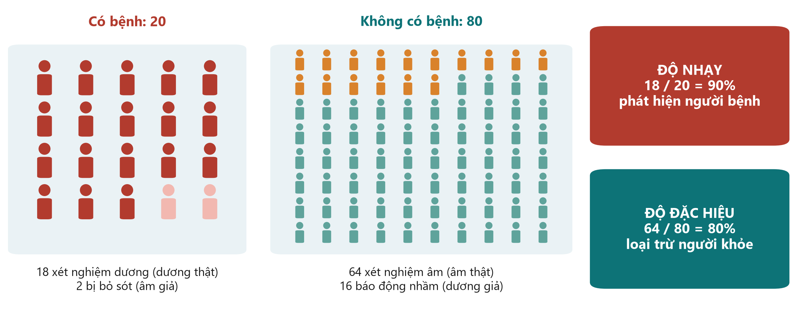{.neu-fig}

::: {.neu-takeaway}
**THÔNG ĐIỆP CHÍNH** Độ nhạy phát hiện người bệnh; độ đặc hiệu loại trừ người khỏe.
:::

::: {.notes}
Quay lại bảng 2x2, lần này cho một xét nghiệm. 100 bệnh nhân, 20 người thực sự có bệnh.

Độ nhạy (sensitivity): trong 20 người CÓ bệnh, xét nghiệm phát hiện 18 = 90%. Xét nghiệm có độ nhạy cao hiếm khi bỏ sót bệnh, nên kết quả ÂM TÍNH giúp loại trừ bệnh.

Độ đặc hiệu (specificity): trong 80 người KHÔNG có bệnh, 64 người xét nghiệm âm tính = 80%. Xét nghiệm có độ đặc hiệu cao hiếm khi báo động nhầm, nên kết quả DƯƠNG TÍNH giúp khẳng định bệnh.

Xem trước slide sau: trong 34 xét nghiệm dương tính, chỉ 18 người thực sự có bệnh, giá trị tiên đoán dương (PPV) 53%. PPV phụ thuộc vào mức độ phổ biến của bệnh.

Quan niệm sai: 'xét nghiệm có độ nhạy 90% nghĩa là người dương tính có 90% khả năng mắc bệnh'. Không. Đó là PPV, ở đây chỉ 53%.

Hỏi cả lớp: với xét nghiệm sàng lọc mà ta không muốn bỏ sót nhiễm khuẩn huyết, ưu tiên độ nhạy hay độ đặc hiệu? Dự kiến: độ nhạy.

Thời gian: 2,5 phút.
:::

## Cùng xét nghiệm, khác bối cảnh: PPV phụ thuộc tỷ lệ hiện mắc

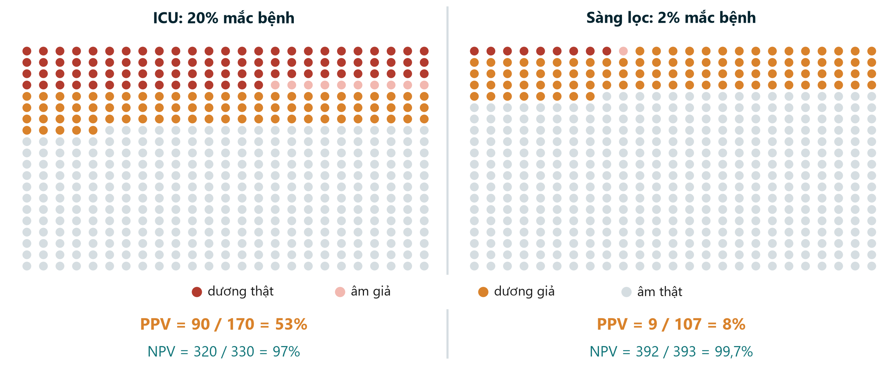{.neu-fig}

::: {.neu-takeaway}
**THÔNG ĐIỆP CHÍNH** Kết quả dương tính có ít ý nghĩa hơn nhiều khi bệnh hiếm gặp.
:::

::: {.notes}
Cùng một xét nghiệm (độ nhạy 90%, độ đặc hiệu 80%) dùng cho 500 người ở hai bối cảnh.

ICU, nơi 20% mắc bệnh: 90 dương thật, 80 dương giả, nên kết quả dương tính đúng 90 / 170 = 53% số lần.

Sàng lọc, nơi 2% mắc bệnh: 9 dương thật nhưng 98 dương giả: PPV 9 / 107 = 8%. Hơn 9/10 kết quả dương là báo động nhầm. Trong khi đó NPV tăng lên 99,7%.

Ý chính: độ nhạy và độ đặc hiệu thuộc về xét nghiệm; PPV và NPV thuộc về xét nghiệm TRONG MỘT QUẦN THỂ. Đừng bao giờ mượn PPV từ một nghiên cứu ở bối cảnh khác.

Quan niệm sai: 'xét nghiệm tốt thì tốt ở mọi nơi'. Sàng lọc quần thể khỏe mạnh bằng xét nghiệm có độ đặc hiệu vừa phải tạo ra nhiều dương giả và nhiều thăm dò không cần thiết.

Hỏi cả lớp: vì sao chương trình sàng lọc dùng thêm một xét nghiệm thứ hai đặc hiệu hơn trước khi can thiệp? Dự kiến: để loại bỏ dương giả do tỷ lệ hiện mắc thấp.

Tùy chọn (1 phút): mở ô 'PPV ở tỷ lệ hiện mắc khác' trên trang Diagnostic của công cụ tính 2x2, rồi nhập 2% và 20%.

Thời gian: 3 phút.
:::

## Đường cong ROC và AUC

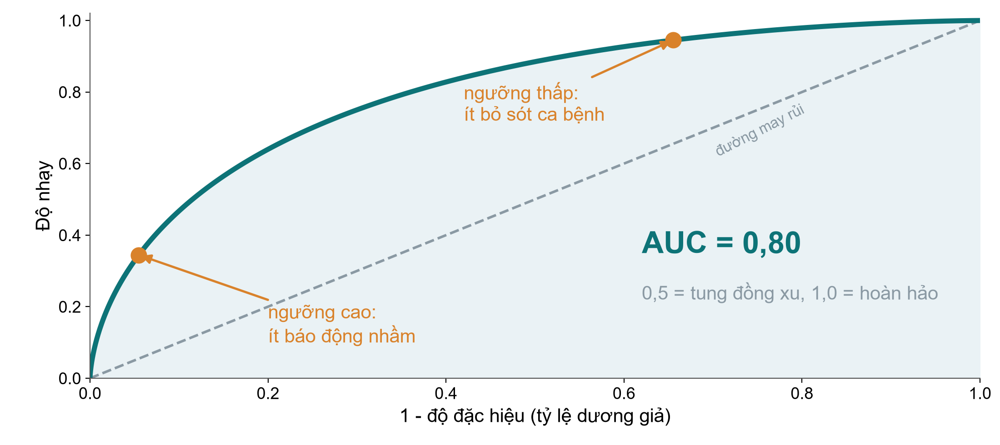{.neu-fig}

::: {.neu-takeaway}
**THÔNG ĐIỆP CHÍNH** Mỗi ngưỡng đổi độ nhạy lấy độ đặc hiệu; AUC tóm tắt toàn bộ đường cong.
:::

::: {.notes}
Nhiều xét nghiệm cho ra một con số (lactate, procalcitonin, một thang điểm nguy cơ). Mỗi ngưỡng cắt cho một cặp độ nhạy và độ đặc hiệu. Đường cong ROC vẽ tất cả: độ nhạy theo trục đứng, tỷ lệ dương giả (1 - độ đặc hiệu) theo trục ngang.

Ngưỡng thấp phát hiện gần như mọi ca nhưng gây nhiều báo động nhầm (góc trên phải). Ngưỡng cao ít báo động nhầm nhưng bỏ sót ca bệnh (góc dưới trái). Ngưỡng tốt nhất tùy vào cái giá của việc bỏ sót so với báo động nhầm.

Diện tích dưới đường cong (AUC, còn gọi là chỉ số c) tóm tắt khả năng phân biệt: 0,5 = tung đồng xu (đường nét đứt), 1,0 = hoàn hảo. Xét nghiệm mô phỏng này có AUC 0,80.

Quan niệm sai: 'AUC cho biết nên dùng ngưỡng nào'. Không; nó mô tả toàn bộ đường cong. AUC sẽ xuất hiện lại ở Buổi 6 với mô hình dự báo.

Hỏi cả lớp: để loại trừ nhiễm khuẩn huyết ở phân loại cấp cứu, chọn ngưỡng thấp hay cao? Dự kiến: thấp, để có độ nhạy cao, chấp nhận nhiều báo động nhầm hơn.

Thời gian: 3 phút.
:::

## Sơ đồ PRISMA: từ 1.300 bản ghi đến 9 nghiên cứu

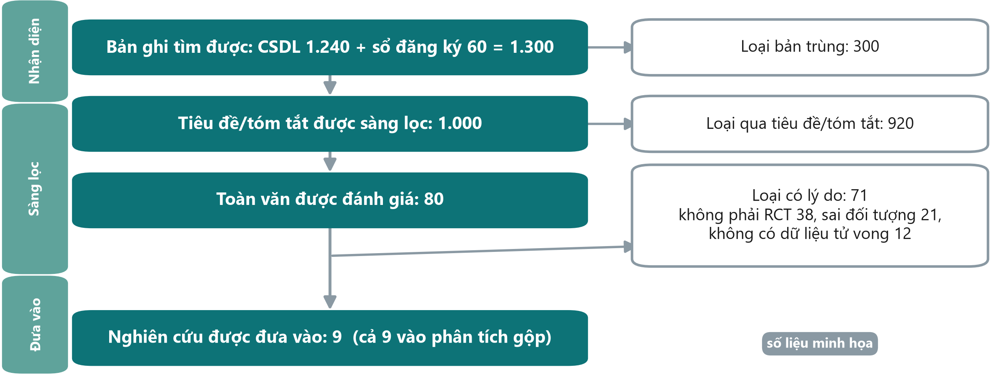{.neu-fig}

::: {.neu-takeaway}
**THÔNG ĐIỆP CHÍNH** Sơ đồ PRISMA cho thấy cách tìm, sàng lọc và loại nghiên cứu, kèm lý do.
:::

::: {.notes}
Số liệu minh họa. Mọi tổng quan hệ thống nên có sơ đồ này (PRISMA 2020).

Nhận diện: 1.240 bản ghi từ cơ sở dữ liệu cộng 60 từ sổ đăng ký thử nghiệm = 1.300; loại 300 bản trùng.

Sàng lọc: 1.000 tiêu đề và tóm tắt được sàng lọc, loại 920; đọc 80 toàn văn, loại 71 có lý do (38 không phải RCT, 21 sai đối tượng, 12 không có dữ liệu tử vong, cộng lại đúng 71).

Đưa vào: 9 nghiên cứu, cả 9 vào phân tích gộp.

Ý chính: hai người sàng lọc độc lập, và đề cương được đăng ký trước (PROSPERO). Sơ đồ giúp người đọc đánh giá liệu có nghiên cứu liên quan bị bỏ sót không.

Quan niệm sai: 'càng nhiều nghiên cứu được đưa vào thì tổng quan càng tốt'. Tiêu chuẩn chọn chặt chẽ, rõ ràng quan trọng hơn số lượng.

Hỏi cả lớp: vì sao tìm trong sổ đăng ký thử nghiệm chứ không chỉ PubMed? Dự kiến: để tìm thử nghiệm chưa công bố hoặc kết quả âm tính, do sai lệch công bố (tài liệu xám ở Buổi 2).

Thời gian: 2,5 phút.
:::

## Đọc biểu đồ rừng trong bốn bước

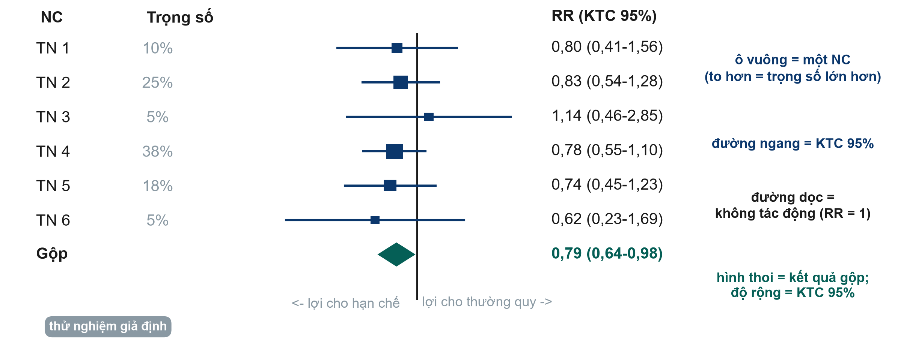{.neu-fig}

::: {.neu-takeaway}
**THÔNG ĐIỆP CHÍNH** Ô vuông = nghiên cứu, đường ngang = KTC, hình thoi = kết quả gộp, đường dọc = không tác động.
:::

::: {.notes}
Các thử nghiệm giả định, gộp theo mô hình tác động cố định (nghịch đảo phương sai). Đọc trong bốn bước. (1) Tìm đường dọc không tác động: RR = 1. Bên trái có lợi cho hạn chế dịch; bên phải có lợi cho thường quy. (2) Mỗi ô vuông là RR của một nghiên cứu; kích thước thể hiện trọng số (TN 4 lớn nhất, 38%). (3) Mỗi đường ngang là KTC 95% của nghiên cứu đó. Nếu cắt 1, riêng nghiên cứu đó chưa kết luận được. Ở đây mọi thử nghiệm đều cắt 1. (4) Hình thoi là ước lượng gộp: RR 0,79 (KTC 95% 0,64-0,98). Độ rộng là KTC; nó không cắt 1.

Ý chính: gộp nhiều thử nghiệm chưa kết luận có thể cho câu trả lời chính xác. Đó là thế mạnh của phân tích gộp. Bằng lời: nguy cơ tử vong tương đối thấp hơn khoảng 21%, dù giới hạn trên (0,98) gần mức không tác động.

Quan niệm sai: 'thử nghiệm có KTC cắt 1 cho thấy không có tác động'. Nó cho thấy sự không chắc chắn, không phải sự vắng mặt của tác động.

Hỏi cả lớp: thử nghiệm nào đóng góp nhiều nhất, vì sao? Dự kiến: TN 4, lớn nhất, nhiều biến cố nhất, nên KTC hẹp nhất.

Thời gian: 3,5 phút. Tài liệu phát tay dùng biểu đồ này cho bài làm theo cặp.
:::

## Tính không đồng nhất: các nghiên cứu có thống nhất?

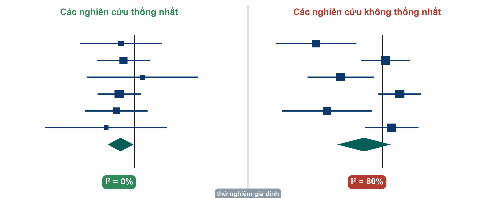{.neu-fig}

::: {.neu-takeaway}
**THÔNG ĐIỆP CHÍNH** I bình phương cao nghĩa là các nghiên cứu bất đồng: tìm lý do trước khi tin hình thoi.
:::

::: {.notes}
Trái: sáu thử nghiệm ở slide trước cùng một hướng; KTC chồng lên nhau; I bình phương (I²) = 0%. Gộp là hợp lý.

Phải: sáu thử nghiệm giả định khác bất đồng. Một số rõ ràng có lợi cho hạn chế dịch, số khác theo hướng ngược lại. I² = 80%: khoảng 80% biến thiên giữa các nghiên cứu phản ánh khác biệt thật chứ không phải may rủi. Hình thoi theo mô hình tác động ngẫu nhiên rộng và cắt 1 (RR 0,74, KTC 95% 0,47-1,15).

Hướng dẫn gần đúng (Cochrane): I² khoảng 0-40% có thể không quan trọng, 30-60% trung bình, 50-90% đáng kể, 75-100% rất lớn. Các khoảng chồng nhau có chủ ý: hãy đánh giá cùng biểu đồ.

Ý chính: khi không đồng nhất cao, câu hỏi hữu ích nhất là VÌ SAO: khác bệnh nhân, liều, thời điểm, định nghĩa kết cục hay nguy cơ sai lệch? Một con số gộp duy nhất có thể che giấu điều đó.

Quan niệm sai: 'mô hình tác động ngẫu nhiên sửa được tính không đồng nhất'. Nó chỉ làm KTC rộng hơn; không giải thích gì.

Hỏi cả lớp: nêu một lý do các thử nghiệm hạn chế dịch có thể bất đồng. Dự kiến: quần thể khác nhau (nhiễm khuẩn huyết hay phẫu thuật), quy trình hạn chế khác nhau, thời điểm khác nhau.

Thời gian: 3 phút.
:::

## Công cụ đánh giá nguy cơ sai lệch nào cho thiết kế nào?

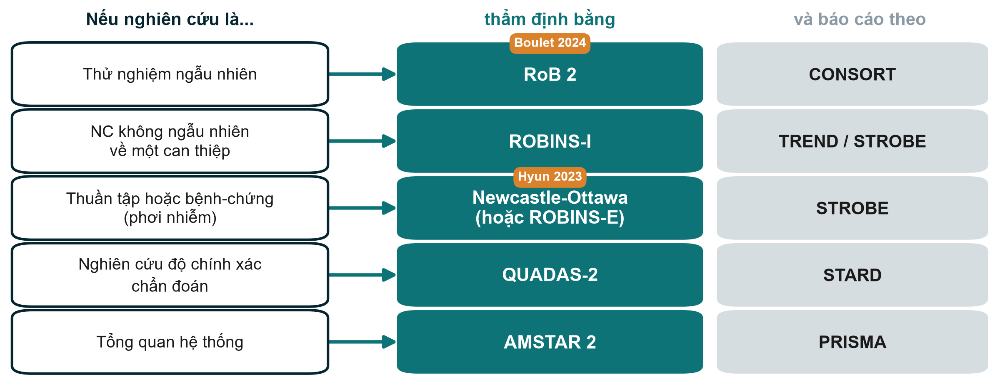{.neu-fig}

::: {.neu-takeaway}
**THÔNG ĐIỆP CHÍNH** Chọn công cụ thẩm định phù hợp với thiết kế, và cả hướng dẫn báo cáo.
:::

::: {.notes}
Công cụ đánh giá nguy cơ sai lệch là cách có cấu trúc để hỏi 'thiết kế hay cách thực hiện có thể làm méo kết quả này không?'. Mỗi thiết kế có công cụ riêng.

Thử nghiệm ngẫu nhiên: RoB 2 (Cochrane), dùng cho Boulet. Nghiên cứu không ngẫu nhiên về can thiệp (trước-sau, thuần tập so sánh điều trị): ROBINS-I. Nghiên cứu thuần tập và bệnh-chứng về phơi nhiễm: thang Newcastle-Ottawa vẫn được dùng rộng rãi; ROBINS-E là lựa chọn mới hơn, chặt chẽ hơn (dùng cho Hyun). Nghiên cứu độ chính xác chẩn đoán: QUADAS-2. Bản thân tổng quan hệ thống: AMSTAR 2.

Cột bên phải nối lại: mỗi thiết kế cũng có hướng dẫn báo cáo (CONSORT, TREND/STROBE, STROBE, STARD, PRISMA), học ở Buổi 8.

Ý chính: hướng dẫn báo cáo kiểm tra điều gì đã được BÁO CÁO; công cụ nguy cơ sai lệch đánh giá kết quả ĐÁNG TIN đến đâu. Một nghiên cứu báo cáo tốt vẫn có thể có nguy cơ sai lệch cao.

Quan niệm sai: 'cộng số sao là ra chất lượng'. Điểm tổng che mất lĩnh vực nào thất bại; đánh giá theo từng lĩnh vực hữu ích hơn.

Hỏi cả lớp: thẩm định một nghiên cứu cải tiến chất lượng trước-sau về gói xử trí nhiễm khuẩn huyết, dùng công cụ nào? Dự kiến: ROBINS-I.

Thời gian: 2,5 phút.
:::

## Câu hỏi cuối: kết luận có được dữ liệu ủng hộ?

::: {.neu-intro}
Câu 7-9 trong bảng kiểm thẩm định 10 câu của khóa học (Buổi 8)
:::

:::: {.neu-cards style="--n:3"}
::: {.neu-card .plain style="--c:#0D7377"}
[Lời lẽ khớp thiết kế]{.neu-card-title}

- 'Gây ra' cần ngẫu nhiên hóa
- Quan sát: 'có liên quan với'
- Thí điểm: khả thi, không phải hiệu quả
:::
::: {.neu-card .plain style="--c:#0B376C"}
[Con số khớp lời lẽ]{.neu-card-title}

- Cỡ tác động kèm KTC 95%
- Tương đối VÀ tuyệt đối
- Không 'xu hướng' khi p = 0,42
:::
::: {.neu-card .plain style="--c:#B23B2E"}
[Trung thực, không tô vẽ]{.neu-card-title}

- Kết cục chính báo cáo trước
- Nêu rõ hạn chế chính
- Kết luận = kết quả chính
:::
::::

::: {.neu-takeaway}
**THÔNG ĐIỆP CHÍNH** Đọc kết luận sau cùng, và đối chiếu với thiết kế và con số.
:::

::: {.notes}
Slide này khép lại khối thẩm định và nối với bảng kiểm 10 câu dùng ở Buổi 8 ('Làm người phản biện').

Lời lẽ và thiết kế: kết luận của Boulet ('không làm giảm cân bằng dịch chung ở ngày 5') khớp với thiết kế RCT thí điểm. Tóm tắt của Hyun nói 'có liên quan', nhưng tiêu đề dùng chữ 'Impact' (tác động), mạnh hơn mức một nghiên cứu thuần tập cho phép.

Con số và lời lẽ: kết quả chính có được trình bày bằng cỡ tác động kèm KTC 95% không? Kết quả không có ý nghĩa (p = 0,42) có được mô tả trung thực, không dùng 'có xu hướng' không?

Tô vẽ (spin): kết cục chính có được báo cáo trước và kết luận dựa trên nó, thay vì một kết cục phụ hay phân nhóm thuận lợi không?

Hỏi cả lớp: tìm một chữ trong tiêu đề hoặc tóm tắt nói quá. Dự kiến: 'tác động', 'hiệu quả', 'làm giảm' hoặc 'phòng ngừa' trong nghiên cứu quan sát.

Thời gian: 2,5 phút.
:::

## Làm theo cặp: đọc biểu đồ rừng, chọn công cụ

::: {.neu-banner style="--c:#1F5C7A"}
THẢO LUẬN · 6 phút
:::

:::: {.columns}
::: {.column width="60%"}
::: {.neu-activity-steps style="--c:#1F5C7A"}
1. Tài liệu Phần E: biểu đồ rừng của sáu thử nghiệm về dịch truyền
2. Thử nghiệm nào có trọng số lớn nhất? Có thử nghiệm riêng lẻ nào cho tác động rõ không?
3. Hình thoi có cắt RR = 1 không? Nói kết quả bằng một câu
4. Chọn công cụ đánh giá sai lệch cho Boulet, cho Hyun và cho một tổng quan về dịch truyền
:::
:::
::: {.column width="40%"}
::: {.neu-side .plain style="--c:#1F5C7A"}
Nhắc lại

- Ô vuông = một nghiên cứu
- Đường ngang = KTC 95%
- Hình thoi = kết quả gộp
- RoB 2, ROBINS-I, NOS, QUADAS-2, AMSTAR 2
:::
:::
::::

::: {.neu-output style="--c:#1F5C7A"}
**SẢN PHẨM** Một câu về kết quả gộp + ba công cụ được gọi tên
:::

::: {.notes}
4 phút làm theo cặp, 2 phút thu thập câu trả lời.

Đáp án: TN 4 có trọng số lớn nhất (38%). Không thử nghiệm riêng lẻ nào loại trừ được RR = 1: mọi KTC đều cắt 1. Hình thoi (RR 0,79, KTC 95% 0,64-0,98) không cắt 1: gộp lại, hạn chế dịch liên quan với nguy cơ tử vong tương đối thấp hơn khoảng 21% trong các thử nghiệm (giả định) này, với giới hạn trên gần mức không tác động. Công cụ: RoB 2 cho Boulet; Newcastle-Ottawa (hoặc ROBINS-E) cho Hyun; AMSTAR 2 cho tổng quan.

Nếu thiếu thời gian, chỉ làm câu 3 và 4.

Lỗi thường gặp: chỉ đọc tâm hình thoi mà bỏ qua độ rộng. Luôn nêu KTC.

Thời gian: 6 phút, rồi chuyển sang xây dựng đề cương.
:::

## Kết cục: một kết cục chính, định nghĩa bằng cái gì, thế nào, khi nào

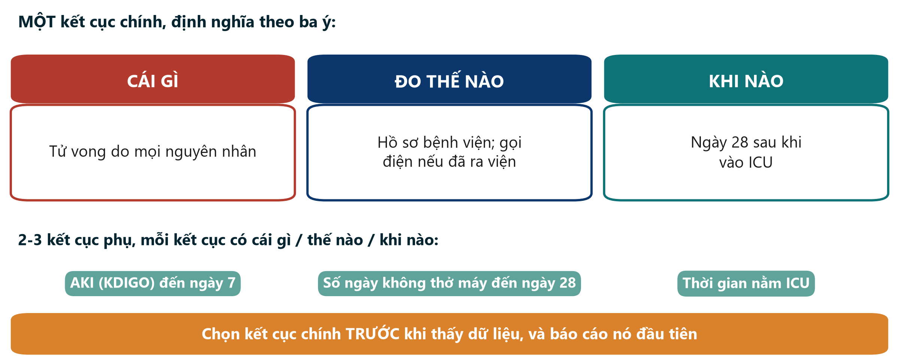{.neu-fig}

::: {.neu-takeaway}
**THÔNG ĐIỆP CHÍNH** Kết cục chính không phải một từ; đó là một phép đo có phương pháp và thời điểm.
:::

::: {.notes}
Slide này chuẩn bị nửa sau của Phần 2 đề cương.

Kết cục chính là MỘT kết quả mà nghiên cứu được thiết kế và tính cỡ mẫu cho nó. Định nghĩa theo ba ý: CÁI GÌ (tử vong do mọi nguyên nhân, không phải 'cải thiện tử vong'), ĐO THẾ NÀO (hồ sơ bệnh viện; gọi điện nếu đã ra viện), KHI NÀO (ngày 28 sau khi vào ICU). Kết cục phụ cũng có đủ ba ý.

Kết cục chính của Boulet: cân bằng dịch tích lũy (ml/kg) ở ngày 5: rõ cái gì, thế nào và khi nào. Của Hyun: tử vong ngày 28.

Quan niệm sai: 'nhiều kết cục chính = nhiều cơ hội có kết quả'. Đó chính là vấn đề: nhiều kết cục chính tạo điều kiện chọn lọc kết quả (tô vẽ, Buổi 2).

Hỏi cả lớp: viết lại 'cải thiện kết cục bệnh nhân' thành một kết cục chính. Dự kiến: vd. 'loét tì đè mới (độ 2 trở lên) đến ngày 14 nằm viện, theo phiếu kiểm tra da'.

Thời gian: 2 phút.
:::

## Xây dựng đề cương 4: phơi nhiễm, kết cục và sai lệch

::: {.neu-banner style="--c:#055F56"}
XÂY DỰNG ĐỀ CƯƠNG · 30 phút
:::

:::: {.columns}
::: {.column width="60%"}
::: {.neu-activity-steps style="--c:#055F56"}
1. Phơi nhiễm hoặc can thiệp: chính xác là gì, bao nhiêu, khi nào
2. Nhóm so sánh: so sánh với ai hoặc với điều gì
3. MỘT kết cục chính: cái gì, thế nào, khi nào
4. 2-3 kết cục phụ, mỗi kết cục có cái gì, thế nào, khi nào
5. Hai sai lệch chính và bước thiết kế làm giảm từng sai lệch
6. Viết một câu: sẽ kết luận 'gây ra' hay 'có liên quan'?
:::
:::
::: {.column width="40%"}
::: {.neu-side .plain style="--c:#055F56"}
Người hướng dẫn kiểm tra

- Có nêu nhóm so sánh?
- Chỉ MỘT kết cục chính?
- Kết cục có thời điểm?
- Nhiễu do chỉ định?
- Mỗi sai lệch có biện pháp cụ thể?
:::
:::
::::

::: {.neu-output style="--c:#055F56"}
**SẢN PHẨM** Phần 2 đề cương hoàn chỉnh (2a từ Buổi 3 + 2b hôm nay)
:::

::: {.notes}
Phiếu làm việc: Practicals/s4\_exercises.md, Phần F, và mẫu đề cương (Phần 2). 30 phút.

Nhịp gợi ý (slide kết cục trước đó mất 2 phút): 4 phút cùng xác định phơi nhiễm và nhóm so sánh; 14 phút viết (chia: kết cục, sai lệch, câu kết luận); 10 phút để người hướng dẫn kiểm tra và một nhóm đọc to các sai lệch và biện pháp.

Đáp án mẫu cho ví dụ xuyên suốt (phiên bản quan sát): phơi nhiễm: cân bằng dịch tích lũy dương (ml/kg) ở 72 giờ sau khi vào ICU; so sánh: cân bằng bằng 0 hoặc âm; kết cục chính: tử vong do mọi nguyên nhân đến ngày 28 (hồ sơ bệnh viện); kết cục phụ: AKI (KDIGO) đến ngày 7, số ngày không thở máy đến ngày 28, thời gian nằm ICU; sai lệch: nhiễu do độ nặng (ghi SOFA, lactate, liều vận mạch và hiệu chỉnh hoặc ghép cặp), chọn lựa (bệnh nhân liên tiếp, báo cáo các trường hợp bị loại), thông tin (định nghĩa dịch định trước, kiểm tra lại 10% hồ sơ); kết luận: 'có liên quan với'.

Vấn đề thường gặp: không có nhóm so sánh; ba kết cục chính; nêu sai lệch mà không có biện pháp cụ thể ('chúng tôi sẽ cẩn thận' không phải là biện pháp).

Thời gian: nhắc khi còn 10 phút và 2 phút.
:::

## Buổi 4 trong một slide

:::: {.neu-cards style="--n:4"}
::: {.neu-card .plain style="--c:#B23B2E"}
[4.1 Tin cậy]{.neu-card-title}

- Sai lệch: cỡ mẫu không sửa
- Yếu tố nhiễu: loại bỏ
- Thay đổi tác động: báo cáo
:::
::: {.neu-card .plain style="--c:#0D7377"}
[4.2 Độ lớn]{.neu-card-title}

- Tương đối: RR, OR
- Tuyệt đối: RD, NNT
- OR = RR chỉ khi hiếm
:::
::: {.neu-card .plain style="--c:#0B376C"}
[4.3 Nhiều nghiên cứu]{.neu-card-title}

- PPV phụ thuộc hiện mắc
- Biểu đồ rừng: đọc hình thoi
- Đúng công cụ cho thiết kế
:::
::: {.neu-card .plain style="--c:#055F56"}
[Đề cương của bạn]{.neu-card-title}

- Phần 2 hoàn chỉnh
- Gây ra hay có liên quan?
:::
::::

::: {.neu-takeaway}
**THÔNG ĐIỆP CHÍNH** Tin trước, rồi đến độ lớn, và kiểm tra lời lẽ có khớp với thiết kế.
:::

::: {.notes}
Tóm tắt buổi học. Mời bốn người giải thích mỗi người một thẻ.

Slide này cũng khép lại Tuần 3-4: đề cương giờ đã có câu hỏi (Phần 1) và thiết kế (Phần 2).

Thời gian: 2 phút (nằm trong 5 phút tổng kết).
:::

## Tổng kết và bài về nhà

::: {.neu-banner style="--c:#1F5C7A"}
THẢO LUẬN · 5 phút
:::

::: {.neu-activity-steps style="--c:#1F5C7A"}
1. Câu hỏi cuối buổi: BN ICU được truyền nhiều dịch hơn tử vong nhiều hơn. Nêu một lý do khác ngoài bản thân dịch truyền
2. Bài về nhà: hoàn thành Phần 2 đề cương (phơi nhiễm, so sánh, kết cục, sai lệch)
3. Tùy chọn: Phần B và D của tài liệu (thay đổi tác động, PPV ở hai bối cảnh)
4. Hai thứ Bảy tới (Buổi 5-6): dữ liệu và bộ dữ liệu khóa học FLUID-ICU
:::

::: {.neu-output style="--c:#1F5C7A"}
**SẢN PHẨM** Câu trả lời cuối buổi trên giấy dán
:::

::: {.notes}
Đáp án câu hỏi cuối buổi: nhiễu do chỉ định (bệnh nhân nặng hơn được truyền nhiều dịch hơn và tử vong nhiều hơn), hoặc nhân quả ngược (thận suy tạo ít nước tiểu nên cân bằng dịch trở nên dương).

Xem trước: ở Tuần 5-6 ta biến thiết kế thành dữ liệu (biến số, phiếu thu thập dữ liệu) và làm quen với bộ dữ liệu khóa học FLUID-ICU, một thuần tập mô phỏng trả lời phiên bản quan sát của câu hỏi về dịch truyền.

Thời gian: 3 phút sau slide tóm tắt. Kết thúc đúng giờ.
:::

## Slide bổ sung: Buổi 4

:::: {.neu-statement}
::: {.neu-big}
Slide bổ sung: Buổi 4
:::

::: {.neu-sub}
Dùng nếu còn thời gian, hoặc để tự học
:::
::::

::: {.notes}
EXTRA (slide bổ sung): các slide sau đây là tùy chọn. Dùng nếu lớp đi nhanh, để trả lời câu hỏi, hoặc để tự học.

Thời gian: bỏ qua trong buổi học trừ khi còn thời gian.
:::

## Tỷ số khả dĩ và báo cáo nghiên cứu chẩn đoán

::: {.neu-intro}
Cùng xét nghiệm: độ nhạy 90%, độ đặc hiệu 80%
:::

:::: {.neu-cards style="--n:3"}
::: {.neu-card .plain style="--c:#B23B2E"}
[LR+ (xét nghiệm dương)]{.neu-card-title}

- độ nhạy / (1 - độ đặc hiệu)
- **0,90 / 0,20 = 4,5**
- kết quả dương gặp ở người bệnh nhiều gấp 4,5 lần
:::
::: {.neu-card .plain style="--c:#0D7377"}
[LR- (xét nghiệm âm)]{.neu-card-title}

- (1 - độ nhạy) / độ đặc hiệu
- **0,10 / 0,80 = 0,13**
- LR trên 10 hoặc dưới 0,1 thay đổi quyết định nhiều nhất
:::
::: {.neu-card .plain style="--c:#0B376C"}
[Báo cáo và thẩm định]{.neu-card-title}

- STARD: bảng kiểm 30 mục + sơ đồ
- QUADAS-2: nguy cơ sai lệch
- Thử trên đúng BN sẽ dùng xét nghiệm
:::
::::

::: {.neu-takeaway}
**THÔNG ĐIỆP CHÍNH** Tỷ số khả dĩ không đổi theo tỷ lệ hiện mắc; giá trị tiên đoán thì có.
:::

::: {.notes}
EXTRA (slide bổ sung): Chỉ học khái niệm. Tỷ số khả dĩ (likelihood ratio, LR) gộp độ nhạy và độ đặc hiệu thành một con số cho biết một kết quả nên thay đổi mức nghi ngờ của ta bao nhiêu.

LR+ = 0,90 / 0,20 = 4,5: kết quả dương gặp ở người có bệnh nhiều gấp 4,5 lần người không bệnh. LR- = 0,10 / 0,80 = 0,13: kết quả âm ở người bệnh hiếm hơn khoảng 8 lần. Quy tắc gần đúng: LR+ trên 10 hoặc LR- dưới 0,1 thay đổi quyết định nhiều; giá trị gần 1 thay đổi ít.

Khác với PPV, tỷ số khả dĩ không phụ thuộc tỷ lệ hiện mắc, nên chuyển giữa các bối cảnh tốt hơn.

Báo cáo: STARD (30 mục và sơ đồ luồng người tham gia). Thẩm định: QUADAS-2. Cảnh giác sai lệch phổ bệnh (spectrum bias): xét nghiệm được đánh giá trên bệnh nhân rất nặng so với người tình nguyện khỏe sẽ trông tốt hơn so với khi dùng trên bệnh nhân thực tế.

Quan niệm sai: 'nghiên cứu độ chính xác chẩn đoán chỉ là một bảng 2x2'. Các câu hỏi thiết kế (ai được xét nghiệm, tiêu chuẩn tham chiếu có áp dụng cho mọi người không, có đọc mù không) quan trọng không kém con số.

Thời gian: 1,5 phút. Các học phần nâng cao có thực hành phân tích độ chính xác chẩn đoán.
:::

## Biểu đồ đèn giao thông RoB 2

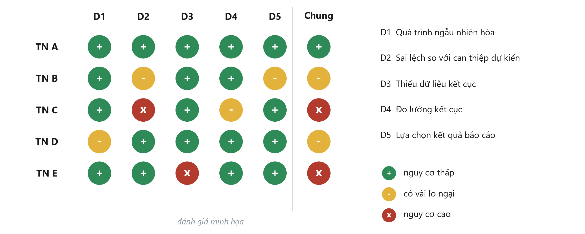{.neu-fig}

::: {.neu-takeaway}
**THÔNG ĐIỆP CHÍNH** Đánh giá từng lĩnh vực; nguy cơ chung do lĩnh vực xấu nhất quyết định.
:::

::: {.notes}
EXTRA (slide bổ sung): Đánh giá minh họa. RoB 2 đặt các câu hỏi gợi ý trong năm lĩnh vực: D1 quá trình ngẫu nhiên hóa (trình tự và che giấu), D2 sai lệch so với can thiệp dự kiến (làm mù, tuân thủ), D3 thiếu dữ liệu kết cục, D4 đo lường kết cục, D5 lựa chọn kết quả báo cáo.

Mỗi lĩnh vực được đánh giá nguy cơ thấp (xanh +), có vài lo ngại (vàng -) hoặc nguy cơ cao (đỏ x). Đánh giá chung do lĩnh vực xấu nhất quyết định: TN C có nguy cơ cao vì D2.

Các tổng quan trình bày biểu đồ này để người đọc thấy thử nghiệm nào chi phối kết quả gộp và việc loại thử nghiệm nguy cơ cao có làm thay đổi kết quả không (phân tích độ nhạy).

Áp dụng cho Boulet (thảo luận, không chấm chính thức): D1 có lẽ thấp (máy tính trung tâm); D2 có vài lo ngại vì bác sĩ biết nhóm; D4 thấp với kết cục khách quan như cân bằng dịch.

Quan niệm sai: 'không làm mù = nguy cơ cao'. Không nhất thiết nếu kết cục khách quan và sai lệch nhỏ; tùy câu hỏi của từng lĩnh vực.

Thời gian: 1,5 phút. Buổi 8 dùng bảng kiểm 10 câu đơn giản của khóa học; các học phần nâng cao thực hành đầy đủ các công cụ.
:::

## Ví dụ: hiện mắc hay mới mắc?

:::: {.neu-steps}
::: {.neu-step style="--c:#0D7377"}
[1]{.neu-step-num}[1. Hôm nay]{.neu-step-label}

- 200 BN ở khoa; 20 BN có loét tì đè
- Hiện mắc 10%
:::
::: {.neu-step style="--c:#0B376C"}
[2]{.neu-step-num}[2. Có nguy cơ]{.neu-step-label}

- 180 BN chưa bị loét
:::
::: {.neu-step style="--c:#5FA39B"}
[3]{.neu-step-num}[3. Một tuần]{.neu-step-label}

- 9 BN bị loét mới
:::
::: {.neu-step style="--c:#0070C0"}
[4]{.neu-step-num}[4. Mới mắc]{.neu-step-label}

- 9 / 180 = 5% mỗi tuần
- (mẫu số = người có nguy cơ)
:::
::::

::: {.neu-takeaway}
**THÔNG ĐIỆP CHÍNH** Tỷ lệ mới mắc luôn có khoảng thời gian và chỉ tính người có nguy cơ.
:::

::: {.notes}
EXTRA (slide bổ sung): Các con số của hình bồn tắm, trình bày lại theo từng bước cho học viên thấy hình quá nhanh.

Khác biệt then chốt là mẫu số: hiện mắc dùng mọi người hôm nay (200); mới mắc chỉ dùng người có thể trở thành ca mới (180) và cần một khoảng thời gian.

Thời gian: 1,5 phút nếu dùng.
:::
