# Buổi 5 · Dữ liệu: thu thập tốt, mô tả trung thực

## Cuối tuần 3 · Thứ Bảy

- Câu hỏi ôn tập Buổi 3-4 (10 phút)
- 5.1 Dữ liệu tốt từ khâu thiết kế: biến số, CRF, từ điển dữ liệu, kiểm tra, quản lý dữ liệu
- 5.2 Làm quen bộ dữ liệu khóa học FLUID-ICU (trình diễn làm sạch bằng R)
- 5.3 Mô tả và trình bày dữ liệu: tóm tắt, biểu đồ, bảng
- 5.4 Mô tả bộ dữ liệu khóa học: Bảng 1 và biểu đồ
- Xây dựng đề cương 5: biến số, CRF thu gọn, từ điển dữ liệu, quản lý dữ liệu

::: {.notes}
Chào mừng đến Cuối tuần 3. Buổi 1-4 đã đặt câu hỏi, tìm bằng chứng và chọn thiết kế. Cuối tuần này chúng ta ĐO LƯỜNG và PHÂN TÍCH: hôm nay (Buổi 5) là dữ liệu, ngày mai (Buổi 6) là phân tích.

Lời hứa: không có công thức. Mỗi ý tưởng đi theo thứ tự: hình ảnh, ví dụ minh họa, rồi kiểm tra nhanh một phút. Việc của anh chị là diễn giải, không phải tính toán.

Mới trong cuối tuần này: bộ dữ liệu khóa học FLUID-ICU, một đoàn hệ thực tế (mô phỏng) gồm khoảng 600 người lớn bị nhiễm khuẩn huyết. Anh chị sẽ thấy dữ liệu được làm sạch và mô tả trực tiếp bằng R, và mỗi nhóm nhận một câu hỏi nghiên cứu cùng một gói kết quả, sẽ trở thành bản thảo bài báo ở Cuối tuần 4.

Ví dụ xuyên suốt: dịch truyền trong sốc nhiễm khuẩn. Biến số 'cân bằng dịch tích lũy (ml/kg)' đi cùng chúng ta cả ngày: trên phiếu, trong từ điển dữ liệu, trong bộ dữ liệu đã làm sạch, trong Bảng 1.

Hỏi cả lớp: ai từng điền một phiếu thu thập dữ liệu và tự hỏi 'ô này thực ra muốn gì?' Dự kiến: nhiều cánh tay giơ lên. Đó chính là phần 5.1.

Thời lượng: ôn tập 0:00, 5.1 lúc 0:10, 5.2 lúc 0:45, giải lao 1:10, 5.3 lúc 1:25, 5.4 lúc 2:00, xây dựng đề cương 2:25, tổng kết 2:55.

Nhịp độ: chậm. Nếu lớp cần thêm thời gian, bỏ các trang bổ sung ở cuối; không bao giờ bỏ các phần kiểm tra.
:::

## Ôn tập: Buổi 3-4 trong ba câu hỏi

::: {.neu-banner style="--c:#6C3483"}
CÂU HỎI NHANH · 10 phút
:::

:::: {.columns}
::: {.column width="60%"}
::: {.neu-activity-steps style="--c:#6C3483"}
1. C1. Người hút thuốc được theo dõi 10 năm để xem ai bị đột quỵ. Đây là thiết kế gì?
2. C2. Trong một nghiên cứu đoàn hệ, bệnh nhân nhiễm khuẩn nặng hơn được truyền nhiều dịch hơn VÀ tử vong nhiều hơn. Hiện tượng này gọi là gì?
3. C3. Tử vong 30% với chăm sóc thường quy và 20% với chiến lược mới. RR và NNT là bao nhiêu?
4. Trả lời một mình (2 phút), rồi so sánh với người bên cạnh (2 phút)
:::
:::
::: {.column width="40%"}
::: {.neu-side .plain style="--c:#6C3483"}
Đáp án (công bố sau)

- C1: đoàn hệ tiến cứu
- C2: nhiễu do chỉ định
- C3: RR = 20/30 = 0.67; RD = 10%; NNT = 1/0.10 = 10
:::
:::
::::

::: {.neu-output style="--c:#6C3483"}
**SẢN PHẨM** Mọi người nắm lại thiết kế, yếu tố gây nhiễu và các số đo từ bảng 2x2
:::

::: {.notes}
Mục đích: khơi lại kiến thức Buổi 4 và giúp những ai vắng mặt bắt kịp. Giữ không khí nhẹ nhàng: không chấm điểm.

Cách làm: đọc to từng câu hỏi, 2 phút làm một mình, 2 phút trao đổi với người bên cạnh, rồi công bố đáp án. Nếu được, hãy che khung bên phải cho đến lúc công bố (hoặc đọc đáp án từ ghi chú này).

Đáp án C1: đoàn hệ tiến cứu. Phơi nhiễm (hút thuốc) được đo trước, sau đó chờ kết cục xảy ra. Đáp án sai thường gặp: bệnh-chứng. Nhấn mạnh rằng nghiên cứu bệnh-chứng bắt đầu từ kết cục rồi nhìn ngược lại.

Đáp án C2: nhiễu do chỉ định (confounding by indication). Mức độ nặng gây ra cả việc truyền nhiều dịch hơn và tử vong nhiều hơn. Đây chính là lý do Bài báo 2 dùng ghép cặp theo điểm xu hướng (propensity score), và lý do Buổi 6 (6.3 và 6.4) nói về kết quả 'đã hiệu chỉnh'.

Đáp án C3: RR = 0.20 / 0.30 = 0.67 (giảm tương đối một phần ba); hiệu số nguy cơ = 10 điểm phần trăm; NNT = 1 / 0.10 = 10 bệnh nhân cần điều trị để ngăn một ca tử vong.

Nếu hơn một phần ba lớp trả lời sai C3, dành thêm 2 phút vẽ lại bảng 2x2 trên bảng lật trước khi chuyển tiếp.

Thời lượng: 10 phút kể cả công bố đáp án.
:::

## 5.1 Dữ liệu tốt từ khâu thiết kế

:::: {.neu-statement}
::: {.neu-big}
Thống kê giỏi đến đâu cũng không cứu được dữ liệu xấu.
:::

::: {.neu-sub}
5.1 Dữ liệu tốt từ khâu thiết kế  \|  35 phút
:::
::::

::: {.notes}
Mở đầu phần 5.1 (35 phút: loại biến số kèm kiểm tra nhanh, thiết kế CRF với ví dụ minh họa, từ điển dữ liệu, kiểm tra dữ liệu, quản lý dữ liệu, dữ liệu thiếu, rồi bài tập theo cặp 7 phút).

Thông điệp chính: phần lớn vấn đề trong nghiên cứu lâm sàng không nằm ở khâu phân tích mà nằm ở dữ liệu. Nhà thống kê không thể sửa một ô bị bỏ trống, một đơn vị bị thiếu hay một giá trị không thể có sau sáu tháng.

Rác vào, rác ra: chất lượng câu trả lời bị giới hạn bởi chất lượng phiếu thu thập.

Hỏi cả lớp: có ai từng được nhờ 'giúp xử lý số liệu' sau khi nghiên cứu kết thúc, và phát hiện một nửa số phiếu không đầy đủ? Mời một hai người kể lại trong một câu.

Chuyển ý: chúng ta bắt đầu từ quyết định cơ bản nhất: anh chị đang thu thập LOẠI biến số nào? Điều đó quyết định cách viết câu hỏi trong CRF, cách tóm tắt và kiểm định cần dùng.
:::

## Biến số này thuộc loại nào?

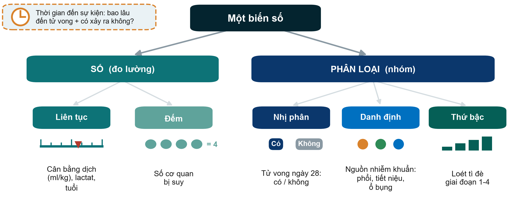{.neu-fig}

::: {.neu-takeaway}
**THÔNG ĐIỆP CHÍNH** Loại biến số quyết định ô trong CRF, cách tóm tắt và kiểm định.
:::

::: {.notes}
Ý chính: mọi biến số hoặc là một SỐ đo được, hoặc là một PHÂN LOẠI được gán. Sau đó chia thêm một lần nữa.

Số: liên tục (bất kỳ giá trị nào trên một thang đo: cân bằng dịch ml/kg, lactat, tuổi) hoặc đếm (số nguyên: số cơ quan bị suy).

Phân loại: nhị phân (hai lựa chọn: tử vong có/không), danh định (nhiều nhóm không có thứ tự: nguồn nhiễm khuẩn) và thứ bậc (các nhóm có thứ tự: loét tì đè giai đoạn 1 đến 4, đau nhẹ/vừa/nặng).

Thời gian đến sự kiện (góc trên trái) là loại đặc biệt: kết hợp BAO LÂU (thời gian đến tử vong) và CÓ XẢY RA KHÔNG (tử vong hay bị kiểm duyệt - censored - tại ngày 28). Chỉ cần nhắc qua; chúng ta gặp lại nó với mô hình Cox ở phần 6.3.

Quan niệm sai thường gặp: 'mã hóa bằng số thì là biến số'. Giới tính mã hóa 1/2 vẫn là biến phân loại; giá trị trung bình 1.4 không có ý nghĩa gì.

Trò chơi phân loại nhanh: đọc tên biến và để cả lớp hô loại: thang điểm Glasgow (thứ bậc, dù hay được xử lý như số), nhịp tim (liên tục), thở máy có/không (nhị phân), nhóm máu (danh định), số ngày thở máy (đếm), thời gian đến khi rút ống (thời gian đến sự kiện).

Mẹo: hãy thu thập biến liên tục dưới dạng số bất cứ khi nào có thể. Có thể nhóm tuổi thành khoảng sau này, nhưng không bao giờ lấy lại được tuổi chính xác từ '60-69'.
:::

## Kiểm tra nhanh: biến số loại gì?

::: {.neu-banner style="--c:#6C3483"}
CÂU HỎI NHANH · 3 phút
:::

:::: {.columns}
::: {.column width="60%"}
::: {.neu-activity-steps style="--c:#6C3483"}
1. Nhịp tim (lần/phút)
2. Thang điểm Glasgow (3-15)
3. Nhóm máu (A, B, AB, O)
4. Thở máy ngày 1 (có / không)
5. Thời gian từ khi vào ICU đến khi rút ống
:::
:::
::: {.column width="40%"}
::: {.neu-side .plain style="--c:#6C3483"}
Đáp án

- Liên tục
- Thứ bậc (thường phân tích như số)
- Danh định
- Nhị phân
- Thời gian đến sự kiện (có người không rút ống)
:::
:::
::::

::: {.neu-output style="--c:#6C3483"}
**SẢN PHẨM** Mọi người gọi tên được năm loại biến số
:::

::: {.notes}
Kiểm tra nhanh (3 phút). Đọc từng biến; cả lớp giơ ngón tay: 1 liên tục, 2 đếm, 3 nhị phân, 4 danh định, 5 thứ bậc, hoặc nói 'thời gian đến sự kiện'. Chỉ công bố khung đáp án sau mỗi lần biểu quyết.

Nhịp tim: liên tục.

GCS: thứ bậc; điểm có thứ tự với khoảng cách không đều, thường được phân tích như số, chấp nhận được nếu nói rõ.

Nhóm máu: danh định; không có thứ tự.

Thở máy có/không: nhị phân.

Thời gian đến khi rút ống: thời gian đến sự kiện, vì có bệnh nhân không bao giờ được rút ống (tử vong hoặc chuyển đi) và phải được kiểm duyệt.

Nếu hơn một phần ba lớp sai GCS hoặc thời gian rút ống, quay lại sơ đồ một phút.

Vì sao quan trọng: loại biến quyết định ô trong CRF, cách tóm tắt (5.3) và kiểm định (Buổi 6).
:::

## Mục CRF tốt và chưa tốt

::: {.neu-intro}
Một câu hỏi trong phiếu thu thập dữ liệu (CRF) chỉ được phép có một cách hiểu.
:::

:::: {.columns}
::: {.column width="50%"}
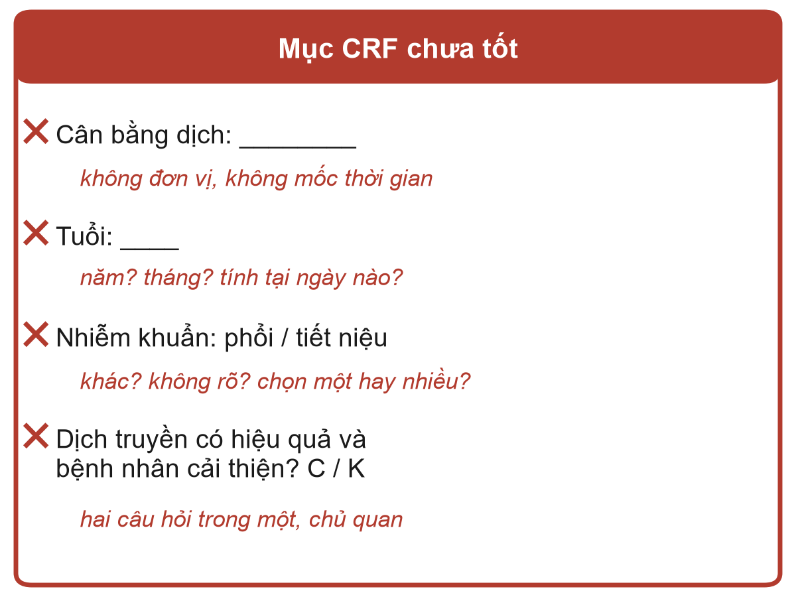{.neu-fig-half}

::: {.neu-caption}
Mơ hồ: hai điều dưỡng sẽ ghi hai thứ khác nhau
:::
:::
::: {.column width="50%"}
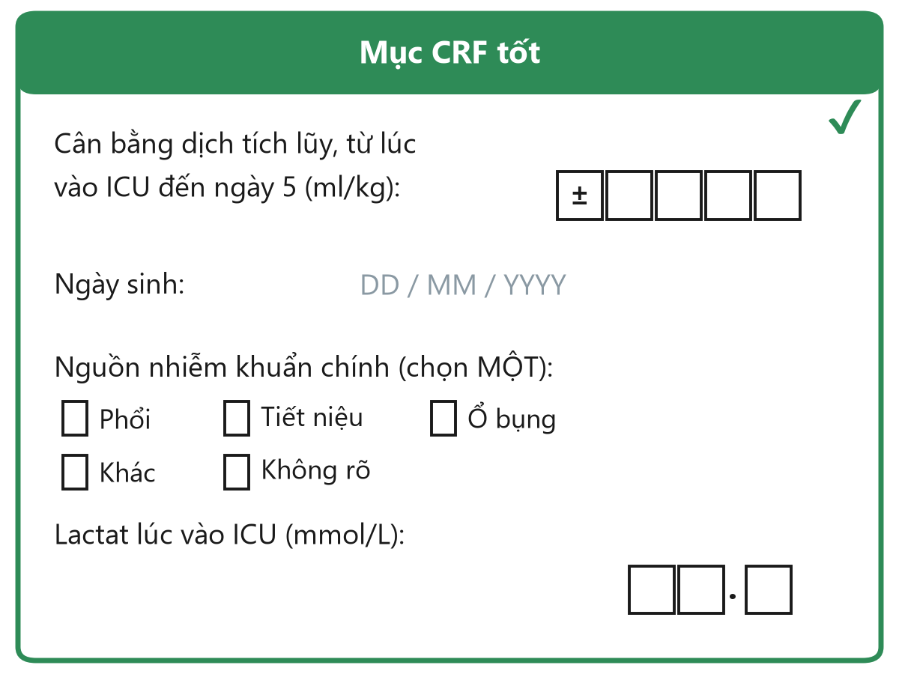{.neu-fig-half}

::: {.neu-caption}
Rõ ràng: đơn vị, mốc thời gian, một đáp án, 'không rõ'
:::
:::
::::

::: {.notes}
Ý chính: một mục CRF là tốt khi hai người khác nhau, cùng điền cho một bệnh nhân, sẽ ghi cùng một câu trả lời.

Đi qua phía bên trái và để cả lớp 'chẩn đoán' từng lỗi trước khi anh chị đọc dòng chữ đỏ:

Cân bằng dịch: không có đơn vị (ml? lít? ml/kg?), không có mốc thời gian (hôm nay? tích lũy?). Trong ví dụ xuyên suốt, chỉ riêng ô này đã quyết định kết cục chính của cả nghiên cứu.

Tuổi: năm hay tháng, tính tại ngày nào? Tốt hơn: thu thập ngày sinh và ngày nhập viện, để máy tính tự tính tuổi.

Nguồn nhiễm khuẩn: lựa chọn chưa đủ (không có 'khác', không có 'không rõ') và không rõ được chọn một hay nhiều.

Dịch truyền có hiệu quả VÀ bệnh nhân cải thiện: hai câu hỏi trong một, và cả hai đều là ý kiến chủ quan. Thay bằng số đo khách quan (lactat, huyết áp trung bình, liều vận mạch).

Bên phải: đơn vị và mốc thời gian nằm ngay trong câu hỏi, các ô cho từng chữ số kèm ô dấu +/- (cân bằng dịch có thể âm), định dạng ngày cố định, chọn MỘT, có lựa chọn 'khác' và 'không rõ', thể hiện chữ số thập phân cho lactat.

Hỏi: để trống một ô thì có vấn đề gì? Dự kiến: không phân biệt được 'không làm', 'quên ghi' hay 'bằng không'. Vì thế cần thêm lựa chọn 'không rõ / không làm'.
:::

## Ví dụ minh họa: từ câu hỏi đến một mục CRF

::: {.neu-intro}
Biến 'cân bằng dịch tích lũy' qua năm quyết định.
:::

:::: {.neu-steps}
::: {.neu-step style="--c:#0D7377"}
[1]{.neu-step-num}[Cái gì?]{.neu-step-label}

- Dịch VÀO trừ dịch RA
- mọi đường, kể cả pha thuốc
:::
::: {.neu-step style="--c:#0B376C"}
[2]{.neu-step-num}[Khi nào?]{.neu-step-label}

- Từ lúc vào ICU
- đến hết ngày 3
:::
::: {.neu-step style="--c:#5FA39B"}
[3]{.neu-step-num}[Đơn vị?]{.neu-step-label}

- ml trên kg
- cân nặng lúc vào
:::
::: {.neu-step style="--c:#0070C0"}
[4]{.neu-step-num}[Định dạng?]{.neu-step-label}

- Số có dấu +/-
- ô cho từng chữ số
:::
::: {.neu-step style="--c:#055F56"}
[5]{.neu-step-num}[Thiếu?]{.neu-step-label}

- Ô 'không ghi nhận'
- + lý do
:::
::::

::: {.neu-takeaway}
**THÔNG ĐIỆP CHÍNH** Trả lời cái gì, khi nào, đơn vị, định dạng và thiếu trước bệnh nhân đầu tiên.
:::

::: {.notes}
Ví dụ minh họa (3 phút): cùng xây dựng một mục CRF, chính là phơi nhiễm chính của bộ dữ liệu khóa học.

Cái gì: cân bằng dịch tích lũy = tổng dịch vào (dịch tinh thể, keo, máu, dịch pha thuốc, nuôi ăn qua ống) trừ tổng dịch ra (nước tiểu, dẫn lưu, mất dịch). Quyết định có tính mất dịch không nhận biết hay không; ghi vào từ điển dữ liệu.

Khi nào: từ lúc vào ICU đến hết ngày 3 (định nghĩa của FLUID-ICU). Mốc thời gian khác cho ra một biến khác.

Đơn vị: ml/kg cân nặng lúc vào, để so sánh được bệnh nhân có thể trạng khác nhau. Nghĩa là cân nặng cũng phải có trong CRF.

Định dạng: số có dấu với các ô chữ số; cân bằng dịch có thể âm.

Thiếu: ô 'không ghi nhận' và lý do, để ô trống luôn có nghĩa là 'quên'.

Hỏi: vì đơn vị này, CRF bắt buộc phải có thêm mục nào? Dự kiến: cân nặng lúc vào (và cách đo).

Đây chính là việc các nhóm làm cho biến số của mình trong phần xây dựng đề cương hôm nay.
:::

## Năm nguyên tắc cho một CRF tốt

::: {.neu-intro}
Viết phiếu trước bệnh nhân đầu tiên, rồi thử trên năm bệnh nhân.
:::

:::: {.neu-cards style="--n:5"}
::: {.neu-card .plain style="--c:#0D7377"}
[Chỉ thu thập cái cần]{.neu-card-title}

- Mỗi mục gắn với một mục tiêu
- Phiếu ngắn mới được điền đủ
:::
::: {.neu-card .plain style="--c:#0B376C"}
[Một câu, một đáp án]{.neu-card-title}

- Không gộp hai câu hỏi
- Khách quan, không cảm tính
:::
::: {.neu-card .plain style="--c:#5FA39B"}
[Đơn vị và thời điểm]{.neu-card-title}

- ml/kg, mmol/L
- 'lúc vào ICU', 'ngày 5'
:::
::: {.neu-card .plain style="--c:#0070C0"}
[Câu trả lời đóng]{.neu-card-title}

- Ô đánh dấu
- Có 'khác' và 'không rõ'
:::
::: {.neu-card .plain style="--c:#055F56"}
[Thử nghiệm trước]{.neu-card-title}

- Hai người, cùng bệnh nhân
- Có khớp nhau không?
:::
::::

::: {.neu-takeaway}
**THÔNG ĐIỆP CHÍNH** Nếu hai đồng nghiệp có thể điền khác nhau, hãy viết lại mục đó.
:::

::: {.notes}
Ý chính: năm nguyên tắc giải quyết phần lớn vấn đề của CRF. Đọc tiêu đề từng thẻ, cho một ví dụ mỗi thẻ.

Chỉ thu thập cái cần: mỗi mục phải trả lời một mục tiêu, mô tả quần thể, hoặc dùng để hiệu chỉnh một yếu tố gây nhiễu. Các mục 'biết thì tốt' làm phiếu dài và bị bỏ sót.

Một câu, một đáp án: tránh câu hỏi kép; ưu tiên giá trị đo được hơn ý kiến.

Đơn vị và thời điểm: viết đơn vị và mốc thời gian NGAY TRONG câu hỏi.

Câu trả lời đóng: ô đánh dấu có mã hóa giúp điền và phân tích nhanh hơn văn bản tự do. Luôn có 'khác (ghi rõ)' và 'không rõ / không làm'.

Thử nghiệm trước: đưa phiếu cho hai đồng nghiệp điền cho cùng năm bệnh nhân rồi so sánh. Chỗ nào không khớp là chỗ cần viết lại.

Lỗi thường gặp: thiết kế phiếu sau khi đã bắt đầu thu thập. Đổi phiếu giữa chừng tạo ra hai bộ dữ liệu khác nhau.

Hỏi: nguyên tắc nào hay bị vi phạm nhất trong các phiếu ở khoa anh chị? Dự kiến: quá dài, không có đơn vị, văn bản tự do khắp nơi.
:::

## Từ điển dữ liệu: mỗi biến số một dòng

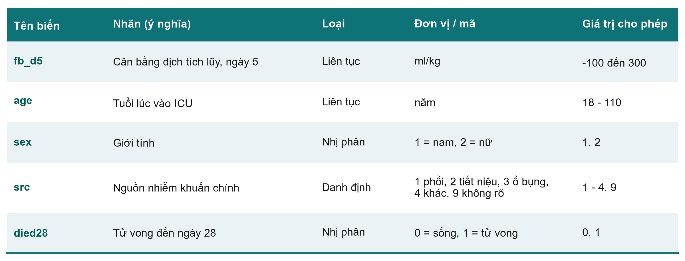{.neu-fig}

::: {.neu-caption}
Các dòng ví dụ cho nghiên cứu dịch truyền trong sốc nhiễm khuẩn
:::

::: {.neu-takeaway}
**THÔNG ĐIỆP CHÍNH** Từ điển dữ liệu là sách hướng dẫn sử dụng bộ dữ liệu của anh chị.
:::

::: {.notes}
Ý chính: từ điển dữ liệu (data dictionary, còn gọi là codebook) giải thích từng cột trong bộ dữ liệu: tên ngắn, ý nghĩa, loại biến, đơn vị hoặc mã, và giá trị cho phép.

Vì sao quan trọng: sáu tháng sau sẽ không ai nhớ giới tính 1 là nam hay nữ, hay fb\_d5 tính bằng ml hay ml/kg. Nhà thống kê, đồng tác giả hay người phản biện phải hiểu được dữ liệu mà không cần gọi điện hỏi anh chị.

Đọc to một dòng: fb\_d5 là cân bằng dịch tích lũy tại ngày 5, biến liên tục, đơn vị ml/kg, cho phép từ -100 đến 300. Khoảng cho phép này trở thành một phép kiểm tra tự động ở trang sau.

Chú ý mã 'không rõ' (9) cho nguồn nhiễm khuẩn. Thiếu và không rõ phải được ghi lại, không để trống.

Mẹo: tên biến ngắn, không dấu cách, không dấu tiếng Việt (fb\_d5, không phải 'Cân bằng dịch ngày 5') dùng được trong mọi phần mềm.

Phần xây dựng đề cương hôm nay yêu cầu anh chị viết 3 đến 5 dòng như thế này cho nghiên cứu của nhóm.

Hỏi: ai ở đây có từ điển dữ liệu cho một cuộc khảo sát/kiểm tra chất lượng mình từng làm? Thường rất ít. Điều đó bình thường và dễ khắc phục.
:::

## Kiểm tra dữ liệu: để quy tắc bắt lỗi

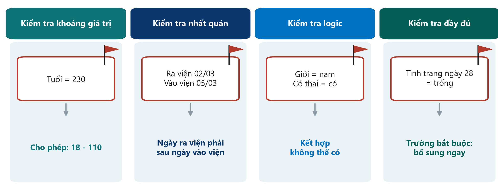{.neu-fig}

::: {.neu-takeaway}
**THÔNG ĐIỆP CHÍNH** Kiểm tra dữ liệu khi bệnh nhân còn ở khoa, không phải một năm sau.
:::

::: {.notes}
Ý chính: bốn loại kiểm tra đơn giản bắt được phần lớn lỗi nhập liệu.

Kiểm tra khoảng giá trị: giá trị nằm ngoài khoảng cho phép (tuổi 230 có lẽ là 23 hoặc 30). Khoảng này lấy trực tiếp từ từ điển dữ liệu.

Kiểm tra nhất quán: hai giá trị không thể cùng đúng (ra viện trước ngày vào viện).

Kiểm tra logic: kết hợp câu trả lời không thể có (nam và có thai).

Kiểm tra đầy đủ: trường bắt buộc bị trống; bổ sung ngay khi hồ sơ còn ở khoa.

Thực hành: phiếu điện tử có thể chặn giá trị không hợp lệ ngay khi nhập (các trang sau); với phiếu giấy, điều phối viên kiểm tra hằng tuần cũng làm được việc này.

Ý lâm sàng: phát hiện lỗi càng sớm càng dễ sửa. Tuần sau hồ sơ còn ở khoa; năm sau hồ sơ đã vào kho lưu trữ.

Hỏi: anh chị đã thấy những giá trị vô lý nào trong dữ liệu bệnh viện? Dự kiến: cân nặng 700 kg, ngày trong tương lai, nhịp tim bằng 0 ở bệnh nhân còn sống.

Thời lượng: 2 phút. Sau đó là quản lý dữ liệu trong thực tế, rồi hai trang về dữ liệu bị thiếu.
:::

## Quản lý dữ liệu thực tế: từ giường bệnh đến cơ sở dữ liệu

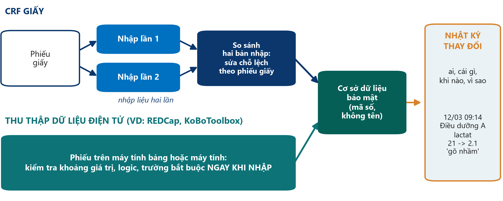{.neu-fig}

::: {.neu-takeaway}
**THÔNG ĐIỆP CHÍNH** Kiểm tra khi nhập, nhập hai lần nếu dùng giấy, và ghi lại mọi thay đổi.
:::

::: {.notes}
Ý chính: dữ liệu tốt cần một con đường an toàn từ bệnh nhân đến tệp phân tích. Hình cho thấy hai con đường.

Đường giấy: CRF được nhập vào máy tính HAI LẦN bởi hai người khác nhau (nhập liệu hai lần). Một phép so sánh đơn giản cho thấy mọi chỗ lệch, và mỗi chỗ được sửa bằng cách đối chiếu với phiếu giấy. Cách này bắt được phần lớn lỗi gõ (lactat 21 thay vì 2.1).

Thu thập dữ liệu điện tử (EDC): phiếu được điền trực tiếp trên máy tính bảng hoặc máy tính. Các ví dụ miễn phí, phổ biến là REDCap và KoBoToolbox. Các phép kiểm tra khoảng giá trị, logic và trường bắt buộc từ từ điển dữ liệu chạy NGAY KHI NHẬP, nên giá trị vô lý bị chặn trước khi được lưu.

Nhật ký thay đổi (audit trail, bên phải): một hệ thống tốt ghi lại ai đã đổi gì, khi nào và vì sao. Không bao giờ ghi đè lặng lẽ; hội đồng đạo đức, giám sát viên và tạp chí có thể yêu cầu xem.

Cơ sở dữ liệu chỉ chứa mã số nghiên cứu, không có tên. Bảng liên kết mã số với tên được lưu riêng và khóa lại.

Hỏi: ai đã từng thấy một tệp Excel có cả tên, số điện thoại và kết quả, được gửi qua email? Dự kiến: nhiều người. Đó chính là điều cần tránh.

Thời lượng: 2 phút.
:::

## Dữ liệu bị thiếu: vì sao quan trọng

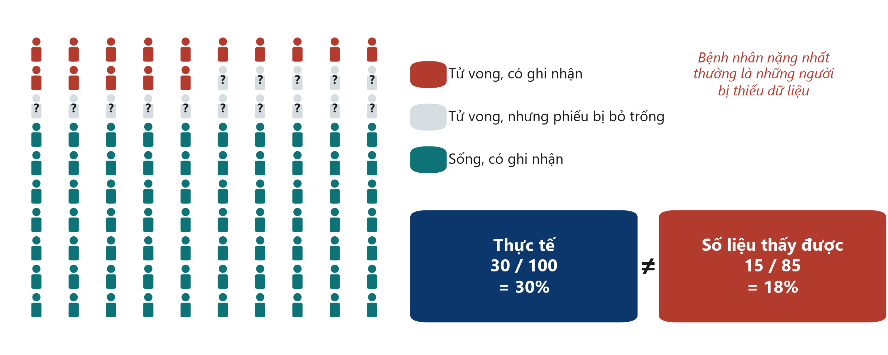{.neu-fig}

::: {.neu-takeaway}
**THÔNG ĐIỆP CHÍNH** Dữ liệu thiếu hiếm khi ngẫu nhiên: bệnh nhân nặng nhất bị thiếu trước tiên.
:::

::: {.notes}
Dữ liệu bị thiếu, phần 1: vì sao quan trọng (tiếp theo là phòng ngừa; các cơ chế và cách xử lý thống kê ở phần 6.4).

Ý chính: dữ liệu bị thiếu không chỉ làm giảm số bệnh nhân; nó có thể cho câu trả lời SAI.

Đi qua hình: 100 bệnh nhân, thực tế có 30 người tử vong. Nhưng 15 ca tử vong có ô kết cục bị bỏ trống (chuyển viện, tử vong ban đêm, phiếu không được hoàn thành). Trong 85 bệnh nhân có ghi nhận, ta thấy 15 ca tử vong: 18%. Sự thật là 30%.

Vì sao? Vì việc thiếu dữ liệu liên quan đến chính kết cục. Những bệnh nhân nặng nhất, diễn biến hỗn loạn nhất là những người có phiếu bị bỏ trống.

Quan niệm sai: 'chỉ mất 15%, không sao'. Số lượng ít quan trọng hơn việc AI bị thiếu.

Ngày mai (Buổi 6, phần 6.4) chúng ta sẽ gọi tên các cơ chế (MCAR, MAR, MNAR) và xem ý tưởng đa phép gán. Nhưng cách xử lý thống kê luôn kém hơn phòng ngừa.

Hỏi: ở khoa anh chị, bệnh nhân nào dễ có hồ sơ không đầy đủ nhất? Dự kiến: chuyển viện, tử vong, nhập viện ban đêm, nằm rất ngắn ngày.
:::

## Dữ liệu bị thiếu: cách phòng ngừa

::: {.neu-intro}
Phòng ngừa là cách chữa duy nhất đáng tin cậy.
:::

:::: {.neu-steps}
::: {.neu-step style="--c:#0D7377"}
[1]{.neu-step-num}[Ít mục]{.neu-step-label}

- Chỉ thu thập cái cần
- Phiếu ngắn sẽ được điền đủ
:::
::: {.neu-step style="--c:#0B376C"}
[2]{.neu-step-num}[Phiếu rõ]{.neu-step-label}

- Đánh dấu trường bắt buộc
- Có 'không làm', 'không rõ'
:::
::: {.neu-step style="--c:#5FA39B"}
[3]{.neu-step-num}[Tập huấn]{.neu-step-label}

- Tập huấn mọi người thu thập
- Cùng quy tắc, cùng định nghĩa
:::
::: {.neu-step style="--c:#0070C0"}
[4]{.neu-step-num}[Kiểm tra tuần]{.neu-step-label}

- Báo cáo mức đầy đủ
- Ai và cái gì bị thiếu?
:::
::: {.neu-step style="--c:#055F56"}
[5]{.neu-step-num}[Bổ sung sớm]{.neu-step-label}

- Sửa khi hồ sơ còn ở khoa
- Kế hoạch theo dõi ca chuyển viện
:::
::::

::: {.neu-takeaway}
**THÔNG ĐIỆP CHÍNH** Phân công ai điền, ai kiểm tra, ai bổ sung từng phiếu trước khi bắt đầu.
:::

::: {.notes}
Dữ liệu bị thiếu, phần 2: phòng ngừa.

Ý chính: năm thói quen ngăn ngừa phần lớn dữ liệu bị thiếu.

Ít mục: mỗi mục thêm vào làm tăng khả năng có ô bị bỏ trống.

Phiếu rõ: đánh dấu trường bắt buộc; có lựa chọn 'không làm' và 'không rõ' để ô trống luôn có nghĩa là 'quên'.

Tập huấn: 30 phút cho mọi điều dưỡng hoặc bác sĩ nội trú sẽ thu thập số liệu, có từ điển dữ liệu trong tay.

Kiểm tra hằng tuần: đếm đơn giản số ô trống theo từng biến và từng bệnh nhân. Nếu một mục luôn trống, chính mục đó có vấn đề.

Bổ sung sớm: kết cục ngày 28 là biến hay bị thiếu nhất trong các nghiên cứu ICU; hãy phân công ai sẽ kiểm tra (gọi điện, tra hồ sơ) cho những bệnh nhân đã chuyển đi.

Nhắc: viết các bước này vào đề cương như 'kế hoạch bảo đảm chất lượng dữ liệu' (Phần 3).

Chuyển ý: giờ hãy thực hành với người bên cạnh.
:::

## Bài tập theo cặp: phân loại biến, sửa CRF

::: {.neu-banner style="--c:#0D7377"}
LÀM VIỆC NHÓM · 7 phút
:::

:::: {.columns}
::: {.column width="60%"}
::: {.neu-activity-steps style="--c:#0D7377"}
1. Làm việc với người bên cạnh, phiếu bài tập 'Buổi 5, bài 1 và 2'
2. Bài 1: phân loại 10 biến số ICU (liên tục, đếm, nhị phân, danh định, thứ bậc, thời gian đến sự kiện)
3. Bài 2: viết lại 4 mục CRF chưa tốt để mỗi mục chỉ có một cách hiểu
4. Sẵn sàng đọc to một mục đã viết lại
:::
:::
::: {.column width="40%"}
::: {.neu-side .plain style="--c:#0D7377"}
Tự kiểm tra

- Có đơn vị trong câu hỏi?
- Có mốc thời gian?
- Chỉ một đáp án?
- Có lựa chọn 'không rõ'?
:::
:::
::::

::: {.neu-output style="--c:#0D7377"}
**SẢN PHẨM** 10 biến số đã phân loại và 4 mục CRF đã viết lại
:::

::: {.notes}
Bài tập theo cặp kết thúc phần 5.1. Bài 1 và 2 nằm trong Course/Practicals/s5\_exercises.md; đáp án trong Course/Solutions/s5\_solutions.md.

Cách làm: 5 phút theo cặp, 2 phút phản hồi; kết thúc phần 5.1 lúc 0:45. Đi quanh lớp và lắng nghe các lỗi kinh điển.

Lỗi cần để ý: gọi thang điểm Glasgow là liên tục (đây là thứ bậc, dù hay được phân tích như số); gọi 'số ngày thở máy' là liên tục (đây là biến đếm; cách nào cũng tạm chấp nhận, nhưng sự phân biệt ảnh hưởng cách tóm tắt); gọi 'thời gian đến khi rút ống' là liên tục (đây là thời gian đến sự kiện vì có bệnh nhân không bao giờ được rút ống).

Với phần viết lại CRF, mời một cặp đọc phiên bản của họ cho mục 'Dịch đã truyền: \_\_\_\_' và để cả lớp áp dụng bốn câu kiểm tra ở khung bên phải.

Thời gian: nếu lớp làm nhanh, yêu cầu thêm một dòng từ điển dữ liệu cho mục vừa viết lại.
:::

## 5.2 Làm quen bộ dữ liệu khóa học

:::: {.neu-statement}
::: {.neu-big}
Một bộ dữ liệu thực tế, năm câu hỏi nghiên cứu, năm bản thảo.
:::

::: {.neu-sub}
5.2 \[Cấp độ 2\] Làm quen bộ dữ liệu FLUID-ICU  \|  25 phút
:::
::::

::: {.notes}
Mở đầu phần 5.2 (25 phút: nghiên cứu, dòng chảy bệnh nhân, dữ liệu thô và sạch, trình diễn làm sạch bằng R 8 phút, nhật ký làm sạch, rồi mỗi nhóm nhận câu hỏi).

Thông điệp chính: từ giờ anh chị không chỉ đọc nghiên cứu của người khác: nhóm sẽ phân tích và viết bài từ một nghiên cứu thực tế. FLUID-ICU là dữ liệu MÔ PHỎNG: do máy tính tạo ra, không có bệnh nhân, bệnh viện hay quốc gia thật. Nhưng nó vận hành như dữ liệu ICU thật, kể cả các vấn đề của nó.

Không ai cần chạy R. Giảng viên chạy trực tiếp; anh chị đọc và diễn giải. Ai đã học khóa 'Clinical Data Analysis in R' của Neudata có thể tái lập mọi thứ bằng các script trong Course/Data/R.

Nối với ví dụ xuyên suốt: Buổi 1-4 đặt câu hỏi can thiệp (hạn chế dịch: một RCT, Bài báo 1). FLUID-ICU đặt dạng quan sát: cân bằng dịch dương có liên quan với tử vong không? Đó là câu hỏi đoàn hệ (Bài báo 2). Hỏi: đoàn hệ kết luận được gì mà RCT không làm được, và ngược lại? Dự kiến: liên quan, không phải nhân quả; nhưng bệnh nhân thực tế và đông hơn.
:::

## FLUID-ICU tóm tắt (đoàn hệ mô phỏng)

::: {.neu-intro}
Đoàn hệ tiến cứu đa trung tâm: 4 ICU, từ 01/2023 đến 12/2024.
:::

:::: {.neu-cards style="--n:4"}
::: {.neu-card .plain style="--c:#0D7377"}
[Đối tượng]{.neu-card-title}

- 620 người lớn nhiễm khuẩn huyết
- ICU A 191, B 164,
- C 147, D 118
:::
::: {.neu-card .plain style="--c:#0B376C"}
[Phơi nhiễm]{.neu-card-title}

- Cân bằng dịch tích lũy
- đến ngày 3 (ml/kg)
- Dương: 373/618 (60.4%)
:::
::: {.neu-card .plain style="--c:#5FA39B"}
[Kết cục chính]{.neu-card-title}

- Tử vong đến ngày 28
- 179/620 (28.9%)
- + thời gian đến tử vong
:::
::: {.neu-card .plain style="--c:#0070C0"}
[Thu thập thêm]{.neu-card-title}

- SOFA, APACHE II, lactat
- AKI, số ngày không thở máy
- Thời gian nằm ICU
:::
::::

::: {.neu-takeaway}
**THÔNG ĐIỆP CHÍNH** Câu hỏi: cân bằng dịch dương đến ngày 3 có liên quan với tử vong 28 ngày không?
:::

::: {.notes}
Ý chính: trước mọi phân tích, phải hiểu nghiên cứu: ai, phơi nhiễm, kết cục, đo thêm những gì.

Đối tượng: 620 người lớn nhiễm khuẩn huyết ở 4 ICU (ICU A 191, ICU B 164, ICU C 147, ICU D 118), tuyển từ 01/2023 đến 12/2024. Dữ liệu mô phỏng.

Phơi nhiễm: cân bằng dịch tích lũy đến ngày 3, (tổng dịch vào trừ tổng dịch ra trong ngày 1-3) chia cho cân nặng lúc vào, đơn vị ml/kg. Cân bằng dương ở 373 trong 618 bệnh nhân tính được cân bằng (60.4%); trung vị 8.8 ml/kg (IQR -10.3 đến 26.2).

Kết cục chính: tử vong đến ngày 28: 179 trong 620 (28.9%); thời gian đến tử vong cũng được ghi (người sống được kiểm duyệt ở ngày 28).

Các biến khác: nhân khẩu học, bệnh kèm, nguồn nhiễm khuẩn, điểm mức độ nặng, lactat, vận mạch, thở máy, AKI, lọc máu, số ngày không thở máy, thời gian nằm ICU.

Từ điển dữ liệu đầy đủ ở Course/Data/data\_dictionary.md: cùng cấu trúc với từ điển anh chị thấy ở phần 5.1.

Hỏi: từ những gì đã học ở Buổi 4 và Bài báo 2, anh chị đoán bệnh nhân nào có cân bằng dương? Dự kiến: những người nặng nhất. Hãy nhớ điều này cho Bảng 1 và Buổi 6.
:::

## Từ 623 dòng đến 527 ca đầy đủ

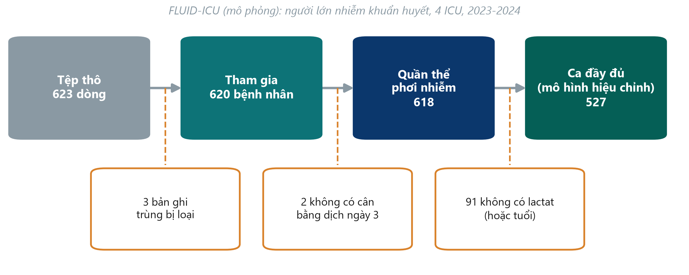{.neu-fig}

::: {.neu-takeaway}
**THÔNG ĐIỆP CHÍNH** Mọi bài báo đều báo cáo dòng chảy này: ai được đưa vào ở mỗi bước, và vì sao không.
:::

::: {.notes}
Ý chính: dòng chảy bệnh nhân (sơ đồ STROBE trong bản thảo).

Tệp thô: 623 dòng. Ba bệnh nhân bị nhập hai lần: sau khi loại bản trùng còn 620 bệnh nhân tham gia.

Hai bệnh nhân không có cân bằng dịch ngày 3 (cân nặng hoặc một lượng dịch ra vô lý và được đặt là thiếu khi làm sạch): 618 trong quần thể phơi nhiễm, dùng cho Bảng 1 và các so sánh.

Thêm 91 người không có lactat (hoặc tuổi): 527 ca đầy đủ cho mô hình hiệu chỉnh ở Buổi 6.

Vì sao quan trọng: 527 trên 620 là 85%. 91 bệnh nhân thiếu lactat có khác biệt không? Buổi 6 (6.4) trả lời: họ nhẹ hơn.

Hỏi: hình này sẽ nằm ở phần nào của bản thảo? Dự kiến: đoạn đầu phần Kết quả (đối tượng), là Hình 1.
:::

## Dữ liệu thô và sạch: bốn ICU thực sự đã gửi gì

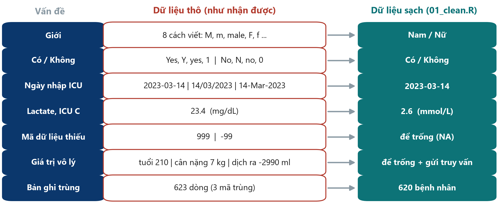{.neu-fig}

::: {.neu-takeaway}
**THÔNG ĐIỆP CHÍNH** Dữ liệu thật luôn lộn xộn: làm sạch bằng script, không bao giờ bằng tay.
:::

::: {.notes}
Ý chính: đây là các vấn đề chất lượng dữ liệu tìm thấy trong tệp thô, và cách sửa từng vấn đề. Mời cả lớp đoán vấn đề ở mỗi dòng trước khi cho xem cột dữ liệu sạch.

Giới tính và các biến có/không được viết nhiều kiểu; ba định dạng ngày (03/04 là tháng Ba hay tháng Tư?); ICU C gửi lactat bằng mg/dL thay vì mmol/L (phát hiện nhờ so sánh trung vị theo ICU); 999 và -99 dùng làm mã thiếu; giá trị vô lý (tuổi 210, cân nặng 7 kg, lượng dịch ra âm); bản ghi trùng (623 dòng cho 620 bệnh nhân).

Mỗi vấn đề làm hỏng phân tích một cách lặng lẽ: lactat 999 làm trung bình tăng vọt; 'Y' và 'Yes' thành hai nhóm; giá trị mg/dL làm ICU C trông như một thảm họa lactat.

Giá trị vô lý được đặt là thiếu và gửi câu hỏi đến cơ sở; bệnh nhân vẫn ở trong nghiên cứu. Không bao giờ đoán.

Nối với 5.1: mọi vấn đề này đều có thể được ngăn bằng CRF điện tử có quy tắc kiểm tra và từ điển dữ liệu.

Hỏi: vấn đề nào anh chị sẽ không bao giờ phát hiện nếu không có biểu đồ hoặc tóm tắt theo ICU? Dự kiến: đơn vị lactat.
:::

## Trình diễn: làm sạch FLUID-ICU bằng R

::: {.neu-banner style="--c:#B5651D"}
TRÌNH DIỄN TRỰC TIẾP · 8 phút
:::

:::: {.columns}
::: {.column width="60%"}
::: {.neu-activity-steps style="--c:#B5651D"}
1. Mở FLUID-ICU.Rproj và script 01\_clean.R
2. Đọc tệp thô dưới dạng văn bản và xem qua
3. Chạy từng khối cho mỗi vấn đề: tên biến, bản trùng, ICU, ngày, mã
4. Tìm lỗi đơn vị lactat bằng tóm tắt theo ICU
5. Khối cuối: tệp đã làm sạch giống hệt tệp tham chiếu
:::
:::
::: {.column width="40%"}
::: {.neu-side .plain style="--c:#B5651D"}
Chú ý

- Một vấn đề, một khối
- Tệp thô không bao giờ bị sửa
- Mỗi bước được ghi nhật ký
- Chạy lại = cùng kết quả
:::
:::
::::

::: {.neu-output style="--c:#B5651D"}
**SẢN PHẨM** Mọi người thấy dữ liệu thô thành dữ liệu sạch, có thể tái lập
:::

::: {.notes}
Trình diễn trực tiếp, 8 phút. Kịch bản đầy đủ với kết quả dự kiến và ảnh chụp dự phòng: Course/Demos/s5\_demo.md (Phần A).

Giảng viên chạy R; học viên quan sát. Chạy từng khối bằng Ctrl+Enter và nói to mỗi khối sửa gì.

Cho thấy: dữ liệu thô đọc dưới dạng văn bản; 623 dòng -\> 620 sau khi loại 3 bản trùng; bảng các cách viết giới tính trước và sau; ba định dạng ngày; trung vị lactat theo ICU (ICU C cao gấp khoảng 9 lần) và phép đổi đơn vị; giá trị vô lý đặt là thiếu; bước kiểm tra cuối cùng cho thấy tệp đã làm sạch giống hệt tệp tham chiếu.

Ý chính: (1) tệp thô không bao giờ bị sửa; (2) một vấn đề, một khối, một dòng nhật ký; (3) vì là script, ai cũng có thể chạy lại và được đúng dữ liệu sạch đó: tính tái lập.

Nếu R lỗi: chiếu lại trang dữ liệu thô và sạch và ảnh chụp trong kịch bản trình diễn; ý chính vẫn như vậy.

Không để trình diễn quá giờ: dừng sau 8 phút, kể cả khi phải bỏ một khối.
:::

## Nhật ký làm sạch: dấu vết kiểm toán của dữ liệu

::: {.neu-intro}
Course/Data/cleaning\_log.md: mỗi thay đổi trên dữ liệu thô là một dòng.
:::

:::: {.neu-cards style="--n:4"}
::: {.neu-card .plain style="--c:#0D7377"}
[Nguyên tắc]{.neu-card-title}

- Không sửa tệp thô
- Thay đổi bằng script
- và được ghi lại
:::
::: {.neu-card .plain style="--c:#0B376C"}
[Mỗi dòng ghi]{.neu-card-title}

- Vấn đề phát hiện
- Bao nhiêu
- Đã làm gì và vì sao
:::
::: {.neu-card .plain style="--c:#5FA39B"}
[Câu hỏi gửi cơ sở]{.neu-card-title}

- Giá trị vô lý -\>
- thiếu + hỏi lại cơ sở
- Bệnh nhân được giữ lại
:::
::: {.neu-card .plain style="--c:#0070C0"}
[Còn lại]{.neu-card-title}

- Giá trị thiếu thật
- Lactat: 93/620 (15.0%)
- Biến khác 1% hoặc ít hơn
:::
::::

::: {.neu-takeaway}
**THÔNG ĐIỆP CHÍNH** Người phản biện phải truy ngược được mọi con số về dữ liệu thô.
:::

::: {.notes}
Ý chính: nhật ký làm sạch là dấu vết kiểm toán của bộ dữ liệu. Nếu được, mở tệp thật trên màn hình (Course/Data/cleaning\_log.md).

Nguyên tắc: tệp thô không bao giờ bị sửa; mọi thay đổi được thực hiện bằng script và ghi lại.

Mỗi dòng: vấn đề phát hiện, số bản ghi, đã làm gì và vì sao (ví dụ: lactat ở ICU C tính bằng mg/dL, chia cho 9.01 để ra mmol/L, đã xác nhận với phòng xét nghiệm của cơ sở).

Câu hỏi gửi cơ sở: giá trị vô lý được đặt là thiếu và gửi câu hỏi đến cơ sở; không xóa bệnh nhân (xóa sẽ làm sai lệch mẫu).

Phần còn lại sau làm sạch là dữ liệu thiếu THẬT: lactat 93 trên 620 (15.0%), mọi biến khác 1% hoặc ít hơn. Các ô trống này là chủ đề của phần 6.4 ngày mai.

Hỏi: vì sao không xóa luôn bệnh nhân có tuổi 210? Dự kiến: phần còn lại của hồ sơ vẫn đúng; xóa bệnh nhân vì lỗi gõ có thể làm sai lệch mẫu.

Phần Phương pháp trong bản thảo sẽ ghi: 'Dữ liệu được làm sạch bằng script; mọi thay đổi được ghi trong nhật ký làm sạch.'
:::

## Năm nhóm, năm câu hỏi, một bộ dữ liệu

::: {.neu-intro}
Mỗi nhóm trả lời một câu hỏi và viết thành bản thảo ở Cuối tuần 4.
:::

:::: {.neu-cards style="--n:5"}
::: {.neu-card .plain style="--c:#0D7377"}
[Q1 Tử vong]{.neu-card-title}

- Cân bằng dương và
- tử vong 28 ngày
- Logistic + KM/Cox
:::
::: {.neu-card .plain style="--c:#0B376C"}
[Q2 AKI]{.neu-card-title}

- Cân bằng dịch và
- tổn thương thận cấp
- Logistic
:::
::: {.neu-card .plain style="--c:#5FA39B"}
[Q3 Thở máy]{.neu-card-title}

- Cân bằng dịch và
- số ngày không thở máy
- Phi tham số / tuyến tính
:::
::: {.neu-card .plain style="--c:#0070C0"}
[Q4 Lactat]{.neu-card-title}

- Lactat và tử vong;
- lactat bị thiếu
- CC so với đa phép gán
:::
::: {.neu-card .plain style="--c:#055F56"}
[Q5 Nằm ICU]{.neu-card-title}

- Cân bằng và thời gian
- nằm ICU ở người sống
- Kết cục lệch
:::
::::

::: {.neu-takeaway}
**THÔNG ĐIỆP CHÍNH** Câu hỏi của nhóm là bản thảo của nhóm: hãy làm chủ nó từ hôm nay.
:::

::: {.notes}
Ý chính: một bộ dữ liệu, năm câu hỏi nghiên cứu khác nhau, tương ứng các mục tiêu phụ trong SAP của FLUID-ICU.

Q1 (nhóm 1): cân bằng dịch dương đến ngày 3 và tử vong 28 ngày: hồi quy logistic cùng Kaplan-Meier và Cox. Câu hỏi chính.

Q2 (nhóm 2): cân bằng dịch tích lũy và tổn thương thận cấp: hồi quy logistic.

Q3 (nhóm 3): cân bằng dịch tích lũy và số ngày không thở máy: biến đếm từ 0 đến 28, dồn ở hai đầu: Mann-Whitney và hồi quy tuyến tính.

Q4 (nhóm 4): lactat ban đầu và tử vong 28 ngày, và ảnh hưởng của lactat bị thiếu: phân tích ca đầy đủ so với đa phép gán.

Q5 (nhóm 5): cân bằng dịch và thời gian nằm ICU ở người sống: kết cục lệch (trung vị, IQR; thang log).

Mỗi nhóm có một gói kết quả trong Course/Data/results\_packs (Bảng 1, biểu đồ, bảng hồi quy, ghi chú dễ hiểu). Đây là nguyên liệu cho bản thảo viết ở Buổi 7-8.

Phân công câu hỏi ngay bây giờ (hoặc xác nhận phân công đã làm trước cuối tuần).
:::

## Câu hỏi của nhóm

::: {.neu-banner style="--c:#0D7377"}
LÀM VIỆC NHÓM · 4 phút
:::

:::: {.columns}
::: {.column width="60%"}
::: {.neu-activity-steps style="--c:#0D7377"}
1. Đọc câu hỏi của nhóm trong gói kết quả (trang 1)
2. Nêu kết cục và loại của nó; phơi nhiễm và loại của nó
3. Tìm cả hai trong từ điển dữ liệu FLUID-ICU
4. Viết câu hỏi thành một câu (PECO)
:::
:::
::: {.column width="40%"}
::: {.neu-side .plain style="--c:#0D7377"}
Ví dụ (Q1)

- P: người lớn nhiễm khuẩn huyết ở ICU
- E: cân bằng dương đến ngày 3
- C: cân bằng âm
- O: tử vong đến ngày 28 (nhị phân)
:::
:::
::::

::: {.neu-output style="--c:#0D7377"}
**SẢN PHẨM** Một câu hỏi kèm loại kết cục và phơi nhiễm (bài 7)
:::

::: {.notes}
Bài tập nhóm, 4 phút. Phiếu bài tập: bài tập Buổi 5, bài 7.

Mỗi nhóm viết câu hỏi dạng PECO (P đối tượng, E phơi nhiễm, C so sánh, O kết cục) và ghi loại của kết cục và phơi nhiễm, dùng sơ đồ loại biến từ phần 5.1.

Loại dự kiến: Q1 kết cục nhị phân (và thời gian đến sự kiện), phơi nhiễm nhị phân; Q2 kết cục nhị phân, phơi nhiễm liên tục; Q3 kết cục đếm (0-28, lệch), phơi nhiễm liên tục; Q4 kết cục nhị phân, phơi nhiễm liên tục (lactat) có giá trị thiếu; Q5 kết cục liên tục lệch (chỉ người sống), phơi nhiễm nhị phân.

Kiểm tra to một hai nhóm. Sau đó giải lao.
:::

## Giải lao

::: {.neu-banner style="--c:#8A99A3"}
GIẢI LAO · 15 phút
:::

:::: {.columns}
::: {.column width="60%"}
::: {.neu-activity-steps style="--c:#8A99A3"}
1. Vận động, cà phê, hít thở không khí
2. Các nhóm: xem qua câu hỏi và gói kết quả của nhóm
3. Chúng ta bắt đầu lại với 5.3: mô tả và trình bày dữ liệu
:::
:::
::: {.column width="40%"}
::: {.neu-side .plain style="--c:#8A99A3"}
Sau giải lao

- Trung bình hay trung vị?
- SD hay IQR?
- Biểu đồ nào?
- Biểu đồ tốt và chưa tốt
- Bảng 1
:::
:::
::::

::: {.notes}
Giải lao: 15 phút. Bắt đầu lại đúng giờ (1:25).

Trong giờ giải lao: kiểm tra dự án R cho 02\_describe.R mở và chạy được trên máy chiếu, và các hình dự phòng cho phần 5.4 đã sẵn sàng.

Đi quanh và hỏi hai ba người điều gì khó nhất đến giờ (thường là phần làm sạch bộ dữ liệu khóa học); điều chỉnh tốc độ phần 5.3.
:::

## 5.3 Mô tả và trình bày dữ liệu

:::: {.neu-statement}
::: {.neu-big}
Trước khi so sánh các nhóm, hãy mô tả chúng.
:::

::: {.neu-sub}
5.3 Mô tả và trình bày dữ liệu  \|  35 phút
:::
::::

::: {.notes}
Mở đầu phần 5.3 (35 phút: ví dụ tính tay, trung bình và trung vị, độ phân tán, hình dạng, kiểm tra nhanh, chọn biểu đồ, biểu đồ trung thực, Bảng 1 và bảng đạt chuẩn công bố).

Thông điệp chính: mọi bài báo đều bắt đầu phần kết quả bằng việc mô tả bệnh nhân: họ là ai, nặng đến mức nào, bao nhiêu tuổi. Với một biến số, anh chị cần hai con số: giá trị TRUNG TÂM (bệnh nhân điển hình ở đâu?) và độ PHÂN TÁN (các bệnh nhân khác nhau đến mức nào?).

Việc chọn giữa hai bộ (trung bình và SD, hay trung vị và IQR) phụ thuộc vào một điều: HÌNH DẠNG của dữ liệu.

Chuyển ý: hãy nhìn vào biến số lệch nổi tiếng nhất trong y khoa bệnh viện: thời gian nằm viện.
:::

## Ví dụ minh họa: tính trung bình và trung vị bằng tay

::: {.neu-intro}
Thời gian nằm ICU của 7 bệnh nhân (ngày): 1, 2, 2, 3, 4, 6, 24
:::

:::: {.neu-steps}
::: {.neu-step style="--c:#0D7377"}
[1]{.neu-step-num}[Xếp hàng]{.neu-step-label}

- Sắp xếp từ ngắn
- đến dài
:::
::: {.neu-step style="--c:#0B376C"}
[2]{.neu-step-num}[Trung vị]{.neu-step-label}

- Người thứ 4 trong 7:
- 3 ngày
:::
::: {.neu-step style="--c:#5FA39B"}
[3]{.neu-step-num}[Trung bình]{.neu-step-label}

- 42 ngày / 7 bệnh nhân
- = 6 ngày
:::
::: {.neu-step style="--c:#0070C0"}
[4]{.neu-step-num}[So sánh]{.neu-step-label}

- Một ca 24 ngày
- làm trung bình gấp đôi
:::
::::

::: {.neu-takeaway}
**THÔNG ĐIỆP CHÍNH** Một ca nằm rất lâu làm trung bình thay đổi nhiều, trung vị thì không.
:::

::: {.notes}
Ví dụ minh họa (3 phút). Viết bảy con số lên bảng lật.

Xếp hàng: đã được sắp xếp sẵn: 1, 2, 2, 3, 4, 6, 24.

Trung vị: người ở giữa trong bảy người là người thứ 4: 3 ngày. Một nửa nằm ít hơn, một nửa nằm lâu hơn.

Trung bình: cộng lại: 1 + 2 + 2 + 3 + 4 + 6 + 24 = 42; chia cho 7 = 6 ngày.

So sánh: sáu trong bảy bệnh nhân nằm 6 ngày hoặc ít hơn; trung bình 6 bị kéo lên bởi một ca 24 ngày. Trung vị mô tả bệnh nhân điển hình.

Hỏi tiếp: nếu ca nằm lâu nằm 60 ngày thay vì 24, điều gì xảy ra? Dự kiến: trung vị vẫn là 3, trung bình tăng lên khoảng 11 (78 / 7 = 11.1).

Đây là phép tính tay duy nhất hôm nay; sau đó máy tính làm và anh chị diễn giải.
:::

## Trung bình hay trung vị? Hãy nhìn hình dạng trước

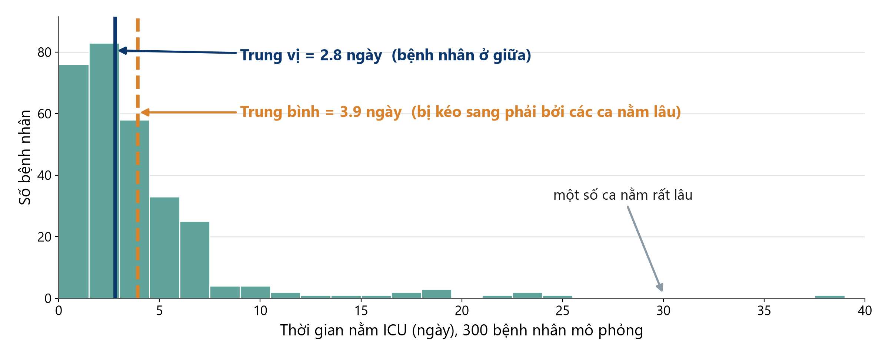{.neu-fig}

::: {.neu-takeaway}
**THÔNG ĐIỆP CHÍNH** Với dữ liệu lệch như thời gian nằm viện, trung vị mô tả bệnh nhân điển hình.
:::

::: {.notes}
Ý chính: TRUNG VỊ (median) là bệnh nhân ở giữa khi xếp hàng tất cả mọi người; TRUNG BÌNH (mean) là trung bình cộng.

Trong ICU mô phỏng này, phần lớn bệnh nhân nằm 1 đến 5 ngày, nhưng một số ít nằm 3 đến 6 tuần. Vài ca nằm lâu đó kéo trung bình sang phải (3.9 ngày) trong khi trung vị vẫn ở cạnh bệnh nhân điển hình (2.8 ngày).

Diễn giải lâm sàng: nếu lãnh đạo nói 'thời gian nằm ICU trung bình là 3.9 ngày', thì phần lớn bệnh nhân của anh chị thực ra ra khỏi ICU sớm hơn thế.

Quan niệm sai: 'trung bình luôn là con số đúng'. Với dữ liệu lệch, nó không mô tả bệnh nhân thật nào cả.

Quy tắc nhanh: nếu trung bình và trung vị cách xa nhau, dữ liệu bị lệch: hãy báo cáo trung vị.

Hỏi: kể tên các biến lệch khác trong công việc của anh chị. Dự kiến: chi phí điều trị, CRP, troponin, thời gian đến khi dùng kháng sinh, số ngày thở máy.

Ví dụ xuyên suốt: Bài báo 1 báo cáo cân bằng dịch tích lũy bằng TRUNG VỊ (6.9 so với 35.0 ml/kg) chính vì lý do này.
:::

## Độ phân tán: SD cho dữ liệu đối xứng, IQR cho dữ liệu lệch

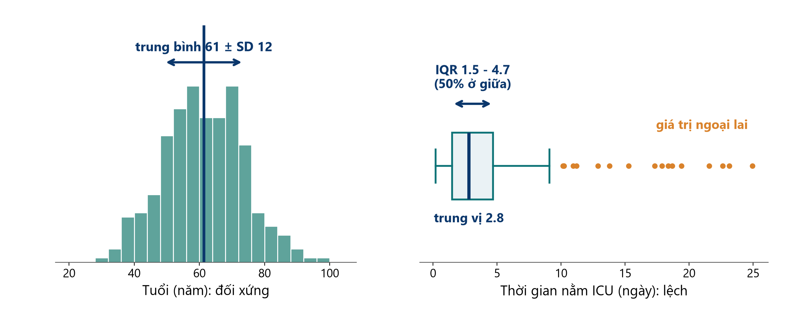{.neu-fig}

::: {.neu-takeaway}
**THÔNG ĐIỆP CHÍNH** Báo cáo trung bình (SD) hoặc trung vị (IQR): không trộn lẫn hai cặp.
:::

::: {.notes}
Ý chính: độ phân tán cho biết các bệnh nhân khác nhau đến mức nào.

Bên trái: tuổi gần đối xứng. Độ lệch chuẩn (SD) là khoảng cách điển hình từ một bệnh nhân đến giá trị trung bình. Với dữ liệu hình chuông, khoảng hai phần ba bệnh nhân nằm trong phạm vi một SD quanh trung bình.

Bên phải: thời gian nằm ICU bị lệch. Biểu đồ hộp thể hiện trung vị (vạch đậm), hộp từ bách phân vị 25 đến 75 (khoảng tứ phân vị, IQR: 50% bệnh nhân ở giữa), các râu và giá trị ngoại lai là các chấm.

Cách đọc 'trung vị 2.8 (IQR 1.5-4.7)': một nửa số bệnh nhân nằm dưới 2.8 ngày; một nửa ở giữa nằm từ 1.5 đến 4.7 ngày.

Lỗi thường gặp: báo cáo trung bình kèm IQR, hoặc trung vị kèm SD. Và nhầm SD (độ phân tán của bệnh nhân) với sai số chuẩn hay CI (độ chính xác của ước lượng), sẽ học ở phần 6.1.

Ví dụ Bài báo 1: cân bằng dịch nhóm chứng 'trung vị 35.0 (IQR -7.9; 40.2)'. Chỉ ra tứ phân vị dưới là số âm: một phần tư bệnh nhân có cân bằng dịch âm.
:::

## Vì sao là hai hình dạng này? Chúng bao phủ phần lớn dữ liệu lâm sàng

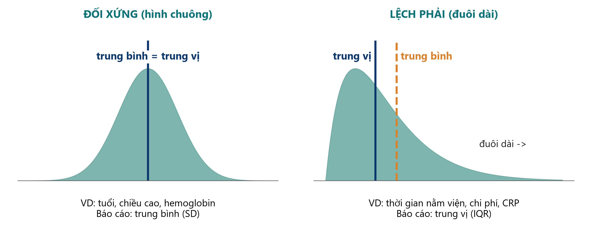{.neu-fig}

::: {.neu-takeaway}
**THÔNG ĐIỆP CHÍNH** Hầu hết số đo lâm sàng tập trung quanh một giá trị điển hình hoặc có đuôi dài - hãy kiểm tra.
:::

::: {.notes}
Ý chính: hai hình dạng bao phủ phần lớn dữ liệu lâm sàng.

VÌ SAO LÀ HAI HÌNH DẠNG NÀY (câu hỏi của người phản biện): hầu hết số đo lâm sàng hoặc tập trung quanh một giá trị điển hình (kích thước cơ thể, các chỉ số sinh lý được cơ thể điều hòa chặt: đối xứng), hoặc không thể nhỏ hơn 0 nhưng có thể rất cao (thời gian, số đếm, chi phí, dấu ấn viêm: lệch phải). Hai dạng này bao phủ phần lớn biến số trong một bộ dữ liệu lâm sàng và dẫn tới hai cách tóm tắt dữ liệu.

Có những hình dạng khác nhưng hiếm hơn: lệch trái (có trần, ví dụ tuổi thai lúc sinh, độ bão hòa oxy), hai đỉnh (trộn hai nhóm, ví dụ tuổi ở một khoa nhận cả trẻ em và người lớn). Với mọi hình dạng không rõ ràng là đối xứng, hãy trình bày biểu đồ tần suất và báo cáo trung vị (IQR).

Đối xứng, hình chuông (thường gọi là 'phân phối chuẩn'): trung bình và trung vị trùng nhau. Ví dụ: tuổi ở người lớn, chiều cao, hemoglobin, huyết áp tâm thu. Báo cáo trung bình (SD).

Lệch phải: một đuôi dài các giá trị cao kéo trung bình sang phải trung vị. Ví dụ: thời gian nằm viện, chi phí, CRP, nhiều xét nghiệm không thể âm. Báo cáo trung vị (IQR).

Kiểm tra nhanh không cần phần mềm: nếu SD lớn hơn một nửa giá trị trung bình với một biến không thể âm, nhiều khả năng biến đó bị lệch.

Vì sao quan trọng về sau: hình dạng cũng quyết định kiểm định (kiểm định t cho dữ liệu đối xứng, Mann-Whitney cho dữ liệu lệch). Đó là sơ đồ chọn kiểm định ở phần 6.1.

Hỏi: 'số ngày dùng vận mạch' đối xứng hay lệch? Dự kiến: lệch (phần lớn bệnh nhân 1-3 ngày, một số vài tuần).
:::

## Kiểm tra nhanh: tóm tắt bằng gì?

::: {.neu-banner style="--c:#6C3483"}
CÂU HỎI NHANH · 3 phút
:::

:::: {.columns}
::: {.column width="60%"}
::: {.neu-activity-steps style="--c:#6C3483"}
1. Thời gian nằm ICU của 200 bệnh nhân: trung bình (SD) hay trung vị (IQR)?
2. Tuổi của 200 bệnh nhân ICU người lớn, hình chuông: trung bình (SD) hay trung vị (IQR)?
3. Thở máy lúc nhập viện (có/không): tóm tắt bằng gì?
4. Loét tì đè giai đoạn 1 đến 4: tóm tắt bằng gì, biểu đồ nào?
:::
:::
::: {.column width="40%"}
::: {.neu-side .plain style="--c:#6C3483"}
Đáp án

- Thời gian nằm ICU: trung vị (IQR)
- Tuổi: trung bình (SD)
- Thở máy: n (%)
- Giai đoạn: n (%) mỗi giai đoạn, biểu đồ cột
:::
:::
::::

::: {.neu-output style="--c:#6C3483"}
**SẢN PHẨM** Mọi học viên chọn đúng cách tóm tắt cho từng loại biến số
:::

::: {.notes}
Kiểm tra nhanh (3 phút), giữa phần 5.3. Giơ tay hoặc dùng thẻ màu.

C1: trung vị (IQR): thời gian nằm viện lệch phải.

C2: trung bình (SD): dữ liệu hình chuông.

C3: n (%): biến nhị phân không có trung bình hay SD; báo cáo số lượng và phần trăm.

C4: n (%) cho từng giai đoạn, thể hiện bằng biểu đồ cột; trung vị giai đoạn cũng chấp nhận được với biến thứ bậc. Không báo cáo 'giai đoạn trung bình 2.3'.

Nếu nhiều người sai C1, quay lại trang biểu đồ tần suất một phút.

Chuyển ý: giờ là cách TRÌNH BÀY các con số tóm tắt: biểu đồ, hình và bảng.
:::

## Biểu đồ nào cho loại dữ liệu nào?

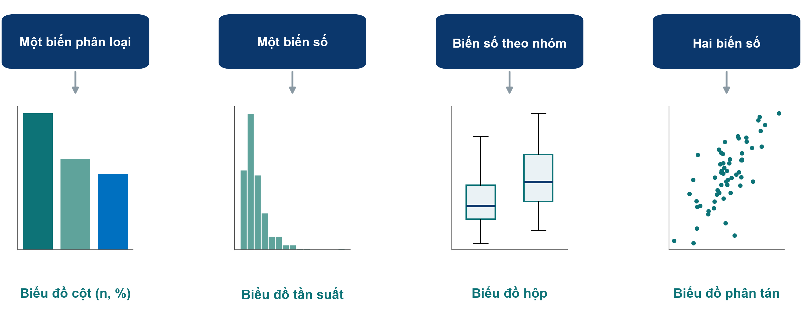{.neu-fig}

::: {.neu-takeaway}
**THÔNG ĐIỆP CHÍNH** Chọn biểu đồ theo loại biến số, không theo menu của phần mềm.
:::

::: {.notes}
Ý chính: bốn loại biểu đồ bao phủ phần lớn nhu cầu mô tả dữ liệu. (Đường cong sống còn - Kaplan-Meier - được giới thiệu ở Buổi 6, khi phân tích kết cục thời gian đến sự kiện.)

Một biến phân loại: biểu đồ cột với số lượng hoặc phần trăm (nguồn nhiễm khuẩn). Tránh biểu đồ tròn 3 chiều.

Một biến số: biểu đồ tần suất (histogram) để thấy hình dạng (thời gian nằm viện).

Một biến số so sánh giữa các nhóm: các biểu đồ hộp đặt cạnh nhau (cân bằng dịch ở nhóm hạn chế dịch so với thường quy).

Hai biến số: biểu đồ phân tán (cân bằng dịch theo lactat).

Lỗi thường gặp: biểu đồ cột thể hiện trung bình với thanh sai số nhỏ cho dữ liệu lệch; nó che giấu hình dạng và các giá trị ngoại lai. Biểu đồ hộp cho thấy nhiều hơn hẳn.

Hỏi: anh chị dùng biểu đồ nào để so sánh thời gian nằm ICU giữa hai nhóm cân bằng dịch? Dự kiến: các biểu đồ hộp đặt cạnh nhau (biến số lệch, theo nhóm).
:::

## Hãy cho thấy dữ liệu: biểu đồ 'thuốc nổ' và chấm + hộp

::: {.neu-intro}
Cùng 48 bệnh nhân, hai bức hình.
:::

:::: {.columns}
::: {.column width="50%"}
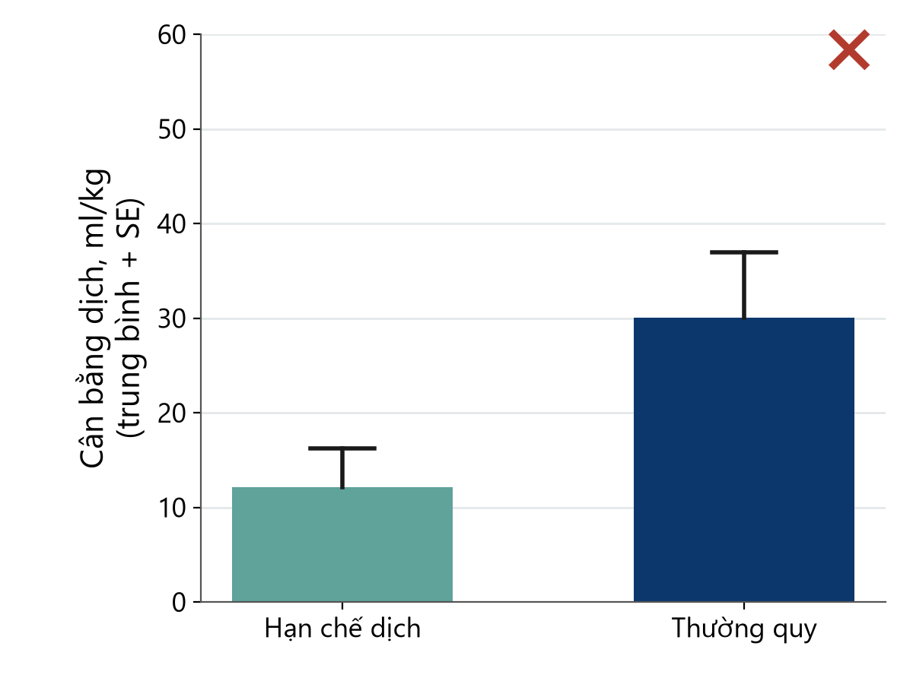{.neu-fig-half}

::: {.neu-caption}
Biểu đồ 'thuốc nổ': trung bình và thanh sai số che giấu mọi thứ
:::
:::
::: {.column width="50%"}
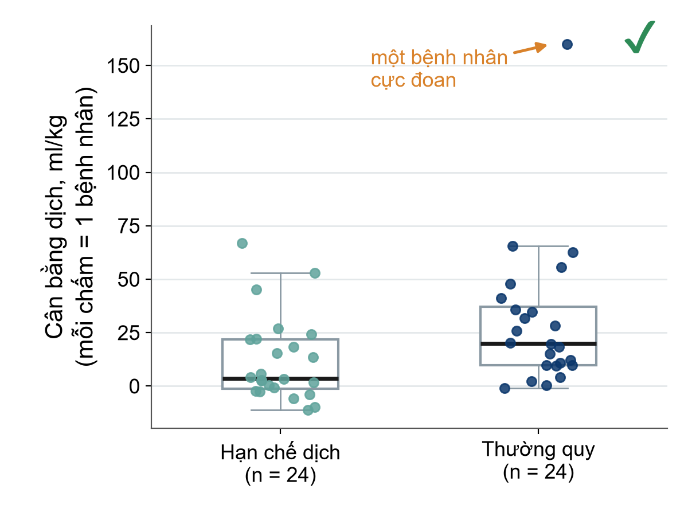{.neu-fig-half}

::: {.neu-caption}
Thấy từng bệnh nhân: hình dạng, độ phân tán và giá trị ngoại lai
:::
:::
::::

::: {.notes}
Ý chính: 'biểu đồ thuốc nổ' (dynamite plot: cột trung bình kèm thanh sai số) là hình xấu phổ biến nhất trên các tạp chí lâm sàng. Nó chỉ cho thấy hai con số mỗi nhóm và che giấu phần còn lại.

Bên trái: các cột gợi ý nhóm thường quy có cân bằng dịch cao hơn nhiều. Bên phải: cùng dữ liệu mô phỏng thể hiện bằng các chấm kèm biểu đồ hộp. Giờ ta thấy một bệnh nhân cực đoan (160 ml/kg) kéo trung bình nhóm thường quy lên, dữ liệu bị lệch, và hai nhóm chồng lấp nhiều.

Chú ý thêm: hình bên trái dùng sai số chuẩn (SE), không phải SD, làm độ phân tán trông nhỏ. Luôn ghi rõ thanh sai số là SD, SE hay 95% CI.

Quy tắc: với ít hơn khoảng 100 bệnh nhân mỗi nhóm, hãy thể hiện từng điểm dữ liệu.

Nhiều tạp chí hiện nay khuyến cáo rõ không dùng biểu đồ cột cho dữ liệu liên tục.

Hỏi: chỉ nhìn hình bên trái, anh chị sẽ kết luận gì? Dự kiến: 'nhóm thường quy rõ ràng cao hơn'. Đó chính là mối nguy.

Thời lượng: 2 phút.
:::

## 'Bảng 1' cho ta biết điều gì

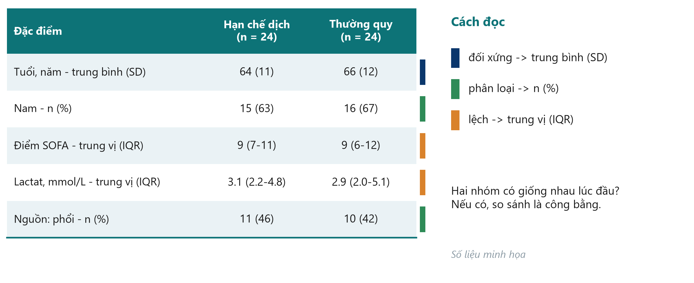{.neu-fig}

::: {.neu-takeaway}
**THÔNG ĐIỆP CHÍNH** Bảng 1 trả lời: bệnh nhân là ai, và các nhóm có giống nhau không?
:::

::: {.notes}
Ý chính: Bảng 1 trong hầu hết các bài báo lâm sàng mô tả đặc điểm ban đầu của bệnh nhân theo từng nhóm.

Đọc từng dòng theo mã màu: biến đối xứng dùng trung bình (SD), biến lệch dùng trung vị (IQR), biến phân loại dùng n (%).

Hai câu hỏi cho mọi Bảng 1: (1) Những bệnh nhân này có giống bệnh nhân của tôi không? (khả năng khái quát hóa) (2) Các nhóm có giống nhau lúc ban đầu không? (so sánh công bằng).

Trong RCT, các nhóm sẽ giống nhau một cách ngẫu nhiên nhờ phân bổ ngẫu nhiên; khác biệt nhỏ là bình thường. Nhiều hướng dẫn (CONSORT) khuyên không dùng giá trị p trong Bảng 1 của RCT, vì mọi khác biệt theo định nghĩa đều do ngẫu nhiên.

Trong nghiên cứu đoàn hệ (Bài báo 2), khác biệt lớn lúc ban đầu là dấu hiệu cảnh báo yếu tố gây nhiễu; đó là lý do Bài báo 2 ghép cặp bệnh nhân theo điểm xu hướng trước khi so sánh.

Số liệu trên trang là minh họa, không lấy từ Bài báo 1. Bảng 1 thật của Bài báo 1 có 24 bệnh nhân mỗi nhóm; mời học viên mở ra xem vào Buổi 7-8.

Hỏi: anh chị lo ngại điều gì nếu nhóm hạn chế dịch có SOFA trung vị 6 còn nhóm thường quy là 11? Dự kiến: hai nhóm không so sánh được; một nhánh có bệnh nhân nặng hơn.

Thời lượng: 2 phút. Tiếp theo: cùng Bảng 1 được viết chưa tốt và tốt, sau hai trang về biểu đồ.
:::

## Bảng đạt chuẩn công bố: chưa tốt và tốt

::: {.neu-intro}
Quy tắc: đơn vị và cách tóm tắt trong nhãn dòng, n mỗi cột, số thập phân nhất quán, chú thích.
:::

:::: {.columns}
::: {.column width="50%"}
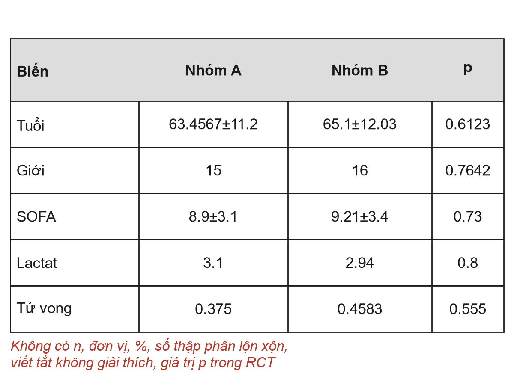{.neu-fig-half}

::: {.neu-caption}
Kẻ ô, không có n, không đơn vị, 4 chữ số thập phân
:::
:::
::: {.column width="50%"}
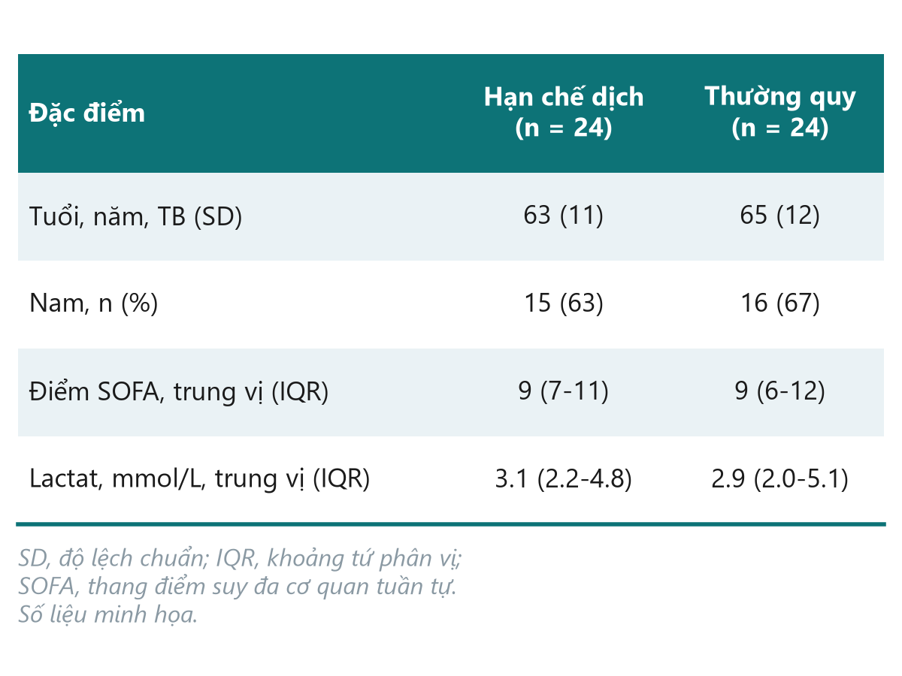{.neu-fig-half}

::: {.neu-caption}
Gọn, tự giải thích, sẵn sàng gửi tạp chí
:::
:::
::::

::: {.notes}
Ý chính: một bảng trong bài báo phải tự đứng được. So sánh hai phiên bản theo từng dòng.

Tiêu đề cột: 'Nhóm A / Nhóm B' không cho người đọc biết gì; hãy ghi tên nhóm và số bệnh nhân mỗi cột (n = 24).

Nhãn dòng: ghi đơn vị và cách tóm tắt: 'Tuổi, năm, trung bình (SD)', 'Lactat, mmol/L, trung vị (IQR)'.

Con số: số thập phân hợp lý và nhất quán: tuổi là số năm nguyên, phần trăm không cần số thập phân với mẫu nhỏ, lactat một chữ số thập phân. 63.4567 gợi ý một độ chính xác không hề có.

Biến phân loại ghi n (%), không bao giờ ghi tỉ lệ như 0.375.

Chú thích giải thích mọi chữ viết tắt (SOFA, IQR) và, nếu có giá trị p, kiểm định đã dùng. Trong Bảng 1 của RCT, không đưa giá trị p (CONSORT).

Không kẻ dọc, ít kẻ ngang; tạp chí sẽ dàn trang lại, nhưng người phản biện vẫn để ý bảng lộn xộn.

Mẫu đề cương và Buổi 7-8 (viết bài báo) dùng đúng các quy tắc này.

Hỏi: tìm bốn lỗi trong bảng bên trái trong 30 giây. Dự kiến: không có n, không đơn vị, không %, quá nhiều số thập phân, SOFA không giải thích, giá trị p trong RCT.

Thời lượng: 2 phút.
:::

## 5.4 Mô tả bộ dữ liệu khóa học

:::: {.neu-statement}
::: {.neu-big}
Trước khi so sánh các nhóm, hãy mô tả chúng: giờ với con số thật.
:::

::: {.neu-sub}
5.4 \[Cấp độ 2\] Mô tả bộ dữ liệu khóa học  \|  25 phút
:::
::::

::: {.notes}
Mở đầu phần 5.4 (25 phút: trình diễn trực tiếp Bảng 1 và biểu đồ 6 phút, bốn trang kết quả FLUID-ICU, rồi phiếu bài tập nhóm 10 phút trên gói kết quả của nhóm).

Thông điệp chính: mọi điều ở phần 5.3 (hình dạng, trung bình hay trung vị, biểu đồ nào, Bảng 1) giờ áp dụng cho FLUID-ICU. Cùng quy tắc, con số thật (mô phỏng).
:::

## Trình diễn: Bảng 1 và biểu đồ bằng R

::: {.neu-banner style="--c:#B5651D"}
TRÌNH DIỄN TRỰC TIẾP · 6 phút
:::

:::: {.columns}
::: {.column width="60%"}
::: {.neu-activity-steps style="--c:#B5651D"}
1. Mở 02\_describe.R và nạp dữ liệu sạch
2. Xem hình dạng trước: biểu đồ tần suất tuổi, lactat, thời gian nằm ICU
3. Lập Bảng 1 theo nhóm cân bằng dịch (không có giá trị p)
4. Vẽ biểu đồ: tần suất, hộp, cột
5. Lưu bảng và biểu đồ cho các gói kết quả
:::
:::
::: {.column width="40%"}
::: {.neu-side .plain style="--c:#B5651D"}
Cùng quy tắc như 5.3

- Hình dạng quyết định tóm tắt
- n mỗi cột
- Đơn vị trong nhãn dòng
- Báo cáo số thiếu
:::
:::
::::

::: {.neu-output style="--c:#B5651D"}
**SẢN PHẨM** Mọi người thấy Bảng 1 được tạo từ dữ liệu, có thể tái lập
:::

::: {.notes}
Trình diễn trực tiếp, 6 phút. Kịch bản đầy đủ: Course/Demos/s5\_demo.md (Phần B), dùng Course/Data/R/02\_describe.R.

Cho thấy: hình dạng của tuổi (gần đối xứng -\> trung bình, SD) so với lactat và thời gian nằm ICU (lệch phải -\> trung vị, IQR); Bảng 1 theo nhóm cân bằng dịch với các cột chung, âm (n = 245) và dương (n = 373) và số thiếu mỗi biến; biểu đồ tần suất cân bằng dịch, biểu đồ hộp SOFA theo nhóm, biểu đồ cột nguồn nhiễm khuẩn đã sắp xếp.

Nhấn mạnh: không có giá trị p trong Bảng 1 (bảng mô tả, không kiểm định), như đã ghi trong SAP của FLUID-ICU.

Nếu R lỗi: chuyển ngay sang các trang sau; chúng cho thấy cùng kết quả.
:::

## Bảng 1 FLUID-ICU: các nhóm có giống nhau lúc đầu?

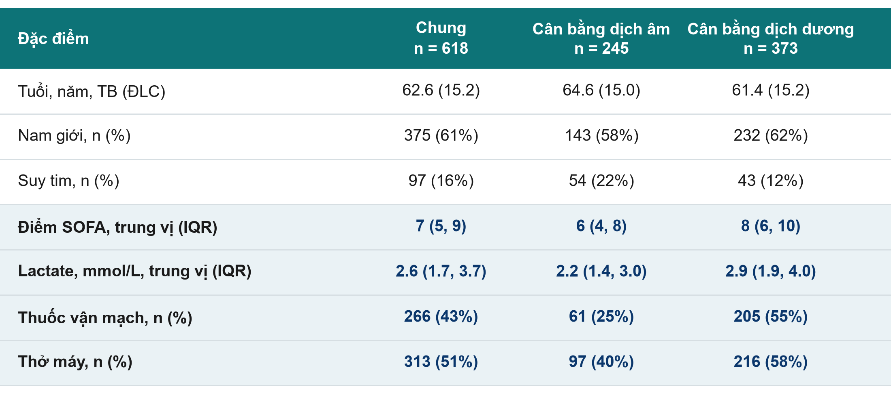{.neu-fig}

::: {.neu-takeaway}
**THÔNG ĐIỆP CHÍNH** Nhóm cân bằng dương nặng hơn ngay từ đầu: lời cảnh báo cho Buổi 6.
:::

::: {.notes}
Ý chính: đọc Bảng 1 với hai câu hỏi từ phần 5.3: bệnh nhân này có giống bệnh nhân của tôi không, và các nhóm có giống nhau lúc đầu không?

Tuổi: trung bình 64.6 so với 61.4 năm (âm so với dương): tương tự.

Mức độ nặng KHÔNG tương tự: SOFA trung vị 6 (4 đến 8) so với 8 (6 đến 10); vận mạch 61/245 (24.9%) so với 205/373 (55.0%); thở máy 97/245 (39.6%) so với 216/373 (57.9%); lactat trung vị 2.2 so với 2.9 mmol/L.

Suy tim: 54/245 (22.0%) so với 43/373 (11.5%): bác sĩ truyền ít dịch hơn cho bệnh nhân suy tim.

Diễn giải: bệnh nhân có cân bằng dương đã nặng hơn trước khi được truyền dịch. Bệnh nhân nặng hơn được truyền nhiều dịch hơn VÀ tử vong nhiều hơn: nhiễu do chỉ định (Buổi 4). Mọi so sánh thô về tử vong sẽ bị sai lệch; Buổi 6 sẽ hiệu chỉnh.

Hỏi: chỉ từ bảng này, anh chị dự đoán OR thô cho tử vong lớn hơn hay nhỏ hơn OR hiệu chỉnh? Dự kiến: lớn hơn (mức độ nặng làm nó phình lên).
:::

## Phơi nhiễm: cân bằng dịch tích lũy ngày 3

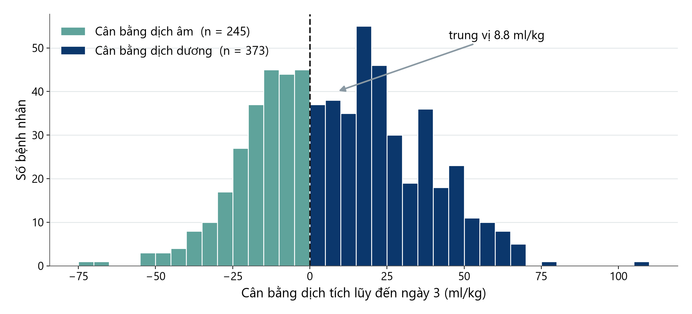{.neu-fig}

::: {.neu-takeaway}
**THÔNG ĐIỆP CHÍNH** Một phơi nhiễm liên tục, được cắt tại 0 ml/kg thành cân bằng âm và dương.
:::

::: {.notes}
Ý chính: luôn nhìn phơi nhiễm trước khi sử dụng.

Cân bằng dịch tích lũy ngày 3 dao động rộng; trung vị 8.8 ml/kg (IQR -10.3 đến 26.2). 373 trong 618 bệnh nhân (60.4%) có cân bằng dương.

Phân tích chính (Q1) cắt biến liên tục tại 0 ml/kg thành hai nhóm; Q2 và Q3 giữ dạng liên tục (mỗi 10 ml/kg). Cắt làm mất thông tin nhưng dễ giải thích hơn; SAP đã cố định lựa chọn này từ trước.

Hỏi: anh chị báo cáo biến này trong Bảng 1 bằng cách nào? Dự kiến: trung vị (IQR), như ở đây, vì có đuôi; phần giữa gần đối xứng nên trung bình (SD) cũng chấp nhận được nếu nói rõ.
:::

## Mức độ nặng theo nhóm: cho thấy từng bệnh nhân

:::: {.columns}
::: {.column width="38%"}
::: {.neu-side-notes}
### Cách đọc

- Mỗi chấm là một bệnh nhân
- Hộp = 50% ở giữa
- Trung vị 6 so với 8
- Ca nặng hơn được truyền nhiều hơn
:::
:::
::: {.column width="62%"}
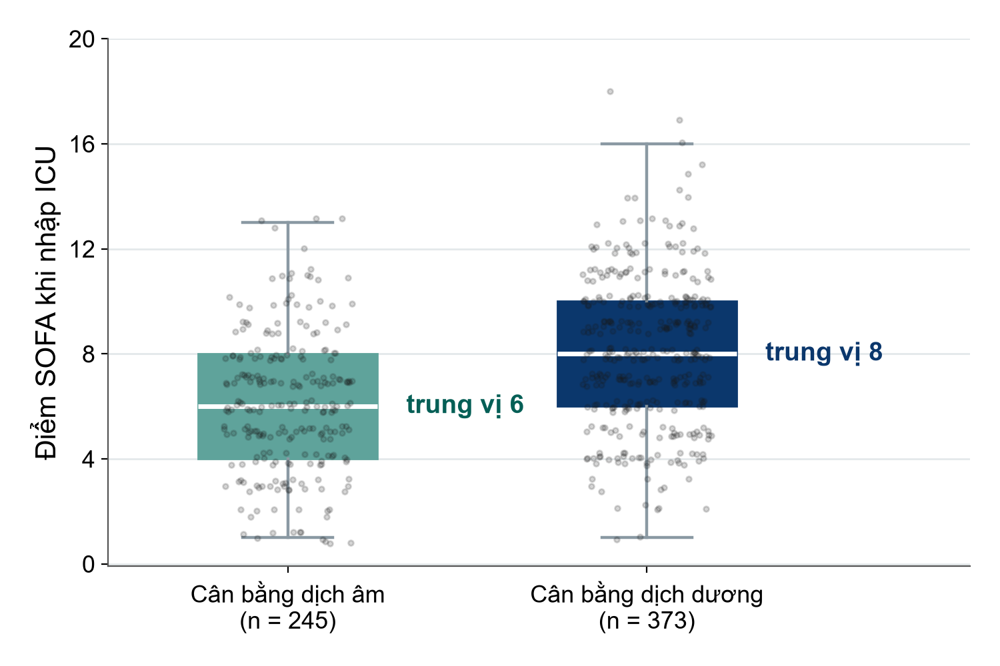{.neu-fig-side}
:::
::::

::: {.neu-takeaway}
**THÔNG ĐIỆP CHÍNH** Chấm kèm hộp cho thấy chồng lấp và dịch chuyển: nhiễu nhìn thấy được.
:::

::: {.notes}
Ý chính: biểu đồ 'chấm kèm hộp' từ phần 5.3, áp dụng cho FLUID-ICU.

Điểm SOFA lúc vào: trung vị 6 (IQR 4 đến 8) ở nhóm cân bằng âm so với 8 (6 đến 10) ở nhóm cân bằng dương. Mỗi chấm là một bệnh nhân, nên người đọc thấy cả sự chồng lấp VÀ sự dịch chuyển.

Riêng hình này là bằng chứng trực quan của nhiễu do chỉ định trong bộ dữ liệu.

Hỏi: vì sao dùng biểu đồ hộp mà không dùng cột trung bình SOFA? Dự kiến: SOFA là điểm có phân phối lệch; cột sẽ che độ phân tán và sự chồng lấp.
:::

## Kết cục lệch: thời gian nằm ICU ở người sống (Q5)

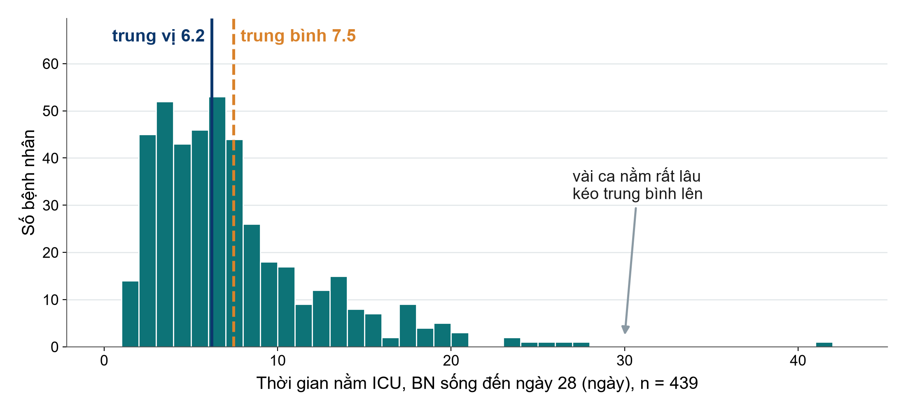{.neu-fig}

::: {.neu-takeaway}
**THÔNG ĐIỆP CHÍNH** Trung bình 7.5 so với trung vị 6.2 ngày: báo cáo trung vị và IQR.
:::

::: {.notes}
Ý chính: hình thời gian nằm viện ở phần 5.3 cũng đúng với FLUID-ICU.

Thời gian nằm ICU ở 439 người sống bị lệch phải: vài ca nằm rất lâu kéo trung bình (7.5 ngày) lên trên trung vị (6.2 ngày). Ở tất cả bệnh nhân: trung bình 7.3, trung vị 6.0.

Câu hỏi của nhóm 5 (Q5) là về kết cục này; nhóm sẽ báo cáo trung vị (IQR), so sánh bằng kiểm định Mann-Whitney và dùng thang log trong mô hình (Buổi 6).

Hỏi: nhóm nào cần trang này nhất? Dự kiến: nhóm 5, nhưng nhóm nào cũng có ít nhất một biến lệch trong Bảng 1.
:::

## Đọc Bảng 1 của nhóm (phiếu bài tập)

::: {.neu-banner style="--c:#0D7377"}
LÀM VIỆC NHÓM · 10 phút
:::

:::: {.columns}
::: {.column width="60%"}
::: {.neu-activity-steps style="--c:#0D7377"}
1. Mở gói kết quả: Bảng 1 và các biểu đồ
2. Với ba biến: dùng cách tóm tắt nào, vì sao?
3. Các nhóm có giống nhau lúc đầu? Nêu khác biệt lớn nhất
4. Viết hai câu mô tả bệnh nhân, như trong phần Kết quả
5. Một nhóm đọc to các câu của mình
:::
:::
::: {.column width="40%"}
::: {.neu-side .plain style="--c:#0D7377"}
Kiểm tra

- n mỗi cột?
- Đơn vị trong nhãn?
- Trung vị cho biến lệch?
- Có báo cáo số thiếu?
:::
:::
::::

::: {.neu-output style="--c:#0D7377"}
**SẢN PHẨM** Hai câu Kết quả mô tả bệnh nhân của nhóm (bài 6)
:::

::: {.notes}
Phiếu bài tập nhóm, 10 phút (7 phút làm, 3 phút phản hồi). Bài tập Buổi 5, bài 6; đáp án mẫu trong s5\_solutions.md.

Cả năm gói kết quả đều có cùng Bảng 1 theo nhóm cân bằng dịch (gói Q5 có thêm bảng cho người sống). Các nhóm luyện đọc bảng.

Câu mô tả mẫu: 'Trong 620 bệnh nhân tham gia, 618 người tính được cân bằng dịch ngày 3; 373 (60.4%) có cân bằng dương. Bệnh nhân có cân bằng dương nặng hơn lúc vào (SOFA trung vị 8 so với 6; vận mạch 55.0% so với 24.9%; thở máy 57.9% so với 39.6%).'

Lắng nghe: cách tóm tắt đúng (trung bình hay trung vị), không diễn giải 'ý nghĩa thống kê' trong Bảng 1, và nhận ra mức độ nặng khác nhau giữa các nhóm.

Các câu này đưa thẳng vào phần Kết quả của bản thảo (Buổi 7).
:::

## Xây dựng đề cương 5: một phần tốt gồm những gì

::: {.neu-intro}
Ví dụ từ ví dụ xuyên suốt (thử nghiệm hạn chế dịch).
:::

:::: {.neu-cards style="--n:4"}
::: {.neu-card .plain style="--c:#0D7377"}
[Bảng biến số]{.neu-card-title}

- Kết cục: tử vong 28 ngày (nhị phân)
- Phơi nhiễm: hạn chế so với thường quy
- Gây nhiễu: tuổi, SOFA, lactat
:::
::: {.neu-card .plain style="--c:#0B376C"}
[CRF thu gọn]{.neu-card-title}

- 6-10 mục
- đơn vị và thời điểm
- lựa chọn 'không rõ'
:::
::: {.neu-card .plain style="--c:#5FA39B"}
[Từ điển dữ liệu]{.neu-card-title}

- 3-5 dòng: tên, nhãn,
- loại, đơn vị/mã,
- giá trị cho phép
:::
::: {.neu-card .plain style="--c:#0070C0"}
[Quản lý dữ liệu]{.neu-card-title}

- EDC hoặc nhập hai lần
- mã số, nhật ký thay đổi
- sao lưu, tuyên bố chia sẻ
:::
::::

::: {.neu-takeaway}
**THÔNG ĐIỆP CHÍNH** Hôm nay: sẽ thu thập gì và giữ an toàn dữ liệu thế nào.
:::

::: {.notes}
Chiếu 1 phút trước khi các nhóm bắt đầu, để họ thấy mức độ mong đợi.

Bảng biến số: kết cục chính, phơi nhiễm (hoặc can thiệp), 3-5 yếu tố gây nhiễu, mỗi biến kèm loại. Bảng này dẫn dắt mọi thứ khác.

CRF thu gọn: 6 đến 10 mục thu thập đúng các biến đó, có đơn vị, thời điểm và lựa chọn 'không rõ' (như ví dụ minh họa).

Từ điển dữ liệu: 3 đến 5 dòng với tên biến ngắn, nhãn, loại, đơn vị hoặc mã, và giá trị cho phép.

Kế hoạch quản lý dữ liệu: một hai câu: EDC hoặc giấy với nhập hai lần, mã số với sổ liên kết khóa riêng, nhật ký thay đổi, sao lưu, và tuyên bố chia sẻ dữ liệu trong phiếu đồng thuận.

Ngày mai (Buổi 6) các nhóm bổ sung cỡ mẫu, kế hoạch phân tích và kế hoạch xử lý dữ liệu thiếu.
:::

## Xây dựng đề cương 5: biến số, CRF và quản lý dữ liệu

::: {.neu-banner style="--c:#055F56"}
XÂY DỰNG ĐỀ CƯƠNG · 30 phút
:::

:::: {.columns}
::: {.column width="60%"}
::: {.neu-activity-steps style="--c:#055F56"}
1. Bảng biến số: kết cục, phơi nhiễm, 3-5 yếu tố gây nhiễu, mỗi biến kèm loại (8 phút)
2. CRF thu gọn: 6-10 mục có đơn vị, thời điểm và lựa chọn 'không rõ' (10 phút)
3. Từ điển dữ liệu: 3-5 dòng + một quy tắc kiểm tra (6 phút)
4. Kế hoạch quản lý dữ liệu: EDC hoặc nhập hai lần, mã số, sao lưu, chia sẻ (6 phút)
:::
:::
::: {.column width="40%"}
::: {.neu-side .plain style="--c:#055F56"}
Dùng các công cụ này

- Sơ đồ loại biến số
- Mục CRF tốt và chưa tốt
- Từ điển dữ liệu FLUID-ICU
- Phiếu bài tập: bài 8
:::
:::
::::

::: {.neu-output style="--c:#055F56"}
**SẢN PHẨM** Phần 3 đề cương (nửa đầu) được viết vào mẫu của nhóm
:::

::: {.notes}
Xây dựng đề cương 5: 30 phút. Các nhóm viết vào Phần 3 của mẫu đề cương; phiếu bài tập (bài tập Buổi 5, bài 8) có cùng các tiêu đề.

Nhắc thời gian ở phút 8, 18, 24 và 30.

Giảng viên hỗ trợ đi quanh (mỗi người hai đến ba nhóm) và hỏi: Kết cục chính là số đo, phân loại hay thời gian đến sự kiện? Mỗi mục CRF có đơn vị và thời điểm chưa? Ai sẽ nhập dữ liệu và lưu ở đâu?

Dùng từ điển dữ liệu FLUID-ICU làm mẫu: các nhóm vừa thấy một từ điển thật trông như thế nào.

Vấn đề thường gặp: quá nhiều mục CRF (giữ tối đa 10); 'yếu tố gây nhiễu' thực ra là kết cục; tên và mã số trong cùng một tệp; không có kế hoạch sao lưu.

Đúng 2:55, dừng để tổng kết.
:::

## Từ khóa của ngày

::: {.neu-intro}
Mười hai thuật ngữ anh chị giờ có thể giải thích cho đồng nghiệp.
:::

:::: {.neu-cards style="--n:4"}
::: {.neu-card .plain style="--c:#0D7377"}
[Thu thập]{.neu-card-title}

- Loại biến số
- CRF
- Từ điển dữ liệu
:::
::: {.neu-card .plain style="--c:#0B376C"}
[Bảo vệ]{.neu-card-title}

- Quy tắc kiểm tra
- Nhật ký thay đổi
- Nhật ký làm sạch
:::
::: {.neu-card .plain style="--c:#5FA39B"}
[Mô tả]{.neu-card-title}

- Trung vị (IQR)
- Trung bình (SD)
- Lệch
:::
::: {.neu-card .plain style="--c:#0070C0"}
[Trình bày]{.neu-card-title}

- Bảng 1
- Chấm + hộp
- n (%)
:::
::::

::: {.neu-takeaway}
**THÔNG ĐIỆP CHÍNH** Nếu từ nào chưa rõ, hãy hỏi ngay hoặc tra trong bảng thuật ngữ.
:::

::: {.notes}
Từ khóa của ngày (2 phút). Chỉ vào từng từ và mời cả lớp định nghĩa trong một dòng; sửa nhẹ nhàng.

Loại biến số: số đo hay phân loại, và năm loại con. CRF: phiếu thu thập dữ liệu. Từ điển dữ liệu: mỗi biến một dòng, có loại, đơn vị/mã và giá trị cho phép.

Quy tắc kiểm tra: quy tắc đánh dấu giá trị vô lý (khoảng giá trị, nhất quán, logic, đầy đủ). Nhật ký thay đổi (audit trail): ghi lại ai đổi gì, khi nào, vì sao. Nhật ký làm sạch: danh sách mọi chỉnh sửa trên dữ liệu thô (FLUID-ICU).

Trung vị (IQR) cho dữ liệu lệch, trung bình (SD) cho dữ liệu đối xứng; lệch = có đuôi dài.

Bảng 1: đặc điểm ban đầu theo nhóm; chấm + hộp: cho thấy từng bệnh nhân; n (%): cách báo cáo biến phân loại.

Mọi thuật ngữ có trong bảng thuật ngữ Anh-Việt ở Course/References.
:::

## Tóm tắt Buổi 5

::: {.neu-intro}
Ba thông điệp mang về.
:::

:::: {.neu-cards style="--n:3"}
::: {.neu-card .plain style="--c:#0D7377"}
[1. Thiết kế dữ liệu]{.neu-card-title}

- Mục CRF rõ ràng
- Từ điển dữ liệu trước
- Kiểm tra khi nhập
:::
::: {.neu-card .plain style="--c:#0B376C"}
[2. Giữ dữ liệu sạch]{.neu-card-title}

- Không sửa dữ liệu gốc
- Ghi lại mọi chỉnh sửa
- Sao lưu, mã số
:::
::: {.neu-card .plain style="--c:#5FA39B"}
[3. Mô tả trung thực]{.neu-card-title}

- Hình dạng quyết định tóm tắt
- Cho thấy từng bệnh nhân
- Bảng 1 tự đứng được
:::
::::

::: {.neu-takeaway}
**THÔNG ĐIỆP CHÍNH** Phân tích tốt bắt đầu từ dữ liệu tốt, được mô tả trung thực.
:::

::: {.notes}
Tóm tắt buổi (2 phút). Mời ba người tình nguyện cho một ví dụ hôm nay cho mỗi thẻ.

Thiết kế dữ liệu: mục CRF minh họa, từ điển dữ liệu, các quy tắc kiểm tra.

Giữ dữ liệu sạch: FLUID-ICU cho thấy dữ liệu thật trông thế nào trước khi làm sạch và vì sao nhật ký làm sạch quan trọng.

Mô tả trung thực: trung vị hay trung bình, chấm thay cho biểu đồ thuốc nổ, Bảng 1 người đọc hiểu được mà không cần đọc phần chữ.

Ngày mai (Buổi 6): từ mẫu đến câu trả lời: khoảng tin cậy, giá trị p, kiểm định, hồi quy, sống còn và dữ liệu thiếu, tất cả chạy trực tiếp trên FLUID-ICU.
:::

## Tổng kết và bài tập về nhà

::: {.neu-banner style="--c:#1F5C7A"}
THẢO LUẬN · 5 phút
:::

:::: {.columns}
::: {.column width="60%"}
::: {.neu-activity-steps style="--c:#1F5C7A"}
1. Từ khóa và tóm tắt (hai trang trước)
2. Câu hỏi cuối buổi: một lỗi chất lượng dữ liệu tìm thấy trong FLUID-ICU, và cách sửa
3. Về nhà: hoàn thành CRF và các dòng từ điển dữ liệu trong đề cương
4. Đọc gói kết quả của nhóm (Bảng 1 và biểu đồ) trước Buổi 6
:::
:::
::: {.column width="40%"}
::: {.neu-side .plain style="--c:#1F5C7A"}
Ngày mai: Buổi 6

- Khoảng tin cậy, giá trị p
- Chọn kiểm định
- Hồi quy và sống còn
- Dữ liệu thiếu
- Kết quả bộ dữ liệu của nhóm
:::
:::
::::

::: {.neu-output style="--c:#1F5C7A"}
**SẢN PHẨM** Câu trả lời trên giấy nhớ
:::

::: {.notes}
Tổng kết: 5 phút, gồm cả trang từ khóa và tóm tắt.

Câu hỏi cuối buổi trên giấy nhớ: nêu một lỗi chất lượng dữ liệu tìm thấy trong dữ liệu thô FLUID-ICU và cách làm sạch đã sửa nó. Đọc vài câu khi bắt đầu Buổi 6.

Về nhà: hoàn thành CRF và các dòng từ điển dữ liệu của đề cương; đọc gói kết quả của nhóm (Bảng 1, biểu đồ); bài tập tùy chọn trong phiếu bài tập Buổi 5.

Cảm ơn cả lớp: hôm nay có nhiều từ mới; ngày mai xây dựng trực tiếp trên đó.
:::

## Trang bổ sung — Buổi 5

:::: {.neu-statement}
::: {.neu-big}
Trang bổ sung: dùng nếu còn thời gian, hoặc để tự học.
:::

::: {.neu-sub}
Không bắt buộc để theo Buổi 6
:::
::::

::: {.notes}
BỔ SUNG: các trang sau đây là tùy chọn. Dùng nếu lớp đi nhanh hơn dự kiến, hoặc giới thiệu cho học viên tự học (có trong bộ tài liệu phát).
:::

## Bổ sung: Mã hóa, phiên bản, sao lưu và chia sẻ dữ liệu

::: {.neu-intro}
Bốn thói quen bảo vệ dữ liệu và bài báo tương lai của anh chị.
:::

:::: {.neu-cards style="--n:4"}
::: {.neu-card .plain style="--c:#0D7377"}
[Mã hóa]{.neu-card-title}

- Dùng mã, không văn bản tự do
- Mã nghiên cứu, không tên
- Mã có trong từ điển
:::
::: {.neu-card .plain style="--c:#0B376C"}
[Phiên bản]{.neu-card-title}

- Tệp gốc: chỉ đọc
- Bản sao có ngày:
- data\_2026-03-12\_v2
:::
::: {.neu-card .plain style="--c:#5FA39B"}
[Sao lưu]{.neu-card-title}

- 3 bản, 2 phương tiện,
- 1 nơi khác (mã hóa)
- Thử khôi phục
:::
::: {.neu-card .plain style="--c:#0070C0"}
[Chia sẻ dữ liệu]{.neu-card-title}

- Tạp chí yêu cầu
- tuyên bố chia sẻ dữ liệu
- Lên kế hoạch từ đầu
:::
::::

::: {.neu-takeaway}
**THÔNG ĐIỆP CHÍNH** Không bao giờ sửa tệp gốc: giữ, sao chép, ghi ngày, sao lưu.
:::

::: {.notes}
BỔ SUNG: Ý chính: bốn thói quen tốn ít công nhưng cứu được nghiên cứu.

Mã hóa: lưu các biến phân loại bằng mã số được định nghĩa trong từ điển dữ liệu (1 = phổi, 2 = tiết niệu...). Mỗi bệnh nhân có một mã nghiên cứu; tên và số hồ sơ nằm trong một sổ liên kết riêng, được khóa.

Phiên bản: tệp dữ liệu gốc không bao giờ bị sửa; đặt chế độ chỉ đọc. Mỗi bước làm sạch tạo một bản sao mới có ghi ngày (data\_2026-03-12\_v2) và một ghi chú ngắn về thay đổi. Nhờ đó mọi kết quả đều truy ngược được.

Sao lưu: quy tắc 3-2-1: ba bản, trên hai loại phương tiện, một bản ở nơi khác, được mã hóa. Bản sao lưu chưa từng thử khôi phục chỉ là một hy vọng.

Tuyên bố chia sẻ dữ liệu: hầu hết tạp chí hiện nay yêu cầu (Buổi 7-8). Ví dụ: 'Dữ liệu đã khử định danh và từ điển dữ liệu sẽ được cung cấp bởi tác giả liên hệ khi có yêu cầu hợp lý sau khi công bố, với điều kiện được hội đồng đạo đức chấp thuận.' Hãy đưa nội dung này vào phiếu đồng thuận và đề cương NGAY BÂY GIỜ, nếu không sau này có thể không được phép chia sẻ.

Hỏi: nếu máy tính xách tay của anh chị bị mất tối nay, nghiên cứu có còn không? Dự kiến: một khoảng lặng khó chịu. Tốt.

Thời lượng: 2 phút.
:::

## Bổ sung: Ba lỗi biểu đồ nữa và cách sửa

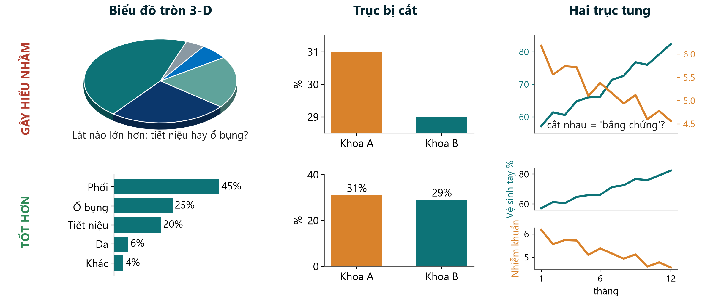{.neu-fig}

::: {.neu-takeaway}
**THÔNG ĐIỆP CHÍNH** Cột bắt đầu từ 0, mỗi biểu đồ một trục, và không dùng hiệu ứng 3-D.
:::

::: {.notes}
BỔ SUNG: Ý chính: ba kiểu bóp méo anh chị sẽ gặp trên poster, báo cáo và bài báo. Hàng trên gây hiểu nhầm, hàng dưới đã sửa.

Biểu đồ tròn 3-D: độ nghiêng làm các lát phía trước trông to hơn; mắt người so sánh góc rất kém. Hỏi: lát nào lớn hơn, tiết niệu hay ổ bụng? Sau đó cho xem biểu đồ cột đã sắp xếp: 25% so với 20%, rõ ngay lập tức.

Trục bị cắt: trục tung bắt đầu từ 28.5%, nên khác biệt 2 điểm phần trăm về tử vong (31% so với 29%) trông như gấp ba. Biểu đồ cột phải bắt đầu từ 0. (Biểu đồ đường có thể phóng to, nhưng phải nói rõ.)

Hai trục tung: hai trục khác nhau do tác giả tự chọn tỉ lệ có thể làm hai đường cắt nhau ở bất kỳ đâu tác giả muốn, gợi ý 'vệ sinh tay tăng nên nhiễm khuẩn giảm'. Tốt hơn: hai khung dùng chung trục thời gian, và nhớ rằng tương quan không phải nhân quả (6.3).

Mọi dữ liệu ở đây là mô phỏng.

Hỏi: gần đây anh chị thấy trục bị cắt ở đâu? Dự kiến: bảng điều khiển của bệnh viện, quảng cáo dược phẩm, tin tức.

Thời lượng: 2 phút.
:::
