# Buổi 6 · Phân tích: từ mẫu đến câu trả lời

## Tuần 6 · Thứ Bảy

- Câu hỏi ôn tập Buổi 5 (10 phút)
- 6.1 Từ mẫu đến quần thể: CI, giá trị p, power, cỡ mẫu, chọn kiểm định
- 6.2 So sánh các nhóm trong bộ dữ liệu khóa học (trình diễn R)
- 6.3 Mối liên quan và mô hình: hồi quy, Kaplan-Meier và Cox
- 6.4 Mô hình hóa bộ dữ liệu: OR hiệu chỉnh, HR Cox, dữ liệu thiếu, SAP
- Xây dựng đề cương 6: cỡ mẫu, kế hoạch phân tích, dữ liệu thiếu

::: {.notes}
Chào mừng trở lại. Thứ Bảy tuần trước (Buổi 5) chúng ta đã thu thập, làm sạch và mô tả dữ liệu. Hôm nay chúng ta PHÂN TÍCH: một mẫu trả lời câu hỏi về quần thể như thế nào, và đọc các con số máy tính đưa ra ra sao.

Lời hứa: vẫn không có công thức. Mỗi ý tưởng là một hình ảnh, một ví dụ minh họa từ ví dụ xuyên suốt, rồi kiểm tra nhanh một phút.

Bộ dữ liệu khóa học FLUID-ICU quay lại hai lần: ở 6.2 (so sánh các nhóm) và 6.4 (mô hình, sống còn và dữ liệu thiếu). Mỗi nhóm diễn giải gói kết quả của mình; các diễn giải đó trở thành phần Kết quả của bản thảo ở Tuần 7-8.

Thời lượng: ôn tập 0:00, 6.1 lúc 0:10, 6.2 lúc 0:50, giải lao 1:10, 6.3 lúc 1:25, 6.4 lúc 2:00, xây dựng đề cương 2:25, tổng kết 2:55.

Đây là buổi nặng về kỹ thuật nhất của khóa học. Đi chậm; bỏ trang bổ sung, không bỏ phần kiểm tra.
:::

## Ôn tập: Buổi 5 trong ba câu hỏi

::: {.neu-banner style="--c:#6C3483"}
CÂU HỎI NHANH · 10 phút
:::

:::: {.columns}
::: {.column width="60%"}
::: {.neu-activity-steps style="--c:#6C3483"}
1. C1. Thời gian nằm ICU của 300 bệnh nhân lệch phải. Đưa cách tóm tắt nào vào Bảng 1?
2. C2. Một mục CRF ghi 'Lactat: \_\_\_\_'. Nêu hai điều còn thiếu.
3. C3. Trong dữ liệu thô FLUID-ICU, có một tuổi là 210. Phép kiểm tra nào bắt được, và ghi gì vào nhật ký làm sạch?
4. Trả lời một mình (2 phút), rồi so sánh với người bên cạnh (2 phút)
:::
:::
::: {.column width="40%"}
::: {.neu-side .plain style="--c:#6C3483"}
Đáp án (công bố sau)

- C1: trung vị (IQR)
- C2: đơn vị (mmol/L), thời điểm, lựa chọn 'không làm'
- C3: kiểm tra khoảng giá trị; giá trị, cách sửa, lý do, ai và khi nào
:::
:::
::::

::: {.neu-output style="--c:#6C3483"}
**SẢN PHẨM** Mọi người nắm lại loại dữ liệu, mục CRF và làm sạch dữ liệu
:::

::: {.notes}
Mục đích: khơi lại Buổi 5 và giúp ai vắng mặt bắt kịp. Không chấm điểm.

Cách làm: đọc to từng câu; 2 phút một mình, 2 phút với người bên cạnh, rồi công bố đáp án.

C1: trung vị (IQR), vì trung bình bị kéo bởi vài ca nằm rất lâu.

C2: đơn vị (mmol/L), thời điểm (lúc vào ICU? cao nhất trong 24 giờ?), và lựa chọn 'không làm'; thêm số chữ số thập phân.

C3: kiểm tra khoảng giá trị (khoảng cho phép theo từ điển dữ liệu). Trong FLUID-ICU đó là bệnh nhân FLU-529: giá trị được đặt là thiếu và gửi câu hỏi đến cơ sở. Nhật ký làm sạch ghi mã bệnh nhân, giá trị gốc, cách xử lý (ở đây: đặt là thiếu), lý do (đã đối chiếu hồ sơ gốc) và ai làm khi nào.

Đọc ba bốn câu trả lời cuối Buổi 5 trước khi bắt đầu 6.1.

Thời lượng: 10 phút.
:::

## 6.1 Từ mẫu đến quần thể, không sợ hãi

:::: {.neu-statement}
::: {.neu-big}
Nghiên cứu một ít bệnh nhân để hiểu về rất nhiều bệnh nhân.
:::

::: {.neu-sub}
6.1 Từ mẫu đến quần thể  \|  40 phút
:::
::::

::: {.notes}
Mở đầu phần 6.1 (40 phút: mẫu và quần thể, khoảng tin cậy, giá trị p, kiểm tra nhanh, sai lầm và power, cỡ mẫu với trình diễn trực tiếp, chọn kiểm định, so sánh nhiều lần, kiểm tra nhanh lần hai).

Thông điệp chính: thống kê tồn tại vì chúng ta không thể nghiên cứu mọi bệnh nhân sốc nhiễm khuẩn trên thế giới. Ta nghiên cứu một mẫu và dùng thống kê để nói câu trả lời của mình có thể cách sự thật bao xa.

Trấn an: hôm nay anh chị học cách ĐỌC đúng khoảng tin cậy và giá trị p. Như vậy đã hơn nhiều tác giả có bài đăng.

Chuyển ý: ta nghiên cứu một mẫu 40, 400 hay 620 bệnh nhân; ước lượng cách sự thật bao xa? Vũ điệu của các khoảng tin cậy cho thấy điều đó (hình mẫu và quần thể là trang bổ sung).
:::

## Vũ điệu của các khoảng tin cậy

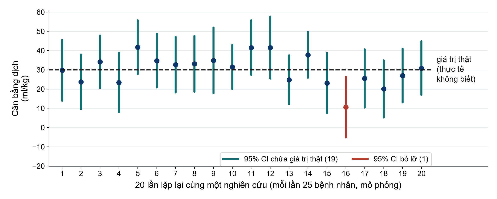{.neu-fig}

::: {.neu-takeaway}
**THÔNG ĐIỆP CHÍNH** Khoảng 95/100 khoảng như vậy chứa giá trị thật; ta không biết là khoảng nào.
:::

::: {.notes}
Ý chính: đây là hình quan trọng nhất trong ngày. Hãy dành thời gian.

Chúng tôi mô phỏng cùng một nghiên cứu 20 lần, mỗi lần 25 bệnh nhân, từ một quần thể có cân bằng dịch trung bình thật là 30 ml/kg (đường đứt nét). Mỗi nghiên cứu cho một ước lượng khác nhau (chấm) và một khoảng tin cậy 95% khác nhau (đoạn thẳng đứng). Các khoảng 'nhảy múa'.

19 trong 20 khoảng chứa giá trị thật; một khoảng (màu đỏ) bỏ lỡ nó. Đó là ý nghĩa của '95%': PHƯƠNG PHÁP bắt được sự thật trong khoảng 95% số nghiên cứu.

Trong thực tế anh chị chỉ làm MỘT nghiên cứu, thấy MỘT khoảng, và không nhìn thấy đường đứt nét. Anh chị không biết khoảng của mình là một trong 19 khoảng may mắn hay khoảng không may.

Cách đọc thực tế: khoảng tin cậy (CI) 95% là khoảng các giá trị của tác động thật phù hợp với dữ liệu của ta. Khoảng hẹp = chính xác; khoảng rộng = kém chính xác.

Hiểu sai thường gặp: 'có 95% xác suất giá trị thật nằm trong CHÍNH khoảng này'. Nói chặt chẽ, con số 95% nói về phương pháp qua nhiều lần lặp lại. Ở cấp độ này, cách nói an toàn là 'một khoảng các giá trị hợp lý'.

Hỏi: điều gì làm các khoảng ngắn lại? Dự kiến: nhiều bệnh nhân hơn, bệnh nhân ít khác biệt nhau hơn.
:::

## Giá trị p trong một hình

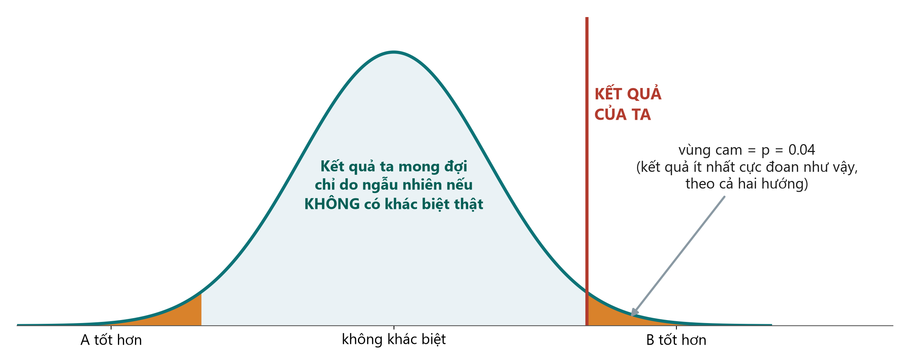{.neu-fig}

::: {.neu-takeaway}
**THÔNG ĐIỆP CHÍNH** p = kết quả của ta đáng ngạc nhiên đến đâu nếu thực sự không có khác biệt.
:::

::: {.notes}
Ý chính: bắt đầu bằng việc tưởng tượng KHÔNG có khác biệt thật giữa các nhóm (giả thuyết không, H0). Ngay cả khi đó, chỉ riêng ngẫu nhiên cũng tạo ra các kết quả dao động quanh 'không khác biệt': đó là đường cong hình chuông.

Bây giờ đặt kết quả CỦA TA lên hình. Giá trị p là vùng màu cam: tỉ lệ các kết quả ít nhất cực đoan như kết quả của ta (theo cả hai hướng) mà chỉ riêng ngẫu nhiên tạo ra nếu không có khác biệt thật.

p = 0.04 nghĩa là: nếu thực sự không có khác biệt, các kết quả cực đoan như thế này hoặc hơn sẽ xảy ra khoảng 4 lần trong 100 nghiên cứu. Khá đáng ngạc nhiên, nên ta nghi ngờ giả định 'không khác biệt'.

p = 0.42 (Bài báo 1) nghĩa là: kết quả như vậy rất thường gặp ngay cả khi không có khác biệt thật. Không đáng ngạc nhiên, nên không có bằng chứng chống lại 'không khác biệt'. Nhưng cũng không chứng minh 'không khác biệt'.

Ngưỡng 0.05 là một quy ước, không phải quy luật tự nhiên. p = 0.049 và p = 0.051 thực tế là cùng một mức bằng chứng.

Tránh nói 'giá trị p là xác suất kết quả do ngẫu nhiên'; xem trang tiếp theo.

Hỏi: p nhỏ có cho biết tác động lớn không? Dự kiến: không. Đó là hiểu sai số 2.
:::

## Năm cách hiểu sai giá trị p thường gặp

::: {.neu-intro}
Mỗi câu dưới đây đều xuất hiện trong các bài báo đã đăng. Tất cả đều sai.
:::

:::: {.neu-cards style="--n:5"}
::: {.neu-card .plain style="--c:#0D7377"}
[1. 'Xác suất H0']{.neu-card-title}

- p KHÔNG phải xác suất
- không có tác động
:::
::: {.neu-card .plain style="--c:#0B376C"}
[2. 'Tác động lớn']{.neu-card-title}

- p nhỏ KHÔNG có nghĩa
- tác động lớn hay quan trọng
:::
::: {.neu-card .plain style="--c:#5FA39B"}
[3. 'Không tác động']{.neu-card-title}

- p \> 0.05 KHÔNG chứng minh
- không có tác động
:::
::: {.neu-card .plain style="--c:#0070C0"}
[4. 'Xu hướng']{.neu-card-title}

- p = 0.08 KHÔNG phải
- 'gần có ý nghĩa'
:::
::: {.neu-card .plain style="--c:#055F56"}
[5. 'Chỉ có p']{.neu-card-title}

- Chỉ p là KHÔNG đủ:
- cần tác động + 95% CI
:::
::::

::: {.neu-takeaway}
**THÔNG ĐIỆP CHÍNH** Báo cáo độ lớn tác động kèm 95% CI; giá trị p chỉ là vai phụ.
:::

::: {.notes}
Ý chính: năm cách hiểu sai, mỗi thẻ một cách. Mời cả lớp biểu quyết 'đúng hay sai' cho từng câu trước khi giải thích.

1. 'p = 0.03 nghĩa là có 3% khả năng giả thuyết không đúng.' Sai: p được tính khi GIẢ ĐỊNH giả thuyết không là đúng; nó không thể đồng thời là xác suất của giả thuyết không.

2. 'p \< 0.001, vậy tác động lớn.' Sai: với hàng nghìn bệnh nhân, một khác biệt nhỏ không có ý nghĩa lâm sàng vẫn có p rất nhỏ. Hãy xem độ lớn tác động và hỏi liệu nó có quan trọng với bệnh nhân không.

3. 'p = 0.42, vậy hai chiến lược tương đương.' Sai: Bài báo 1 là ví dụ hoàn hảo. CI rộng cho thấy ta đơn giản là chưa biết.

4. 'p = 0.08 cho thấy xu hướng có lợi.' Sai: giá trị p không 'hướng về' đâu cả. Bảng kiểm thẩm định của khóa học hỏi đúng điều này: không gọi p = 0.42 là 'xu hướng'.

5. 'Kết quả: p = 0.02.' Chưa đủ: người đọc cần biết độ lớn tác động và mức độ không chắc chắn. Bài báo 2 làm đúng: HR 2.13 (95% CI 1.48-3.06), p \< 0.001.

Năm câu này có trong bài tập đúng/sai ở phiếu bài tập của học viên.
:::

## Kiểm tra nhanh: CI và giá trị p

::: {.neu-banner style="--c:#6C3483"}
CÂU HỎI NHANH · 3 phút
:::

:::: {.columns}
::: {.column width="60%"}
::: {.neu-activity-steps style="--c:#6C3483"}
1. 'HR 2.13 (95% CI 1.48-3.06)': dữ liệu phù hợp với HR thật từ khoảng 1.5 đến 3.1. Đúng hay sai?
2. 'p = 0.42, vậy hai chiến lược tương đương.' Đúng hay sai?
3. 'p = 0.03 nghĩa là có 3% khả năng không có tác động.' Đúng hay sai?
4. 'Nghiên cứu lớn hơn thường cho CI hẹp hơn.' Đúng hay sai?
:::
:::
::: {.column width="40%"}
::: {.neu-side .plain style="--c:#6C3483"}
Đáp án

- Đúng
- Sai: ta chưa biết
- Sai: p giả định không có tác động
- Đúng
:::
:::
::::

::: {.neu-output style="--c:#6C3483"}
**SẢN PHẨM** Mọi người đọc được CI và tránh các lỗi kinh điển về giá trị p
:::

::: {.notes}
Kiểm tra nhanh (3 phút). Giơ tay hoặc thẻ màu (xanh đúng, đỏ sai) cho mỗi câu, rồi công bố.

1. Đúng: cách đọc thực tế của 95% CI (Bài báo 2, ngày 2).

2. Sai: không có bằng chứng không phải là bằng chứng của việc không có; CI của Bài báo 1 rất rộng (-15.2 đến 41.6).

3. Sai: p được tính khi giả định không có tác động; nó không phải xác suất không có tác động.

4. Đúng: nhiều bệnh nhân hơn, chính xác hơn.

Nếu lớp chia rẽ ở câu 2 hoặc 3, quay lại hình giá trị p một phút; đây là hiểu lầm quan trọng nhất cần sửa hôm nay.
:::

## Sai lầm loại I và loại II: chuông báo cháy

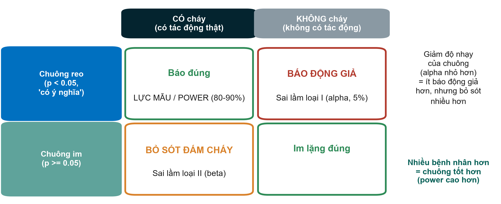{.neu-fig}

::: {.neu-takeaway}
**THÔNG ĐIỆP CHÍNH** Alpha = nguy cơ báo động giả; power = khả năng phát hiện tác động thật.
:::

::: {.notes}
Ý chính: một kiểm định thống kê giống như chuông báo cháy. Có hai cách để sai.

Sai lầm loại I (báo động giả): chuông reo nhưng không có cháy. Ta kết luận điều trị có hiệu quả trong khi thực tế không. Ta chấp nhận nguy cơ 5% cho điều này: đó là alpha = 0.05.

Sai lầm loại II (bỏ sót đám cháy): CÓ cháy nhưng chuông im lặng. Điều trị có hiệu quả nhưng nghiên cứu không chứng minh được. Nguy cơ này gọi là beta.

Power (lực mẫu, năng lực thống kê) = 1 - beta = khả năng chuông reo khi thực sự có cháy. Thường đặt mục tiêu 80% hoặc 90%.

Đánh đổi: làm chuông kém nhạy hơn (alpha nhỏ hơn) thì ít báo động giả hơn nhưng bỏ sót nhiều đám cháy hơn, trừ khi mua một chiếc chuông tốt hơn: nhiều bệnh nhân hơn.

Liên hệ lâm sàng: một thử nghiệm nhỏ 'âm tính' có thể chỉ là một đám cháy bị bỏ sót. Bài báo 1 là nghiên cứu pilot được thiết kế để phát hiện một khác biệt lớn; một khác biệt thật nhỏ hơn rất dễ bị bỏ sót.

Hỏi: sai lầm nào tệ hơn khi thử một thuốc mới, đắt và nhiều rủi ro? Còn với một can thiệp rẻ và an toàn? Không có một đáp án duy nhất; để cả lớp tranh luận một phút.
:::

## Cỡ mẫu: tác động lớn hơn, ít nhiễu hơn = ít bệnh nhân hơn

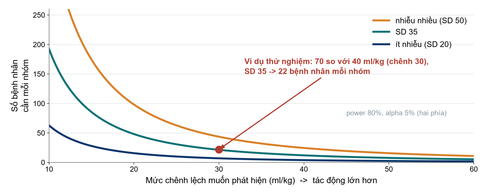{.neu-fig}

::: {.neu-takeaway}
**THÔNG ĐIỆP CHÍNH** Cỡ mẫu phụ thuộc vào tác động muốn phát hiện và mức độ nhiễu.
:::

::: {.notes}
Ý chính: anh chị cần ít bệnh nhân hơn khi (1) mức khác biệt muốn phát hiện lớn hơn và (2) bệnh nhân ít khác biệt nhau hơn (ít nhiễu, SD nhỏ hơn). Alpha và power thường cố định ở 5% và 80-90%.

Đọc các đường cong: với khác biệt 30 ml/kg và SD 35, cần 22 bệnh nhân mỗi nhóm (chấm đỏ). Giảm khác biệt còn một nửa (15 ml/kg) thì cần khoảng gấp bốn lần (86 mỗi nhóm). Với dữ liệu nhiễu hơn (SD 50), mọi điểm đều dịch lên.

Ví dụ xuyên suốt: đây chính là phép tính trong phần phương pháp của Bài báo 1: họ dự kiến 70 so với 40 ml/kg, SD 35, power 80%, alpha 5% hai phía: 22 mỗi nhóm, tổng 44, tăng thêm 10% cho tử vong thành 50 bệnh nhân.

Đầu vào khó nhất là tác động dự kiến: lấy từ các nghiên cứu trước, số liệu thử nghiệm, hoặc mức khác biệt nhỏ nhất đủ để thay đổi thực hành (khác biệt tối thiểu có ý nghĩa lâm sàng). Đừng chọn nó chỉ để có cỡ mẫu nhỏ.

Lỗi thường gặp: 'chúng tôi lấy tất cả bệnh nhân năm ngoái' mà không tính toán; người phản biện sẽ hỏi về power.

Chuyển ý: hãy làm trực tiếp.
:::

## Trình diễn trực tiếp: công cụ tính cỡ mẫu trực tuyến

::: {.neu-banner style="--c:#B5651D"}
TRÌNH DIỄN TRỰC TIẾP · 8 phút
:::

:::: {.columns}
::: {.column width="60%"}
::: {.neu-activity-steps style="--c:#B5651D"}
1. Mở một công cụ tính trực tuyến miễn phí (ví dụ OpenEpi) trên trình duyệt
2. Hai trung bình: 70 so với 40 ml/kg, SD 35, power 80%, alpha 5% -\> 22 mỗi nhóm
3. Hai tỉ lệ: tử vong 40% so với 30% -\> khoảng 356 mỗi nhóm
4. Thay đổi từng đầu vào một và xem con số thay đổi
5. Dự phòng không cần mạng: bảng tính cỡ mẫu của Neudata
:::
:::
::: {.column width="40%"}
::: {.neu-side .plain style="--c:#B5651D"}
Điều gì làm n thay đổi?

- Tác động nhỏ hơn: n TĂNG
- Nhiễu (SD) nhiều hơn: n TĂNG
- Power cao hơn: n TĂNG
- Cộng thêm 10-20% bỏ cuộc
:::
:::
::::

::: {.neu-output style="--c:#B5651D"}
**SẢN PHẨM** Các nhóm biết 4 con số cần cho câu phát biểu cỡ mẫu của mình
:::

::: {.notes}
Trình diễn trực tiếp, 8 phút. Nếu thiếu thời gian, chỉ làm Bước 2 và 3. Kịch bản đầy đủ với kết quả dự kiến trong Course/Demos/s6\_demo.md.

Bước 1: mở công cụ. Nói: bất kỳ công cụ miễn phí, uy tín nào cũng được; điều quan trọng là hiểu các đầu vào.

Bước 2: hai trung bình độc lập, tái lập Bài báo 1: trung bình 1 = 70, trung bình 2 = 40, SD 35 ở cả hai nhóm, alpha 5% hai phía, power 80%, tỉ lệ 1:1. Kết quả dự kiến: 22 mỗi nhóm (tổng 44). Cộng 10% cho tử vong: 50. Khớp với bài báo.

Bước 3: hai tỉ lệ (câu hỏi thật của ta: tử vong 28 ngày). Thường quy 40%, hạn chế dịch 30%, power 80%, alpha 5%. Kết quả dự kiến: khoảng 356 mỗi nhóm khi không hiệu chỉnh liên tục (khoảng 376 khi có hiệu chỉnh). Các phương pháp khác nhau cho con số hơi khác nhau; điều đó bình thường.

Bước 4: thay đổi từng đầu vào: power 90% (n tăng lên khoảng 477 mỗi nhóm); khác biệt 40% so với 35% (n tăng lên hơn 1400 mỗi nhóm). Mời cả lớp đoán hướng thay đổi trước khi bấm.

Bước 5: nếu mất mạng, mở Course/Resources/tools/sample\_size\_calculator.xlsx và trình bày ba ví dụ tương tự; các ô màu vàng là ô nhập.

Thông điệp chính: Bài báo 1 cần 50 bệnh nhân cho kết cục cân bằng dịch, nhưng một thử nghiệm về tử vong cần hàng trăm bệnh nhân mỗi nhóm. Kết cục anh chị chọn thay đổi mọi thứ.

KHÔNG để học viên tự tính; họ quan sát và dự đoán.
:::

## Chọn kiểm định: một sơ đồ quyết định

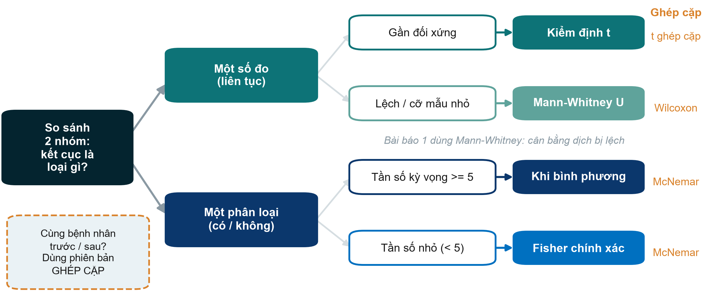{.neu-fig}

::: {.neu-takeaway}
**THÔNG ĐIỆP CHÍNH** Loại kết cục + hình dạng + ghép cặp hay không = kiểm định phù hợp.
:::

::: {.notes}
Ý chính: khi so sánh hai nhóm, hai câu hỏi quyết định kiểm định.

Câu 1: kết cục là gì? Một số đo (liên tục) hay một phân loại (có/không)?

Câu 2a (số đo): gần đối xứng? Dùng kiểm định t (so sánh trung bình). Lệch hoặc cỡ mẫu rất nhỏ? Dùng Mann-Whitney U (so sánh phân phối/thứ hạng; thường báo cáo kèm trung vị).

Câu 2b (phân loại): tần số kỳ vọng trong mỗi ô từ 5 trở lên? Dùng khi bình phương (chi-square). Tần số nhỏ? Dùng kiểm định chính xác Fisher.

Dữ liệu ghép cặp (cùng bệnh nhân đo trước và sau, hoặc các cặp được ghép): dùng phiên bản ghép cặp: t ghép cặp, Wilcoxon cho cặp (signed-rank), McNemar.

Ví dụ xuyên suốt: Bài báo 1 dùng kiểm định Mann-Whitney vì cân bằng dịch bị lệch: nhất quán với việc báo cáo trung vị.

Ba nhóm trở lên: ANOVA hoặc Kruskal-Wallis. Chỉ nhắc qua; hãy hỏi nhà thống kê.

Sơ đồ này là một trong những công cụ mang về của khóa học, đồng thời là cơ sở cho bài tập 'chọn kiểm định'.

Hỏi: so sánh tỉ lệ tổn thương thận cấp ở 24 so với 24 bệnh nhân, chỉ có 3 và 7 biến cố? Dự kiến: Fisher chính xác (tần số nhỏ).
:::

## Ghép cặp hay không ghép cặp? Cùng hay khác bệnh nhân

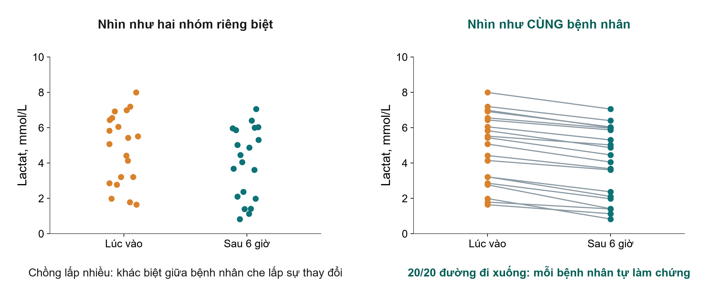{.neu-fig}

::: {.neu-takeaway}
**THÔNG ĐIỆP CHÍNH** Cùng bệnh nhân đo hai lần = kiểm định ghép cặp; khác bệnh nhân = không ghép cặp.
:::

::: {.notes}
Ý chính: sơ đồ chọn kiểm định hỏi 'ghép cặp hay không?'. Hình này cho thấy vì sao điều đó quan trọng.

Lactat mô phỏng ở 20 bệnh nhân lúc vào ICU và 6 giờ sau. Bên trái: vẽ như hai đám mây riêng, giá trị trước và sau chồng lấp nhiều; bệnh nhân khác nhau rất nhiều, và sự khác biệt đó che lấp sự thay đổi.

Bên phải: cùng các con số, nhưng hai giá trị của mỗi bệnh nhân được nối lại. Mọi đường đều đi xuống. Mỗi bệnh nhân tự làm chứng cho chính mình, nên nhiễu giữa các bệnh nhân biến mất. Kiểm định ghép cặp (t ghép cặp, hoặc Wilcoxon cho cặp nếu dữ liệu lệch) dùng đúng điều này và có power cao hơn nhiều.

Thiết kế ghép cặp: trước/sau trên cùng bệnh nhân, thử nghiệm bắt chéo, các cặp được ghép (Bài báo 2 ghép bệnh nhân 1:1 theo điểm xu hướng và phân tích theo cặp).

Lỗi thường gặp: phân tích dữ liệu trước/sau bằng kiểm định t không ghép cặp. Cách này bỏ mất thông tin ghép cặp và có thể bỏ sót một thay đổi thật.

Hỏi: anh chị đo điểm đau ở 30 bệnh nhân trước và sau một quy trình giảm đau mới. Ghép cặp hay không? Dự kiến: ghép cặp.

Thời lượng: 2 phút.
:::

## So sánh nhiều lần: bài toán kẹo dẻo

:::: {.columns}
::: {.column width="38%"}
::: {.neu-side-notes}
### Cần làm gì

- Định trước MỘT kết cục chính
- Gọi phần còn lại là thăm dò
- Hiệu chỉnh, VD Bonferroni: 0.05 / số kiểm định
- Báo cáo mọi kiểm định đã làm
:::
:::
::: {.column width="62%"}
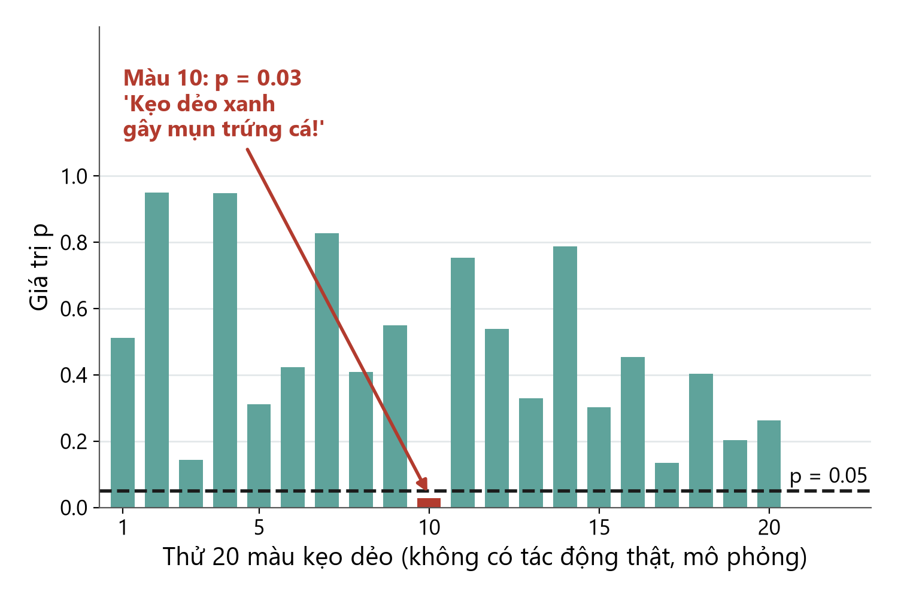{.neu-fig-side}
:::
::::

::: {.neu-takeaway}
**THÔNG ĐIỆP CHÍNH** Kiểm định 20 thứ thì sẽ có một thứ 'có ý nghĩa' chỉ do ngẫu nhiên.
:::

::: {.notes}
Ý chính: mỗi kiểm định mang nguy cơ báo động giả 5%. Làm nhiều kiểm định thì báo động giả gần như chắc chắn xảy ra.

Hình (lấy ý tưởng từ một tranh hài nổi tiếng): nhà nghiên cứu kiểm tra xem kẹo dẻo có gây mụn trứng cá không. Kết quả chung không có gì, nên họ thử riêng 20 màu. Dù không có tác động thật nào (mô phỏng), một màu cho p = 0.03, và tiêu đề báo là 'Kẹo dẻo xanh gây mụn trứng cá!'.

Với 20 kiểm định độc lập và không có tác động thật, khả năng có ít nhất một p \< 0.05 là khoảng 64%.

Phiên bản lâm sàng: 10 kết cục phụ, 8 phân nhóm, 5 thời điểm, nhiều chỉ số xét nghiệm, đều được kiểm định và chỉ báo cáo cái 'có ý nghĩa'.

Cách khắc phục (khung bên): định trước một kết cục chính trong đề cương hoặc SAP (6.4); gọi mọi thứ khác là thăm dò; hiệu chỉnh ngưỡng khi nhiều kiểm định cùng trả lời một câu hỏi (Bonferroni: 0.05 chia cho số kiểm định, tức 0.0025 với 20 kiểm định); và báo cáo mọi kiểm định, không chỉ những cái 'thắng'.

Hỏi: một bài báo báo cáo 12 phân nhóm và nhấn mạnh phân nhóm có p = 0.04. Anh chị tin đến đâu? Dự kiến: không nhiều; cần được xác nhận.

Thời lượng: 2 phút.
:::

## Kiểm tra nhanh: kiểm định nào?

::: {.neu-banner style="--c:#6C3483"}
CÂU HỎI NHANH · 3 phút
:::

:::: {.columns}
::: {.column width="60%"}
::: {.neu-activity-steps style="--c:#6C3483"}
1. Thời gian nằm ICU (lệch) ở nhóm cân bằng dịch dương và âm
2. Tử vong 28 ngày (có/không) ở 300 so với 300 bệnh nhân
3. Lactat lúc vào và sau 6 giờ trên cùng 40 bệnh nhân
4. Lọc máu (có/không): 2/24 so với 5/24 bệnh nhân
:::
:::
::: {.column width="40%"}
::: {.neu-side .plain style="--c:#6C3483"}
Đáp án

- Mann-Whitney U
- Khi bình phương
- t ghép cặp
- Fisher chính xác
:::
:::
::::

::: {.neu-output style="--c:#6C3483"}
**SẢN PHẨM** Mọi người dùng được sơ đồ chọn kiểm định
:::

::: {.notes}
Kiểm tra nhanh (3 phút). Với mỗi tình huống, cả lớp nói tên kiểm định theo sơ đồ quyết định (số đo hay phân loại? hình dạng hay tần số? ghép cặp?).

1. Mann-Whitney U: số đo, lệch, hai nhóm độc lập (đây chính là câu hỏi thời gian nằm ICU của FLUID-ICU).

2. Khi bình phương: kết cục nhị phân, hai nhóm độc lập lớn.

3. t ghép cặp (hoặc Wilcoxon cho cặp nếu thay đổi bị lệch): cùng bệnh nhân đo hai lần.

4. Fisher chính xác: kết cục nhị phân, tần số rất nhỏ.

Chuyển ý: giờ chúng ta chạy đúng các kiểm định này trên bộ dữ liệu khóa học (6.2).
:::

## 6.2 So sánh các nhóm trong bộ dữ liệu khóa học

:::: {.neu-statement}
::: {.neu-big}
Chọn kiểm định theo kết cục, rồi đọc kết quả như một tác động kèm CI.
:::

::: {.neu-sub}
6.2 So sánh các nhóm trong bộ dữ liệu  \|  20 phút
:::
::::

::: {.notes}
Mở đầu phần 6.2 (20 phút: trình diễn trực tiếp các kiểm định 6 phút, bảng kết quả, một ví dụ minh họa, rồi 7 phút để các nhóm diễn giải phép so sánh của mình).

Thông điệp chính: sơ đồ chọn kiểm định ở 6.1, áp dụng cho FLUID-ICU. Mọi so sánh ở đây đều CHƯA HIỆU CHỈNH: nhớ Bảng 1 (nhóm cân bằng dương nặng hơn).
:::

## Trình diễn: so sánh hai nhóm bằng R

::: {.neu-banner style="--c:#B5651D"}
TRÌNH DIỄN TRỰC TIẾP · 6 phút
:::

:::: {.columns}
::: {.column width="60%"}
::: {.neu-activity-steps style="--c:#B5651D"}
1. Mở 03\_compare.R
2. Tuổi (đối xứng): kiểm định t
3. SOFA và lactat (lệch): Mann-Whitney
4. Tử vong 28 ngày (có/không): bảng 2x2 và khi bình phương
5. Lỗi thường gặp: kiểm định t trên thời gian nằm ICU lệch
:::
:::
::: {.column width="40%"}
::: {.neu-side .plain style="--c:#B5651D"}
Sơ đồ quyết định

- Số đo hay phân loại?
- Đối xứng hay lệch?
- Ghép cặp hay không?
- Tác động + 95% CI
:::
:::
::::

::: {.neu-output style="--c:#B5651D"}
**SẢN PHẨM** Mọi người thấy kiểm định được chọn theo loại kết cục
:::

::: {.notes}
Trình diễn trực tiếp, 6 phút. Kịch bản đầy đủ: Course/Demos/s6\_demo.md (Phần B), dùng Course/Data/R/03\_compare.R.

Với mỗi phép so sánh, mời cả lớp nói tên kiểm định TRƯỚC khi chạy (sơ đồ quyết định).

Cho thấy: tuổi với kiểm định t; SOFA và lactat với Mann-Whitney (chú ý 91 bệnh nhân không có lactat nên n thay đổi); tử vong 28 ngày dạng bảng 2x2: 134/373 (35.9%) so với 45/245 (18.4%), khi bình phương p \< 0.001; kiểm định t 'sai' trên thời gian nằm ICU lệch ở người sống (chênh lệch trung bình 2.7 ngày) đặt cạnh chênh lệch Mann-Whitney / Hodges-Lehmann (2.5 ngày).

Nếu R lỗi: dùng trang sau (mọi kết quả trong một bảng).
:::

## FLUID-ICU: bốn kết cục, bốn phép so sánh

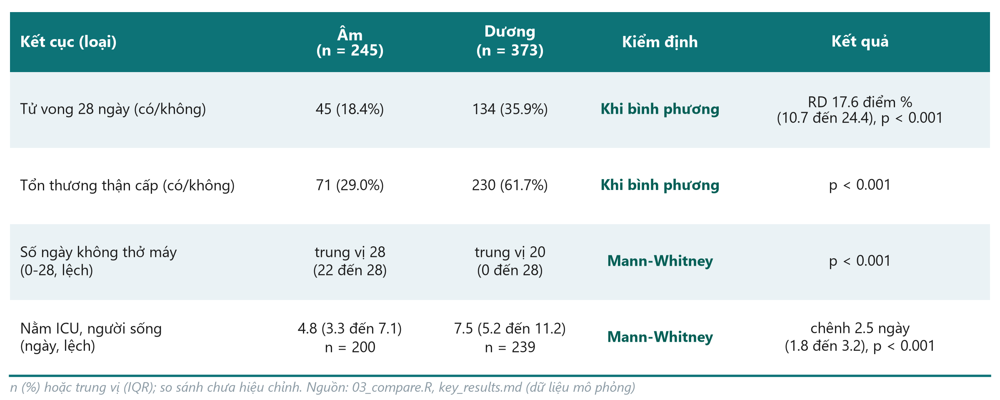{.neu-fig}

::: {.neu-takeaway}
**THÔNG ĐIỆP CHÍNH** Mọi kết cục đều xấu hơn ở nhóm cân bằng dương, trước khi hiệu chỉnh.
:::

::: {.notes}
Ý chính: kiểm định đúng cho mỗi loại kết cục, và đọc kết quả như một tác động.

Tử vong 28 ngày (nhị phân): 134/373 (35.9%) so với 45/245 (18.4%); hiệu số nguy cơ 17.6 điểm phần trăm (95% CI 10.7 đến 24.4); RR 1.96; khi bình phương p \< 0.001.

AKI (nhị phân): 230/373 (61.7%) so với 71/245 (29.0%); khi bình phương p \< 0.001.

Số ngày không thở máy (biến đếm 0-28, dồn ở 0 và 28): trung vị 20 (0 đến 28) so với 28 (22 đến 28); Mann-Whitney p \< 0.001.

Thời gian nằm ICU ở người sống (lệch): trung vị 7.5 (5.2 đến 11.2) so với 4.8 (3.3 đến 7.1) ngày; Mann-Whitney p \< 0.001; chênh lệch Hodges-Lehmann 2.5 ngày (95% CI 1.8 đến 3.2).

Tất cả chưa hiệu chỉnh: nhóm cân bằng dương nặng hơn ngay từ đầu (Bảng 1). Các khác biệt này trộn lẫn tác động của dịch với tác động của mức độ nặng. Đó là lý do phần 6.4 hiệu chỉnh.

Hỏi: con số nào anh chị đưa vào tóm tắt cho tử vong: p \< 0.001, hay hiệu số nguy cơ kèm CI? Dự kiến: hiệu số nguy cơ kèm CI (và sau đó là OR hiệu chỉnh).
:::

## Ví dụ minh họa: đọc phép so sánh tử vong

::: {.neu-intro}
Q1, chưa hiệu chỉnh: cân bằng dịch dương so với âm đến ngày 3.
:::

:::: {.neu-steps}
::: {.neu-step style="--c:#0D7377"}
[1]{.neu-step-num}[Nguy cơ]{.neu-step-label}

- 134/373 = 35.9%
- 45/245 = 18.4%
:::
::: {.neu-step style="--c:#0B376C"}
[2]{.neu-step-num}[Hiệu số]{.neu-step-label}

- 17.6 điểm phần trăm
- 95% CI 10.7 đến 24.4
:::
::: {.neu-step style="--c:#5FA39B"}
[3]{.neu-step-num}[Tỉ số]{.neu-step-label}

- RR 1.96:
- nguy cơ khoảng gấp đôi
:::
::: {.neu-step style="--c:#0070C0"}
[4]{.neu-step-num}[Kiểm định]{.neu-step-label}

- Khi bình phương
- p \< 0.001
:::
::: {.neu-step style="--c:#055F56"}
[5]{.neu-step-num}[Nhưng...]{.neu-step-label}

- Chưa hiệu chỉnh:
- bệnh nhân nặng hơn
:::
::::

::: {.neu-takeaway}
**THÔNG ĐIỆP CHÍNH** Báo cáo tác động và CI; rồi hỏi điều gì khác có thể giải thích nó.
:::

::: {.notes}
Ví dụ minh họa (3 phút), bước tính toán duy nhất: bảng 2x2 ở Buổi 4 áp dụng cho bộ dữ liệu.

Nguy cơ: 134 trong 373 bệnh nhân cân bằng dương tử vong (35.9%); 45 trong 245 bệnh nhân cân bằng âm (18.4%).

Hiệu số nguy cơ: 35.9 - 18.4 = 17.6 điểm phần trăm (làm tròn), 95% CI 10.7 đến 24.4: cách xa 0.

Tỉ số nguy cơ: 35.9 / 18.4 = 1.96: nguy cơ khoảng gấp đôi.

Kiểm định: khi bình phương p \< 0.001: khác biệt như vậy sẽ rất đáng ngạc nhiên nếu không có khác biệt.

Nhưng: đây là đoàn hệ; bệnh nhân cân bằng dương nặng hơn (SOFA 8 so với 6). So sánh thô không tách được dịch truyền khỏi mức độ nặng.

Câu mẫu: 'Tử vong 28 ngày là 35.9% ở bệnh nhân cân bằng dương và 18.4% ở bệnh nhân cân bằng âm (hiệu số nguy cơ 17.6 điểm phần trăm, 95% CI 10.7 đến 24.4).'
:::

## Diễn giải phép so sánh của nhóm

::: {.neu-banner style="--c:#0D7377"}
LÀM VIỆC NHÓM · 7 phút
:::

:::: {.columns}
::: {.column width="60%"}
::: {.neu-activity-steps style="--c:#0D7377"}
1. Tìm kết cục của nhóm trong gói kết quả (bảng so sánh)
2. Kiểm định nào được dùng, và vì sao?
3. Viết kết quả như một tác động kèm 95% CI (hoặc trung vị kèm IQR)
4. Viết một câu cho phần Kết quả: không chỉ ghi 'có ý nghĩa', không dùng từ nhân quả
5. Ghi một lý do khiến phép so sánh có thể bị sai lệch
:::
:::
::: {.column width="40%"}
::: {.neu-side .plain style="--c:#0D7377"}
Tránh

- Chỉ có giá trị p
- 'chứng minh', 'gây ra'
- 'xu hướng' khi p \> 0.05
- Quên ghi n
:::
:::
::::

::: {.neu-output style="--c:#0D7377"}
**SẢN PHẨM** Một câu Kết quả cho kết cục của nhóm (bài 4)
:::

::: {.notes}
Phiếu bài tập nhóm, 7 phút (5 phút làm, 2 phút phản hồi). Bài tập Buổi 6, bài 4; đáp án mẫu trong s6\_solutions.md.

Câu mẫu theo câu hỏi:

Q1: tử vong 35.9% so với 18.4% (hiệu số nguy cơ 17.6 điểm, 95% CI 10.7 đến 24.4).

Q2: AKI 61.7% so với 29.0% (cân bằng dương so với âm), khi bình phương p \< 0.001.

Q3: số ngày không thở máy trung vị 20 (0 đến 28) so với 28 (22 đến 28), Mann-Whitney p \< 0.001.

Q4: lactat trung vị 3.1 (2.2 đến 4.5) mmol/L ở người tử vong so với 2.3 (1.6 đến 3.4) ở người sống.

Q5: thời gian nằm ICU ở người sống trung vị 7.5 (5.2 đến 11.2) so với 4.8 (3.3 đến 7.1) ngày; chênh lệch Hodges-Lehmann 2.5 ngày (95% CI 1.8 đến 3.2).

Lý do sai lệch (mọi nhóm): nhiễu do chỉ định; nhóm cân bằng dương nặng hơn.

Sau đó giải lao.
:::

## Giải lao

::: {.neu-banner style="--c:#8A99A3"}
GIẢI LAO · 15 phút
:::

:::: {.columns}
::: {.column width="60%"}
::: {.neu-activity-steps style="--c:#8A99A3"}
1. Vận động, cà phê, hít thở không khí
2. Các nhóm: ghi một câu hỏi về kết quả so sánh của nhóm
3. Chúng ta bắt đầu lại với 6.3: mối liên quan và mô hình
:::
:::
::: {.column width="40%"}
::: {.neu-side .plain style="--c:#8A99A3"}
Sau giải lao

- Tương quan
- Hồi quy tuyến tính và logistic
- Hiệu chỉnh
- Kaplan-Meier và Cox
- Mô hình trên bộ dữ liệu
:::
:::
::::

::: {.notes}
Giải lao: 15 phút. Bắt đầu lại đúng giờ (1:25).

Trong giờ giải lao: mở 04\_models.R và 05\_missing.R trên máy chiếu và kiểm tra các hình dự phòng cho phần 6.4.

Thu các câu hỏi các nhóm ghi về kết quả so sánh; trả lời những câu chung khi bắt đầu 6.3.
:::

## 6.3 Mối liên quan và mô hình (khái niệm)

:::: {.neu-statement}
::: {.neu-big}
Không cần chạy mô hình mới đọc được mô hình.
:::

::: {.neu-sub}
6.3 Mối liên quan và mô hình  \|  35 phút
:::
::::

::: {.notes}
Mở đầu phần 6.3 (35 phút: tương quan, hồi quy tuyến tính và logistic, chọn mô hình, hiệu chỉnh, đọc bảng hồi quy với kiểm tra 5 phút, quá khớp, phân tích sống còn và biểu đồ rừng của ví dụ xuyên suốt; tương tác, giá trị không tác động và dự báo/học máy là trang bổ sung).

Thông điệp chính: mọi mô hình trả lời cùng một câu hỏi bằng những ngôn ngữ khác nhau: kết cục liên quan với phơi nhiễm thế nào, và ta chắc chắn đến đâu? Cần bốn điều để đọc bất kỳ mô hình nào: kết cục là gì, mô hình nào đi kèm, con số có nghĩa gì (hệ số, OR hay HR) và giá trị 'không tác động' nằm ở đâu.

Nối lại Buổi 4: nhiễu do chỉ định. Mô hình là một trong những công cụ chính để xử lý các yếu tố gây nhiễu đã đo được trong nghiên cứu quan sát.

Chuyển ý: bắt đầu từ mối liên quan đơn giản nhất, hai con số trên biểu đồ phân tán.
:::

## Tương quan: hai con số cùng thay đổi chặt chẽ đến đâu

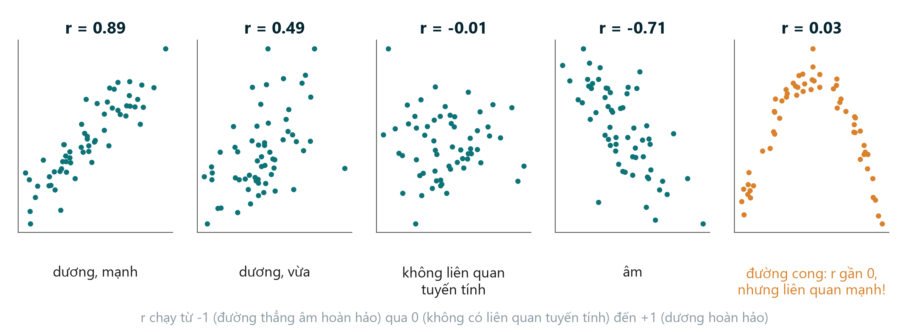{.neu-fig}

::: {.neu-takeaway}
**THÔNG ĐIỆP CHÍNH** r đo liên quan theo đường thẳng, từ -1 đến +1. Luôn nhìn biểu đồ.
:::

::: {.notes}
Ý chính: hệ số tương quan r tóm tắt biểu đồ phân tán của hai biến số bằng một con số.

Đọc các khung: r gần +1, các điểm nằm sát một đường đi lên; r khoảng 0.5, đám mây lỏng có xu hướng; r gần 0, không có liên quan theo đường thẳng; r âm, biến này tăng thì biến kia giảm.

Khung cuối là cái bẫy: r gần 0, nhưng có một liên quan dạng cong rất mạnh (ví dụ liều tối ưu, hay tử vong hình chữ U theo huyết áp). r chỉ đo liên quan theo ĐƯỜNG THẲNG, nên luôn phải nhìn biểu đồ.

Hướng dẫn ước lượng (không phải quy tắc): 0.1 yếu, 0.3 vừa, từ 0.5 trở lên mạnh, nhưng ý nghĩa lâm sàng quan trọng hơn.

r cũng có giá trị p; với rất nhiều bệnh nhân, một r rất nhỏ như 0.1 vẫn có thể 'có ý nghĩa' mà vô dụng.

Hỏi: khung nào giống tuổi so với huyết áp tâm thu ở người lớn? Dự kiến: dương, vừa.

Thời lượng: 2 phút.
:::

## Hồi quy tuyến tính: đường thẳng phù hợp nhất

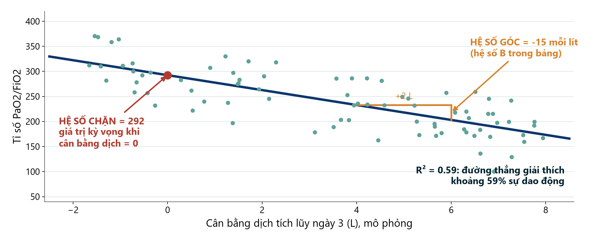{.neu-fig}

::: {.neu-takeaway}
**THÔNG ĐIỆP CHÍNH** Hệ số góc = thay đổi của kết cục theo mỗi đơn vị phơi nhiễm; R² = mức giải thích.
:::

::: {.notes}
Ý chính: hồi quy tuyến tính vẽ đường thẳng phù hợp nhất với các điểm, cho một kết cục là SỐ ĐO.

Hệ số chặn (intercept): kết cục kỳ vọng khi phơi nhiễm bằng 0 (ở đây tỉ số P/F khoảng 292 khi cân bằng dịch bằng 0). Thường không có ý nghĩa riêng.

Hệ số góc (slope): kết cục thay đổi bao nhiêu khi phơi nhiễm tăng một đơn vị: ở đây khoảng -15 cho mỗi lít cân bằng dịch tăng thêm. Đây chính là hệ số B anh chị đọc trong bảng hồi quy, kèm 95% CI; giá trị không tác động là 0.

R²: tỉ lệ dao động của kết cục được đường thẳng giải thích (ở đây khoảng 0.6). Nhiều yếu tố khác giải thích phần còn lại.

Thêm nhiều biến vào mô hình (hồi quy đa biến) cho mỗi hệ số góc được 'hiệu chỉnh' theo các biến khác: cùng ý tưởng với hình phân tầng, nhưng do máy tính làm.

Dữ liệu là mô phỏng; đây không phải nhận định về oxy hóa thật.

Lỗi thường gặp: ngoại suy đường thẳng ra ngoài phạm vi dữ liệu (cân bằng dịch 20 L sẽ dự đoán tỉ số P/F âm).

Hỏi: trong bảng, B = -15 (95% CI -19 đến -11). Nghĩa là gì? Dự kiến: mỗi lít tăng thêm liên quan với tỉ số P/F thấp hơn khoảng 15 điểm, hợp lý trong khoảng 11 đến 19.

Thời lượng: 2 phút.
:::

## Hồi quy logistic: đường cong chữ S cho kết cục có/không

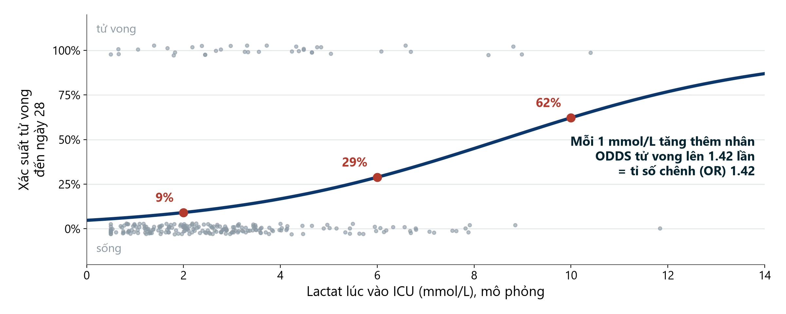{.neu-fig}

::: {.neu-takeaway}
**THÔNG ĐIỆP CHÍNH** Hồi quy logistic biến kết cục có/không thành tỉ số chênh theo mỗi đơn vị phơi nhiễm.
:::

::: {.notes}
Ý chính: khi kết cục là có/không (tử vong đến ngày 28), đường thẳng không dùng được: xác suất không thể dưới 0% hay trên 100%. Hồi quy logistic dùng một đường cong hình chữ S.

Chấm xám: từng bệnh nhân mô phỏng, ở trên nếu tử vong và ở dưới nếu sống. Đường xanh: xác suất tử vong ở mỗi mức lactat: khoảng 9% ở 2 mmol/L, 29% ở 6, 62% ở 10.

Mô hình báo cáo tỉ số chênh: ở đây mỗi 1 mmol/L tăng thêm nhân ODDS tử vong lên 1.42 lần. OR không đổi dọc theo đường cong; còn thay đổi xác suất thì thay đổi (nhỏ ở hai đầu, lớn ở giữa).

Đây chính là OR anh chị đọc trong bảng hồi quy logistic, kèm 95% CI; giá trị không tác động là 1. OR hiệu chỉnh đến từ mô hình có nhiều biến.

Lỗi thường gặp: 'OR 1.42 nghĩa là tử vong nhiều hơn 42%'. Đó là odds cao hơn 42% mỗi đơn vị; thay đổi nguy cơ phụ thuộc vị trí trên đường cong.

Hỏi: nếu lactat không có tác động, đường cong sẽ trông thế nào? Dự kiến: một đường nằm ngang, OR = 1.

Thời lượng: 2 phút.
:::

## Mô hình nào? Tùy vào kết cục

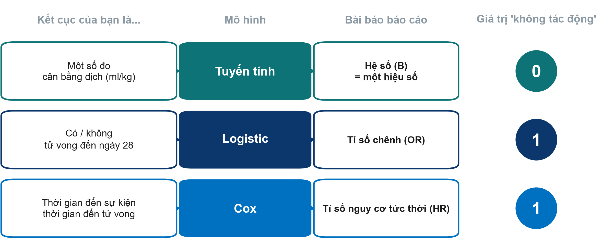{.neu-fig}

::: {.neu-takeaway}
**THÔNG ĐIỆP CHÍNH** Loại kết cục cho biết mô hình và con số cần đọc.
:::

::: {.notes}
Ý chính: kết cục quyết định mô hình, cũng như nó đã quyết định kiểm định.

Một số đo (cân bằng dịch ml/kg): hồi quy tuyến tính. Báo cáo hệ số (B hoặc beta), là một HIỆU SỐ của kết cục trên mỗi đơn vị phơi nhiễm. Không tác động = 0.

Có/không (tử vong đến ngày 28): hồi quy logistic. Báo cáo tỉ số chênh (OR). Không tác động = 1.

Thời gian đến sự kiện (thời gian đến tử vong, bệnh nhân còn sống ở ngày 28 được kiểm duyệt): hồi quy Cox. Báo cáo tỉ số nguy cơ tức thời (hazard ratio, HR). Không tác động = 1. Bài báo 2 dùng hồi quy Cox.

Vì sao 0 và 1? Hiệu số bằng 0 nghĩa là không khác biệt; tỉ số bằng 1 nghĩa là hai nhóm như nhau (2 chia 2 bằng 1).

Lỗi thường gặp: tìm xem 'CI có cắt qua 0 không' trong bảng OR. Với tỉ số, đó là 1.

Hỏi: một nghiên cứu về thời gian nằm viện tính bằng ngày, phân tích như một số đo. Mô hình nào và giá trị không tác động là bao nhiêu? Dự kiến: tuyến tính, 0. (Nhà thống kê có thể chọn mô hình khác cho dữ liệu lệch, nhưng nguyên tắc đọc vẫn như vậy.)
:::

## 'Hiệu chỉnh' nghĩa là gì: so sánh những người giống nhau

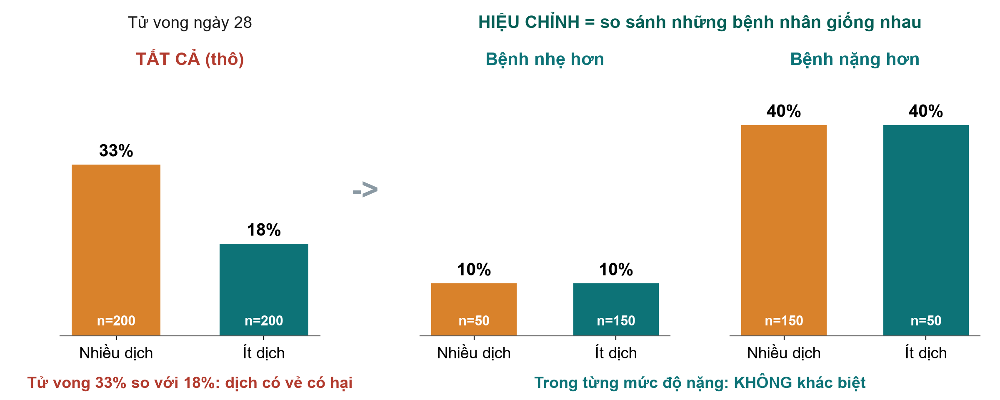{.neu-fig}

::: {.neu-caption}
Số liệu mô phỏng
:::

::: {.neu-takeaway}
**THÔNG ĐIỆP CHÍNH** Hiệu chỉnh = so sánh những bệnh nhân giống nhau về các yếu tố gây nhiễu.
:::

::: {.notes}
Ý chính: hiệu chỉnh cho một yếu tố gây nhiễu nghĩa là so sánh những bệnh nhân giống nhau về yếu tố đó.

Bên trái (thô): bệnh nhân được truyền nhiều dịch tử vong nhiều hơn (33% so với 18%). Có vẻ như dịch truyền có hại.

Bên phải (phân tầng theo mức độ nặng): ở bệnh nhân nhẹ hơn, 10% tử vong dù nhiều hay ít dịch. Ở bệnh nhân nặng hơn, 40% tử vong trong cả hai trường hợp. Trong từng mức độ nặng KHÔNG có khác biệt.

Chuyện gì đã xảy ra? Bệnh nhân nặng hơn vừa dễ được truyền nhiều dịch hơn (150 trên 200) vừa dễ tử vong hơn. Mức độ nặng tạo ra khác biệt thô: nhiễu do chỉ định, đúng như Buổi 4.

Mô hình hồi quy làm điều tương tự như cách chia tầng này, nhưng cho nhiều yếu tố gây nhiễu cùng lúc (tuổi, SOFA, lactat...). Bài báo 2 dùng ghép cặp theo điểm xu hướng cho cùng mục đích.

Hạn chế: chỉ hiệu chỉnh được những yếu tố gây nhiễu ĐÃ ĐO. Nhiễu chưa đo vẫn còn; chỉ phân bổ ngẫu nhiên mới bảo vệ được trước nó.

Hỏi: sau hiệu chỉnh, có thể nói dịch truyền không gây tử vong không? Dự kiến: không chắc chắn; có thể còn yếu tố gây nhiễu chưa đo, và đây là số liệu mô phỏng.
:::

## Đọc bảng hồi quy, từng dòng một

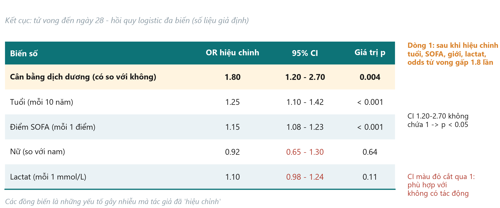{.neu-fig}

::: {.neu-takeaway}
**THÔNG ĐIỆP CHÍNH** Mỗi dòng: so sánh gì, tác động, 95% CI, CI có chứa giá trị không tác động?
:::

::: {.notes}
Ý chính: bảng hồi quy có một dòng cho mỗi biến trong mô hình. Đọc mỗi dòng theo bốn bước.

1. So sánh: 'cân bằng dịch dương (có so với không)'; 'tuổi mỗi 10 năm'; 'nữ so với nam'. Luôn kiểm tra nhóm tham chiếu và đơn vị.

2. Tác động: OR 1.80. Bệnh nhân có cân bằng dịch dương có odds tử vong gấp 1.8 lần, sau khi hiệu chỉnh các biến khác trong bảng.

3. 95% CI: 1.20 đến 2.70. Các giá trị hợp lý từ tăng 20% đến tăng 170% odds.

4. Giá trị không tác động: CI có chứa 1 không? Không, nên p \< 0.05 (p = 0.004). Với giới nữ (0.65-1.30) và lactat (0.98-1.24), CI chứa 1, tô màu đỏ: phù hợp với không có liên quan.

Các dòng tính theo đơn vị: OR 1.15 mỗi điểm SOFA nghĩa là mỗi điểm thêm nhân odds lên 1.15 lần; thêm 5 điểm nhân odds lên khoảng 2 lần (1.15 mũ 5).

Bảng này là số liệu giả định, được xây dựng để giá trị p khớp với CI.

Cách diễn đạt: 'có liên quan với', không phải 'gây ra'. Đây là phân tích quan sát.

Lỗi thường gặp: hiểu OR 1.8 là 'tử vong nhiều hơn 80%'. Đó là ODDS cao hơn 80%; khi kết cục thường gặp (như tử vong ở ICU), tỉ số nguy cơ (RR) nhỏ hơn OR.
:::

## Kiểm tra nhanh: đọc một bảng hồi quy

::: {.neu-banner style="--c:#0D7377"}
LÀM VIỆC NHÓM · 5 phút
:::

:::: {.columns}
::: {.column width="60%"}
::: {.neu-activity-steps style="--c:#0D7377"}
1. Phiếu bài tập 'Buổi 6, bài 5': bảng giả định về sảng mắc phải trong bệnh viện
2. Mỗi dòng: so sánh gì, tác động, 95% CI, có chứa 1 không?
3. Viết MỘT câu bằng ngôn ngữ dễ hiểu cho phơi nhiễm chính
4. Về nhà: bài 6 (đọc đường cong Kaplan-Meier)
:::
:::
::: {.column width="40%"}
::: {.neu-side .plain style="--c:#0D7377"}
Đọc theo 4 bước

- So sánh cái gì?
- Tác động lớn đến đâu?
- CI rộng đến đâu?
- Có cắt qua 1 (hoặc 0)?
:::
:::
::::

::: {.neu-output style="--c:#0D7377"}
**SẢN PHẨM** Mỗi cặp có một câu diễn giải đúng, dễ hiểu
:::

::: {.notes}
Kiểm tra nhanh theo cặp (5 phút: 3 phút theo cặp, 2 phút phản hồi). Bảng và đáp án trong Course/Practicals/s6\_exercises.md và Course/Solutions/s6\_solutions.md (bài 5).

Điều cần lắng nghe: nhóm tham chiếu đúng ('so với không'), dùng từ 'odds' thay vì 'nguy cơ', 'có liên quan với' thay vì 'gây ra', và đọc đúng các CI có chứa 1.

Câu mẫu cho phơi nhiễm chính: 'Sau khi hiệu chỉnh tuổi, giới và mức độ nặng, bệnh nhân dùng benzodiazepine có odds bị sảng cao khoảng gấp đôi (OR 2.1, 95% CI 1.4 đến 3.2).'

Câu hỏi về kết luận của tác giả và bài đọc đường Kaplan-Meier (bài 6) có thể làm ở nhà.

Chuyển ý: tiếp theo, vì sao quá nhiều biến có thể gây hiểu nhầm (quá khớp), rồi đến phân tích sống còn.
:::

## Quá khớp: quá nhiều biến cho quá ít biến cố

:::: {.columns}
::: {.column width="38%"}
::: {.neu-side-notes}
### Vì sao chọn từng bước gây hiểu nhầm

- Chọn biến theo giá trị p
- Tìm ra 'yếu tố dự báo' ngẫu nhiên
- Tác động quá lớn, CI quá hẹp
- Tốt hơn: chọn yếu tố gây nhiễu từ trước
:::
:::
::: {.column width="62%"}
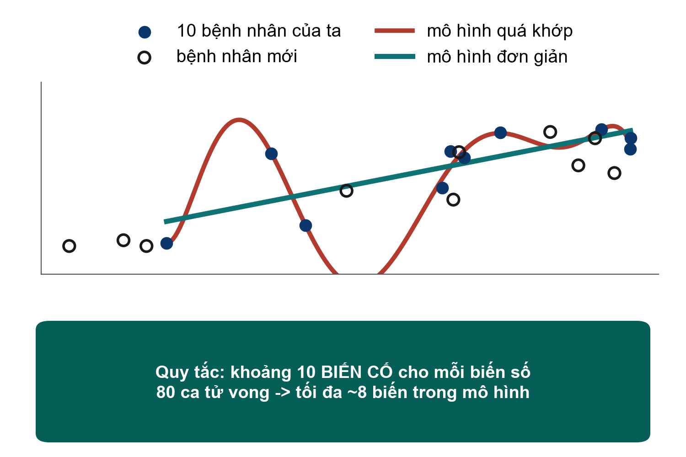{.neu-fig-side}
:::
::::

::: {.neu-takeaway}
**THÔNG ĐIỆP CHÍNH** Dự kiến khoảng 10 biến cố mỗi biến và chọn biến theo kiến thức, không theo p.
:::

::: {.notes}
Ý chính: một mô hình có quá nhiều biến so với số biến cố sẽ học nhiễu trong dữ liệu CỦA TA, không phải sự thật. Nó khớp hoàn hảo với bệnh nhân của ta và thất bại với những bệnh nhân tiếp theo.

Hình: đường đỏ đi qua cả 10 điểm đặc (dữ liệu của ta) nhưng bỏ lỡ các điểm rỗng (bệnh nhân mới); đường thẳng xanh đơn giản dự đoán tốt hơn cho bệnh nhân mới.

Quy tắc ước lượng: khoảng 10 biến cố (ca tử vong, không phải số bệnh nhân) cho mỗi biến trong mô hình logistic hoặc Cox. 80 ca tử vong: không quá khoảng 8 biến, các nhóm của biến phân loại được tính riêng. Một số hướng dẫn hiện đại yêu cầu nhiều hơn.

Chọn biến từng bước (stepwise, khung bên): để phần mềm thêm hoặc bỏ biến theo giá trị p. Trông có vẻ khách quan nhưng nó nhân lên vấn đề so sánh nhiều lần, giữ lại các phát hiện ngẫu nhiên, ước lượng quá cao tác động của các biến còn lại, cho CI quá hẹp, và các mẫu khác nhau chọn ra các biến khác nhau.

Tốt hơn: chọn yếu tố gây nhiễu từ trước dựa trên kiến thức lâm sàng và y văn (sơ đồ nhân quả giúp ích), ghi vào SAP (6.4), và giữ trong giới hạn số biến cố mỗi biến.

Hỏi: một nghiên cứu có 40 ca tử vong báo cáo mô hình 15 biến chọn theo từng bước. Anh chị lo ngại gì? Dự kiến: quá khớp; kết quả sẽ không lặp lại được.

Thời lượng: 2 phút.
:::

## Phân tích sống còn bắt đầu từ kiểm duyệt

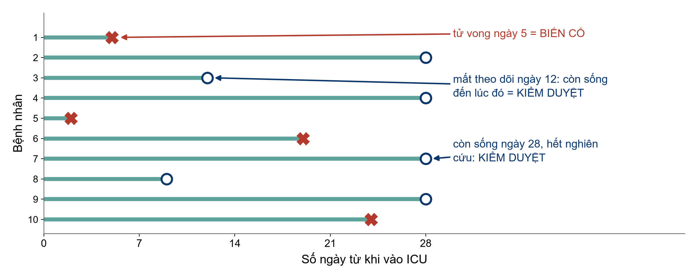{.neu-fig}

::: {.neu-takeaway}
**THÔNG ĐIỆP CHÍNH** Bệnh nhân bị kiểm duyệt vẫn được tính: họ cho biết đã sống đến ngày đó.
:::

::: {.notes}
Ý chính: kết cục thời gian đến sự kiện cần phương pháp riêng vì không phải ai cũng có biến cố trong lúc ta theo dõi.

Mỗi đường là một bệnh nhân được theo dõi từ khi vào ICU. Dấu X đỏ là biến cố (tử vong). Vòng tròn là bệnh nhân bị kiểm duyệt (censored): ta ngừng theo dõi trước khi có biến cố, vì mất theo dõi (chuyển viện, không liên lạc được) hoặc vì nghiên cứu kết thúc ở ngày 28.

Kiểm duyệt KHÔNG có nghĩa là bị loại. Bệnh nhân 3 cho ta biết họ còn sống trong 12 ngày, và phương pháp sống còn sử dụng thông tin đó. Loại họ ra, hay tính họ là sống đủ 28 ngày, đều làm sai lệch kết quả.

Vì sao không chỉ so sánh tỉ lệ tử vong ở ngày 28? Có thể, nếu mọi người được theo dõi đến ngày 28. Phương pháp sống còn còn dùng thông tin tử vong xảy ra KHI NÀO và xử lý được thời gian theo dõi không đều.

Giả định: việc kiểm duyệt không liên quan đến kết cục (chuyển đi để chăm sóc giảm nhẹ sẽ vi phạm giả định này). Nghe quen không? Đây cũng là logic của dữ liệu bị thiếu (6.4).

Hỏi: một bệnh nhân xuất viện về nhà ngày 9 và không được liên lạc lại. Biến cố hay kiểm duyệt? Dự kiến: kiểm duyệt tại ngày 9.

Thời lượng: 2 phút.
:::

## Cách đọc đường cong Kaplan-Meier

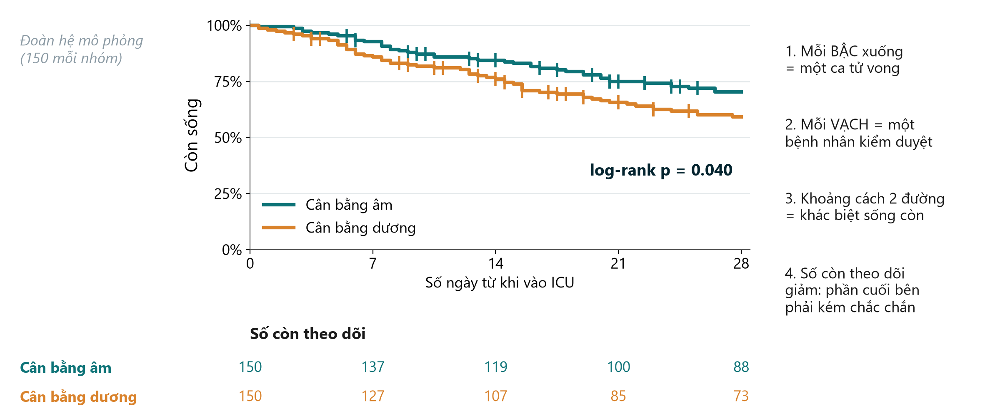{.neu-fig}

::: {.neu-takeaway}
**THÔNG ĐIỆP CHÍNH** Đọc các bậc, các vạch, khoảng cách, và luôn xem số còn theo dõi.
:::

::: {.notes}
Ý chính: đường cong Kaplan-Meier (KM) thể hiện tỉ lệ còn sống theo thời gian ở mỗi nhóm, có xử lý đúng các bệnh nhân bị kiểm duyệt.

Đi qua bốn bước đọc ở bên phải hình:

1. Mỗi bậc đi xuống là một hoặc nhiều ca tử vong.

2. Mỗi vạch đứng nhỏ là một bệnh nhân bị kiểm duyệt.

3. Khoảng cách theo chiều dọc giữa hai đường là khác biệt về sống còn tại thời điểm đó; ở đây khoảng 70% so với 59% còn sống ở ngày 28 (đoàn hệ mô phỏng, 150 mỗi nhóm, tương tự câu hỏi của Bài báo 2).

4. Số còn theo dõi (number at risk) dưới hình cho biết còn bao nhiêu bệnh nhân đang được theo dõi. Khi con số này giảm, phần cuối bên phải của đường cong dựa trên ít bệnh nhân và kém chắc chắn hơn. Hình không có số còn theo dõi che giấu điều này; người phản biện sẽ yêu cầu bổ sung.

Kiểm định log-rank so sánh toàn bộ hai đường cong và cho giá trị p (ở đây p = 0.040). Nó không cho biết độ lớn tác động; điều đó đến từ mô hình Cox (trang sau).

Bài báo 2 có đúng loại hình này (ước lượng Kaplan-Meier sống còn đến ngày 28 trong các đoàn hệ ghép cặp).

Hỏi: nếu hai đường cong cắt nhau ở giữa, điều đó gợi ý gì? Dự kiến: tác động thay đổi theo thời gian; giả định nguy cơ tỉ lệ có thể không đúng.

Thời lượng: 3 phút.
:::

## 6.4 Mô hình hóa bộ dữ liệu khóa học

:::: {.neu-statement}
::: {.neu-big}
Hiệu chỉnh theo kế hoạch, đọc CI, và trung thực về các ô trống.
:::

::: {.neu-sub}
6.4 Mô hình hóa bộ dữ liệu khóa học  \|  25 phút
:::
::::

::: {.notes}
Mở đầu phần 6.4 (25 phút: SAP, OR thô và hiệu chỉnh, mô hình hiệu chỉnh, Kaplan-Meier và Cox, lactat bị thiếu, ca đầy đủ so với đa phép gán, rồi phiếu bài tập nhóm 7 phút).

Thông điệp chính: đây là phần 6.3 (mô hình) áp dụng cho FLUID-ICU, và là thành quả của cả Tuần 5-6: anh chị sẽ THẤY nhiễu do chỉ định làm một tỉ số chênh nhỏ lại.
:::

## SAP có trước

::: {.neu-intro}
SAP\_FLUID-ICU.md: được viết và ký trước khi khóa cơ sở dữ liệu.
:::

:::: {.neu-steps}
::: {.neu-step style="--c:#0D7377"}
[1]{.neu-step-num}[Chính]{.neu-step-label}

- Tử vong 28 ngày
- hồi quy logistic, OR
:::
::: {.neu-step style="--c:#0B376C"}
[2]{.neu-step-num}[Gây nhiễu]{.neu-step-label}

- Tuổi, SOFA, lactat,
- vận mạch, thở máy, CKD
:::
::: {.neu-step style="--c:#5FA39B"}
[3]{.neu-step-num}[Hỗ trợ]{.neu-step-label}

- Kaplan-Meier, log-rank
- tỉ số nguy cơ Cox
:::
::: {.neu-step style="--c:#0070C0"}
[4]{.neu-step-num}[Phân nhóm]{.neu-step-label}

- MỘT, định trước:
- suy tim
:::
::: {.neu-step style="--c:#055F56"}
[5]{.neu-step-num}[Dữ liệu thiếu]{.neu-step-label}

- Ca đầy đủ +
- đa phép gán
:::
::::

::: {.neu-takeaway}
**THÔNG ĐIỆP CHÍNH** Mọi thứ ở các trang sau đã được quyết định trước khi ai thấy kết quả.
:::

::: {.notes}
Ý chính: kế hoạch phân tích thống kê ở phần 6.3 / Buổi 6 có thật cho FLUID-ICU. Mở Course/Data/SAP\_FLUID-ICU.md trên màn hình.

Phân tích chính: tử vong 28 ngày bằng hồi quy logistic đa biến; số đo tác động: tỉ số chênh kèm 95% CI; cũng báo cáo OR thô và hiệu số nguy cơ.

Yếu tố gây nhiễu chọn từ trước dựa trên kiến thức lâm sàng (một sơ đồ nhân quả đơn giản): tuổi; mức độ nặng (SOFA, lactat, vận mạch, thở máy); bệnh thận mạn. Các biến đo sau ngày 3 (AKI, lọc máu) KHÔNG được hiệu chỉnh: chúng là kết cục hoặc biến trung gian.

Phân tích hỗ trợ: đường cong Kaplan-Meier kèm số còn theo dõi, kiểm định log-rank, mô hình Cox với cùng các yếu tố gây nhiễu; kiểm tra giả định nguy cơ tỉ lệ.

Một yếu tố thay đổi tác động định trước: suy tim (trang bổ sung cho thấy kết quả).

Dữ liệu thiếu: được đánh giá và xử lý bằng ca đầy đủ cùng đa phép gán (m = 20) làm phân tích độ nhạy.

Hỏi: vì sao viết trước bảo vệ tác giả? Dự kiến: không ai có thể cáo buộc họ chọn cách phân tích cho giá trị p 'đẹp nhất'.
:::

## Nhiễu do chỉ định, nhìn thấy được

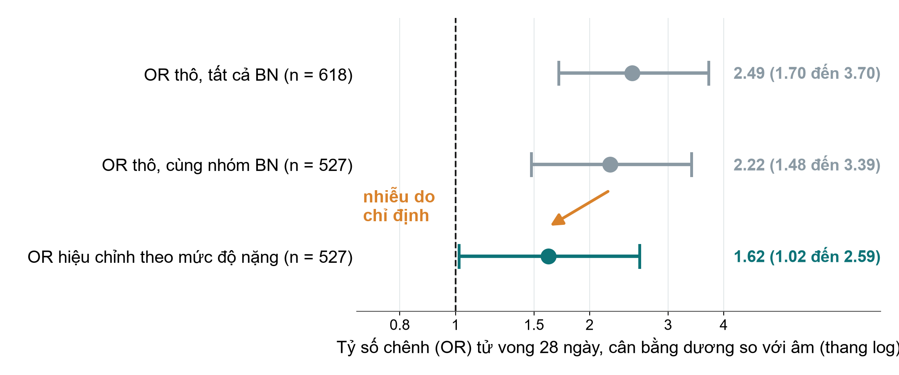{.neu-fig}

::: {.neu-takeaway}
**THÔNG ĐIỆP CHÍNH** OR thô 2.49 giảm còn 1.62 sau khi hiệu chỉnh mức độ nặng: vẫn trên 1.
:::

::: {.notes}
Ý chính: bức hình quan trọng nhất của bộ dữ liệu khóa học. Dành 4 phút.

OR thô, cả 618 bệnh nhân: 2.49 (95% CI 1.70 đến 3.70): cân bằng dương có vẻ liên quan mạnh với tử vong.

OR thô ở 527 ca đầy đủ: 2.22 (1.48 đến 3.39): cùng bệnh nhân với mô hình hiệu chỉnh, nên so sánh công bằng.

OR hiệu chỉnh (tuổi, SOFA, lactat, vận mạch, thở máy, CKD), n = 527: 1.62 (95% CI 1.02 đến 2.59), p = 0.044.

Vì sao giảm: bệnh nhân nặng hơn được truyền nhiều dịch hơn và tử vong nhiều hơn. Một phần liên quan thô là do mức độ nặng, không phải dịch. Đây là nhiễu do chỉ định, đúng như hình phân tầng ở phần 6.3, do mô hình thực hiện.

Điều còn lại: một liên quan đã hiệu chỉnh nhỏ hơn và kém chính xác hơn; giới hạn dưới của CI gần 1. Nó phù hợp với một tác hại vừa phải, hoặc gần như không có tác động.

Đây vẫn là liên quan: nhiễu chưa đo (mức độ nặng chưa được ghi) có thể vẫn còn.

Hỏi: nếu hiệu chỉnh thêm AKI thì có đúng không? Dự kiến: không; AKI xảy ra sau khi truyền dịch và có thể nằm trên con đường tác động (biến trung gian), như SAP đã ghi.
:::

## Mô hình hiệu chỉnh, dạng biểu đồ rừng

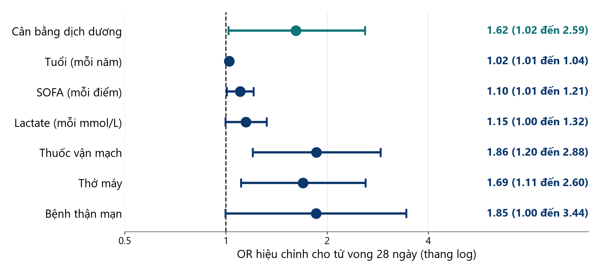{.neu-fig}

::: {.neu-takeaway}
**THÔNG ĐIỆP CHÍNH** Đọc từng dòng: so sánh gì, OR, 95% CI, có cắt qua 1 không?
:::

::: {.notes}
Ý chính: mô hình logistic đa biến của Q1 vẽ thành biểu đồ rừng (mọi OR được hiệu chỉnh lẫn nhau; n = 527).

Cân bằng dịch dương: OR 1.62 (1.02 đến 2.59).

Các dòng còn lại là yếu tố gây nhiễu: các chỉ dấu mức độ nặng (SOFA mỗi điểm, lactat mỗi mmol/L, vận mạch, thở máy), tuổi mỗi năm, CKD. Chúng có trong mô hình để hiệu chỉnh; chúng không phải câu hỏi. Đừng diễn giải quá mức (lỗi 'ngụy biện Bảng 2').

Chú ý đơn vị: mỗi năm, mỗi điểm, mỗi mmol/L: OR nhỏ cho mỗi đơn vị có thể là tác động lớn qua nhiều đơn vị.

Hỏi: dòng nào đưa vào phần tóm tắt? Dự kiến: chỉ dòng phơi nhiễm (cân bằng dương), kèm CI.
:::

## Kaplan-Meier: sống còn đến ngày 28 theo cân bằng dịch

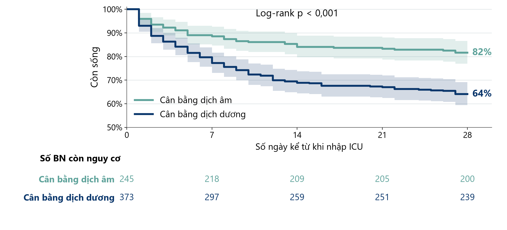{.neu-fig}

::: {.neu-takeaway}
**THÔNG ĐIỆP CHÍNH** Sống còn ngày 28: 81.6% so với 64.1%, log-rank p \< 0.001: chưa hiệu chỉnh.
:::

::: {.notes}
Ý chính: đọc một hình Kaplan-Meier thật theo bốn bước ở phần 6.3.

Các bậc đi xuống là ca tử vong; phần lớn tử vong xảy ra trong tuần đầu.

Khoảng cách: sống còn ngày 28 là 81.6% (cân bằng âm) so với 64.1% (cân bằng dương).

Số còn theo dõi dưới hình: 245 và 373 ở ngày 0, giảm dần khi bệnh nhân tử vong.

Kiểm định log-rank: p \< 0.001 (khi bình phương 21.4): hai đường cong khác nhau. Nhưng log-rank chưa hiệu chỉnh: cùng nhiễu như OR thô.

Hỏi: khác biệt lớn hơn ở giai đoạn sớm hay muộn? Dự kiến: mở ra trong những ngày đầu rồi hai đường chạy gần song song, điều này hỗ trợ giả định nguy cơ tỉ lệ của mô hình Cox (trang sau).
:::

## Mô hình Cox: cùng câu chuyện bằng tỉ số nguy cơ

::: {.neu-intro}
Phân tích hỗ trợ của Q1 (04\_models.R).
:::

:::: {.neu-cards style="--n:4"}
::: {.neu-card .plain style="--c:#0D7377"}
[HR thô]{.neu-card-title}

- 2.17
- 95% CI 1.55 đến 3.05
:::
::: {.neu-card .plain style="--c:#0B376C"}
[HR hiệu chỉnh]{.neu-card-title}

- 1.46
- 95% CI 1.00 đến 2.13
- p = 0.053
:::
::: {.neu-card .plain style="--c:#5FA39B"}
[Giả định]{.neu-card-title}

- Nguy cơ tỉ lệ:
- kiểm định chung p = 0.10
- chấp nhận được
:::
::: {.neu-card .plain style="--c:#0070C0"}
[So sánh]{.neu-card-title}

- OR hiệu chỉnh 1.62, p = 0.044
- HR hiệu chỉnh 1.46, p = 0.053
- Cùng hướng và độ lớn
:::
::::

::: {.neu-takeaway}
**THÔNG ĐIỆP CHÍNH** p = 0.044 và p = 0.053 kể cùng một câu chuyện: hãy đọc ước lượng và CI.
:::

::: {.notes}
Ý chính: mô hình Cox cho tỉ số nguy cơ tức thời, hiệu chỉnh theo cùng các yếu tố gây nhiễu.

HR thô 2.17 (95% CI 1.55 đến 3.05) giảm còn HR hiệu chỉnh 1.46 (95% CI 1.00 đến 2.13), p = 0.053: cùng nhiễu như với OR.

Đã kiểm tra nguy cơ tỉ lệ: kiểm định chung p = 0.10; không có bằng chứng mạnh chống lại giả định.

Bài học lớn: mô hình logistic cho p = 0.044 và mô hình Cox cho p = 0.053. Một cái 'có ý nghĩa', cái kia thì không, nhưng chúng nói cùng một điều: một liên quan vừa phải, kém chính xác, giới hạn dưới gần 1. Đừng bao giờ để ngưỡng 0.05 quyết định anh chị tin một phát hiện hay không (năm lỗi hiểu sai giá trị p, 6.1).

Hỏi: anh chị viết điều này thế nào trong phần Kết quả? Dự kiến: báo cáo cả hai ước lượng kèm CI, và mô tả liên quan là vừa phải và kém chính xác.
:::

## Vì sao bị thiếu? MCAR, MAR và MNAR

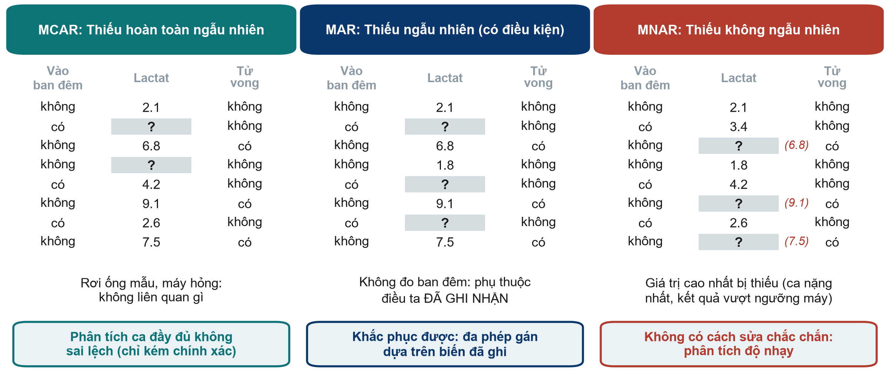{.neu-fig}

::: {.neu-takeaway}
**THÔNG ĐIỆP CHÍNH** Lý do dữ liệu bị thiếu quyết định các ô trống nguy hiểm đến đâu.
:::

::: {.notes}
Ý chính: ba cơ chế, minh họa trên cùng 8 bệnh nhân có một số giá trị lactat bị thiếu.

MCAR, thiếu hoàn toàn ngẫu nhiên: rơi ống mẫu, máy xét nghiệm hỏng. Việc thiếu không liên quan gì đến bệnh nhân. Những bệnh nhân còn lại là một tập con ngẫu nhiên; phân tích ca đầy đủ không bị sai lệch, chỉ kém chính xác hơn. Hiếm gặp trong thực tế.

MAR, thiếu ngẫu nhiên (có điều kiện theo những gì đã ghi): lactat không được đo ở bệnh nhân vào ban đêm. Việc thiếu phụ thuộc vào một điều ta CÓ trong dữ liệu (giờ nhập viện). Các phương pháp như đa phép gán có thể dùng biến đã ghi nhận đó để sửa sai lệch.

MNAR, thiếu không ngẫu nhiên: các giá trị lactat bị thiếu là những giá trị cao nhất (bệnh nhân nặng nhất, giá trị vượt ngưỡng máy; các số màu đỏ ta không bao giờ thấy). Việc thiếu phụ thuộc chính giá trị bị thiếu. Không phương pháp thống kê nào sửa được hoàn toàn; ta chỉ có thể kiểm tra xem nó ảnh hưởng đến đâu (phân tích độ nhạy).

Ta không bao giờ chứng minh được cơ chế nào đúng chỉ từ dữ liệu; hiểu biết lâm sàng về VÌ SAO giá trị bị thiếu là thiết yếu. Hãy ghi lại lý do khi thu thập dữ liệu.

Nhớ lại trang dữ liệu thiếu đầu tiên ở phần 5.1: bệnh nhân nặng nhất bị thiếu là MNAR, trường hợp xấu nhất.

Hỏi: kết cục ngày 28 bị thiếu ở bệnh nhân chuyển sang bệnh viện khác. Cơ chế nào có khả năng nhất? Dự kiến: có thể là MNAR (bệnh nhân nặng hơn hoặc đang hồi phục được chuyển đi); ít nhất là MAR nếu có ghi lý do chuyển.

Thời lượng: 2 phút; sau đó là lactat bị thiếu của chính FLUID-ICU.
:::

## Ai bị thiếu lactat? Không phải 15% ngẫu nhiên

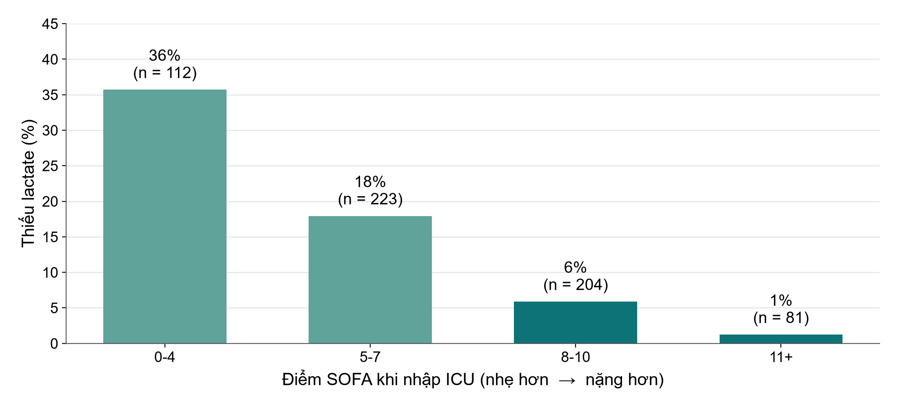{.neu-fig}

::: {.neu-takeaway}
**THÔNG ĐIỆP CHÍNH** Lactat thiếu chủ yếu ở bệnh nhân nhẹ hơn: không phải MCAR; MAR là hợp lý.
:::

::: {.notes}
Ý chính: trước khi xử lý dữ liệu thiếu, hãy hỏi VÌ SAO nó bị thiếu (trang trước: MCAR, MAR, MNAR).

Lactat bị thiếu ở 93 trong 620 bệnh nhân (15.0%). Hình cho thấy tỉ lệ thiếu theo điểm SOFA: cao hơn nhiều ở bệnh nhân nhẹ nhất.

Bệnh nhân không có lactat có SOFA trung vị 5 (4 đến 6) so với 8 (6 đến 10) ở người có lactat, và tử vong thấp hơn: 18/93 (19.4%) so với 161/527 (30.6%).

Vậy dữ liệu không thiếu hoàn toàn ngẫu nhiên (MCAR): phân tích ca đầy đủ bỏ chủ yếu các bệnh nhân nhẹ hơn. Việc thiếu phụ thuộc những gì đã ghi nhận (mức độ nặng, ICU): thiếu ngẫu nhiên có điều kiện (MAR) là hợp lý, đúng tình huống đa phép gán hoạt động tốt.

Hỏi: về lâm sàng, vì sao lactat không được đo ở người nhẹ hơn? Dự kiến: bác sĩ thấy không cần, hoặc một ICU không có máy xét nghiệm tại chỗ.
:::

## Ca đầy đủ so với đa phép gán (Q4)

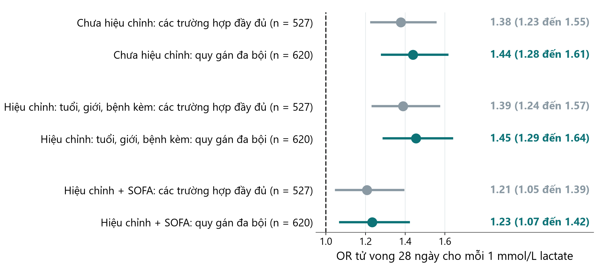{.neu-fig}

::: {.neu-takeaway}
**THÔNG ĐIỆP CHÍNH** Đa phép gán giữ cả 620 bệnh nhân; câu trả lời chỉ thay đổi ít.
:::

::: {.notes}
Ý chính: phân tích độ nhạy đã lên kế hoạch trong SAP.

Q4 (lactat và tử vong 28 ngày), OR mỗi 1 mmol/L hiệu chỉnh tuổi, giới, đái tháo đường, CKD và suy tim: ca đầy đủ 1.39 (1.24 đến 1.57), n = 527; đa phép gán 1.45 (1.29 đến 1.64), n = 620. Thêm SOFA: 1.21 (1.05 đến 1.39) so với 1.23 (1.07 đến 1.42).

Mô hình chính Q1 với đa phép gán (m = 20, n = 620): OR hiệu chỉnh 1.70 (95% CI 1.09 đến 2.64), p = 0.020, so với 1.62 (1.02 đến 2.59) ở ca đầy đủ.

Diễn giải: kết luận không phụ thuộc vào cách xử lý lactat bị thiếu: một kết quả vững. Nếu hai cách cho kết quả rất khác nhau, ta phải nói rõ.

Chú ý thêm: lactat trung vị là 2.6 mmol/L ở ca đầy đủ và 2.4 sau khi gán: các giá trị gán thấp hơn, như dự kiến, vì bệnh nhân bị thiếu nhẹ hơn.

Hỏi: anh chị viết gì trong phần Phương pháp? Dự kiến: 'Lactat bị thiếu (15.0%) được xử lý bằng đa phép gán (20 bộ dữ liệu) như phân tích độ nhạy; kết quả tương tự phân tích ca đầy đủ.'
:::

## Diễn giải mô hình của nhóm (phiếu bài tập)

::: {.neu-banner style="--c:#0D7377"}
LÀM VIỆC NHÓM · 7 phút
:::

:::: {.columns}
::: {.column width="60%"}
::: {.neu-activity-steps style="--c:#0D7377"}
1. Tìm ước lượng thô và hiệu chỉnh trong gói kết quả
2. Hiệu chỉnh làm ước lượng thay đổi bao nhiêu? Vì sao?
3. 95% CI hiệu chỉnh có chứa 1 (hoặc 0) không?
4. Xem kết quả đa phép gán trong gói kết quả: có gần kết quả chính? (chi tiết ở Cấp độ 2)
5. Viết hai câu Kết quả: thô, rồi hiệu chỉnh, kèm CI
:::
:::
::: {.column width="40%"}
::: {.neu-side .plain style="--c:#0D7377"}
Từ nên dùng

- 'có liên quan với'
- 'sau khi hiệu chỉnh'
- '95% CI'
- không dùng 'gây ra'
:::
:::
::::

::: {.neu-output style="--c:#0D7377"}
**SẢN PHẨM** Hai câu Kết quả cho mô hình của nhóm (bài 8)
:::

::: {.notes}
Phiếu bài tập nhóm, 7 phút (5 phút làm, 2 phút phản hồi). Bài tập Buổi 6, bài 8; đáp án mẫu trong s6\_solutions.md.

Con số chính theo câu hỏi (đều có trong key\_results.md và các gói kết quả):

Q1: OR thô 2.49 (1.70 đến 3.70) -\> hiệu chỉnh 1.62 (1.02 đến 2.59); HR Cox hiệu chỉnh 1.46 (1.00 đến 2.13); OR hiệu chỉnh với đa phép gán 1.70 (1.09 đến 2.64).

Q2: OR AKI mỗi 10 ml/kg thô 1.37 (1.27 đến 1.47) -\> hiệu chỉnh 1.27 (1.16 đến 1.40).

Q3: số ngày không thở máy mỗi 10 ml/kg thô -1.48 (-1.84 đến -1.13) -\> hiệu chỉnh -0.61 (-1.00 đến -0.21) ngày.

Q4: OR lactat mỗi 1 mmol/L hiệu chỉnh, ca đầy đủ 1.39 (1.24 đến 1.57) so với đa phép gán 1.45 (1.29 đến 1.64).

Q5: tỉ số trung bình nhân thời gian nằm ICU thô 1.50 (1.34 đến 1.68) -\> hiệu chỉnh 1.24 (1.10 đến 1.39).

Mẫu hình cần chỉ ra: ở mọi câu hỏi, ước lượng hiệu chỉnh gần 'không tác động' hơn ước lượng thô: dấu vân tay của nhiễu do chỉ định.

Các câu này trở thành phần cốt lõi của mục Kết quả viết ở Buổi 7.
:::

## Xây dựng đề cương 6: một phần tốt gồm những gì

::: {.neu-intro}
Ví dụ từ ví dụ xuyên suốt (thử nghiệm hạn chế dịch).
:::

:::: {.neu-cards style="--n:4"}
::: {.neu-card .plain style="--c:#0D7377"}
[Cỡ mẫu]{.neu-card-title}

- Tử vong 40% so với 30%
- power 80%, alpha 5%
- 356 mỗi nhóm + 10%
:::
::: {.neu-card .plain style="--c:#0B376C"}
[Kế hoạch phân tích]{.neu-card-title}

- Mô tả: n (%), trung vị (IQR)
- So sánh: khi bình phương
- Báo cáo: RR + 95% CI
:::
::: {.neu-card .plain style="--c:#5FA39B"}
[Yếu tố gây nhiễu]{.neu-card-title}

- Chọn từ trước
- khoảng 10 biến cố
- mỗi biến
:::
::: {.neu-card .plain style="--c:#0070C0"}
[Dữ liệu thiếu]{.neu-card-title}

- Dự kiến thiếu + vì sao
- Phòng ngừa
- CC + kiểm tra MI
:::
::::

::: {.neu-takeaway}
**THÔNG ĐIỆP CHÍNH** Hôm nay: bao nhiêu bệnh nhân, phân tích gì, và nếu dữ liệu bị thiếu thì sao.
:::

::: {.notes}
Chiếu 1 phút trước khi các nhóm bắt đầu.

Cỡ mẫu: một câu với bốn đầu vào (giá trị dự kiến mỗi nhóm, alpha, power) và phần dự phòng bỏ cuộc: 'Giả định tử vong 28 ngày là 40% với chăm sóc thường quy và 30% với chiến lược hạn chế dịch, 356 bệnh nhân mỗi nhóm cho power 80% với alpha hai phía 5%; dự phòng 10% mất theo dõi, chúng tôi sẽ tuyển 396 bệnh nhân mỗi nhóm.' (356 / 0.9 = 395.6, làm tròn lên.)

Kế hoạch phân tích dễ hiểu: cách tóm tắt cho từng loại biến, kiểm định hoặc mô hình cho kết cục chính, số đo tác động kèm 95% CI.

Yếu tố gây nhiễu: với thiết kế quan sát, nêu tên (từ phần sai lệch ở Phần 2) trong giới hạn số biến cố mỗi biến; không chọn từng bước.

Kế hoạch dữ liệu thiếu: mức thiếu dự kiến và vì sao (tư duy MCAR / MAR / MNAR), phòng ngừa (Buổi 5), và cách báo cáo dữ liệu thiếu (bao nhiêu, ở ai). Đa phép gán và phân tích độ nhạy thuộc Cấp độ 2.
:::

## Xây dựng đề cương 6: cỡ mẫu và kế hoạch phân tích

::: {.neu-banner style="--c:#055F56"}
XÂY DỰNG ĐỀ CƯƠNG · 30 phút
:::

:::: {.columns}
::: {.column width="60%"}
::: {.neu-activity-steps style="--c:#055F56"}
1. Câu phát biểu cỡ mẫu: 4 đầu vào và nguồn của chúng (8 phút)
2. Kế hoạch phân tích: tóm tắt, kiểm định hoặc mô hình, số đo tác động + 95% CI (10 phút)
3. Yếu tố gây nhiễu cần hiệu chỉnh, khoảng 10 biến cố mỗi biến (5 phút)
4. Kế hoạch dữ liệu thiếu: dự kiến, phòng ngừa, cách báo cáo dữ liệu thiếu (7 phút)
:::
:::
::: {.column width="40%"}
::: {.neu-side .plain style="--c:#055F56"}
Dùng các công cụ này

- Bảng tính cỡ mẫu
- Sơ đồ chọn kiểm định
- SAP của FLUID-ICU làm mẫu
- Phiếu bài tập: bài 9
:::
:::
::::

::: {.neu-output style="--c:#055F56"}
**SẢN PHẨM** Phần 3 đề cương hoàn chỉnh trong mẫu của nhóm
:::

::: {.notes}
Xây dựng đề cương 6: 30 phút. Các nhóm hoàn thành Phần 3 của mẫu đề cương; phiếu bài tập (bài tập Buổi 6, bài 9) có cùng các tiêu đề.

Nhắc thời gian ở phút 8, 18, 23 và 30.

Giảng viên đi quanh và hỏi: Kết cục là số đo, phân loại hay thời gian đến sự kiện, vậy kiểm định hay mô hình nào? Tác động dự kiến lấy từ đâu? Điều gì dễ bị thiếu nhất, và vì sao (tư duy MCAR / MAR / MNAR)?

SAP của FLUID-ICU là mẫu tốt: các nhóm vừa thấy nó được viết trước khi phân tích.

Cỡ mẫu: các nhóm cần bốn đầu vào và nguồn, chưa cần con số cuối cùng. Đề nghị chạy bảng tính giúp họ.

Vấn đề thường gặp: kế hoạch phân tích chỉ ghi 'sẽ dùng SPSS'; chọn biến từng bước; không nói gì về dữ liệu thiếu; cỡ mẫu = 'tất cả bệnh nhân có được'.

Đúng 2:55, dừng để tổng kết.
:::

## Từ khóa của ngày

::: {.neu-intro}
Mười hai thuật ngữ anh chị giờ có thể giải thích cho đồng nghiệp.
:::

:::: {.neu-cards style="--n:4"}
::: {.neu-card .plain style="--c:#0D7377"}
[Không chắc chắn]{.neu-card-title}

- 95% CI
- Giá trị p
- Power
:::
::: {.neu-card .plain style="--c:#0B376C"}
[So sánh]{.neu-card-title}

- t / Mann-Whitney
- Khi bình phương
- Ghép cặp
:::
::: {.neu-card .plain style="--c:#5FA39B"}
[Mô hình]{.neu-card-title}

- OR hiệu chỉnh
- Tỉ số nguy cơ (HR)
- Kiểm duyệt
:::
::: {.neu-card .plain style="--c:#0070C0"}
[Trung thực]{.neu-card-title}

- SAP
- MCAR / MAR / MNAR
- Đa phép gán
:::
::::

::: {.neu-takeaway}
**THÔNG ĐIỆP CHÍNH** Nếu từ nào chưa rõ, hãy hỏi ngay hoặc tra trong bảng thuật ngữ.
:::

::: {.notes}
Từ khóa của ngày (2 phút). Chỉ vào từng từ và mời cả lớp định nghĩa trong một dòng.

95% CI: khoảng các giá trị hợp lý. Giá trị p: dữ liệu đáng ngạc nhiên đến đâu nếu không có tác động. Power: khả năng phát hiện tác động thật.

t / Mann-Whitney: so sánh một số đo giữa hai nhóm (đối xứng / lệch). Khi bình phương: so sánh tỉ lệ. Ghép cặp: cùng bệnh nhân đo hai lần.

OR hiệu chỉnh: tỉ số chênh sau khi tính đến yếu tố gây nhiễu. Tỉ số nguy cơ tức thời: tỉ số tốc độ tử vong theo thời gian (Cox). Kiểm duyệt: theo dõi kết thúc mà chưa có biến cố.

SAP: kế hoạch phân tích viết trước khi thấy dữ liệu. MCAR / MAR / MNAR: vì sao dữ liệu bị thiếu. Đa phép gán: điền ô trống nhiều lần và gộp lại, một cách trung thực.

Mọi thuật ngữ có trong bảng thuật ngữ Anh-Việt.
:::

## Tóm tắt Buổi 6

::: {.neu-intro}
Ba thông điệp mang về.
:::

:::: {.neu-cards style="--n:3"}
::: {.neu-card .plain style="--c:#0D7377"}
[1. Đọc CI]{.neu-card-title}

- Tác động + 95% CI
- Giá trị không tác động?
- p chỉ là vai phụ
:::
::: {.neu-card .plain style="--c:#0B376C"}
[2. Hiệu chỉnh trung thực]{.neu-card-title}

- Thô so với hiệu chỉnh
- Gây nhiễu chọn
- từ trước
:::
::: {.neu-card .plain style="--c:#5FA39B"}
[3. Lập kế hoạch trước]{.neu-card-title}

- SAP trước dữ liệu
- Dữ liệu thiếu: báo cáo,
- xử lý, kiểm tra
:::
::::

::: {.neu-takeaway}
**THÔNG ĐIỆP CHÍNH** Phân tích tốt được lên kế hoạch trước, hiệu chỉnh trung thực và đọc qua CI.
:::

::: {.notes}
Tóm tắt buổi (2 phút). Mời ba người tình nguyện cho một ví dụ hôm nay cho mỗi thẻ.

Đọc CI: độ lớn, chiều hướng, độ chính xác; giá trị không tác động 0 hay 1; tránh năm lỗi hiểu sai giá trị p.

Hiệu chỉnh trung thực: FLUID-ICU cho thấy nhiễu do chỉ định: OR thô giảm sau khi hiệu chỉnh mức độ nặng. Yếu tố gây nhiễu được chọn theo kiến thức, không theo chọn từng bước.

Lập kế hoạch trước: SAP của FLUID-ICU được viết trước khi phân tích; lactat bị thiếu được báo cáo, xử lý bằng đa phép gán và đối chiếu với phân tích ca đầy đủ.

Hai thứ Bảy tới: viết bài (Phương pháp và Kết quả ở Buổi 7, phần còn lại và công bố ở Buổi 8).
:::

## Tổng kết và bài tập về nhà

::: {.neu-banner style="--c:#1F5C7A"}
THẢO LUẬN · 5 phút
:::

:::: {.columns}
::: {.column width="60%"}
::: {.neu-activity-steps style="--c:#1F5C7A"}
1. Từ khóa và tóm tắt (hai trang trước)
2. Câu hỏi cuối buổi: viết một câu giải thích '95% CI 1.48 đến 3.06' cho biết điều gì
3. Về nhà: hoàn thành Phần 3 đề cương; chuẩn bị bài trình bày 6 phút
4. Đọc lại gói kết quả: đó sẽ là phần Phương pháp và Kết quả ở Buổi 7
:::
:::
::: {.column width="40%"}
::: {.neu-side .plain style="--c:#1F5C7A"}
Tuần 7-8

- Đề cương, đạo đức, đăng ký
- Liêm chính nghiên cứu
- Viết Phương pháp và Kết quả
- Công bố bài báo
- Trình bày
:::
:::
::::

::: {.neu-output style="--c:#1F5C7A"}
**SẢN PHẨM** Câu trả lời trên giấy nhớ; Phần 3 hoàn chỉnh
:::

::: {.notes}
Tổng kết: 5 phút, gồm cả trang từ khóa và tóm tắt.

Câu hỏi cuối buổi trên giấy nhớ. Câu trả lời tốt: 'Tỉ số nguy cơ thật có thể hợp lý nằm trong khoảng 1.48 đến 3.06; mọi giá trị đều lớn hơn 1, nên dữ liệu gợi ý tử vong cao hơn.' Đọc vài câu khi bắt đầu Buổi 7.

Về nhà: hoàn thành Phần 3 đề cương; bắt đầu chuẩn bị bài trình bày 6 phút (6 slide, Course/Assignment/presentation\_guide.md); đọc lại gói kết quả và phiếu diễn giải của nhóm, sẽ trở thành phần Phương pháp và Kết quả viết ở Buổi 7; bài tập tùy chọn trong phiếu bài tập Buổi 6.

Cảm ơn cả lớp: đây là buổi nặng về kỹ thuật nhất của khóa học. Ghi nhận rằng họ đã theo đến cùng.
:::

## Trang bổ sung — Buổi 6

:::: {.neu-statement}
::: {.neu-big}
Trang bổ sung: dùng nếu còn thời gian, hoặc để tự học.
:::

::: {.neu-sub}
Tương tác, giá trị không tác động, dự báo và học máy, chi tiết về dữ liệu thiếu
:::
::::

::: {.notes}
BỔ SUNG: các trang sau đây là tùy chọn. Dùng nếu lớp đi nhanh hơn dự kiến, hoặc giới thiệu cho học viên tự học (có trong bộ tài liệu phát).
:::

## Bổ sung: tương tác định trước với suy tim (Q1)

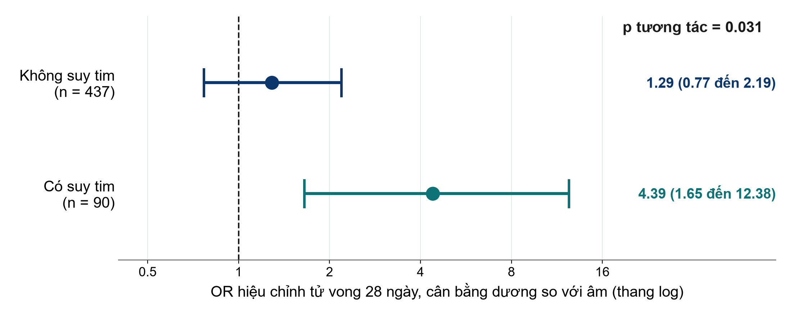{.neu-fig}

::: {.neu-takeaway}
**THÔNG ĐIỆP CHÍNH** Liên quan mạnh hơn ở suy tim (p tương tác 0.031): cần được xác nhận.
:::

::: {.notes}
BỔ SUNG: yếu tố thay đổi tác động duy nhất được định trước trong SAP của FLUID-ICU.

OR hiệu chỉnh cho tử vong, cân bằng dương so với âm: suy tim (n = 90) 4.39 (95% CI 1.65 đến 12.38); không suy tim (n = 437) 1.29 (0.77 đến 2.19). p tương tác = 0.031 (Wald; kiểm định tỉ số khả dĩ p = 0.028).

Hợp lý về lâm sàng: bệnh nhân suy tim dung nạp dịch kém hơn.

Nhưng: phân nhóm nhỏ (90 bệnh nhân), CI rất rộng, và SAP ghi rằng p tương tác \< 0.05 là 'bằng chứng cần xác nhận, chưa phải kết luận chắc chắn'. Báo cáo như phân tích thăm dò.

Nối với 6.3 (trang tương tác) và so sánh nhiều lần (một kiểm định định trước, không phải 20 phân nhóm hậu kiểm).
:::

## Bổ sung: AKI tăng theo cân bằng dịch (Q2)

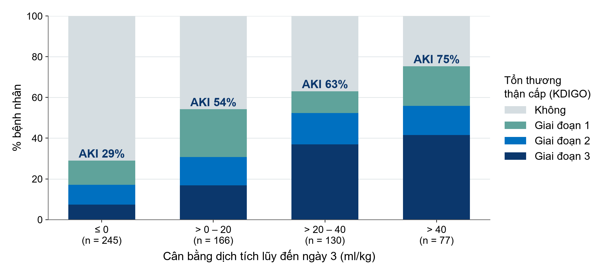{.neu-fig}

::: {.neu-takeaway}
**THÔNG ĐIỆP CHÍNH** Một gradient liều-đáp ứng: AKI 29%, 54%, 63%, 75% qua các nhóm cân bằng.
:::

::: {.notes}
BỔ SUNG: câu hỏi của nhóm 2.

AKI (KDIGO giai đoạn 1 trở lên) theo cân bằng tích lũy: từ 0 ml/kg trở xuống 29%; trên 0 đến 20: 54%; trên 20 đến 40: 63%; trên 40: 75%. Gradient (liều-đáp ứng) là một trong các tiêu chí Bradford Hill (Buổi 4).

OR mỗi 10 ml/kg: thô 1.37 (1.27 đến 1.47), hiệu chỉnh 1.27 (1.16 đến 1.40), p \< 0.001 (n = 527).

Thận trọng: có thể có nhân quả ngược: bệnh nhân đang bị AKI tiểu ít hơn, nên cân bằng dịch dương hơn. Thời điểm AKI so với cân bằng dịch là quan trọng; bàn trong phần hạn chế.
:::

## Bổ sung: số ngày không thở máy, một kết cục khó (Q3)

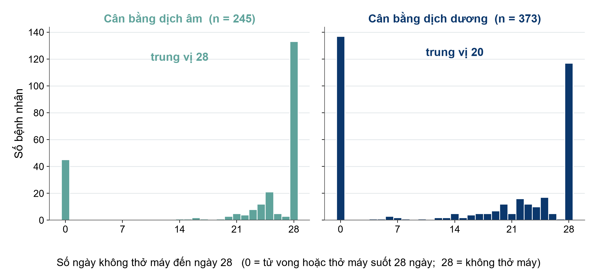{.neu-fig}

::: {.neu-takeaway}
**THÔNG ĐIỆP CHÍNH** Dồn ở 0 và 28: báo cáo trung vị và dùng kiểm định phi tham số.
:::

::: {.notes}
BỔ SUNG: câu hỏi của nhóm 3.

Số ngày không thở máy đến ngày 28 bằng 0 với bệnh nhân tử vong hoặc thở máy suốt, và bằng 28 với người không bao giờ thở máy: hai đống dồn, không giống hình chuông.

Trung vị 20 (0 đến 28) ngày ở nhóm cân bằng dương so với 28 (22 đến 28) ở nhóm âm; Mann-Whitney p \< 0.001.

Hồi quy tuyến tính mỗi 10 ml/kg: thô -1.48 (-1.84 đến -1.13) ngày, hiệu chỉnh -0.61 (-1.00 đến -0.21) ngày, p = 0.003 (n = 527).

Ý chính: luôn xem phân phối trước khi chọn cách tóm tắt và mô hình.
:::

## Bổ sung: Mẫu và quần thể

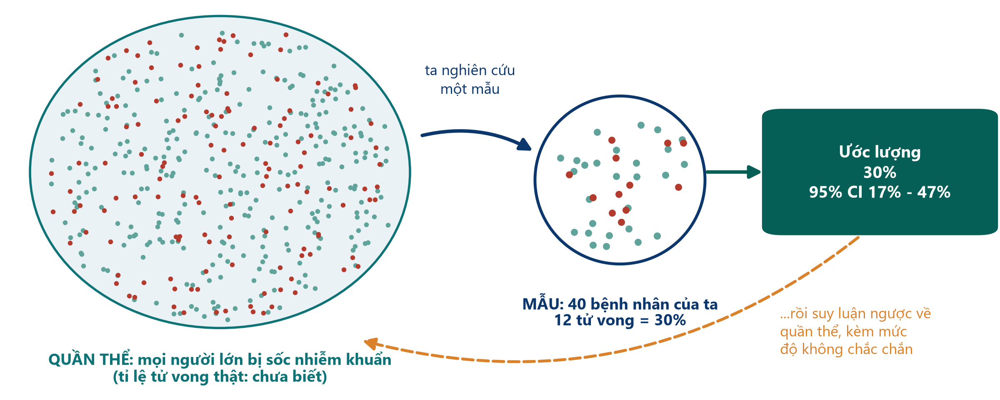{.neu-fig}

::: {.neu-takeaway}
**THÔNG ĐIỆP CHÍNH** Mẫu cho ta một ước lượng; CI cho biết ước lượng đó chính xác đến đâu.
:::

::: {.notes}
BỔ SUNG: Ý chính: QUẦN THỂ là tất cả những người ta muốn tìm hiểu (mọi người lớn bị sốc nhiễm khuẩn); ta không bao giờ thấy hết. MẪU là những bệnh nhân ta thực sự nghiên cứu.

Trong mẫu 40 bệnh nhân, 12 người tử vong: 30%. Đó là ƯỚC LƯỢNG của tỉ lệ tử vong thật.

Một mẫu 40 bệnh nhân khác sẽ cho con số hơi khác, có thể 25% hoặc 35%. Sự dao động từ mẫu này sang mẫu khác gọi là sai số chọn mẫu. Đó không phải lỗi; đó là ngẫu nhiên.

Khoảng tin cậy 95% (17% đến 47%) thể hiện sự không chắc chắn đó: tỉ lệ tử vong thật có thể hợp lý nằm ở bất kỳ đâu trong khoảng này. Với chỉ 40 bệnh nhân, khoảng này rộng.

Hai điều kiện để mẫu phản ánh được quần thể: mẫu phải đại diện (sai lệch chọn lựa, Buổi 4) và đủ lớn (độ chính xác, sắp học).

Hỏi: nếu nghiên cứu 400 bệnh nhân thay vì 40, khoảng tin cậy sẽ thế nào? Dự kiến: hẹp hơn. Đó là trang tiếp theo.
:::

## Bổ sung: Đọc khoảng tin cậy 95% trong một bài báo thật

::: {.neu-intro}
Bài báo 1, kết cục chính: cân bằng dịch tích lũy ngày 5.
:::

:::: {.neu-cards style="--n:3"}
::: {.neu-card .plain style="--c:#0D7377"}
[Kết quả]{.neu-card-title}

- Trung vị 6.9 so với 35.0 ml/kg
- Chênh lệch trung bình 13.2 ml/kg
- 95% CI -15.2 đến 41.6
- p = 0.42
:::
::: {.neu-card .plain style="--c:#0B376C"}
[Số 0 ở đâu?]{.neu-card-title}

- 0 = không khác biệt
- CI chứa số 0
- Nên 'không khác biệt' phù hợp với dữ liệu
:::
::: {.neu-card .plain style="--c:#5FA39B"}
[Rộng đến đâu?]{.neu-card-title}

- Từ 15 ml/kg theo một hướng
- đến 42 ml/kg theo hướng kia
- Rất kém chính xác: chỉ 48 bệnh nhân
:::
::::

::: {.neu-takeaway}
**THÔNG ĐIỆP CHÍNH** 'Không có ý nghĩa' với CI rộng nghĩa là 'chưa biết', không phải 'không tác động'.
:::

::: {.notes}
BỔ SUNG: Ý chính: đọc mọi CI theo ba bước: giá trị ước lượng, vị trí của giá trị 'không tác động', và độ rộng của khoảng.

Bài báo 1 (Boulet 2024, RCT): trung vị cân bằng dịch tích lũy ngày 5 là 6.9 ml/kg (hạn chế dịch) so với 35.0 ml/kg (thường quy); bài báo cũng báo cáo chênh lệch giữa các giá trị TRUNG BÌNH: 13.2 ml/kg với 95% CI -15.2 đến 41.6, p = 0.42.

Khoảng tin cậy chứa số 0, nên dữ liệu phù hợp với không có khác biệt. Nhưng nó cũng chứa mức chênh lệch lớn tới 40 ml/kg. Kết luận: nghiên cứu không thể cho biết chiến lược này có hiệu quả hay không. Đây là nghiên cứu thử nghiệm (pilot) với 48 bệnh nhân.

Nếu có người hỏi vì sao 13.2 không bằng 35.0 trừ 6.9 (28.1): 13.2 là hiệu của hai giá trị TRUNG BÌNH, được tác giả báo cáo kèm 95% CI; còn trung vị mô tả dữ liệu lệch. Trung bình và trung vị khác nhau khi dữ liệu bị lệch, đúng bài học của phần 5.3.

Lỗi thường gặp: đọc p = 0.42 thành 'chiến lược hạn chế dịch không hiệu quả'. Không có bằng chứng không phải là bằng chứng của việc không có.

Hỏi: CI sẽ trông thế nào nếu thử nghiệm có 500 bệnh nhân? Dự kiến: hẹp hơn nhiều, có thể không còn chứa số 0.
:::

## Bổ sung: Biểu đồ rừng: ví dụ xuyên suốt trong một hình

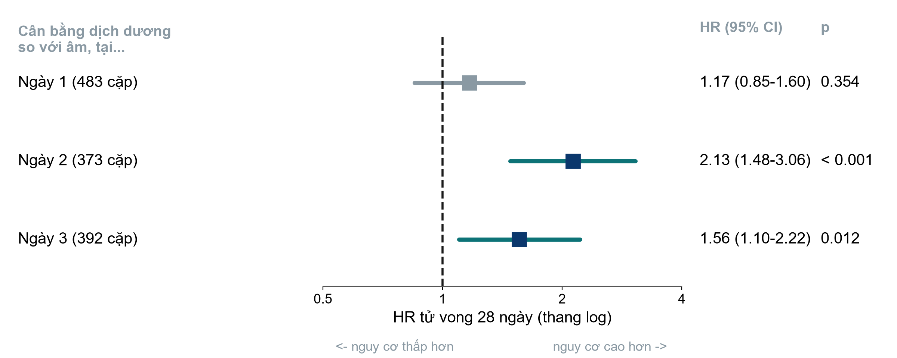{.neu-fig}

::: {.neu-caption}
Bài báo 2 (Hyun 2023): cân bằng dịch tích lũy dương so với âm, các đoàn hệ ghép cặp theo điểm xu hướng
:::

::: {.neu-takeaway}
**THÔNG ĐIỆP CHÍNH** Ngày 1: CI cắt qua 1. Ngày 2 và 3: CI nằm trên 1, nguy cơ cao hơn.
:::

::: {.notes}
BỔ SUNG: Ý chính: biểu đồ rừng (forest plot) thể hiện nhiều ước lượng cùng CI của chúng so với đường không tác động. Mỗi ô vuông là một HR, mỗi đoạn ngang là 95% CI của nó.

Bài báo 2 (Hyun 2023, Ann Intensive Care), tử vong 28 ngày, cân bằng dịch tích lũy dương so với âm:

Ngày 1 (483 cặp): HR 1.17 (0.85-1.60), p = 0.354. Cắt qua 1: không có liên quan rõ ràng.

Ngày 2 (373 cặp): HR 2.13 (1.48-3.06), p \< 0.001. Hoàn toàn trên 1: nguy cơ tức thời khoảng gấp đôi.

Ngày 3 (392 cặp): HR 1.56 (1.10-2.22), p = 0.012. Trên 1, nhưng giới hạn dưới gần 1.

Diễn giải: cân bằng dịch dương kéo dài sau ngày đầu tiên có liên quan với tử vong cao hơn. Có liên quan, không phải gây ra: đây là nghiên cứu đoàn hệ, và ngay cả sau ghép cặp, bệnh nhân nặng hơn vẫn có thể được truyền nhiều dịch hơn (nhiễu tồn dư).

So sánh với Bài báo 1: một RCT không cho thấy khác biệt rõ ràng về cân bằng dịch. Hai thiết kế trả lời các câu hỏi khác nhau với thế mạnh khác nhau; đó là trọng tâm của phần thẩm định vào Buổi 7-8.

Hỏi: vì sao CI ngày 1 và ngày 2 có độ rộng khác nhau? Dự kiến: số bệnh nhân và số biến cố khác nhau, độ dao động khác nhau.
:::

## Bổ sung: Log-rank, Cox và nguy cơ tỉ lệ

::: {.neu-intro}
Ba thuật ngữ anh chị sẽ gặp trong mọi bài báo về sống còn.
:::

:::: {.neu-cards style="--n:3"}
::: {.neu-card .plain style="--c:#0D7377"}
[Kiểm định log-rank]{.neu-card-title}

- So sánh toàn bộ đường KM
- Cho giá trị p
- Không cho độ lớn, không hiệu chỉnh
:::
::: {.neu-card .plain style="--c:#0B376C"}
[Hồi quy Cox]{.neu-card-title}

- Cho tỉ số nguy cơ tức thời (HR)
- kèm 95% CI, không tác động = 1
- Hiệu chỉnh được yếu tố gây nhiễu
:::
::: {.neu-card .plain style="--c:#5FA39B"}
[Nguy cơ tỉ lệ]{.neu-card-title}

- Giả định HR không đổi
- theo thời gian
- Đường cong cắt nhau: thận trọng
:::
::::

::: {.neu-takeaway}
**THÔNG ĐIỆP CHÍNH** Bài báo 2: Cox HR 2.13 (1.48-3.06): nguy cơ tử vong khoảng gấp đôi.
:::

::: {.notes}
BỔ SUNG: Ý chính: ba công cụ đi cùng đường cong KM.

Kiểm định log-rank: trả lời 'hai đường cong có khác nhau không?' bằng một giá trị p. Nó không hiệu chỉnh được yếu tố gây nhiễu và không cho biết khác biệt lớn đến đâu.

Hồi quy Cox (mô hình nguy cơ tỉ lệ): cho tỉ số nguy cơ tức thời (hazard ratio), tức tỉ số tốc độ tử vong tức thời giữa hai nhóm, kèm 95% CI; giá trị không tác động là 1. Giống hồi quy logistic, nó có thể đưa vào nhiều biến, nên HR có thể được hiệu chỉnh. Bài báo 2 dùng mô hình Cox (có tính đến cụm) trên các cặp đã ghép: HR ngày 2 là 2.13 (95% CI 1.48 đến 3.06).

Nguy cơ tỉ lệ: mô hình Cox giả định HR không đổi suốt thời gian theo dõi. Nếu các đường KM cắt nhau hoặc hội tụ mạnh, một HR duy nhất gây hiểu nhầm; bài báo tốt nói rõ cách kiểm tra giả định này.

HR và RR: HR bằng 2 nghĩa là tốc độ tử vong tại mọi thời điểm cao gấp đôi; không hoàn toàn là 'số ca tử vong đến ngày 28 gấp đôi', dù thường gần như vậy khi biến cố không phổ biến.

Hỏi: một bài báo có đường KM cắt nhau ở ngày 10 và báo cáo một HR bằng 1.0. Điều gì có thể bị che giấu? Dự kiến: có hại sớm và có lợi muộn (hoặc ngược lại) triệt tiêu nhau.

Thời lượng: 2 phút.
:::

## Bổ sung: Tương quan không phải đồng thuận, cũng không phải nhân quả

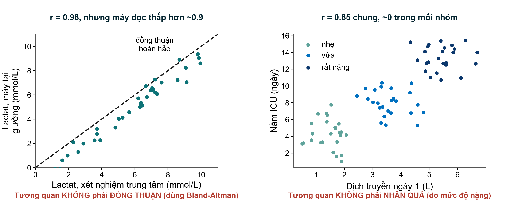{.neu-fig}

::: {.neu-takeaway}
**THÔNG ĐIỆP CHÍNH** r cao không có nghĩa hai phương pháp đồng thuận, hay cái này gây ra cái kia.
:::

::: {.notes}
BỔ SUNG: Ý chính: hai cách dùng sai kinh điển của tương quan.

Bên trái, đồng thuận: máy đo lactat tại giường so với xét nghiệm trung tâm (mô phỏng). r = 0.98, nên nhiều tác giả viết 'đồng thuận tuyệt vời'. Nhưng mọi điểm nằm dưới đường đồng thuận hoàn hảo: máy đọc thấp hơn khoảng 0.9 mmol/L. Tương quan đo việc các giá trị có cùng tăng hay không, không phải chúng có bằng nhau không. Để so sánh hai phương pháp đo, dùng biểu đồ Bland-Altman (hiệu số theo trung bình, kèm giới hạn đồng thuận).

Bên phải, nhân quả: truyền nhiều dịch ngày 1 đi kèm nằm ICU lâu hơn (r = 0.85). Nhưng trong từng nhóm mức độ nặng hoàn toàn không có liên quan; mức độ nặng chi phối cả hai. Đây lại là yếu tố gây nhiễu (Buổi 4), và là lý do ta hiệu chỉnh trong mô hình (các trang sau).

Hỏi: một máy đo hemoglobin tại chỗ mới có r = 0.95 với xét nghiệm trung tâm. Có thể thay thế xét nghiệm trung tâm không? Dự kiến: chưa; trước hết phải kiểm tra đồng thuận (độ chệch và giới hạn).

Thời lượng: 2 phút.
:::

## Bổ sung: Tương tác trong mô hình: tác động có khác nhau giữa các nhóm?

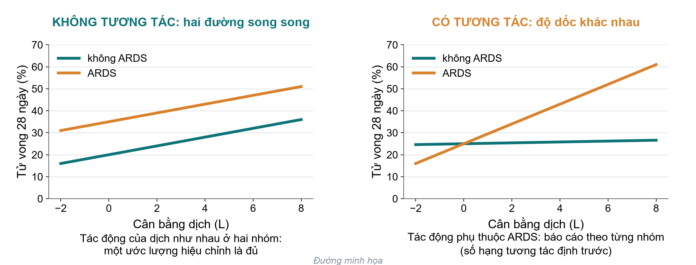{.neu-fig}

::: {.neu-takeaway}
**THÔNG ĐIỆP CHÍNH** Đường song song: hiệu chỉnh. Độ dốc khác nhau: báo cáo tác động theo từng nhóm.
:::

::: {.notes}
BỔ SUNG: Ý chính: hiệu chỉnh (các trang trước) giả định phơi nhiễm có cùng tác động ở mọi người. Tương tác (còn gọi là thay đổi tác động, Buổi 4) nghĩa là tác động khác nhau ở các nhóm khác nhau.

Bên trái, không tương tác: tử vong tăng theo cân bằng dịch với cùng tốc độ ở bệnh nhân có và không có ARDS; bệnh nhân ARDS chỉ đơn giản bắt đầu ở mức cao hơn. Một ước lượng hiệu chỉnh là đủ.

Bên phải, có tương tác: cân bằng dịch gần như không ảnh hưởng khi không có ARDS nhưng ảnh hưởng nhiều khi có ARDS. Một tác động 'trung bình' sẽ không mô tả đúng ai. Mô hình có một số hạng tương tác (dịch x ARDS); nếu quan trọng, báo cáo tác động theo từng nhóm.

Quy tắc: định trước một vài tương tác sẽ kiểm định, có lý do lâm sàng (lại là so sánh nhiều lần!), và không kết luận khác biệt giữa phân nhóm chỉ vì một phân nhóm có p \< 0.05 còn nhóm kia thì không; hãy kiểm định chính số hạng tương tác.

Đường minh họa.

Hỏi: nhiễu hay tương tác? 'Thuốc có hiệu quả ở nữ nhưng không ở nam.' Dự kiến: tương tác (thay đổi tác động).

Thời lượng: 2 phút.
:::

## Bổ sung: Đường 'không tác động': 0 cho hiệu số, 1 cho tỉ số

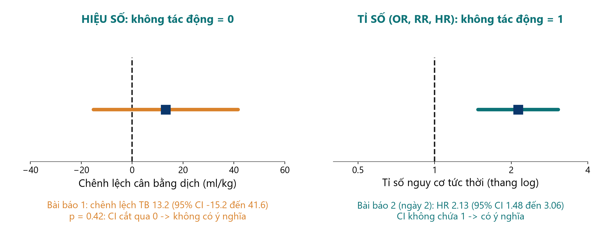{.neu-fig}

::: {.neu-takeaway}
**THÔNG ĐIỆP CHÍNH** Tìm giá trị không tác động trước, rồi xem CI có cắt qua nó không.
:::

::: {.notes}
BỔ SUNG: Ý chính: đặt hai bài báo của ví dụ xuyên suốt cạnh nhau.

Bên trái, Bài báo 1 (chênh lệch trung bình, giá trị không tác động = 0): 13.2 ml/kg (95% CI -15.2 đến 41.6). Khoảng cắt qua 0: không có khác biệt có ý nghĩa thống kê, và rất kém chính xác.

Bên phải, Bài báo 2, đoàn hệ ngày 2 (tỉ số, giá trị không tác động = 1): HR 2.13 (95% CI 1.48 đến 3.06), p \< 0.001. Toàn bộ khoảng nằm trên 1: cân bằng dịch dương đến ngày 2 có liên quan với tử vong 28 ngày cao hơn.

Chú ý thang tỉ số được vẽ theo thang log: HR 0.5 (giảm một nửa) và HR 2 (gấp đôi) cách đều 1. Vì vậy biểu đồ rừng (forest plot) của các tỉ số trông đối xứng quanh 1.

Quy tắc: CI 95% không chứa giá trị không tác động tương đương p \< 0.05, và ngược lại. CI cho biết mọi điều giá trị p cho biết, cộng thêm độ lớn và độ chính xác.

Hỏi: nếu CI của một HR là 0.95 đến 1.40, có ý nghĩa hay không? Dự kiến: không có ý nghĩa; nó chứa 1.
:::

## Bổ sung: Mô hình dự báo: khả năng phân biệt và hiệu chuẩn

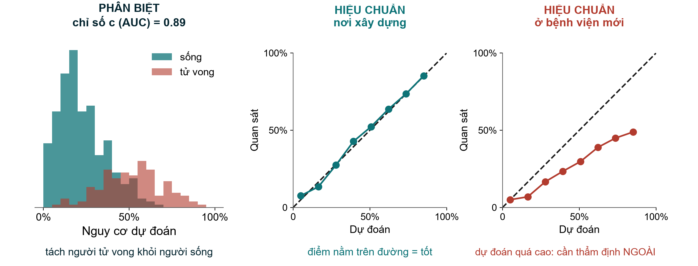{.neu-fig}

::: {.neu-takeaway}
**THÔNG ĐIỆP CHÍNH** Mô hình dự báo tốt phân biệt được bệnh nhân VÀ ước đúng nguy cơ, cả ở bệnh viện mới.
:::

::: {.notes}
BỔ SUNG: Ý chính: đến giờ, các mô hình dùng để GIẢI THÍCH (dịch truyền có liên quan với tử vong sau khi hiệu chỉnh yếu tố gây nhiễu không?). Mô hình dự báo dùng để DỰ ĐOÁN nguy cơ của từng người (SOFA, APACHE, cảnh báo sớm nhiễm khuẩn huyết, điểm học máy). Chúng được đánh giá theo cách khác.

Khả năng phân biệt (bên trái): mô hình có cho nguy cơ cao hơn ở bệnh nhân tử vong so với bệnh nhân sống không? Đo bằng chỉ số c (= diện tích dưới đường cong ROC, AUC): 0.5 như tung đồng xu, 1.0 là hoàn hảo; ở đây khoảng 0.89 (mô phỏng).

Hiệu chuẩn (ở giữa): khi mô hình dự đoán 30%, có khoảng 30% tử vong không? Các điểm nằm trên đường chéo = hiệu chuẩn tốt.

Thẩm định ngoài (bên phải): cùng mô hình ở một bệnh viện mới dự đoán nguy cơ quá cao (điểm nằm dưới đường chéo). Đặc điểm bệnh nhân, điều trị và cách đo khác nhau. Mô hình phải được thử trên những bệnh nhân KHÔNG dùng để xây dựng nó, tốt nhất ở nơi khác, trước khi ai đó sử dụng.

AUC cao thôi chưa đủ: mô hình có thể xếp hạng bệnh nhân tốt mà vẫn cho nguy cơ tuyệt đối sai.

Hỏi: một nhà cung cấp nói hệ thống cảnh báo nhiễm khuẩn huyết của họ có AUC 0.92 'trên dữ liệu phát triển'. Anh chị hỏi gì? Dự kiến: hiệu chuẩn, và thẩm định ngoài ở cơ sở giống của ta.

Thời lượng: 2 phút.
:::

## Bổ sung: Dự báo và học máy: cách đánh giá một mô hình

::: {.neu-intro}
Học máy là cách linh hoạt để xây dựng mô hình dự báo; các câu hỏi vẫn như cũ.
:::

:::: {.neu-cards style="--n:4"}
::: {.neu-card .plain style="--c:#0D7377"}
[Dùng để làm gì?]{.neu-card-title}

- Dự đoán nguy cơ từng người
- Không để giải thích nguyên nhân
- Cho ai, khi nào, quyết định gì?
:::
::: {.neu-card .plain style="--c:#0B376C"}
[Đủ dữ liệu?]{.neu-card-title}

- Học máy cần RẤT NHIỀU biến cố
- Nguy cơ quá khớp cao
- Đã thẩm định nội bộ?
:::
::: {.neu-card .plain style="--c:#5FA39B"}
[Có hiệu quả?]{.neu-card-title}

- Phân biệt (AUC)
- Biểu đồ hiệu chuẩn
- Thẩm định NGOÀI
:::
::: {.neu-card .plain style="--c:#0070C0"}
[Báo cáo đủ?]{.neu-card-title}

- Bảng kiểm TRIPOD+AI
- Mã, dữ liệu, công bằng
- Tác động lên bệnh nhân?
:::
::::

::: {.neu-takeaway}
**THÔNG ĐIỆP CHÍNH** Điểm AI là một mô hình dự báo: hãy hỏi về hiệu chuẩn và thẩm định ngoài.
:::

::: {.notes}
BỔ SUNG: Ý chính: học máy (machine learning, ML) và công cụ AI là các mô hình dự báo được xây dựng bằng thuật toán linh hoạt (rừng ngẫu nhiên, mạng nơ-ron). Đánh giá chúng bằng bốn câu hỏi.

Dùng để làm gì? Dự báo trả lời 'ai có nguy cơ cao?', không phải 'cái gì gây tử vong?'. Một biến dự báo tốt (ví dụ vào ICU ban đêm) không nhất thiết là nguyên nhân. Hãy hỏi kết quả dự báo sẽ thay đổi quyết định nào.

Đủ dữ liệu? Các phương pháp linh hoạt rất dễ quá khớp; chúng cần nhiều biến cố hơn hẳn mô hình hồi quy. Kiểm tra cách thẩm định nội bộ (kiểm định chéo, bootstrap, một mẫu để riêng).

Có hiệu quả? Khả năng phân biệt và hiệu chuẩn, và trên hết là thẩm định ngoài ở thời gian hoặc nơi khác.

Báo cáo đầy đủ? TRIPOD+AI là hướng dẫn báo cáo cho mô hình dự báo, kể cả AI (trên EQUATOR, Buổi 7-8). Tìm cách xử lý dữ liệu thiếu, tính công bằng giữa các nhóm, và mô hình đã được thử nghiệm về tác động lên kết cục bệnh nhân hay chỉ về độ chính xác.

Các học phần nâng cao tự chọn có phần xây dựng và thẩm định mô hình dự báo.

Hỏi: một điểm cảnh báo sớm có độ chính xác tuyệt vời nhưng chưa có nghiên cứu tác động đã sẵn sàng dùng thường quy chưa? Dự kiến: chưa; chính xác không đồng nghĩa với có lợi.

Thời lượng: 2 phút.
:::

## Bổ sung: Phân tích ca đầy đủ và đa phép gán

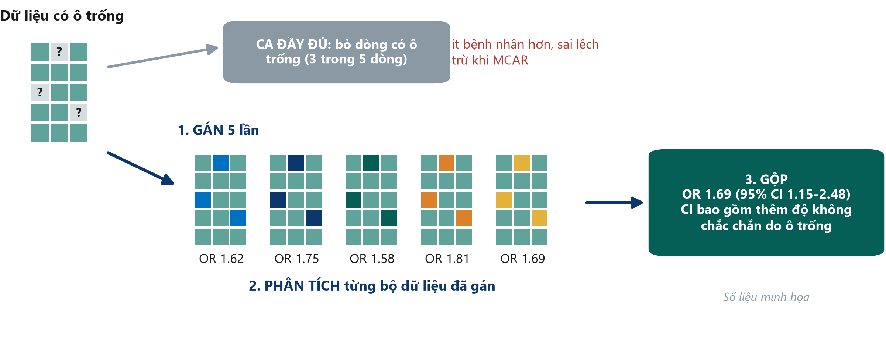{.neu-fig}

::: {.neu-takeaway}
**THÔNG ĐIỆP CHÍNH** Đa phép gán giữ mọi bệnh nhân và thừa nhận độ không chắc chắn của ô trống.
:::

::: {.notes}
BỔ SUNG: Ý chính: hai cách phổ biến để xử lý ô trống, trình bày bằng hình. Không có công thức.

Phân tích ca đầy đủ (complete-case, phía trên): chỉ dùng những bệnh nhân không thiếu giá trị nào ở các biến được phân tích. Đơn giản và là mặc định của hầu hết phần mềm, nhưng mất bệnh nhân (ở đây 3 trong 5 dòng) và câu trả lời bị sai lệch trừ khi dữ liệu là MCAR. Với nhiều biến, mỗi biến thiếu một chút cộng lại thành mất rất nhiều.

Đa phép gán (multiple imputation, phía dưới), ý tưởng gồm ba bước: 1. Điền mỗi ô trống nhiều lần (ở đây 5) bằng giá trị hợp lý dự đoán từ các biến đã ghi nhận khác, mỗi lần có một chút dao động ngẫu nhiên. 2. Phân tích từng bộ dữ liệu đã điền theo cách thông thường. 3. Gộp kết quả thành một ước lượng mà CI bao gồm thêm độ không chắc chắn do không biết các giá trị bị thiếu.

Phương pháp hoạt động tốt khi dữ liệu là MAR và mô hình gán có các biến giải thích việc thiếu. Đây không phải 'bịa dữ liệu': đây là sự trung thực về những gì ta không biết.

Số liệu minh họa. Ở phần 6.4 anh chị thấy nó được chạy trên bộ dữ liệu khóa học; việc của anh chị là nhận ra nó và hỏi xem nó có phù hợp không.

Hỏi: một bài báo loại 30% bệnh nhân vì thiếu dữ liệu và chỉ phân tích ca đầy đủ. Anh chị hỏi gì? Dự kiến: ai bị loại, họ có khác biệt không, và có phân tích độ nhạy với đa phép gán không?

Thời lượng: 2 phút.
:::

## Bổ sung: Báo cáo và kiểm tra dữ liệu bị thiếu

::: {.neu-intro}
Bốn điều người phản biện sẽ tìm.
:::

:::: {.neu-cards style="--n:4"}
::: {.neu-card .plain style="--c:#0D7377"}
[Báo cáo]{.neu-card-title}

- Số thiếu theo từng biến
- Sơ đồ: ai và vì sao
- Trong Bảng 1 hoặc chú thích
:::
::: {.neu-card .plain style="--c:#0B376C"}
[So sánh]{.neu-card-title}

- Bệnh nhân có và không có
- dữ liệu đầy đủ
- Họ có khác nhau không?
:::
::: {.neu-card .plain style="--c:#5FA39B"}
[Độ nhạy (Cấp độ 2)]{.neu-card-title}

- Ca đầy đủ so với đa phép gán
- Script mẫu: 05\_missing.R
- Thực hành ở Cấp độ 2
:::
::: {.neu-card .plain style="--c:#0070C0"}
[Kế hoạch]{.neu-card-title}

- Viết trong SAP
- trước khi thấy dữ liệu
- Phần 3 của đề cương
:::
::::

::: {.neu-takeaway}
**THÔNG ĐIỆP CHÍNH** Dữ liệu thiếu cũng là một kết quả: báo cáo, xử lý, và kiểm tra lại kết luận.
:::

::: {.notes}
BỔ SUNG: Ý chính: một bài báo tốt (và đề cương của anh chị) nói gì về dữ liệu bị thiếu.

Báo cáo: số giá trị thiếu ở từng biến (cột 'n' trong Bảng 1 hoặc chú thích) và, với kết cục, một sơ đồ dòng chảy cho biết ai bị mất và vì sao (CONSORT, STROBE, Buổi 7-8).

So sánh: bệnh nhân có dữ liệu đầy đủ với những người có ô trống về các đặc điểm ban đầu. Khác biệt lớn gợi ý việc thiếu không ngẫu nhiên.

Phân tích độ nhạy: lặp lại phân tích chính theo một cách khác: ca đầy đủ so với đa phép gán; với kết cục nhị phân bị thiếu, kịch bản tốt nhất (mọi ca thiếu đều sống) và xấu nhất (mọi ca thiếu đều tử vong). Nếu kết luận giữ nguyên ở mọi phiên bản, nó vững. Nếu đảo chiều, hãy nói rõ.

Kế hoạch: tất cả những điều này đưa vào SAP và vào Phần 3 đề cương hôm nay: mức thiếu dự kiến, phòng ngừa (5.1), và cách báo cáo dữ liệu thiếu.

Hỏi: Bài báo 1 phân tích 48 trong 50 bệnh nhân được phân bổ ngẫu nhiên; hai bệnh nhân nhóm chứng rút lui. Có vấn đề không? Dự kiến: mất ít (4%), được báo cáo minh bạch; một phân tích độ nhạy vẫn là thực hành tốt.

Thời lượng: 2 phút.
:::
