# Buổi 7 · Bảo vệ & viết: đạo đức, liêm chính, Phương pháp và Kết quả

## Tuần 7 · Thứ Bảy

- Câu hỏi ôn tập: Buổi 6
- 7.1  Đề cương, đạo đức, chấp thuận, đăng ký, tính khả thi
- 7.2  Liêm chính: quyền tác giả, xung đột lợi ích, chia sẻ dữ liệu, AI
- Xây dựng đề cương 7: đạo đức + kế hoạch công bố
- 7.3  Viết bài báo (I): Phương pháp, Kết quả, bảng, STROBE
- Thực hành bản thảo 1: soạn Phương pháp + Kết quả

::: {.notes}
BUỔI 7 (0:00). Tuần 7, Thứ Bảy. Hôm nay có hai nửa: trước giải lao chúng ta bảo vệ người bệnh và khoa học (đạo đức, liêm chính) và hoàn thành Đề cương Phần 4; sau giải lao chúng ta bắt đầu VIẾT bản thảo FLUID-ICU.

Nhịp: chậm. Mỗi phần có một ví dụ mẫu và 1 phút kiểm tra hiểu bài. Nếu thiếu thời gian, bỏ các slide trong mục 'Slide bổ sung - Buổi 7' ở cuối, không bao giờ bỏ phần thực hành.

Trước khi bắt đầu: in gói kết quả (Course/Data/results\_packs/Q1-Q5), mỗi nhóm một bản; mở mẫu bản thảo trên máy tính của nhóm nếu có.

Thời gian: slide này 1 phút, sau đó 10 phút câu hỏi ôn tập.
:::

## Câu hỏi ôn tập: Buổi 6 trong năm câu

::: {.neu-banner style="--c:#6C3483"}
CÂU HỎI NHANH · 10 phút
:::

:::: {.columns}
::: {.column width="60%"}
::: {.neu-activity-steps style="--c:#6C3483"}
1. OR thô là 2,1; OR hiệu chỉnh là 1,4. Điều gì đã xảy ra?
2. HR 0,85 (KTC 95% 0,60 đến 1,20): có lợi rõ ràng không?
3. Lactat thiếu ở 15% bệnh nhân. Nêu một cách xử lý
4. Kaplan-Meier: bệnh nhân 'bị kiểm duyệt' nghĩa là gì?
5. Câu hỏi FLUID-ICU của nhóm bạn: kết quả chính là gì?
:::
:::
::: {.column width="40%"}
::: {.neu-side .plain style="--c:#6C3483"}
Đáp án

- 1. Nhiễu: một phần liên quan thô là do mức độ nặng
- 2. Không - KTC chứa giá trị 1
- 3. Phân tích ca đầy đủ, hoặc quy gán đa bội + phân tích độ nhạy
- 4. Rời nghiên cứu khi còn sống, sau đó không biết kết cục
- 5. Theo gói kết quả của nhóm
:::
:::
::::

::: {.neu-output style="--c:#6C3483"}
**SẢN PHẨM** Mọi người nhớ lại: hiệu chỉnh, KTC, dữ liệu thiếu, sống còn
:::

::: {.notes}
ÔN TẬP (0:01-0:10). Hỏi, chờ, rồi mới mở khung đáp án.

Câu 1 nối thẳng với phần viết hôm nay: trong Kết quả ta báo cáo CẢ ước lượng thô và hiệu chỉnh (mục STROBE 16), và trong Bàn luận ta giải thích vì sao chúng khác nhau.

Câu 5: hỏi mỗi nhóm một người - đây là con số họ sẽ viết sau giải lao. Nếu nhóm nào không nói được, ngồi với nhóm đó trong giờ giải lao và cùng xem gói kết quả.

Giơ tay cho từng câu; dành nhiều thời gian nhất cho câu mà lớp chia rẽ.
:::

## Hôm nay: hoàn thành đề cương, bắt đầu bài báo

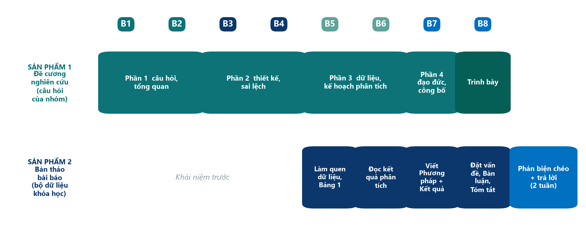{.neu-fig}

::: {.neu-takeaway}
**THÔNG ĐIỆP CHÍNH** Trước giải lao: Đề cương Phần 4. Sau giải lao: Phương pháp và Kết quả.
:::

::: {.notes}
Hai sản phẩm, hai hàng. Sản phẩm 1 - đề cương nghiên cứu của chính nhóm - hôm nay có phần cuối cùng (đạo đức, đăng ký, khả thi, kế hoạch công bố) và được trình bày thứ Bảy tuần sau.

Sản phẩm 2 - bản thảo FLUID-ICU - chuyển từ 'đọc kết quả phân tích' (Buổi 6) sang VIẾT: hôm nay Phương pháp và Kết quả, thứ Bảy tuần sau Đặt vấn đề, Bàn luận, Tóm tắt và Tiêu đề.

Hỏi: nhóm bạn có câu hỏi nào (Q1-Q5)? Bảo đảm mọi người đều biết.
:::

## 7.1  \|  30 phút

:::: {.neu-statement}
::: {.neu-big}
Đề cương, đạo đức và chấp thuận tham gia
:::

::: {.neu-sub}
Bảo vệ người bệnh trước khi có dữ liệu đầu tiên
:::
::::

::: {.notes}
PHẦN 7.1 (0:10-0:40). Mười một slide gồm hai ví dụ mẫu và 1 phút kiểm tra.

Khoảng 2,5 phút mỗi slide. Slide chấp thuận trong ICU và ví dụ mẫu đi kèm cần nhiều thời gian nhất - đó là vấn đề thực tế của khoa.

Liên hệ: mọi nội dung của phần này sẽ thành một đoạn trong Đề cương Phần 4 (Xây dựng đề cương 7 lúc 1:00).
:::

## Đề cương: bản thiết kế của nghiên cứu

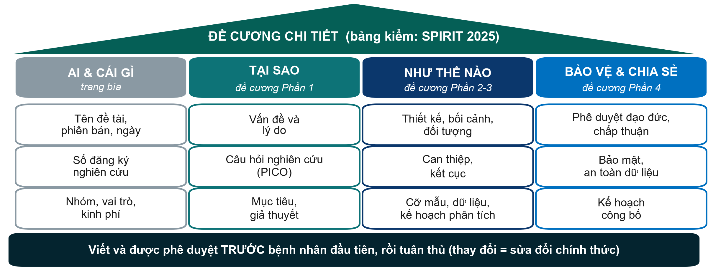{.neu-fig}

::: {.neu-takeaway}
**THÔNG ĐIỆP CHÍNH** Bốn phần đề cương của bạn CHÍNH LÀ khung của một đề cương nghiên cứu.
:::

::: {.notes}
Ý chính: đề cương là kế hoạch đầy đủ bằng văn bản, được viết và phê duyệt TRƯỚC khi đưa người bệnh đầu tiên vào nghiên cứu. SPIRIT 2025 là bảng kiểm quốc tế về nội dung đề cương thử nghiệm lâm sàng; nghiên cứu quan sát cũng theo cùng logic.

Đi qua bốn cột: AI & CÁI GÌ (trang bìa, số đăng ký, nhóm, kinh phí), TẠI SAO (Phần 1), NHƯ THẾ NÀO (Phần 2 và 3), BẢO VỆ & CHIA SẺ (Phần 4, hôm nay).

Chỉ vào thanh nền: mọi thay đổi sau khi phê duyệt phải là sửa đổi chính thức, được duyệt trước khi áp dụng - không được lặng lẽ thay đổi.

Ví dụ xuyên suốt: Bài 1 cho biết đề cương và kế hoạch phân tích thống kê đã đăng ký trên ClinicalTrials.gov (NCT04947904) trước bệnh nhân đầu tiên - nhờ vậy người đọc kiểm tra được tác giả có làm đúng kế hoạch hay không.

Hỏi: cột nào trong đề cương của nhóm bạn đang yếu nhất? Thường là NHƯ THẾ NÀO - cỡ mẫu hoặc kế hoạch phân tích. Trấn an: mẫu đề cương trong thư mục Templates/ theo đúng thứ tự này.
:::

## Hai bộ nguyên tắc: Helsinki và Thực hành lâm sàng tốt

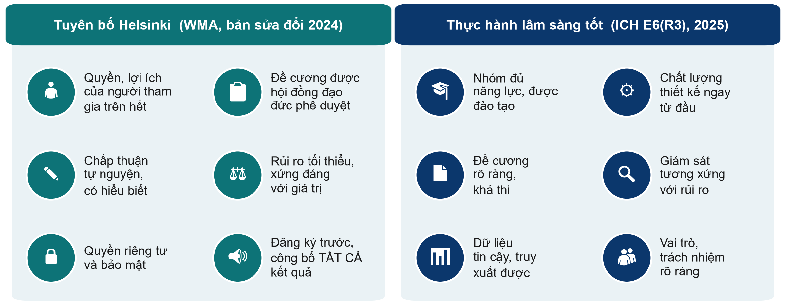{.neu-fig}

::: {.neu-takeaway}
**THÔNG ĐIỆP CHÍNH** Helsinki nói TẠI SAO bảo vệ người tham gia; GCP nói LÀM THẾ NÀO cho tốt.
:::

::: {.notes}
Ý chính: Tuyên bố Helsinki (Hội Y khoa Thế giới, bản sửa đổi mới nhất tháng 10/2024) là nền tảng đạo đức của nghiên cứu trên người. Cốt lõi: quyền và lợi ích của từng người tham gia đặt trên mục tiêu tạo ra tri thức; đề cương được một hội đồng đạo đức độc lập phê duyệt trước khi bắt đầu; chấp thuận tự nguyện, có hiểu biết; rủi ro tối thiểu và có lý do chính đáng; bảo vệ quyền riêng tư; mọi nghiên cứu đăng ký trước người tham gia đầu tiên và công bố TẤT CẢ kết quả - kể cả âm tính hoặc chưa kết luận được.

Bản 2024 dùng từ 'người tham gia' thay cho 'đối tượng', tăng cường bảo vệ nhóm dễ bị tổn thương và người không thể tự chấp thuận, và nhấn mạnh liêm chính khoa học.

ICH E6(R3) - Thực hành lâm sàng tốt (ICH thông qua tháng 1/2025) là chuẩn chất lượng quốc tế cho thử nghiệm lâm sàng: nhân lực đủ năng lực, chất lượng được thiết kế từ đầu, giám sát tương xứng với rủi ro, dữ liệu tin cậy và truy xuất được, vai trò rõ ràng. Tinh thần này áp dụng cho mọi nghiên cứu.

Quan niệm sai: 'GCP chỉ dành cho công ty dược'. Bài 1 - một thử nghiệm ICU học thuật - ghi rõ phân tích theo ICH-GCP.

Hỏi: biểu tượng nào khó thực hiện nhất ở khoa ta? Thường là dữ liệu tin cậy (hồ sơ thiếu) hoặc thời gian dành riêng cho nghiên cứu.
:::

## Hành trình qua hội đồng đạo đức

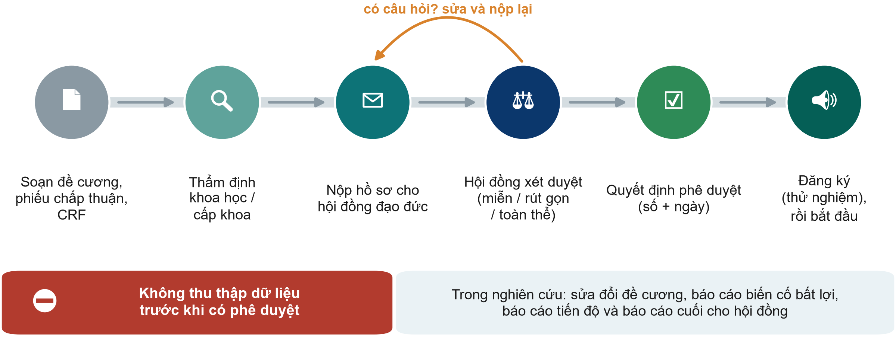{.neu-fig}

::: {.neu-takeaway}
**THÔNG ĐIỆP CHÍNH** Chưa có quyết định phê duyệt thì không thu thập dữ liệu - kể cả 'vài ca thôi'.
:::

::: {.notes}
Đi qua sáu trạm từ trái sang phải. Phần lớn cơ sở yêu cầu thẩm định khoa học hoặc cấp khoa trước; sau đó hồ sơ được nộp cho hội đồng đạo đức trong nghiên cứu (còn gọi là IRB hoặc IEC).

Hồ sơ gồm: đề cương, bản thông tin và phiếu chấp thuận cho người tham gia, phiếu thu thập dữ liệu (CRF), lý lịch nghiên cứu viên và chứng chỉ GCP, dự toán kinh phí và bảo hiểm khi cần.

Các hình thức xét duyệt: một số nghiên cứu nguy cơ thấp được miễn hoặc xét duyệt rút gọn; thử nghiệm và nghiên cứu có nguy cơ cao hơn mức tối thiểu được xét tại hội đồng toàn thể. Hội đồng quyết định hình thức - không phải nghiên cứu viên.

Có câu hỏi và yêu cầu chỉnh sửa là bình thường - dự kiến 1-3 tháng cho cả hành trình.

Thử nghiệm lâm sàng phải đăng ký ở cơ sở dữ liệu công khai (VD: ClinicalTrials.gov hoặc một cơ sở đăng ký được WHO công nhận) trước bệnh nhân đầu tiên; tạp chí từ chối thử nghiệm không đăng ký.

Quan niệm sai cần xóa bỏ: 'cứ thu thập trước, xin phép sau'. Hội đồng không thể phê duyệt hồi tố và tạp chí sẽ từ chối bài.

Ví dụ xuyên suốt: Bài 1 ghi tên hội đồng và số phê duyệt trong phần Phương pháp; Bài 2 ghi số phê duyệt IRB trong phần Cam kết.
:::

## Đăng ký trước người tham gia đầu tiên

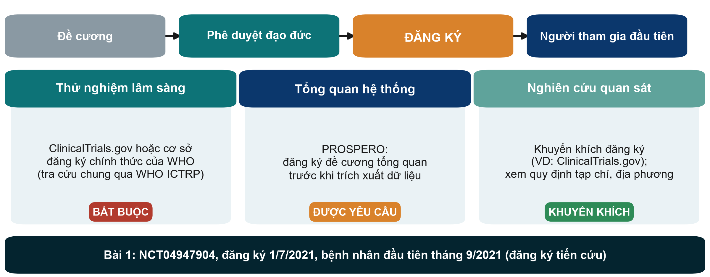{.neu-fig}

::: {.neu-takeaway}
**THÔNG ĐIỆP CHÍNH** Thử nghiệm: không đăng ký trước bệnh nhân đầu tiên thì không được công bố.
:::

::: {.notes}
Ý chính: đăng ký đưa sự tồn tại, thiết kế và kết cục chính của nghiên cứu lên hồ sơ công khai TRƯỚC khi đưa bất kỳ ai vào. Điều này ngăn việc giấu các nghiên cứu âm tính và đổi kết cục.

Thử nghiệm lâm sàng: bắt buộc đăng ký. Các tạp chí theo ICMJE không đăng thử nghiệm không được đăng ký trước người tham gia đầu tiên, và nhiều quốc gia quy định bằng luật. Dùng ClinicalTrials.gov hoặc một cơ sở đăng ký chính thức khác của WHO; cổng WHO ICTRP tra cứu tất cả cùng lúc - đó là cổng tìm kiếm, không phải nơi đăng ký.

Tổng quan hệ thống: đăng ký đề cương trên PROSPERO trước khi trích xuất dữ liệu; nhiều tạp chí yêu cầu.

Nghiên cứu quan sát: khuyến khích chứ chưa bắt buộc - kiểm tra yêu cầu của tạp chí và quy định địa phương. Tuyên bố Helsinki yêu cầu mọi nghiên cứu trên người được đăng ký.

Ví dụ xuyên suốt: Bài 1 đăng ký NCT04947904 ngày 1/7/2021; bệnh nhân đầu tiên vào tháng 9/2021 - đăng ký tiến cứu. Số đăng ký có ngay trong phần tóm tắt.

Hỏi: nghiên cứu của nhóm bạn có cần đăng ký không? Đáp án: thử nghiệm thì có; phần lớn đề cương đoàn hệ là 'khuyến khích'.
:::

## Kiểm tra: có cần đăng ký không?

::: {.neu-banner style="--c:#6C3483"}
CÂU HỎI NHANH · 2 phút
:::

:::: {.columns}
::: {.column width="60%"}
::: {.neu-activity-steps style="--c:#6C3483"}
1. Thử nghiệm ngẫu nhiên so sánh hai loại băng cho loét tì đè
2. Tổng quan hệ thống về chiến lược dịch truyền trong nhiễm khuẩn huyết
3. Đoàn hệ hồi cứu từ hồ sơ ICU (như FLUID-ICU)
4. Đánh giá tuân thủ vệ sinh tay (audit lâm sàng)
5. Giơ: 1 ngón = bắt buộc, 2 = nên, 3 = không cần
:::
:::
::: {.column width="40%"}
::: {.neu-side .plain style="--c:#6C3483"}
Đáp án

- 1. Bắt buộc - cơ sở đăng ký thử nghiệm, trước bệnh nhân 1
- 2. Nên - PROSPERO
- 3. Khuyến khích, không bắt buộc
- 4. Audit: không đăng ký nghiên cứu; phê duyệt nội bộ
:::
:::
::::

::: {.notes}
KIỂM TRA (1 phút + 1 phút đáp án). Đọc từng tình huống, đếm ngón tay, rồi mở đáp án.

Tình huống 4 mở ra một thảo luận hữu ích: audit so sánh thực hành với một chuẩn và thường được phê duyệt qua phòng quản lý chất lượng, không đăng ký; nhưng nếu định công bố như một nghiên cứu, hãy hỏi hội đồng đạo đức trước (Buổi 1: nghiên cứu, audit và cải tiến chất lượng).
:::

## Chấp thuận tham gia: bốn yếu tố cốt lõi

::: {.neu-intro}
Chấp thuận là một cuộc trao đổi, không chỉ là một chữ ký.
:::

:::: {.neu-cards style="--n:4"}
::: {.neu-card .plain style="--c:#0D7377"}
[Được thông tin]{.neu-card-title}

- Mục đích, những gì sẽ diễn ra
- Rủi ro, lợi ích, lựa chọn khác
- Dữ liệu được bảo vệ ra sao
- Liên hệ với ai
:::
::: {.neu-card .plain style="--c:#0B376C"}
[Hiểu rõ]{.neu-card-title}

- Ngôn ngữ đơn giản, quen thuộc
- Có thời gian để hỏi
- Nhắc lại: 'hãy nói theo cách của bác'
:::
::: {.neu-card .plain style="--c:#5FA39B"}
[Tự nguyện]{.neu-card-title}

- Không ép buộc
- Được từ chối hoặc rút lui
- Việc điều trị KHÔNG bị ảnh hưởng
:::
::: {.neu-card .plain style="--c:#0070C0"}
[Có văn bản]{.neu-card-title}

- Phiếu ký tên, ghi ngày
- Một bản cho người tham gia
- Xin lại nếu nghiên cứu thay đổi
:::
::::

::: {.neu-takeaway}
**THÔNG ĐIỆP CHÍNH** Nếu người bệnh không giải thích lại được nghiên cứu, chấp thuận chưa có hiểu biết.
:::

::: {.notes}
Ý chính: chấp thuận hợp lệ cần đủ bốn yếu tố - thông tin, hiểu biết, tự nguyện và có văn bản.

Điều dưỡng và dược sĩ thường là người được bệnh nhân hỏi lại 'tôi đã ký cái gì?' - đây là việc của mọi người, không riêng nghiên cứu viên chính.

Rút lui: người tham gia có thể rời nghiên cứu bất cứ lúc nào, không cần nêu lý do và không ảnh hưởng đến điều trị. Ví dụ xuyên suốt: trong Bài 1, hai bệnh nhân nhóm chứng rút lại chấp thuận và không được đưa vào phân tích - quyền đó được tôn trọng, và vì vậy thử nghiệm phân tích 48 trên 50 người.

Lỗi thường gặp: phiếu chấp thuận viết như văn bản học thuật, bằng ngôn ngữ mà gia đình không đọc thành thạo. Hãy xin mẫu của hội đồng (có một mẫu trong Templates/).

Hỏi: trong nghiên cứu của nhóm, ai sẽ xin chấp thuận và vào lúc nào? Đáp án mong đợi: một thành viên đã được đào tạo, nếu được thì KHÔNG phải bác sĩ điều trị đang chịu áp lực thời gian.
:::

## Chấp thuận trong ICU: khi người bệnh không thể tự quyết định

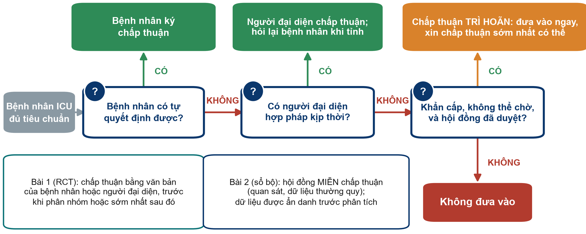{.neu-fig}

::: {.neu-takeaway}
**THÔNG ĐIỆP CHÍNH** Người bệnh, rồi người đại diện hợp pháp, rồi chấp thuận trì hoãn - chỉ khi được duyệt.
:::

::: {.notes}
Đây là vấn đề thực tế của ICU: phần lớn người bệnh đang an thần, mê sảng hoặc sốc khi đủ tiêu chuẩn.

Đọc sơ đồ từ trái sang phải. 1) Người bệnh có tự quyết định được không? Nếu có, người bệnh ký chấp thuận. 2) Nếu không, người đại diện hợp pháp (thường là gia đình, theo quy định pháp luật) chấp thuận, và hỏi lại người bệnh khi họ có khả năng. 3) Nếu không liên lạc kịp người đại diện và điều trị không thể chờ, nghiên cứu CHỈ được tiến hành khi đề cương đã giải thích lý do và hội đồng đạo đức đã duyệt trước quy trình khẩn cấp này; sau đó xin chấp thuận tiếp tục sớm nhất có thể. Đó là 'chấp thuận trì hoãn'. Tuyên bố Helsinki 2024 cho phép đúng điều này, với các điều kiện trên.

Bài 1 áp dụng cách này: chấp thuận bằng văn bản của bệnh nhân hoặc người đại diện hợp pháp 'trước khi phân nhóm ngẫu nhiên hoặc sớm nhất có thể sau đó' (trang 3).

Bài 2 khác: một sổ bộ dùng dữ liệu thường quy - hội đồng miễn chấp thuận cá nhân và dữ liệu được ẩn danh trước khi phân tích (trang 8).

Luật địa phương quy định ai được làm người đại diện và có cho phép chấp thuận trì hoãn hay không - hãy hỏi hội đồng trước khi viết đề cương.

Hỏi: nếu gia đình từ chối sau khi bệnh nhân đã được đưa vào theo chấp thuận trì hoãn thì sao? Đáp án: bệnh nhân rời nghiên cứu; dữ liệu đã thu có được dùng hay không tùy đề cương đã duyệt và sự đồng ý của gia đình.
:::

## Ví dụ mẫu: ai chấp thuận cho ba bệnh nhân ICU này?

::: {.neu-intro}
Đưa từng bệnh nhân qua sơ đồ.
:::

:::: {.neu-cards style="--n:3"}
::: {.neu-card .plain style="--c:#0D7377"}
[Ông A, 54 tuổi]{.neu-card-title}

- Viêm phổi, tỉnh, định hướng tốt
- Đủ tiêu chuẩn thử nghiệm dịch
- **[Bệnh nhân tự chấp thuận]{style="color:#2E8B57"}**
:::
::: {.neu-card .plain style="--c:#0B376C"}
[Bà B, 71 tuổi]{.neu-card-title}

- Sốc nhiễm khuẩn, đang an thần
- Con gái ở cạnh giường
- **[Người đại diện chấp thuận; hỏi lại bà B khi tỉnh]{style="color:#2E8B57"}**
:::
::: {.neu-card .plain style="--c:#5FA39B"}
[Ông C, 38 tuổi]{.neu-card-title}

- Sốc lúc 3 giờ sáng, chưa có người nhà
- Điều trị không thể chờ; hội đồng đã duyệt
- **[Chấp thuận trì hoãn: hỏi sớm nhất có thể]{style="color:#D9822B"}**
:::
::::

::: {.neu-takeaway}
**THÔNG ĐIỆP CHÍNH** Quy trình và thời điểm được ghi trong đề cương trước bệnh nhân đầu tiên.
:::

::: {.notes}
VÍ DỤ MẪU. Hỏi lớp cho từng thẻ TRƯỚC khi mở dòng cuối (che lại hoặc bấm chậm).

Ông A: có năng lực quyết định - bệnh nhân tự quyết định.

Bà B: hiện không có năng lực; người đại diện hợp pháp (ở đây là con gái, nếu luật địa phương cho phép) chấp thuận; bà B được hỏi lại khi có năng lực - bà có thể rút lui.

Ông C: không liên lạc kịp người đại diện, điều trị không thể chờ - chấp thuận trì hoãn CHỈ khi đề cương mô tả và hội đồng đã phê duyệt; xin chấp thuận của gia đình hoặc bệnh nhân sớm nhất có thể. Bài 1 dùng cách này.

Quan niệm sai: 'bác sĩ điều trị có thể chấp thuận thay bệnh nhân'. Không - bác sĩ điều trị không phải người đại diện.
:::

## Bảo mật: ẩn danh trước khi phân tích

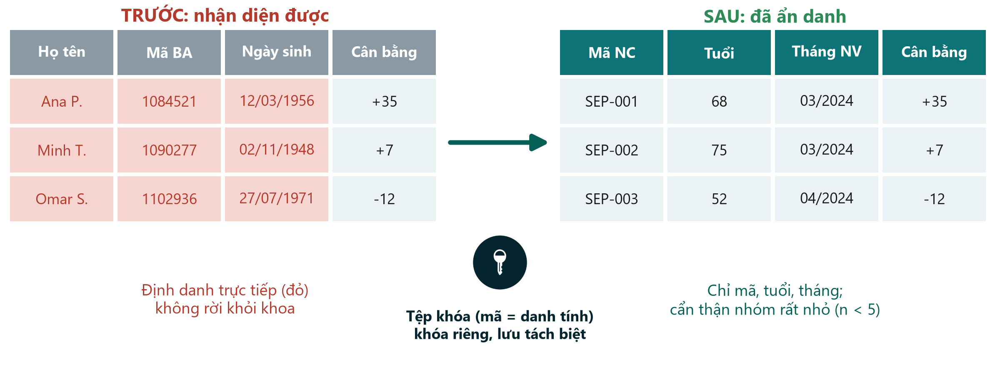{.neu-fig}

::: {.neu-takeaway}
**THÔNG ĐIỆP CHÍNH** Họ tên ở lại khoa; chỉ mã nghiên cứu được mang đi.
:::

::: {.notes}
Ý chính: bảo mật được bảo đảm bằng thiết kế, không phải bằng thiện chí.

Trước: các định danh trực tiếp - họ tên, mã bệnh án, ngày sinh chính xác, địa chỉ, số điện thoại, ảnh. Sau: mã nghiên cứu, tuổi thay cho ngày sinh, tháng thay cho ngày chính xác, và chỉ các biến có trong từ điển dữ liệu.

Tệp khóa nối mã với danh tính được lưu riêng, có mật khẩu, chỉ một hai người có tên được truy cập.

Cẩn thận nhận diện gián tiếp: 'bệnh nhân 19 tuổi duy nhất chạy ECMO trong tháng 3' vẫn nhận ra được dù không có tên. Báo cáo các nhóm rất nhỏ một cách thận trọng.

Quy tắc thực hành: không lưu dữ liệu bệnh nhân trên điện thoại cá nhân, ứng dụng nhắn tin, email cá nhân, đám mây công cộng hay công cụ AI; chỉ dùng nơi lưu trữ được mã hóa và được cơ sở cho phép.

Ví dụ xuyên suốt: Bài 2 ghi rõ thông tin người bệnh đã được ẩn danh trước khi phân tích.

Hỏi: tệp khóa của nhóm bạn sẽ nằm ở đâu? Đáp án: nơi lưu trữ được cơ sở phê duyệt, có mật khẩu - không phải USB trong túi áo.
:::

## Ví dụ mẫu: đoạn đạo đức cho một đoàn hệ như FLUID-ICU

::: {.neu-intro}
FLUID-ICU là dữ liệu mô phỏng - nhưng nếu là thật, bài báo sẽ viết như sau.
:::

:::: {.neu-cards style="--n:4"}
::: {.neu-card .plain style="--c:#0D7377"}
[Phê duyệt]{.neu-card-title}

- Hội đồng đạo đức của từng ICU
- Số và ngày phê duyệt
- Trước khi thu thập dữ liệu
:::
::: {.neu-card .plain style="--c:#0B376C"}
[Chấp thuận]{.neu-card-title}

- Dữ liệu thường quy, nguy cơ tối thiểu
- Hội đồng có thể MIỄN chấp thuận
- (như Bài 2)
:::
::: {.neu-card .plain style="--c:#5FA39B"}
[Bảo mật]{.neu-card-title}

- Chỉ dùng mã nghiên cứu
- Tệp khóa lưu ở từng ICU
- Ẩn danh trước khi phân tích
:::
::: {.neu-card .plain style="--c:#0070C0"}
[Đăng ký & chia sẻ]{.neu-card-title}

- Khuyến khích đăng ký
- Tuyên bố chia sẻ dữ liệu
- Chia sẻ từ điển dữ liệu
:::
::::

::: {.neu-takeaway}
**THÔNG ĐIỆP CHÍNH** Đoạn đạo đức của bản thảo trả lời bốn câu hỏi trong bốn câu.
:::

::: {.notes}
VÍ DỤ MẪU nối 7.1 với bản thảo. Nói rõ FLUID-ICU là bộ dữ liệu giảng dạy MÔ PHỎNG - không có phê duyệt thật - nên trong bản thảo của khóa học các nhóm viết: 'Phân tích này dùng bộ dữ liệu giảng dạy mô phỏng; không cần phê duyệt đạo đức.' Với một đoàn hệ thật, đoạn văn sẽ như bốn thẻ trên.

Câu mẫu (nghiên cứu thật): 'Nghiên cứu được hội đồng đạo đức của bốn bệnh viện tham gia phê duyệt (số, ngày); hội đồng miễn chấp thuận cá nhân vì dữ liệu được thu thập trong chăm sóc thường quy và phân tích sau khi ẩn danh.'

Hỏi: đoạn này nằm ở đâu? Đáp án: trong Phương pháp; đa số tạp chí còn yêu cầu ở phần 'Cam kết'.
:::

## Tính khả thi trong một hình: năm câu hỏi trung thực

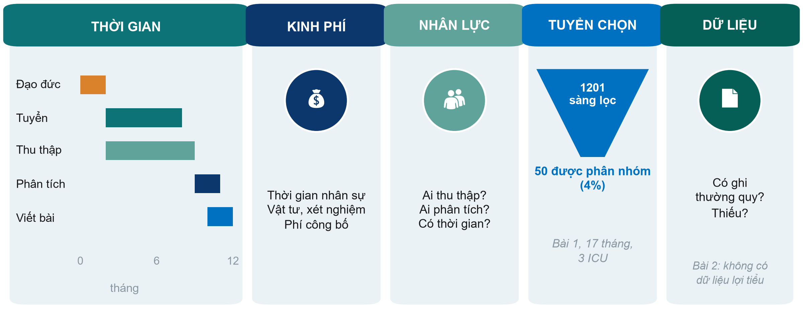{.neu-fig}

::: {.neu-takeaway}
**THÔNG ĐIỆP CHÍNH** Đếm số bệnh nhân đủ tiêu chuẩn ở khoa TRƯỚC khi viết cỡ mẫu.
:::

::: {.notes}
Đi qua năm ô. THỜI GIAN: riêng phê duyệt đạo đức có thể mất 1-3 tháng; tuyển bệnh luôn lâu hơn dự kiến. KINH PHÍ: ghi các khoản dù số tiền nhỏ - thời gian nhân sự, vật tư hoặc xét nghiệm, phí công bố. NHÂN LỰC: ai thu thập số liệu ca đêm và cuối tuần, ai phân tích, có thời gian dành riêng không? TUYỂN CHỌN: Bài 1 sàng lọc 1201 bệnh nhân ở ba ICU trong 17 tháng để phân nhóm được 50 (khoảng 4%) - phần lớn bệnh nhân 'trông có vẻ đủ tiêu chuẩn' lại không đủ hoặc không được đưa vào. DỮ LIỆU: biến đó đã được ghi thường quy chưa? Bài 2 không thể nghiên cứu thuốc lợi tiểu vì sổ bộ không ghi nhận.

Quy tắc kinh nghiệm: đếm số bệnh nhân thỏa tiêu chuẩn mà khoa đã gặp năm ngoái, rồi giả định bạn chỉ đưa vào được một phần nhỏ.

Hỏi: ô nào là rủi ro lớn nhất cho nghiên cứu của nhóm bạn? Thường là tuyển chọn và nhân lực (thu thập số liệu ca đêm).

Đây là slide khả thi duy nhất của Cấp độ 1 - không đi sâu hơn.
:::

## 7.2  \|  20 phút

:::: {.neu-statement}
::: {.neu-big}
Liêm chính nghiên cứu
:::

::: {.neu-sub}
Dữ liệu trung thực, ghi công trung thực, dùng AI trung thực
:::
::::

::: {.notes}
PHẦN 7.2 (0:40-1:00). Sáu slide (khoảng 2 phút mỗi slide) và 5 phút câu hỏi tình huống.

Giọng điệu: không phải để 'bắt lỗi'. Phần lớn vấn đề liêm chính bắt đầu từ những lối tắt nhỏ khi bị áp lực - một giá trị thiếu 'được điền vào', một giá trị ngoại lai 'được làm sạch', thêm sếp vào danh sách tác giả.

Liên hệ bản thảo: mỗi bản thảo của nhóm cần tuyên bố về tác giả (CRediT), xung đột lợi ích, khả năng cung cấp dữ liệu và việc dùng AI.
:::

## Bịa đặt, xuyên tạc, đạo văn (FFP)

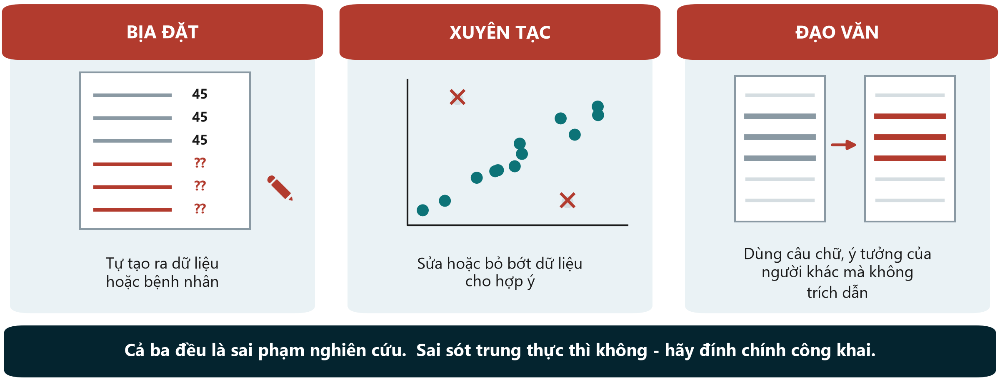{.neu-fig}

::: {.neu-takeaway}
**THÔNG ĐIỆP CHÍNH** Dữ liệu thiếu được báo cáo là thiếu - không bao giờ bịa ra, không lặng lẽ loại bỏ.
:::

::: {.notes}
Ý chính: ba hình thức sai phạm nghiên cứu kinh điển.

Bịa đặt: tạo ra dữ liệu hoặc bệnh nhân (VD: điền cân bằng dịch ngày 3 'theo trí nhớ' vì mất phiếu theo dõi).

Xuyên tạc: sửa, chọn lọc hoặc bỏ bớt dữ liệu, hình ảnh hay kết quả cho đẹp (VD: loại hai bệnh nhân 'lạ' sau khi thấy họ làm yếu kết quả).

Đạo văn: dùng câu chữ, ý tưởng hoặc hình ảnh của người khác mà không ghi nguồn - kể cả chép nguyên đoạn CÓ trích dẫn nhưng không đặt trong ngoặc kép.

Sai sót trung thực không phải sai phạm - nhưng phải được đính chính công khai.

Liên hệ Buổi 5: kế hoạch chất lượng dữ liệu (kiểm tra khoảng giá trị, quy tắc xử lý giá trị ngoại lai định trước) bảo vệ bạn khỏi xuyên tạc vô tình.

Hỏi: trong ba loại này, loại nào hay gặp nhất trong luận văn? Đáp án: đạo văn - thường là chép phần đặt vấn đề. Phần mềm kiểm tra trùng lặp sẽ phát hiện.
:::

## Cũng không được làm: những mẹo làm sai lệch y văn

::: {.neu-intro}
Một nghiên cứu nên kể một câu chuyện đầy đủ và trung thực.
:::

:::: {.neu-cards style="--n:3"}
::: {.neu-card .plain style="--c:#0D7377"}
[Công bố trùng lặp]{.neu-card-title}

- Cùng nghiên cứu, cùng kết quả
- đăng ở tạp chí thứ hai
- mà không nói rõ
:::
::: {.neu-card .plain style="--c:#0B376C"}
[Cắt lát salami]{.neu-card-title}

- Cắt một nghiên cứu thành nhiều bài
- để tăng số bài báo
- Người đọc không thấy toàn cảnh
:::
::: {.neu-card .plain style="--c:#5FA39B"}
[Báo cáo chọn lọc]{.neu-card-title}

- Chỉ báo cáo kết cục 'có ý nghĩa'
- Đổi kết cục chính
- sau khi xem dữ liệu
:::
::::

::: {.neu-takeaway}
**THÔNG ĐIỆP CHÍNH** Đăng ký trước, định trước kết cục chính, báo cáo tất cả.
:::

::: {.notes}
Ý chính: các hành vi này làm sai lệch bằng chứng mà bác sĩ và hội đồng xây dựng hướng dẫn dựa vào.

Công bố trùng lặp làm cùng một nhóm bệnh nhân bị tính hai lần trong phân tích gộp và có thể phóng đại tác dụng. Một bài phân tích thứ cấp hợp lệ vẫn được chấp nhận - nếu trích dẫn chéo rõ ràng và có thêm điều mới.

Cắt lát salami: VD tử vong ở một bài, thời gian nằm viện ở bài khác, số ngày thở máy ở bài thứ ba, cùng một đoàn hệ, không bài nào nhắc đến bài kia.

Báo cáo chọn lọc và đổi kết cục là lý do thử nghiệm phải đăng ký với MỘT kết cục chính trước bệnh nhân đầu tiên. Ví dụ xuyên suốt: Bài 1 đăng ký đề cương trên ClinicalTrials.gov ngày 1/7/2021, trước khi tuyển bệnh từ tháng 9/2021, và báo cáo thẳng kết cục chính âm tính trong phần tóm tắt. Đó là thực hành tốt.

Hỏi: kết cục chính của Bài 1 là âm tính. Vì sao việc nó được công bố lại quan trọng? Đáp án: sai lệch công bố - nếu chỉ thử nghiệm dương tính được đăng, y văn sẽ phóng đại lợi ích.
:::

## Ai là tác giả? Bốn tiêu chí ICMJE

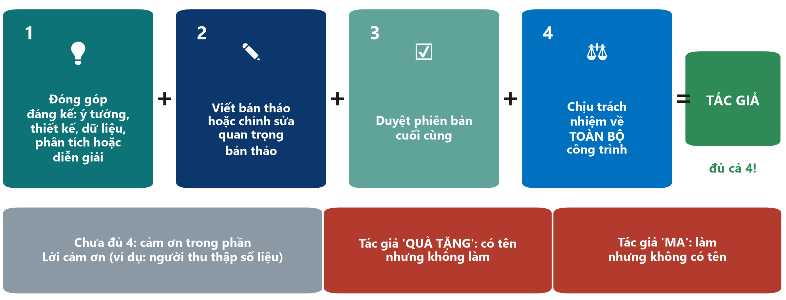{.neu-fig}

::: {.neu-takeaway}
**THÔNG ĐIỆP CHÍNH** Đủ cả bốn tiêu chí, cho mọi tác giả - thống nhất danh sách ngay từ đầu.
:::

::: {.notes}
Ý chính: Ủy ban Quốc tế các Biên tập viên Tạp chí Y khoa (ICMJE) yêu cầu đủ CẢ BỐN tiêu chí: 1) đóng góp đáng kể vào ý tưởng hoặc thiết kế, hoặc thu thập, phân tích hay diễn giải dữ liệu; 2) viết bản thảo hoặc chỉnh sửa quan trọng về nội dung; 3) duyệt phiên bản cuối cùng để công bố; 4) đồng ý chịu trách nhiệm về mọi khía cạnh của công trình.

Ai có đóng góp nhưng chưa đủ bốn tiêu chí được ghi trong Lời cảm ơn (người thu thập số liệu, dược sĩ kiểm tra tuân thủ, trưởng khoa hỗ trợ).

Tác giả 'quà tặng': tên được thêm vì thâm niên hay quan hệ. Tác giả 'ma': người thực sự làm - thường là người trẻ hoặc người viết thuê - nhưng không có tên. Cả hai đều là sai phạm.

Ví dụ xuyên suốt: Bài 2 được công bố 'thay mặt' một nhóm nghiên cứu; các thành viên được liệt kê trong Lời cảm ơn - cách ghi công đúng cho một mạng lưới lớn.

Hỏi: chỉ thu thập số liệu - có đủ để đứng tên tác giả không? Đáp án: không, nếu thiếu tiêu chí 2, 3 và 4.

Mẹo: thống nhất bằng văn bản danh sách và thứ tự tác giả từ giai đoạn đề cương và xem lại trước khi nộp bài.
:::

## Xung đột lợi ích và nguồn tài trợ: khai báo tất cả

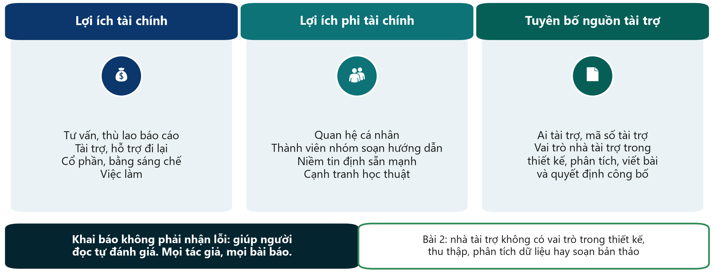{.neu-fig}

::: {.neu-takeaway}
**THÔNG ĐIỆP CHÍNH** Lợi ích được khai báo là thông tin; lợi ích bị che giấu là bê bối.
:::

::: {.notes}
Ý chính: xung đột lợi ích là bất cứ điều gì có thể bị xem là ảnh hưởng đến nhận định của bạn - tài chính hoặc phi tài chính. Có xung đột lợi ích là chuyện thường gặp và không sai; che giấu mới là sai.

Tài chính: tư vấn, thù lao báo cáo, tài trợ, hỗ trợ đi lại, cổ phần, bằng sáng chế, việc làm. Phi tài chính: quan hệ cá nhân, tham gia nhóm soạn hướng dẫn, niềm tin định sẵn mạnh, cạnh tranh học thuật.

Mỗi tác giả điền mẫu khai báo của tạp chí (đa số dùng mẫu khai báo của ICMJE), thường cho 36 tháng gần nhất.

Tuyên bố tài trợ: ai tài trợ, mã số tài trợ, và vai trò của nhà tài trợ trong thiết kế, thu thập dữ liệu, phân tích, viết bài và quyết định công bố.

Ví dụ xuyên suốt: Bài 2 ghi rõ nhà tài trợ không có vai trò trong thiết kế, thu thập, phân tích dữ liệu hay soạn bản thảo - một yêu cầu của ICMJE thường bị quên (chú giải \#39). Bài 1 ghi kinh phí nội bộ của bệnh viện và không có xung đột lợi ích (trang 12).

Hỏi: năm ngoái một công ty dược tài trợ bạn đi hội nghị. Có khai báo khi viết bài về dịch truyền không? Đáp án: có nếu có thể bị xem là liên quan - khi nghi ngờ, hãy khai báo.
:::

## Chia sẻ dữ liệu: từ 'theo yêu cầu' đến mở

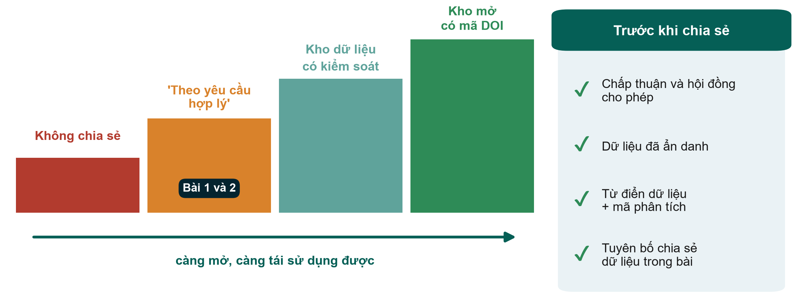{.neu-fig}

::: {.neu-takeaway}
**THÔNG ĐIỆP CHÍNH** Lên kế hoạch chia sẻ dữ liệu từ đề cương - phiếu chấp thuận phải cho phép.
:::

::: {.notes}
Ý chính: tạp chí ngày càng yêu cầu tuyên bố chia sẻ dữ liệu; ICMJE bắt buộc với thử nghiệm lâm sàng, và thử nghiệm phải mô tả kế hoạch chia sẻ dữ liệu khi đăng ký.

Các bậc: không chia sẻ; 'có thể cung cấp theo yêu cầu hợp lý' (cam kết yếu nhất - cả hai bài đều dùng, trang 12 và 8); kho dữ liệu có kiểm soát (nhà nghiên cứu nộp đơn xin); kho mở có mã DOI (cho dữ liệu đã ẩn danh hoàn toàn).

Trước khi chia sẻ: phiếu chấp thuận và phê duyệt đạo đức phải cho phép, dữ liệu đã ẩn danh, và chia sẻ kèm từ điển dữ liệu và mã phân tích để người khác dùng được.

Liên hệ Buổi 5: từ điển dữ liệu sạch là điều làm cho dữ liệu chia sẻ dùng được.

Hỏi: hôm nay cần viết gì trong phiếu chấp thuận để ngày mai dữ liệu có thể được chia sẻ? Đáp án: một câu xin phép chia sẻ dữ liệu đã ẩn danh cho các nghiên cứu sau này.
:::

## AI trong nghiên cứu và viết bài: điều gì được phép

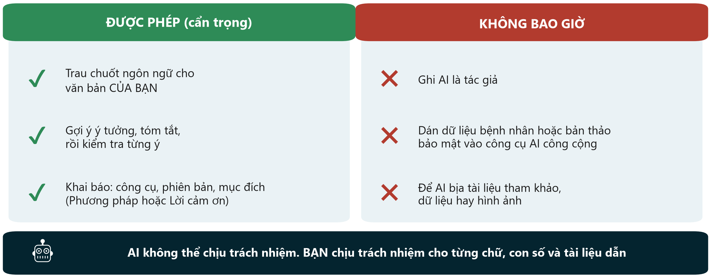{.neu-fig}

::: {.neu-takeaway}
**THÔNG ĐIỆP CHÍNH** Dùng AI như một trợ lý mới: kiểm tra mọi thứ, khai báo, giữ dữ liệu bệnh nhân bên ngoài.
:::

::: {.notes}
Ý chính - quan điểm hiện nay của ICMJE và COPE (Ủy ban Đạo đức Xuất bản): công cụ AI không thể là tác giả, vì không thể nhận trách nhiệm về công trình. Tác giả dùng AI phải khai báo - hỗ trợ viết thường ghi ở Lời cảm ơn, dùng trong thu thập, phân tích dữ liệu hay tạo hình ghi ở phần Phương pháp - và vẫn chịu hoàn toàn trách nhiệm về từng chữ, con số và tài liệu tham khảo, kể cả phần do công cụ tạo ra.

Không bao giờ dán dữ liệu nhận diện được người bệnh, hoặc bản thảo bạn đang phản biện, vào công cụ AI công cộng: vi phạm bảo mật, và người phản biện có nghĩa vụ giữ bí mật bản thảo.

Công cụ AI có thể bịa ra tài liệu tham khảo trông như thật. Kiểm tra từng trích dẫn trên PubMed.

Hình ảnh: hình do AI tạo hoặc chỉnh sửa không được dùng làm dữ liệu.

Luôn đọc chính sách AI trong Hướng dẫn tác giả của tạp chí dự kiến - chính sách thay đổi liên tục.

Hỏi: một đồng nghiệp nhờ chatbot 'viết phần bàn luận' rồi nộp mà không đọc. Vi phạm ô KHÔNG BAO GIỜ nào? Đáp án: tài liệu tham khảo có thể bị bịa, văn bản không ai chịu trách nhiệm - và không khai báo.
:::

## Tình huống liêm chính: xanh, vàng hay đỏ?

::: {.neu-banner style="--c:#6C3483"}
CÂU HỎI NHANH · 5 phút
:::

:::: {.columns}
::: {.column width="60%"}
::: {.neu-activity-steps style="--c:#6C3483"}
1. Đọc tình huống trên màn hình hoặc trong tài liệu phát tay (6 tình huống)
2. Mỗi nhóm giơ thẻ XANH (ổn), VÀNG (chỉ ổn nếu sửa hoặc khai báo) hoặc ĐỎ (sai phạm)
3. Giảng viên mời một nhóm giải thích màu đã chọn
4. Làm 3 tình huống cùng nhau; phần còn lại trong tài liệu
:::
:::
::: {.column width="40%"}
::: {.neu-side .plain style="--c:#6C3483"}
Ví dụ

- Một đồng nghiệp cho mượn máy siêu âm và đề nghị được đứng tên tác giả.
- Bạn chọn màu gì?
:::
:::
::::

::: {.neu-output style="--c:#6C3483"}
**SẢN PHẨM** Mỗi học viên gọi tên được FFP, tác giả 'quà tặng'/'ma' và quy tắc dùng AI
:::

::: {.notes}
CÂU HỎI NHANH (0:55-1:00). Tình huống và đáp án: Practicals/s7\_exercises.md (Phần A) và Solutions/s7\_solutions.md.

Chọn ba: 1 (dữ liệu thiếu 'điền theo trí nhớ' - ĐỎ, bịa đặt), 3 (trưởng khoa đứng tác giả cuối mà không đóng góp - ĐỎ, tác giả quà tặng, đề nghị ghi Lời cảm ơn), 4 (dùng AI sửa tiếng Anh, có kiểm tra và khai báo - XANH; cũng chatbot đó nhưng được đưa bảng dữ liệu bệnh nhân - ĐỎ).

Ví dụ trên slide: cho mượn thiết bị không phải là quyền tác giả - VÀNG/ĐỎ: cảm ơn trong Lời cảm ơn.

Tổ chức: thẻ hoặc giấy màu trên mỗi bàn; nếu không có, giơ ngón tay - 1 = xanh, 2 = vàng, 3 = đỏ.

Nếu các nhóm bất đồng, đó chính là lúc dạy - mời mỗi bên nêu một lý do.
:::

## Xây dựng đề cương 7: đạo đức, đăng ký, khả thi, kế hoạch công bố

::: {.neu-banner style="--c:#055F56"}
XÂY DỰNG ĐỀ CƯƠNG · 15 phút
:::

:::: {.columns}
::: {.column width="60%"}
::: {.neu-activity-steps style="--c:#055F56"}
1. Ai chấp thuận trong nghiên cứu của bạn? Dùng sơ đồ ICU (5 phút)
2. Đăng ký: có cần? ở đâu? Tệp khóa để ở đâu?
3. Khả thi: rủi ro lớn nhất và một cách khắc phục (3 phút)
4. Kế hoạch công bố: tạp chí, hướng dẫn, tác giả + CRediT (5 phút)
5. Tiêu đề tạm từ PICO (2 phút)
:::
:::
::: {.column width="40%"}
::: {.neu-side .plain style="--c:#055F56"}
Phiếu bài tập

- Practicals/s7\_exercises.md, Phần B
- Slide 5 và 6 cho thứ Bảy tuần sau
- Hoàn thiện ở nhà trong tuần
:::
:::
::::

::: {.neu-output style="--c:#055F56"}
**SẢN PHẨM** Bản nháp Đề cương Phần 4; dàn ý slide 5-6 của bài trình bày
:::

::: {.notes}
XÂY DỰNG ĐỀ CƯƠNG 7 (1:00-1:15). Nhắc to từng mốc thời gian.

Đi quanh các bàn. Vấn đề thường gặp: (1) 'sẽ xin chấp thuận' mà không nói ai, khi nào, thế nào - hướng theo sơ đồ ICU; (2) nghiên cứu hồi cứu hồ sơ cho rằng không cần hội đồng - sai, hội đồng quyết định và có thể miễn chấp thuận; (3) số bệnh nhân lấy từ tính cỡ mẫu thay vì từ số nhập viện của khoa; (4) chọn CONSORT cho đề cương quan sát.

Tạp chí và bảng kiểm EQUATOR sẽ được kiểm tra lại ở 8.2 thứ Bảy tuần sau - hôm nay trả lời tạm là được.

Nhắc: thứ Bảy tuần sau mỗi nhóm trình bày (6 phút, 6 slide) - slide 5 (đạo đức & khả thi) và 6 (kế hoạch công bố) lấy từ phiếu này.
:::

## Giải lao

::: {.neu-banner style="--c:#8A99A3"}
GIẢI LAO · 15 phút
:::

:::: {.columns}
::: {.column width="60%"}
::: {.neu-activity-steps style="--c:#8A99A3"}
1. Nhận gói kết quả FLUID-ICU của nhóm
2. Mở mẫu bản thảo (hoặc dùng giấy)
3. Phân công ai viết Phương pháp, ai viết Kết quả
4. Quay lại đúng 1:30
:::
:::
::: {.column width="40%"}
::: {.neu-side .plain style="--c:#8A99A3"}
Sau giải lao

- 7.3 Viết bài báo (35 phút)
- Thực hành bản thảo 1 (50 phút)
:::
:::
::::

::: {.notes}
GIẢI LAO (1:15-1:30).

Trong giờ giải lao: đặt một gói kết quả in trên mỗi bàn (Q1 ở bàn 1 ... Q5 ở bàn 5) và phiếu bài tập s7 (Phần C, hướng dẫn thực hành).

Tranh thủ ghé những nhóm chưa nói được kết quả chính trong phần ôn tập.
:::

## 7.3  \|  35 phút

:::: {.neu-statement}
::: {.neu-big}
Viết bài báo (I): Phương pháp và Kết quả
:::

::: {.neu-sub}
Viết những gì đã làm và đã thấy - không hơn
:::
::::

::: {.notes}
PHẦN 7.3 (1:30-2:05). Mười slide: thứ tự viết, Phương pháp, ví dụ mẫu Phương pháp từ FLUID-ICU, Kết quả, ví dụ mẫu Kết quả, bảng, STROBE, và 3 phút kiểm tra.

Mọi ví dụ nay lấy từ bộ dữ liệu của khóa học (Q1, câu hỏi chính) hoặc từ hai bài báo.

Nhịp: 3 phút mỗi slide. Hai ví dụ mẫu là trọng tâm - đọc chậm cùng cả lớp.
:::

## Viết theo thứ tự khác với thứ tự người đọc

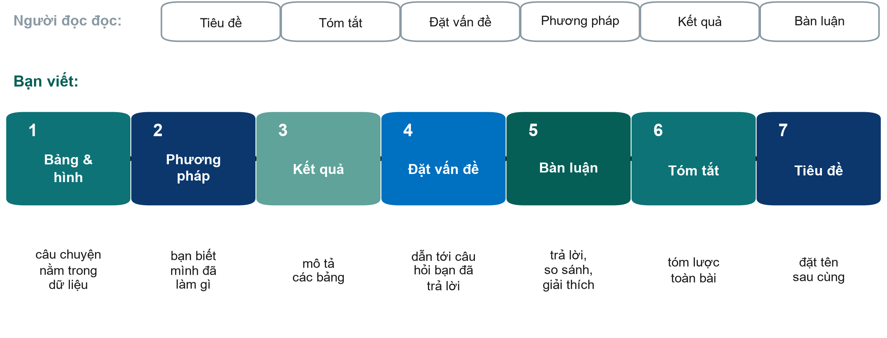{.neu-fig}

::: {.neu-takeaway}
**THÔNG ĐIỆP CHÍNH** Bắt đầu từ các bảng; viết tiêu đề sau cùng.
:::

::: {.notes}
Ý chính: người đọc đi từ tiêu đề - tóm tắt - đặt vấn đề - phương pháp - kết quả - bàn luận. Người viết thì không nên. Hãy bắt đầu từ bằng chứng: soạn bảng và hình (câu chuyện nằm trong dữ liệu), rồi Phương pháp (bạn biết mình đã làm gì - có thể soạn từ đề cương ngay cả trước khi có dữ liệu), rồi Kết quả (mô tả các bảng), rồi Đặt vấn đề (dẫn tới đúng câu hỏi bạn đã trả lời), rồi Bàn luận, và chỉ sau đó mới viết tóm tắt và tiêu đề.

Vì sao hiệu quả: mỗi phần được viết từ thứ đã có sẵn, còn tóm tắt và tiêu đề tóm lược một bài đã xong - nên không thể hứa hẹn nhiều hơn những gì bài báo có.

Quan niệm sai: 'phải viết xong phần đặt vấn đề mới bắt đầu được'. Nhiều người viết lần đầu bị tắc ở phần đặt vấn đề hàng tháng trời.

Hỏi: phần nào trong đề cương của bạn đã có thể thành phần Phương pháp của bài báo? Đáp án: Phần 2 và 3 - thiết kế, đối tượng, biến số, kế hoạch phân tích.
:::

## Phương pháp: đủ chi tiết để người khác làm lại

::: {.neu-intro}
Nếu đồng nghiệp không làm lại được nghiên cứu từ phần Phương pháp, hãy thêm chi tiết.
:::

:::: {.neu-cards style="--n:4"}
::: {.neu-card .plain style="--c:#0D7377"}
[Ai và ở đâu]{.neu-card-title}

- Thiết kế, bối cảnh, thời gian
- Tiêu chuẩn chọn
- Số phê duyệt, chấp thuận
- Số đăng ký
:::
::: {.neu-card .plain style="--c:#0B376C"}
[Đã làm gì]{.neu-card-title}

- Mô tả đầy đủ can thiệp
- Định nghĩa các biến
- B1: tập huấn, dược sĩ kiểm tra hằng ngày
:::
::: {.neu-card .plain style="--c:#5FA39B"}
[Kết cục và cỡ mẫu]{.neu-card-title}

- MỘT kết cục chính: đo thế nào, khi nào
- Cỡ mẫu: giả định + nguồn
- B2: không nêu cỡ mẫu
:::
::: {.neu-card .plain style="--c:#0070C0"}
[Phân tích thống kê]{.neu-card-title}

- Mỗi so sánh có một kiểm định
- Ước lượng khớp với kiểm định
- Dữ liệu thiếu, so sánh bội
- Phần mềm và phiên bản
:::
::::

::: {.neu-takeaway}
**THÔNG ĐIỆP CHÍNH** Đoạn phân tích thống kê nêu phương pháp cho mọi so sánh được báo cáo.
:::

::: {.notes}
Ý chính: Phương pháp = đủ chi tiết để lặp lại nghiên cứu, theo thứ tự của bảng kiểm báo cáo (CONSORT hoặc STROBE).

Thực hành tốt: Bài 1 đặt tên hội đồng đạo đức, số phê duyệt, quy trình chấp thuận và nguồn tài trợ ngay trong Phương pháp (chú giải \#13); mô tả can thiệp đủ để làm lại - tập huấn nhân viên, dược sĩ kiểm tra hằng ngày, bảng pha loãng thuốc trong phụ lục (\#16); tách một kết cục chính khỏi kết cục phụ và an toàn (\#17); ghi phần mềm và phiên bản (\#21). Bài 2 định nghĩa rõ dịch vào và dịch ra nào tạo nên cân bằng dịch (\#13) và dẫn bài mô tả đoàn hệ thay vì viết lại (\#12).

Cần sửa: Bài 1 là 'thí điểm' nhưng tính cỡ mẫu theo hiệu quả với giả định (70 so với 40 ml/kg) không đạt (\#18); nêu kiểm định Mann-Whitney nhưng báo cáo chênh lệch trung bình kèm KTC (\#19); khoảng 40 giá trị p phụ không nói gì về so sánh bội (\#20). Bài 2: 'caliper 0,1' của cái gì? Xử lý biến thiếu thế nào? Phân cụm theo gì? (\#15, \#17); không có câu về cỡ mẫu (\#19).

Đoạn phân tích thống kê: với mỗi so sánh - cách tóm tắt, kiểm định hoặc mô hình, số đo tác động kèm KTC 95%, cách xử lý dữ liệu thiếu và so sánh bội, và phần mềm.
:::

## Ví dụ mẫu: Phương pháp cho FLUID-ICU câu hỏi 1

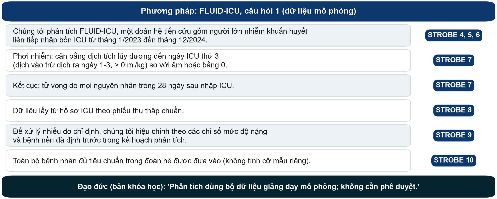{.neu-fig}

::: {.neu-takeaway}
**THÔNG ĐIỆP CHÍNH** Mỗi mục STROBE một câu - và nói rõ dữ liệu là mô phỏng.
:::

::: {.notes}
VÍ DỤ MẪU (bộ dữ liệu khóa học). Đọc từng câu và chỉ vào mục STROBE bên phải.

Mọi thông tin lấy từ gói kết quả Q1, mục 2: đoàn hệ tiến cứu đa trung tâm, 4 ICU, người lớn nhiễm khuẩn huyết liên tiếp, 1/2023 - 12/2024; phơi nhiễm = cân bằng tích lũy (vào trừ ra, ngày 1-3) \> 0 ml/kg; kết cục = tử vong trong 28 ngày sau nhập ICU.

STROBE 10 (cỡ mẫu): với một đoàn hệ cố định ta không bịa ra phép tính cỡ mẫu; chỉ nói đã đưa vào toàn bộ bệnh nhân đủ tiêu chuẩn.

Câu đạo đức là riêng của khóa học: FLUID-ICU là dữ liệu MÔ PHỎNG - mọi bản thảo phải nói rõ.

Hỏi: câu nào người đọc cần để lặp lại nghiên cứu? Đáp án: định nghĩa phơi nhiễm - cân bằng dịch được tính thế nào.
:::

## Ví dụ mẫu: đoạn phân tích thống kê

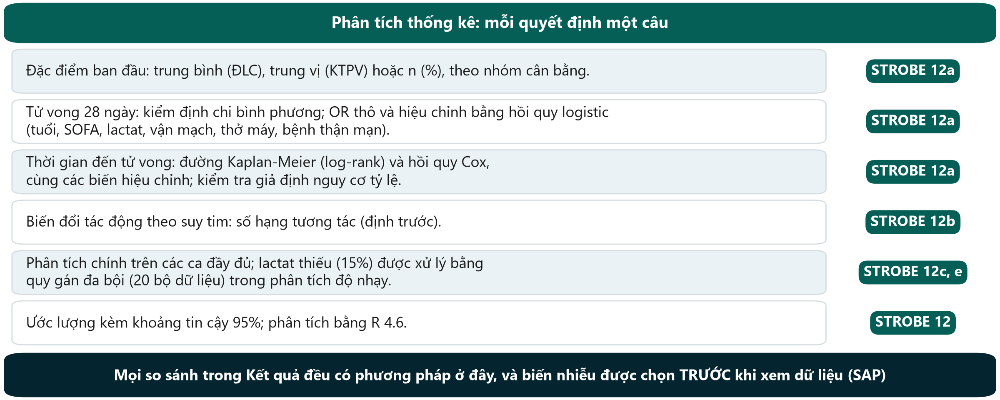{.neu-fig}

::: {.neu-takeaway}
**THÔNG ĐIỆP CHÍNH** Nêu phương pháp cho mọi so sánh được báo cáo - chọn trước khi xem dữ liệu.
:::

::: {.notes}
VÍ DỤ MẪU. Đây là mục STROBE 12 viết cho Q1 (gói kết quả Q1, mục 2 và 4-5).

Biến hiệu chỉnh: tuổi, SOFA, lactat, vận mạch, thở máy, bệnh thận mạn - định trước trong kế hoạch phân tích thống kê (Buổi 6), không chọn theo giá trị p.

Dữ liệu thiếu: lactat thiếu ở 93/620 (15,0%); phân tích chính trên ca đầy đủ (n = 527), quy gán đa bội (m = 20) là phân tích độ nhạy.

Biến đổi tác động: suy tim, định trước.

Quan niệm sai: 'đoạn thống kê là việc của nhà thống kê'. Người phản biện đọc nó trước tiên; mọi con số trong Kết quả phải truy được về một câu ở đây.
:::

## Kết quả: báo cáo, không bình luận

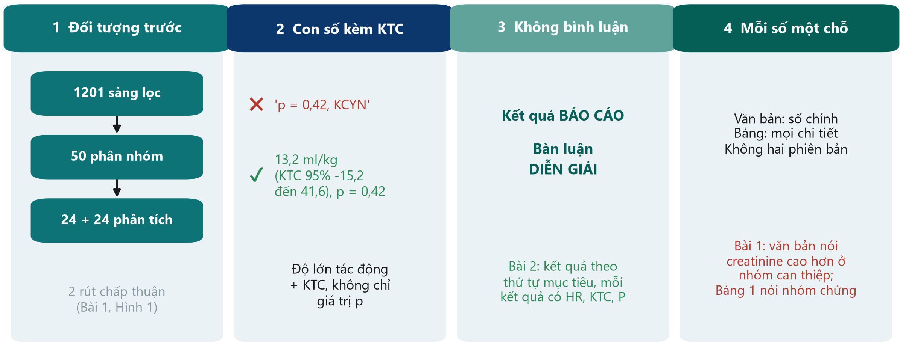{.neu-fig}

::: {.neu-takeaway}
**THÔNG ĐIỆP CHÍNH** Đối tượng trước, rồi mỗi kết cục là độ lớn tác động kèm KTC 95%.
:::

::: {.notes}
Bốn quy tắc. 1) Đối tượng trước tiên: bao nhiêu người được sàng lọc, đưa vào, phân tích và vì sao mất một số - kèm sơ đồ. Bài 1 có sơ đồ CONSORT trong bài chính (chú giải \#23, \#27); Bài 2 để trong phụ lục dù 79% sổ bộ bị loại (\#20).

2) Con số kèm khoảng tin cậy, không phải 'p = 0,42, KCYN'. Phân tích 48 trên 50 bệnh nhân đã phân nhóm là phân tích theo ý định điều trị có điều chỉnh và nên gọi đúng tên (\#24).

3) Không bình luận trong phần Kết quả. Bài 2 báo cáo kết quả theo thứ tự mục tiêu, mỗi kết quả có HR, KTC và P, không bình luận (\#25).

4) Mỗi con số một chỗ: số chính trong văn bản, chi tiết trong bảng - và phải khớp nhau. Văn bản Bài 1 nói creatinine cao hơn ở nhóm can thiệp; Bảng 1 cho thấy ngược lại (\#25). Mâu thuẫn văn bản - bảng là lý do bị từ chối kinh điển.

Hỏi: ai trong nhóm sẽ đối chiếu từng con số trong văn bản với bảng trước khi nộp? Chỉ định ngay bây giờ.
:::

## Ví dụ mẫu: Kết quả cho FLUID-ICU câu hỏi 1

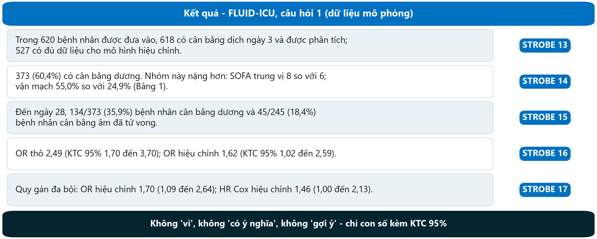{.neu-fig}

::: {.neu-takeaway}
**THÔNG ĐIỆP CHÍNH** Đối tượng, Bảng 1, số liệu kết cục, ước lượng thô và hiệu chỉnh - theo thứ tự đó.
:::

::: {.notes}
VÍ DỤ MẪU. Mọi con số lấy từ Course/Data/key\_results.md (dữ liệu MÔ PHỎNG):

Luồng: 620 đưa vào -\> 618 có cân bằng ngày 3 -\> 527 trong mô hình hiệu chỉnh ca đầy đủ (91 thiếu lactat hoặc tuổi).

Cân bằng dương 373/618 (60,4%); SOFA trung vị 8 (6 đến 10) so với 6 (4 đến 8); vận mạch 205/373 (55,0%) so với 61/245 (24,9%).

Tử vong: 134/373 (35,9%) so với 45/245 (18,4%). OR thô 2,49 (1,70 đến 3,70); OR hiệu chỉnh 1,62 (1,02 đến 2,59), p 0,044. Độ nhạy: quy gán đa bội OR 1,70 (1,09 đến 2,64); HR Cox hiệu chỉnh 1,46 (1,00 đến 2,13).

Chỉ ra điều KHÔNG có trong đoạn: không 'vì', không 'có ý nghĩa', không giải thích vì sao OR giảm - đó là việc của Bàn luận thứ Bảy tuần sau.

Hỏi: câu thô-VÀ-hiệu chỉnh đáp ứng mục STROBE nào? Đáp án: 16.
:::

## Bảng và hình tự đứng được

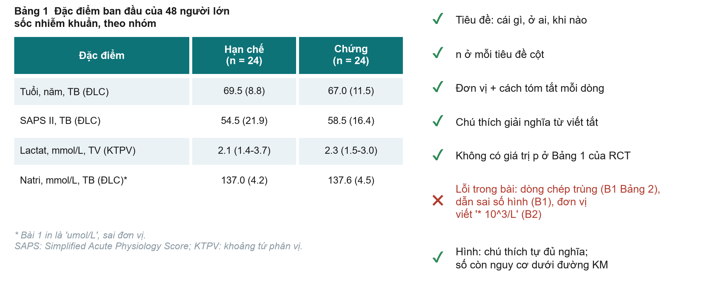{.neu-fig}

::: {.neu-takeaway}
**THÔNG ĐIỆP CHÍNH** Người đọc phải hiểu mỗi bảng mà không cần đọc văn bản.
:::

::: {.notes}
Ý chính: người phản biện và bác sĩ đọc bảng kỹ hơn văn bản. Bảng phải tự đứng được: tiêu đề nói cái gì, ở ai, khi nào; n ở mỗi tiêu đề cột; đơn vị và cách tóm tắt ở mỗi dòng; chú thích giải nghĩa viết tắt và dữ liệu thiếu.

Thực hành tốt: Bảng 1 Bài 1 có n mỗi cột, ĐLC hoặc KTPV mỗi dòng và không có giá trị p ban đầu - đúng cho thử nghiệm ngẫu nhiên (chú giải \#31). Bảng 1 Bài 2 thêm SMD và chú thích số bệnh nhân thiếu dữ liệu (\#30); hình trục thời gian có chú thích tự đủ nghĩa (\#21).

Lỗi cần tránh: natri và kali in đơn vị umol/L (đúng là mmol/L) ở Bài 1 (\#30); một dòng chép trùng ở Bảng 2 Bài 1 (\#32); dẫn sai số hình ở Bài 1 (\#28, \#41); tiêu đề bảng mơ hồ (\#34); đơn vị bạch cầu viết '\* 10\^3/L' ở Bài 2 (\#30). Đường Kaplan-Meier nên có số còn nguy cơ (Bài 2, \#31).

Liên hệ Buổi 5: quy tắc bảng đạt chuẩn công bố. Bảng 1 FLUID-ICU trong gói kết quả đã theo các quy tắc này - hãy đối chiếu trong buổi thực hành.

Hỏi: bảng có tiêu đề 'Kết quả' sai ở đâu? Đáp án: không nói gì về cái gì, ở ai, khi nào.
:::

## Ví dụ mẫu: Bảng 1 FLUID-ICU trong một câu

| Đặc điểm | Cân bằng âm (n = 245) | Cân bằng dương (n = 373) |
|:---|:---|:---|
| Tuổi, năm, trung bình | 64,6 | 61,4 |
| SOFA, trung vị (KTPV) | 6 (4 đến 8) | 8 (6 đến 10) |
| Vận mạch, n (%) | 61 (24,9%) | 205 (55,0%) |
| Thở máy, n (%) | 97 (39,6%) | 216 (57,9%) |
| Lactat, mmol/L, trung vị (KTPV) | 2,2 (1,4 đến 3,0) | 2,9 (1,9 đến 4,0) |
| Suy tim, n (%) | 54 (22,0%) | 43 (11,5%) |

::: {.neu-table-caption}
Dữ liệu MÔ PHỎNG (gói kết quả Q1, Bảng 1). Câu: 'Bệnh nhân cân bằng dương nặng hơn lúc ban đầu.'
:::

::: {.notes}
VÍ DỤ MẪU: từ Bảng 1 đến một câu Kết quả (STROBE 14).

Câu mẫu: 'Bệnh nhân cân bằng dương nặng hơn lúc ban đầu (SOFA trung vị 8 so với 6; vận mạch 55,0% so với 24,9%) và ít suy tim hơn (11,5% so với 22,0%).'

Ý chính: câu về Bảng 1 mô tả, không kiểm định - không cần giá trị p (Bảng 1 của nghiên cứu quan sát thường dùng SMD).

Suy tim thấp hơn ở nhóm dương vì bác sĩ truyền ít dịch cho bệnh nhân suy tim - ví dụ hay về việc quyết định điều trị định hình dữ liệu.

Bảng 1 đầy đủ, có các dòng dữ liệu thiếu, nằm trong mỗi gói kết quả.
:::

## STROBE cho bài báo FLUID-ICU: mục nào ở đâu

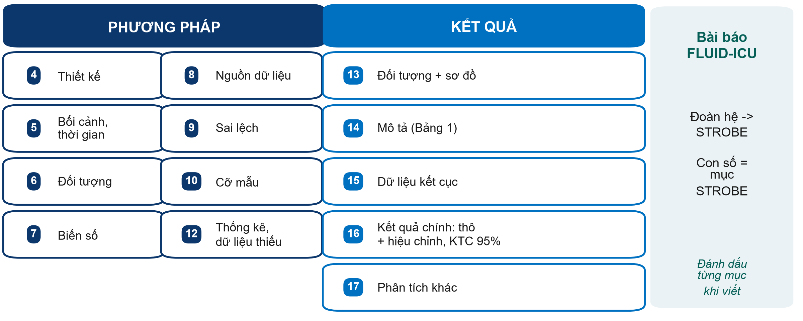{.neu-fig}

::: {.neu-takeaway}
**THÔNG ĐIỆP CHÍNH** Viết với bảng kiểm STROBE mở bên cạnh - đánh dấu từng mục khi viết.
:::

::: {.notes}
Ý chính: FLUID-ICU là đoàn hệ, nên bài báo theo STROBE (bản cho đoàn hệ). Các số trong ô là số mục STROBE của Phương pháp (4-12) và Kết quả (13-17).

Các mục hay bị quên: 9 (sai lệch - nói rõ cách xử lý nhiễu do chỉ định: hiệu chỉnh theo mức độ nặng); 10 (cỡ mẫu - với bộ dữ liệu cố định ghi 'đưa vào toàn bộ bệnh nhân đủ tiêu chuẩn trong đoàn hệ'); 12 (dữ liệu thiếu - xử lý lactat thiếu thế nào); 16 (báo cáo CẢ ước lượng thô và hiệu chỉnh, kèm các biến hiệu chỉnh).

Bảng kiểm đầy đủ có trong phiếu bài tập s7 và trên equator-network.org (trình diễn thứ Bảy tuần sau).

Hỏi: mục nào nói về Bảng 1? Đáp án: 14 (dữ liệu mô tả).
:::

## Kiểm tra: Phương pháp, Kết quả hay Bàn luận?

::: {.neu-banner style="--c:#6C3483"}
CÂU HỎI NHANH · 3 phút
:::

:::: {.columns}
::: {.column width="60%"}
::: {.neu-activity-steps style="--c:#6C3483"}
1. 'Chúng tôi dùng hồi quy logistic hiệu chỉnh theo SOFA và tuổi.'
2. 'Trong 640 bệnh nhân được sàng lọc, 600 được đưa vào.'
3. 'Điều này có thể do bệnh nặng hơn được truyền nhiều dịch hơn.'
4. 'Lactat thiếu ở 15% và được quy gán.'
5. 'Tử vong 28 ngày cao hơn khi cân bằng dương (OR ..., KTC 95% ...).'
:::
:::
::: {.column width="40%"}
::: {.neu-side .plain style="--c:#6C3483"}
Đáp án

- 1 Phương pháp
- 2 Kết quả (đối tượng)
- 3 Bàn luận (giải thích)
- 4 Phương pháp (+ Kết quả: bao nhiêu)
- 5 Kết quả
:::
:::
::::

::: {.notes}
KIỂM TRA (2:02-2:05). Đọc từng câu; lớp hô P, K hoặc B.

Các con số ở câu 2, 4 và 5 là minh họa ('...'), không phải kết quả FLUID-ICU.

Câu 4 là bẫy: CÁCH xử lý dữ liệu thiếu thuộc Phương pháp; BAO NHIÊU bị thiếu thuộc Kết quả.

Câu 3 là lỗi kinh điển - một lời diễn giải lọt vào Kết quả. Chuyển nó sang Bàn luận.
:::

## Thực hành bản thảo 1  \|  50 phút

:::: {.neu-statement}
::: {.neu-big}
Viết Phương pháp và Kết quả
:::

::: {.neu-sub}
Khoảng 600 từ, Bảng 1 và một hình hoặc bảng - từ gói kết quả của nhóm
:::
::::

::: {.notes}
THỰC HÀNH BẢN THẢO 1 (2:05-2:55). Bộ dữ liệu khóa học. Mỗi nhóm viết Phương pháp và Kết quả cho bài báo FLUID-ICU của mình (Q1-Q5) từ gói kết quả.

Hướng dẫn cho học viên: Practicals/s7\_exercises.md, Phần C. Đoạn văn mẫu cho Q1: Solutions/s7\_solutions.md (KHÔNG phát trước buổi thực hành - chỉ chiếu các ví dụ mẫu trên slide).
:::

## Năm mươi phút, sáu người, một bản nháp

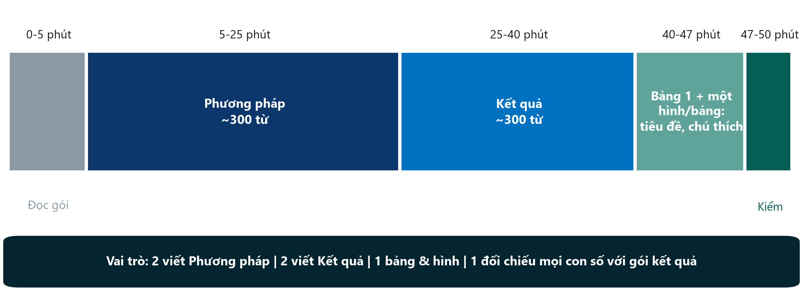{.neu-fig}

::: {.neu-takeaway}
**THÔNG ĐIỆP CHÍNH** Mọi con số trong bài phải lấy từ gói kết quả - không ai phải tự tính.
:::

::: {.notes}
Chiếu kế hoạch và phân vai trong 1 phút: hai người viết Phương pháp, hai người viết Kết quả, một người chuẩn bị Bảng 1 và một hình hoặc bảng (tiêu đề, tiêu đề cột có n, đơn vị, chú thích), và một 'người kiểm số' đối chiếu mọi con số trong bài với gói kết quả.

Ngân sách chữ: Phương pháp \~300 từ (thiết kế và bối cảnh, đối tượng, biến số, phân tích thống kê); Kết quả \~300 từ (đối tượng, Bảng 1 trong một câu, kết quả chính thô và hiệu chỉnh, một kết quả phụ hoặc phân tích độ nhạy).

Giảng viên đi quanh từ phút 5: kiểm tra mỗi phần Phương pháp có đoạn thống kê và mỗi phần Kết quả bắt đầu bằng đối tượng.
:::

## Thực hành bản thảo 1: soạn Phương pháp + Kết quả

::: {.neu-banner style="--c:#0D7377"}
LÀM VIỆC NHÓM · 50 phút
:::

:::: {.columns}
::: {.column width="60%"}
::: {.neu-activity-steps style="--c:#0D7377"}
1. 0-5: đọc gói kết quả; thống nhất kết quả chính trong một câu
2. 5-25: Phương pháp - thiết kế, bối cảnh, đối tượng, biến số, thống kê
3. 25-40: Kết quả - đối tượng, Bảng 1, kết quả chính (thô + hiệu chỉnh)
4. 40-47: Bảng 1 + một hình/bảng có tiêu đề và chú thích
5. 47-50: đánh dấu mục STROBE 4-17; kiểm tra từng con số
:::
:::
::: {.column width="40%"}
::: {.neu-side .plain style="--c:#0D7377"}
Dùng

- Gói kết quả (Q1-Q5)
- Mẫu bản thảo
- Ví dụ mẫu (slide)
- Mục STROBE 4-17
:::
:::
::::

::: {.neu-output style="--c:#0D7377"}
**SẢN PHẨM** Phương pháp + Kết quả (\~600 từ) + Bảng 1 + một hình/bảng, đã lưu và chia sẻ
:::

::: {.notes}
THỰC HÀNH (2:05-2:55). Bật đồng hồ 50 phút; nhắc từng giai đoạn.

Đi quanh theo thứ tự cố định (bàn 1 đến 5) để mỗi nhóm được ghé hai lần.

Câu gợi ý: 'Đoạn phân tích thống kê ở đâu?' 'Đã hiệu chỉnh theo gì?' 'Đối tượng nghiên cứu ở đâu?' 'Có con số nào không có khoảng tin cậy?' 'Có tính từ ("có ý nghĩa", "mạnh") nào lẽ ra phải là con số?' 'Có lời diễn giải nào trong phần Kết quả không?'

Nhóm Q4 (lactat): bảo đảm báo cáo CẢ ước lượng phân tích ca đầy đủ và quy gán. Nhóm Q5 (thời gian nằm ICU): trung vị và KTPV, không dùng trung bình. Nhóm Q3: số ngày không thở máy bị lệch - kiểm tra cách tóm tắt.

Lúc 2:52 đề nghị mỗi nhóm lưu và gửi bản nháp (email hoặc thư mục chung) - đây là tệp khởi đầu cho thực hành 2 thứ Bảy tuần sau.
:::

## Từ khóa của Buổi 7

| Thuật ngữ | Nói đơn giản |
|:---|:---|
| Chấp thuận trì hoãn | Cấp cứu: đưa vào trước, xin chấp thuận sớm nhất có thể (hội đồng đã duyệt) |
| Đăng ký | Hồ sơ công khai về nghiên cứu trước bệnh nhân 1 (bắt buộc với thử nghiệm) |
| FFP | Bịa đặt, xuyên tạc, đạo văn - sai phạm nghiên cứu |
| Tiêu chí ICMJE / CRediT | Ai được đứng tên tác giả / ai làm gì |
| Xung đột lợi ích | Điều có thể bị xem là ảnh hưởng đến nhận định - hãy khai báo |
| STROBE | Bảng kiểm báo cáo nghiên cứu quan sát: Phương pháp mục 4-12, Kết quả 13-17 |

::: {.neu-table-caption}
Bảng thuật ngữ đầy đủ (Anh-Việt): Course/References/
:::

::: {.notes}
Đọc sáu thuật ngữ cùng cả lớp - mời một người giải thích bằng lời của mình trước khi đọc cột bên phải.

Đây cũng là những từ dễ xuất hiện nhất trong bài kiểm tra cuối khóa thứ Bảy tuần sau.
:::

## Tổng kết và bài tập về nhà cho thứ Bảy tuần sau

::: {.neu-banner style="--c:#1F5C7A"}
THẢO LUẬN · 5 phút
:::

:::: {.columns}
::: {.column width="60%"}
::: {.neu-activity-steps style="--c:#1F5C7A"}
1. Ba thông điệp mang về (bên cạnh danh sách này)
2. Trong tuần: hoàn thiện Đề cương Phần 4 và 6 slide trình bày
3. Trong tuần: đọc to bản nháp Phương pháp + Kết quả một lần
4. Thứ Bảy tuần sau: Đặt vấn đề, Bàn luận, Tóm tắt, Tiêu đề - rồi trình bày
:::
:::
::: {.column width="40%"}
::: {.neu-side .plain style="--c:#1F5C7A"}
Mang về

- Chưa phê duyệt thì không có dữ liệu - kể cả 'vài ca'
- Mọi tác giả đủ bốn tiêu chí; khai báo mọi lợi ích
- Phương pháp = đã làm gì; Kết quả = con số kèm KTC, không bình luận
:::
:::
::::

::: {.neu-output style="--c:#1F5C7A"}
**SẢN PHẨM** Slide đề cương sẵn sàng; bản nháp Phương pháp + Kết quả đã lưu
:::

::: {.notes}
TỔNG KẾT (2:55-3:00). Đọc ba thông điệp; mời một người thêm thông điệp thứ tư.

Bài về nhà: slide đề cương (hướng dẫn trình bày: 6 phút, 6 slide) và đọc lại bản nháp. Thứ Bảy tuần sau bắt đầu bằng 5 phút ôn tập và đi thẳng vào phần viết.
:::

## Slide bổ sung  \|  Buổi 7

:::: {.neu-statement}
::: {.neu-big}
Slide bổ sung - Buổi 7
:::

::: {.neu-sub}
Chỉ dùng khi còn thời gian, hoặc để tự học
:::
::::

::: {.notes}
EXTRA: các slide sau mục này là tùy chọn. Dùng khi lớp đi nhanh hơn dự kiến, hoặc giới thiệu cho học viên tự học.
:::

## IMRaD: hình đồng hồ cát của mọi bài báo

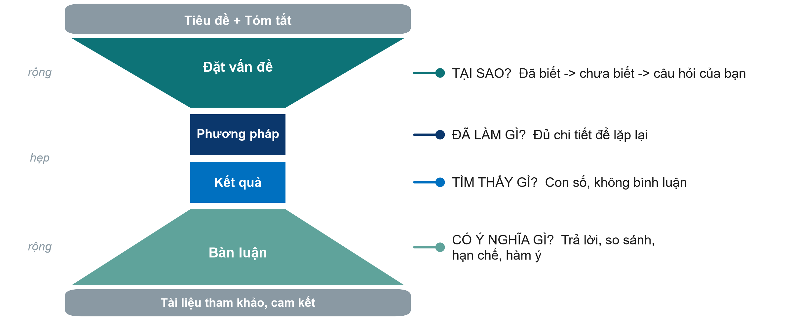{.neu-fig}

::: {.neu-takeaway}
**THÔNG ĐIỆP CHÍNH** Đặt vấn đề thu hẹp đến câu hỏi; Bàn luận mở rộng trở lại thực hành.
:::

::: {.notes}
EXTRA: Ý chính: hầu hết bài báo lâm sàng theo cấu trúc IMRaD - Đặt vấn đề, Phương pháp, Kết quả, Bàn luận - mở đầu bằng tiêu đề và tóm tắt, kết thúc bằng tài liệu tham khảo và các cam kết.

Đặt vấn đề: từ điều đã biết, đến điều chưa biết, đến câu hỏi của bạn (hình phễu). Phương pháp: đủ chi tiết để người khác lặp lại. Kết quả: con số, không bình luận. Bàn luận: trả lời câu hỏi trước, so sánh với nghiên cứu khác, nêu hạn chế, rồi mới nói ý nghĩa.

Ví dụ xuyên suốt: phần đặt vấn đề của Bài 1 là một hình phễu mẫu mực trong ba đoạn (trang 2-3), kết thúc bằng mục tiêu chính là đánh giá cân bằng dịch sau 5 ngày đầu. Phần Bàn luận mở đầu bằng câu trả lời cho câu hỏi đó (trang 8).

Mẹo cho bài thẩm định sau giải lao: đồng hồ cát chỉ chỗ cần tìm - PICO ở đoạn cuối Đặt vấn đề, thiết kế và kết cục ở Phương pháp, tác dụng chính ở đoạn đầu Kết quả, hạn chế ở gần cuối Bàn luận.

Hỏi: bạn đọc phần nào trước? Nhiều người nói tóm tắt và kết luận - không sao, nhưng câu trả lời cho 'có tin được không?' nằm ở phần Phương pháp.
:::

## CRediT: ghi rõ ai làm gì

::: {.neu-intro}
Tạp chí ngày nay yêu cầu ghi vai trò từng tác giả theo thuật ngữ chuẩn.
:::

:::: {.neu-cards style="--n:3"}
::: {.neu-card .plain style="--c:#0D7377"}
[14 vai trò CRediT]{.neu-card-title}

- Conceptualization, Methodology
- Investigation, Formal analysis
- Writing - original draft
- Writing - review & editing
- Supervision, Funding ...
:::
::: {.neu-card .plain style="--c:#0B376C"}
[Bài 1 đã làm]{.neu-card-title}

- NB: Writing - original draft
- CS: Methodology, Formal analysis
- SDB: Conceptualization, Supervision, Funding acquisition
:::
::: {.neu-card .plain style="--c:#5FA39B"}
[Nhóm bạn, hôm nay]{.neu-card-title}

- Thống nhất danh sách tác giả
- Ghi vai trò từng người
- Xem lại trước khi nộp
:::
::::

::: {.neu-takeaway}
**THÔNG ĐIỆP CHÍNH** Vai trò minh bạch ngăn tác giả 'quà tặng' và tác giả 'ma'.
:::

::: {.notes}
EXTRA: CRediT (Contributor Roles Taxonomy - phân loại vai trò người đóng góp) gồm 14 vai trò chuẩn, giữ nguyên tên tiếng Anh khi nộp bài. Nó không thay thế tiêu chí ICMJE mà làm cho đóng góp của mỗi người được nhìn thấy.

Ví dụ xuyên suốt: Bài 1 (trang 12) có tuyên bố CRediT - VD nhà thống kê được ghi công Methodology và Formal analysis. Bài 2 (trang 8) mô tả đóng góp bằng văn xuôi và ghi tất cả tác giả đã đọc và duyệt bản thảo cuối - chấp nhận được, nhưng CRediT là định dạng đa số tạp chí đang yêu cầu.

Tổ chức: đề nghị mỗi nhóm ghi vào đề cương ai là tác giả thứ nhất và ai làm gì. Điều này tránh những cuộc nói chuyện khó khăn về sau.

Hỏi: trong bệnh viện, ai thường đứng tên tác giả cuối, vì sao? Đáp án: người hướng dẫn cấp cao - hợp lệ nếu đủ bốn tiêu chí, là 'quà tặng' nếu không.
:::
