# Buổi 8 · Công bố: hoàn thiện bài báo, gửi đăng, trình bày

## Tuần 8 · Thứ Bảy

- Ôn tập (5 phút)
- 8.1  Viết bài báo (II): Đặt vấn đề, Bàn luận, Tóm tắt, Tiêu đề
- Thực hành bản thảo 2: hoàn thiện bản nháp
- 8.2  Công bố: từ bảng kiểm đến bản in thử
- 8.3  Làm người phản biện: thẩm định Bài 1 và 2
- Các nhóm trình bày: đề cương + kế hoạch công bố

::: {.notes}
BUỔI 8 (0:00). Tuần 8, Thứ Bảy: buổi cuối cùng. Hôm nay bản thảo FLUID-ICU trở thành bản nháp hoàn chỉnh, chúng ta theo một bài báo từ lúc nộp đến khi đăng, luyện phản biện, và mỗi nhóm trình bày đề cương của mình.

Phần bế mạc (kiểm tra cuối khóa, đánh giá, trao đổi bản thảo để phản biện) là 15 phút cuối và có slide riêng.

Trước khi bắt đầu: cả năm bài trình bày trên MỘT máy; bản nháp thực hành 1 của mỗi nhóm đã mở.
:::

## Ôn tập: ba câu hỏi từ Buổi 7

::: {.neu-banner style="--c:#6C3483"}
CÂU HỎI NHANH · 5 phút
:::

:::: {.columns}
::: {.column width="60%"}
::: {.neu-activity-steps style="--c:#6C3483"}
- Ai chấp thuận cho bệnh nhân sốc nhiễm khuẩn đang an thần?
- Mục STROBE nào yêu cầu ước lượng thô VÀ hiệu chỉnh?
- Câu 'có thể do bệnh nặng hơn được truyền nhiều dịch hơn' thuộc phần nào?
:::
:::
::: {.column width="40%"}
::: {.neu-side .plain style="--c:#6C3483"}
Đáp án

- Người đại diện hợp pháp (hoặc chấp thuận trì hoãn nếu được duyệt)
- Mục 16 (kết quả chính)
- Bàn luận, không phải Kết quả
:::
:::
::::

::: {.neu-output style="--c:#6C3483"}
**SẢN PHẨM** Mọi người trở lại tinh thần viết
:::

::: {.notes}
ÔN TẬP (0:00-0:05). Giơ tay nhanh; mở đáp án.

Câu 3 dẫn vào 8.1: Bàn luận là nơi dành cho diễn giải.
:::

## 8.1  \|  25 phút

:::: {.neu-statement}
::: {.neu-big}
Viết bài báo (II)
:::

::: {.neu-sub}
Đặt vấn đề, Bàn luận, Tóm tắt và Tiêu đề, theo thứ tự đó
:::
::::

::: {.notes}
PHẦN 8.1 (0:05-0:30). Mười một slide với ba ví dụ mẫu từ FLUID-ICU Q1 và 2 phút kiểm tra.

Thứ tự theo thứ tự viết thứ Bảy tuần trước: Đặt vấn đề, Bàn luận, rồi Tóm tắt và Tiêu đề sau cùng.

Nhịp: khoảng 2 phút mỗi slide; chậm lại ở ví dụ Bàn luận.
:::

## Đặt vấn đề: hình phễu trong ba đoạn

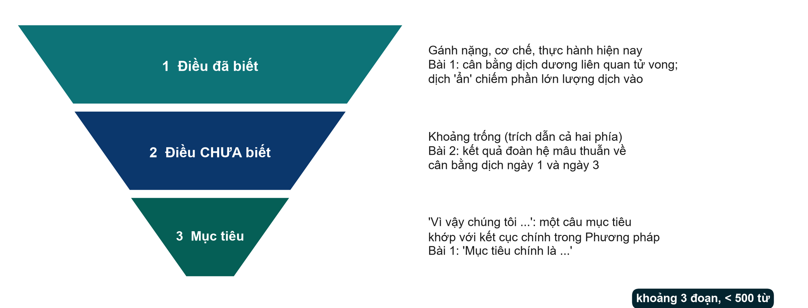{.neu-fig}

::: {.neu-takeaway}
**THÔNG ĐIỆP CHÍNH** Đã biết, chưa biết, mục tiêu. Mục tiêu khớp với kết cục chính.
:::

::: {.notes}
Ý chính: phần đặt vấn đề là một cái phễu, không phải bài tổng quan y văn. Đoạn 1: điều đã biết (gánh nặng, cơ chế, thực hành hiện nay). Đoạn 2: điều chưa biết: khoảng trống, tốt nhất có dẫn chứng mâu thuẫn của cả hai phía. Đoạn 3: 'Vì vậy chúng tôi nhằm ...', một câu mục tiêu khớp với kết cục chính trong phần Phương pháp.

Bài 1 là mẫu (chú giải \#10-\#12): đã biết (cân bằng dịch dương liên quan tử vong; dịch ẩn chiếm phần lớn lượng vào), chưa biết (các thử nghiệm trước chỉ nhắm dịch hồi sức), mục tiêu (mục tiêu chính = cân bằng dịch sau 5 ngày), tất cả dưới 500 từ (trang 2-3).

Đoạn 2 của Bài 2 xác định khoảng trống bằng cách dẫn cả hai phía mâu thuẫn (\#9). Nên làm theo. Nhưng phần đặt vấn đề dài khoảng 550 từ và câu mục tiêu lặp lại từ nhân quả 'impact' (\#3, \#10).

Liên hệ Buổi 1-2: nêu vấn đề và PICO đã cho bạn cái phễu này. Slide tiếp theo là ví dụ mẫu cho bài báo FLUID-ICU.

Hỏi: trong một câu, điều gì CHƯA biết về chủ đề của nhóm bạn? Câu đó là đoạn 2.
:::

## Ví dụ mẫu: phễu Đặt vấn đề cho FLUID-ICU (Q1)

:::: {.neu-cards style="--n:3"}
::: {.neu-card .plain style="--c:#0D7377"}
[1  Đã biết]{.neu-card-title}

- Dịch truyền cứu sống giai đoạn sớm
- Cân bằng dương liên quan tử vong
- (Bài 2; các đoàn hệ lớn)
:::
::: {.neu-card .plain style="--c:#0B376C"}
[2  Chưa biết]{.neu-card-title}

- Liên quan còn không sau khi
- hiệu chỉnh theo mức độ nặng
- Bệnh nặng hơn được truyền nhiều hơn
:::
::: {.neu-card .plain style="--c:#5FA39B"}
[3  Mục tiêu]{.neu-card-title}

- Chúng tôi đánh giá cân bằng dương
- đến ngày 3 có liên quan với
- tử vong 28 ngày, sau hiệu chỉnh
:::
::::

::: {.neu-takeaway}
**THÔNG ĐIỆP CHÍNH** Ba đoạn, khoảng 350 từ. Câu mục tiêu dùng 'có liên quan'.
:::

::: {.notes}
VÍ DỤ MẪU. Câu mở đầu mẫu (điều chỉnh, không chép nguyên):

Đoạn 1: 'Dịch truyền tĩnh mạch là nền tảng điều trị sớm nhiễm khuẩn huyết, nhưng cân bằng dịch dương tích lũy có liên quan với tử vong cao hơn trong nhiều nghiên cứu quan sát \[TLTK\].'

Đoạn 2: 'Vì bệnh nhân nặng hơn được truyền nhiều dịch hơn, chưa rõ mối liên quan này còn tồn tại sau khi hiệu chỉnh theo mức độ nặng hay không \[TLTK\].'

Đoạn 3: 'Vì vậy chúng tôi đánh giá liệu cân bằng dịch dương tích lũy đến ngày ICU thứ 3 có liên quan với tử vong 28 ngày ở người lớn nhiễm khuẩn huyết, trước và sau khi hiệu chỉnh theo mức độ nặng.'

Tài liệu: các nhóm dùng tài liệu đã tìm ở Buổi 1-2 cùng Bài 1 và 2.

Lưu ý: nhiễu do chỉ định (Buổi 4) CHÍNH LÀ khoảng trống. Đó là lý do nghiên cứu đáng làm.
:::

## Bàn luận: sáu bước

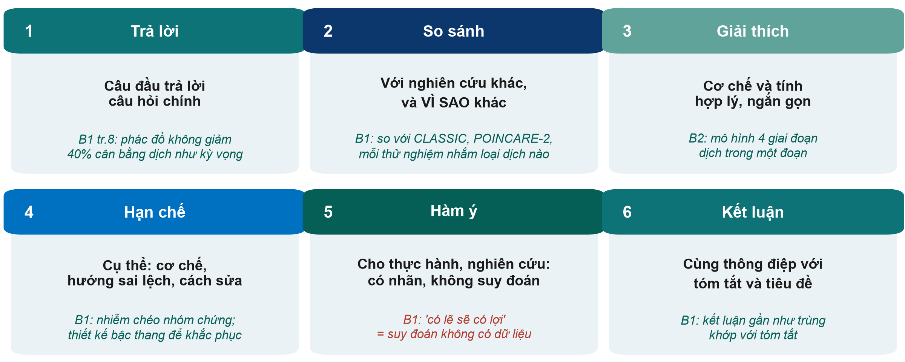{.neu-fig}

::: {.neu-takeaway}
**THÔNG ĐIỆP CHÍNH** Trả lời trước; hạn chế kèm hướng sai lệch; kết luận = tóm tắt = tiêu đề.
:::

::: {.notes}
Ý chính: phần bàn luận tốt đi qua sáu bước theo thứ tự: trả lời câu hỏi; so sánh với nghiên cứu khác và giải thích vì sao khác; giải thích cơ chế ngắn gọn; nêu hạn chế cụ thể, kèm hướng sai lệch và cách khắc phục; nêu hàm ý cho thực hành và nghiên cứu, có ghi rõ; kết luận cùng thông điệp với tóm tắt và tiêu đề.

Bài 1 làm tốt phần lớn: câu đầu trả lời câu hỏi chính (chú giải \#36); so sánh với CLASSIC và POINCARE-2 giải thích VÌ SAO kết quả khác (\#37); hạn chế cụ thể, có cơ chế và cách khắc phục (\#38, \#39); kết luận khớp với tóm tắt (\#44). Điểm yếu: 'có lẽ sẽ có lợi' là suy đoán không có dữ liệu (\#46).

Bài 2: cơ chế trong một đoạn với mô hình bốn giai đoạn dịch (\#34); phần so sánh khép lại vòng với các nghiên cứu mâu thuẫn từ phần đặt vấn đề (\#35). Nhưng phần hạn chế bỏ sót sai lệch người sống sót, mất cân bằng lactat còn lại và nhiễu do chỉ định (\#36).

Hỏi: người viết lần đầu thường bỏ qua bước nào? Đáp án: hướng của hạn chế, tức là nói rõ sai lệch làm tác động trông lớn hơn hay nhỏ hơn.
:::

## Ví dụ mẫu: Bàn luận cho FLUID-ICU câu hỏi 1

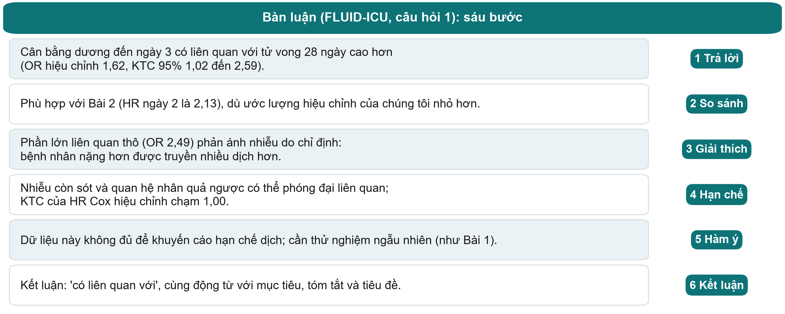{.neu-fig}

::: {.neu-takeaway}
**THÔNG ĐIỆP CHÍNH** Trả lời bằng con số, giải thích chênh thô-hiệu chỉnh, kết bằng cùng động từ.
:::

::: {.notes}
VÍ DỤ MẪU (sáu bước, mỗi bước một câu; số liệu từ key\_results.md, dữ liệu MÔ PHỎNG).

1 Trả lời: OR hiệu chỉnh 1,62 (KTC 95% 1,02 đến 2,59). 2 So sánh: Bài 2 có HR ngày 2 là 2,13 (1,48 đến 3,06). 3 Giải thích: OR thô 2,49 giảm còn 1,62 sau hiệu chỉnh (nhiễu do chỉ định). 4 Hạn chế: nhiễu còn sót, quan hệ nhân quả ngược (bệnh nhân đang xấu đi tích dịch), bệnh nhân tử vong trước ngày 3; HR Cox hiệu chỉnh 1,46 có KTC chạm 1,00. 5 Hàm ý: không có cơ sở hạn chế dịch. Cần thử nghiệm như Bài 1. 6 Kết luận: 'có liên quan với'.

Ý tùy chọn cho nhóm Q1: liên quan có vẻ mạnh hơn ở bệnh nhân suy tim (OR hiệu chỉnh 4,39 so với 1,29, p tương tác 0,031, chỉ 90 bệnh nhân). Đây là giả thuyết, không phải phát hiện.
:::

## Vì sao OR giảm: giải thích trong Bàn luận

:::: {.columns}
::: {.column width="38%"}
::: {.neu-side-notes}
### FLUID-ICU Q1 (mô phỏng)

- OR thô 2,49 (1,70 đến 3,70)
- OR hiệu chỉnh 1,62 (1,02 đến 2,59)
- OR quy gán 1,70 (1,09 đến 2,64)
- Chênh lệch = nhiễu do chỉ định
:::
:::
::: {.column width="62%"}
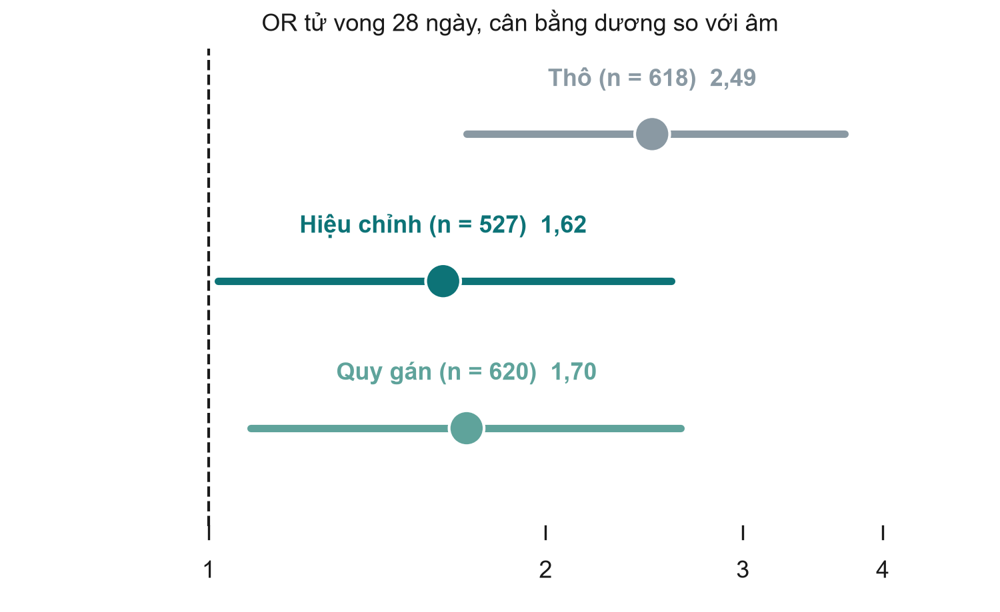{.neu-fig-side}
:::
::::

::: {.neu-takeaway}
**THÔNG ĐIỆP CHÍNH** Báo cáo cả hai; giải thích chênh lệch; giữ động từ 'có liên quan'.
:::

::: {.notes}
Hình cho thấy ba ước lượng từ gói kết quả Q1 (Bảng 6): thô (n = 618), hiệu chỉnh ca đầy đủ (n = 527) và hiệu chỉnh sau quy gán đa bội (n = 620).

Ý chính: việc giảm từ 2,49 xuống 1,62 là bài học Buổi 4 hiện ra trước mắt: bệnh nhân nặng hơn được truyền nhiều dịch hơn VÀ tử vong nhiều hơn. Ước lượng quy gán gần với ca đầy đủ, nên lactat thiếu không làm đổi kết luận.

KTC hiệu chỉnh bắt đầu từ 1,02, vừa trên 1. Câu tương xứng: 'vẫn còn mối liên quan mức độ vừa phải'.

Hỏi: nếu KTC hiệu chỉnh vượt qua 1 thì viết gì? Đáp án: 'không có bằng chứng rõ về liên quan sau hiệu chỉnh', không phải 'không có tác dụng'.
:::

## Lời văn tương xứng: chọn động từ theo thiết kế

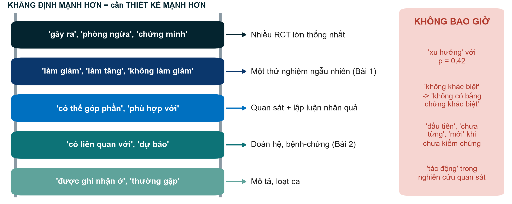{.neu-fig}

::: {.neu-takeaway}
**THÔNG ĐIỆP CHÍNH** Chỉ leo thang đến mức thiết kế của bạn cho phép.
:::

::: {.notes}
Ý chính: độ mạnh của động từ là một khẳng định. Diễn giải quá mức (kết luận vượt quá dữ liệu) là một trong những lý do bị từ chối thường gặp nhất.

Đọc thang từ dưới lên: nghiên cứu mô tả 'ghi nhận'; đoàn hệ và bệnh-chứng thấy một yếu tố 'có liên quan với' kết cục; bằng chứng quan sát mạnh cộng lập luận nhân quả có thể nói 'có thể góp phần'; thử nghiệm ngẫu nhiên được nói 'làm giảm' hoặc 'không làm giảm'; 'gây ra' hay 'chứng minh' cần nhiều thử nghiệm lớn thống nhất.

KHÔNG BAO GIỜ: 'xu hướng không có ý nghĩa' với p = 0,42 (Bài 1, trang 10, chú giải \#41); 'không khác biệt' khi nghiên cứu quá nhỏ (hãy nói 'không có bằng chứng về khác biệt', \#29); 'đầu tiên', 'chưa từng', 'mới' khi chưa kiểm chứng ('cân bằng dịch thấp nhất từng được công bố', \#40); 'tác động', 'không tác động', 'chứng tỏ' trong nghiên cứu quan sát (Bài 2, \#1, \#27, \#28); 'so sánh đáng tin cậy nhất' (\#32); xếp hạng HR từ các đoàn hệ khác nhau thành 'nguy cơ cao nhất' mà không có kiểm định (\#37).

Hỏi: viết lại câu 'cân bằng dịch dương làm tăng tử vong' cho Bài 2. Đáp án: 'cân bằng dịch dương vào ngày ICU thứ 2 có liên quan với tử vong 28 ngày cao hơn'.
:::

## Kiểm tra: sửa động từ (FLUID-ICU, mô phỏng)

::: {.neu-banner style="--c:#6C3483"}
CÂU HỎI NHANH · 2 phút
:::

:::: {.columns}
::: {.column width="60%"}
::: {.neu-activity-steps style="--c:#6C3483"}
- 'Cân bằng dương gây ra tử vong cao hơn (OR 1,62).'
- 'Quá tải dịch làm tăng tổn thương thận cấp (OR 1,27 mỗi 10 ml/kg).'
- 'Có xu hướng tử vong (HR Cox 1,46, KTC 95% 1,00 đến 2,13).'
- 'Lactat dự báo tử vong (OR 1,39 mỗi mmol/L).'
:::
:::
::: {.column width="40%"}
::: {.neu-side .plain style="--c:#6C3483"}
Tốt hơn

- 1 '... có liên quan với ...'
- 2 '... liên quan với khả năng AKI cao hơn'
- 3 'HR 1,46 (1,00 đến 2,13): KTC chạm 1'
- 4 Được nếu là dự báo; nếu là nhân quả: 'có liên quan'
:::
:::
::::

::: {.notes}
KIỂM TRA (2 phút). Số liệu từ key\_results.md (MÔ PHỎNG): Q1 OR hiệu chỉnh 1,62; Q2 OR hiệu chỉnh 1,27 mỗi 10 ml/kg; Q1 HR Cox hiệu chỉnh 1,46 (1,00 đến 2,13); Q4 OR hiệu chỉnh ca đầy đủ 1,39 mỗi mmol/L.

Lớp bỏ phiếu 'ổn' hay 'sửa'; mời một người sửa.

Câu 3: không dùng 'xu hướng'. Nêu ước lượng và nói KTC chạm 1.

Câu 4: 'dự báo' chấp nhận được theo nghĩa tiên lượng; nếu tác giả muốn nói nhân quả, 'có liên quan với' là động từ trung thực.
:::

## Tóm tắt có cấu trúc: tủ kính trưng bày

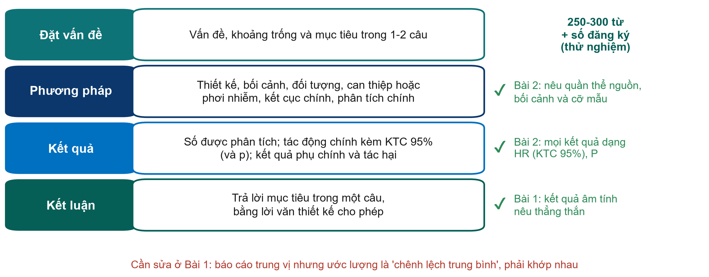{.neu-fig}

::: {.neu-takeaway}
**THÔNG ĐIỆP CHÍNH** Mỗi kết quả trong tóm tắt có con số và khoảng tin cậy.
:::

::: {.notes}
Ý chính: đa số tạp chí lâm sàng yêu cầu tóm tắt có cấu trúc (Đặt vấn đề, Phương pháp, Kết quả, Kết luận), khoảng 250-300 từ; thử nghiệm thêm số đăng ký. Nhiều người đọc không đọc tiếp, nên tóm tắt phải tự đứng được.

Thực hành tốt: tóm tắt Bài 2 nêu quần thể nguồn, bối cảnh và cỡ mẫu (chú giải \#4) và mọi kết quả dạng HR với KTC 95% và giá trị P chính xác (\#5). Kết luận của Bài 1 nêu thẳng kết quả âm tính, không 'tô vẽ' (\#6), và số đăng ký có trong tóm tắt (\#7).

Cần sửa (Bài 1, \#4): báo cáo trung vị nhưng ước lượng gọi là 'chênh lệch trung bình', và p = 0,0506 với KTC chạm 0 được ghi tới bốn chữ số thập phân. Cách tóm tắt, ước lượng và kiểm định phải khớp nhau, và p sát ngưỡng không phải là 'gần có ý nghĩa'.

Viết tóm tắt SAU CÙNG, và kiểm tra mỗi con số giống hệt nhau ở tóm tắt, văn bản và bảng.

Hỏi: điều đầu tiên bạn tìm trong phần Kết quả của tóm tắt? Đáp án: tác động chính kèm KTC.
:::

## Ví dụ mẫu: tóm tắt và tiêu đề cho FLUID-ICU câu hỏi 1

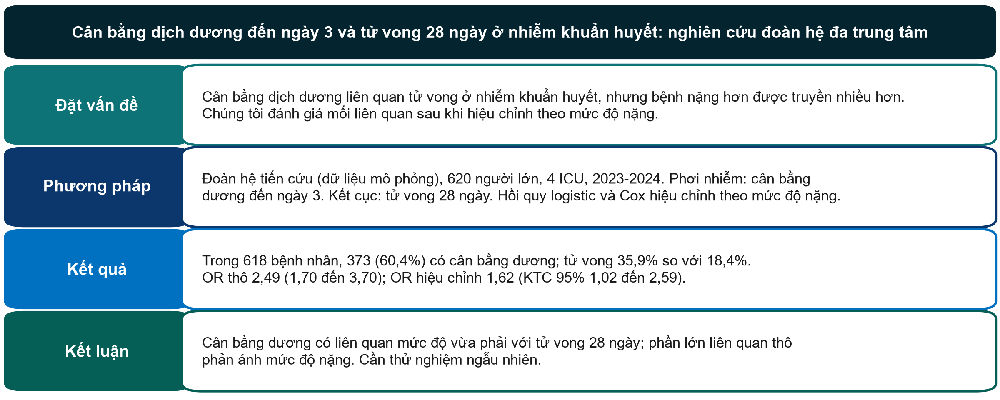{.neu-fig}

::: {.neu-takeaway}
**THÔNG ĐIỆP CHÍNH** Chép số liệu từ phần Kết quả. Tóm tắt không được có con số mới.
:::

::: {.notes}
VÍ DỤ MẪU (dữ liệu MÔ PHỎNG; khoảng 120 từ, còn tóm tắt đầy đủ tối đa 250).

Tiêu đề: nêu phơi nhiễm, kết cục, đối tượng và thiết kế; không 'tác động'.

Phương pháp: phải nói dữ liệu là mô phỏng (quy định của khóa học).

Kết quả: OR thô VÀ hiệu chỉnh, như trong Kết quả; số bệnh nhân (618 phân tích, 373 cân bằng dương).

Kết luận: 'liên quan mức độ vừa phải', khớp với KTC hiệu chỉnh 1,02 đến 2,59.

Hỏi: câu nào trong tóm tắt sẽ thay đổi nếu KTC hiệu chỉnh là 0,95 đến 2,40? Đáp án: Kết quả và Kết luận, sẽ thành 'không có bằng chứng rõ về liên quan sau hiệu chỉnh'.
:::

## Tiêu đề và từ khóa: PICO của bạn trong một dòng

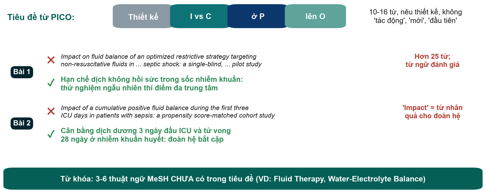{.neu-fig}

::: {.neu-takeaway}
**THÔNG ĐIỆP CHÍNH** Tiêu đề tốt nêu câu hỏi và thiết kế, không dùng từ quảng cáo.
:::

::: {.notes}
Ý chính: tiêu đề là câu được đọc nhiều nhất của bài. Xây dựng từ PICO: thiết kế, can thiệp hoặc phơi nhiễm so với nhóm chứng, đối tượng, kết cục. Khoảng 10-16 từ; nêu thiết kế; tránh từ mang tính đánh giá ('impact', 'optimized', 'novel', 'first').

Bài 1 (chú giải \#1): tiêu đề có nêu thiết kế (tốt), nhưng hơn 25 từ và có từ đánh giá. Phiên bản mô tả ngắn hơn có trên slide.

Bài 2 (chú giải \#1): 'Impact' là từ nhân quả cho một nghiên cứu đoàn hệ quan sát; người phản biện thường yêu cầu 'Association between ...'.

Từ khóa (Bài 1, chú giải \#9): từ khóa lặp lại chữ đã có trong tiêu đề. Chọn 3-6 thuật ngữ MeSH CHƯA có trong tiêu đề để bài được tìm thấy qua nhiều lượt tìm kiếm hơn.

Hỏi: nói nghiên cứu của nhóm trong một dòng, bắt đầu bằng thiết kế. Đó là bản nháp tiêu đề tạm. Các bạn sẽ viết nó trong hoạt động cuối phần này.
:::

## Trước khi nộp: tài liệu tham khảo, bảng kiểm, đọc lần cuối

:::: {.neu-cards style="--n:3"}
::: {.neu-card .plain style="--c:#0D7377"}
[Tài liệu tham khảo]{.neu-card-title}

- Dùng phần mềm quản lý tài liệu
- Kiểm tra từng trích dẫn
- B2 dẫn bài Sepsis-3 cho các biến hiệu chỉnh
:::
::: {.neu-card .plain style="--c:#0B376C"}
[Bảng kiểm báo cáo]{.neu-card-title}

- Điền ngay trong lúc viết
- Ghi số trang
- Cả hai bài không nêu CONSORT hay STROBE
:::
::: {.neu-card .plain style="--c:#5FA39B"}
[Đọc lần cuối]{.neu-card-title}

- Văn bản = bảng, từng con số
- Dẫn đúng số hình
- Một đồng tác giả đọc các bảng
:::
::::

::: {.neu-takeaway}
**THÔNG ĐIỆP CHÍNH** Phần lớn lỗi của hai bài không cần dữ liệu mới, chỉ cần một đồng tác giả cẩn thận.
:::

::: {.notes}
Tài liệu tham khảo: dùng phần mềm quản lý tài liệu (Zotero, Mendeley, EndNote) và kiểm tra từng trích dẫn. Ở Bài 2, danh sách biến hiệu chỉnh dẫn tài liệu 26 (bài định nghĩa Sepsis-3), gần như chắc chắn sai số (chú giải \#22). Không bao giờ trích dẫn tài liệu do AI gợi ý mà chưa đọc.

Bảng kiểm báo cáo: điền CONSORT hoặc STROBE trong lúc viết, kèm số trang. Nhiều tạp chí yêu cầu khi nộp. Cả hai bài đều không nêu tên hướng dẫn (cả hai bản tóm tắt chú giải đều chỉ ra).

Đọc lần cuối: đối chiếu mọi con số trong văn bản với bảng (creatinine ở Bài 1, \#25), mọi chỗ dẫn hình (Bài 1 dẫn Hình 1 trong khi ý là Hình 2A, \#28), và cách viết số (một KTPV có cận trên nhỏ hơn cận dưới, \#35).

Thông điệp từ bản tóm tắt chú giải: gần như mọi lỗi của Bài 1 lẽ ra đã được phát hiện nếu một đồng tác giả đọc bảng đối chiếu với văn bản.
:::

## Thực hành bản thảo 2  \|  30 phút

:::: {.neu-statement}
::: {.neu-big}
Hoàn thiện bản nháp
:::

::: {.neu-sub}
Đặt vấn đề, Bàn luận, Tóm tắt và Tiêu đề
:::
::::

::: {.notes}
THỰC HÀNH BẢN THẢO 2 (0:30-1:00). Bộ dữ liệu khóa học. Các nhóm thêm Đặt vấn đề, Bàn luận, Tóm tắt và Tiêu đề vào phần Phương pháp + Kết quả thứ Bảy tuần trước.

Hướng dẫn: Practicals/s8\_exercises.md, Phần B. Đoạn văn mẫu cho Q1: Solutions/s8\_solutions.md.
:::

## Thực hành bản thảo 2: Đặt vấn đề, Bàn luận, Tóm tắt, Tiêu đề

::: {.neu-banner style="--c:#0D7377"}
LÀM VIỆC NHÓM · 30 phút
:::

:::: {.columns}
::: {.column width="60%"}
::: {.neu-activity-steps style="--c:#0D7377"}
- 0-8: Đặt vấn đề, ba đoạn (hai người)
- 0-15: Bàn luận, sáu bước (ba người)
- 15-23: Tóm tắt 250 từ, số liệu lấy từ Kết quả
- 23-27: Tiêu đề (10-16 từ, nêu thiết kế) + từ khóa
- 27-30: kiểm tra động từ: mọi 'gây ra', 'tác động' → 'có liên quan'
:::
:::
::: {.column width="40%"}
::: {.neu-side .plain style="--c:#0D7377"}
Vai trò

- 2 Đặt vấn đề
- 3 Bàn luận
- 1 kiểm số + động từ
- Cả nhóm: Tóm tắt và Tiêu đề
:::
:::
::::

::: {.neu-output style="--c:#0D7377"}
**SẢN PHẨM** Bản nháp hoàn chỉnh (\~2.000 từ) đã lưu để trao đổi phản biện sau khóa học
:::

::: {.notes}
THỰC HÀNH 2 (0:30-1:00). Bật đồng hồ 30 phút; Đặt vấn đề và Bàn luận viết song song.

Đi quanh. Câu gợi ý: 'Câu đầu Bàn luận có trả lời câu hỏi bằng con số không?' 'Có hạn chế nào kèm hướng sai lệch không?' 'Kết luận có dùng cùng động từ với mục tiêu không?' 'Mọi con số trong tóm tắt có giống hệt phần Kết quả không?'

Nhóm Q4: bàn luận vì sao kết quả phân tích ca đầy đủ và quy gán khác nhau (hoặc không). Nhóm Q5: chỉ người sống sót, nên nói rõ ai bị thiếu.

Lúc 0:58 đề nghị các nhóm lưu bài; bản nháp sẽ được trao đổi để phản biện (bài về nhà, 2 tuần, dùng bảng kiểm 10 câu hỏi ở 8.3).
:::

## Giải lao

::: {.neu-banner style="--c:#8A99A3"}
GIẢI LAO · 15 phút
:::

:::: {.columns}
::: {.column width="60%"}
::: {.neu-activity-steps style="--c:#8A99A3"}
- Lưu và gửi bản nháp bản thảo
- Nhóm 1-3: nhận Bài 1 (RCT) và phiếu trả lời
- Nhóm 4-5: nhận Bài 2 (đoàn hệ) và phiếu trả lời
- Người trình bày: kiểm tra slide mở được trên máy trình chiếu
- Quay lại đúng 1:15
:::
:::
::: {.column width="40%"}
::: {.neu-side .plain style="--c:#8A99A3"}
Sau giải lao

- Công bố (25 phút)
- Làm người phản biện (20 phút)
- Các nhóm trình bày (45 phút)
:::
:::
::::

::: {.notes}
GIẢI LAO (1:00-1:15).

Trong giờ giải lao: đặt bài báo và bộ tài liệu thẩm định (Practicals/s8\_exercises.md, Phần D) lên bàn: Bài 1 ở bàn 1-3, Bài 2 ở bàn 4-5. Phát bản GỐC (không chú giải).

Chép cả năm bài trình bày vào một máy và thử máy chiếu.

Thu năm bản nháp bản thảo (thư mục chung). Các bản này cần cho việc trao đổi phản biện.
:::

## 8.2  \|  25 phút

:::: {.neu-statement}
::: {.neu-big}
Công bố bài báo
:::

::: {.neu-sub}
Từ bảng kiểm đến bản in thử, và những cái bẫy trên đường
:::
::::

::: {.notes}
PHẦN 8.2 (1:15-1:40). Mười slide, 3 phút trình diễn EQUATOR và 2 phút kiểm tra.

Nhịp: khoảng 2 phút mỗi slide. Chỉ vào hình, nêu một ví dụ, đi tiếp. Phần thẩm định cần trọn 20 phút lúc 1:40.

Liên hệ bản thảo: bản nháp FLUID-ICU sẽ đi đúng con đường này: bảng kiểm STROBE, chọn tạp chí, bộ hồ sơ nộp bài, phản biện.
:::

## Hướng dẫn báo cáo: chọn theo thiết kế

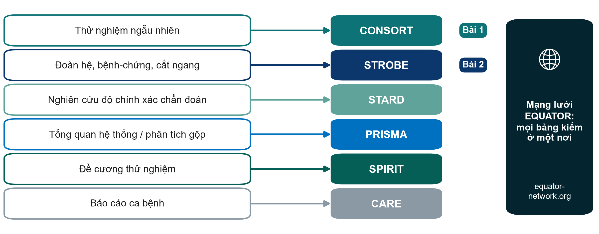{.neu-fig}

::: {.neu-takeaway}
**THÔNG ĐIỆP CHÍNH** Ghi tên hướng dẫn trong Phần 4 và dùng nó làm bảng kiểm khi viết.
:::

::: {.notes}
Ý chính: với mỗi thiết kế nghiên cứu có một bảng kiểm báo cáo được quốc tế thống nhất; tất cả được tập hợp miễn phí tại Mạng lưới EQUATOR (equator-network.org).

CONSORT cho thử nghiệm ngẫu nhiên (bản cập nhật CONSORT 2025), STROBE cho nghiên cứu quan sát (đoàn hệ, bệnh-chứng, cắt ngang), STARD cho độ chính xác chẩn đoán, PRISMA cho tổng quan hệ thống, SPIRIT cho đề cương thử nghiệm (SPIRIT 2025), CARE cho báo cáo ca bệnh.

Ví dụ xuyên suốt: Bài 1 là RCT (CONSORT); Bài 2 là đoàn hệ (STROBE). Phát hiện thú vị từ bản chú giải: cả hai bài đều không ghi tên hướng dẫn. Bài 1 có sơ đồ CONSORT trong bài chính; Bài 2 để sơ đồ chọn bệnh trong phụ lục.

Nhiều tạp chí yêu cầu nộp bảng kiểm đã điền, kèm số trang.

Quan niệm sai: 'hướng dẫn báo cáo chỉ cách làm nghiên cứu'. Chúng chỉ cần báo cáo gì, nhưng đọc chúng TRƯỚC khi bắt đầu là bảng kiểm thiết kế tốt nhất.

Hỏi từng nhóm: hướng dẫn nào phù hợp đề cương của bạn? Thường là đoàn hệ hoặc cắt ngang (STROBE); một vài nhóm là thử nghiệm (CONSORT, và SPIRIT cho đề cương).
:::

## Chọn tạp chí: bốn điều cần kiểm tra

::: {.neu-intro}
Chọn tạp chí trước khi viết: tạp chí đặt ra luật chơi.
:::

:::: {.neu-cards style="--n:4"}
::: {.neu-card .plain style="--c:#0D7377"}
[Phù hợp]{.neu-card-title}

- Ai cần kết quả của bạn?
- Đọc 3 số gần đây
- Có đăng thiết kế tương tự?
:::
::: {.neu-card .plain style="--c:#0B376C"}
[Tin cậy]{.neu-card-title}

- Được chỉ mục: MEDLINE, DOAJ, Scopus hoặc Web of Science
- Chính sách phản biện rõ ràng
:::
::: {.neu-card .plain style="--c:#5FA39B"}
[Quy định]{.neu-card-title}

- Hướng dẫn tác giả
- Giới hạn số chữ, bảng kiểm
- Có yêu cầu đăng ký?
:::
::: {.neu-card .plain style="--c:#0070C0"}
[Chi phí & tốc độ]{.neu-card-title}

- Phí (APC) và miễn giảm
- Giấy phép: CC BY hay BY-NC-ND
- Bài 1: 7 tuần; Bài 2: 7 tháng
:::
::::

::: {.neu-takeaway}
**THÔNG ĐIỆP CHÍNH** Tạp chí tốt là nơi người đọc của bạn đọc, và được vận hành trung thực.
:::

::: {.notes}
Ý chính: chọn tạp chí ngay từ đầu, vì Hướng dẫn tác giả quy định số chữ, cấu trúc, bảng kiểm và yêu cầu đăng ký.

Phù hợp: những người cần câu trả lời của bạn (điều dưỡng ICU? dược sĩ? bác sĩ hồi sức?) quyết định tạp chí. Tin cậy: được chỉ mục trong MEDLINE/PubMed, Danh mục Tạp chí Truy cập Mở (DOAJ), Scopus hoặc Web of Science, có chính sách phản biện và rút bài rõ ràng.

Chi phí: nhiều tạp chí truy cập mở thu phí xử lý bài (APC); hỏi về miễn giảm và thỏa thuận của cơ sở. Giấy phép: Bài 1 là CC BY-NC-ND (được chia sẻ, không được chỉnh sửa hay dùng thương mại), Bài 2 là CC BY (được tái sử dụng nếu ghi nguồn).

Tốc độ: Bài 1 từ lúc nộp đến khi được chấp nhận khoảng 7 tuần (10/9 đến 31/10/2024); Bài 2 khoảng 7 tháng (15/1 đến 24/8/2023). Tốc độ khác nhau và tự nó không nói lên chất lượng.

Hỏi: kể tên một tạp chí khoa bạn thường đọc. Đó thường là lựa chọn đầu tiên hợp lý.
:::

## Bản tiền ấn phẩm, truy cập mở và giấy phép

:::: {.neu-cards style="--n:3"}
::: {.neu-card .plain style="--c:#0D7377"}
[Tiền ấn phẩm]{.neu-card-title}

- Đăng trước phản biện (VD: medRxiv)
- Nhanh, có dấu thời gian, góp ý mở
- CHƯA qua phản biện: phải nói rõ
- Xem chính sách của tạp chí
:::
::: {.neu-card .plain style="--c:#0B376C"}
[Truy cập mở]{.neu-card-title}

- Ai cũng đọc miễn phí
- Gold: tạp chí thu phí (APC)
- Green: bản được chấp nhận lưu ở kho
- Hỏi về miễn giảm phí
:::
::: {.neu-card .plain style="--c:#5FA39B"}
[Giấy phép]{.neu-card-title}

- CC BY: tái sử dụng, ghi nguồn (Bài 2)
- CC BY-NC-ND: chia sẻ, không sửa (Bài 1)
- Đọc kỹ trước khi ký
:::
::::

::: {.neu-takeaway}
**THÔNG ĐIỆP CHÍNH** Biết ai được đọc, được tái sử dụng và ai trả phí trước khi nộp bài.
:::

::: {.notes}
Tiền ấn phẩm (preprint): bản thảo đăng trên máy chủ công khai (với nghiên cứu y tế, nổi tiếng nhất là medRxiv) trước hoặc trong khi phản biện. Lợi ích: nhanh, có dấu thời gian công khai, nhận góp ý sớm. Rủi ro: chưa qua phản biện, báo chí hoặc đồng nghiệp có thể coi như đã được khẳng định. Đa số tạp chí chấp nhận bài đã đăng tiền ấn phẩm. Kiểm tra chính sách trước, và cập nhật bản tiền ấn phẩm bằng trích dẫn bài đã đăng.

Truy cập mở: gold OA là tạp chí cho đọc miễn phí và thường thu phí xử lý bài (APC). Cả hai bài của chúng ta đều là gold OA (chú giải \#2). Green OA là tự lưu bản thảo được chấp nhận vào kho lưu trữ, thường sau một thời gian cấm. Hỏi về miễn giảm và thỏa thuận của cơ sở.

Giấy phép: Bài 2 là CC BY (ai cũng được tái sử dụng và chỉnh sửa nếu ghi nguồn); Bài 1 là CC BY-NC-ND (được chia sẻ, không được chỉnh sửa hay dùng thương mại). Điều này cũng quan trọng khi muốn dùng lại hình trong giảng dạy.

Hỏi: bạn muốn vẽ lại sơ đồ chọn bệnh của Bài 1 để đưa vào slide giảng dạy. Có được không? Đáp án: chỉnh sửa không nằm trong CC BY-NC-ND, nên hãy xin phép hoặc trích dẫn và dẫn liên kết.
:::

## Nhận diện tạp chí săn mồi

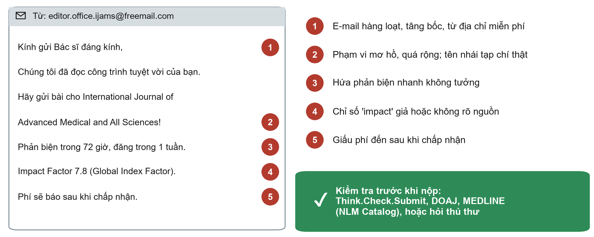{.neu-fig}

::: {.neu-takeaway}
**THÔNG ĐIỆP CHÍNH** Nếu tạp chí tìm đến bạn bằng email tâng bốc, hãy kiểm tra hai lần.
:::

::: {.notes}
Ý chính: tạp chí săn mồi thu phí đăng bài nhưng không phản biện, biên tập hay chỉ mục thực sự. Công trình của bạn biến mất vào một tạp chí không ai tin, và không thể nộp lại nơi khác.

Đi qua năm dấu hiệu trên email (hư cấu) này: email hàng loạt tâng bốc từ địa chỉ miễn phí; phạm vi mơ hồ, quá rộng và tên nhái tạp chí thật; phản biện nhanh không tưởng; chỉ số 'impact' giả hoặc không rõ nguồn; giấu phí đến sau khi chấp nhận. Dấu hiệu khác: ban biên tập không xác minh được, không có địa chỉ, nhiều lỗi chính tả.

Kiểm tra: Think.Check.Submit (bảng kiểm miễn phí), DOAJ cho tạp chí truy cập mở, NLM Catalog để xem tạp chí có thật sự trong MEDLINE. Hỏi thêm thủ thư bệnh viện.

Hỏi: tháng vừa rồi bao nhiêu người nhận được email kiểu này? Thường rất nhiều: ai đã từng đăng một bài đều nhận.

Phiếu bài tập s8 (Phần C) có bài tập ngắn 'nhận diện tạp chí săn mồi' để làm sau.
:::

## Trình diễn: tìm bảng kiểm và kiểm tra tạp chí

::: {.neu-banner style="--c:#B5651D"}
TRÌNH DIỄN TRỰC TIẾP · 3 phút
:::

:::: {.columns}
::: {.column width="60%"}
::: {.neu-activity-steps style="--c:#B5651D"}
- Mở trang Mạng lưới EQUATOR và tìm 'CONSORT'
- Xem bảng kiểm và sơ đồ chọn bệnh (Bài 1 có sơ đồ này)
- Tìm STROBE theo cách tương tự (Bài 2)
- Kiểm tra một tạp chí: tìm trên DOAJ và NLM Catalog
- Mở bảng kiểm Think.Check.Submit
:::
:::
::: {.column width="40%"}
::: {.neu-side .plain style="--c:#B5651D"}
Chú ý

- Tệp PDF bảng kiểm ở đâu
- Cách xem tạp chí có trong MEDLINE
- Ba câu hỏi cho mọi tạp chí
:::
:::
::::

::: {.neu-output style="--c:#B5651D"}
**SẢN PHẨM** Mỗi nhóm kiểm tra tạp chí + hướng dẫn báo cáo trong kế hoạch công bố
:::

::: {.notes}
TRÌNH DIỄN (1:24-1:27). Kịch bản đầy đủ và phương án dự phòng không có mạng: Course/Demos/s8\_demo.md.

Giữ trong 3 phút: trang chủ EQUATOR, ô tìm kiếm, trang CONSORT 2025, bảng kiểm và sơ đồ; rồi STROBE. Sau đó tìm tên một tạp chí trên DOAJ, và trên NLM Catalog với bộ lọc 'currently indexed in MEDLINE'. Kết thúc bằng bảng kiểm Think.Check.Submit.

Nếu mất mạng, dùng các ảnh chụp màn hình mô tả trong kịch bản.

Kết: đề nghị mỗi nhóm kiểm tra tạp chí dự kiến và hướng dẫn báo cáo trong kế hoạch công bố (Xây dựng đề cương 7) và cho bản thảo FLUID-ICU (STROBE). Dành 30 giây, rồi tiếp tục với bộ hồ sơ nộp bài.
:::

## Bộ hồ sơ nộp bài

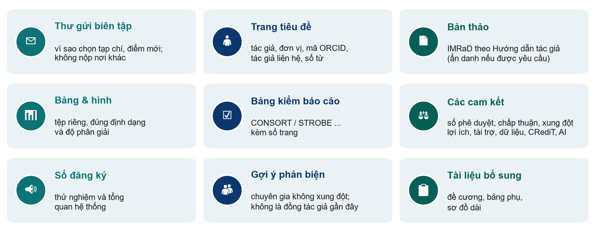{.neu-fig}

::: {.neu-takeaway}
**THÔNG ĐIỆP CHÍNH** Nộp đủ cả bộ một lần. Thiếu thứ gì là chậm trễ.
:::

::: {.notes}
Ý chính: tạp chí kiểm tra bộ hồ sơ trước mọi đánh giá khoa học. Thiếu thành phần là bản thảo bị trả về ngay.

Thư gửi biên tập: một trang, nêu vì sao chọn tạp chí này, điểm mới, bài chưa được nộp nơi khác, và bản tiền ấn phẩm nếu có. Trang tiêu đề: tất cả tác giả, đơn vị, mã ORCID (mã định danh nhà nghiên cứu miễn phí, vĩnh viễn mà mọi học viên có thể đăng ký tại orcid.org), tác giả liên hệ, số từ. Bản thảo theo định dạng của tạp chí (ẩn danh nếu tạp chí phản biện kín hai chiều). Bảng và hình đúng tệp và độ phân giải yêu cầu. Bảng kiểm báo cáo kèm số trang. Các cam kết: số phê duyệt đạo đức, chấp thuận, xung đột lợi ích, tài trợ, khả năng cung cấp dữ liệu, đóng góp tác giả (CRediT) và việc dùng AI. Số đăng ký cho thử nghiệm và tổng quan hệ thống. Gợi ý người phản biện: chuyên gia không xung đột, không phải đồng tác giả gần đây. Biên tập viên quyết định có dùng hay không. Tài liệu bổ sung.

Ví dụ xuyên suốt: Bài 1 có phần cam kết đầy đủ, đúng những gì hệ thống nộp bài hỏi, từng mục một (chú giải \#48). Tóm tắt bằng hình là yêu cầu riêng của tạp chí, chỉ tìm thấy trong Hướng dẫn tác giả (\#8).

Hỏi: ai trong nhóm đã có mã ORCID? Khuyến khích mọi người đăng ký trong tuần này.
:::

## Hành trình phản biện

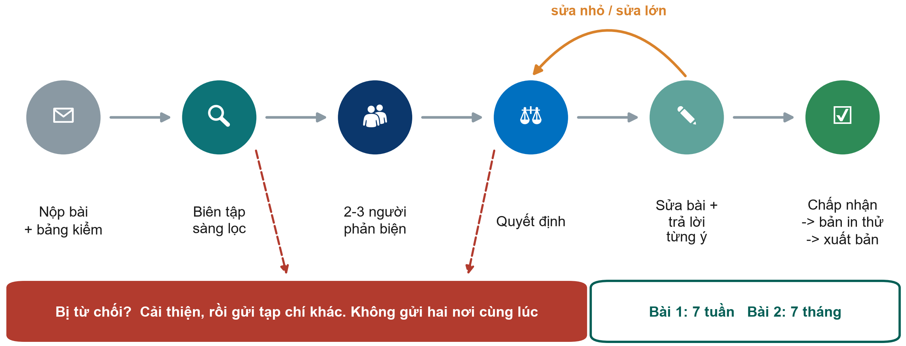{.neu-fig}

::: {.neu-takeaway}
**THÔNG ĐIỆP CHÍNH** Hầu hết bài báo phải sửa trước khi được nhận. Hãy trả lời lịch sự từng ý.
:::

::: {.notes}
Đi qua sáu trạm. Nộp bài (kèm thư giới thiệu, bảng kiểm báo cáo và các cam kết). Biên tập viên sàng lọc, nhiều bài bị từ chối ngay mà không qua phản biện ('desk rejection') vì không phù hợp hoặc báo cáo kém. Hai ba người phản biện nhận xét. Biên tập quyết định: chấp nhận, sửa nhỏ, sửa lớn hoặc từ chối. Bạn sửa và trả lời từng ý. Được chấp nhận, rồi đọc bản in thử (thật cẩn thận!) và xuất bản.

Ví dụ xuyên suốt: người chú giải đánh giá Bài 1 'sửa nhỏ' và Bài 2 'sửa lớn'. Cả hai đã được đăng, và cả hai vẫn còn lỗi mà một người phản biện cẩn thận sẽ phát hiện (Bài 1 còn in hai lần cùng một đoạn 'Study protocol', lỗi đọc bản in thử).

Quy tắc: mỗi lần chỉ nộp MỘT tạp chí; nếu bị từ chối, sửa bài theo góp ý rồi mới nộp nơi khác.

Hỏi: người phản biện hiểu sai một điểm. Bạn làm gì? Đáp án: cảm ơn, giải thích lịch sự có bằng chứng, và làm rõ câu chữ để người đọc sau không hiểu lầm.
:::

## Trả lời phản biện: bảng trả lời từng ý

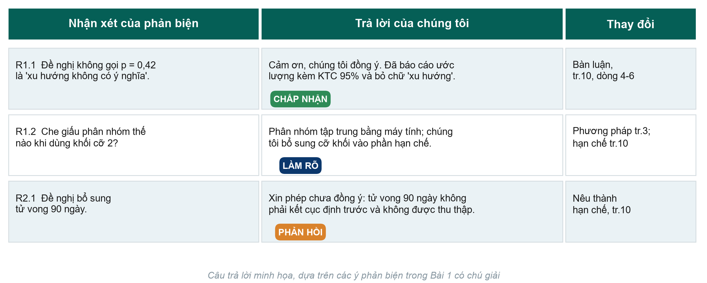{.neu-fig}

::: {.neu-takeaway}
**THÔNG ĐIỆP CHÍNH** Cảm ơn, trả lời mọi ý, chỉ rõ chỗ đã sửa, và phản hồi lịch sự, có bằng chứng.
:::

::: {.notes}
Ý chính: thư trả lời là một bảng: mỗi nhận xét của phản biện, câu trả lời của bạn, và chính xác chỗ bản thảo đã thay đổi (trang và dòng). Đánh số các nhận xét (R1.1, R1.2, R2.1 ...).

Giọng văn: cảm ơn người phản biện, đồng ý khi có thể, không bỏ sót ý nào, không tranh luận cảm tính. Khi không đồng ý (phản hồi), giải thích lịch sự kèm bằng chứng và, nếu được, vẫn làm rõ câu chữ để người đọc sau không hiểu lầm.

Ba dòng trên slide là minh họa, dựa trên những gì người chú giải cho rằng phản biện sẽ hỏi Bài 1: bỏ 'xu hướng không có ý nghĩa' (chấp nhận); giải thích khối cỡ 2 (làm rõ và thêm hạn chế); yêu cầu một kết cục chưa từng thu thập (phản hồi lịch sự: không thể thêm dữ liệu không tồn tại, nhưng có thể nêu thành hạn chế).

Lỗi thường gặp: sửa bản thảo mà không nói sửa ở đâu; trả lời 'đã sửa' không có chi tiết; chấp nhận một yêu cầu làm bài sai đi chỉ để chiều lòng phản biện.

Có mẫu trong Course/Templates/ (thư trả lời phản biện).

Hỏi: phản biện yêu cầu một phân tích mà bạn cho là không phù hợp. Bạn viết gì? Đáp án: cảm ơn, giải thích lý do kèm tài liệu dẫn, và đề xuất phương án khác nếu có.
:::

## Sau khi được chấp nhận: bản in thử, chia sẻ, đính chính

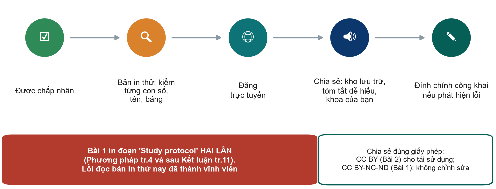{.neu-fig}

::: {.neu-takeaway}
**THÔNG ĐIỆP CHÍNH** Đọc bản in thử kỹ như đọc dữ liệu. Lỗi sẽ thành vĩnh viễn.
:::

::: {.notes}
Ý chính: sau khi được chấp nhận, nhà xuất bản gửi bản in thử, thường với hạn rất ngắn (vài ngày). Đọc chậm: từng con số, từng tên và đơn vị công tác, từng bảng và hình. Đây là cơ hội cuối cùng.

Ví dụ xuyên suốt: Bài 1 in toàn bộ đoạn 'Study protocol' hai lần: trong Phương pháp (trang 4) và lại sau phần Kết luận (trang 11). Đây là lỗi trùng lặp lẽ ra phải được phát hiện ở bước in thử (chú giải \#45). Đơn vị công tác ở Bài 2 viết hoa không thống nhất (\#42).

Chia sẻ: đăng bài theo giấy phép và chính sách của tạp chí: kho lưu trữ của cơ sở, bản tóm tắt dễ hiểu cho người bệnh và đồng nghiệp, một buổi trình bày ngắn tại khoa, mạng xã hội. Nếu báo chí liên hệ, chỉ nói trong phạm vi thiết kế cho phép (lại là lời văn tương xứng).

Đính chính: nếu phát hiện lỗi sau khi đăng, liên hệ tạp chí. Đính chính là trung thực; rút bài dành cho lỗi nghiêm trọng hoặc sai phạm.

Hỏi: ai sẽ trình bày lại kết quả đã công bố cho khoa của bạn? Đó là một phần của kế hoạch phổ biến.
:::

## Kiểm tra: đúng hay sai?

::: {.neu-banner style="--c:#6C3483"}
CÂU HỎI NHANH · 2 phút
:::

:::: {.columns}
::: {.column width="60%"}
::: {.neu-activity-steps style="--c:#6C3483"}
- 'Tạp chí gửi email mời trước thường là tạp chí săn mồi'
- 'Tôi có thể gửi bài cho hai tạp chí cùng lúc cho nhanh'
- 'Bản tiền ấn phẩm đã được phản biện'
- 'Tôi phải trả lời mọi nhận xét của phản biện, kể cả khi không đồng ý'
- 'Bài báo FLUID-ICU nên theo CONSORT'
:::
:::
::: {.column width="40%"}
::: {.neu-side .plain style="--c:#6C3483"}
Đáp án

- 1 Thường đúng: kiểm tra hai lần
- 2 Sai: nộp trùng lặp
- 3 Sai
- 4 Đúng: lịch sự, có bằng chứng
- 5 Sai: STROBE (đoàn hệ)
:::
:::
::::

::: {.notes}
KIỂM TRA (1:38-1:40). Giơ ngón cái lên (đúng) hoặc xuống (sai); mở đáp án.

Câu 1 'thường đúng' chứ không phải luôn đúng. Tạp chí thật cũng mời viết bài, nhưng email tâng bốc gửi hàng loạt từ tạp chí lạ cần được kiểm tra năm dấu hiệu.
:::

## 8.3  \|  20 phút

:::: {.neu-statement}
::: {.neu-big}
Làm người phản biện
:::

::: {.neu-sub}
Luyện tập cho việc trao đổi phản biện bản thảo
:::
::::

::: {.notes}
PHẦN 8.3 (1:40-2:00). Hướng dẫn đầy đủ cho giảng viên: Course/Resources/appraisal\_instructor\_guide.md (đáp án mẫu, câu gợi ý, thông điệp chính).

Cấu trúc: 2 phút hướng dẫn, 10 phút làm nhóm, 8 phút thảo luận chung. Bài báo và phiếu đã đặt sẵn trên bàn trong giờ giải lao.

Vì sao lúc này: sau khóa học mỗi nhóm phản biện bản nháp FLUID-ICU của một nhóm khác bằng CHÍNH 10 câu hỏi này. Đây là buổi tập dượt.

Trấn an: 'Không rõ' là câu trả lời hợp lệ nếu bài báo không nói.
:::

## Ghép mảnh: ba nhóm đọc thử nghiệm, hai nhóm đọc đoàn hệ

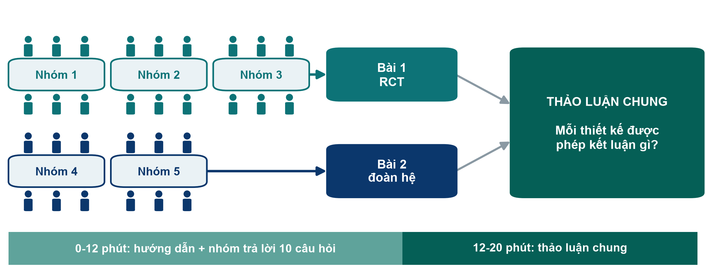{.neu-fig}

::: {.neu-takeaway}
**THÔNG ĐIỆP CHÍNH** Cùng câu hỏi lâm sàng, hai thiết kế. So sánh mỗi bài được kết luận gì.
:::

::: {.notes}
Giải thích trong một phút. Cả hai bài cùng trả lời câu hỏi xuyên suốt của khóa (dịch truyền trong sốc nhiễm khuẩn) bằng hai thiết kế khác nhau. Nhóm 1-3 thẩm định Bài 1, thử nghiệm ngẫu nhiên (Boulet 2024, Critical Care). Nhóm 4-5 thẩm định Bài 2, đoàn hệ bắt cặp điểm xu hướng (Hyun 2023, Annals of Intensive Care).

Mỗi nhóm trả lời cùng 10 câu hỏi trên phiếu: Có / Không / Không rõ, kèm số trang tìm thấy.

Sau đó thảo luận chung: các nhóm báo cáo và so sánh mỗi thiết kế được phép kết luận gì.

Mẹo: chia việc trong nhóm: mỗi cặp nhận 3-4 câu, rồi cả nhóm thống nhất.

Liên hệ Buổi 4: 10 câu hỏi là phiên bản đơn giản của các công cụ đánh giá nguy cơ sai lệch chính thức: RoB 2 cho Bài 1, Newcastle-Ottawa (hoặc ROBINS-E mới hơn) cho Bài 2. Hôm nay không dùng các công cụ chính thức.
:::

## Bảng kiểm 10 câu hỏi (1-5)

:::: {.neu-cards style="--n:5"}
::: {.neu-card .plain style="--c:#0D7377"}
[1  Câu hỏi]{.neu-card-title}

- Bạn có viết được PICO của nghiên cứu trong một dòng không?
:::
::: {.neu-card .plain style="--c:#0B376C"}
[2  Thiết kế]{.neu-card-title}

- Thiết kế là gì, và có phù hợp với câu hỏi không?
:::
::: {.neu-card .plain style="--c:#5FA39B"}
[3  Đối tượng]{.neu-card-title}

- Ai được đưa vào, ai bị loại ra?
- Bệnh nhân của bạn có được đưa vào không?
:::
::: {.neu-card .plain style="--c:#0070C0"}
[4  Nhóm so sánh]{.neu-card-title}

- Các nhóm có tương đồng lúc ban đầu không (Bảng 1)?
- Đạt được bằng cách nào (ngẫu nhiên / bắt cặp / hiệu chỉnh)?
:::
::: {.neu-card .plain style="--c:#055F56"}
[5  Sai lệch]{.neu-card-title}

- Ai biết bệnh nhân thuộc nhóm nào (làm mù)?
- Điều đó có thể thay đổi kết cục không?
:::
::::

::: {.notes}
Bảng kiểm, phần 1. Đọc to mỗi câu một lần. Không giải thích đáp án.

Câu 1-2 về câu hỏi và thiết kế (Buổi 1-4). Câu 3 về đối tượng nghiên cứu, tức giá trị ngoại suy: bệnh nhân của bạn có nằm trong nghiên cứu này không? Câu 4 về tính tương đồng ban đầu (xem Bảng 1). Câu 5 về làm mù.

Gợi ý: ở câu 4 hai bài dùng công cụ khác nhau: phân nhóm ngẫu nhiên và bắt cặp điểm xu hướng. Đề nghị học viên tìm câu văn nói điều đó.

Trả lời Có / Không / Không rõ, kèm số trang.
:::

## Bảng kiểm 10 câu hỏi (6-10)

:::: {.neu-cards style="--n:5"}
::: {.neu-card .plain style="--c:#0D7377"}
[6  Kết cục]{.neu-card-title}

- Có MỘT kết cục chính định trước,
- đo cùng một cách ở cả hai nhóm không?
:::
::: {.neu-card .plain style="--c:#0B376C"}
[7  Con số]{.neu-card-title}

- Kết quả chính là số đo tác động nào, với KTC 95%?
- KTC hẹp hay rộng?
:::
::: {.neu-card .plain style="--c:#5FA39B"}
[8  Lời văn và thiết kế]{.neu-card-title}

- Kết luận có tương xứng với thiết kế
- ('liên quan' hay 'gây ra'; không 'xu hướng' với p = 0,42)?
:::
::: {.neu-card .plain style="--c:#0070C0"}
[9  Hạn chế]{.neu-card-title}

- Các hạn chế chính có được nêu trung thực?
- Kể một hạn chế tác giả bỏ sót.
:::
::: {.neu-card .plain style="--c:#055F56"}
[10  Ứng dụng]{.neu-card-title}

- Bài này có thay đổi thực hành ở khoa bạn không?
- Vì sao / vì sao không?
:::
::::

::: {.notes}
Bảng kiểm, phần 2. Câu 6 và 7 dùng kiến thức Buổi 6: một kết cục chính, một số đo tác động kèm khoảng tin cậy 95%.

Câu 8 là trọng tâm của bài tập hôm nay: lời văn trong tiêu đề, tóm tắt và bàn luận có mạnh vượt quá mức thiết kế cho phép không? 'Gây ra' hay 'tác động' cần phân nhóm ngẫu nhiên; nghiên cứu quan sát nói 'có liên quan'. Và p = 0,42 không bao giờ là 'xu hướng'.

Câu 9: phần hạn chế của tác giả, cộng một hạn chế họ bỏ sót. Mỗi bài có một hạn chế rõ (xem hướng dẫn giảng viên).

Câu 10: nhận định lâm sàng. Không có đáp án duy nhất, nhưng phải nêu lý do.
:::

## Làm người phản biện: thẩm định bài báo của nhóm

::: {.neu-banner style="--c:#0D7377"}
LÀM VIỆC NHÓM · 10 phút
:::

:::: {.columns}
::: {.column width="60%"}
::: {.neu-activity-steps style="--c:#0D7377"}
- Các cặp nhận câu 1-3, 4-6 và 7-10
- CHỈ đọc các trang ghi trên phiếu trả lời
- Trả lời Có / Không / Không rõ + số trang
- Phút 7: thống nhất câu trả lời của nhóm
- Phút 9: chọn người báo cáo; viết nhận định trong một câu
:::
:::
::: {.column width="40%"}
::: {.neu-side .plain style="--c:#0D7377"}
Tìm ở đâu

- Tóm tắt: câu hỏi và kết quả
- Phương pháp: thiết kế, làm mù, kết cục
- Bảng 1: các nhóm tương đồng?
- Bàn luận: lời văn và hạn chế
:::
:::
::::

::: {.neu-output style="--c:#0D7377"}
**SẢN PHẨM** Phiếu trả lời hoàn chỉnh + nhận định một câu của mỗi nhóm
:::

::: {.notes}
LÀM NHÓM (1:42-1:52). Bật đồng hồ đếm ngược 10 phút trên màn hình.

Đi quanh các bàn. Các câu gợi ý hữu ích nhất (xem thêm trong hướng dẫn giảng viên): nhóm Bài 1: 'Ai KHÔNG được làm mù, và ai quyết định lượng dịch truyền?' (bác sĩ không bị làm mù và chính họ kê dịch tạo nên kết cục); 'Tìm p = 0,42 trong phần Bàn luận. Tác giả dùng từ gì?' (trang 10, 'xu hướng không có ý nghĩa thống kê'). Nhóm Bài 2: 'Ai quyết định bệnh nhân nào được truyền nhiều dịch hơn?' (bác sĩ, và bệnh nặng hơn được truyền nhiều hơn: nhiễu do chỉ định); 'Bệnh nhân phải nằm ICU ít nhất 3 ngày. Ai bị thiếu?' (tử vong sớm và chuyển khoa sớm: sai lệch người sống sót).

Nhắc giờ: phút 7 'thống nhất câu trả lời'; phút 9 'chọn người báo cáo và viết nhận định một câu'.

Nếu nhóm bị kẹt ở phần thống kê, nói rằng 'Không rõ' là được phép và chuyển sang câu 8 và 9.
:::

## Mỗi thiết kế được phép kết luận gì?

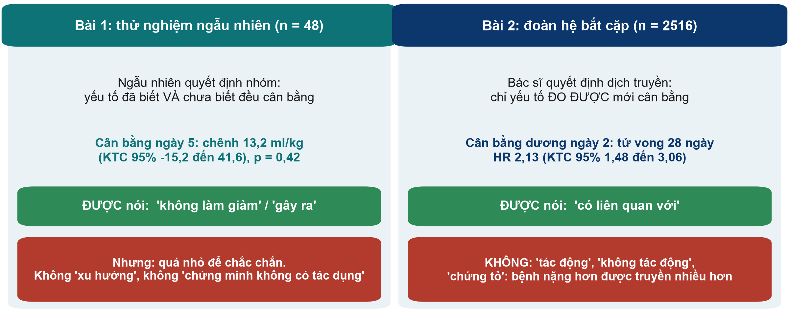{.neu-fig}

::: {.neu-takeaway}
**THÔNG ĐIỆP CHÍNH** Phân nhóm ngẫu nhiên mới được nói 'gây ra'; quan sát chỉ được nói 'có liên quan'.
:::

::: {.notes}
Dùng slide này ở ĐẦU phần thảo luận chung, sau khi nhóm đầu tiên báo cáo, để định khung so sánh.

Bài 1: may rủi quyết định ai nhận chiến lược hạn chế dịch, nên các yếu tố đã biết VÀ chưa biết cân bằng về trung bình, nên thử nghiệm ngẫu nhiên được phép kết luận nhân quả. Kết luận của bài là âm tính: chiến lược không làm giảm cân bằng dịch ngày 5 (chênh 13,2 ml/kg, KTC 95% -15,2 đến 41,6, p = 0,42). Nhưng với 48 bệnh nhân, KTC rất rộng: đây là 'không có bằng chứng về tác dụng', không phải 'bằng chứng không có tác dụng', và chắc chắn không phải 'xu hướng'.

Bài 2: bác sĩ quyết định lượng dịch cho từng bệnh nhân. Bắt cặp điểm xu hướng chỉ cân bằng được các yếu tố đã đo; bệnh nặng hơn được truyền nhiều hơn (nhiễu do chỉ định, Buổi 4) và mức độ nặng không bao giờ đo được đầy đủ. Vì vậy bài chỉ được nói cân bằng dịch dương ngày 2 'có liên quan với' tử vong 28 ngày cao hơn (HR 2,13, KTC 95% 1,48 đến 3,06), không phải 'tác động' hay 'chứng tỏ' quan hệ nhân quả, dù tiêu đề dùng chữ 'Impact'.

Hỏi: nếu phải đổi thực hành ICU ngày mai, bài nào là bằng chứng nhân quả mạnh hơn, bài nào cho biết nhiều hơn về nguy cơ ngoài thực tế? Đáp án: RCT cho nhân quả (nhưng chỉ là thử nghiệm thí điểm nhỏ); đoàn hệ cho một mối liên quan lớn, thực tế, cần thử nghiệm để khẳng định.
:::

## Hai bài báo đặt cạnh nhau

| Bài 1: RCT (Boulet 2024) | Bài 2: đoàn hệ (Hyun 2023) |
|:---|:---|
| Các nhóm tương đồng nhờ | Phân nhóm ngẫu nhiên 1:1 (khối 2) | Bắt cặp điểm xu hướng (chỉ yếu tố đã đo) |
| Ai biết nhóm | Bác sĩ biết; bệnh nhân, thống kê được làm mù | Tất cả (quan sát) |
| Kết quả chính | 13,2 ml/kg (KTC 95% -15,2 đến 41,6), p = 0,42 | Ngày 2: HR 2,13 (1,48 đến 3,06) |
| Hạn chế bị bỏ sót | Khối 2 với bác sĩ không bị làm mù | Sai lệch sống sót (nằm ICU từ 3 ngày) |
| Lỗi lời văn | 'Xu hướng không có ý nghĩa' (p = 0,42) | 'Impact', 'did not impact', 'show' |
| Được kết luận | Không giảm cân bằng dịch ngày 5 (thí điểm nhỏ) | Cân bằng dương liên quan tử vong |

::: {.neu-table-caption}
Số trang và chi tiết: Resources/appraisal\_instructor\_guide.md
:::

::: {.notes}
Chỉ chiếu bảng này ở CUỐI phần thảo luận chung để tổng kết, sau khi các nhóm đã nêu câu trả lời của mình, không chiếu trước.

Từng dòng: các nhóm được làm tương đồng thế nào; ai biết phân nhóm; tác dụng chính với KTC; hạn chế tác giả bỏ sót (Bài 1: khối hoán vị cỡ 2 khiến lần phân nhóm tiếp theo đoán được khi bác sĩ không bị làm mù, trang 3; Bài 2: yêu cầu nằm ICU ít nhất 3 ngày loại bỏ bệnh nhân tử vong hoặc rời ICU sớm (sai lệch người sống sót), trang 2); lỗi lời văn (Bài 1 trang 10; Bài 2 tiêu đề và trang 4); và kết luận mà mỗi thiết kế cho phép.

Cả hai đều là bài tốt, đăng trên tạp chí Q1, và cả hai đều có lỗi sửa được. Đó là trạng thái bình thường của y văn, và vì thế thẩm định là một kỹ năng lâm sàng.
:::

## Thảo luận chung: mỗi thiết kế được kết luận gì?

::: {.neu-banner style="--c:#1F5C7A"}
THẢO LUẬN · 6 phút
:::

:::: {.columns}
::: {.column width="60%"}
::: {.neu-activity-steps style="--c:#1F5C7A"}
- Nhóm 1 và 4 báo cáo câu 1-4 (mỗi nhóm 1 phút)
- Nhóm 2 và 5 báo cáo câu 5-8 (mỗi nhóm 1 phút)
- Nhóm 3 báo cáo câu 9-10 cho Bài 1
- So sánh câu 4, 5 và 8 giữa hai bài
- Biểu quyết câu 10: bài nào sẽ thay đổi thực hành ở khoa ta?
:::
:::
::: {.column width="40%"}
::: {.neu-side .plain style="--c:#1F5C7A"}
Chốt các thông điệp

- Thiết kế quyết định động từ: gây ra hay liên quan
- KTC rộng nghĩa là 'chưa biết'
- Đã đăng không có nghĩa là đúng
- Ghi tên hướng dẫn báo cáo: CONSORT, STROBE
:::
:::
::::

::: {.neu-output style="--c:#1F5C7A"}
**SẢN PHẨM** Mỗi nhóm nêu bài của mình được và không được kết luận gì
:::

::: {.notes}
THẢO LUẬN CHUNG (1:52-2:00). Giữ đúng giờ: 1 phút cho mỗi báo cáo. Chiếu slide 'mỗi thiết kế được kết luận gì' trước và bảng so sánh sau cùng.

Hướng phần so sánh vào câu 4 (ngẫu nhiên hay bắt cặp), câu 5 (làm mù) và câu 8 (lời văn và thiết kế). Nếu còn thời gian, nhóm 5 trả lời câu 9-10 cho Bài 2 sau khi nhóm 3 trả lời cho Bài 1.

Bốn thông điệp chính ở khung bên phải. Nói to từng thông điệp trước khi kết thúc.

Đáp án mẫu cho cả mười câu hai bài: Resources/appraisal\_instructor\_guide.md.

Chuyển tiếp: 'Giờ đến lượt các bạn được phản biện.' Rồi thông báo thứ tự trình bày.
:::

## Từ khóa của Buổi 8

| Thuật ngữ | Nói đơn giản |
|:---|:---|
| Phễu Đặt vấn đề | Đã biết → chưa biết → mục tiêu, trong ba đoạn |
| Sáu bước | Trả lời, so sánh, giải thích, hạn chế, hàm ý, kết luận |
| Lời văn tương xứng | Động từ mạnh đúng mức thiết kế cho phép ('liên quan', không 'gây ra') |
| Tạp chí săn mồi | Thu phí mà không phản biện hay chỉ mục thực sự |
| Trả lời từng ý | Bảng trả lời mọi nhận xét phản biện kèm chỗ đã sửa |
| Tiền ấn phẩm | Bản thảo công khai trước khi phản biện |

::: {.neu-table-caption}
Bảng thuật ngữ đầy đủ (Anh-Việt): Course/References/
:::

::: {.notes}
Đọc sáu thuật ngữ cùng cả lớp trước phần trình bày. Mời một người giải thích bằng lời của mình trước.
:::

## Từ câu hỏi đến công bố: những gì bạn làm được

:::: {.neu-cards style="--n:4"}
::: {.neu-card .plain style="--c:#0D7377"}
[Bảo vệ]{.neu-card-title}

- Đạo đức, chấp thuận, đăng ký
- Dữ liệu và tác giả trung thực
:::
::: {.neu-card .plain style="--c:#0B376C"}
[Viết]{.neu-card-title}

- IMRaD đúng thứ tự
- Con số kèm KTC
- Động từ đúng thiết kế
:::
::: {.neu-card .plain style="--c:#5FA39B"}
[Công bố]{.neu-card-title}

- Bảng kiểm báo cáo
- Tạp chí đáng tin
- Trả lời lịch sự, đầy đủ
:::
::: {.neu-card .plain style="--c:#0070C0"}
[Phản biện]{.neu-card-title}

- 10 câu hỏi
- Mỗi thiết kế được kết luận gì
:::
::::

::: {.neu-takeaway}
**THÔNG ĐIỆP CHÍNH** Tiếp theo: trình bày đề cương và trao đổi bản thảo để phản biện.
:::

::: {.notes}
Thông điệp mang về trước phần trình bày (1 phút). Đọc bốn thẻ; phần bế mạc sẽ nhắc lại những gì khóa học đã xây dựng.

Chuyển tiếp: 'Giờ đến lượt các bạn được phản biện.' Rồi thông báo thứ tự trình bày.
:::

## Các nhóm trình bày  \|  45 phút

:::: {.neu-statement}
::: {.neu-big}
Đề cương và kế hoạch công bố của các bạn
:::

::: {.neu-sub}
6 phút trình bày, 2 phút góp ý: tử tế và cụ thể
:::
::::

::: {.notes}
TRÌNH BÀY (2:00-2:45). Năm nhóm x 8 phút = 40 phút, rồi 5 phút để mỗi nhóm tóm tắt bản thảo trong một câu (hoặc dự phòng). Người bấm giờ rất quan trọng.

Chọn một người bấm giờ trong lớp (hoặc trợ giảng) với thẻ xanh, vàng, đỏ.

Nhắc lớp: kỹ năng phản biện vừa dùng nay áp dụng cho đề cương của chính chúng ta, nhưng góp ý theo cách mà bạn muốn được nhận.
:::

## Cách chấm điểm phần trình bày

| Tiêu chí | Điều chúng tôi tìm | Điểm |
|:---|:---|:---|
| 12  Cấu trúc & nội dung | Đủ 6 slide; thấy rõ câu hỏi, thiết kế, kết cục, cỡ mẫu, đạo đức, tạp chí + hướng dẫn | 0-6 |
| 13  Rõ ràng | Mọi ngành nghề đều hiểu; mỗi slide một thông điệp | 0-6 |
| 14  Hình thức slide | Đọc được từ cuối phòng; hình ảnh thay cho khối chữ | 0-6 |
| 15  Thời gian | Kết thúc trong khoảng 5:00 đến 6:00 | 0-6 |
| 16  Trả lời & làm việc nhóm | Trả lời thẳng, trung thực; nhiều thành viên tham gia | 0-6 |

::: {.neu-table-caption}
6 xuất sắc, 4 tốt, 2 cần cải thiện, 0 chưa có = trình bày /30.  Đề cương viết + kế hoạch công bố /70 chấm sau khóa học.
:::

::: {.notes}
Trong buổi học chỉ chấm PHẦN TRÌNH BÀY: tiêu chí 12-16 trong Course/Assignment/proposal\_rubric.md, mỗi tiêu chí 6/4/2/0 điểm, tổng 30 điểm. Đề cương viết và kế hoạch công bố (tiêu chí 1-11, 70 điểm) được chấm sau khóa học.

Ai chấm: giảng viên chấm mọi nhóm; một nhóm đồng đẳng (luân phiên: Nhóm 2 góp ý Nhóm 1, Nhóm 3 góp ý Nhóm 2 ... Nhóm 1 góp ý Nhóm 5) điền phiếu góp ý ở cuối proposal\_rubric.md.

Góp ý trong 2 phút (Assignment/presentation\_guide.md): nhóm đồng đẳng 45 giây (hai ngôi sao và một mong muốn); giảng viên 60 giây (một điểm mạnh, cải thiện quan trọng nhất, một câu hỏi); nhóm trình bày 15 giây ('cảm ơn', không biện hộ).

Việc trình bày mới quyết định. Điểm là góp ý để nhóm hoàn thiện đề cương trước khi nộp hội đồng đạo đức.
:::

## Thứ tự trình bày và bấm giờ

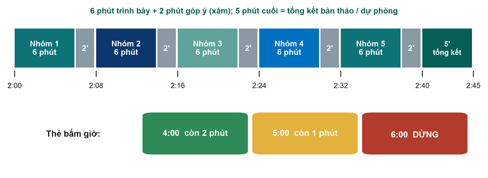{.neu-fig}

::: {.neu-takeaway}
**THÔNG ĐIỆP CHÍNH** Khi thẻ đỏ giơ lên, hãy nói hết câu và dừng.
:::

::: {.notes}
Chiếu thứ tự trình bày. Giờ tính từ lúc bắt đầu buổi học (2:00 = sau hai giờ; nếu bắt đầu 08:00 thì là 10:00-10:45). 2:40-2:45: mỗi nhóm nêu câu hỏi FLUID-ICU và kết quả chính trong một câu, hoặc 5 phút này bù cho phần trình bày bị trễ.

Người bấm giờ giơ thẻ XANH ở phút 4 (còn 2 phút), VÀNG ở phút 5 (còn 1 phút) và ĐỎ ở phút 6 (dừng).

Nhóm tiếp theo lên phía trước trong lúc nhóm trước nhận góp ý. Mọi slide đã ở sẵn trên một máy, nên không đổi USB.

Nếu bị trễ, rút ngắn phần góp ý, không bao giờ rút ngắn bài của các nhóm cuối. Như vậy không công bằng với nhóm trình bày sau cùng.
:::

## Các nhóm trình bày đề cương

::: {.neu-banner style="--c:#0070C0"}
NHÓM TRÌNH BÀY · 45 phút
:::

:::: {.columns}
::: {.column width="60%"}
::: {.neu-activity-steps style="--c:#0070C0"}
- 6 phút, 6 slide: câu hỏi, thiết kế, dữ liệu và phân tích, đạo đức và khả thi, kế hoạch công bố (tiêu đề, tạp chí, hướng dẫn, tóm tắt)
- Người bấm giờ: xanh lúc 4:00, vàng lúc 5:00, đỏ lúc 6:00
- Góp ý 2 phút: nhóm đồng đẳng (hai ngôi sao và một mong muốn), rồi giảng viên
- Nhóm đồng đẳng và giảng viên điền phiếu góp ý
- Nhóm tiếp theo chuẩn bị trong lúc góp ý
:::
:::
::: {.column width="40%"}
::: {.neu-side .plain style="--c:#0070C0"}
Thứ tự

- 2:00  Nhóm 1
- 2:08  Nhóm 2
- 2:16  Nhóm 3
- 2:24  Nhóm 4
- 2:32  Nhóm 5
- 2:40  Tóm tắt bản thảo
:::
:::
::::

::: {.neu-output style="--c:#0070C0"}
**SẢN PHẨM** Năm đề cương và kế hoạch công bố đã trình bày; phiếu góp ý nộp cho giảng viên
:::

::: {.notes}
Để slide này trên màn hình trong lúc trình bày nếu các nhóm trình chiếu từ tệp riêng; nếu không, chuyển sang slide của từng nhóm.

Góp ý của giảng viên: bắt đầu bằng một điểm mạnh thật sự; nêu cải thiện quan trọng nhất cho đề cương viết hoặc kế hoạch công bố (thường về thiết kế, định nghĩa kết cục, tính khả thi hoặc chọn tạp chí và hướng dẫn); một câu hỏi nếu còn thời gian.

Kiểm tra slide 6 của mỗi nhóm: tạp chí dự kiến + đúng hướng dẫn (STROBE cho đoàn hệ, CONSORT cho thử nghiệm), tiêu đề tạm với lời văn tương xứng, vai trò CRediT, một dòng khung tóm tắt.

Vấn đề thường gặp: kết cục không đo được từ dữ liệu thường quy; dự định kết luận nhân quả từ thiết kế quan sát (liên hệ lại bài thẩm định!); không có kế hoạch chấp thuận cho bệnh nhân an thần; tuyển bệnh không thực tế.

Lúc 2:40 mỗi nhóm tóm tắt bản thảo trong một câu (câu hỏi + kết quả chính, mỗi nhóm 1 phút). Lúc 2:45 thu phiếu góp ý và chuyển ngay sang phần bế mạc: kiểm tra cuối khóa, đánh giá và trao đổi bản thảo để phản biện (các slide tiếp theo).
:::

## Slide bổ sung  \|  Buổi 8

:::: {.neu-statement}
::: {.neu-big}
Slide bổ sung: Buổi 8
:::

::: {.neu-sub}
Chỉ dùng khi còn thời gian, hoặc để tự học
:::
::::

::: {.notes}
EXTRA: các slide sau mục này là tùy chọn. Dùng khi còn thời gian hoặc giới thiệu cho học viên tự học.
:::

## Viết cho đúng: sửa câu 'tô vẽ', rồi soạn tiêu đề

::: {.neu-banner style="--c:#0B376C"}
BÀI TẬP CÁ NHÂN · 6 phút
:::

:::: {.columns}
::: {.column width="60%"}
::: {.neu-activity-steps style="--c:#0B376C"}
- Cá nhân (2 phút): viết lại trung thực câu 'xu hướng không có ý nghĩa' của Bài 1
- Cá nhân: viết lại tiêu đề Bài 2 với lời văn tương xứng
- Nhóm (4 phút): soạn tiêu đề tạm từ PICO của nhóm
- Nhóm: mỗi phần một dòng (Đặt vấn đề, Phương pháp, Kết quả dự kiến, Kết luận)
:::
:::
::: {.column width="40%"}
::: {.neu-side .plain style="--c:#0B376C"}
Kế hoạch công bố (Phần 4)

- Tiêu đề tạm
- Khung tóm tắt
- Tác giả + vai trò CRediT
- Tạp chí + hướng dẫn (8.2)
:::
:::
::::

::: {.neu-output style="--c:#0B376C"}
**SẢN PHẨM** Tiêu đề tạm + khung tóm tắt để đưa vào bài trình bày
:::

::: {.notes}
EXTRA: Bài luyện viết 6 phút tùy chọn trên hai bài báo (dùng nếu Thực hành bản thảo 2 xong sớm hoặc làm ở nhà). Phiếu bài tập: Practicals/s8\_exercises.md, Phần A (bài tập viết).

Câu 'tô vẽ' (Bài 1, trang 10): tác giả dựa vào 'xu hướng không có ý nghĩa' của việc giảm cân bằng dịch để đề xuất thử nghiệm lớn hơn. Câu viết lại mẫu: 'Ước lượng điểm nghiêng về chiến lược hạn chế, nhưng KTC 95% rộng (-15,2 đến 41,6 ml/kg) và bao gồm cả không có tác dụng; cần một thử nghiệm lớn hơn để phát hiện chênh lệch nhỏ hơn.'

Tiêu đề (Bài 2): 'Cân bằng dịch dương tích lũy trong ba ngày đầu ICU và tử vong 28 ngày ở bệnh nhân nhiễm khuẩn huyết: nghiên cứu đoàn hệ bắt cặp điểm xu hướng'. Dùng 'liên quan', không phải 'tác động'.

Tiêu đề nhóm: kiểm tra 10-16 từ, nêu thiết kế, không có từ đánh giá. Khung tóm tắt: Kết quả là kết quả DỰ KIẾN, nên viết dạng trình bày, VD 'tử vong 28 ngày, RR (KTC 95%)'.

Nếu còn thời gian, mời 2 nhóm đọc to tiêu đề. Các nhóm đưa tiêu đề và khung tóm tắt vào bài trình bày trong giờ giải lao.
:::

## Bị từ chối? Nộp lại thông minh hơn

::: {.neu-intro}
Bị từ chối là bình thường: đa số bài báo bị từ chối ít nhất một lần.
:::

:::: {.neu-cards style="--n:3"}
::: {.neu-card .plain style="--c:#0D7377"}
[Từ chối ngay]{.neu-card-title}

- Ngoài phạm vi hoặc báo cáo kém
- Thường trong vài ngày
- Chọn lại tạp chí
:::
::: {.neu-card .plain style="--c:#0B376C"}
[Sau phản biện]{.neu-card-title}

- Đọc nhận xét, chờ một ngày
- Sửa những gì họ phát hiện
- Không nộp lại nguyên bản
:::
::: {.neu-card .plain style="--c:#5FA39B"}
[Tạp chí tiếp theo]{.neu-card-title}

- Định dạng theo Hướng dẫn mới
- Dùng đề nghị chuyển bài nếu có
- Chỉ khiếu nại khi có lỗi rõ ràng
:::
::::

::: {.neu-takeaway}
**THÔNG ĐIỆP CHÍNH** Người phản biện tiếp theo có thể vẫn là người cũ. Hãy sửa lỗi trước.
:::

::: {.notes}
EXTRA: Ý chính: bị từ chối là một phần của việc công bố, không phải lời phán xét về bạn. Nhiều bài tốt bị từ chối một hai lần trước khi được nhận.

Từ chối ngay (desk rejection): biên tập từ chối không qua phản biện, thường vì chủ đề không hợp tạp chí hoặc báo cáo kém. Chọn lại: tạp chí mà người đọc cần kết quả của bạn.

Sau phản biện: đọc nhận xét, chờ một ngày trước khi phản ứng, rồi sửa những gì họ phát hiện. Tạp chí tiếp theo trong cùng lĩnh vực thường mời lại chính những người phản biện đó; bản thảo không sửa sẽ làm họ khó chịu.

Tạp chí tiếp theo: định dạng lại theo Hướng dẫn tác giả mới; một số nhà xuất bản đề nghị chuyển bản thảo và nhận xét sang tạp chí chị em, việc này có thể tiết kiệm hàng tháng. Chỉ khiếu nại khi quyết định có lỗi sai rõ ràng về sự kiện.

Không bao giờ nộp cho hai tạp chí cùng lúc (nộp trùng lặp là sai phạm).

Hỏi: việc đầu tiên sau khi bị từ chối là gì? Đáp án: đọc nhận xét để tìm điều cần sửa, không phải để tìm lý do tức giận.
:::

## Tóm tắt hội nghị và áp phích

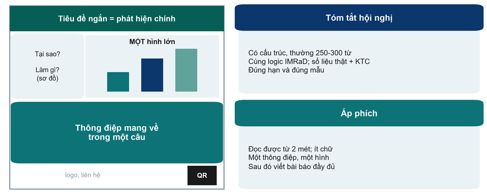{.neu-fig}

::: {.neu-takeaway}
**THÔNG ĐIỆP CHÍNH** Áp phích là bảng quảng cáo: một thông điệp, một hình, đọc được từ 2 mét.
:::

::: {.notes}
EXTRA: Ý chính: tóm tắt hội nghị thường là sản phẩm đầu tiên của một nghiên cứu. Nó theo cùng logic IMRaD như tóm tắt bài báo, thường 250-300 từ, với số liệu thật và khoảng tin cậy. Tóm tắt chỉ ghi 'kết quả sẽ được trình bày' thường bị loại. Tuân theo mẫu và hạn nộp của hội nghị.

Áp phích: một bảng quảng cáo, không phải bài báo dán lên tường. Tiêu đề ngắn nêu phát hiện, vài chữ về đặt vấn đề và phương pháp (một sơ đồ), MỘT hình lớn, thông điệp mang về trong một câu, và mã QR dẫn tới chi tiết. Phải đọc được từ khoảng cách 2 mét.

Trình bày tóm tắt hội nghị thường không cản trở việc đăng bài đầy đủ, nhưng hãy kiểm tra chính sách của tạp chí. Hãy viết bài đầy đủ: nhiều tóm tắt không bao giờ trở thành bài báo.

Có mẫu tóm tắt hội nghị trong Course/Templates/.

Hỏi: hình duy nhất trên áp phích của nhóm bạn sẽ là gì? Đáp án: kết cục chính theo nhóm.
:::

# Kết thúc: những gì bạn đã xây dựng và bước tiếp theo

## Nội dung

- Bài kiểm tra cuối khóa (cùng 24 câu)
- Những gì bạn đã xây dựng trong tám buổi
- Đánh giá khóa học
- Sau khóa học: phản biện chéo các bản thảo
- Bước tiếp theo

::: {.notes}
15 phút cuối của Buổi 8. Giữ nhịp nhanh và tích cực.

Cảm ơn các nhóm đã trình bày trước khi bắt đầu bài kiểm tra.
:::

## Bài kiểm tra cuối khóa

::: {.neu-banner style="--c:#6C3483"}
CÂU HỎI NHANH · 8 phút
:::

::: {.neu-activity-steps style="--c:#6C3483"}
- Cùng 24 câu hỏi như Buổi 1 (nên dùng biểu mẫu trực tuyến)
- Làm cá nhân, không thảo luận
- Ghi cùng mã số học viên như Buổi 1
- Đáp án được gửi sau khóa học
:::

::: {.neu-output style="--c:#6C3483"}
**SẢN PHẨM** Nộp bài (chỉ ghi mã số học viên)
:::

::: {.notes}
Phát cùng bài kiểm tra (biểu mẫu trực tuyến hoặc bản giấy).

Sau buổi học: tính mức thay đổi điểm trung bình trước/sau bằng bảng trong pre\_post\_quiz\_answer\_key và báo cáo cho lãnh đạo khoa trong báo cáo khóa học.
:::

## Những gì bạn đã xây dựng trong tám buổi

:::: {.neu-steps}
::: {.neu-step style="--c:#0D7377"}
[HỎI & TÌM]{.neu-step-label}

- Một câu hỏi PICO
- 5 tài liệu chính
- Tên đề tài dự kiến
:::
::: {.neu-step style="--c:#0B376C"}
[THIẾT KẾ]{.neu-step-label}

- Thiết kế có lý giải
- Kết cục
- Kế hoạch giảm sai lệch
:::
::: {.neu-step style="--c:#5FA39B"}
[PHÂN TÍCH]{.neu-step-label}

- CRF và kế hoạch phân tích
- Đọc và diễn giải một bộ dữ liệu thật
:::
::: {.neu-step style="--c:#0070C0"}
[VIẾT]{.neu-step-label}

- Phương pháp, Kết quả
- Đặt vấn đề, Bàn luận, Tóm tắt
:::
::: {.neu-step style="--c:#055F56"}
[CÔNG BỐ]{.neu-step-label}

- Đề cương đã trình bày
- Bản thảo bài báo
:::
::::

::: {.neu-takeaway}
**THÔNG ĐIỆP CHÍNH** Năm đề cương và năm bản thảo bài báo từ khoa này.
:::

::: {.notes}
Ghi nhận thành quả: mỗi nhóm đã có một đề cương có thể nộp hội đồng đạo đức và một bản thảo bài báo.

Đề nghị mỗi nhóm thống nhất bước tiếp theo trước khi về: ai hoàn thiện đề cương, ngày dự kiến nộp hội đồng đạo đức, ai phụ trách phản biện chéo bản thảo.
:::

## Đánh giá khóa học

::: {.neu-banner style="--c:#0B376C"}
BÀI TẬP CÁ NHÂN · 3 phút
:::

::: {.neu-activity-steps style="--c:#0B376C"}
- Chấm điểm từng buổi: nội dung, tốc độ, mức hữu ích
- Một điều nên giữ, một điều nên thay đổi
- Bạn có quan tâm đến Cấp độ 2 (thực hành R)?
:::

::: {.neu-output style="--c:#0B376C"}
**SẢN PHẨM** Phiếu đánh giá (ẩn danh)
:::

::: {.notes}
Phiếu ngắn ẩn danh (giấy hoặc trực tuyến). Câu hỏi về tốc độ rất quan trọng. Chúng tôi thiết kế khóa học để đi chậm, hãy cho biết như vậy đã phù hợp chưa.
:::

## Sau khóa học: phản biện như tác giả thật

:::: {.neu-steps}
::: {.neu-step style="--c:#0D7377"}
[Tuần 1]{.neu-step-label}

- Hoàn thiện bản thảo
- Nộp cho giảng viên
:::
::: {.neu-step style="--c:#0B376C"}
[Đổi bài]{.neu-step-label}

- Phản biện bài của nhóm khác
- Bảng kiểm 10 câu + kiểm tra cách viết
:::
::: {.neu-step style="--c:#5FA39B"}
[Trả lời]{.neu-step-label}

- Trả lời từng nhận xét
- Mẫu trả lời phản biện
:::
::: {.neu-step style="--c:#0070C0"}
[Tuần 2]{.neu-step-label}

- Bản cuối + thư trả lời
- Giảng viên góp ý
:::
::::

::: {.neu-takeaway}
**THÔNG ĐIỆP CHÍNH** Hạn nộp hai tuần sau Buổi 8 (xem Assignment/peer\_review\_instructions).
:::

::: {.notes}
Giải thích cách đổi bài: nhóm 1 phản biện nhóm 2, 2 phản biện 3, ... 5 phản biện 1.

Phản biện theo Assignment/peer\_review\_instructions.md và bảng kiểm 10 câu. Tác giả trả lời bằng Templates/Response\_to\_Reviewers\_Template.docx.

Đây là bước cuối cùng của toàn bộ quá trình nghiên cứu, đúng như sau khi nộp bài thật.
:::

## Bước tiếp theo

:::: {.neu-cards style="--n:2"}
::: {.neu-card .plain style="--c:#0D7377"}
[Bộ công cụ của bạn]{.neu-card-title}

- Slide, tài liệu phát tay, bảng thuật ngữ
- Mẫu đề cương, đề cương chi tiết, đồng thuận, CRF, SAP,
- bản thảo và trả lời phản biện
:::
::: {.neu-card .plain style="--c:#0B376C"}
[Tiếp tục]{.neu-card-title}

- Đưa đề cương đến hội đồng đạo đức
- Cấp độ 2: thực hành phân tích bằng R
- Cấp độ 3: phương pháp nâng cao
:::
::::

::: {.notes}
Cấp độ 2 (thực hành, cho những ai muốn tự phân tích): dự án R có thể tái lập, quản lý dữ liệu, hồi quy tuyến tính và logistic chuyên sâu, dữ liệu thiếu, bảng và hình đạt chuẩn công bố. Điều kiện: đã học khóa này và khóa miễn phí Phân tích dữ liệu lâm sàng với R của Neudata.

Cấp độ 3 (theo yêu cầu): phương pháp nâng cao cho dữ liệu phức tạp: phân tích gộp, mô hình dự báo và học máy, độ chính xác chẩn đoán, phân tích sống còn nâng cao, mô hình dọc và đa tầng. Xem Course\_Levels/.

Cung cấp thông tin liên hệ của giảng viên để hỏi thêm.
:::

---

:::: {.neu-statement}
::: {.neu-big}
Xin cảm ơn!
:::

::: {.neu-sub}
Câu hỏi tốt. Thiết kế chặt chẽ. Phân tích trung thực. Viết rõ ràng.
:::
::::

::: {.notes}
Cảm ơn lãnh đạo khoa, ban tổ chức và các học viên. Chụp ảnh lưu niệm.
:::
